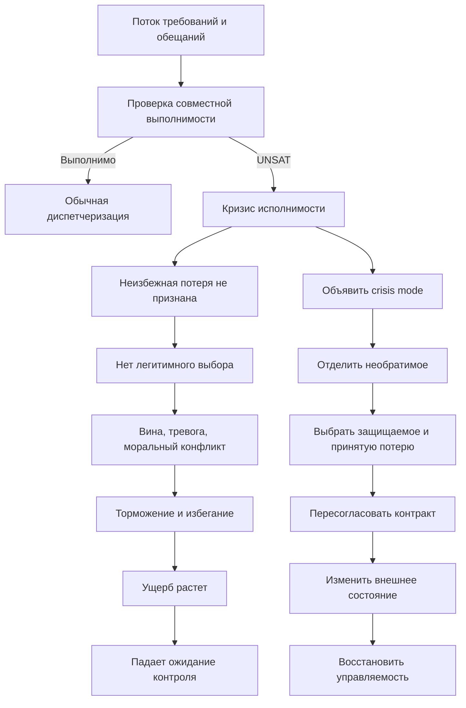

# Карта смысловых связей: кризис исполнимости обязательств

## Как читать карту

Каждый узел отделяет один механизм от соседних, показывает его вклад в будущую версию книги и указывает, где уже лежит дополняющий материал. Центральная модель собрана в последнем блоке [извлеченной беседы](<01-Извлеченная-беседа.md#единая-модель-кризис-исполнимости-обязательств>); это авторский синтез, а не единая академическая теория.

## Короткий граф

## 1. Кризис исполнимости как отдельный объект

**Смысл.** Система перешла из режима исполнения плана в режим ограничения ущерба, когда хорошего исхода уже нет. Ее задача теперь не `сделать все`, а признать потерю, остановить ухудшение, сохранить критические функции и вернуть управляемость.

**Вклад в книгу.** Это недостающий мост между управляемостью действия, личным WIP, прокрастинацией, восстановлением и лидерством. Он показывает структурную причину некоторых эпизодов блокировки.

**Связи.** [Блокирующая вина и выученная беспомощность](<../2026-08-01 - Выученная беспомощность и блокирующая вина/00-Карточка-материала.md>) описывают аффективное закрепление; [личная диспетчеризация](<../2026-08-01 - Координация и диспетчеризация личной деятельности/00-Карточка-материала.md>) описывает обычный режим выбора; [внутренняя энергия и конкуренция целей](<../2026-08-01 - Внутренняя энергия, запуск и конкуренция целей/00-Карточка-материала.md>) показывают, как портфель целей перегружает арбитраж.

## 2. Пустое множество решений: UNSAT

**Смысл.** Несколько твердых условий нельзя удовлетворить одновременно. Любое доступное действие нарушает хотя бы одно из них. Проблема не исчезнет от более тщательной перестановки задач.

**Диагностическая польза.** Запись `нельзя одновременно A и B` локализует конфликт и заменяет глобальное `я не справляюсь` проверяемой моделью ограничений.

**Граница.** Чувство невозможности еще не доказывает реальную невыполнимость. Иногда скрыт ресурс, неизвестен следующий шаг, недостаточна компетентность или цена решения лишь эмоционально высока. См. [разрыв компетентности](#competence-uncertainty).

## 3. Перегрузка не равна кризису

**Смысл.** При перегрузке приемлемый порядок еще существует; при кризисе никакой порядок не сохраняет все обязательства. Обычная приоритезация работает в первом случае, а во втором маскирует необходимость пересогласования.

**Связи.** [Межзадачное окно](<../2026-08-01 - Координация и диспетчеризация личной деятельности/05-Карта-смысловых-связей.md#dispatch-window>) и [легитимация выбора](<../2026-08-01 - Координация и диспетчеризация личной деятельности/05-Карта-смысловых-связей.md#legitimacy>) нужны, когда допустимые варианты есть. Этот материал добавляет ветку, где выбор требует ослабить прежний контракт.

**Практическое правило.** Сначала проверять выполнимость, затем выбирать следующую задачу. Иначе диспетчер пытается оптимизировать пустое множество решений.

## 4. Ликвидность времени, долгосрочная выполнимость и полномочия

**Смысл.** Один и тот же субъективный тупик может иметь три разные причины: недостаток мощности до ближайших сроков; устойчивое превышение потока обещаний над производительностью; отсутствие права решить, какой ущерб принять.

**Связи.** [Распределение ресурсов](<../2026-06-25 - Стратегии распределения ресурсов/00-Карточка-материала.md>) дает пол, ставку и буфер; [future-promise WIP](<../2026-08-01 - Внутренняя энергия, запуск и конкуренция целей/04-Карта-смысловых-связей.md#future-promises>) показывает, как будущие обещания заранее продают емкость; [ownership](<../2026-06-19 - Сотрудник-владелец области/00-Карточка-материала.md>) связывает ответственность с реальными полномочиями.

**Граница переноса.** Термины ликвидности и платежеспособности являются полезной аналогией, а не валидированной психологической классификацией.

## 5. WIP моральных контрактов

**Смысл.** Активная задача несет не только стоимость переключения, но и ожидание адресата, срок, риск доверия и внутренний долг. Поэтому backlog может стать полем незакрытых моральных контрактов.

**Связи.** [Личный WIP](<../2026-08-01 - Координация и диспетчеризация личной деятельности/05-Карта-смысловых-связей.md#wip>) ограничивает активную поверхность; [сохранение, арбитраж и обязательство](<../2026-08-01 - Внутренняя энергия, запуск и конкуренция целей/04-Карта-смысловых-связей.md#preservation-vs-commitment>) запрещают превращать каждую сохраненную возможность в обещание.

**Инженерный вывод.** Запрос, задача в очереди, работа в фокусе и обещание результата к сроку должны иметь разные состояния.

## 6. Морализация очереди и долговая спираль

**Смысл.** Рост несделанного зависит и от входящего потока. Если его автоматически читать как доказательство личной неэффективности, человек пытается погасить системный долг ресурсом семьи, сна и следующего дня.

**Связи.** [Хронический стресс и операционный redesign](<../2026-07-05 - Восстановление при постоянном стрессе/00-Карточка-материала.md>) показывают контур `demands -> poor detachment -> exhaustion`; [распределение ресурсов](<../2026-06-25 - Стратегии распределения ресурсов/00-Карточка-материала.md>) защищает минимальные уровни обслуживания и буфер.

**Проверка.** Разделять arrivals, throughput, age of work, число твердых сроков, rework, interruptions и доступную мощность. Метрика `backlog уменьшился` сама по себе не оценивает качество дня.

## 7. Вина как ремонт, стыд как приговор

**Смысл.** Вина привязана к поступку и адресату: `я нарушил обязательство`. Стыд глобализует вывод: `я ненадежный человек`. Первая может направить адресный repair, второй чаще провоцирует сокрытие и self-attack.

**Связи.** [Узел guilt/shame](<../2026-08-01 - Выученная беспомощность и блокирующая вина/04-Карта-смысловых-связей.md#guilt-shame>) дает подробную дифференциацию; [обучение на ошибках](<../2026-06-25 - Обучение на ошибках/00-Карточка-материала.md>) переводит сбой в коррекцию без снятия ответственности.

**Новый вклад.** Даже адаптивная вина может блокировать, когда она требует одновременно исправить несколько несовместимых нарушений. Тогда сначала нужен triage, а уже затем адресный repair.

## 8. Конфликт ролей и моральный конфликт

**Смысл.** Рабочая и семейная роли могут конкурировать за одно время и переносить напряжение между контурами. Моральный конфликт возникает, когда несколько требований имеют нормативную силу, но совместного правильного действия нет.

**Связи.** [Искусство влияния](<../2026-07-05 - Искусство влияния/00-Карточка-материала.md>) дает этичную коммуникацию и переговоры; [стратегии распределения ресурсов](<../2026-06-25 - Стратегии распределения ресурсов/00-Карточка-материала.md>) помогают заранее защищать несколько жизненных систем.

**Граница.** Moral distress имеет несколько конкурирующих определений и сильную историю в healthcare. Перенос на обычный рабочий вечер требует осторожной формулировки `моральный конфликт или переживание морального ограничения`.

## 9. Action crisis и загнанность

**Смысл.** Action crisis описывает конфликт между продолжением и прекращением цели после накопления трудностей. Entrapment добавляет переживание `хочу выйти, но не вижу выхода`.

**Связи.** [Почему люди сдаются раньше потенциала](<../2026-06-25 - Почему люди сдаются раньше потенциала/00-Карточка-материала.md>) разбирает disengagement и self-efficacy; [блокирующая вина](<../2026-08-01 - Выученная беспомощность и блокирующая вина/00-Карточка-материала.md>) показывает переход от локального долга к пассивности.

**Граница.** Один эпизод выбора между работой и домом не равен клиническому entrapment. Этот конструкт особенно исследован в депрессии и суицидальности.

## 10. Угроза, threat-rigidity и торможение

**Смысл.** Социальная и моральная угроза может сужать внимание, усиливать привычные реакции и задерживать гибкий выбор. Freezing является более специальным психофизиологическим понятием и не должно служить универсальным объяснением бездействия.

**Связи.** [Сонливость, перевозбуждение и блокировка запуска](<../2026-08-01 - Сонливость, перевозбуждение и блокировка запуска/00-Карточка-материала.md>) разводят сонливость, физическую утомляемость, тревожное возбуждение и исполнительный запуск; [порог мобилизации](<../2026-06-27 - Порог мобилизации и усилия/00-Карточка-материала.md>) показывает цену первого контакта.

**Граница.** Сдавливание груди, живота или горла не идентифицирует конкретную эмоцию или нейрофизиологический режим.

## 11. Избегание как краткосрочное обезболивание

**Смысл.** Контакт с задачей одновременно активирует все нарушенные обязательства. Отсрочка на несколько минут уменьшает аффект, поэтому получает быстрое подкрепление, хотя ухудшает будущую ситуацию.

**Связи.** [Избегание как mood repair](<../2026-08-01 - Выученная беспомощность и блокирующая вина/04-Карта-смысловых-связей.md#avoidance>) дает основной механизм; [вредное поведение и привычки](<../2026-06-25 - Вредное поведение и полезные привычки/00-Карточка-материала.md>) показывает петлю подкрепления.

**Новый вклад.** Уменьшение задачи не всегда достаточно: если первый шаг молча выбирает, кому будет нанесен ущерб, а этот выбор не легитимирован, аффект быстро возвращается.

## 12. Легитимация неизбежной потери

**Смысл.** Центральная операция кризисного режима - признать, что безубыточный исход уже недоступен, назвать защищаемое и явно принять ограниченную потерю. Это превращает невозможный поиск в разрешенную задачу.

**Связи.** [Легитимация обычного выбора](<../2026-08-01 - Координация и диспетчеризация личной деятельности/05-Карта-смысловых-связей.md#legitimacy>) временно паркует хорошие альтернативы; здесь легитимация сильнее, потому что одна из сторон действительно понесет ущерб. [Минимальный ремонт обязательства](<../2026-08-01 - Выученная беспомощность и блокирующая вина/04-Карта-смысловых-связей.md#repair-protocol>) начинается после этого решения.

**Этика.** Принятие неизбежной потери не оправдывает предотвратимый вред и не снимает обязанность сообщить, компенсировать и изменить систему.

## 13. Личный incident mode

**Смысл.** На короткое время обычный portfolio mode заменяется одним rescue objective, явными полномочиями, узким operational period, общей картиной состояния и критерием выхода.

**Связи.** [Поиск новых решений](<../2026-06-27 - Поиск новых решений/00-Карточка-материала.md>) описывает incident management, sensemaking и bounded experiments; [личная диспетчеризация](<../2026-08-01 - Координация и диспетчеризация личной деятельности/00-Карточка-материала.md>) дает штатный режим до и после инцидента.

**Граница переноса.** ICS и crisis management разработаны для коллективных систем. Личный incident mode является функциональной инженерной адаптацией.

## 14. Пересогласование меняет пространство решений

**Смысл.** Коммуникация не только сообщает о кризисе. Она может изменить срок, объем, качество, порядок, ресурс или владельца решения, то есть вернуть непустое множество допустимых вариантов.

**Связи.** [Искусство влияния](<../2026-07-05 - Искусство влияния/00-Карточка-материала.md>) дает доверие, ясность и переговорные рамки; [сотрудник-владелец области](<../2026-06-19 - Сотрудник-владелец области/00-Карточка-материала.md>) требует эскалации риска вместе с вариантами решения.

**Практика.** Факт, риск, готовое, предлагаемое изменение, требуемое решение и следующий статус полезнее оптимистического обещания или самоунижения.

## 15. Действие, меняющее внешнее состояние

**Смысл.** После triage нужен не самый легкий шаг, а действие с наблюдаемым эффектом: отправить статус, получить решение, сохранить артефакт, остановить рост ущерба или оставить дешевый вход.

**Связи.** [Первый контакт](<../2026-06-28 - Практика преодоления и первый контакт/00-Карточка-материала.md>) дает механику запуска; [отношение к ошибкам](<../2026-06-19 - Отношение к ошибкам и конструктивные действия/00-Карточка-материала.md>) переводит проблему в repair и action item.

**Порядок.** Implementation intention автоматизирует уже принятое решение. Она не выбирает цель, потерю или ценность.

## 16. Восстановление причинной связи действие -> результат

**Смысл.** После кризиса полезно фиксировать конкретные случаи, где сообщение, отказ, сохранение контекста или остановка действительно изменили внешний результат. Это обучение контролируемости, а не позитивная переоценка.

**Связи.** [Обучение контролируемости](<../2026-08-01 - Выученная беспомощность и блокирующая вина/04-Карта-смысловых-связей.md#control-learning>) дает научную рамку; [индивидуальная агентность](<../2026-06-18 - Индивидуальная агентность и хроническая пассивность/00-Карточка-материала.md>) связывает ожидаемый контроль с действием и средой.

**Граница.** Если реальных рычагов нет, доказательства контроля нельзя симулировать. Нужны полномочия, ресурс или выход из опасной системы.

## 17. Кризисное решение и право на восстановление

**Смысл.** Обычный shutdown контейнирует выполнимое незавершенное. При истинной несовместимости он не закроет контур, пока старые обязательства считаются одновременно действующими. Сначала нужно изменить контракт, затем сохранять контекст и выходить.

**Связи.** [Невозможность расслабиться после продуктивного дня](<../../Новые темы/2026-07-03 - Невозможность расслабиться после продуктивного дня/00-Карточка-материала.md>) дает контур выхода из WIP; [сонливость и перевозбуждение](<../2026-08-01 - Сонливость, перевозбуждение и блокировка запуска/03-Карта-смысловых-связей.md#rest-permission>) дают разрешение на восстановление; [хронический стресс](<../2026-07-05 - Восстановление при постоянном стрессе/00-Карточка-материала.md>) показывает цену повторяющихся незакрытых кризисов.

**Правило.** Восстановление является защищаемой функцией системы, а не остатком после всех обещаний.

## 18. Admission control, WIP, буфер и ранний триггер

**Смысл.** Повторяющийся кризис требует архитектурного ответа: новое обещание вытесняет старое; число активных контрактов ограничено; резерв не продан заранее; кризис объявляется после исчезновения правдоподобного плана, а не после срыва.

**Связи.** [Backpressure и headroom](<../2026-08-01 - Внутренняя энергия, запуск и конкуренция целей/04-Карта-смысловых-связей.md#backpressure-headroom>) защищают мощность; [стратегии самопланирования](<../2026-06-27 - Стратегии самопланирования/00-Карточка-материала.md>) дают review и внешний контур; [распределение ресурсов](<../2026-06-25 - Стратегии распределения ресурсов/00-Карточка-материала.md>) защищает полы и буферы.

**Сверхурочная работа.** Она допустима как объявленный конечный инцидент с явным ущербом, критерием выхода и восстановлением, но не как постоянный невидимый буфер.

## 19. Организационная выполнимость и лидерство

**Смысл.** Нельзя требовать ownership без права ограничить WIP, отказаться от входящего, изменить scope, эскалировать риск или получить решение. Иначе структурная несовместимость превращается в персональную вину.

**Связи.** [Организационное производство беспомощности](<../2026-08-01 - Выученная беспомощность и блокирующая вина/04-Карта-смысловых-связей.md#organization>) показывает вред псевдоавтономии; [сотрудник-владелец области](<../2026-06-19 - Сотрудник-владелец области/00-Карточка-материала.md>) связывает ответственность с decision rights; [обучение на ошибках](<../2026-06-25 - Обучение на ошибках/00-Карточка-материала.md>) дает AAR и Just Culture.

**Лидерский критерий.** Хорошая среда делает несовместимость видимой до героизма и дает безопасную процедуру выбрать ограниченный ущерб.

## 20. Невыполнимость или недостаток знания

**Смысл.** Иногда множество решений кажется пустым, потому что человек не умеет оценить объем, не знает варианта решения или не различает исполнение и разведку. Это кризис неопределенности, а не доказанная невыполнимость.

**Связи.** [Компетентность как капитал](<../2026-08-01 - Компетентность как капитал и инженерия экспертизы/00-Карточка-материала.md>) требует отдельного бюджета снижения неопределенности; [лестница ограниченных обязательств](<../2026-08-01 - Компетентность как капитал и инженерия экспертизы/05-Карта-смысловых-связей.md#bounded-commitment>) не позволяет обещать точную поставку до разведки.

**Проверка.** Если короткий spike, консультация эксперта или ограниченный эксперимент может открыть новый класс решений, сначала покупать информацию. Если твердые сроки уже несовместимы даже с лучшей доступной оценкой, нужен crisis mode.

## 21. Evidence и clinical boundaries

**Смысл.** В пакет соединены разные поля: moral emotions, work-family conflict, action crisis, entrapment, procrastination, controllability, goal adjustment, crisis management, ICS, HRO и turnaround. Их совместная архитектура правдоподобна, но не проверена одним исследованием или RCT.

**Нельзя смешивать.** Один рабочий вечер не равен депрессии, learned helplessness, moral injury или клиническому entrapment. Тяжелая безнадежность, суицидальные мысли, паника, навязчивое checking, стойкая бессонница, депрессивное снижение функционирования, мания/гипомания, ADHD или burnout требуют профильной оценки, а не только карточки triage.

**Связи.** [Карта источников](<06-Карта-источников.md>) отделяет прямую опору от переноса; [дифференциальная диагностика беспомощности](<../2026-08-01 - Выученная беспомощность и блокирующая вина/04-Карта-смысловых-связей.md#interventions>) и [границы сонливости/перевозбуждения](<../2026-08-01 - Сонливость, перевозбуждение и блокировка запуска/03-Карта-смысловых-связей.md#clinical>) дают соседние маршруты.

## Карта обратных ссылок

Обратные ссылки на этот dossier должны сохраняться как минимум в следующих материалах:

- [Выученная беспомощность и блокирующая вина](<../2026-08-01 - Выученная беспомощность и блокирующая вина/00-Карточка-материала.md>) - структурная невыполнимость, легитимация потери и восстановление контроля.
- [Координация и диспетчеризация личной деятельности](<../2026-08-01 - Координация и диспетчеризация личной деятельности/00-Карточка-материала.md>) - граница между обычным выбором и crisis mode.
- [Сонливость, перевозбуждение и блокировка запуска](<../2026-08-01 - Сонливость, перевозбуждение и блокировка запуска/00-Карточка-материала.md>) - структурный конфликт против ресурсного или исполнительного состояния.
- [Внутренняя энергия, запуск и конкуренция целей](<../2026-08-01 - Внутренняя энергия, запуск и конкуренция целей/00-Карточка-материала.md>) - future-promise WIP, backpressure и долгосрочная выполнимость.
- [Компетентность как капитал](<../2026-08-01 - Компетентность как капитал и инженерия экспертизы/00-Карточка-материала.md>) - неизвестная выполнимость и ограниченные обязательства.
- [Невозможность расслабиться после продуктивного дня](<../../Новые темы/2026-07-03 - Невозможность расслабиться после продуктивного дня/00-Карточка-материала.md>) - shutdown после пересогласования.
- [Восстановление при постоянном стрессе](<../2026-07-05 - Восстановление при постоянном стрессе/00-Карточка-материала.md>) - повторяющийся crisis mode как дефект операционной модели.
- [Стратегии распределения ресурсов](<../2026-06-25 - Стратегии распределения ресурсов/00-Карточка-материала.md>) - защищаемые функции, буфер и бюджет потерь.
- [Практика преодоления и первый контакт](<../2026-06-28 - Практика преодоления и первый контакт/00-Карточка-материала.md>) - first contact после triage, а не вместо него.

## Как использовать карту при сборке новой версии

1. Сначала определить смысловой узел, а не переносить dossier целиком.
2. Проверить, является ли проблема структурной невыполнимостью, перегрузкой, неопределенностью, ресурсным состоянием или клиническим профилем.
3. Для каждого практического совета назвать момент применения: до кризиса, во время triage, после выбора или после стабилизации.
4. Рядом с организационной аналогией явно писать, что именно переносится функционально и чего исследования личной саморегуляции напрямую не проверяли.
5. Перед количественным или клиническим утверждением пройти gate из `06-Карта-источников.md`.
