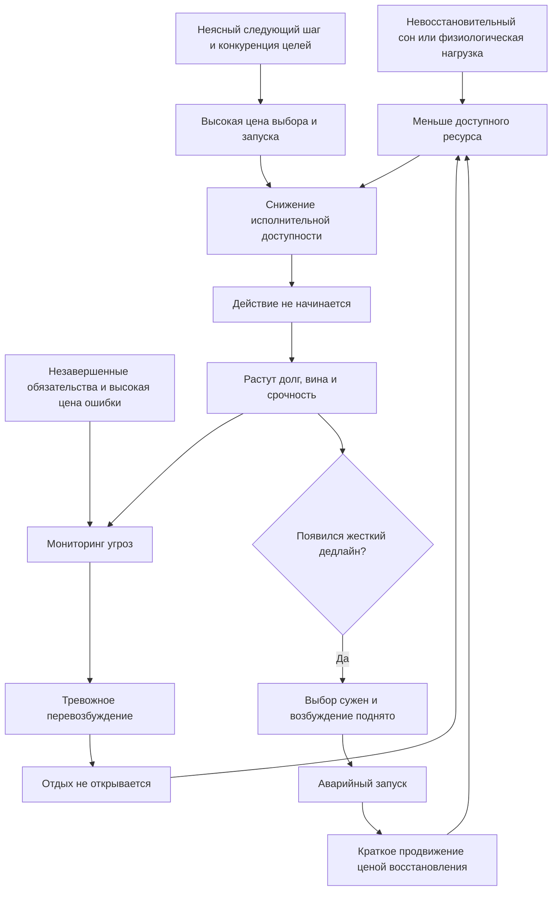

# Выжимка для книги: сонливость, перевозбуждение и блокировка запуска

## Центральный феномен

Иногда человек не может ни восстановиться, ни начать работу. Тело просит снизить нагрузку, но мысли продолжают сканировать незавершенные обязательства. Сканирование не превращается в план, а план - в первое действие. В результате сохраняются напряжение, вина и ощущение угрозы, хотя полезной работы не происходит.

Такое состояние удобно описывать как **двойную блокировку перехода**:

- переход к восстановлению не разрешен, потому что незавершенное не контейнировано или переживается как угроза;
- переход к действию не открывается, потому что выбор, декомпозиция и запуск требуют недоступных сейчас исполнительных ресурсов.

Это описание не является диагнозом. Один и тот же внешний рисунок могут создавать нарушения сна, соматическая болезнь, побочные эффекты веществ, тревога, депрессия, ADHD/executive dysfunction, хронический стресс, post-exertional malaise или среда с неограниченным WIP.

## Рабочие различения

**Сонливость** - склонность заснуть или необходимость прикладывать усилие, чтобы не заснуть. Она не равна общей усталости и может сосуществовать с невозможностью уснуть из-за высокого когнитивного возбуждения.

**Физическая утомляемость** - непропорциональное истощение, слабость или ухудшение телесной работоспособности при нагрузке. Здесь важны соматические причины, лекарства, питание, переносимость нагрузки и возможный отложенный откат.

**Тревожное перевозбуждение** - режим, в котором система продолжает мониторить угрозы и обязательства, хотя не производит решение. Человек устал, но внутренне не выключен.

**Блокировка запуска** - разрыв между намерением и первым наблюдаемым действием. Важность задачи понятна, физическая возможность может сохраняться, но старт открывается главным образом срочностью, интересом, внешним присутствием или однозначным cue.

**Доступность запуска** - текущая способность превратить выбранное намерение в первый наблюдаемый контакт. Она зависит не только от `мотивации`, но и от ясности, числа конкурирующих целей, возбуждения, сна, ресурса, среды и внешней поддержки.

## Причинная архитектура

Схема синтетическая. Она связывает несколько исследовательских и клинических линий; как единая причинная модель она не валидирована.

## Семь ключевых тезисов

1. `Нет энергии` - слишком грубая категория. Сначала нужно развести сонливость, физическую утомляемость, возбуждение и запуск.
2. Невозможность уснуть не исключает сонливость: сонное давление и когнитивное возбуждение могут действовать одновременно.
3. Дедлайн не обязательно создает ресурс. Он может временно убрать выбор, легитимировать единственный приоритет и поднять возбуждение выше порога запуска.
4. Мысль `надо сделать X` удерживает обязательство, но не задает первый шаг, достаточный результат, длительность и право остановиться. Поэтому тревожный контроль способен сосуществовать с бездействием.
5. Добавки помогают при конкретном дефиците или показании, но не являются универсальным топливом исполнительной системы. Стимуляция может маскировать сонливость и усиливать перевозбуждение.
6. Внешний контейнер, первый наблюдаемый артефакт и внешний пусковой сигнал полезны как проверки механизма запуска, но не заменяют диагностику сна, соматики и клинических состояний.
7. Практика преодоления допустима только после проверки ресурса и безопасности. При post-exertional malaise, выраженной сонливости, тяжелой депрессии или другой клинике стратегия `продавить старт` может навредить.

## Дифференциальная карта

| Возможный механизм | Что человек замечает | Что проверить | Инженерный или клинический маршрут |
| --- | --- | --- | --- |
| Недостаток или плохое качество сна | Клюет носом, трудно держать глаза открытыми, сон не восстанавливает | Длительность и регулярность сна, храп, паузы дыхания, пробуждения, утренние симптомы | Sleep hygiene как базовый слой; при признаках апноэ или стойкой дневной сонливости - врач и исследование сна |
| Соматическая причина или побочный эффект | Слабость, одышка, сердцебиение, головокружение, новое падение переносимости | Динамика симптомов, лекарства и вещества, направленная оценка врачом | Не собирать случайный стек добавок; обсуждать целевые обследования и лечение причины |
| Post-exertional malaise | Ухудшение через часы или на следующий день после небольшой нагрузки, восстановление длится днями | Дневник `нагрузка -> задержка -> симптомы -> длительность` | Не наращивать нагрузку автоматически; клиническая оценка и pacing-informed маршрут |
| Исполнительная блокировка | Срочное или интересное запускается, абстрактное - нет; после старта работа иногда идет нормально | История с детства, несколько сфер жизни, эффект ясного первого шага и внешнего cue | Уменьшить выбор, подготовить первый контакт, использовать внешнюю структуру; при стойком lifelong-паттерне - оценка ADHD/EF |
| Тревожное перевозбуждение | Лежа продолжается сканирование обязательств; отдых вызывает вину | Уходит ли напряжение после контейнирования; насколько мысли управляемы и генерализованы | Короткая выгрузка, граница следующего review, detachment; при стойкой плохо контролируемой тревоге - профессиональная оценка |
| Депрессивный компонент | Не открываются также приятные занятия, ангедония, безнадежность, замедление | Масштаб, длительность, суточная динамика, базовое функционирование, суицидальные мысли | Не морализировать и не лечить продуктивностью; клиническая помощь |
| Средовой перегруз и личный WIP | Слишком много равноприоритетных обязательств, постоянные прерывания и доступность | Реальный объем обязательств, полномочия, interruptions, возможность отказа | Сократить активную поверхность, пересогласовать нагрузку, защитить фокус и восстановление |

## Наблюдение без самодиагностики

В исходной беседе предложены две триады: `С-Ф-З` для общей картины и `С-Н-З` для эпизода тупика. Для книги их лучше объединить в четыре независимые шкалы `С-Ф-Н-З` от 0 до 10:

- `С` - насколько хочется именно уснуть;
- `Ф` - насколько тело физически истощено или плохо переносит нагрузку;
- `Н` - насколько высоко внутреннее напряжение и мониторинг незавершенного;
- `З` - насколько трудно выполнить уже выбранное первое действие.

Рядом фиксируются сон, вещества, контекст задачи, нагрузка в предыдущие 48 часов и то, что реально открыло или не открыло действие. Это феноменологический журнал, а не диагностический тест. Его польза - не в среднем балле, а в различении паттернов:

- высокий `С` независимо от задач усиливает приоритет проверки сна;
- высокий `Ф` и отложенный откат требуют осторожности с нагрузкой;
- высокий `Н` при попытке отдыхать указывает на незакрытый контур и/или тревогу;
- высокий `З`, который падает после ясного шага или внешнего cue, указывает на исполнительный барьер;
- высокие значения по всем шкалам означают, что одной техникой запуска состояние не объяснить.

## Протокол выхода из тупика

Исходный протокол `3-20-7` полезен как проверяемая авторская сборка, но не как валидированное лечение.

### 1. Три минуты: вынести мониторинг наружу

Зафиксировать только то, что прямо сейчас удерживается в голове. Каждая запись получает одно из решений:

- не сегодня, с конкретным следующим review;
- ожидается внешний ответ;
- одно наблюдаемое физическое действие.

Задача шага - прекратить фоновое удержание, а не провести полный обзор проектов. Если выгрузка открывает десятки новых контекстов, она сама стала работой.

### 2. Двадцать минут: отдых без требования уснуть

Следующий контакт уже назначен, будильник установлен, новые мысли только записываются. Цель - не добиться сна или идеального расслабления, а временно прекратить обработку задач. Если лежание усиливает руминацию, можно выбрать спокойное сидение или медленную прогулку без цифровых work cues.

### 3. Семь минут: запустить артефакт, а не проект

После сигнала не выбирать задачу заново. Выполнить заранее записанное действие и создать минимальный наблюдаемый след: несколько строк, один вопрос, один воспроизведенный дефект, одна очищенная поверхность. По окончании разрешено остановиться без `компенсации` всего накопленного.

### 4. После двух неудачных запусков: сменить механизм

Не добавлять самодавление. Подключить внешний cue: короткое обещание показать первый результат, молчаливое совместное присутствие, заранее подготовленный файл или автоматическое открытие рабочего контекста. Сильный эффект внешнего сигнала - информация о механизме, а не доказательство диагноза.

## Почему отдельные компоненты могут работать

| Компонент | Какой барьер он адресует | Что будет признаком попадания | Что будет признаком ошибки |
| --- | --- | --- | --- |
| Короткая выгрузка | Проспективная память и мониторинг незавершенного | Мысль перестает требовать повторного удержания | Список растет, начинается перепланирование всей жизни |
| Назначенный первый контакт | Неопределенность следующего шага | После cue не требуется новый выбор | Формулировка остается абстрактной: `поработать над` |
| Разрешение остановиться | Угроза бесконечной задачи | Порог входа снижается | Разрешение используется для избегания всякого контакта неделями |
| Восстановительная пауза | Перевозбуждение и снижение ресурса | После паузы меньше мониторинга или легче выбрать действие | Пауза усиливает руминацию или откладывает необходимую медицинскую оценку |
| Первый артефакт | Слишком высокая цена входа | Появляется конкретная обратная связь | Даже минимальный контакт вызывает выраженный физический откат |
| Внешний запуск | Недостаток self-generated cue и авторизации | Старт существенно надежнее рядом с другим человеком | Возникает зависимость от контроля, стыд или нарушение автономии |

## Открытые контуры и разрешение на отдых

Короткий фиксированный review может снижать фоновый мониторинг, если он завершает выбор. Для каждого обязательства достаточно одного решения: следующий физический шаг, дата повторного рассмотрения, ожидание/делегирование или сознательное закрытие.

Предложение держать `не более трех активных позиций` - не научно установленный оптимум, а инженерное ограничение для малой активной поверхности. Конкретное число должно адаптироваться к роли и контексту; принцип важнее цифры: полный реестр обязательств не должен присутствовать в каждом текущем выборе.

Review перестает помогать, когда он:

- вызывает исследование и выполнение задач вместо контейнирования;
- не имеет временной границы;
- оставляет все позиции активными;
- проводится непосредственно перед сном и повторно активирует рабочий контур;
- не дает права отказаться, пересогласовать или перенести.

## Добавки, электролиты и кофеин

Для книги нужен простой принцип: **добавка корректирует дефицит или конкретное показание, а не добавляет универсальную жизненную энергию**.

- Железо может существенно помочь при дефиците, но самостоятельный прием без оценки опасен и способен скрыть причину.
- B12 важен при дефиците и факторах риска; у человека с достаточным уровнем он не является усилителем энергии.
- Витамин D и магний не являются стимуляторами; показания и безопасные пределы нужно сверять по актуальным рекомендациям.
- Высокодозные B-комплексы несут собственные риски, в частности при избытке B6.
- Электролитные напитки уместны при реальной потере воды и солей; при обычной сидячей работе они не лечат блокировку запуска.
- Кофеин может уменьшить сонливость и одновременно повысить тревожное возбуждение, ухудшить последующий сон и закрепить аварийный цикл. Его эффект следует оценивать по времени приема, дозе, сну и напряжению, а не только по краткому подъему работоспособности.

Точные дозировки, лабораторные панели и возрастно-страновые рекомендации быстро меняются и не должны переноситься в учебник из одной беседы без отдельной медицинской редакции.

## Red flags

Self-help протокол недостаточен при боли в груди, выраженной одышке, обмороке, новом неврологическом нарушении, суицидальных мыслях, резком функциональном падении или невозможности поддерживать базовый уход за собой. Срочность помощи зависит от симптомов и локальных правил медицинской системы.

Плановая профессиональная оценка особенно важна при стойкой дневной сонливости, невосстановительном сне и признаках апноэ, необъяснимой физической слабости, прогрессирующих симптомах, отложенном ухудшении после малой нагрузки, ангедонии и безнадежности, плохо контролируемой тревоге или lifelong-паттерне исполнительных трудностей в нескольких сферах.

## Что нельзя утверждать

- Нельзя по реакции на дедлайн, кофеин, body doubling или микрошаг диагностировать ADHD.
- Нельзя считать невозможность дневного сна доказательством отсутствия сонливости.
- Нельзя называть всякую усталость `выгоранием`, `дефицитом дофамина` или недостатком силы воли.
- Нельзя автоматически советовать наращивание физической нагрузки без проверки post-exertional malaise.
- Нельзя обещать, что витамины, магний, электролиты или адаптогены повысят мотивацию при отсутствии дефицита или показания.
- Нельзя подавать `3-20-7`, `С-Ф-Н-З`, фиксированные тайминги, максимум три активные задачи или внешний запуск как валидированные универсальные протоколы.
- Нельзя превращать clinical red flags в самодиагностику или список обязательных анализов для каждого читателя.

## Редакторское размещение

Материал лучше распределить по книге:

1. В разделе о цене усилия - различие ресурса и доступности запуска.
2. В разделе о сне и восстановлении - состояние `устал, но перевозбужден` и запрет на отождествление усталости с сонливостью.
3. В разделе о прокрастинации - срочность как аварийный внешний диспетчер.
4. В разделе о WIP - мониторинг незавершенного и малая активная поверхность.
5. В разделе о первом контакте - первый наблюдаемый артефакт и внешний cue.
6. В практикуме - шкалы наблюдения и механизм-ориентированный протокол.
7. В разделе о границах - сон, соматика, ADHD, депрессия, тревога, ME/CFS/PEM, добавки и быстрые медицинские рекомендации.
