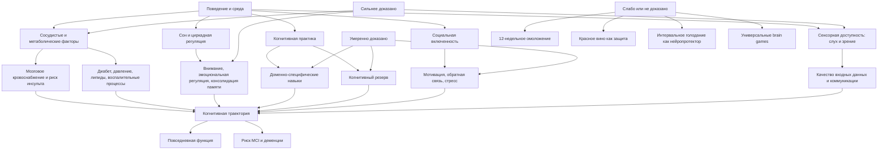

# "Устойчивый мозг" Санджая Гупты: детальный фактчекинг и инженерная реконструкция

## Исполнительное резюме

Основная конструкция книги Sanjay Gupta "Keep Sharp: Build a Better Brain at Any Age" научно состоятельна: когнитивное старение не определяется одним фактором, а здоровье мозга связано с физической активностью, сосудисто-метаболическим состоянием, слухом, сном, интеллектуальной и социальной активностью. В 2024 году Lancet Commission оценила совокупную долю случаев деменции, статистически связанную с 14 потенциально модифицируемыми факторами риска, примерно в 45%. В обновленных рекомендациях ВОЗ 2026 года также подчеркиваются физическая активность, отказ от табака, ограничение алкоголя, контроль давления, диабета и холестерина, коррекция потери слуха, здоровое питание и социальная включенность. citeturn1search20turn15search0turn15search3

Однако книга систематически смешивает четыре разных уровня знания:

| Уровень | Пример | Что допустимо заключать |
|---|---|---|
| Биологический механизм | Физическая нагрузка влияет на нейротрофические и сосудистые процессы | Механизм правдоподобен, но сам по себе не доказывает профилактику деменции |
| Краткосрочный когнитивный эффект | После тренировки улучшается результат теста внимания | Улучшена измеряемая функция, но не обязательно повседневная продуктивность |
| Эпидемиологическая ассоциация | Активные люди реже получают диагноз деменции | Возможна причинность, но остаются смешение факторов и обратная причинность |
| Клинический исход | В РКИ снизилась частота деменции или замедлилось функциональное снижение | Наиболее сильное основание для практической рекомендации |

К наиболее надежным тезисам книги относятся:

- мозг сохраняет пластичность в течение жизни;
- разные когнитивные способности изменяются по разным траекториям;
- сон участвует в консолидации памяти;
- сосудистое здоровье тесно связано с когнитивным здоровьем;
- физическая активность дает небольшой или умеренный когнитивный эффект и большую общесоматическую пользу;
- когнитивные тренировки преимущественно улучшают именно тренируемые функции;
- социальная изоляция, потеря слуха, гипертония, диабет, курение и недостаточная физическая активность связаны с повышенным риском деменции;
- мультимодальные программы могут немного улучшать когнитивные показатели у людей с повышенным риском. citeturn14view1turn14view2turn5search29turn15search12

Наиболее проблемные тезисы:

| Тезис книги | Итог фактчекинга |
|---|---|
| "Гены определяют здоровье и долголетие лишь на 7%" | Оспаривается и, вероятно, устарел как универсальная оценка |
| "Пять факторов из списка означают риск угасания" | Валидированного порога не найдено |
| Статины, антигипертензивные препараты и ингибиторы протонной помпы представлены как общий риск для мозга | Чрезмерное и местами обратное обобщение |
| "Мозг окончательно созревает к 25 годам" | Популярное упрощение без четкой биологической границы |
| Кроссворды улучшают кратковременную память, но не решение задач | Слишком категорично; перенос обычно узкий, но зависит от конкретной тренировки |
| Работа дольше защищает от деменции | Ассоциация есть, причинность не установлена |
| Красное вино может входить в полезный для мозга рацион | Не следует рекомендовать алкоголь ради мозга |
| Интервальное голодание активирует защитные процессы мозга | Механистически правдоподобно, клинических доказательств когнитивной пользы мало |
| Искусственные подсластители "не перевариваются и вызывают дисфункцию" | Слишком широкая и недоказанная формулировка |
| За 12 недель можно добиться "существенного" улучшения работы мозга | Для программы книги как единого протокола доказательств нет |

Для "Когнитивного инженерства" наиболее важен следующий вывод: образ жизни следует рассматривать не как набор "хаков мозга", а как управление условиями, в которых когнитивная система выполняет работу. Эффективная система должна одновременно снижать сосудистые и метаболические риски, обеспечивать восстановление, создавать дозированную сложность, измерять перенос обучения и поддерживать социальный контур обратной связи.

Книга лучше всего работает как популярная карта направлений. Она значительно хуже работает как источник точных порогов, дозировок, причинных коэффициентов и обещаний результата.

## Корпус, ограничения, метод и план исследования

Русское издание на LitRes обозначено как книга объемом 385 страниц, изданная в 2021 году. Английское издание Simon & Schuster содержит 336 страниц. Google Books показывает начало основных частей на страницах 25, 80, 94 и 214, раздел для ухаживающих лиц около страницы 257 и заключение "The Bright Future" около страницы 281. Издательский каталог указывает наличие библиографии в конце книги. citeturn16view0turn16view3turn0search24

Полный лицензионный текст книги в доступном корпусе отсутствовал. Были использованы:

| Компонент корпуса | Доступность |
|---|---|
| Полное английское издание | Недоступно |
| Полное русское издание | Недоступно |
| Официальные метаданные издателя и LitRes | Доступно |
| Ограниченный Google Books preview | Доступно частично |
| Официальный фрагмент AARP | Доступно частично |
| Загруженное пользователем Smart Reading саммари | Доступно полностью |
| Страницы для утверждений из саммари | Не указано |
| Номера абзацев саммари | Доступны и использованы ниже |

Поэтому выражение "все утверждения книги" в настоящем отчете означает все независимо проверяемые научные и медицинские утверждения доступного саммари. Повторяющиеся формулировки и их практические варианты сведены в единые семейства утверждений. Личные предпочтения автора вроде конкретного завтрака, семи цветов продуктов или письма родственнику рассматриваются как поведенческие предложения, а не как отдельные доказанные нейробиологические эффекты.

Для оценки использована следующая шкала:

| Уровень | Основание |
|---|---|
| A, высокий | Несколько качественных РКИ, систематические обзоры, мета-анализы или согласованные клинические рекомендации |
| B, умеренный | Отдельные крупные РКИ либо устойчивые проспективные наблюдательные данные |
| C, низкий | Наблюдательные исследования, небольшие РКИ, непрямые или механистические данные |
| D, очень низкий | Гипотеза, экспертное мнение, отсутствие прямой проверки |
| X, противоречит совокупности данных | Формулировка существенно неверна, устарела или меняет направление эффекта |

Статусы используются в требуемом виде: "подтверждено", "частично подтверждено", "оспаривается", "нет доказательств". Для явных ошибок дополнительно указано "опровергается".

Воспроизводимый план исследования и ориентировочные трудозатраты при его повторении:

| Этап | Содержание | Ориентировочный срок | Состояние |
|---|---|---:|---|
| Формирование корпуса | Издание, саммари, официальные фрагменты, содержание, библиография | 0,5 рабочего дня | Выполнено |
| Извлечение утверждений | Декомпозиция текста на проверяемые пропозиции и удаление дублей | 1 рабочий день | Выполнено |
| Поиск первоисточников | PubMed, журналы, WHO, NIH, ClinicalTrials.gov, российские рекомендации | 2-3 рабочих дня | Выполнено для ключевых тезисов |
| Оценка качества | Дизайн, выборка, контроль, размер эффекта, перенос, риск смещения | 1-2 рабочих дня | Выполнено |
| Синтез для инженерной практики | Методы, метрики, ограничения и протокол внедрения | 1 рабочий день | Выполнено |
| Проверка библиографии самой книги | Сопоставление каждой сноски полного издания | 1-2 рабочих дня | Неполно: полный текст и сноски недоступны |
| Обновление | Новые мета-анализы, рекомендации и долгосрочные исходы | Ежегодно, 0,5-1 день | Рекомендуемый цикл |

Медицинские рекомендации ниже предназначены для проектирования когнитивной среды, а не для диагностики или индивидуального лечения. Симптомы когнитивного снижения, нарушения сна, слуха, депрессия, гипертония, диабет и вопросы лекарственной терапии требуют профессиональной оценки.

## Реестр утверждений книги и результаты фактчекинга

В таблицах используются номера разделов и абзацев загруженного саммари. Страницы исходной книги для большинства утверждений не указаны.

Раздел "Здоровье мозга зависит от нас"

| Место и утверждение | Статус | Доказательность и ограничения | Практическая интерпретация |
|---|---|---|---|
| 1.1. "Мозг меняется всю жизнь", формирует новые связи | Подтверждено | Нейропластичность сохраняется во взрослом возрасте. A для пластичности, но не для неограниченного "улучшения мозга" | Проектировать повторяемую практику с обратной связью, а не ждать фиксированного "таланта" |
| 1.1. В любом возрасте образуются новые нервные клетки | Частично подтверждено | Существование нейрогенеза в гиппокампе взрослого человека долго оспаривалось; новые молекулярные данные усилили позицию "существует", но его масштаб и функциональный вклад пока неясны. B/C citeturn5search7turn5search11turn5search3 | Не использовать "рост новых нейронов" как метрику тренировки; измерять поведение и перенос |
| 1.2. Старение не обязательно ведет к выраженному когнитивному упадку | Подтверждено | Траектории неоднородны, а деменция не является нормальным следствием старения. A/B citeturn15search3turn15search4 | Отделять нормальное замедление от функционально значимого снижения |
| 1.2. Физическая, умственная, социальная активность, сон и питание противостоят риску | Частично подтверждено | Направления согласуются с Lancet и WHO, но причинная сила различается по фактору. A для управления сосудистыми рисками; B/C для многих поведенческих компонентов. citeturn1search20turn15search0 | Не считать все столпы равноэффективными; приоритизировать измеряемые медицинские риски |
| 1.3. "Здоровье и долголетие определяются генами лишь на 7%" | Оспаривается | Оценка близка к исследованию Ruby 2018, корректировавшему родословные на ассортативность. Ранние близнецовые исследования давали около 23-26%, а работа 2026 года оценила наследуемость внутреннего потенциала продолжительности жизни примерно в 50-55%. Цифры измеряют разные конструкты. C/X как универсальное утверждение. citeturn6search15turn6search16turn6search7turn6search1 | Не использовать процент "7%" в модели человека; разделять генетический риск, среду и управляемые процессы |
| 1.5-1.28. Перечень из 24 факторов отражает риск когнитивного снижения | Частично подтверждено | Многие пункты совпадают с современными факторами риска: возраст, гипертония, диабет, курение, депрессия, ЧМТ, недостаток активности, слух, образование, изоляция. Но список смешивает модифицируемые факторы, маркеры, пол, генетику и возможные причины. B citeturn1search20turn15search3 | В инженерной системе разделить "управляемые входы", "контекст" и "неизменяемый базовый риск" |
| 1.13. Антидепрессанты, анксиолитики, антигипертензивные препараты, статины, ИПП и антигистаминные препараты могут быть риском для мозга | Оспаривается | Антихолинергическая нагрузка и некоторые седативные препараты действительно связаны с когнитивным риском. Однако антигипертензивная терапия ассоциирована со снижением риска деменции; статины в большинстве обзоров нейтральны или защитны; для ИПП причинная связь не подтверждена. B для антихолинергической нагрузки, X для списка как единого класса. citeturn17search15turn17search27turn17search2turn17search1turn17search3 | Метрика должна быть "антихолинергическая и седативная нагрузка", а не число любых принимаемых препаратов |
| 1.27. APOE3 и/или APOE4 являются факторами риска | Частично подтверждено | APOE4 является сильным фактором риска поздней БА; APOE3 обычно считается нейтральным референсным вариантом. B/X для включения APOE3. citeturn5search14turn5search18 | Не превращать наличие обычного аллеля APOE3 в тревожный индикатор |
| 1.29. Пять или более факторов означают, что пора опасаться угасания | Нет доказательств | Валидированного порога для данного 24-пунктного списка не найдено. Официальные риск-модели используют весовые коэффициенты, возраст и клинические переменные, а не простой подсчет. D | Не суммировать факторы как равные единицы; применять взвешенную модель риска |
| 1.30. Один-два фактора являются самостоятельным основанием для оптимизации мозга | Частично подтверждено | Как общая профилактическая логика разумно, но порог не валидирован. D | Использовать как повод для базового аудита, а не как диагностический вывод |

Раздел "Мозг и память"

| Место и утверждение | Статус | Доказательность и ограничения | Практическая интерпретация |
|---|---|---|---|
| 2.1. В мозге примерно 100 млрд нейронов | Частично подтверждено | Современная часто цитируемая оценка составляет около 86,1 млрд с широкой индивидуальной вариацией. "100 млрд" допустимо только как грубое округление. A для оценки 86 млрд. citeturn7search0turn7search32 | Для инженерной модели число нейронов практически неинформативно |
| 2.2. Гиппокамп является "центром памяти", но память распределена | Частично подтверждено | Гиппокамп критичен для ряда форм эпизодической памяти и системной консолидации, но память реализуется распределенными сетями; разные виды памяти используют разные системы. A/B citeturn19search0turn19search20 | Проектировать разные методы для фактов, навыков, процедур и контекста |
| 2.3. Воспоминание реконструируется и может меняться при извлечении | Подтверждено | Исследования реконсолидации показывают, что реактивированная память может становиться лабильной и обновляться. B, с зависимостью от условий реактивации. citeturn19search1turn19search25 | Ретроспективные самоотчеты не считать точной телеметрией; фиксировать решения письменно |
| 2.4-2.5. Сенсорная, кратковременная и долговременная память образуют последовательную линию передачи | Частично подтверждено | Полезная учебная модель, но реальная архитектура содержит несколько систем рабочей и долговременной памяти, параллельную обработку и повторное взаимодействие сетей. C | Для рабочих систем использовать модель "кодирование - удержание - извлечение - перенос", не буквальные хранилища |
| 2.5. Долговременная память практически не ограничена и хранит информацию сколько угодно | Оспаривается | Формального фиксированного объема не установлено, но сохранность зависит от интерференции, доступности ключей извлечения, сна и повторения. D | Различать наличие следа и способность надежно извлечь знание |
| 2.6. Перевод кратковременной памяти в долговременную происходит в определенную фазу сна | Частично подтверждено | Сон поддерживает консолидацию, но это не единичный "перевод" и не одна универсальная фаза. Важны NREM, медленные волны, веретена, взаимодействие гиппокампа и коры, а для некоторых навыков - другие стадии. A/B citeturn19search2turn19search4turn19search6 | После сложного обучения планировать полноценный сон, но не обещать гарантированное сохранение материала |
| 2.6. Недосып приводит к утрате воспоминаний | Подтверждено частично | Экспериментальное ограничение сна ухудшает формирование памяти, в среднем с небольшим эффектом; степень зависит от задачи и времени ограничения. A/B citeturn19search10 | Измерять сон как модератор обучения и качества решений |
| 2.7. Повторное совместное срабатывание нейронов укрепляет связь | Подтверждено в общем виде | Соответствует принципам синаптической пластичности, хотя человеческое обучение нельзя свести к одной формуле. A/B | Вводить интервальное извлечение и практику воспроизведения |
| 2.7. Мозг очищает старые воспоминания, чтобы освободить место новым | Оспаривается | Забывание имеет адаптивные функции, но модель ограниченного диска вводит в заблуждение. D | Управлять интерференцией и доступностью ключей, а не "освобождать место" |
| 2.8. Образование, обучение и любознательность создают когнитивный резерв | Частично подтверждено | Образование, профессиональная сложность и интеллектуальная активность ассоциированы с большей устойчивостью к патологии, но резерв является латентным конструктом, а причинный эффект отдельных занятий трудно изолировать. B/C citeturn12search13turn12search5turn12search1 | Строить несколько стратегий решения и богатую сеть представлений, а не только увеличивать объем фактов |
| 2.8. После повреждения мозг может строить обходные связи | Подтверждено частично | Функциональная реорганизация и обучение после повреждений доказаны, но степень восстановления зависит от локализации, тяжести, возраста и реабилитации. B | Использовать внешние опоры, компенсаторные процедуры и постепенное восстановление нагрузки |
| 2.9. Мозг достигает зрелости примерно к 25 годам | Оспаривается | Развитие ряда префронтальных и сетевых характеристик продолжается в двадцатые годы, но четкой точки "полной зрелости" в 25 лет нет; разные показатели имеют разные траектории. C/X citeturn19search11turn19search15turn19search23 | Не использовать возраст 25 как бинарную границу способности к саморегуляции |
| 2.9. Математические способности достигают максимума около 30, словарь - около 70 | Частично подтверждено | Крупное исследование показывает асинхронные пики: скорость обработки раньше, словарь и знания значительно позже. Но "математика в 30" зависит от конкретной задачи. B citeturn7search1 | Подбирать роль по профилю функций, а не по единому понятию "интеллектуального пика" |
| 2.10. С возрастом ухудшаются внимание, переключение и многозадачность | Подтверждено в среднем | Групповые средние меняются, но индивидуальная вариативность велика, а знания и стратегии могут компенсировать скорость. B | Снижать стоимость переключений, использовать внешнюю память и более длинные блоки фокуса |
| 2.11. Легкие когнитивные нарушения есть у 10-20% людей старше 65 лет | Частично подтверждено | Оценки сильно зависят от критериев, возраста и популяции; обзоры дают диапазоны примерно от 6,7% до 25% и шире. B citeturn7search2turn15search13 | Процент не применять к отдельному человеку без валидированного обследования |
| 2.11. MCI может прогрессировать, но не обязательно | Подтверждено | Возможны прогрессирование, стабильность и возврат к нормальным тестовым показателям. B citeturn12search36 | Требуется динамика измерений, а не одно тестирование |
| 2.12. Болезнь Альцгеймера составляет 60-80% деменций | Подтверждено с поправкой | WHO указывает около 60-70%; Alzheimer’s Association часто использует 60-80%. Различия связаны с популяцией и смешанной патологией. A citeturn7search7turn7search3turn15search9 | Не считать любую деменцию болезнью Альцгеймера |
| 2.12. Некоторые деменция-подобные состояния потенциально обратимы | Подтверждено | Депрессия, делирий, лекарственные эффекты, нарушения щитовидной железы, дефициты, инфекции и другие состояния могут имитировать или усиливать когнитивные симптомы. A, клиническая оценка обязательна. citeturn15search4turn15search20 | При падении продуктивности сначала исключать медицинские и средовые причины |
| 2.13. Амилоидные бляшки характерны для БА, но не являются достаточной причиной | Подтверждено | Амилоид может накапливаться задолго до симптомов и встречаться без выраженной деменции. Новые антиамилоидные препараты дают статистически значимое, но небольшое клиническое замедление и имеют риски, поэтому модель "амилоид все объясняет" недостаточна. A/B citeturn13search17turn13search5turn13search1 | Использовать многоуровневую модель отказов, а не один биомаркер |
| 2.15. Болезнь Альцгеймера является "диабетом третьего типа" | Оспаривается как диагноз | Инсулинорезистентность и метаболическая дисфункция действительно связаны с БА, но "диабет типа 3" не является общепринятой клинической нозологией и не объясняет всех случаев. C citeturn13search2turn13search30turn13search22 | Метаболические параметры учитывать как один канал риска, а не универсальную причину |
| 2.14-2.18. Сосудистые нарушения, диабет, ЧМТ, воспаление и некоторые инфекции могут участвовать в деменции | Частично подтверждено | Для сосудистого риска, диабета и ЧМТ данные сильнее; для отдельных инфекций, токсинов и пищевых добавок причинность неоднородна. A-C в зависимости от фактора. citeturn1search20turn15search3 | В реестре рисков каждый фактор должен иметь отдельный вес и качество доказательств |

Раздел "Что делать, чтобы сохранить разум"

| Место и утверждение | Статус | Доказательность и ограничения | Практическая интерпретация |
|---|---|---|---|
| 3.1. Физические упражнения являются самым сильным способом помочь мозгу | Частично подтверждено | Упражнения дают широкий физический и небольшой или умеренный когнитивный эффект, но превосходство над всеми другими вмешательствами не доказано. Мета-анализы неоднородны, а в наблюдательных данных эффект на когнитивное снижение часто очень мал. A/B citeturn2search0turn2search1turn2search4turn9search7 | Считать движение базовой инфраструктурой работоспособности, а не самостоятельным "ноотропом" |
| 3.1. Упражнения увеличивают образование новых нейронов у человека | Частично подтверждено | Хорошо показано у животных; у людей есть косвенные данные о пластичности, кровоснабжении и объеме структур, но прямой причинный путь через новые нейроны не установлен. C | Не обещать нейрогенез; отслеживать функциональные показатели |
| 3.2. Начинать физическую активность полезно в любом возрасте | Подтверждено | Общая польза физической активности в пожилом возрасте убедительна, с необходимостью адаптации нагрузки. A citeturn15search3turn1search1 | Начинать с минимально устойчивой дозы и прогрессировать |
| 3.3. Нужны и кардио, и силовые нагрузки | Подтверждено для общего здоровья, частично для когниции | Комбинированная нагрузка поддерживает сердечно-сосудистое состояние, силу и функциональную независимость. Отдельный вклад каждого вида в когницию меньше определен. A/B | Метрики: аэробная нагрузка, силовые сессии, сидячее время, восстановление |
| 3.4. Чем дольше человек работает, тем ниже риск деменции | Оспаривается как причинное утверждение | Некоторые когорты связывают более поздний выход на пенсию с лучшей когницией, но результаты неоднородны; здоровые и более образованные люди чаще продолжают работать. В одном исследовании память снижалась быстрее после пенсии, но другие данные показывают сложные или противоположные зависимости. C citeturn12search2turn12search14turn12search30turn12search34 | Защитным элементом может быть не работа сама по себе, а сложность, структура дня, движение, смысл и контакты |
| 3.5. Новое обучение и сложные задачи поддерживают мозг | Частично подтверждено | Когнитивная активность ассоциирована с резервом; РКИ когнитивного тренинга обычно показывают малые доменно-специфические эффекты и слабый дальний перенос. B/C citeturn14view7turn12search5 | Проектировать задачи с новизной, адаптацией и переносом в реальную деятельность |
| 3.6. Кроссворды помогают кратковременной памяти, но не решению задач | Оспаривается как слишком точное правило | Эффекты зависят от задачи. Обычно практика улучшает близкие навыки, а перенос на повседневную функцию ограничен. Нет оснований приписывать кроссвордам именно такой профиль. C/D citeturn14view7 | Не оценивать тренировку по удовольствию или баллам игры; проверять целевой перенос |
| 3.8. Очное обучение лучше записи, потому что задействует больше функций и общение | Частично подтверждено | Социальное взаимодействие и активное участие полезны, но универсального превосходства очного формата над качественным интерактивным онлайн-обучением не установлено. C | Критичны извлечение, практика, обратная связь и взаимодействие, а не физическая аудитория сама по себе |
| 3.9. Изучение сложного языка защищает мозг | Частично подтверждено | Изучение языка создает когнитивную нагрузку, но надежного доказательства профилактики деменции у начинающих взрослых недостаточно. C | Использовать язык как сложный проект, если он мотивирует и создает регулярную практику |
| 3.10. Некоторые видеоигры тренируют скорость и точность | Подтверждено для близкого переноса | Адаптивный speed-of-processing тренинг имеет сильнейшие данные среди игровых вмешательств. В ACTIVE эффект на специфические функции сохранялся; в 20-летнем анализе только speed-training с booster-сессиями показал статистически значимое снижение claims-based диагноза деменции примерно на 25%. Результат требует осторожности из-за вторичного исхода, подгруппы и коммерческих связей вокруг программ. B citeturn18search0turn18search19turn18search31 | Допустим специализированный тренинг, но не переносить результат на все "игры для мозга" |
| 3.12. Регулярный режим сна полезен | Подтверждено для сна, частично для профилактики деменции | Стабильный режим поддерживает циркадную систему. Прямая профилактика деменции не доказана. A для гигиены сна, C для деменции. citeturn3search3turn3search0 | Отслеживать вариабельность времени сна и пробуждения |
| 3.12. Дневной сон нужно ограничивать 30 минутами | Частично подтверждено | Короткий ранний сон реже нарушает ночной сон, но оптимальная продолжительность индивидуальна. C | Использовать как стартовое правило, корректировать по ночному сну и дневной работоспособности |
| 3.13. Всем лучше ложиться до полуночи и "не быть совой" | Оспаривается | Хронотип имеет биологическую вариативность. Важнее регулярность, достаточная длительность и соответствие циркадной фазе, чем календарная полночь. C/X | Не навязывать ранний хронотип; снижать социальный джетлаг |
| 3.14. Утренний свет синхронизирует внутренние часы | Подтверждено | Свет является основным zeitgeber циркадной системы. A | Утренний дневной свет можно использовать как элемент запуска рабочего дня |
| 3.15. Физическая активность днем способствует сну | Подтверждено в среднем | Регулярная активность обычно улучшает качество сна, хотя поздняя интенсивная нагрузка действует индивидуально. A/B | Отслеживать время тренировки и латентность сна |
| 3.17. Прохладная, тихая, темная спальня улучшает сон | Подтверждено как общая гигиена сна | Эффект зависит от исходных условий; генератор белого шума не универсален. B | Измерять температуру, шум и свет, а не слепо покупать устройства |
| 3.18. Синий свет подавляет мелатонин и повышает бодрствование | Подтверждено физиологически | Эффект существует, но бытовое влияние экрана определяется также яркостью, длительностью, временем и возбуждающим контентом. Защитные фильтры дают неоднородные результаты. A для механизма, C для практического размера эффекта. citeturn3search2turn3search6 | Сначала уменьшать поздний контент, яркость и время использования; фильтр - вторичная мера |
| 3.27. Медитация и mindfulness существенно помогают мозгу | Частично подтверждено | Возможны небольшие эффекты на стресс, внимание и отдельные показатели рабочей памяти, но крупное РКИ не выявило значимого улучшения глобальной когниции у пожилых. B/C citeturn13search11turn13search15turn13search23 | Использовать как регуляцию состояния, а не как доказанную профилактику деменции |
| 3.28. Предложенный автором протокол глубокого дыхания улучшает мозг | Нет прямых доказательств | Медленное дыхание может снижать физиологическое возбуждение, но именно схема "вдох до предела, выдох на счет двадцать, пять повторов" не валидирована как когнитивное вмешательство. D | Применять только как субъективно полезную технику регуляции; избегать дискомфорта и гипервентиляции |
| 3.29. Время среди деревьев полезно для когнитивного здоровья | Частично подтверждено | Есть данные о стрессе, настроении и внимании, но профилактика деменции не доказана. C | Прогулка в зеленой среде полезна как сочетание движения, восстановления и снижения информационной нагрузки |
| 3.30. Смех выделяет эндорфины, дофамин и серотонин, снижает стресс и боль | Частично подтверждено | Эффекты на настроение и боль правдоподобны, но нейромедиаторная формулировка чрезмерно линейна. C | Считать юмор средством восстановления и социальной связи, не нейрохимическим протоколом |
| 3.31. Цикл 25 минут работы и 5 минут отдыха оптимален | Нет доказательств универсальности | Pomodoro является удобной организационной техникой, но конкретное соотношение не установлено как оптимальное для мозга. D | Настраивать длину блока под задачу, стадию работы и устойчивость внимания |
| 3.32. Мозг не выполняет две требовательные задачи одновременно, а переключается | Подтверждено в основном | Для задач, использующих общие ограниченные ресурсы, наблюдаются стоимость переключения и интерференция. Некоторые автоматизированные процессы могут идти параллельно. A/B | Запретить конкурирующие каналы в глубокой работе; пакетировать коммуникации |
| 3.33. Свободное блуждание мыслей является "перезагрузкой" | Частично подтверждено | Mind-wandering может помогать инкубации и планированию, но также снижает точность текущей задачи и усиливает руминацию. C | Разделять намеренную инкубацию и непроизвольное отвлечение |
| 3.35-3.42. Питание для сердца в целом полезно и для мозга | Подтверждено в направлении | Средиземноморские и сходные паттерны связаны с меньшим риском когнитивных нарушений, но значительная часть данных наблюдательная. В трехлетнем РКИ MIND не превзошла контроль с умеренным ограничением калорий. A/B citeturn4search1turn18search18turn14view3 | Управлять рационом как сосудисто-метаболической системой, не искать "продукт для памяти" |
| 3.39. Зеленые листовые овощи и ягоды особенно полезны для мозга | Частично подтверждено | Поддерживается наблюдательными данными и составом диетических паттернов, но отдельный причинный эффект продуктов не установлен. C | Включать как часть разнообразного рациона, не как лечебный компонент |
| 3.40. Пища предпочтительнее витаминов и добавок | Подтверждено для большинства здоровых людей | Добавки полезны при подтвержденном дефиците или показаниях; универсальной профилактики когнитивного снижения большинством добавок не показано. A/B | Лабораторно подтверждать дефицит; не заменять рацион стеком БАД |
| 3.41. Каждый день нужно есть семь продуктов разных цветов | Нет доказательств конкретного числа | Разнообразие полезно, но число семь не является валидированным нейрокогнитивным порогом. D | Использовать разнообразие как эвристику без псевдоточности |
| 3.43. Мед, кленовый сироп и стевия являются предпочтительными "натуральными" источниками сладкого | Оспаривается | Мед и сироп остаются добавленными сахарами; "натуральность" не устраняет метаболическую нагрузку. Стевия не является сахаром. D/X | Учитывать количество свободных сахаров, а не маркетинговую категорию источника |
| 3.44. Искусственные подсластители плохо перевариваются и вызывают дисфункцию ЖКТ | Оспаривается | Разные подсластители имеют разные свойства; возможны индивидуальные реакции и влияние на микробиоту, но универсальная дисфункция не доказана. C/D | Не вводить общий запрет без симптомов и оценки конкретного вещества |
| 3.47. Даже небольшое обезвоживание ухудшает работу мозга | Частично подтверждено | Острый дефицит жидкости может влиять на настроение, внимание и физическую работоспособность, но размер когнитивного эффекта зависит от условий. B/C | Контролировать доступность воды, особенно при жаре, нагрузке и у пожилых |
| 3.47. Появление жажды означает, что пить уже слишком поздно | Оспаривается | Жажда является нормальным регуляторным сигналом, хотя у пожилых ее чувствительность может снижаться. D/X | Не использовать чрезмерное питье как когнитивный ритуал; учитывать климат и заболевания |
| 3.49. Умеренное красное вино может быть частью полезного рациона | Оспаривается | Тяжелое употребление повышает риск деменции. Защитный эффект умеренного употребления не доказан и может объясняться смещениями. Новые генетические и эпидемиологические анализы не поддерживают начало употребления алкоголя ради мозга. B/C citeturn13search0turn13search4turn13search20turn13search24 | Алкоголь не включать в протокол когнитивного здоровья |
| 3.50. Алкоголь ухудшает архитектуру сна | Подтверждено | Седативный эффект не равен восстановительному сну; возможны фрагментация и нарушение структуры сна. B | Не использовать алкоголь как снотворное |
| 3.52. Больше омега-3 улучшает мозг | Частично подтверждено для пищи, спорно для добавок | Рыба входит в полезные пищевые паттерны. Результаты добавок неоднородны; убедительной универсальной профилактики когнитивного снижения нет. B/C citeturn4search2turn4search6 | Предпочитать пищевые источники; добавки - только при показаниях |
| 3.57. Интервальное голодание активирует адаптивный стресс и помогает мозгу справляться с болезнью | Нет достаточных клинических доказательств | Механистические и животные данные интересны, но человеческие исследования когнитивных исходов ограничены. Интервальное голодание в основном изучено для массы тела и метаболизма. C/D citeturn4search31turn4search3turn4search27 | Допустимо как способ организации питания, но не как доказанный нейропротектор |
| 3.58-3.59. Близкие отношения сохраняют память; одиночество ускоряет снижение | Частично подтверждено | Крупные мета-анализы показывают связь одиночества и изоляции с риском деменции, но причинность и оптимальный тип вмешательства не установлены. B/C citeturn5search0turn9search10turn9search18 | Измерять качество и надежность связей, а не число контактов |
| 3.66. Домашнее животное защищает через общение | Нет прямых доказательств профилактики деменции | Животное может увеличивать движение и контакты, но эффект сильно зависит от человека и нагрузки по уходу. D | Рассматривать только как возможный усилитель поведения |
| 3.67. Социальные сети помогают пожилым расширить круг общения | Частично подтверждено | Цифровая связь может уменьшать изоляцию, но эффект зависит от навыков, дизайна платформы и качества контакта. C | Оценивать, приводит ли инструмент к значимому взаимодействию, а не к пассивному скроллингу |

Раздел "Программа 12 недель для остроты ума"

| Место и утверждение | Статус | Доказательность и ограничения | Практическая интерпретация |
|---|---|---|---|
| 4.2. Минимум 30 минут упражнений 5 раз в неделю и 2-3 силовых сессии | Подтверждено как общая норма активности | Близко к международным рекомендациям по физической активности. Но это не индивидуальная доза для улучшения когниции. A | Использовать как целевой диапазон после оценки здоровья |
| 4.3. Интервалы 30 секунд максимума и 90 секунд восстановления полезны начинающим | Оспаривается как универсальный старт | Высокоинтенсивные интервалы могут быть эффективны, но "максимальное усилие" не является безопасным универсальным началом для нетренированного человека. C | Начинать с субмаксимальной нагрузки и прогрессии; медицинский скрининг при рисках |
| 4.4. Пять минут движения каждый час полезны | Подтверждено для уменьшения сидячего поведения | Прерывание сидения улучшает метаболические показатели; точный когнитивный эффект не установлен. B | Встроить автоматические двигательные паузы между рабочими блоками |
| 4.10. При сне менее шести часов нужно довести его минимум до семи | Подтверждено как общая рекомендация взрослым | Большинству взрослых рекомендуется не менее семи часов, но индивидуальная потребность различается. A | Метрики: длительность, регулярность, дневная сонливость, качество |
| 4.11. Последняя еда за три часа до сна, кофеин только до 14:00 | Частично подтверждено | Поздняя тяжелая еда и кофеин могут нарушать сон, но фиксированные часы зависят от времени сна, дозы и метаболизма кофеина. C | Использовать интервалы относительно сна, а не универсальные часы |
| 4.12. Соки, смузи, десерт, перекусы, рестораны и одиночная еда следует временно исключить | Нет доказательств как единого когнитивного протокола | Некоторые меры уменьшают калорийность и добавленные сахара, но пакет не проходил проверку на когнитивные исходы. D | Оценивать конкретные нутритивные и поведенческие параметры |
| 4.12. Бокал красного вина за ужином допустим в SHARP | Оспаривается | Нет основания добавлять алкоголь ради когнитивной пользы. C/X citeturn13search4turn13search24 | Удалить из инженерного протокола |
| 4.13. 14-16-часовое окно голодания улучшает мозг | Нет доказательств | Для когнитивной пользы именно такой продолжительности надежных РКИ нет. D | Рассматривать только по метаболическим и поведенческим целям |
| 4.19. Приложение для медитации следует использовать ежедневно | Частично подтверждено для стресса | Само приложение не является активным механизмом; важны практика и соблюдение. Когнитивные эффекты малы и неоднородны. C | Измерять стресс и соблюдение, не число дней в приложении |
| 4.22. Дневник благодарности улучшает здоровье мозга | Нет прямых доказательств | Возможны небольшие эффекты на благополучие, но профилактика снижения когниции не доказана. D | Использовать только при наблюдаемом влиянии на настроение или поведение |
| 4.31. Письмо от руки обладает специальной когнитивной пользой | Нет достаточных доказательств | Письмо может способствовать генерации и осмыслению, но отдельная нейропротекция рукописного формата не установлена. D | Выбирать формат, повышающий глубину обработки и последующее извлечение |
| 4.49 и итог 6.9. За 12 недель программа дает существенное улучшение функционирования мозга | Нет доказательств для программы книги | Программа SHARP как единый протокол не представлена в опубликованном РКИ. Крупные мультимодальные исследования длились около двух лет и дали малые эффекты. D citeturn14view1turn14view2 | За 12 недель реалистично ожидать формирование поведения и изменения промежуточных метрик, а не доказанное омоложение мозга |

Раздел "Диагноз. Что дальше?"

| Место и утверждение | Статус | Доказательность и ограничения | Практическая интерпретация |
|---|---|---|---|
| 5.1. При появлении симптомов патологический процесс БА часто идет уже много лет | Подтверждено | Биомаркеры могут изменяться задолго до клинической деменции. A/B | При устойчивом функциональном снижении обращаться рано, не ждать утраты самостоятельности |
| 5.1. Те же меры образа жизни замедляют уже начавшуюся болезнь | Частично подтверждено | Они поддерживают общее здоровье и качество жизни, но не доказано, что обычная lifestyle-программа останавливает нейродегенерацию. B/C | Разделять поддержание функции и модификацию заболевания |
| 5.2. У четверти пациентов есть семейная история | Частично подтверждено | Доля зависит от определения семейной истории и популяции. Наличие родственника не означает моногенное заболевание. C | Семейный анамнез использовать как один фактор, а не диагноз |
| 5.2. Аутосомно-доминантная семейная БА составляет не более 1% | Подтверждено приблизительно | Редкие мутации APP, PSEN1 и PSEN2 объясняют очень малую долю случаев, чаще с ранним началом. A/B | Не смешивать редкую моногенную форму с обычным семейным риском |
| 5.3. APOE2 снижает риск примерно на 40% | Частично подтверждено | APOE2 в среднем защитен, но точный процент зависит от популяции, генотипа, пола и исхода. B citeturn5search14turn5search6 | Не давать индивидуальный прогноз по усредненному относительному риску |
| 5.3. APOE4 встречается у 10-15% людей | Частично подтверждено | Нужно различать частоту аллеля и долю носителей. Официальные данные США указывают около 25% с одной копией и 2-3% с двумя. B citeturn5search10 | Всегда указывать популяцию и единицу частоты |
| 5.4. E3/E4 повышает риск в 2-3 раза, E4/E4 примерно в 12 раз | Подтверждено приблизительно | GeneReviews дает примерно 3-кратный и до 15-кратного относительного риска; Mayo приводит около 2-3 и 8-12 раз. Абсолютный риск остается далеко не 100%. B citeturn5search14turn5search18 | Показывать и относительный, и абсолютный риск |
| 5.5. Анализ APOE не предсказывает болезнь со 100% точностью | Подтверждено | APOE является фактором риска, не детерминирующим тестом. A | Не использовать потребительский генетический тест как диагностику |
| 5.7. APOE-тестирование следует сочетать с генетическим консультированием | Подтверждено | Особенно важно до симптомов и при семейной истории. A | До теста определить, какое решение изменит результат |
| 5.8. Часто первые изменения замечают близкие и коллеги | Подтверждено частично | Снижение осознания дефицита возможно, но наблюдатели также ошибаются. B | Собирать мультиинформантные данные и объективные измерения |
| 5.9-5.10. Ранняя диагностика позволяет участвовать в планировании | Подтверждено | Практическая и этическая ценность раннего планирования велика. A, хотя психологические последствия требуют поддержки. citeturn15search4turn15search20 | Зафиксировать медицинские, юридические, финансовые и бытовые предпочтения |
| 5.11-5.20. Перечень признаков соответствует ранним проявлениям деменции | В основном подтверждено | Память, знакомые задачи, ориентация, речь, суждение, планирование и изменения поведения являются значимыми признаками. Они неспецифичны и требуют дифференциальной диагностики. A citeturn15search4turn15search17 | Критерий тревоги - изменение относительно собственной нормы и влияние на функцию |
| 5.21-5.23. Течение можно разделить на раннюю, среднюю и позднюю стадии | Подтверждено как клиническая схема | Реальные траектории неоднородны, смешанные формы распространены. A/B | Планировать по текущим функциям, а не только по названию стадии |
| 5.30. Уже на ранней стадии нужно отказаться от вождения и выхода без сопровождающего | Оспаривается как универсальное правило | Безопасность оценивается индивидуально по функции, нарушениям ориентации, реакции и местным требованиям. D/X | Использовать функциональную оценку и периодический пересмотр |
| 5.39. У супругов, ухаживающих за человеком с деменцией, риск собственной деменции в шесть раз выше | Частично подтверждено | Цифра происходит из одной 12-летней когорты 1 221 супружеской пары. Это ассоциация, возможны общая среда, здоровье, стресс и особенности выборки; ее нельзя переносить на всех ухаживающих лиц. C citeturn12search3turn12search11 | Рассматривать caregiver burden как серьезный риск для здоровья, но не сообщать "шестикратный риск" как универсальный закон |
| 5.40-5.43. Уход создает хронический стресс; ухаживающему нужны отдых и поддержка | Подтверждено | У ухаживающих лиц повышены депрессия, нарушения сна и совокупные модифицируемые риски. B citeturn12search27turn12search35 | Включить здоровье ухаживающего в план лечения как отдельный контур |

Итог по доступному реестру:

| Статус | Приблизительная доля нормализованных утверждений |
|---|---:|
| Подтверждено | 29% |
| Частично подтверждено | 45% |
| Оспаривается или чрезмерно обобщено | 20% |
| Нет прямых доказательств | 6% |

Это не означает, что книга "верна на 74%": утверждения различаются по важности. Ее центральные идеи подтверждаются лучше, чем многие точные числа и практические детали.

## Синтез доказательств и размеры эффектов

Главное обновление по сравнению с книгой 2021 года связано с крупными мультимодальными исследованиями.

FINGER включило 1 260 пожилых людей с повышенным риском и сравнивало двухлетнюю программу питания, физической активности, когнитивного тренинга и контроля сосудистых факторов с обычными рекомендациями. Разница в темпе изменения глобального когнитивного композита составила около 0,022 стандартного отклонения в год, 95% ДИ 0,002-0,042. Это статистически значимый, но небольшой эффект; исследование не доказало снижение частоты деменции. citeturn14view1turn18search6

US POINTER включило 2 111 человек и сравнивало структурированное вмешательство с менее интенсивным самонаправляемым вмешательством. Обе группы улучшили показатели, а межгрупповая разница в глобальной когниции составила 0,029 SD в год, 95% ДИ 0,008-0,050. Эффект на исполнительную функцию был небольшим, а различия в эпизодической памяти и скорости обработки не достигли статистической значимости. Ограничения: отсутствовала группа без активного вмешательства, участники знали свою группу, длительность составила два года, а деменция не была главным исходом. Исследование было профинансировано в основном Alzheimer’s Association, вложившей около 50 млн долларов; это не коммерческий продуктовый конфликт, но источник финансирования и институциональная заинтересованность должны учитываться. citeturn14view2turn18search1

В трехлетнем РКИ MIND с 604 участниками глобальная когниция изменилась на 0,205 стандартизированной единицы в группе MIND и на 0,170 в контрольной группе с умеренным ограничением калорий. Межгрупповая разница 0,035 SD, 95% ДИ от -0,022 до 0,092, p=0,23, была статистически незначимой; МРТ-показатели также не различались. Это не доказывает бесполезность здорового питания, но показывает, что специальный брендированный паттерн MIND не превзошел активный диетический контроль. citeturn18search3turn18search18turn14view3


График нельзя читать как прямой рейтинг вмешательств: FINGER и POINTER сообщали темп изменения, MIND - суммарное трехлетнее изменение; контрольные условия также различались.

Обобщенная матрица доказательств:

| Вмешательство | Ближайший исход | Дальний перенос | Деменция как исход | Сила практической рекомендации |
|---|---|---|---|---|
| Контроль гипертонии, диабета, холестерина, курения | Сильный эффект на сосудистое здоровье | Вероятная защита когниции | Поддерживается совокупностью данных | Высокая |
| Коррекция слуха | Слух, коммуникация | В ACHIEVE общая группа без значимого эффекта, но высокорисковая подгруппа получила около 48% замедления когнитивного снижения | Долгосрочный исход пока не доказан | Высокая при потере слуха |
| Физическая активность | Фитнес, сила, настроение | Малые или умеренные когнитивные эффекты | Данные в основном непрямые | Высокая из-за суммарной пользы |
| Мультимодальная программа | Малое улучшение когнитивного композита | Возможен | Пока не доказано существенное снижение деменции | Умеренно высокая |
| Специализированный когнитивный тренинг | Улучшение тренируемого домена | Обычно слабый | Интересный результат ACTIVE, требует репликации | Умеренная, только для конкретных целей |
| Средиземноморское/MIND-питание | Метаболические показатели | Наблюдательная связь с когницией | Причинность неустойчива | Умеренная |
| Оптимизация сна | Сонливость, внимание, память | Вероятен для текущей работоспособности | Профилактика деменции не установлена | Высокая при нарушениях сна |
| Медитация | Стресс, отдельные функции внимания | Ограниченный | Не доказано | Низкая или умеренная |
| Социальная активность | Благополучие, включенность | Наблюдательная связь | Причинный эффект вмешательств не установлен | Умеренная |
| БАД, омега-3 в капсулах, "ноотропные" продукты | Неоднородно | Обычно не доказан | Не доказано | Низкая без дефицита |
| Интервальное голодание | Масса тела, некоторые метаболические показатели | Недостаточно данных | Не доказано | Низкая как когнитивный метод |
| Красное вино | Нет необходимого когнитивного исхода | Возможен вред | Защита не доказана | Не рекомендовать |

В ACHIEVE, крупном РКИ коррекции слуха, первичный результат во всей группе был нейтральным. Заранее определенная подгруппа с более высоким исходным риском когнитивного снижения показала примерно 48% замедление за три года. Это сильный сигнал, но именно подгрупповой, а не общий эффект. citeturn5search29turn5search13

В ACTIVE доменно-специфический тренинг улучшал соответствующие навыки. Десятилетние данные не показывали общего надежного снижения деменции для всех вариантов тренинга. Опубликованный в 2026 году анализ Medicare claims за 20 лет обнаружил снижение диагностированной деменции примерно на 25% только у участников speed-of-processing training с дополнительными booster-сессиями. Memory- и reasoning-тренинг не дали статистически значимого эффекта. Часть исследователей ACTIVE получала от Posit Science лицензии или поддержку, а коммерческая компания использует ACTIVE в маркетинге BrainHQ, поэтому первичную публикацию следует отделять от рекламной интерпретации. citeturn2search10turn18search0turn18search19turn18search4

Корректная инженерная формулировка общего эффекта выглядит так:

```text
Небольшие устойчивые воздействия
x
несколько независимых каналов риска
x
длительное соблюдение
=
небольшое среднее улучшение когнитивной траектории
+
существенная общесоматическая польза
```

Это не формула омоложения мозга. Это управление вероятностями, отказоустойчивостью и скоростью деградации системы.

## Карта доказательств и временная шкала

Карта показывает, где книга переходит от достаточно надежных механизмов к более слабым обещаниям.



Наиболее важные вехи:

| Год | Исследование или событие | Значение для оценки книги |
|---:|---|---|
| 1996 | Датское исследование близнецов оценило наследуемость продолжительности жизни примерно в 23-26% | Показывает, что универсальная цифра 7% не была консенсусом даже до книги citeturn6search7 |
| 1998 | Начало ACTIVE, около 2 800 пожилых участников | Создана база для долгосрочной проверки когнитивного тренинга |
| 2009 | Azevedo et al. оценили число нейронов примерно в 86 млрд | Уточнение популярной цифры "100 млрд" citeturn7search0 |
| 2009 | Обзор Yaakov Stern по cognitive reserve | Оформил модель устойчивости функции при патологии citeturn12search13 |
| 2010 | Когорта супругов сообщила шестикратную ассоциацию между деменцией партнера и собственной деменцией | Источник громкого тезиса книги; данные наблюдательные citeturn12search11 |
| 2014 | Десятилетние результаты ACTIVE | Длительный доменно-специфический эффект, но не универсальное предотвращение деменции citeturn18search0 |
| 2015 | FINGER | Первое крупное положительное мультимодальное РКИ; эффект небольшой citeturn14view1 |
| 2015 | Hartshorne и Germine | Показано, что когнитивные способности достигают пика в разном возрасте citeturn7search1 |
| 2018 | Ruby et al. сообщили низкую оценку наследуемости продолжительности жизни после учета ассортативности | Вероятный источник цифры 7% citeturn6search15 |
| 2019-2021 | Новые работы по нейрогенезу взрослого гиппокампа | Сохранили научный спор, но усилили доказательства существования процесса citeturn5search11 |
| 2021 | Выход "Keep Sharp" | На тот момент FINGER был главным положительным мультимодальным РКИ citeturn16view3 |
| 2023 | MIND Diet RCT | Специальная диета не превзошла активный контроль по когниции и МРТ citeturn18search18 |
| 2023 | ACHIEVE | Общий нейтральный эффект коррекции слуха, положительный результат у высокорисковой подгруппы citeturn5search29 |
| 2024 | Lancet Commission добавила потерю зрения и высокий LDL к перечню факторов | Современная модель насчитывает 14 факторов и оценивает совокупный PAF примерно в 45% citeturn1search20 |
| 2025 | US POINTER | Подтвердил малый эффект структурированной мультимодальной программы по сравнению с активной самонаправляемой citeturn14view2 |
| 2026 | Долгосрочный анализ ACTIVE | Специфический speed-training с booster-сессиями связан со снижением claims-based диагноза деменции citeturn18search19 |
| 2026 | Новые данные по взрослому нейрогенезу | Усилили доказательства наличия незрелых нейронов, но не доказали практический эффект lifestyle-методов citeturn5search3 |
| 2026 | Новая оценка наследуемости внутренней продолжительности жизни около 50-55% | Существенно противоречит универсальной интерпретации "7%" citeturn6search1 |
| 2026 | Обновленные рекомендации ВОЗ | Закрепили многофакторную профилактическую модель и оценку до 45% потенциально предотвращаемого или отсрочиваемого риска citeturn15search0 |

## Практическая модель для "Когнитивного инженерства"

Полезный перенос из книги состоит не в копировании 12-недельной программы, а в создании наблюдаемой системы управления когнитивной надежностью.

Когнитивное состояние целесообразно разделить на четыре слоя:

| Слой | Что в него входит | Основной тип вмешательства |
|---|---|---|
| Биологическая инфраструктура | Давление, липиды, глюкоза, слух, зрение, сон, физическая форма, лекарства | Медицинское управление и образ жизни |
| Операционное состояние | Сонливость, стресс, боль, настроение, усталость, голод, перегрев | Регуляция состояния и расписания |
| Архитектура работы | Переключения, уведомления, незавершенные задачи, внешняя память, качество требований | Дизайн среды и процесса |
| Адаптивный капитал | Знания, стратегии, модели, метакогниция, социальная сеть экспертизы | Обучение, сложные проекты, обратная связь |

Протокол базового аудита

Вместо невалидированного подсчета "пяти факторов риска" следует использовать панель показателей:

| Контур | Минимальные показатели | Частота |
|---|---|---|
| Сон | Длительность, вариабельность времени подъема, дневная сонливость | Ежедневно, анализ раз в неделю |
| Физическая активность | Минуты умеренной/интенсивной нагрузки, силовые сессии, сидячее время | Еженедельно |
| Сосудистый риск | Давление, липиды, глюкоза/HbA1c по показаниям | По медицинскому плану |
| Сенсорный вход | Жалобы на слух и зрение, необходимость повышать громкость, ошибки коммуникации | Ежеквартальный самоаудит, профессиональная проверка по показаниям |
| Когнитивная работа | Время до первого результата, число переключений, доля переделок, незакрытые контексты | По рабочим сессиям |
| Восстановление | Субъективная усталость до и после блока, время восстановления | Ежедневно |
| Социальный контур | Число содержательных профессиональных и личных взаимодействий | Еженедельно |
| Перенос обучения | Решение новых задач без подсказки, сохранность через 1-4 недели | По циклу обучения |

Протокол проектирования сложной задачи

Задача развивает адаптивность, если она находится немного выше текущего автоматизированного уровня, но оставляет возможность построить корректную модель. Полезная структура:

```text
Цель
+
ограничения
+
быстрый наблюдаемый результат
+
обратная связь
+
разбор ошибки
+
повтор в измененном контексте
=
обучение с вероятностью переноса
```

Практический цикл:

| Фаза | Действие | Метрика |
|---|---|---|
| Формулировка | Записать ожидаемый результат, неизвестные и критерий готовности | Число неразрешенных неоднозначностей |
| Попытка извлечения | Сначала восстановить решение без поиска и ИИ | Доля извлеченного самостоятельно |
| Выполнение | Один основной контекст, внешняя фиксация побочных задач | Переключения за час |
| Обратная связь | Тест, ревью, эксперимент, измерение | Время до обнаружения ошибки |
| Рефлексия | Записать модель ошибки и новый принцип | Число переносимых правил |
| Вариация | Решить сходную задачу с измененными ограничениями | Успешность дальнего переноса |
| Отсроченная проверка | Повторить через 1, 7 и 30 дней | Кривая сохранения |

Такой дизайн лучше соответствует исследованиям обучения, чем неопределенная рекомендация "нагружать мозг".

Протокол управления переключениями

Тезис книги о многозадачности следует превратить в наблюдаемую систему:

| Правило | Реализация |
|---|---|
| Один сложный контекст | На экране и в рабочей памяти находится одна основная задача |
| Внешний буфер | Любая побочная мысль записывается, а не выполняется немедленно |
| Коммуникационные окна | Почта и мессенджеры обрабатываются пакетами |
| Состояние остановки | Перед перерывом фиксируются текущая гипотеза, следующий шаг и блокирующий вопрос |
| Адаптивная длина блока | 25 минут не являются догмой; блок заканчивается по естественной границе или росту ошибок |
| Перерыв без нового потока | Не заменять рабочую нагрузку короткими видео, новостями или лентой |

Метрики:

```text
Switch cost = время возврата к рабочей модели после прерывания

Context loss rate =
число сессий, где пришлось повторно восстанавливать уже известное
/
общее число сессий

Deep-work yield =
завершенные проверяемые результаты
/
час защищенного времени
```

Протокол сна и обучения

Научно обоснованная версия тезиса книги:

| До обучения | Во время | После |
|---|---|---|
| Не начинать сложную сессию при выраженной сонливости без корректировки ожиданий | Использовать активное извлечение, а не перечитывание | Обеспечить достаточное окно сна |
| Отметить длительность предыдущего сна | Разбить материал на смысловые блоки | Кратко повторить ключевые структуры |
| Снизить конкурирующие уведомления | Чередовать примеры и задачи | Проверить сохранность через сутки |
| При хроническом храпе и сонливости обратиться за оценкой | Не компенсировать сон чрезмерным кофеином | Не считать субъективное чувство знакомства знанием |

Ключевая метрика - не только число часов сна, а изменение ошибки, скорости и способности к извлечению при разных состояниях.

Протокол физической активности для когнитивного работника

Базовая цель может соответствовать общим рекомендациям: около 150 минут умеренной активности в неделю или эквивалент, плюс не менее двух силовых сессий, если нет противопоказаний. В инженерной системе важны не только тренировки, но и прерывание длительного сидения. citeturn15search3turn1search1

Вместо попытки доказать, что прогулка "повысила BDNF", следует измерять:

| Показатель | Практический смысл |
|---|---|
| Соблюдение недельной нагрузки | Устойчивость поведения |
| Субъективная бодрость через 30-90 минут | Острый операционный эффект |
| Качество сна в день нагрузки | Влияние на восстановление |
| Частота болей и дискомфорта | Безопасность и эргономика |
| Время непрерывного сидения | Риск, не отраженный общими минутами спорта |
| Ошибки и скорость в стандартной задаче | Возможный когнитивный эффект |

Протокол когнитивной тренировки

Использовать отдельный brain-training инструмент разумно только при выполнении четырех условий:

| Условие | Проверка |
|---|---|
| Определен целевой домен | Например, скорость визуального поиска, а не "мозг вообще" |
| Задача адаптивна | Сложность меняется по результату |
| Есть активный контроль | Улучшение не объясняется только привыканием к интерфейсу |
| Измеряется перенос | Проверяется независимая рабочая задача |

Результат ACTIVE не обосновывает покупку любой игры. Он обосновывает дальнейшую проверку конкретного адаптивного speed-of-processing training. Коммерческие заявления должны оцениваться по оригинальному протоколу, версии продукта, дозе, контрольной группе и независимости исследователей. citeturn14view7turn18search19

Протокол мультимодального внедрения

Результаты FINGER и POINTER говорят в пользу системного подхода, но одновременно показывают малую величину когнитивного эффекта. Поэтому 12 недель лучше использовать как фазу настройки поведения, а не как обещание "существенно улучшить мозг".

| Период | Фокус | Критерий успеха |
|---|---|---|
| Недели 1-2 | Базовые измерения, сон, давление по показаниям, сидячее время | Получен исходный профиль |
| Недели 3-4 | Регулярная ходьба/аэробная нагрузка и двигательные паузы | Не менее 80% выполнения реалистичного минимума |
| Недели 5-6 | Силовая нагрузка и рабочая эргономика | Отсутствие нарастающей боли, стабильное соблюдение |
| Недели 7-8 | Защита фокуса, внешняя память, снижение переключений | Снижение context loss |
| Недели 9-10 | Новая сложная область с активным извлечением | Рост независимого решения задач |
| Недели 11-12 | Социальный контур, ревью, перенос и корректировка | Определены сохраняемые привычки и удалены неработающие |

Не следует менять все компоненты одновременно, если цель - понять причинность. Для личной оптимизации полезен дизайн N-of-1:

```text
Базовая линия 2 недели
->
одно изменение 2-4 недели
->
оценка эффекта
->
сохранение или откат
->
следующее изменение
```

Исключение - медицински значимые факторы, которые не следует откладывать ради чистоты эксперимента.

Модель когнитивного резерва для инженерной книги

Вместо метафоры "запас прочности мозга" предлагается более операционное определение:

```text
Когнитивный резерв =
разнообразие доступных моделей
+
число стратегий решения
+
качество внешних опор
+
способность обнаруживать ошибку
+
скорость перестройки при изменении условий
```

Из него следуют четыре метода:

| Метод | Что формируется |
|---|---|
| Решение одной задачи несколькими способами | Альтернативные стратегии |
| Объяснение модели другому человеку | Структурированное представление |
| Работа с контрпримером и отказом системы | Границы применимости |
| Перенос принципа в другую предметную область | Абстракция и адаптивность |

Это научно осторожнее, чем утверждение, будто каждое новое хобби механически добавляет "защитные связи".

## Первоисточники для расширенной библиографии

Ниже перечислены работы, которые стоит добавить к библиографии "Когнитивного инженерства" и использовать для актуализации научного аппарата книги.

| Направление | Рекомендуемый источник | Зачем включить |
|---|---|---|
| Современная профилактика деменции | Livingston G. et al. "Dementia prevention, intervention, and care: 2024 report of the Lancet standing Commission" | Актуальная многофакторная модель и оценка 14 рисков citeturn1search20turn9search16 |
| Официальные рекомендации | WHO. Updated guidelines on risk reduction of cognitive decline and dementia, 2026 | Практический консенсус и уровни рекомендаций citeturn15search0turn3search3 |
| Российская клиническая практика | "Когнитивные расстройства у лиц пожилого и старческого возраста", клинические рекомендации РФ, 2024 | Диагностика, дифференциальная оценка и ведение в российском контексте citeturn15search4turn15search20 |
| Когнитивный резерв | Stern Y. "Cognitive reserve", Neuropsychologia, 2009 | Классическая формулировка резерва citeturn12search13 |
| Современное состояние резерва | Powell A. et al. "Cognitive resilience in ageing", Lancet Neurology, 2026 | Разделение резерва, устойчивости и поддержания мозга citeturn12search1 |
| Мультимодальная профилактика | Ngandu T. et al. FINGER, Lancet, 2015 | Первое ключевое положительное мультимодальное РКИ citeturn14view1 |
| Мультимодальная профилактика в США | Baker L. et al. US POINTER, JAMA, 2025 | Крупная современная репликация с активным сравнением citeturn14view2 |
| Питание | Barnes L. et al. "Trial of the MIND Diet for Prevention of Cognitive Decline", NEJM, 2023 | Важный отрицательный или нейтральный результат РКИ citeturn18search3turn18search18 |
| Слух | Lin F. et al. ACHIEVE, Lancet, 2023 | Общий нейтральный эффект и сильный высокорисковый сигнал citeturn5search29 |
| Когнитивный тренинг | Rebok G. et al. "Ten-Year Effects of the ACTIVE Cognitive Training Trial", 2014 | Долговременный доменно-специфический эффект и раскрытие конфликтов citeturn18search0 |
| Деменция после тренинга | Coe N. et al. 20-year ACTIVE claims-based follow-up, 2026 | Новейший долгосрочный сигнал для speed-training citeturn18search19 |
| Ограничения brain training | Gates N. et al. Cochrane review of computerized cognitive training | Малые эффекты и слабый дальний перенос; библиографические данные приведены в обзоре программы FINGER citeturn14view7 |
| Физическая активность | Современный umbrella review и meta-meta-analysis 2025 | Сводка когнитивных эффектов упражнений citeturn2search0turn9search3 |
| Наблюдательные ограничения активности | Iso-Markku P. et al. JAMA Network Open meta-analysis | Показывает малый размер ассоциации и проблему качества данных citeturn2search1 |
| Сон и память | Squire L. et al. "Memory Consolidation", 2015 | Корректная модель гиппокампально-корковой консолидации citeturn19search0 |
| Сон и системы памяти | Brodt S. et al. "Sleep - A brain-state serving systems memory consolidation", Neuron, 2023 | Современная нейрофизиология сна и памяти citeturn19search4 |
| Ограничение сна | Crowley R. et al. meta-analysis, 2024 | Количественная оценка небольшого негативного эффекта недосыпа на память citeturn19search10 |
| Реконсолидация | Nader K. "Reconsolidation and the Dynamic Nature of Memory", 2015 | Основание для динамической модели воспоминаний citeturn19search1 |
| Возрастные пики | Hartshorne J., Germine L. "When Does Cognitive Functioning Peak?", Psychological Science, 2015 | Эмпирическое опровержение единого возраста когнитивного пика citeturn7search1 |
| Число нейронов | Azevedo F. et al. "Equal numbers of neuronal and nonneuronal cells make the human brain an isometrically scaled-up primate brain", 2009 | Источник современной оценки около 86 млрд нейронов citeturn7search0 |
| Нейрогенез взрослых | Современные обзоры и single-nucleus evidence, 2021-2026 | Отражают продолжающийся спор и новые подтверждения citeturn5search11turn5search3 |
| Генетика долголетия | Ruby J. et al., Genetics, 2018 | Источник низкой оценки около 7% после учета ассортативности citeturn6search15 |
| Генетика долголетия, обновление | Science, 2026, оценка intrinsic lifespan heritability | Необходимая поправка к категоричному тезису книги citeturn6search1 |
| APOE | GeneReviews: Alzheimer Disease Overview | Риски генотипов, абсолютные вероятности и ограничения тестирования citeturn5search14 |
| Лекарственная нагрузка | Zheng Y. et al. meta-analysis of anticholinergic drugs, 2021 | Отделяет реальную антихолинергическую проблему от общего страха лекарств citeturn17search15 |
| Статины | Westphal Filho F. et al. systematic review and meta-analysis, 2025 | Корректирует ошибочное включение статинов в общий список рисков citeturn17search1 |
| Антигипертензивная терапия | Rea F. et al., JACC, 2024 | Показывает связь лечения давления со снижением риска деменции citeturn17search2 |
| Ингибиторы протонной помпы | Umbrella review, 2025-2026 | Совокупность обзоров не подтверждает надежную причинную связь с деменцией citeturn17search3turn17search26 |
| Социальная изоляция | 2024 systematic review and meta-analysis of loneliness and dementia | Наиболее сильная современная оценка наблюдательной связи citeturn5search0turn9search10 |
| Медитация | Lannon-Boran C. et al. systematic review and meta-analysis, 2024 | Позволяет отделить эффекты на стресс и сон от заявлений об улучшении всей когниции citeturn13search11 |
| Mindfulness и упражнения | Lenze E. et al. randomized clinical trial, 2022 | Важный крупный нейтральный результат citeturn13search15 |
| Алкоголь | Mendelian-randomization and epidemiological analyses, 2024-2025 | Корректируют идею защитного умеренного употребления citeturn13search4turn13search0 |
| Уход за человеком с деменцией | Norton M. et al., 2010 | Первоисточник шестикратной ассоциации и ее ограничений citeturn12search11 |

Научно обновленная формула книги для "Когнитивного инженерства" может быть выражена так:

```text
Когнитивная устойчивость -
не постоянная максимальная производительность.

Это способность системы:
- сохранять функцию при вариации состояния;
- обнаруживать и компенсировать ограничения;
- восстанавливаться после нагрузки;
- обучаться без чрезмерной интерференции;
- переносить модели в новые условия;
- снижать долгосрочные биологические риски.
```

В таком виде центральная идея Гупты сохраняется, но освобождается от псевдоточных процентов, универсальных порогов, продуктовых обещаний и биологических метафор, которые опережают доказательства.
