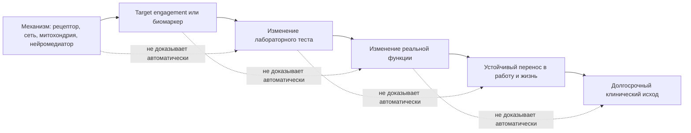
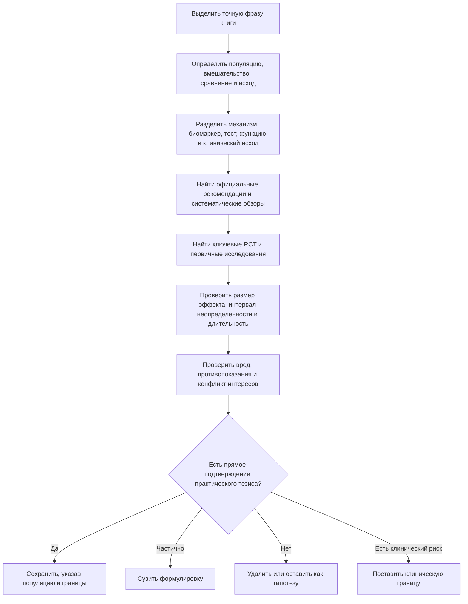

# Доказательный аудит книги "Мозг долгожителя" для "Когнитивного инженерства"

## План, deliverables и исполнительное резюме

### План исследования

| Этап | Результат |
|---|---|
| Разбор корпуса | Проверка структуры FB3, метаданных, 159 секций и наличия библиографии |
| Восстановление аудита | Идентификация всех 79 ранее проверенных утверждений и их статусов |
| Современный фактчекинг | Сверка ключевых тем с официальными рекомендациями, RCT, мета-анализами и систематическими обзорами |
| Инженерная переработка | Отделение механизма, биомаркера, тестовой функции, реального переноса и долгосрочного исхода |
| Редакторский результат | Сводная таблица тем, таблица 20 спорных утверждений, безопасные формулировки и правила "если/то" |
| Интеграция | Привязка пригодного материала к методологии "Когнитивного инженерства" |

Рабочие артефакты предыдущего аудита:

- [Полный фактчекинг книги](sandbox:/mnt/data/factcheck_mozg_dolgozhitelya_for_cognitive_engineering.md)
- [Готовые модули для "Когнитивного инженерства"](sandbox:/mnt/data/validated_modules_for_cognitive_engineering.md)
- [CSV-реестр 79 утверждений](sandbox:/mnt/data/claim_ledger_mozg_dolgozhitelya.csv)

### Исполнительное резюме

Загруженный FB3 представляет собой книгу Алексея Москалева "Мозг долгожителя. 7 шагов к ясности ума, крепкой памяти и устойчивому вниманию". В файле обнаружено 159 секций, из них 152 имеют собственный заголовок. Метаданные относят текст к 2024 году; файл создавался и редактировался в сентябре 2024 года. Указаны ISBN 978-5-04-211053-5 и связанный ISBN бумажного издания 978-5-04-185777-6. При этом внутренний статус FB3 обозначен как Draft, поэтому соответствие файла окончательной розничной редакции остается неустановленным.

Главное ограничение книги состоит не в выборе тем, а в переходе от научно правдоподобного механизма к практическому обещанию. В тексте не обнаружены полноценная библиография, DOI, PMID, список исследований или систематическая система ссылок. Поэтому утверждения невозможно проверить по авторской доказательной цепочке: источники приходится восстанавливать независимо.

Наиболее надежное ядро книги:

- достаточный и регулярный сон;
- регулярное движение;
- контроль сосудистых и метаболических факторов риска;
- предупреждение травм;
- коррекция нарушений слуха и зрения;
- продолжительное содержательное обучение;
- устойчивая социальная включенность;
- проектирование среды, уменьшающей ненужные переключения;
- сочетание нескольких умеренных вмешательств вместо поиска одного "омолаживающего" средства.

Для этих тем существуют рекомендации, крупные исследования или достаточно согласованные обзоры. Но даже здесь правильная формулировка вероятностна: вмешательство может улучшить отдельную функцию или снизить популяционный риск, но не гарантирует предотвращение деменции и не возвращает мозгу измеримый "биологический возраст".

Условно пригодными оказались медитация, танцы, когнитивная тренировка, цифровые ограничения и пищевые паттерны. Они могут давать небольшие или контекстные эффекты, однако книга часто расширяет результат с конкретного теста на "омоложение мозга", с корреляции на причинность, а с исследования пожилых людей риска на любого здорового читателя.

Наименее надежные части:

- потребительский "когнитивный возраст";
- профилактические МРТ, фМРТ, ПЭТ и ЭЭГ без клинического вопроса;
- APOE, амилоид, тау, BDNF, цитокины и другие показатели как универсальный "чекап возраста мозга";
- "синхронизация полушарий" перекрестными движениями;
- универсальные циклы продуктивности 50-90 минут;
- универсальный пик работоспособности с 9:00 до 12:00;
- объяснение поведения отдельным нейромедиатором;
- "глимфатическая мойка мозга" как установленный человеческий механизм;
- широкие наборы БАДов и конкретные дозировки;
- интервальное голодание как способ "очищения нейронов";
- HBOT, TMS, tDCS, tACS и инфракрасное излучение как бытовое омоложение здорового мозга;
- 5-HTP как безопасный ноотроп.

Книга правильно выделяет сон, движение, обучение, отношения и среду, но значительно переоценивает возможность объяснять их пользу через отдельные структуры мозга, митохондрии, нейрогенез, нейромедиаторы и биомаркеры. Для "Когнитивного инженерства" следует наследовать не обещания омоложения, а дисциплину проектирования условий действия.

Это соответствует уже сформулированной границе самого учебника: "Когнитивное инженерство" не должно становиться медицинским справочником, руководством по фармакологии, гормонам, БАДам или биохакингу; его предметом является проектирование условий мышления и действия. fileciteturn0file2L1-L20

## Корпус книги и статус проверки

### Что именно проверено

Есть три разных уровня покрытия, которые нельзя смешивать.

| Уровень | Статус |
|---|---|
| Структурный просмотр всех 159 секций | Установлено |
| Тематическое чтение и выделение ключевых тезисов | Установлено |
| Реестр 79 независимо проверяемых утверждений | Установлено |
| Полная построчная проверка каждого научного предложения | Неустановлено и фактически не выполнено |
| Отдельная глубокая проверка каждого вещества из секций 89-122 | Неустановлено |
| Проверка всех приведенных в книге дозировок | Неустановлено |
| Наличие в книге собственной доказательной библиографии | Не обнаружено |
| Соответствие FB3 окончательной розничной редакции | Неустановлено |
| Две загруженные FB3-копии являются полностью идентичными побайтно | Неустановлено |
| Доступ к предыдущему CSV-реестру 79 утверждений | Установлено |
| Доступ к предыдущему подробному отчету и модулям | Установлено |

Предметная проверка охватила:

- фундаментальные описания мозга, эмоций, старения и нейропластичности из глав 1, 2 и 4;
- "чекап старения мозга" из секции 36;
- питание, режимы питания и БАДы из секций 39-63;
- сон из секции 64;
- стресс-менеджмент и медитацию из секций 65-75;
- движение, танцы, йогу, цигун, баланс и "нейрогимнастику" из секций 76-86;
- митохондриальные вещества и аппаратные методы из секций 87-123 как класс утверждений, но не как полный фармакологический обзор каждого соединения;
- микробиом, психобиотики, медицинские методы и факторы риска из секций 124-138;
- цифровой детокс, социальность, брейн-фитнес и осознанность из секций 139-144;
- нейропластичность, ноотропы, деменцию и профилактику из секций 145-151;
- память, внимание, интеллект, режим дня и привычки из секций 153-158.

### Шкала аудита

| Метка | Значение |
|---|---|
| A | Сильное или достаточно устойчивое подтверждение |
| B | Умеренное подтверждение, зависящее от популяции, исхода или условий |
| C | Предварительные, слабые или косвенные данные |
| D | Неподтвержденное, существенно преувеличенное или нейромифологическое утверждение |
| S | Клиническая или безопасностная граница |
| A/B, B/C, C/D и другие комбинации | Смешанная оценка: надежность зависит от точной формулировки |

В текущем реестре: 7 утверждений имеют метку A, 14 - B, 3 - C, 13 - D, 6 - S; остальные 36 получили комбинированные оценки.

### Полный перечень 79 проверенных утверждений

| N | Раздел | Проверенное утверждение | Статус |
|---:|---|---|---|
| 1 | Главы 1-2 | Старение является патологическим процессом | D |
| 2 | Глава 2 | Мозг уменьшается на 5% каждое десятилетие и теряет около 20% к 80 годам | C/D |
| 3 | Глава 1 | "Лимбическая система" является единым эмоциональным центром, а PFC - рациональным начальником | D |
| 4 | Глава 1 | Миндалина является "службой безопасности" и центром страха | D |
| 5 | Главы 1 и 4 | Взрослый мозг сохраняет нейропластичность | A |
| 6 | Главы 1 и 4 | У людей 80-90 лет надежно образуются новые нейроны, а образ жизни заметно стимулирует этот процесс | C/D |
| 7 | Главы 2, 4 и 7 | Обучение, сложная деятельность и социальность поддерживают когнитивный резерв | B |
| 8 | Главы 2-3 | Сосудистое и метаболическое здоровье существенно связано с когнитивным здоровьем | A |
| 9 | Глава 2 | Онлайн-тесты "когнитивного возраста" оценивают ускоренное старение мозга | D/S |
| 10 | Глава 2 | MoCA и MMSE показывают ускоренное старение | D/S |
| 11 | Глава 2 | МРТ, фМРТ, ПЭТ и ЭЭГ следует включать в общий профилактический чекап мозга | S |
| 12 | Глава 2 | APOE-тест определяет личный риск и ускоренное старение | S |
| 13 | Глава 2 | Амилоид и тау полезны как общий профилактический тест для бессимптомных людей | S |
| 14 | Глава 2 | CRP, цитокины, BDNF, нейромедиаторы, microRNA и митохондриальные показатели измеряют возраст мозга | D/S |
| 15 | Главы 2-3 | Проверка слуха, зрения, сна и сосудистых факторов может быть полезна | A/B |
| 16 | Глава 3 | Сон необходим для внимания, памяти, обучения и восстановления | A |
| 17 | Глава 3 | Некоторым людям достаточно шести часов сна, если они хорошо себя чувствуют | C/D |
| 18 | Глава 3 | Глубокий сон вымывает токсины и бета-амилоид; чем глубже сон, тем чище мозг | C/D |
| 19 | Глава 3 | Все гаджеты необходимо строго выключать за два часа до сна | B/C |
| 20 | Глава 3 | При длительном бодрствовании в кровати полезно встать и вернуться при сонливости | A |
| 21 | Глава 3 | Прохладная, темная и тихая среда, а также стабильный график помогают сну | B |
| 22 | Глава 3 | Регулярное движение поддерживает когнитивное и сосудистое здоровье | A |
| 23 | Глава 3 | Тридцать минут аэробной активности ежедневно значительно улучшают когницию и предотвращают деменцию | B |
| 24 | Глава 3 | Аэробная тренировка увеличивает объем гиппокампа | B |
| 25 | Глава 3 | Танцы являются "фонтаном молодости" и особенно омолаживают гиппокамп | C |
| 26 | Глава 3 | Перекрестные движения будят и синхронизируют оба полушария | D |
| 27 | Глава 3 | Через 2-3 месяца "нейрогимнастики" улучшается когниция, а через полгода мозг молодеет | D |
| 28 | Глава 3 | Йога и цигун уменьшают амилоид и нейровоспаление, оптимизируют микробиоту и предотвращают нейродегенерацию | C/D |
| 29 | Глава 3 | Многокомпонентные программы полезнее одной "волшебной" практики | A/B |
| 30 | Глава 3 | Общий пищевой паттерн важнее отдельного "суперпродукта" | A/B |
| 31 | Глава 3 | MIND или средиземноморская диета предотвращает когнитивное снижение | B |
| 32 | Глава 3 | Ягоды, орехи, специи, зелень и грибы по отдельности защищают мозг | B/C |
| 33 | Глава 3 | Омега-3 улучшает память и замедляет возрастное снижение у большинства людей | D/B |
| 34 | Глава 3 | Высокие дозы B6, B9 и B12 предотвращают когнитивное старение | D/S |
| 35 | Глава 3 | Витамин D и магний являются общими когнитивными и антистрессовыми усилителями | C/D |
| 36 | Глава 3 | Гинкго предотвращает деменцию | D |
| 37 | Глава 3 | Креатин улучшает память и интеллект | C |
| 38 | Глава 3 | NR, PQQ, физетин, спермидин, уролитин A и другие вещества омолаживают мозг через митохондрии и аутофагию | C/D |
| 39 | Глава 3 | Интервальное голодание очищает нейроны, нормализует нейромедиаторы и улучшает когницию | C/D |
| 40 | Глава 3 | Психобиотики и управление микрофлорой предотвращают когнитивное старение | C |
| 41 | Глава 3 | Широкому читателю можно давать конкретные дозировки десятков добавок | S |
| 42 | Глава 3 | Мультивитамины точно бесполезны | B |
| 43 | Глава 3 | Медитация может уменьшать стресс и улучшать отдельные показатели внимания и самочувствия | B |
| 44 | Глава 3 | Медитация увеличивает толщину PFC и гиппокампа и замедляет атрофию | C/D |
| 45 | Глава 3 | Дыхательные упражнения и мышечная релаксация могут кратковременно снижать напряжение | B |
| 46 | Заключение | Позитивное мышление, благодарность, прощение и любознательность замедляют старение | D/B |
| 47 | Глава 3 | Временное ограничение мобильного интернета может улучшать внимание и благополучие | B |
| 48 | Глава 3 | Цифровой детокс универсально улучшает память, креативность, эмпатию и социальные навыки | C/D |
| 49 | Глава 7 | Переключения, уведомления и незавершенные переходы имеют когнитивную цену | A/B |
| 50 | Глава 7 | Оптимальный ритм мозга - 50-90 минут работы и 10-15 минут отдыха | D/B |
| 51 | Глава 7 | Большинство людей максимально продуктивны с 9 до 12 часов | D/B |
| 52 | Глава 7 | Если сначала "съесть лягушку", выброса дофамина хватит на остальные дела | D |
| 53 | Глава 7 | Самопохвала стимулирует дофамин и повышает продуктивность | D/B |
| 54 | Глава 7 | Позитивная визуализация результата повышает вероятность исполнения плана | C/D |
| 55 | Глава 7 | Ежедневный анализ, чек-листы и планирование могут помогать | B |
| 56 | Глава 7 | Повторение в стабильном контексте формирует автоматичность | A |
| 57 | Глава 7 | Через неделю новая привычка заметно преобразит человека | D |
| 58 | Глава 7 | Полезно начинать с малого и использовать подсказки, якоря и напоминания | A/B |
| 59 | Глава 7 | Формула "если X, то Y" помогает реализации намерения | A/B |
| 60 | Глава 7 | Один пропуск не разрушает привычку; важнее вернуться | A/B |
| 61 | Глава 7 | Награда и празднование обязательно закрепляют привычку дофамином | C/D |
| 62 | Глава 3 | Изоляция и одиночество связаны с повышенным риском когнитивного снижения и деменции | B |
| 63 | Заключение | Общение полезно потому, что выделяет окситоцин, серотонин и дофамин | D |
| 64 | Главы 3-4 | Новизна и обучение предотвращают возрастное снижение | B |
| 65 | Глава 3 | Сексуальная активность омолаживает мозг, усиливает кровоток гиппокампа и улучшает когницию | D/C |
| 66 | Глава 3 | Ароматерапия улучшает память и замедляет старение мозга | D/C |
| 67 | Глава 3 | Несколько сеансов HBOT улучшают память, работоспособность и замедляют старение | D/S |
| 68 | Глава 3 | TMS, tDCS, tACS и NIR омолаживают здоровый мозг | C/S |
| 69 | Глава 3 | Стволовые клетки, генная терапия и фокусированный ультразвук близки к профилактическому омоложению | S |
| 70 | Глава 5 | У пирацетама нет серьезных подтверждений когнитивной эффективности | A |
| 71 | Глава 5 | Ноопепт, фенотропил, семакс, адаптогены и холиновые формы улучшают когницию | C/D/S |
| 72 | Глава 5 | 5-HTP является природным и относительно безопасным ноотропом в дозе 50-500 мг в день | S |
| 73 | Глава 6 | Многие случаи деменции можно предотвратить образом жизни | B |
| 74 | Глава 6 | Контроль давления предотвращает деменцию | B |
| 75 | Глава 6 | Многодоменное вмешательство улучшает когницию у пожилых людей риска | A/B |
| 76 | Сквозной тезис | Клеточный или животный механизм доказывает бытовую рекомендацию | D |
| 77 | Сквозной тезис | Изменение объема или активации мозга доказывает улучшение человека | D |
| 78 | Сквозной тезис | Если практика вызывает нейромедиатор, этим объясняется ее польза | D |
| 79 | Сквозной тезис | Малое улучшение теста равно общему омоложению мозга | D |

## Сводная карта доказательности

Уровень в этой таблице относится не к теме целиком, а к наиболее практично релевантному утверждению внутри нее.

| Тема | Состояние доказательств | Что подтверждается | Что не подтверждается | Ключевые источники |
|---|---|---|---|---|
| Сон | Сильные для достаточного сна и лечения бессонницы; противоречивые для глимфатической "очистки" | Недосып ухудшает бдительность и ряд когнитивных функций; CBT-I является терапией первой линии хронической бессонницы | Универсальная польза ровно 8 часов, бытовая оценка "мне хватает 6", доказанная ночная мойка мозга | AASM/SRS, ACP, European Insomnia Guideline, Xie 2013, Miao 2024 citeturn0search0turn0search1turn0search8turn10search0turn10search32 |
| Движение | Сильные для общего здоровья; умеренные для когнитивных исходов | Регулярная активность полезна; некоторые виды тренировок дают небольшие улучшения общей когниции, памяти и исполнительных функций | Гарантированное предотвращение деменции; обязательное увеличение гиппокампа у любого человека | WHO, крупный umbrella review, FINGER citeturn1search1turn1search2turn1search26 |
| Обучение и пластичность | Сильные для обучаемости; умеренные для ближнего переноса; слабые для дальнего переноса | Люди сохраняют способность осваивать навыки; тренировка улучшает прежде всего тренируемые и близкие задачи | Универсальное повышение интеллекта и "омоложение мозга" через brain games | ACTIVE и систематические обзоры когнитивной тренировки citeturn2search0turn2search1turn2search5 |
| Привычки | Умеренные, местами сильные | Повторение в стабильном контексте, доступный первый шаг, подсказки и планы "если/то" повышают вероятность действия | Универсальный срок в 7, 21 или 66 дней; обязательное дофаминовое закрепление | Систематический обзор формирования привычек и исследования стабильности контекста citeturn2search3turn2search7turn2search17turn2search19 |
| Внимание и среда | Сильные для лабораторной цены переключения; умеренные для рабочих рекомендаций | Переключение задач и внешние сигналы могут ухудшать текущую производительность | Универсальная длина фокус-блока и одинаковый вред любого уведомления | Исследования task switching и цифрового ограничения citeturn10search5turn10search13turn3search1 |
| Питание и БАДы | Умеренные для общего пищевого паттерна; слабые или противоречивые для добавок | Пищевой паттерн и коррекция подтвержденного дефицита важнее "суперпродукта"; некоторые RCT добавок дают небольшие сигналы | Универсальное улучшение памяти омега-3, витаминами B, гинкго или митохондриальным стеком | MIND RCT, COSMOS, B-vitamin meta-analysis, omega-3 reviews, GEM citeturn4search0turn4search1turn4search3turn4search15turn10search2 |
| Нейростимуляция | Умеренные для отдельных клинических показаний; слабые для enhancement здоровых | TMS и некоторые tDCS-протоколы имеют клинические или исследовательские применения | Домашнее "омоложение" мозга, надежный общий когнитивный эффект | FDA, систематические обзоры tDCS/TMS, UHMS citeturn5search1turn5search2turn5search6turn5search14 |
| Обследования и биомаркеры | Сильные для клинически обусловленного применения; сильная граница против wellness-панелей | Тесты полезны при симптомах, клиническом вопросе и наличии плана действий | Диагностика "возраста мозга" бессимптомному человеку через сканирование или широкую панель | Alzheimer's Association, ACR, USPSTF citeturn6search0turn6search1turn6search3turn10search3 |
| Социальная среда | Умеренные наблюдательные; слабее интервенционные | Изоляция и одиночество связаны с неблагоприятными исходами; качество и доступность контакта имеют значение | Гарантированное предотвращение деменции общением; объяснение пользы окситоцином | Lancet Commission, WHO, мета-анализ одиночества, ACHIEVE citeturn7search0turn7search1turn7search2turn7search3 |
| Цифровые ограничения | Умеренные и контекстные | Временное отключение мобильного интернета или части каналов может улучшить устойчивое внимание и субъективное благополучие | Универсальный "детокс", улучшающий все когнитивные и социальные функции | RCT ограничения мобильного интернета citeturn3search1 |

Русскоязычные научные обзоры физической активности, баланса и когнитивных функций существуют, но преимущественно имеют обзорный или реабилитационный характер. Они полезны для терминологии и локального контекста, однако не повышают уровень доказательности сверх исходных RCT и мета-анализов. citeturn8search6turn8search10

## Тематическое углубление и формулировки для учебника

### Сон

Состояние доказательств: сильное для утверждения, что хронический или острый недостаток сна ухудшает прежде всего устойчивое внимание, скорость реакции и стабильность исполнения; достаточно сильное для применения CBT-I при хронической бессоннице; противоречивое для популярной модели "сон вымывает токсины".

AASM и Sleep Research Society рекомендуют взрослым регулярно спать не менее 7 часов, но это популяционный ориентир, а не гарантия индивидуального оптимума. Сон является многомерным состоянием: важны продолжительность, регулярность, время, качество и отсутствие расстройств. Хроническое ограничение до 6 часов и менее может накапливать дефицит производительности, который человек субъективно недооценивает. citeturn0search0turn0search8turn0search16

При хронической бессоннице официальные рекомендации отдают первое место когнитивно-поведенческой терапии бессонницы, а не общему списку "гигиены сна". Стимульный контроль, включая выход из кровати при длительном бодрствовании, входит в доказательные поведенческие компоненты. citeturn0search1turn0search10turn0search18

Глимфатический тезис следует изложить как незакрытый научный вопрос. Работа Xie и соавторов 2013 года показала усиленный обмен жидкости и выведение некоторых веществ во время сна или анестезии у мышей. Работа Miao и соавторов 2024 года, также на мышах и с другой методикой, обнаружила снижение измеренного клиренса во сне и при анестезии. Ни одно из этих исследований само по себе не доказывает бытовую формулу "глубокий сон моет человеческий мозг". citeturn10search0turn10search8turn10search32

Инженерный вывод: сон нужно моделировать как входное состояние системы, а не как награду после работы. Полезно отслеживать не только часы, но и регулярность, дневную сонливость, ошибки, вариативность реакции и цену входа в сложную задачу.

Ограничения и риски: стойкая бессонница, громкий храп, остановки дыхания, утренняя головная боль, выраженная дневная сонливость и засыпание за рулем требуют клинической оценки. Самостоятельное длительное применение седативных средств или высоких доз мелатонина не относится к когнитивному инженерству.

Формулировки для учебника. Краткая: "Сон не выполняет работу вместо человека, но меняет состояние системы, в котором эта работа становится возможной". Развернутая: "Недосып повышает вариативность исполнения: человек может сохранять отдельные удачные периоды, но чаще пропускает сигналы, медленнее возвращается в контекст и хуже замечает собственное ухудшение". Предупреждение: "Не объясняйте ценность сна одной глимфатической мойкой: этот механизм остается предметом научного спора". Если/то: "Если несколько дней растут ошибки, микропереключения и цена входа, то сначала проверьте сон и восстановление, а не усиливайте давление на мотивацию".

### Движение

Состояние доказательств: сильное для физического и сосудистого здоровья; умеренное для небольшого улучшения когнитивных функций; более слабое для индивидуального обещания предотвратить деменцию.

WHO рекомендует взрослым 150-300 минут умеренной или 75-150 минут интенсивной аэробной активности в неделю и силовую нагрузку не менее двух дней. Для пожилых людей дополнительно значимы упражнения на баланс и функциональную способность. Это рекомендации здоровья, а не специальный протокол "омоложения мозга". citeturn1search21turn1search26

Крупный umbrella review 2025 года, включивший 133 систематических обзора, 2 724 RCT и более 258 тысяч участников, обнаружил в среднем небольшие или умеренные улучшения общей когниции, памяти и исполнительных функций. Однако качество исходных обзоров, популяции, тесты и программы были неоднородны; совокупный эффект нельзя переводить в обещание одинакового результата каждому человеку. citeturn1search1

FINGER показал небольшой благоприятный эффект многодоменной программы, объединявшей питание, движение, когнитивную тренировку и контроль сосудистого риска у пожилых участников риска. Исследование не позволяет выделить одну "главную" составляющую и не доказывает омоложение здорового молодого мозга. citeturn1search2

Инженерный вывод: движение полезно включать не как разовую процедуру после когнитивного истощения, а как фоновое обслуживание системы. Основные измеримые исходы для рабочего человека: переносимость нагрузки, регулярность, бодрость, сон, боль, устойчивость к длительному сидению и возможность возвращения к задаче.

Ограничения и риски: резкое увеличение нагрузки повышает риск травмы. Боль в груди, обмороки, выраженная одышка, неконтролируемое давление и серьезные заболевания требуют медицинского согласования. Упражнение, вызывающее боль или падения, не становится полезным от того, что в исследовании оно связывалось с BDNF.

Формулировки. Краткая: "Движение поддерживает условия когнитивной работы, но не является кнопкой повышения интеллекта". Развернутая: "Регулярная физическая активность действует через несколько систем одновременно: сосудистую, метаболическую, двигательную, эмоциональную и связанную со сном; поэтому ее польза шире одного нейротрофического механизма". Предупреждение: "Изменение объема гиппокампа в отдельном исследовании не гарантирует функционального выигрыша у конкретного читателя". Если/то: "Если рабочий день состоит из длительного сидения, то сначала добавьте регулярные доступные эпизоды движения, а затем оценивайте самочувствие и функцию, а не нейробиологическую историю".

### Обучение и нейропластичность

Состояние доказательств: сильное для сохранения способности учиться; умеренное для улучшения тренируемых и близких навыков; слабое для широкого переноса на интеллект, работу и повседневную автономность.

ACTIVE и его длительное продолжение показали, что тренировка памяти, рассуждения или скорости обработки может поддерживать соответствующие тренируемые способности. При этом эффект был доменно-специфичен: тренировка рассуждения не превращалась автоматически в общее улучшение памяти, а лабораторный результат не всегда означал заметный функциональный перенос. citeturn2search1turn2search5

Систематические обзоры когнитивной тренировки обычно находят умеренные улучшения в тренируемом или близком домене и существенно менее надежный дальний перенос. Поэтому "нейропластичность" обозначает возможность изменения под опытом, а не обещание, что любое сложное упражнение улучшит любые способности. citeturn2search0

Инженерный вывод: тренировать нужно функцию, похожую на целевую деятельность. Для разработчика работа с реальным кодом, восстановление архитектурного контекста, объяснение решений и решение задач с обратной связью ближе к цели, чем абстрактная игра на скорость реакции.

Ограничения и риски: рост результата в одной игре может отражать знакомство с интерфейсом, стратегию или запоминание паттернов. Интенсивная тренировка может увеличивать усталость и фрустрацию без полезного переноса. Нейропластичность не всегда благоприятна: система может закреплять избегание, тревожные реакции и неэффективные привычки.

Формулировки. Краткая: "Мозг учится прежде всего тому, что регулярно делает". Развернутая: "Нейропластичность не является запасом универсального улучшения; она означает, что повторяющийся опыт меняет доступность конкретных представлений, стратегий и действий". Предупреждение: "Не называйте улучшение результата в тренажере повышением интеллекта, пока не показан перенос". Если/то: "Если нужна новая рабочая способность, то проектируйте практику, похожую на целевую задачу, и проверяйте результат вне обучающего упражнения".

### Привычки

Состояние доказательств: умеренное и достаточно согласованное для роли повторения и стабильного контекста; слабое для универсальных сроков и нейромедиаторных объяснений.

Современный систематический обзор обнаружил очень широкий разброс сроков формирования автоматичности: в разных исследованиях и поведениях значения варьировали приблизительно от нескольких дней до многих месяцев; медианы часто находились около двух месяцев, но разброс между людьми и действиями был велик. Многие исследования имели риск систематической ошибки. Поэтому число "66 дней" является не законом, а одной из сводных оценок. citeturn2search3

Стабильность контекста связана с ростом автоматичности и достижением цели. При этом контекст может быть временным, событийным, пространственным или социальным. Исследования не подтверждают, что для всех действий обязательно лучше один тип подсказки. citeturn2search7turn2search17turn2search19

Инженерный вывод: привычка - это снижение цены выбора в повторяющейся ситуации. Ее следует проектировать через наблюдаемый триггер, минимально доступное действие, понятное завершение и протокол возврата после сбоя.

Ограничения и риски: жесткие серии и счетчики могут превращать один пропуск в ощущение полного провала. Автоматичность не гарантирует, что поведение остается полезным при изменившихся условиях. Для задач, требующих осознанного решения и адаптации, чрезмерная автоматизация может быть вредна.

Формулировки. Краткая: "Привычка формируется не календарем, а повторением доступного действия в узнаваемом контексте". Развернутая: "Цель проектирования привычки - не устранить волю, а уменьшить число решений, необходимых для начала полезного действия". Предупреждение: "Один пропуск не обнуляет обучение; опаснее превратить пропуск в разрешение больше не возвращаться". Если/то: "Если наступил заранее определенный контекст, то выполните минимальную версию действия; если контекст был пропущен, то используйте заранее заданную точку возврата".

### Внимание и среда

Состояние доказательств: сильное для существования переключательных издержек; умеренное для конкретных организационных правил.

Эксперименты по task switching показывают, что переключение между правилами требует перенастройки и обычно увеличивает время ответа или число ошибок по сравнению с повторением одной задачи. Эффект зависит от сложности, подготовки, знакомости и предсказуемости переключения. citeturn10search5turn10search13

Это не означает, что любое переключение вредно. Некоторые задачи требуют мониторинга, координации и реакции на события. Инженерная проблема возникает, когда система создает частые низкоценные переключения без сохранения контекста.

Универсальные интервалы 25, 50 или 90 минут не имеют статуса биологического закона. Длина блока зависит от типа задачи, состояния, требований безопасности, внешней координации и способности оставить контрольную точку.

Инженерный вывод: вместо борьбы за абстрактную "концентрацию" следует проектировать стоимость перехода. Полезные элементы - ограничение числа параллельных задач, сохранение следующего шага, пакетная обработка сигналов, явные окна доступности и различение срочного сигнала от дешевого прерывания.

Ограничения и риски: полное отключение связи непригодно для дежурств, медицинской ответственности, caregiving и аварийных ролей. Чрезмерно длинный блок может сохранять не концентрацию, а застревание и ухудшение качества.

Формулировки. Краткая: "Внимание теряется не только во времени, но и в стоимости восстановления контекста". Развернутая: "Переключение имеет две цены: выполнение нового правила и последующее восстановление состояния предыдущей задачи". Предупреждение: "Не превращайте длину рабочего блока в медицинскую норму". Если/то: "Если переключение неизбежно, то перед ним оставьте цель, текущее состояние, найденные ограничения и следующий проверяемый шаг".

### Питание и БАДы

Состояние доказательств: умеренное для общего здорового пищевого паттерна; слабое, неоднородное или противоречивое для отдельных добавок у людей без дефицита.

Наблюдательные исследования связывают средиземноморский и MIND-подобный рацион с более благоприятными когнитивными исходами. Но трехлетний MIND RCT не обнаружил значимого преимущества MIND-рациона над активной контрольной диетой по основной когнитивной конечной точке: обе группы получили консультации, снизили массу тела и улучшились по некоторым показателям. Это хороший пример того, почему ассоциация и причинный эффект должны разделяться. citeturn4search0

COSMOS обнаружил небольшой сигнал пользы ежедневного мультивитамина по отдельным когнитивным исходам у пожилых участников, но результаты не доказывают универсального усиления и не позволяют считать мультивитамин заменой питания или лечения дефицита. В COSMOS-Web преимущество было обнаружено для некоторых показателей памяти, но не для всех вторичных исходов. citeturn4search1turn4search5

Крупный анализ исследований витаминов группы B, включавший около 22 тысяч участников, не показал надежного общего предотвращения когнитивного снижения. Гинкго в крупном GEM RCT не снизил частоту деменции. citeturn4search3turn10search2

По омега-3 результаты смешаны. Некоторые мета-анализы находят небольшие эффекты в отдельных популяциях или дозовых диапазонах, но это не подтверждает общий совет "омега-3 улучшает память". В фазе IIa 2026 года высокая доза DHA изменила показатели поступления DHA в ликвор, но за 24 месяца не дала различия по когниции или структуре мозга. Это особенно наглядный случай "target engagement не равен функциональной пользе". citeturn4search2turn4search6turn4search15

Инженерный вывод: питание следует описывать на трех разных уровнях: достаточность и отсутствие дефицита; устойчивый пищевой паттерн; терапевтическое применение конкретного вещества. Эти уровни нельзя объединять словом "полезно для мозга".

Ограничения и риски: добавки могут взаимодействовать с лекарствами, увеличивать риск кровотечения, влиять на давление, глюкозу, печень и почки. Риск зависит от дозы, состава продукта, беременности, заболеваний и сочетаний. "Натуральность" не является показателем безопасности.

5-HTP нельзя описывать как спокойный бытовой ноотроп. Он может взаимодействовать с антидепрессантами, некоторыми препаратами от мигрени и боли и повышать риск серотониновой токсичности; Health Canada в 2024 году указывало на недостаточность данных для широкого безопасного использования в обогащенных продуктах. citeturn11search0turn11search1turn11search7turn11search13

Формулировки. Краткая: "Пищевой паттерн важнее истории об одном суперпродукте". Развернутая: "Польза коррекции дефицита не доказывает пользу дополнительной дозы человеку без дефицита". Предупреждение: "Биохимическая мишень и попадание вещества в кровь или ликвор не гарантируют улучшения функции". Если/то: "Если рассматривается добавка, то сначала определите цель, наличие дефицита, качество клинических данных, взаимодействия и критерий прекращения".

### Нейростимуляция

Состояние доказательств: умеренное для отдельных клинических показаний и исследовательских протоколов; слабое или противоречивое для широкого улучшения здоровой когниции.

TMS имеет регулируемые клинические применения, прежде всего в лечении отдельных психиатрических состояний. Некоторые tDCS-устройства и протоколы получили разрешения или исследуются для конкретных клинических показаний. Регуляторное разрешение для депрессии не является разрешением на улучшение памяти, интеллекта или профилактику старения. citeturn5search2turn5search6

Мета-анализы tDCS у пожилых людей иногда находят небольшие краткосрочные улучшения, особенно при сочетании с тренировкой. Результаты зависят от монтажа электродов, силы, длительности, числа сессий, исходного состояния и выбранного теста; долгосрочный перенос и оптимальные параметры остаются неопределенными. citeturn5search1turn5search5

HBOT имеет перечень медицинских показаний, поддерживаемый Undersea and Hyperbaric Medical Society. Нормальное старение и бытовое повышение когнитивной работоспособности не являются основанием автоматически включать гипербарическую оксигенацию в личный контур продуктивности. citeturn5search14

Инженерный вывод: аппаратное воздействие нельзя помещать в один ряд с отключением уведомлений, рабочим журналом или прогулкой. Это другой класс интервенции: с медицинским отбором, протоколом, противопоказаниями, контролем побочных эффектов и регуляторной ответственностью.

Ограничения и риски: TMS может вызывать головную боль, дискомфорт, нарушения слуха и редко судорожный приступ; риск зависит от протокола и состояния человека. tDCS может вызывать раздражение кожи, боль и непредсказуемые эффекты при неправильном монтаже. Некоторые состояния, импланты и лекарства требуют отдельной оценки. HBOT связан с баротравмой, кислородной токсичностью и другими медицинскими рисками.

Формулировки. Краткая: "Нейростимуляция - это контекстная медицинская или исследовательская технология, а не универсальный усилитель". Развернутая: "Эффект аппаратного метода определяется не названием технологии, а показанием, протоколом, популяцией, сравнением, исходом и безопасностью". Предупреждение: "Не переносите разрешение метода для лечения заболевания на применение здоровым человеком". Если/то: "Если вмешательство непосредственно изменяет электрическую, магнитную или кислородную среду мозга, то относите его к клиническому контуру, а не к бытовой оптимизации".

### Обследования и биомаркеры

Состояние доказательств: сильное для использования диагностических методов при клиническом вопросе; сильная методологическая граница против универсального "чекапа возраста мозга".

Критерии Alzheimer's Association 2024 года прямо не поддерживают клиническую биомаркерную оценку болезни Альцгеймера у бессимптомных людей вне исследовательского контекста. Рекомендации по анализам крови 2025 года ориентированы прежде всего на специализированную оценку людей с объективными когнитивными нарушениями, а не на wellness-скрининг здорового населения. citeturn6search0turn6search1turn6search2

Биомаркер должен интерпретироваться вместе с симптомами, вероятностью до теста, методом анализа, возрастом, сопутствующими состояниями и доступным последующим действием. Положительный результат не всегда означает, что у человека разовьются симптомы в течение жизни. citeturn6search8turn6search13

USPSTF считает доказательства пользы общего скрининга когнитивных нарушений у бессимптомных пожилых людей недостаточными. Это не запрет клинической оценки при жалобах; это различение скрининга всех подряд и обследования по показаниям. citeturn10search3turn10search27

MoCA и MMSE являются инструментами оценки когнитивного статуса, а не измерителями "возраста мозга". МРТ, ПЭТ и ЭЭГ отвечают на конкретные клинические вопросы; фМРТ не является бытовым измерителем качества мышления. Рекомендации ACR привязывают нейровизуализацию к клиническим сценариям, а не к общему желанию "узнать состояние мозга". citeturn6search3

Инженерный вывод: полезность теста определяется не технологичностью, а формулой:

```text
полезность =
валидность измерения
x вероятность изменить решение
x наличие безопасного действия
- ложные находки
- тревога
- каскад обследований
- стоимость
```

Ограничения и риски: ложноположительные и неопределенные результаты, случайные находки, тревога, ненужные процедуры, неверная самоидентификация как "человека со старым мозгом", генетическая и страховая приватность.

Формулировки. Краткая: "Тест без клинического вопроса производит данные, но не обязательно знание". Развернутая: "Биомаркер становится полезным только тогда, когда валидирован для данной популяции и способен изменить решение, важное для человека". Предупреждение: "Не называйте результат теста возрастом мозга, если тест не валидирован для такого вывода". Если/то: "Если результат не изменит действие или требует интерпретации вне валидированной популяции, то тест не следует включать в личный когнитивный контур".

### Социальная среда

Состояние доказательств: умеренное и достаточно согласованное на уровне наблюдательных связей; слабее на уровне доказательства, что добавление общения предотвращает деменцию.

Мета-анализы связывают одиночество и социальную изоляцию с повышенным риском деменции и других неблагоприятных исходов. Однако возможны обратная причинность и смешение: ранние изменения здоровья могут сами уменьшать социальную активность. citeturn7search1

WHO предлагает различать структуру связей, их функцию и качество. Число контактов не равно поддержке, безопасности или принадлежности. Социальная связь может влиять через поведение, стресс, доступ к помощи, физическую активность, смысл и когнитивную вовлеченность; сведение этого к выбросу окситоцина является ненужным упрощением. citeturn7search2turn7search18

Lancet Commission 2024 года оценивает долю случаев деменции, статистически связанную с 14 модифицируемыми популяционными факторами, примерно в 45%. Это популяционная модель потенциального предотвращения или отсрочки, а не утверждение, что конкретный человек может снизить личный риск на 45%. citeturn7search0turn7search4turn7search31

ACHIEVE не показал общего когнитивного преимущества слухового вмешательства во всей рандомизированной выборке, но обнаружил пользу в более высокорисковой подгруппе. Это пример эффекта, зависящего от исходного риска, а не универсального правила. citeturn7search3

Инженерный вывод: социальную среду следует проектировать не как норму экстраверсии, а как доступ к безопасному контакту, совместной деятельности, обратной связи и помощи.

Ограничения и риски: токсичные, контролирующие и унижающие отношения не становятся полезными из-за факта социального контакта. Принудительная социализация может увеличивать нагрузку. Для некоторых людей низкое число, но высокое качество контактов функциональнее широкой сети.

Формулировки. Краткая: "Социальная связь - это ресурс доступа, координации и безопасности, а не доза окситоцина". Развернутая: "Для когнитивной системы важны не только контакты, но и возможность обращаться за помощью, обмениваться моделями и действовать без постоянной социальной угрозы". Предупреждение: "Ассоциация одиночества с деменцией не означает, что любое общение предотвращает заболевание". Если/то: "Если социальная среда повышает угрозу и цену самоконтроля, то увеличение количества контактов не является улучшением; сначала меняйте качество и безопасность связи".

### Цифровые ограничения

Состояние доказательств: умеренное для временного и целевого ограничения отдельных цифровых каналов; противоречивое для общего понятия "детокс".

В RCT 2025 года временное блокирование мобильного интернета на смартфоне улучшило устойчивое внимание, субъективное благополучие и некоторые показатели психического состояния. При этом телефон сохранял голосовую связь и SMS, то есть исследование проверяло конкретное ограничение, а не полное исчезновение цифровой среды. citeturn3search1

Результат нельзя автоматически переносить на память, эмпатию, творчество, профессиональную эффективность или долгосрочный отказ от технологий. Неясно также, какая часть эффекта обусловлена снижением уведомлений, уменьшением времени в приложениях, новизной эксперимента или изменением повседневного поведения.

Инженерный вывод: вместо "цифрового детокса" полезнее проводить управляемый эксперимент с конкретным каналом, временем и исходом. Например, отключить мобильный интернет до первого рабочего блока и измерять число самопереключений, завершенные контрольные точки и субъективную цену входа.

Ограничения и риски: ограничения могут мешать аварийной связи, работе, навигации, доступности и поддержанию отношений. Возможен перенос поведения на другой экран или канал. Жесткий запрет может вызвать откат, если не спроектирована замена.

Формулировки. Краткая: "Ограничивать следует не технологии вообще, а дешевые пути ненамеренного переключения". Развернутая: "Цифровое ограничение является полезным тогда, когда известно, какой канал отключается, какую функцию это должно изменить и чем будет измеряться результат". Предупреждение: "Детокс не очищает мозг и не гарантирует возврат внимания". Если/то: "Если конкретный канал регулярно перехватывает действие без достаточной ценности, то ограничьте его на определенное окно и сравните поведение до и после".

## Наиболее спорные утверждения и рекомендуемая редакция

| Утверждение книги | Вердикт | Почему спорно | Рекомендуемая редакция |
|---|---|---|---|
| "Старение - патологический процесс" | Не подтверждено | Смешивает нормальные возрастные изменения, риск и заболевание | "Возраст сопровождается изменениями и ростом некоторых рисков, но сам возраст не является диагнозом" |
| Мозг уменьшается на 5% каждое десятилетие | Существенное упрощение | Темпы различаются по структурам, возрасту и людям; объем не равен функции | "Возрастные изменения неоднородны, а размер отдельной структуры не определяет когнитивную способность" |
| Рациональная PFC управляет древней лимбической системой | Нейромиф | Эмоции, память, контроль и интероцепция реализуются перекрывающимися сетями | "Регуляция поведения возникает из взаимодействия нескольких распределенных систем" |
| Образ жизни усиливает нейрогенез гиппокампа у пожилых людей | Предварительно | Сам факт и масштаб взрослого нейрогенеза у человека остаются предметом спора | "Пользу обучения и движения следует обосновывать функциональными исходами, не опираясь на спорный нейрогенез" |
| Онлайн-тест определяет "когнитивный возраст" | Не подтверждено, риск | Нормативный балл не равен возрасту мозга; результат зависит от языка, образования, сна и интерфейса | "Короткий тест может выявить повод для профессиональной оценки, но не измеряет биологический возраст мозга" |
| МРТ, фМРТ, ПЭТ и ЭЭГ полезны как общий чекап | Клиническая граница | Нет универсального протокола и доказанного баланса пользы и вреда для бессимптомных | "Нейровизуализация применяется по клиническому вопросу, а не для общего измерения качества мозга" citeturn6search3turn10search3 |
| APOE, амилоид и тау следует проверять бессимптомным | Клиническая граница | Положительный результат не определяет сроки или неизбежность симптомов; возможны вред и каскад процедур | "Генетические и патологические биомаркеры интерпретируются специалистом в валидированном клиническом контексте" citeturn6search0turn6search1 |
| Глубокий сон очищает мозг от токсинов | Противоречиво | Основные прямые исследования выполнены на мышах и дали противоположные результаты | "Сон критически важен, но его ценность нельзя сводить к доказанной ночной мойке мозга" citeturn10search0turn10search32 |
| Некоторым достаточно 6 часов, если они хорошо себя чувствуют | Рискованное обобщение | Субъективная адаптация может не отражать объективное ухудшение | "Индивидуальные различия существуют, но регулярные 6 часов для большинства взрослых находятся ниже рекомендуемого диапазона" citeturn0search0turn0search8 |
| Тридцать минут движения ежедневно предотвращают деменцию | Преувеличено | Активность полезна, но эффект зависит от исхода, программы и риска | "Регулярная активность поддерживает здоровье и может давать небольшие когнитивные преимущества, не гарантируя предотвращения деменции" citeturn1search1turn1search10 |
| Перекрестные движения синхронизируют полушария | Не подтверждено | Нет валидного функционального смысла "пробуждения полушарий" | "Координационные упражнения тренируют конкретную двигательную координацию; широкий когнитивный перенос требует отдельного доказательства" |
| Медитация утолщает PFC и гиппокамп | Слабое и неоднородное | Малые выборки, селекция, множественные сравнения; крупные RCT не подтверждают простую структурную историю | "Медитация может умеренно влиять на стресс и отдельные навыки внимания, но структурное омоложение не установлено" |
| MIND-диета предотвращает снижение | Умеренно, но не доказано как гарантия | Наблюдательные связи сильнее причинных данных; крупный RCT не показал преимущества по основной точке | "MIND-подобный рацион является разумным пищевым паттерном, но не доказанным средством предотвращения снижения" citeturn4search0 |
| Омега-3 улучшает память большинству людей | Смешанные данные | Небольшие эффекты зависят от популяции и исхода; target engagement может не дать функции | "Омега-3 не является универсальным когнитивным усилителем; показания и ожидаемый эффект должны формулироваться отдельно" citeturn4search2turn4search15 |
| Высокие дозы B6, B9 и B12 предотвращают старение мозга | Не подтверждено для общего населения | Польза коррекции дефицита не переносится на высокие дозы без дефицита | "Витамины B следует применять для коррекции установленной недостаточности или по медицинским показаниям" citeturn4search3 |
| Митохондриальный стек омолаживает мозг | Слабое и косвенное | Основная цепочка часто заканчивается на клетке, животном или биомаркере | "Экспериментальное влияние вещества на митохондриальный путь не доказывает улучшение человеческой когниции" |
| Интервальное голодание очищает нейроны | Не установлено | Аутофагия и метаболические механизмы не равны доказанному когнитивному исходу | "Режим питания может влиять на метаболическое здоровье, но его когнитивная польза и безопасность зависят от человека" |
| Оптимальный цикл - 50-90 минут, а пик - с 9 до 12 | Не подтверждено как универсальное правило | Большие различия между задачами, хронотипами, сном и рабочими условиями | "Рабочие окна следует определять по собственным данным для разных типов задач" |
| HBOT, TMS, tDCS и NIR омолаживают здоровый мозг | Слабое, клиническая граница | Эффекты протокол- и показание-специфичны; есть риски | "Аппаратные методы относятся к клинической или исследовательской практике и не являются бытовыми средствами enhancement" citeturn5search1turn5search6turn5search14 |
| 5-HTP - относительно безопасный ноотроп, 50-500 мг/сутки | Неприемлемо для учебника | Не установлена универсальная эффективная доза; возможны опасные взаимодействия и серотониновая токсичность | "5-HTP не следует рекомендовать или дозировать в учебнике по когнитивному инженерству; это пример риска mechanism-first advice" citeturn11search0turn11search7turn11search13 |

## Инженерная логика проверки и визуализации

### Связь "механизм - функция - перенос"



Каждая стрелка требует отдельного подтверждения. Нельзя пройти лестницу одним исследованием на клеточной культуре, одним корреляционным МРТ-наблюдением или небольшим улучшением теста.

Особенно полезны три отрицательных примера:

1. DHA может достичь ликвора, но не улучшить когницию или структуру мозга. citeturn4search15
2. Медитация может улучшать отдельные субъективные или функциональные показатели без доказанного увеличения объема целевой структуры.
3. Наличие амилоидного биомаркера у бессимптомного человека не определяет его ближайшую функцию или неизбежный клинический исход. citeturn6search8turn6search13

### Процесс проверки утверждения



Для редакционной практики к каждому научному абзацу полезно применять семь вопросов:

1. Каков точный исследуемый исход?
2. На ком получен результат?
3. Это ассоциация, эксперимент или рекомендация?
4. Измерена функция или только промежуточный показатель?
5. Насколько велик абсолютный эффект?
6. Есть ли перенос на реальную задачу?
7. Каковы цена ошибки и противопоказания?

### Предлагаемые графики

Фактическое построение общей диаграммы эффектов сейчас было бы рискованным: исходы, шкалы и популяции исследований несопоставимы. Для рукописи уместны следующие типы визуализаций.

| График | Что показать | Зачем | Ограничение |
|---|---|---|---|
| Матрица доказательности | Темы по строкам, уровни "механизм - биомаркер - тест - функция - исход" по столбцам | Визуально показать, где заканчивается доказательная цепочка | Не кодировать слабые данные как точные числа |
| Forest plot движения | Эффекты на общую когницию, память и исполнительные функции из одного качественного мета-анализа | Показать величину и неоднородность эффектов | Не смешивать зависимые обзоры umbrella review |
| Парная диаграмма DHA | Положительное target engagement и нулевой функциональный результат | Показать, что биомаркер не равен пользе | Не превращать одно исследование в общий приговор всем омега-3 |
| Временная шкала глимфатической гипотезы | Xie 2013 и Miao 2024 с различиями методов | Показать развитие и конфликт данных | Оба прямых исследования выполнены на животных |
| Распределение сроков привычки | Диапазон приблизительно 4-335 дней, медианы и межиндивидуальный разброс | Разрушить миф универсального срока | Данные неоднородны и часто основаны на самоотчете |
| Каскад скрининга | Тест - неопределенный результат - повторный тест - визуализация - тревога - вмешательство | Объяснить потенциальный вред "чекапа на всякий случай" | Это схема решений, а не прогноз для каждого человека |
| N-of-1 график цифрового ограничения | Дни по оси X, самопереключения, завершенные контрольные точки и качество сна по Y | Перевести абстрактный детокс в проверяемый эксперимент | Нельзя причинно интерпретировать короткий ряд без повторений |

## Интеграция в "Когнитивное инженерство"

Наиболее ценный перенос из книги - не каталог процедур, а набор системных ограничений.

### Что следует включить

Первый модуль - "Состояние системы". Сон, движение, боль, болезнь, слух, зрение и метаболическое состояние изменяют доступность когнитивной работы. Их следует рассматривать как параметры контура, а не как моральную оценку дисциплины.

Второй модуль - "Специфичность обучения". Система становится лучше в том, что практикует. Поэтому дизайн практики должен начинаться с целевой функции и теста переноса, а не с абстрактной идеи "развивать мозг".

Третий модуль - "Среда переключений". Внимание следует проектировать через цену перехода, внешнее сохранение контекста и управление каналами сигналов. Это напрямую поддерживает уже существующую модель рабочего журнала, ритуалов входа и выхода и контрольной точки.

Четвертый модуль - "Привычка как доступность действия". Полезное поведение строится через стабильный контекст, минимальный ответ, обратную связь и возврат после сбоя, а не через календарную магию.

Пятый модуль - "Лестница доказательств". Механизм, биомаркер, результат теста, реальная функция и долгосрочный исход должны быть разведены. Это хорошо согласуется с уже заложенной в учебнике дисциплиной уровней объяснения: мозговая реализация не отменяет психологию, поведение и среду, а лучший уровень вмешательства часто находится не на уровне биохимии. fileciteturn1file10L1-L29

Шестой модуль - "Клиническая граница". Диагностические тесты, препараты, БАДы, нейростимуляция и лечение расстройств не должны маскироваться под методы продуктивности.

### Что следует исключить

Не следует наследовать:

- язык "омоложения мозга" без валидированного исхода;
- проценты предотвращения деменции как индивидуальные обещания;
- дозировки БАДов;
- популярную нейромедиаторную причинность;
- "лимбический мозг" против рациональной коры;
- синхронизацию полушарий;
- бытовую интерпретацию APOE, амилоида, тау и нейровизуализации;
- универсальные циклы продуктивности;
- структурные МРТ-изменения как доказательство улучшения человека;
- аппаратные и фармакологические методы как часть self-help.

### Итоговая редакционная позиция

Для "Когнитивного инженерства" доказательный стандарт можно сформулировать так:

```text
Не спрашивать только:
"может ли это воздействовать на мозг?"

Спрашивать:
"какая функция должна измениться?"
"на ком это показано?"
"каков размер эффекта?"
"переносится ли он в реальную задачу?"
"что будет стоить ошибка?"
"есть ли более простой уровень вмешательства?"
```

Книга "Мозг долгожителя" дает широкую карту потенциально важных факторов, но не обеспечивает достаточную дисциплину перехода от механизма к рекомендации. После фактчекинга ее надежное содержание сводится к достаточно консервативной картине: поддерживать сон, движение, сосудистое здоровье, обучение, безопасную социальную среду и управляемую цифровую среду; лечить нарушения по показаниям; не принимать биомаркер за функцию, нейромедиатор за объяснение, а научно звучащий механизм за готовую технологию улучшения человека.
