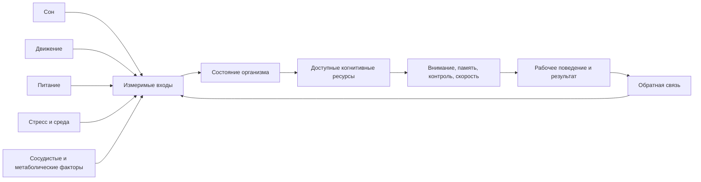
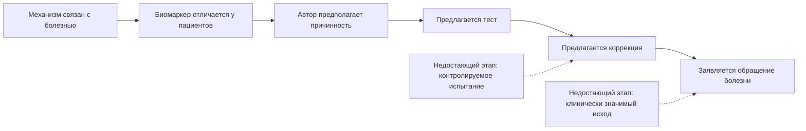
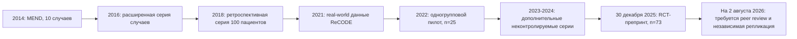

# Дейл Бредесен, "Нестареющий мозг": критически проверенная база для когнитивного инженерства

## Исполнительное резюме

Главная ценность книги Бредесена состоит не в доказательстве "обратимости болезни Альцгеймера", а в популяризации системной модели мозга: когнитивное состояние возникает из взаимодействия сна, физической активности, сосудистого и метаболического здоровья, стресса, питания, социальной среды и других факторов. Эта общая рамка согласуется с современной профилактической неврологией. Комиссия Lancet 2024 года и обновленное руководство ВОЗ от 15 июля 2026 года оценивают долю деменции, потенциально связанную с модифицируемыми факторами риска, примерно в 45%. Это популяционная оценка предотвратимого или отсрочиваемого риска, а не обещание индивидуальной профилактики и тем более не доказательство обратимости уже развившейся болезни. citeturn20view1turn20view6

Наиболее надежно подтверждены пять направлений, которые можно переносить в "Когнитивное инженерство":

| Направление | Что подтверждено | Практический статус |
|---|---|---|
| Физическая активность | Связана с меньшим риском когнитивного снижения; RCT показывают небольшие или умеренные улучшения отдельных когнитивных функций | Базовая практика |
| Сосудистое здоровье | Гипертония, диабет, дислипидемия, курение и сосудистые заболевания связаны с деменцией; интенсивный контроль давления снижает риск MCI у подходящих пациентов | Базовый контур наблюдаемости |
| Сон | Недостаточный и нерегулярный сон ухудшает внимание, память и исполнительные функции; апноэ сна связано с повышенным риском когнитивных нарушений | Базовая практика; нарушения сна требуют диагностики |
| Многокомпонентный образ жизни | FINGER и US POINTER показали небольшое преимущество структурированных программ; Cochrane пока не подтверждает предотвращение деменции | Поддерживающая архитектура, не "лечение" |
| Диетический паттерн | Средиземноморский/MIND-подобный рацион имеет более сильную поддержку, чем отдельные добавки или экстремальные диеты | Предпочтителен как системная практика |

FINGER показал небольшое улучшение или сохранение когнитивных функций у пожилых людей повышенного риска. В US POINTER участвовал 2111 человек: за два года глобальный когнитивный показатель улучшался в обеих группах, а структурированная программа дала статистически лучшее, но небольшое дополнительное изменение - около 0,029 стандартного отклонения в год относительно самоуправляемой программы. Авторы отдельно предупреждают о возможном вкладе тренировочного эффекта повторного тестирования и о неопределенной клинической значимости различия. Cochrane, объединив девять RCT с 18 452 участниками, не обнаружил доказательств предотвращения деменции, хотя отметил небольшое улучшение составных когнитивных показателей. citeturn12search0turn20view1turn20view2

Средняя или смешанная уверенность относится к инсулинорезистентности, воспалению, APOE, стрессу, кетонам, омега-3, BDNF и митохондриальной функции. Здесь часто хорошо подтверждена связь механизма с патологией, но заметно слабее доказана возможность улучшить долгосрочный когнитивный исход, целенаправленно изменяя отдельный биомаркер. Например, нейровоспаление является частью болезни Альцгеймера, но это не означает, что неспецифические противовоспалительные препараты предотвращают болезнь; повышение периферического BDNF после упражнений не доказывает, что BDNF является единственным или главным посредником когнитивного эффекта; наличие митохондриальной дисфункции не валидирует коммерческие "митохондриальные панели" или наборы добавок. citeturn4search0turn4search4turn12search7turn2search3

Низкая уверенность относится к клиническому использованию микробиома, гипотезе скрытых инфекций как универсальной причины болезни Альцгеймера, токсико-микотоксиновой модели "типа 3", коммерческим анализам на "биотоксины", широким противомикробным схемам без установленной инфекции и большим персонализированным наборам добавок. В этих областях преобладают ассоциации, животные модели, небольшие неоднородные исследования и нестандартизированные методы измерения. citeturn5search2turn5search7turn5search11turn16search12

ReCODE/MEND следует оценивать отдельно от доказательств его компонентов. Первые публикации 2014 и 2016 годов были сериями случаев без контрольной группы. Исследование 2022 года включало 25 человек и было одногрупповым. В декабре 2025 года опубликован препринт первого рандомизированного исследования: 73 участника, 50 в программе и 23 в группе стандартной помощи. В нем заявлены крупные эффекты по компьютерной батарее, памяти и исполнительным функциям, но изменение MoCA не достигло статистической значимости; семь участников экспериментальной группы выбыли. На 2 августа 2026 года работа остается препринтом, а коммерческий сайт программы сообщает, что рецензируемая публикация еще готовится. Исследование является важным шагом вперед, но пока не дает основания считать ReCODE независимо подтвержденным лечением болезни Альцгеймера. citeturn13search0turn13search1turn20view4

Для "Когнитивного инженерства" следует заимствовать не медицинские заявления Бредесена, а архитектуру:

Ключевой инженерный вывод: не пытаться напрямую "повысить BDNF", "активировать митохондрии" или "очистить глимфатическую систему". Следует проектировать наблюдаемые, безопасные и повторяемые входы - регулярность сна, движение, управление нагрузкой, здоровую рабочую среду, кардиометаболические показатели и восстановление - а затем измерять реальные функциональные выходы: устойчивость внимания, частоту ошибок, время входа в задачу, субъективную ясность, производительность и восстановление.

Этот отчет не является медицинским назначением. При когнитивных жалобах, резком снижении функций, подозрении на апноэ сна, депрессию, диабет, сосудистое заболевание или деменцию приоритетом является клиническая оценка, а не самостоятельное применение протоколов из книги.

## Источниковая архитектура книги и качество цитирования

### Как оценивались доказательства

Уровень уверенности в отчете означает следующее:

| Уровень | Критерии |
|---|---|
| Высокий | Согласующиеся крупные когорты, несколько RCT или систематических обзоров; поддержка клинических или общественно-здравоохранительных руководств |
| Средний | Биологическая правдоподобность и стабильные ассоциации, но ограниченные, неоднородные или небольшие RCT; возможны остаточное смешение и обратная причинность |
| Низкий | Преимущественно клеточные или животные модели, небольшие пилотные исследования, серии случаев, суррогатные показатели или нестандартизированные измерения |

Важно различать четыре уровня утверждений:

1. Механизм наблюдается в клетке или у животного.
2. Биомаркер связан с заболеванием у людей.
3. Изменение биомаркера улучшает когнитивные показатели.
4. Вмешательство предотвращает деменцию или изменяет течение подтвержденной болезни Альцгеймера.

В книге переход между этими уровнями иногда происходит без достаточного клинического моста. Наличие связи между фактором и заболеванием не доказывает, что коррекция фактора обратит заболевание.

### Что находится в примечаниях загруженного издания

В разделе "Примечания" загруженного файла содержится 44 пронумерованные позиции. После устранения "Там же" и межглавных повторов остается 40 уникальных материалов:

- 32 журнальные публикации;
- 1 книга Ричи Шумейкера;
- 7 веб-страниц, каталогов или популярных материалов;
- 4 повторные позиции.

Для книги, охватывающей сон, питание, токсикологию, гормоны, инфекции, микробиом, генетику и метаболизм, это узкая и неравномерная база. Значительная часть источников относится к клеточным системам, трансгенным мышам, наблюдательным исследованиям или собственным публикациям Бредесена и его соавторов. Полноценного систематического обзора литературы книга не представляет.

### Каталог журнальных источников книги

#### APP, амилоид, нетрин и защитная гипотеза

| Источник | Год | Тип исследования | Что реально показывает |
|---|---:|---|---|
| Kumar D.K. et al. "Amyloid-beta peptide protects against microbial infection in mouse and worm models..." | 2016 | Клеточные модели, мыши и C. elegans | Поддерживает антимикробную функцию Aβ в моделях; не доказывает инфекционную причину болезни Альцгеймера у людей. [DOI](https://doi.org/10.1126/scitranslmed.aaf1059) citeturn16search12 |
| Kumar D.K., Eimer W.A., Tanzi R.E., Moir R.D. "The potential therapeutic role of the natural antibiotic amyloid-beta peptide" | 2016 | Гипотеза/нарративный обзор | Обсуждает антимикробную защитную гипотезу, а не клиническое вмешательство. [DOI](https://doi.org/10.2217/nmt-2016-0035) citeturn16search21 |
| Lourenço F.C. et al. "Netrin-1 interacts with amyloid precursor protein..." | 2009 | Клеточная и молекулярная работа | Показывает взаимодействие нетрина-1 с APP и изменение процессинга Aβ в моделях. [DOI](https://doi.org/10.1038/cdd.2008.191) citeturn16search2 |
| Galvan V. et al. "Reversal of Alzheimer's-like pathology... by mutation of Asp664" | 2006 | Трансгенные мыши | Мутация APP улучшала фенотип модели; прямого человеческого терапевтического подтверждения нет. [DOI](https://doi.org/10.1073/pnas.0509695103) citeturn16search3 |
| Spilman P. et al. "The multi-functional drug tropisetron binds APP..." | 2014 | Трансгенные мыши | Улучшение показателей памяти и процессинга APP в мышиной модели. [DOI](https://doi.org/10.1016/j.brainres.2013.12.029) citeturn17search0turn17search12 |
| Theendakara V. et al. "Neuroprotective sirtuin ratio reversed by ApoE4" | 2013 | Клеточная и молекулярная работа | Предлагает механизм влияния APOE4 на транскрипцию и сиртуины. [DOI](https://doi.org/10.1073/pnas.1314145110) |
| Lu D.C. et al. "A second cytotoxic proteolytic peptide derived from APP" | 2000 | Клеточная молекулярная работа | Описывает цитотоксичный фрагмент APP; это механизм, а не клиническая терапия. [DOI](https://doi.org/10.1038/74656) |
| Spilman P. et al. "Enhancement of sAPPalpha as a therapeutic strategy..." | 2015 | Нарративная механистическая статья | Формулирует терапевтическую гипотезу; журнал и доказательная база ограничены. |
| Spilman P.R. et al. "Netrin-1 interrupts amyloid-beta amplification..." | 2016 | Трансгенные мыши | Нетрин-1 изменял APP/Aβ и поведение мышей. [DOI](https://doi.org/10.3233/JAD-151046) citeturn16search14 |
| Julien O. et al. "Unraveling the mechanism of cell death induced by chemical fibrils" | 2014 | Химико-биологическая, клеточная работа | Исследует фибриллы и клеточную гибель; перенос на клиническую болезнь ограничен. [DOI](https://doi.org/10.1038/nchembio.1639) |
| Matrone C. et al. "NGF deprivation activates the amyloidogenic route..." | 2008 | Культура клеток PC12 | Депривация NGF активировала амилоидогенный процессинг и апоптоз. [DOI](https://doi.org/10.3233/JAD-2008-14101) |

#### Металлы, сосудистые, метаболические и нутритивные факторы

| Источник | Год | Тип исследования | Критическая оценка |
|---|---:|---|---|
| Clarkson T.W., Magos L., Myers G.J. "The toxicology of mercury: current exposures and clinical manifestations" | 2003 | Клинический обзор токсикологии | Надежный источник о токсичности ртути, но не доказательство, что обычная экспозиция вызывает болезнь Альцгеймера. [DOI](https://doi.org/10.1056/NEJMra022471) citeturn17search5 |
| Mutter J. et al. "Does inorganic mercury play a role in Alzheimer's disease?" | 2010 | Систематический обзор с интегративной гипотезой | Рассматривает возможную роль ртути, но исходные исследования неоднородны и не устанавливают причинность. [DOI](https://doi.org/10.3233/JAD-2010-100705) citeturn17search2 |
| den Heijer T. et al. "Homocysteine and brain atrophy on MRI..." | 2003 | Наблюдательное МРТ-исследование | Высокий гомоцистеин ассоциировался с атрофией; это не доказывает, что его снижение предотвращает деменцию. [DOI](https://doi.org/10.1093/brain/awg006) citeturn17search3 |
| Rocca W.A. et al. "Hysterectomy, oophorectomy, estrogen, and the risk of dementia" | 2012 | Обзор наблюдательных данных | Обсуждает возраст операции и гормональную экспозицию; неприменим как универсальное обоснование гормонотерапии. [DOI](https://doi.org/10.1159/000334764) |
| Brewer G.J. "Copper excess, zinc deficiency, and cognition loss..." | 2012 | Нарративный обзор/гипотеза | Биологически правдоподобно, но не создает основания для массового измерения или коррекции меди и цинка вне клинических показаний. [DOI](https://doi.org/10.1002/biof.1005) |
| Chausmer A.B. "Zinc, insulin and diabetes" | 1998 | Нарративный обзор | Общая физиология цинка и инсулина; не исследование когнитивного исхода. [DOI](https://doi.org/10.1080/07315724.1998.10718735) |
| Liu G. et al. "MMFS-01 magnesium L-threonate..." | 2016 | Небольшой рандомизированный плацебо-контролируемый trial | Сообщал улучшения составного показателя, но небольшая выборка, сложный индекс и необходимость независимой репликации. [DOI](https://doi.org/10.3233/JAD-150538) |
| Smorgon C. et al. "Trace elements and cognitive impairment..." | 2004 | Наблюдательное исследование | Ассоциации микроэлементов с когнитивным статусом; высокая вероятность смешения и обратной причинности. |
| Tyler C.R., Allan A.M. "The effects of arsenic exposure on neurological and cognitive dysfunction" | 2014 | Обзор токсикологии | Подтверждает нейротоксичность значимой экспозиции мышьяка, но не широкую токсиновую модель спорадической болезни Альцгеймера. [DOI](https://doi.org/10.1007/s40572-014-0018-2) |
| Basha M.R. et al. "The fetal basis of amyloidogenesis..." | 2005 | Животная модель воздействия свинца | Поддерживает гипотезу отсроченных эпигенетических эффектов в животных моделях. [DOI](https://doi.org/10.1523/JNEUROSCI.4335-04.2005) |
| Bakulski K.M. et al. "Alzheimer's disease and environmental exposure to lead..." | 2012 | Обзор эпидемиологии и эпигенетики | Указывает на возможную связь, но человеческая причинная база ограничена. [DOI](https://doi.org/10.2174/156720512799015064) |
| Ashok A. et al. "A mixture of arsenic, cadmium, and lead..." | 2015 | Эксперимент на крысах | Смесь металлов вызывала патологические и поведенческие изменения у животных. [DOI](https://doi.org/10.1093/toxsci/kfu208) |
| Dysken M.W. et al. "Effect of vitamin E and memantine..." | 2014 | Крупный рандомизированный trial TEAM-AD | Витамин E замедлял функциональное снижение в одной группе пациентов, но не дал универсального подтверждения антиоксидантных стеков. [DOI](https://doi.org/10.1001/jama.2013.282834) |
| Poole S. et al. "Periodontopathic virulence factors in postmortem brain tissue..." | 2013 | Посмертное исследование случай-контроль | Выявляет бактериальные компоненты в тканях; не доказывает, что периодонтит является прямой причиной болезни. [DOI](https://doi.org/10.3233/JAD-121918) |
| Descamps O. et al. "Statins induce C-terminal proteolytic cleavage of APP..." | 2011 | Клеточная механистическая работа | Описывает эффект статинов на APP в модели; не определяет клиническое влияние статинов на деменцию. [DOI](https://doi.org/10.3233/JAD-2011-101857) |
| Bredesen D.E. "Inhalational Alzheimer's disease..." | 2016 | Гипотеза и описания случаев | Предлагает отдельный "ингаляционный" подтип, не признанный валидированной диагностической категорией. [DOI](https://doi.org/10.18632/aging.100896) |
| den Heijer T. et al. "Blood pressure and brain atrophy..." | 2003 | Продольное наблюдательное МРТ-исследование | Поддерживает связь траекторий давления с атрофией, но не устанавливает оптимальную терапевтическую цель. [DOI](https://doi.org/10.1016/S0197-4580(03)00096-1) |
| Khan A. et al. "Cinnamon improves glucose and lipids..." | 2003 | Небольшой RCT при диабете 2 типа | Исследовал глюкозу и липиды, а не когнитивные исходы. [DOI](https://doi.org/10.2337/diacare.26.12.3215) |
| Thrasher J.D. et al. "A water-damaged home and health of occupants..." | 2012 | Case study | Низкий уровень доказательности; не подтверждает существование отдельного микотоксинового подтипа болезни Альцгеймера. [DOI](https://doi.org/10.1155/2012/312836) |

#### Публикации MEND/ReCODE

| Источник | Год | Тип | Ограничение |
|---|---:|---|---|
| Bredesen D.E. "Reversal of cognitive decline: a novel therapeutic program" | 2014 | Серия из 10 случаев | Нет рандомизации, ослепления и сопоставимой контрольной группы; множество одновременных вмешательств. [DOI](https://doi.org/10.18632/aging.100690) citeturn11search1 |
| Bredesen D.E. et al. "Reversal of cognitive decline in Alzheimer's disease" | 2016 | Серия случаев | Аналогичные ограничения; результаты не позволяют отделить эффект программы от естественной вариабельности, практики тестирования и отбора пациентов. [DOI](https://doi.org/10.18632/aging.100981) |
| Bredesen D.E. et al. "Reversal of cognitive decline: 100 patients" | 2018 | Ретроспективные описания случаев | Более крупная серия, но без контролируемого дизайна и стандартизированной причинной оценки. |
| Rao R.V. et al. "ReCODE: a personalized, targeted, multi-factorial therapeutic program..." | 2021 | Наблюдательный анализ участников коммерческой программы | Самоотбор, отсутствие случайного распределения и риск конфликтов интересов. citeturn13search4 |
| Toups K. et al. "Precision Medicine Approach to Alzheimer's Disease" | 2022 | Одногрупповой 9-месячный пилот, 25 участников | Все получили вмешательство; нет возможности оценить неспецифические эффекты и практику повторных тестов. citeturn13search0 |
| Sandison H. et al. "Observed Improvement in Cognition During a Personalized Lifestyle Intervention" | 2023 | Небольшое неконтролируемое исследование | Поддерживает осуществимость, но не причинный вывод. citeturn14search10 |
| Bredesen D.E. et al. "Sustained Cognitive Improvement..." | 2024 | Серия длительно наблюдавшихся случаев | Полезна для генерации гипотез, но уязвима к селективной публикации успешных историй. citeturn14search4 |

### Материалы, которые не являются первичными научными источниками

Книга ссылается на Wikipedia по "рецепторам зависимости", таблицу гликемического индекса Harvard, материалы Mercola, DrAxe и Perlmutter, сайт Surviving Mold, каталог Institute for Functional Medicine и книгу Ричи Шумейкера "Surviving Mold". Эти материалы могут быть отправными точками для поиска, но не должны использоваться как подтверждение клинической эффективности.

Особенно проблематично, когда популярная веб-страница или коммерческая система тестирования оказывается единственной опорой для сильного утверждения о "токсическом", "микотоксиновом" или "инфекционном" типе болезни Альцгеймера.

## Современная доказательная картина по ключевым темам

| Тема | Современная картина доказательств | Уверенность | Ключевые источники |
|---|---|---|---|
| Сон и глимфатическая система | В животных моделях сон усиливает движение спинномозговой жидкости и удаление метаболитов. У людей появились косвенные данные по динамике амилоидных и тау-маркеров после сна и депривации, но прямое измерение глимфатического потока остается сложным. Короткий или нарушенный сон связан с деменцией; апноэ сна в метаанализе было связано с повышением риска когнитивного нарушения/деменции примерно на 52%, хотя остаются смешение и обратная причинность. Практический вывод относится к качеству сна и диагностике апноэ, а не к обещанию "ночной очистки мозга". | Средний: высокий для влияния сна на краткосрочную когнитивную функцию; средний для риска деменции; низко-средний для прямого человеческого глимфатического механизма | Xie et al., Science 2013; Sabia et al. 2021; метаанализ OSA 2024; критические обзоры глимфатической модели. citeturn1search2turn1search1turn19search2turn19search3turn1search18 |
| Физическая активность | Крупные когорты и метаанализы стабильно связывают активность с меньшим риском деменции. Метаанализ 29 когорт с более чем 2 млн участников дал скорректированное отношение рисков около 0,85 для физически активных групп. RCT показывают небольшое улучшение исполнительных функций, памяти и физической работоспособности; в исследовании Erickson аэробная тренировка увеличивала объем переднего гиппокампа у пожилых людей. Однако часть наблюдательной связи может объясняться тем, что продромальная болезнь снижает активность задолго до диагноза. | Высокий для общей пользы и краткосрочной когнитивной поддержки; средний для предотвращения деменции | Метаанализы 2022-2023; Erickson et al. RCT; FINGER; US POINTER. citeturn19search0turn19search4turn19search11turn12search0turn20view1 |
| Метаболизм и инсулин | Диабет 2 типа и инсулинорезистентность связаны с сосудистым повреждением, воспалением и повышенным риском деменции. Выражение "диабет 3 типа" является исследовательской метафорой, а не официальным диагнозом. Снижение метаболического риска полезно для общего и сосудистого здоровья, но чрезмерно интенсивное снижение глюкозы может вызвать гипогликемию, особенно у пожилых. ACCORD-MIND не подтвердил простую модель "чем ниже глюкоза, тем лучше мозг". | Высокий для ассоциации диабета с риском; средний для когнитивного эффекта улучшения метаболического контроля | Lancet/ВОЗ; ACCORD-MIND; обзоры связи диабета и AD; RCT физической активности при диабете. citeturn20view6turn12search5turn12search13turn3search0turn3search7 |
| Воспаление и иммунитет | Микроглия, астроциты, комплемент и врожденный иммунитет участвуют в патогенезе AD. Но воспаление неоднородно: оно может быть повреждающим и защитным в разные фазы. RCT аспирина и неспецифических НПВП не показали профилактики деменции; хроническое использование может вызывать кровотечения, почечные и сердечно-сосудистые осложнения. Снижение CRP само по себе не является доказанной когнитивной целью. | Средний: механизм высокий, универсальные противовоспалительные интервенции низкие | Современные обзоры нейровоспаления; Cochrane по аспирину/НПВП. citeturn4search0turn4search6turn4search4turn4search7 |
| Сосудистые факторы | Гипертония, инсульт, фибрилляция предсердий, диабет, курение и повышенный LDL в среднем возрасте входят в наиболее надежные модифицируемые факторы. SPRINT-MIND показал снижение риска MCI при более интенсивной стратегии контроля давления у отобранных пациентов, но исход по вероятной деменции был статистически неопределенным. Продолженное наблюдение поддержало пользу по совокупному когнитивному исходу. Статины убедительно предотвращают сосудистые события по показаниям, но RCT не доказывают, что их следует назначать специально для предотвращения деменции. | Высокий | Lancet 2024; SPRINT-MIND; Cochrane по статинам; крупные наблюдательные анализы. citeturn7search0turn7search1turn7search18turn7search21turn7search13 |
| APOE и генетика | APOE epsilon4 является крупнейшим распространенным генетическим фактором риска поздней AD. Риск зависит от количества аллелей, возраста, пола и происхождения. Работа Fortea 2024 показала очень высокую биологическую пенетрантность у гомозигот APOE4, но индивидуальный возраст начала и клиническая траектория варьируют. APOE не определяет судьбу и не доказывает специфической реакции на кетоз или набор добавок. Рутинное тестирование здоровых людей обычно не рекомендуется без генетического консультирования; оно имеет конкретное значение при оценке риска ARIA перед некоторыми антиамилоидными препаратами. | Высокий для генетического риска; низкий для APOE-специфических lifestyle-протоколов | Fortea et al. 2024; Belloy et al.; FINGER APOE-анализ; рекомендации по генетическому тестированию. citeturn8search2turn8search7turn8search0turn8search1turn8search8 |
| Митохондрии и энергетика | Нарушения окислительного фосфорилирования, динамики митохондрий, митофагии и окислительного стресса наблюдаются при старении и AD. Неясно, где они являются причиной, где усилителем, а где следствием нейродегенерации. Убедительных RCT "митохондриальных" добавок, демонстрирующих предотвращение или обращение AD, нет. Кардиореспираторная тренированность и метаболическое здоровье являются более валидными функциональными прокси, чем коммерческие панели. | Средний для роли механизма; низкий для специализированных добавок и тестов | Современные обзоры митохондриальной дисфункции; ранние пилоты креатина остаются предварительными. citeturn12search7turn12search18turn9search1turn9search5 |
| Кетоны и питание | Средиземноморский и MIND-подобный паттерн поддерживается наблюдательными данными и отдельными RCT, но результаты не полностью一致ны. PREDIMED сообщал о лучшей когнитивной динамике в группах средиземноморского рациона; шестимесячный MedLey и трехлетний MIND RCT не показали явного превосходства по основным когнитивным исходам. Кетогенные и MCT-интервенции дают сигналы улучшения отдельных показателей при MCI/ранней AD, но исследования малы, кратки и неоднородны. Нет основания считать хронический кетоз обязательным для здорового мозга. | Средний для здорового пищевого паттерна; низко-средний для кетоза как терапии | PREDIMED; MIND RCT; обзоры и пилотные ketogenic/MCT trials. citeturn12search2turn12search6turn12search10turn3search3turn18search3turn18search10turn18search13 |
| Омега-3 | Потребление рыбы в составе здорового рациона связано с лучшими исходами в когортах, но это может отражать весь образ жизни. Cochrane не обнаружил убедительной профилактики когнитивного снижения омега-3-добавками у когнитивно здоровых пожилых. Новые метаанализы иногда находят небольшие изменения отдельных шкал, но клиническая значимость и чувствительные подгруппы неясны. Омега-3 не следует представлять как доказанное средство обращения AD. | Средний: относительно уверенный отрицательный вывод для массовой профилактической суплементации; низкая уверенность для отдельных дефицитных подгрупп | Cochrane; современные метаанализы RCT. citeturn9search3turn9search7turn9search13turn9search22 |
| Микробиом | Ось "кишечник-мозг" биологически реальна и включает иммунные, метаболические и нервные сигналы. При MCI и AD описаны различия микробиоты, но они зависят от диеты, препаратов, возраста, географии и самой болезни. Метаанализы пробиотиков противоречат друг другу: часть сообщает небольшие улучшения, другие не находят значимого когнитивного эффекта. Коммерческие анализы кала не способны надежно определить персональный "когнитивный дисбиоз". | Низкий | Обзоры оси кишечник-мозг; неоднородные метаанализы RCT пробиотиков. citeturn4search21turn18search1turn5search7turn5search11 |
| Инфекции | HSV, VZV, пародонтальные патогены и другие микроорганизмы исследуются как возможные факторы риска или триггеры. Антимикробная гипотеза Aβ интересна, но первоначально основана на моделях. Наблюдательные исследования связывают вакцинацию против herpes zoster с меньшей частотой деменции, однако часть эффекта может объясняться здоровым поведением и доступом к медицине. Пародонтит связан с повышенным риском, но причинность и эффект лечения на деменцию не доказаны. Нет поддержки для эмпирического лечения "скрытых инфекций" без установленного диагноза. | Низко-средний для ассоциаций; низкий для лечения AD противомикробными схемами | Kumar et al.; обзоры HSV/VZV; исследования вакцинации; метаанализ периодонтита. citeturn16search12turn5search0turn5search1turn5search2turn5search13 |
| Стресс и кортизол | Хронический стресс, депрессия и нарушения сна связаны с ухудшением памяти и повышенным риском деменции. Высокий кортизол ассоциируется с меньшим объемом некоторых структур мозга и худшими когнитивными результатами, но одно измерение слюны или крови сильно зависит от времени, сна, лекарств и текущего состояния. Mindfulness, психотерапевтические и релаксационные практики могут улучшать стресс, сон и отдельные когнитивные показатели; предотвращение AD ими не доказано. | Средний для влияния на самочувствие и работу; низко-средний для деменции; низкий для рутинного мониторинга кортизола | Обзоры кортизола; метаанализы mindfulness; Lancet по депрессии; методологические работы по слюнному кортизолу. citeturn10search1turn10search2turn10search8turn10search9turn14search5 |
| Нейротрофические факторы и BDNF | BDNF участвует в пластичности, обучении и долговременной потенциации. Упражнения увеличивают периферический BDNF в метаанализах RCT; аэробные тренировки могут изменять гиппокамп и память. Но BDNF в сыворотке зависит от тромбоцитов, обработки образца, времени и физической нагрузки; он не является валидированной потребительской метрикой "нейропластичности". | Средний для механизма и реакции на упражнения; низкий для использования BDNF как персонального KPI | Erickson RCT; метаанализы физических упражнений и BDNF. citeturn19search11turn2search3turn2search15turn19search1 |

### Общий вывод из доказательной карты

Бредесен в целом прав в том, что мозг нельзя рассматривать изолированно от сосудистой, метаболической, иммунной и поведенческой систем. Но современная доказательная база поддерживает прежде всего управление общими факторами риска, а не предложенную им подробную таксономию причин.

Самая частая логическая ошибка книги выглядит так:

Особенно осторожно следует относиться к заявлениям, в которых изменение лабораторного показателя подменяет улучшение повседневной функции или изменение траектории заболевания.

## Механизм, доказательства и практики когнитивного инженерства

| Механизм | Сила доказательств | Конкретные интервенции и метрики | Риски и ограничения | Рекомендация по внедрению |
|---|---|---|---|---|
| Недостаточный или нерегулярный сон | Высокая для внимания, памяти и исполнительных функций; средняя для долгосрочного риска | Фиксированное время подъема; достаточное окно сна; дневник сна; медиана длительности, вариативность времени засыпания/подъема, субъективная бодрость, дневная сонливость; скрининг риска апноэ | Носимые устройства неточно определяют стадии сна; длительное пребывание в постели не равно качественному сну; апноэ нельзя исправить одной "гигиеной сна" | Встроить как базовый "контур восстановления". Оценивать недельные тренды, а не отдельную ночь |
| Циркадная рассинхронизация | Средняя | Утренний дневной свет; стабильные временные якоря; ограничение яркого света перед сном; метрика social jetlag между рабочими и выходными днями | Сменная работа, заболевания глаз, биполярное расстройство и индивидуальный хронотип требуют осторожности | Минимизировать хаотичность расписания; оптимизировать устойчивость, а не стремиться к универсальному раннему подъему |
| Низкая физическая активность | Высокая | Аэробная активность, силовая нагрузка и повседневное движение; минуты умеренной активности, дни силовой нагрузки, шаги, темп ходьбы, тест "встать и пройти", субъективное восстановление | Травмы, перегрузка, сердечно-сосудистые ограничения; обратная причинность в когортах | Один из наиболее приоритетных модулей; начинать с минимальной устойчивой дозы и наращивать по обратной связи |
| Сосудистая нагрузка | Высокая | Валидированный домашний тонометр; среднее давление по серии измерений; отказ от курения; регулярная клиническая оценка липидов, диабета и аритмий | Самостоятельная интерпретация может привести к ошибочному лечению; чрезмерное снижение давления опасно для некоторых людей | В когнитивной системе учитывать как "инфраструктурную надежность"; медицинскую коррекцию оставлять врачу |
| Инсулинорезистентность и нестабильность энергии | Высокая для общего риска, средняя для прямого когнитивного эффекта | Регулярное питание, уменьшение ультрапереработанных продуктов и избытка свободных сахаров; талия, масса тела, HbA1c и глюкоза по медицинским показаниям; субъективные постпрандиальные провалы энергии | Самодиагностика по бытовым глюкометрам; гипогликемия при агрессивном ограничении; расстройства пищевого поведения | Использовать стабильность энергии как функциональный показатель, а не стремиться к минимальной глюкозе или постоянному кетозу |
| Хроническая воспалительная нагрузка | Средняя | Лечение установленных заболеваний; стоматологическая гигиена; сон, движение, вакцинация и здоровое питание; CRP только в медицинском контексте | Неспецифичность CRP; опасность самостоятельного приема НПВП, стероидов и "противовоспалительных" стеков | Не создавать отдельный потребительский "индекс воспаления"; работать с причинами и клиническими диагнозами |
| Митохондриальная энергетика | Средняя для механизма, низкая для специальных продуктов | Кардиореспираторная выносливость, темп ходьбы, переносимость нагрузки, восстановление пульса, стабильность энергии | Коммерческие тесты и добавки часто невалидированы; утомляемость имеет множество причин | Использовать функциональные прокси и физическую подготовку; не обещать "разгон митохондрий" |
| Диетическое качество | Средняя | Средиземноморский/MIND-подобный паттерн; доля овощей, бобовых, цельных продуктов, орехов и рыбы; регулярность; минимум ультрапереработанных продуктов | Качество диеты трудно свести к одному числу; чрезмерная жесткость снижает соблюдение | Оценивать паттерн за неделю, а не отдельные "суперпродукты" |
| Кетонная доступность | Низко-средняя | При исследовательском пилоте: переносимость, сон, настроение, липиды, масса тела, функциональные когнитивные показатели; кетоны являются вторичной метрикой | Запоры, обезвоживание, повышение LDL у некоторых людей, взаимодействие с диабетическими препаратами, низкая устойчивость | Не включать обязательный кетоз в базовую программу; рассматривать только как отдельную исследовательскую гипотезу |
| Омега-3 | Средняя | Предпочтение пищевым источникам; частота употребления рыбы; добавки - только после оценки рациона и противопоказаний | Кровотечения при сочетании с некоторыми препаратами, загрязнители, окисление, отсутствие доказанного массового когнитивного эффекта | Не использовать как центральный модуль и не обещать профилактику деменции |
| Микробиом | Низкая | Разнообразие растительной пищи, достаточная клетчатка, переносимость ЖКТ; избегать ненужных антибиотиков | Коммерческие профили микробиома плохо воспроизводимы; причинность не установлена; пробиотики штаммоспецифичны | Внедрять только общеоздоровительные практики, не "персонализацию" по коммерческому анализу кала |
| Инфекционная нагрузка | Низко-средняя | Стандартная вакцинация, стоматологическая помощь, диагностика симптомных инфекций | Ложноположительные панели, токсичность противомикробных препаратов, резистентность | Исключить эмпирическое лечение "скрытых" патогенов без клинического подтверждения |
| Стрессовая реактивность | Средняя | PSS-10 или краткая еженедельная шкала; время восстановления после нагрузки; HRV как индивидуальный тренд; дыхательные практики, психотерапия, перерывы, управление нагрузкой | HRV зависит от сна, алкоголя, инфекции и устройства; кортизол слишком вариабелен для бытового KPI | Встроить цикл "нагрузка - восстановление"; измерять функцию и самочувствие, а не пытаться минимизировать кортизол |
| Нейропластичность и BDNF | Средняя для реакции на упражнения, низкая для измерения | Новизна, постепенное усложнение задач, физическая активность, интервальное повторение; метрики освоения навыка и переноса на реальные задачи | Рост результата теста может быть тренировочным эффектом; сывороточный BDNF непригоден как бытовой показатель | Измерять обучение и перенос, а не биомаркер |
| APOE и наследственный риск | Высокая для риска, низкая для персональных lifestyle-рецептов | Семейный анамнез; генетическое тестирование только с информированным решением и консультированием | Тревога, дискриминационные и страховые последствия, ложное чувство неизбежности или безопасности | Не включать APOE в стандартный "дашборд продуктивности"; использовать только при ясной клинической цели |

### Что следует измерять вместо молекулярных обещаний

Для когнитивного инженерства полезнее четырехслойная система метрик:

| Слой | Примеры |
|---|---|
| Входы | Длительность и регулярность сна, физическая активность, время дневного света, структура питания, рабочая нагрузка |
| Состояние | Бодрость, настроение, сонливость, субъективный стресс, пульс и HRV как тренды, давление по медицинским показаниям |
| Когнитивная функция | Время реакции, устойчивость внимания, рабочая память, количество переключений, время восстановления после отвлечения |
| Реальный результат | Время входа в задачу, завершенные рабочие блоки, дефекты, переделки, качество решений, субъективная цена усилия |

Не следует объединять все метрики в один непрозрачный "индекс здоровья мозга". Один итоговый балл маскирует разные причины ухудшения и создает ложную точность.

## Критический разбор MEND и ReCODE

### Развитие доказательной базы

Первые публикации были полезны для генерации гипотезы, но не могли установить причинность. В 2014 году описывались десять пациентов, получавших множество одновременных вмешательств. Отсутствовали случайное распределение, ослепление, контроль ожиданий и сопоставимая контрольная группа. Критический комментарий в Lancet Neurology указывал, что сильные публичные заявления опережают доказательства. citeturn11search1turn14search1

Пилот Toups 2022 года включал 25 пациентов с MCI или деменцией и исходным MoCA не ниже 19. В течение девяти месяцев участникам персонализировали диету, упражнения, сон, лечение выявленных нарушений, добавки и другие компоненты. Все основные когнитивные показатели улучшились, но без контрольной группы невозможно надежно исключить тренировочный эффект, регрессию к среднему, улучшение сопутствующих заболеваний, влияние интенсивного внимания команды и селективное соблюдение программы. Авторы корректно назвали работу proof-of-concept и заявили необходимость более крупного RCT. citeturn13search0

Препринт, размещенный 30 декабря 2025 года, является качественно более сильным шагом: многоцентровое случайное распределение 73 участников в отношении 2:1, девять месяцев лечения, 50 человек в персонализированной группе и 23 в standard-of-care. Заявлены эффекты Cohen's d 1,12 для общего нейрокогнитивного индекса, 0,94 для памяти и 0,89 для исполнительных функций. Однако MoCA показал лишь тенденцию, p=0,154. Из 50 участников экспериментальной группы семь выбыли, включая трех из-за проблем или опасений, связанных с соблюдением вмешательства. citeturn20view4

### Что улучшает оценку нового RCT

Исследование является рандомизированным и многоцентровым, использует активную клиническую группу сравнения и оценивает несколько когнитивных доменов. Это существенно выше уровня прежних серий случаев.

Программа также улучшала давление, индекс массы тела, гликемические и липидные показатели. Эти результаты правдоподобны, поскольку вмешательство включало интенсивные упражнения, диетическую поддержку, тренера, коуча и медицинское наблюдение. Но улучшение этих факторов не доказывает специфическую валидность всей причинной модели ReCODE. citeturn20view4

### Почему доказательства пока недостаточны для заявления об "обращении болезни Альцгеймера"

| Проблема | Почему она важна |
|---|---|
| Препринт, а не завершенная рецензируемая публикация | Статистический анализ, протокол, отклонения, множественные сравнения и интерпретация еще не прошли окончательную независимую проверку |
| Малый размер выборки | 73 участника недостаточны для надежной оценки редких рисков, подгрупп и устойчивости эффекта |
| Неравное распределение 50:23 | Меньшая контрольная группа увеличивает неопределенность оценки ее траектории |
| Выбывание только или преимущественно из интенсивной программы | Может завышать per-protocol результат, если остаются наиболее мотивированные и хорошо отвечающие участники |
| Невозможность ослепить участников | Интенсивный контакт с командой, ожидания, коучинг и обратная связь способны влиять на субъективные и тестовые исходы |
| Неэквивалентная интенсивность внимания | Эффект может принадлежать не специфическим анализам и добавкам, а структуре, поддержке, движению, сну и контролю факторов риска |
| Множественные исходы | Чем больше шкал и доменов анализируется, тем выше вероятность случайно значимых результатов без заранее определенной иерархии и корректировки |
| MoCA не был статистически значим | Крупные результаты компьютерной батареи следует сопоставить с отсутствием убедительного эффекта на широко используемом клиническом скрининге |
| Необязательное биомаркерное подтверждение AD при включении | По опубликованным критериям участники имели симптомы MCI/ранней деменции, но диагноз не требовал у всех подтвержденной амилоидной патологии |
| Нет компонентного анализа | Невозможно установить, что дали упражнения, сон, диета, лечение апноэ, коучинг, добавки, кетоз, антимикробные или "токсиновые" компоненты |
| Cross-trial сравнение с антиамилоидными препаратами | Сравнивать величины эффекта из разных исследований, шкал, популяций и сроков как "в 4-7 раз лучше" методологически некорректно |
| Конфликт интересов | Существование коммерческой платформы, обучения, анализов, коучинга и добавок требует особенно строгой независимой репликации |

На 2 августа 2026 года коммерческая страница Apollo Health прямо указывает, что peer-reviewed publication "is in progress". Поэтому корректная формулировка результата: "небольшой RCT-препринт сообщил крупные улучшения по нескольким показателям; необходимы рецензирование, полная публикация, независимая репликация и более продолжительное наблюдение". citeturn13search1turn20view4

### Какие компоненты ReCODE имеют независимую поддержку

| Компонент | Статус |
|---|---|
| Физическая активность | Хорошо поддержан независимо от ReCODE |
| Лечение диагностированного апноэ и других нарушений сна | Поддержано по стандартным медицинским показаниям |
| Контроль гипертонии, диабета, курения и сосудистых рисков | Хорошо поддержан |
| Средиземноморский/MIND-подобный рацион | Умеренно поддержан, эффекты обычно небольшие |
| Когнитивная и социальная активность | Поддержана наблюдательными данными и как часть многодоменных программ |
| Коррекция подтвержденного дефицита B12, фолата, железа, тиреоидного нарушения и других обратимых причин | Стандартная клиническая практика |
| Структура, коучинг, отчетность и поддержка соблюдения | US POINTER указывает, что интенсивность и accountability могут усиливать результат программы. citeturn20view1 |

### Какие компоненты остаются недоказанными

Не имеют достаточной независимой поддержки:

- классификация спорадической AD на типы "воспалительный", "атрофический", "гликотоксический", "токсический/ингаляционный" как валидированные диагностические сущности;
- универсальные панели микотоксинов, CIRS, ERMI и "биотоксиновой нагрузки" для диагностики причины когнитивного снижения;
- лечение предполагаемых скрытых инфекций без стандартного клинического подтверждения;
- большие комплексы добавок, назначаемые по широким "оптимальным", а не клинически валидированным диапазонам;
- обязательный хронический кетоз или длительное голодание для всех пациентов;
- заявления, что изменение лабораторных показателей означает обращение нейродегенерации;
- использование улучшения компьютерного теста как эквивалента восстановления повседневной самостоятельности или устранения патологии AD.

## Переносимые принципы и инструменты для "Когнитивного инженерства"

### Принцип состояния, а не черты

Человек не обладает постоянной величиной "силы воли", внимания или памяти. Доступная когнитивная мощность зависит от текущего состояния:

\[
C_t = f(S_t, A_t, M_t, V_t, E_t, R_t)
\]

где:

- \(S_t\) - сон и циркадная согласованность;
- \(A_t\) - физическая активность;
- \(M_t\) - метаболическая стабильность;
- \(V_t\) - сосудистая надежность;
- \(E_t\) - эмоциональная и средовая нагрузка;
- \(R_t\) - восстановление и ресурсы.

Модель полезна не как точная формула, а как инженерное ограничение: нельзя интерпретировать снижение результата только как мотивационную проблему, пока не проверены состояние и среда.

### Принцип многокомпонентности без магии

Многокомпонентное вмешательство может быть разумнее одной "волшебной таблетки", но его следует строить из независимо поддержанных модулей. Сам факт сложности не доказывает эффективность. Хорошая система должна позволять ответить:

- какой компонент был внедрен;
- насколько хорошо он соблюдался;
- какой показатель изменился;
- был ли эффект функционально значим;
- сохранился ли он после уменьшения поддержки;
- какие побочные эффекты и затраты возникли.

### Принцип минимальной эффективной архитектуры

Приоритет следует определять по произведению ожидаемого эффекта, безопасности, стоимости и соблюдаемости.

| Приоритет | Модуль | Эффект | Простота | Предлагаемый формат |
|---|---|---:|---:|---|
| Первый | Регулярность сна и выявление нарушений | Высокий для повседневной функции | Высокая | Еженедельный отчет по длительности, регулярности и бодрости |
| Первый | Ежедневное движение и физическая тренировка | Высокий | Средняя | Минимальная устойчивая программа плюс постепенное наращивание |
| Первый | Управление рабочей нагрузкой и восстановлением | Высокий | Высокая | Ограничение WIP, рабочие блоки, перерывы, окончание рабочего дня |
| Первый | Сосудистая и метаболическая наблюдаемость | Высокий для долгосрочного риска | Средняя | Стандартная профилактическая медицина, без самоназначения лечения |
| Первый | Качественный пищевой паттерн | Средний | Средняя | Недельный профиль, а не ежедневная микрометрия |
| Второй | Когнитивная сложность и обучение | Средний | Высокая | Проекты с постепенным усложнением, активное воспроизведение |
| Второй | Социальная включенность | Средний | Средняя | Регулярные содержательные взаимодействия, совместная работа |
| Второй | Стресс-регуляция | Средний | Высокая | Короткие ежедневные практики и недельная оценка восстановления |
| Исследовательский | Кетоз, MCT, специфические пробиотики | Неопределенный | Низкая/средняя | Только как ограниченный пилот с критериями остановки |
| Не включать в базу | Микотоксиновые панели, serum BDNF, бытовой кортизол, большие supplement stacks | Низкий | Низкая | Недостаточно валидированы |

### Предлагаемый набор ритуалов

#### Ежедневный контур

| Момент | Ритуал | Метрика |
|---|---|---|
| После пробуждения | Свет, краткая оценка сна и состояния | Время подъема, бодрость 1-5, сонливость |
| Перед первой сложной задачей | Определение одного проверяемого результата | Время до начала, число переключений |
| В течение дня | Движение и разрыв длительной неподвижности | Общая активность, продолжительность непрерывного сидения |
| После интенсивного блока | Короткое восстановление без информационного потока | Скорость возврата субъективной ясности |
| В конце дня | Выгрузка незавершенных задач и определение следующего шага | Число "открытых циклов", ясность старта на завтра |
| Перед сном | Стабильный завершающий контекст | Вариативность времени отхода ко сну |

#### Еженедельный контур

Еженедельный обзор должен отвечать не "насколько я был продуктивен", а четырем отдельным вопросам:

| Вопрос | Возможные данные |
|---|---|
| Была ли система восстановлена? | Сон, сонливость, настроение, дни без перегрузки |
| Было ли достаточно движения? | Активные минуты, силовые сессии, шаги, переносимость |
| Была ли работа управляемой? | Время начала задач, незавершенная работа, переключения, дефекты |
| Какой фактор лучше всего предсказывал результат? | Корреляции внутри человека с временным лагом, а не сравнение с популяционными нормами |

#### Ежемесячный контур

Раз в месяц полезна проверка трендов:

- медиана и вариативность сна;
- частота дней с выраженной сонливостью;
- активность и физическая работоспособность;
- среднее время входа в сложную задачу;
- дефекты и переделки;
- число недель с признаками перегрузки;
- качество социального взаимодействия;
- устойчивость практик без внешнего контроля.

### Метрики, которых следует избегать

Не рекомендуется превращать в KPI:

- отдельное значение HRV;
- бытовую оценку "возраста мозга";
- serum BDNF;
- разовый кортизол;
- неопределенные панели "воспаления";
- коммерческий microbiome score;
- кетоны без функционального исхода;
- число принятых добавок;
- балл когнитивной игры, если нет переноса на реальную деятельность.

Метрика полезна, если она надежна, изменяема, связана с интересующим результатом и не провоцирует вредную оптимизацию.

## Открытые вопросы и программа дальнейших исследований

### Основные научные вопросы

| Вопрос | Почему остается открытым |
|---|---|
| Какие компоненты многодоменных программ создают основную часть эффекта? | FINGER, POINTER и ReCODE изменяют несколько факторов одновременно |
| Как отличить реальное улучшение когнитивной функции от практики повторного тестирования? | Повторные батареи сами по себе повышают результаты |
| Какая интенсивность поддержки необходима? | POINTER предполагает пользу структуры и accountability, но неизвестна минимальная достаточная доза |
| Сохраняется ли эффект после прекращения коучинга? | Большинство программ оценивают период активной поддержки |
| Какие вмешательства полезны в норме, при субъективных жалобах, MCI и подтвержденной AD? | Эти популяции биологически и прогностически различаются |
| Существуют ли воспроизводимые responder-подгруппы для кетонов, омега-3 или пробиотиков? | Средний эффект мал, а стратификация обычно постфактум |
| Является ли улучшение сна причинным фактором снижения деменции? | Возможна двусторонняя связь: продромальная болезнь сама нарушает сон |
| Какие рабочие метрики действительно отражают когнитивное здоровье? | Лабораторные тесты слабо отражают сложную профессиональную деятельность |
| Можно ли персонализировать программу без дорогих и невалидированных анализов? | Большая часть полезной персонализации может основываться на поведении, симптомах и стандартной медицине |
| Какова роль APOE в ответе на отдельные вмешательства? | Пока нет надежной поддержки специфических протоколов для носителей |

### Предлагаемые пилоты для когнитивного инженерства

| Пилот | Дизайн | Основные метрики | Что позволит выяснить |
|---|---|---|---|
| Регулярность сна и рабочая функция | Рандомизированный crossover или stepped-wedge, 6-8 недель | Время начала сложной задачи, PVT, ошибки, сонливость, регулярность подъема | Влияет ли стабилизация сна на реальные рабочие показатели внутри одного человека |
| Микроперерывы и движение | Micro-randomized trial: случайное назначение короткой ходьбы после рабочих блоков | Устойчивость внимания, субъективная усталость, скорость следующего блока | Когда и для кого движение дает немедленный когнитивный эффект |
| Структура и accountability | Две группы: самостоятельная программа против программы с еженедельной отчетностью | Соблюдение, функция, сохранение эффекта после завершения поддержки | Является ли структура главным активным компонентом многодоменных программ |
| Сон плюс движение | Факториальный дизайн 2x2 | Когнитивный композит, рабочая функция, настроение, сон | Аддитивны ли эффекты или один модуль работает только при наличии другого |
| Снижение переключений | A/B-периоды с ограничением WIP и коммуникационных окон | Число переключений, дефекты, время завершения, субъективная цена усилия | Улучшает ли инженерия среды результат без изменения биологии |
| Диетический паттерн | Прагматический trial, а не строгая экстремальная диета | Соблюдение паттерна, энергия после еды, сон, рабочая функция | Есть ли функциональный эффект независимо от снижения веса |
| Кетогенный exploratory-пилот | Только после медицинского отбора; randomized crossover | Когнитивная функция, переносимость, липиды, сон, масса, кетоны | Есть ли устойчивый индивидуальный эффект, оправдывающий сложность |
| Персональный причинный дашборд | Продольное наблюдение 3-6 месяцев с лаговыми моделями | Сон, стресс, активность, переключения, производительность | Какие входы реально предсказывают результат конкретного человека |

### Минимальные требования к качеству пилотов

Исследования должны быть заранее зарегистрированы, иметь заранее определенный основной исход и критерий практически значимого эффекта. Следует использовать intention-to-treat, учитывать соблюдение и нежелательные явления, применять альтернативные формы когнитивных тестов, отделять лабораторный результат от рабочей функции и проводить отложенное наблюдение.

Для многокомпонентных программ предпочтительны факториальные, dismantling- или SMART-дизайны, позволяющие определить активные компоненты. Простое сравнение "весь протокол против ничего" отвечает на вопрос о пакете, но не позволяет решить, нужны ли дорогие анализы, добавки, кетоз или токсиновые вмешательства.

Основной набор исходов для "Когнитивного инженерства" может включать:

| Категория | Основной показатель |
|---|---|
| Внимание | Медиана и хвост распределения времени реакции, пропуски |
| Исполнительная функция | Стоимость переключения, ошибки при многозадачности |
| Рабочая функция | Время до старта, завершение, дефекты и переделки |
| Восстановление | Время возвращения к базовой ясности после нагрузки |
| Состояние | Сонливость, стресс, настроение, субъективная цена усилия |
| Устойчивость | Сохранение эффекта через 1-3 месяца без интенсивной поддержки |
| Безопасность | Травмы, ухудшение сна, гипогликемические симптомы, пищевое ограничение, тревога из-за метрик |

Итоговая позиция для книги по "Когнитивному инженерству" должна быть строгой: мозг действительно является динамической системой, чувствительной к множеству входов. Однако успешное инженерство требует не максимального количества анализов и интервенций, а минимального набора надежных модулей, измеримых функциональных выходов, явных критериев остановки и постоянного различения между правдоподобным механизмом, статистической ассоциацией и доказанным причинным эффектом.
