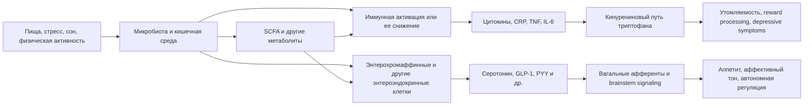

# Реальная картина связи кишечника, энтеральной нервной системы и микробиома с настроением, работоспособностью, жизненной энергией и мотивацией

## Executive summary

Если убрать маркетинг и оставить только то, что реально держится на данных к июлю 2026 года, картина такая. У кишечника действительно есть автономная энтеральная нервная система, по масштабу сравнимая со спинным мозгом, и сильная двусторонняя связь с мозгом через иммунные сигналы, гормоны, блуждающий нерв и метаболиты микробиоты. В этом смысле метафора "второй мозг" полезна. Но если понимать ее буквально, как будто кишечник сам по себе "думает", формирует мотивацию и управляет личностью, это уже сильное преувеличение. ENS надежно доказана как система, управляющая моторикой, секрецией, чувствительностью и локальными рефлексами ЖКТ; ее прямая роль как самостоятельного генератора настроения и мотивации у людей пока не доказана. citeturn19search1turn19search2turn18search2

Самая надежная клиническая часть этой темы касается не "магических микробов", а более приземленных вещей: воспаления, висцеро-сенсорной сигнализации, качества сна, симптомов IBS/IBD, питания и физической активности. Для депрессивных симптомов существуют метаанализы, показывающие небольшой или умеренный средний эффект у пре-/про-/синбиотиков и у некоторых диетических вмешательств, но результаты очень неоднородны, зависят от популяции, штамма, длительности и контроля смещений. Для усталости, мотивации, "жизненной энергии" и особенно когнитивной работоспособности данные заметно слабее: прямых РКИ мало, исходы часто вторичные, а эффекты либо малые, либо непостоянные. citeturn0search1turn10search0turn0search11turn15search1turn1search6turn11search6

Самый сильный человеческий причинный мост между кишечной биологией и снижением энергии/мотивации сегодня проходит через воспаление. Экспериментальная эндотоксемия у людей временно меняет самочувствие, утомляемость, чувствительность к награде и готовность тратить усилия; у депрессивных пациентов с повышенным воспалением блокада TNF усиливала effort-based motivation в proof-of-mechanism РКИ. Это намного более твердая часть поля, чем популярные утверждения о том, что "95% серотонина в кишечнике, значит настроение сидит в желудке". Серотонин действительно в основном периферический, но периферический серотонин не проходит гематоэнцефалический барьер, поэтому прямой вывод "больше кишечного серотонина = лучше настроение" неверен. citeturn2search0turn2search1turn2search2turn2search5turn23search0turn23search1

Практический вывод тоже довольно земной. Если цель - улучшить настроение, устойчивую дневную энергию и способность работать, то наибольший ожидаемый эффект дают не одиночные "психобиотики", а: нормализация сна и циркадного режима, регулярная физическая активность, переход на высокофибровое малопереработанное питание средиземноморского типа, а также диагностика и лечение реальных GI-проблем, если они есть. Пробиотики можно рассматривать как опциональный adjunct, но не как центральный рычаг. FMT для психических исходов остается экспериментальным направлением: интересным, но пока не рутинным и вне клинических исследований не рекомендованным для этих целей. citeturn22search1turn22search2turn5search0turn5search1turn4search4turn4search7turn21search10

## Карта ключевых утверждений Майера

Ниже я даю карту тезисов, характерных для "Второго мозга" и публичных формулировок Майера. Там, где точная цитата или страница книги в доступном мне подтверждаемом виде не установлены, я ставлю "неустановлено". Это сознательно строгий режим, чтобы не подменять текст книги догадкой.

| Тезис | Цитата/страница | Оценка | Краткое обоснование |
|---|---|---|---|
| "Кишечник - это второй мозг" | Неустановлено. Публично Майер формулирует это как наличие ENS и "mind-gut connection". | Подтверждено с оговоркой | У человека ENS действительно огромна и автономна, по современным подсчетам около 168-200 млн нейронов. Но "второй мозг" - это метафора про автономную нейрорегуляцию ЖКТ, а не отдельный центр сознания. citeturn19search0turn19search1turn19search2 |
| "Сигналы из кишечника влияют на самочувствие, телесные чувства и эмоциональный тон" | Неустановлено. В интервью Майер говорит о fullness, discomfort, well-being после еды. | Подтверждено | Доказана мощная interoceptive gut-brain связь: ощущения переполнения, тошноты, боли, дискомфорта и часть эмоционального тона действительно зависят от висцеральной афферентации. citeturn9search0turn19search2 |
| "Микробы кишечника могут влиять на настроение" | Неустановлено. | Вероятно | Для депрессивных симптомов у людей есть положительные, но неоднородные метаанализы и небольшие РКИ. Эффект в среднем есть, но он неуниверсален и часто мал или умерен. citeturn0search1turn10search0turn15search1turn11search0 |
| "Микробы влияют на наши решения и выборы" | Неустановлено. В публичных выступлениях Майер обсуждает возможную связь с reward system и eating behavior. | Спекуляция | Для людей есть отдельные интересные сигналы, включая влияние диеты/синбиотика на social decision-making, но это очень далеко от общего тезиса "микробы управляют решениями". Поле пока раннее. citeturn9search0turn3search5 |
| "Поскольку 90-95% серотонина связано с кишечником, кишечник сильно определяет настроение" | Неустановлено. | Ошибка как сильный вывод | Факт о периферическом серотонине верен, но периферический серотонин не пересекает гематоэнцефалический барьер. Значит, это не прямой маршрут "кишечный серотонин = настроение". Реальнее говорить о косвенных путях через tryptophan, вагус, иммунитет и local signaling. citeturn23search0turn23search1turn17search0turn17search7 |
| "Воспаление и сигналы из кишечника могут вести к подавленности, усталости и снижению мотивации" | Неустановлено. | Подтверждено/вероятно | Человеческие модели воспаления и anti-inflammatory proof-of-mechanism trials реально показывают изменения в fatigue, reward processing и willingness to expend effort. Но это не значит, что любой "дисбиоз" автоматически вызывает депрессию. citeturn2search0turn2search1turn2search5turn14search7 |
| "Психобиотики как отдельная таблетка могут заметно улучшать настроение" | Неустановлено. | Спекуляция | У части РКИ и метаанализов есть сигнал в пользу adjunctive benefit, но далеко не у всех. Сам Майер в публичном интервью позже прямо говорил, что идея "один пробиотик как Xanax/Prozac" скорее окажется мифом. citeturn0search1turn10search0turn9search0 |
| "FMT и другие микробиомные манипуляции могут стать терапией психических состояний" | Неустановлено. | Вероятно, но пока экспериментально | В 2024-2026 появились пилотные и первые полноценные РКИ с обнадеживающими результатами для депрессии и депрессивных симптомов, но официальные гастроэнтерологические рекомендации пока поддерживают FMT в основном для recurrent C. difficile, а не для психиатрических показаний. citeturn12search4turn12search2turn12search5turn4search4turn4search7 |

Вывод по Майеру простой: как популяризатор он в ключевом направлении был скорее "раньше времени прав", чем "просто неправ". Но самые сильные формулировки книги сегодня надо приземлять. Реальные данные поддерживают gut-brain axis как важный модификатор состояния, а не как главный скрытый мастер-рычаг личности, мотивации и продуктивности. citeturn9search0turn15search1turn18search9

## Доказательная база по вмешательствам

Самая плотная литература есть по пробиотикам и смешанным microbiome-targeted treatments. Метаанализ 2022 года по 54 placebo-controlled studies нашел в основном скромные эффекты: качественно большинство отдельных работ не показывали явного выигрыша по mood/stress/anxiety, но на количественном уровне depression и psychiatric distress улучшались слегка. Более новые метаанализы 2024-2026 годов часто дают более сильные pooled-эффекты, вплоть до SMD порядка -0.5, но почти всегда на фоне высокой гетерогенности, разнородных штаммов и слабой переносимости результатов между регионами: в одном из метаанализов сигнал был заметен главным образом в азиатских выборках, а в Европе и Океании выраженного эффекта не было. Это значит, что "пробиотики работают" как общий тезис слишком груб; правильнее: некоторые схемы у некоторых пациентов могут modestly help, чаще как дополнение, а не замена стандартной терапии. citeturn0search1turn10search0turn0search11turn15search1turn10search1

По пребиотикам и диете картина на сегодня выглядит убедительнее, чем по isolated probiotic pills. РКИ "Gut Feelings" показало, что high-prebiotic diet за 8 недель уменьшала total mood disturbance и улучшала anxiety, stress и sleep, тогда как отдельный probiotic supplement явного основного антидепрессивного эффекта не дал, а synbiotic-комбинация неожиданно тоже не выиграла. Вторичный анализ того же исследования по когнитивным исходам показал лишь слабый сигнал на working memory и не дал основания говорить о надежном росте когнитивной производительности. По Mediterranean-style diet есть конфликтующие метаанализы 2025 года: один дал умеренный положительный эффект, другой - отсутствие значимого влияния при очень низкой certainty. В реальности это лучше читать так: whole-diet interventions выглядят перспективнее капсул, но доказательства еще нестабильны и качество их далекo от идеала. citeturn11search0turn11search6turn16search6turn16search1turn16search2

Для fatigue, "внутренней энергии" и работоспособности прямых microbiome-RCT исходов мало. Есть косвенные сигналы: улучшение сна в части исследований с pre/pro/synbiotics, weak evidence по working memory, отдельные данные по wellbeing. Но robust human evidence, что вмешательство в микробиом само по себе заметно поднимает рабочую выносливость, sustained motivation или продуктивность, пока нет. Если смотреть практично, больше данных есть для сна и физической активности: хронический недосып поднимает IL-6 и CRP, а exercise уменьшает депрессивные симптомы и часто снижает системное воспаление. Это важнее для "жизненной энергии", чем большинство прямых микробиомных продуктов. citeturn10search4turn18search1turn13search2turn22search0turn22search6turn14search1

FMT - самый "громкий", но пока самый неготовый к рутинной практике путь. Здесь в 2024-2026 произошло реальное движение: был пилот по MDD с хорошей выполнимостью и безопасностью, в 2026 вышел RCT при major depressive disorder с более выраженным снижением HAMD-17 на фоне escitalopram, а также pilot RCT при bipolar depression; были и позитивные исследования по депрессивным симптомам в других клинических популяциях. Но метаанализы 2025-2026 годов уже расходятся: один не видит значимого общего эффекта, другой находит выраженный benefit, особенно при IBS и кратко-среднесрочном наблюдении. На этом фоне официальная позиция AGA остается очень сдержанной: fecal microbiota-based therapies рекомендуются для recurrent C. difficile, а для IBS и не-C. difficile состояний - не рутинно, кроме clinical trials. citeturn12search5turn12search4turn12search2turn12search3turn12search0turn12search1turn4search4turn4search7

Особая линия доказательств касается воспаления как механизма снижения мотивации. В исследованиях с LPS/endotoxin у людей повышалось воспаление, снижались positive affect и vigor, менялась reward processing и willingness to exert effort; при этом эффекты не сводились к "грусти", а затрагивали именно effort allocation и reward sensitivity. Еще важнее proof-of-mechanism trial у депрессивных пациентов с CRP >3 мг/л: infliximab увеличивал готовность выбирать effortful rewards, а сдвиг связывался со снижением TNF signaling. Для твоего вопроса про "внутреннюю энергию" это, возможно, самый весомый кусок всей области. citeturn2search1turn2search2turn2search0turn2search5

| Авторы, год | Тип | Выборка | Вмешательство | Итог для настроения/энергии/когниции | Качество/заметка | Источник |
|---|---|---:|---|---|---|---|
| Ng et al., 2022 | Метaанализ | 54 РКИ | Пробиотики | Малый pooled-эффект на depression/distress; качественно многие исследования нейтральны | Высокая гетерогенность | citeturn0search1 |
| Zhang et al., 2025 | Метaанализ | 72 РКИ | Pre/pro/synbiotics | Снижение depression, anxiety и улучшение sleep, но heterogeneity высокая | GRADE-ограничения, нужны крупные РКИ | citeturn10search0 |
| Другая GRADE-meta, 2025 | Метaанализ | 70 РКИ | Pre/pro/synbiotics | Depression SMD около -0.57, anxiety около -0.43 | Гетерогенность ~80% | citeturn0search11 |
| Wang et al., 2025 | Метaанализ | 34 исследования | Microbiome-targeted treatment при depression | Общий эффект SMD -0.26; выраженные региональные различия | Европа/Океания без явного сигнала | citeturn15search1 |
| Freijy et al., 2023 | РКИ | 119 | High-prebiotic diet vs probiotic vs synbiotic vs placebo | Prebiotic diet уменьшала mood disturbance; probiotic и synbiotic - нет | Небольшое РКИ, исходы прагматичные | citeturn11search0 |
| Freijy et al., 2025 | Вторичный анализ РКИ | 118 | Те же группы | Только слабый сигнал на working memory; без надежного когнитивного буста | Вторичный исход | citeturn11search6 |
| Marx et al., 2020 | Метaанализ | 22 исследования, n=1551 | Pre/pro/fermented foods | Нет значимого pooled-эффекта на global cognition | Важный "негативный" якорь | citeturn1search6 |
| Green et al., 2023 | Pilot РКИ | Небольшое | FMT при MDD | Хорошая feasibility/safety; efficacy предварительная | Proof-of-concept | citeturn12search5 |
| 2026 MDD RCT | РКИ | Не очень крупное | Adjunctive FMT + escitalopram | Больше снижение HAMD-17 на 2 и 8 неделях, ремиссия не различалась | Интересно, но рано для практики | citeturn12search4 |
| Shekarriz et al., 2026 | Pilot РКИ | 35 | Allogenic vs autologous FMT при bipolar depression | Обе группы улучшились; сильного окончательного вывода пока нет | Пилот, not practice-changing | citeturn12search2 |

## Механистическая карта

По SCFA доказательная база смешанная. Что микробиота производит acetate/propionate/butyrate и что эти молекулы важны для барьера, иммунной регуляции и метаболизма - это твердо. Что именно SCFA являются ключевым драйвером улучшения настроения и мотивации у людей - нет. Здесь до сих пор преобладают механистические и животные данные, хотя у людей уже есть неплохая физиологическая база и отдельные связи с иммунными и метаболическими исходами. citeturn7search7turn2search4turn3search0

По цитокинам данные у людей самые сильные. Повышенное воспаление ассоциируется с депрессией, а экспериментальная иммунная активация временно меняет настроение, утомляемость и reward circuitry. Более того, anti-TNF intervention у воспалительно-подтипа депрессии улучшала effort-based motivation. Здесь есть не только корреляция, но и элементы причинности. citeturn14search7turn14search8turn2search0turn2search1turn2search5

По блуждающему нерву ситуация средняя. Как анатомический и физиологический канал gut-brain signaling вагус бесспорен. Но для specific microbiome-to-motivation pathway у людей прямых доказательств немного. Есть небольшие исследования, где probiotics меняли показатели vagal function по HRV и часть сопутствующих симптомов, однако это пока не тянет на завершенную причинную модель. Большая часть сильных mechanistic claims здесь по-прежнему опирается на животных. citeturn18search1turn19search2turn18search2

По энтероэндокринным гормонам картина лучше для аппетита и satiety, чем для мотивации и настроения. У человека хорошо доказано, что gut hormones вроде GLP-1 и PYY участвуют в регуляции аппетита, пищевого поведения и энергетического баланса; их связь с affective vigor существует, но остается косвенной. При этом 2025 работа на человеческих EC-органоидах показала, что эти клетки реально отвечают на бактериальные метаболиты и аминокислоты, то есть звено "микробный сигнал -> enteroendocrine response" у людей уже становится намного реальнее, чем несколько лет назад. citeturn17search7turn8search3turn7search4

По tryptophan/serotonin надо жестко разделять правду и популярную легенду. Правда: около 90-95% серотонина в организме связано с периферией, значительная часть - с кишечником; микробы и их метаболиты могут влиять на его синтез в enterochromaffin cells. Легенда: "значит кишечный серотонин напрямую определяет настроение". Нет, периферический серотонин не проходит в мозг. Для mood/reward гораздо реалистичнее смотреть на доступность tryptophan, activation of IDO, kynurenine pathway, inflammation и косвенные нейровегетативные пути. citeturn17search0turn23search0turn23search1turn17search6

| Механизм | Что доказано у людей | Что в основном опирается на животных/доклинику | Статус |
|---|---|---|---|
| ENS как автономная нейросистема ЖКТ | Да: анатомия, нейронные числа, автономные рефлексы ЖКТ | Прямое влияние ENS на мотивацию/личность | Доказано для ЖКТ, не для "психики как таковой". citeturn19search1turn19search2 |
| SCFA | Да: образование, метаболические и иммунные эффекты у людей | SCFA как главный causal driver mood/energy gains | Вероятно, но неполно. citeturn7search7turn2search4 |
| Цитокины и low-grade inflammation | Да: ассоциации с depression; causal probes через endotoxin и anti-TNF | Детальная нейросхема, региональная специфичность | Наиболее убедительное звено. citeturn2search0turn2search1turn2search5turn14search7 |
| Вагус | Да как анатомический маршрут; есть небольшие probiotic-HRV сигналы | Большинство specific microbiome-vagus-behavior claims | У людей пока в основном косвенно. citeturn18search1turn19search2 |
| Энтероэндокринные гормоны | Да для аппетита/сытости; EC-ответы на стимулы в human organoids | Прямой вклад в working motivation | Доказано частично. citeturn17search7turn8search3 |
| Триптофан/серотонин | Да: периферический серотонин, separate pools, kynurenine pathway | Простая формула "gut serotonin = mood" | Популярный тезис слишком упрощен. citeturn23search0turn23search1turn17search6 |

## Практическая иерархия и микроэксперимент

Если ранжировать вмешательства по реальному ожиданию эффекта на энергию, мотивацию и работоспособность, а не по хайпу, список выглядит так.

Первый уровень - whole-diet upgrade: больше овощей, бобовых, цельных злаков, орехов, фруктов, меньшая доля ультрапереработанной пищи, достаточная клетчатка. Это одновременно влияет на микробиоту, гликемическую стабильность, воспаление и пищевое поведение. WHO рекомендует взрослым не менее 400 г овощей и фруктов в день и не менее 25 г природной пищевой клетчатки. Для depressive outcomes whole-diet interventions выглядят перспективнее отдельных пробиотиков, хотя качество доказательств пока неидеально. citeturn5search0turn5search1turn11search0turn16search6turn16search1

Второй уровень - физическая активность и сон. Это не "чисто микробиомные" рычаги, но именно они чаще реально поднимают дневную энергию. WHO рекомендует взрослым 150-300 минут умеренной активности в неделю; современные метаанализы показывают заметное уменьшение depressive symptoms и, часто, снижение воспалительных маркеров. Наоборот, несколько ночей частичного недосыпа уже поднимают IL-6 и CRP. Для субъективной жизненной энергии это обычно сильнее, чем любая банка probiotic capsules. citeturn22search1turn22search2turn22search6turn14search1turn13search2

Третий уровень - работа с конкретной GI-проблемой. Если есть IBS, запоры, хроническое вздутие, reflux, IBD, то лечение самого GI-состояния часто улучшает состояние сильнее, чем абстрактная "починка микробиома". NICE рекомендует при refractory IBS учитывать psychological interventions; low-FODMAP diet имеет хорошую эффективность для симптомов IBS и качества жизни, а gut-directed hypnotherapy тоже выглядит полезной. При IBD fatigue тесно связана со сном, тревогой/депрессией и активностью болезни. То есть иногда путь к энергии лежит не через "ноотропный микроб", а через уменьшение боли, позывов, диареи, бессонницы и воспаления. citeturn6search8turn6search1turn20search2turn20search6turn20search5

Четвертый уровень - аккуратный n-of-1 trial с пробиотиком или prebiotic-rich diet. Это уже можно пробовать, но с реалистичными ожиданиями: mild effect possible, guaranteed effect - нет. Лучше выбирать сценарий, где одновременно есть mild GI complains или низкое потребление клетчатки, потому что именно там шанс увидеть эффект выше. Официальные GI-guidelines до сих пор не рекомендуют probiotics "вообще для всего"; а психиатрические официальные рекомендации, например NICE по депрессии, не включают их как стандартную первую линию. citeturn4search0turn4search3turn21search10turn11search0

Пятый уровень - FMT только в исследованиях или по approved GI indications. Для психиатрических целей это еще не routine medicine. Идея интересная, данные нарастают, но на сегодня это не то вмешательство, которое стоит ранжировать высоко для бытовой задачи "хочу больше энергии и мотивации". citeturn12search4turn12search2turn4search4turn4search7

Практичный протокол самонаблюдения я бы делал так: 2 недели baseline, затем 4 недели одного вмешательства, затем 2 недели washout, затем 4 недели альтернативы. Не меняй сразу сон, кофеин, тренировочный объем и диету одновременно, иначе ты не поймешь, что сработало. Первичные исходы: энергия 0-10, мотивация к сложной задаче 0-10, минуты глубокого фокуса, субъективная усталость вечером. Вторичные: настроение 0-10, GI discomfort 0-10, Bristol stool scale, вздутие, сон, кофеин, алкоголь, интенсивность тренировки, болезнь/простуда. Если тестируешь диету, держи стабильными режим сна и тренировки. Если тестируешь пробиотик, не меняй одновременно рацион. citeturn13search2turn22search1turn11search0

Шаблон дневника:

| Дата | Сон, часы | Качество сна 0-10 | Энергия утром 0-10 | Мотивация к работе 0-10 | Deep work, мин | Настроение 0-10 | Усталость вечером 0-10 | Вздутие/боль 0-10 | Bristol | Клетчатка примерно, г | Ферментированные продукты | Пробиотик/доза | Кофеин, мг | Тренировка | Алкоголь | Комментарий |
|---|---:|---:|---:|---:|---:|---:|---:|---:|---|---:|---|---|---:|---|---|---|

Критерий реального личного эффекта лучше задать заранее: например, не меньше чем +1 балл по средней энергии и мотивации и не меньше 45-60 минут прироста deep work в день на последней неделе вмешательства по сравнению с baseline, без ухудшения сна и GI-симптомов. Если выигрыш меньше, то даже при "статистически красивой" идее это, вероятно, не твой основной рычаг. citeturn11search6turn2search5

## Приоритетные первичные источники и рекомендации

Для быстрого и честного погружения я бы ставил в начало списка не популярные обзоры, а такие опорные источники: обзор ENS и его современного масштаба; работа по числу нейронов ENS у человека; классическая работа о микробиоте и периферическом серотонине; Gut Feelings RCT и его когнитивный secondary analysis; метаанализы 2022-2026 по probiotics/prebiotics/synbiotics; новые FMT RCTs при MDD и bipolar depression; human endotoxin studies по reward/effort; infliximab proof-of-mechanism trial при inflammatory depression. citeturn19search2turn19search1turn17search0turn11search0turn11search6turn10search0turn15search1turn12search4turn12search2turn2search1turn2search5

Из клинических и официальных рекомендаций приоритетны: WHO guidance по здоровому питанию и физической активности; NICE по депрессии и NICE по IBS; AGA по probiotics и fecal microbiota-based therapies; ACOG по vaginal seeding как хороший пример того, как официальная медицина тормозит красивые микробиомные идеи до появления надежных данных. Это полезно не только practically, но и как antidote против избыточного энтузиазма вокруг microbiome hype. citeturn5search0turn5search1turn22search1turn21search10turn6search1turn6search8turn4search0turn4search4turn5search2

Итоговая реальная картина такая. Связь кишечника с настроением и частью ощущаемой энергии реальна. Самый надежный путь этой связи у людей сегодня проходит через interoception, воспаление, сон, симптомы ЖКТ и метаболические/эндокринные сигналы. Влияние микробиома на депрессивные симптомы уже нельзя считать фантазией, но и считать его главным объяснением мотивации, продуктивности и "внутреннего огня" пока нельзя. Для практики это означает: сначала сон, движение, рацион, лечение GI-проблем и только потом - точечные эксперименты с пре-/про-/синбиотиками; FMT пока держать в категории "интересное исследовательское направление". citeturn2search5turn11search0turn10search0turn12search4turn4search7
