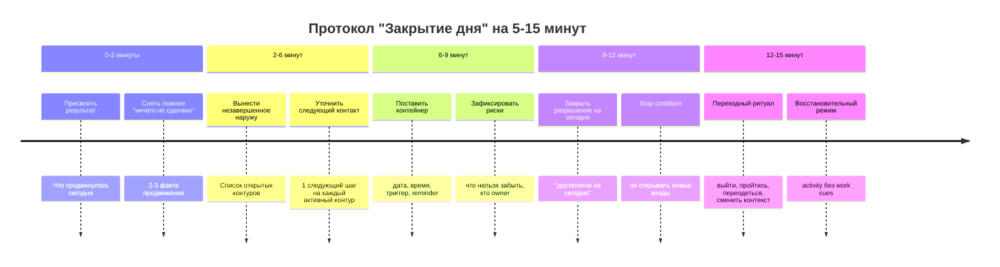
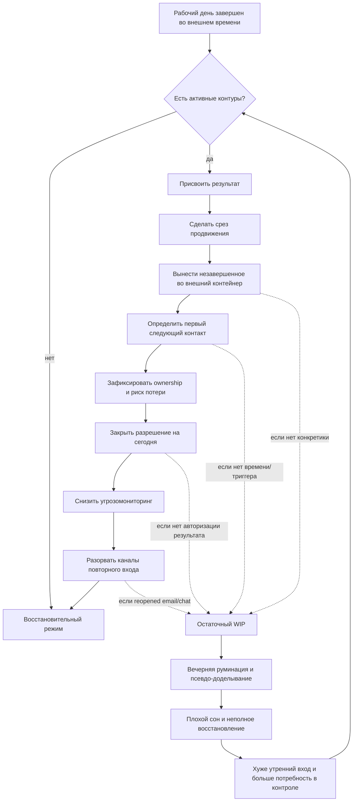

# Невозможность расслабиться после продуктивного дня

## Executive summary

Феномен, который вы описываете, в научной литературе лучше всего понимается не как "слабая дисциплина" и не как простая нехватка отдыха, а как сбой перехода между двумя когнитивными режимами: режимом целенаправленного контроля и режимом восстановления. В терминах организационной психологии это связано с низким psychological detachment, то есть недостаточным психологическим отсоединением от работы в нерабочее время. В терминах исследования руминации - с work-related rumination, особенно affective rumination, а в более общей для клинической психологии рамке - с perseverative cognition, то есть повторяющимся когнитивным удержанием угрозы, незавершенности и неопределенности. Мета-анализы и обзоры показывают, что detachment после работы связан с лучшим самочувствием, меньшей усталостью, лучшим сном и в среднем с лучшими рабочими исходами, а интервенции на detachment дают небольшой, но надежный средний эффект. citeturn26view0turn28view0turn24view0turn4search1turn7search2

Главный практический вывод такой: после продуктивного дня человеку часто мешает не сама незавершенность, а незавершенность без контейнера. Когда остаются важные задачи, но не создан внешний носитель для следующего входа, не определен первый следующий контакт, не зафиксирован статус продвижения и не снят режим угрозомониторинга, мозг продолжает держать задачу "в оперативной памяти" и возвращаться к ней вечером. Экспериментальная работа по unfulfilled goals показывает, что незавершенные цели повышают доступность goal-related мыслей и мешают выполнению других задач, но формулировка конкретного плана может резко уменьшать этот когнитивный хвост даже до фактического завершения самой задачи. При этом современная мета-аналитика показывает, что классический "эффект Зейгарник" как универсальное преимущество памяти для незавершенных задач воспроизводится плохо; лучше опираться не на миф о "памяти на незавершенное", а на более устойчивые данные о goal accessibility, urge to resume и cognitive interference. citeturn32view0turn22view5

Вечернее планирование помогает не всегда. Оно, вероятнее всего, полезно тогда, когда кратко переводит внутренний WIP во внешний контейнер, задает следующий конкретный шаг и после этого закрывается. Оно начинает вредить, когда превращается в повторное погружение в проблемное поле: приоритизация без конца, дополнительный анализ, reopening почты и мессенджеров, оценивание качества сделанного, контрольные проверки или попытка "доделать в голове". Полевая работа van Eerde и коллег особенно важна: goal setting и implementation intentions в контексте detachment не дали общего выигрыша, а у людей с высокой привычкой к планированию даже снижали detachment. Это сильный аргумент против идеи "чем больше вечером планируешь, тем лучше". citeturn22view13turn14search3

Ниже дана инженерная модель "Выход из дня" как отдельного когнитивного контура: присвоить результат, зафиксировать срез продвижения, вынести незавершенное во внешний контейнер, определить первый следующий контакт, закрыть разрешение на восстановление, снизить мониторинг угроз и переключиться в восстановительный режим. Это не "магический ритуал", а evidence-informed сборка из нескольких относительно хорошо поддержанных компонентов: offloading, краткого плана, boundary management, ограничения after-hours ICT, mindfulness/relaxation и базовых принципов sleep protection. Для branded "shutdown ritual" как самостоятельной стандартизованной техники прямых RCT почти нет; поэтому корректнее говорить, что evidence есть у компонентов, а не у популярного ярлыка как такового. citeturn24view0turn31search0turn31search1turn38view0turn37search1turn13search4

## Как литература описывает феномен

В организационной психологии базовый конструкт - psychological detachment from work, то есть мысленное дистанцирование от работы в нерабочее время. В мета-анализе Wendsche и Lohmann-Haislah detachment был положительно связан с ментальным и физическим здоровьем, sleep, state well-being и task performance, а job demands и работа по вечерам были отрицательно связаны с detachment. В обзоре Sonnentag, Cheng и Parker recovery после работы описывается как процесс, критичный для well-being, мотивации и performance, причем особенно важен не просто "отдых", а переход от активированного рабочего состояния к деактивации и восстановлению. citeturn26view0turn4search1turn22view3

Внутри detachment-литературы очень важно различать формы work-related rumination. Ранние работы Cropley и коллег и последующие обзоры различают как минимум affective rumination, то есть эмоционально заряженное, напряженное, неприятное возвращение к рабочим мыслям, и problem-solving pondering, то есть более "инструментальное" обдумывание рабочих задач. Это различие не косметическое: affective rumination обычно теснее связана с усталостью, плохим сном и strain, тогда как problem-solving pondering иногда выглядит менее вредной или даже связанной с интересом и креативностью, но все равно может снижать detachment и поддерживать рабочую активированность. citeturn3search12turn26view0turn23view2turn23view3

Более широкая рамка, полезная для главы учебника, - perseverative cognition hypothesis. По Brosschot и коллегам, вред может создавать не только сам стрессор, но и продолжающееся когнитивное удержание стрессора до и после события. Мета-анализ Ottaviani и коллег показал, что perseverative cognition связана с более высокой физиологической активацией, а мета-анализ Clancy и коллег - что worry и rumination связаны с худшим sleep quality, меньшей длительностью сна и большим sleep latency в неклинических выборках. Это хорошо ложится на ваш тезис о "невозможности выйти из WIP": тело формально уже вне задачи, но система контроля продолжает вести ее как актуальную угрозу или текущую concern. citeturn7search2turn7search0turn7search1

Для темы незавершенности важны две дополняющие линии. Первая - классическая goal tension / current concerns tradition у Левина и Клинджера: активная цель создает состояние напряжения и повышает вероятность самопроизвольного возвращения мысли к goal-relevant сигналам. Вторая - более современная экспериментальная линия Masicampo и Baumeister: unfulfilled goals действительно повышают intrusive thinking, mental accessibility и interference на несвязанных задачах, но конкретный план может резко уменьшить этот когнитивный хвост. Важно, однако, не перепродавать "эффект Зейгарник": мета-анализ 2025 года показал, что надежного memory advantage для незавершенных задач как общего закона нет, тогда как tendency to resume interrupted tasks выглядит более устойчивой. Для учебника безопаснее говорить не "незавершенное всегда лучше хранится в памяти", а "активные и незаконтейнеренные цели повышают доступность связанных мыслей и тянут к возобновлению". citeturn32view0turn20search3turn22view5

Когнитивная наука о attentional residue помогает описать субъективное "я уже не работаю, но часть внимания еще там". Leroy показал, что при переключении между задачами часть внимания остается на предыдущей незавершенной задаче, снижая качество последующей деятельности. В вашей теме это особенно ценно как мост между офисной продуктивностью и вечерним восстановлением: рабочий день объективно закончился, но attention allocation еще не полностью пересобран. Это не обязательно клиническая руминация; иногда это просто остаточный след незавершенного task set. citeturn0search14

Перспективная память и cognitive offloading добавляют еще один важный механизм. Review Risko и Gilbert определяет cognitive offloading как использование внешних действий и средств для снижения внутренних когнитивных требований. Review Gilbert по intention offloading показывает, что внешние reminders и записи для delayed intentions высокоэффективны и регулируются метакогнитическими процессами. Более новые данные показывают, что люди чаще ставят reminders на более важные планы и на те, которые, по их оценке, они с большей вероятностью забудут. Для вашей главы это прямое основание для идеи "внешнего контейнера для будущего входа". Отсутствие такого контейнера повышает потребность держать намерение "в голове". citeturn31search0turn31search1turn31search9

Наконец, boundary management between work and non-work. Annual Review Allen и коллег показывает, что detachment - лишь один из способов создавать дистанцию между доменами, а систематические обзоры по after-hours ICT use показывают, что технологии после рабочего времени размывают границы, повышают work-family conflict и усложняют recovery. Особенно показательно, что даже если after-hours ICT иногда дает ощущение гибкости или enrichment, связь с work-family conflict остается устойчиво положительной. citeturn6search9turn38view0

## Механизмы тревожной незавершенности

Ниже - сжатая механистическая карта. Это не окончательная "нейроистина", а рабочая инженерная модель, собранная из того, что лучше всего поддерживается данными.

| Механизм | Типичное проявление вечером | Как проверить у человека | Interventions, которые логичны по evidence | Основание |
|---|---|---|---|---|
| Незавершенная цель остается активной | "Я не могу отпустить, пока не закончу" | Возврат одних и тех же мыслей, даже без внешних триггеров | Записать конкретный следующий шаг, время/контекст возвращения к задаче | Masicampo и Baumeister показали intrusive thoughts и interference от unfulfilled goals, уменьшающиеся после конкретного плана. citeturn32view0 |
| Остаточное внимание и незакрытый task set | Фоновое "мысленное доделывание" во время отдыха | Сложно сосредоточиться на чтении, разговоре, фильме; внимание уходит обратно | Короткий shutdown-блок с фиксацией статуса и stop condition | Attentional residue и work-goal interference указывают, что не все переключения закрываются мгновенно. citeturn0search14turn32view0 |
| Нет внешнего контейнера для будущего входа | "Если отпущу, завтра забуду важное" | Человек старается повторять в голове, чтобы не потерять | Offloading: запись задачи, reminders, календарный "первый контакт" | Cognitive offloading и intention offloading высокоэффективны для delayed intentions. citeturn31search0turn31search1turn31search9 |
| Неопределен следующий шаг | В голове крутится проблема, но не возникает завершения | Записано "сделать X", но не записано "с чего начну" | Превратить item в следующий наблюдаемый шаг | Специфический план лучше снимает goal activation, чем просто думать о цели. citeturn32view0turn14search3 |
| Высокая значимость и цена ошибки | Трудно "разрешить себе" выйти из работы | Тревога усиливается у задач с риском потерь, статуса, ответственности | Отдельно фиксировать критерий "достаточно на сегодня" и открытые риски/owners | Goal relevance и threat-monitoring из current concerns и perseverative cognition делают мысли более липкими. citeturn20search3turn7search2 |
| Перегруз WIP | Много активных хвостов, ощущение расползания | 7-15 открытых контуров, ни один не имеет clear next step | Сведение к shortlist, перенос остального в backlog, не пытаться вечером приоритизировать все | Низкий detachment связан с demands и after-hours work; unresolved tasks усиливают rumination. citeturn26view0turn39search5turn18search0 |
| Недостаток авторизации результата | "Формально сделал много, но как будто ничего не закрыто" | Отсутствует завершенная запись о прогрессе или критериях done-for-today | Capture progress snapshot: что продвинулось, что теперь иначе, что можно продолжать завтра | В recovery-рамке важно не только demand reduction, но и ощущение control/mastery; detachment страдает, когда день не переживается как структурированный. citeturn28view0turn24view0 |
| Тревога как попытка удержать контроль | Мысли не приближают решение, но "не дают отпустить" | Если спросить "что дает это думание?", ответ: "хотя бы не потеряю" | Worry postponement, external record, ограничение checking | Perseverative cognition удерживает физиологическую и когнитивную активацию; worry postponement уменьшает daily worry. citeturn7search2turn34view0turn33view0 |
| Сбой перехода из мобилизации в восстановление | Вечером тело устало, а кортикально все еще "на смене" | Трудно перейти к расслабляющей активности без вины и сканирования угроз | Boundary ritual, physical transition, no after-hours ICT, mindfulness/relaxation | Recovery literature и detachment interventions подтверждают ценность переходных практик, хотя прямое доказательство именно branded ritual ограничено. citeturn24view0turn37search1turn38view0 |

Практически важная формулировка для учебника может звучать так: "тревога незавершенности" часто является не сигналом "нужно прямо сейчас еще работать", а сигналом "контур работы не доведен до внешне управляемого состояния". Это принципиально разные вещи. В первом случае требуется дополнительное выполнение работы. Во втором - завершение когнитивной организации работы на сегодня. Экспериментальные данные про планы, reminder setting и detachment больше поддерживают именно вторую интерпретацию. citeturn32view0turn31search1turn24view0

Здесь полезно явно различать два смысла "контроля". Первый - контроль над самим внешним объектом работы. Второй - контроль над тем, как задача представлена в когнитивной системе. Вечером человек часто не может получить первый тип контроля, но вполне может получить второй: зафиксировать статус, вынести будущее действие наружу, назначить следующий вход и прекратить внутреннее удержание. Именно этот второй тип контроля и делает восстановление совместимым с объективной незавершенностью работы. citeturn31search0turn31search1turn32view0

## Сон, восстановление, выгорание и дифференциальная картина

Связь сном и recovery - одна из самых устойчивых частей evidence. Мета-анализ Clancy и коллег показал, что worry/rumination связаны с худшим качеством сна, более коротким total sleep time и большей латентностью засыпания. В рабочем контексте детальная картина поддерживается diary-исследованиями: work stress и work-related rumination связаны с менее restful sleep, а affective rumination выступает вероятным посредником между unfinished tasks и weekend sleep impairment. Это делает вред evening carryover не только субъективным, но и функциональным: он подрывает один из главных каналов восстановления. citeturn7search1turn17search0turn39search5turn39search8

Для следующего рабочего дня последствия тоже описаны достаточно ясно. Daily studies показывают, что feeling recovered in the morning связано с лучшей day-level task performance, personal initiative и меньшей compensatory effort, а качественные off-job experiences вечером связаны с большей проактивностью на следующий день. Поэтому позиция "нельзя расслабляться, иначе завтра будет хуже" часто обратна данным: хроническая неспособность выйти из WIP скорее ухудшает завтрашнюю работу через fatigue, impairments in attention и poorer recovery. citeturn40search4turn40search22turn40search5turn4search1

С burnout связь тоже есть, но ее важно формулировать аккуратно. WHO прямо указывает, что burnout в ICD-11 - это occupational phenomenon, а не медицинский диагноз. Longitudinal и meta-analytic данные показывают, что низкий detachment связан с exhaustion и другими strain outcomes; следовательно, феномен "вечером не могу отпустить работу" можно рассматривать как один из risk pathways к burnout, но не как его достаточный или специфический маркер. citeturn8search3turn8search7turn26view0turn23view2

Для учебника особенно полезно развести пять состояний.

Нормальный остаточный когнитивный след после важной работы - это кратковременное, частично произвольное возвращение мысли к значимой задаче без сильного дистресса и без существенного нарушения сна, способности переключаться и восстанавливаться. Он часто встречается после cognitively demanding work и сам по себе не патологичен. Литература по goal activation и residual attention это допускает. citeturn0search14turn32view0

Вредная working rumination - это повторяющееся, преимущественно непроизвольное, affectively negative возвращение к рабочему содержанию, которое поддерживает напряжение и затрудняет detachment. Именно эта форма наиболее стабильно связана с fatigue, worse sleep и poorer well-being. citeturn3search12turn7search1turn39search5turn26view0

Полезное краткое планирование следующего дня - это ограниченная по времени и форме процедура перевода открытых контуров во внешний план. Ее функция не "еще поработать", а снизить внутреннюю потребность в удержании намерения. Отсюда ключевой критерий: после планирования should come less cognitive load, not more. Это хорошо согласуется с данными Masicampo и Baumeister, но прямых исследований именно офисного end-of-day planning пока мало. Поэтому здесь корректнее говорить evidence-informed, а не strongly evidence-based. citeturn32view0turn22view13

Тревожное "доделывание в голове" - это псевдопроблем-солвинг без реального closure: человек внутренне многократно обходит те же куски задачи, но не создает ясного next step, не снижает uncertainty и не завершает контур. С точки зрения perseverative cognition это характерный пример sustained cognitive activation без продуктивного выхода. citeturn7search2turn16search15

Клинически значимые состояния нужно держать отдельно. При GAD характерны excessive worry по разным жизненным доменам, трудность контролировать worry, ощущение "on edge", trouble relaxing и sleep disturbance. При OCD-подобном checking - intrusive thoughts и compulsive checking или mental rituals. При insomnia - difficulty initiating or maintaining sleep с daytime impairment, причем для chronic insomnia ориентиром являются не менее 3 ночей в неделю в течение 3 месяцев. Для depression характерны стойкое снижение настроения или интереса плюс нарушения сна, энергии и концентрации. Для ADHD - устойчивые проблемы внимания, организации и self-control, начинающиеся не "только на этой работе". Для bipolar spectrum красный флаг - decreased need for sleep, racing thoughts, unusually elevated or irritable mood, excessive energy и impaired judgment. В этих случаях "продуктивностная" рамка уже недостаточна. citeturn8search0turn8search5turn10search6turn10search18turn9search0turn8search2turn8search6turn9search1turn9search3

## Интервенции и вопрос о вечернем планировании

Самый надежный общий вывод об интервенциях: detachment можно улучшать, но средний эффект обычно не огромный. Мета-анализ Karabinski и коллег по 30 исследованиям и 34 интервенциям показал средний положительный эффект d = 0.36. Более эффективными оказывались более длинные и более дозированные вмешательства; interventions, работающие с appraisal, выглядели особенно перспективно. Это означает, что "выход из дня" лучше думать как тренируемый навык, а не как разовую уловку. citeturn24view0

Что действительно поддержано лучше всего:

Во-первых, mindfulness-based interventions. Systematic review Querstret и Cropley по treatments for rumination/worry показал, что mindfulness-based и CBT-подобные подходы в целом могут уменьшать rumination и worry. Отдельный RCT Querstret, Cropley и Fife-Schaw показал, что online instructor-led mindfulness снизил work-related rumination и fatigue и улучшил sleep quality, а эффекты сохранялись на follow-up. Еще одна линия работ Michel и коллег и Althammer и коллег показывает, что mindfulness, преподаваемый именно как segmentation strategy, повышает psychological detachment и work-life balance outcomes. citeturn15search0turn36search0turn36search1turn37search1turn37search7

Во-вторых, explicit offloading и планирование. Общая литература по implementation intentions показывает, что if-then planning в среднем помогает достижению целей. Но в вашей теме есть важная оговорка: прямой field experiment van Eerde и коллег не нашел общего плюса planning-interventions для evening detachment, а у людей с высокой general tendency to plan combined goal-setting + implementation intentions даже ухудшали detachment. Значит, planning как универсальный антидот здесь не работает. Ему нужен правильный формат и правильная дозировка. citeturn14search3turn22view13

В-третьих, worry postponement. Если человек застревает именно в тревожном "не отпускать, чтобы не потерять контроль", useful component может быть scheduled worry. Мета-анализ Dippel, Brosschot и Verkuil по 7 randomized trials показал small but significant reductions в worry duration и worry frequency. Более новый randomized waitlist-controlled trial у людей с GAD показал снижение worry, хотя это уже клиническая рамка, а не чисто рабочая. Для учебника важно: worry postponement не равно "планирование завтрашнего списка"; это техника ограничения времени взаимодействия с worry. citeturn34view0turn33view0

В-четвертых, digital disconnection и boundary management. Прямых RCT меньше, чем хотелось бы, но систематические обзоры по after-hours ICT показывают, что технология после работы часто вредит границам и recovery, а diary-исследования дополняют картину тем, что daily technology-assisted supplemental work через detachment связан с bedtime negative affect. Это evidence-informed основание для простого правила: shutdown не должен включать reopening каналов, которые заново пермеабилизируют границу. citeturn38view0turn40search27turn6search17

В-пятых, sleep protection. Для chronic insomnia наилучшее evidence у CBT-I; sleep hygiene alone дает более слабые результаты. Недавний systematic review and meta-analysis указывает, что sleep hygiene education как одиночная терапия insomnia все еще имеет ограниченное evidence. Значит, в вашей теме sleep hygiene - это поддерживающий слой, но не основной способ лечить вечернее удержание работы в голове. Если феномен уже перешел в устойчивую insomnia, правильнее думать в сторону CBT-I и клинической оценки, а не просто "еще лучше закрывать день". citeturn13search0turn13search2turn13search4turn10search18

Expressive writing занимает промежуточное место. Meta-analytic evidence по anxiety/depression/stress и depressive symptoms - смешанное: есть modest benefits в некоторых условиях, но результаты неоднородны, а long-term effects не всегда значимы. Есть отдельные исследования со снижением sleep difficulty, но под end-of-day shutdown specifically evidence слабее, чем для mindfulness, detachment interventions и offloading. Для учебника разумно описывать expressive writing как опцию для эмоциональной разгрузки, а не как основной компонент выхода из рабочего дня. citeturn12search0turn12search15turn12search1

Ключевой практический вопрос - когда вечернее планирование помогает, а когда запускает рабочий контур заново.

Помогает, если выполняются все пять условий. Первое: планирование короткое и ограниченное по времени. Второе: оно переводит задачу наружу, а не углубляет внутреннее problem solving. Третье: у каждой открытой задачи появляется первый конкретный контакт, а не только абстрактная формулировка. Четвертое: после него есть stop condition, например "после фиксации трех пунктов я не думаю о содержании задачи дальше". Пятое: выполняется не у самой границы сна, а ближе к концу рабочего периода или хотя бы не непосредственно перед сном. Точного "правильного" числа минут литература не дает; диапазон 5-15 минут здесь - инженерная, а не строго эмпирически доказанная рекомендация, выведенная из логики evidence о benefit of specificity и risk of reactivation. citeturn32view0turn22view13turn34view0turn13search4

Вредит, если вечернее планирование становится продолжением рабочего блока. Признаки вредного варианта: человек открывает новые источники входа, делает новую приоритизацию "с нуля", начинает писать черновики или проверять факты, пересматривает качество уже сделанного, repeatedly checks lists or mail, не может назвать четкий критерий stop и уходит после "планирования" более напряженным, чем до него. Особенно настораживает ситуация "я по привычке много планирую": именно для таких людей planning intervention в van Eerde et al. оказался потенциально контрпродуктивным для detachment. citeturn22view13turn38view0

Для учебника это можно свернуть в простое правило: "вечернее планирование полезно тогда, когда оно уменьшает WIP в голове; если оно увеличивает WIP, это уже не shutdown, а disguised work". Это не прямая цитата из статьи, а аккуратная инженерная формулировка, опирающаяся на данные о plan-induced reduction of goal activation, null/negative effects of overplanning on detachment и risk of boundary re-entry через evening work cues. citeturn32view0turn22view13turn38view0

### Короткий операционный протокол закрытия дня

Ниже - не "доказанный как пакет" ритуал, а evidence-informed сборка из компонентов, у которых есть поддержка в литературе.

Минимальный формат записи может быть таким:

1) Что завершено или сдвинуто.
2) Что остается открытым.
3) Какой первый следующий шаг.
4) Когда я вернусь к этому.
5) Что сегодня больше не делаю.

Этого достаточно, если после записи человек перестает внутренне удерживать задачу. Если нет, значит запись слишком абстрактна либо тревога уже не purely task-based. citeturn32view0turn31search1turn24view0turn38view0

## Инженерная модель "Выход из дня"

Ниже - модель, которую, на мой взгляд, можно ставить в учебник почти без нейромифологического риска.

### Стадии и операции

| Стадия | Операция | Что именно считать выполненным | Типичный провал |
|---|---|---|---|
| Присвоить результат | Назвать факты продвижения | Есть краткое описание 2-3 полученных сдвигов | "Ничего не сделал", хотя день был продуктивным |
| Зафиксировать срез | Сделать status snapshot | Понятно, на каком месте контур остановлен | На следующее утро нужен costly reconstruction |
| Вынести незавершенное | Offload open loops | Все активные контуры записаны вне головы | Человек повторяет их мысленно "на всякий случай" |
| Определить следующий контакт | First next step + trigger | У каждой active task есть первый observable action и время/триггер входа | Есть список, но нет точки входа |
| Закрыть разрешение на восстановление | Done-for-today criterion | Есть формула "на сегодня достаточно" | День не психологически завершен |
| Снизить мониторинг угроз | Contain risks | Риски и обязательства вынесены в reminders/owners | Вечернее checking и scanning |
| Перейти в восстановление | Boundary shift | Смена контекста, activity без after-hours work cues | "Отдых" происходит в том же когнитивном контуре |

Эта модель хорошо согласуется с recovery research, offloading research и goal-activation experiments, но остается инженерной интеграцией, а не названием одной валидированной теории. Так и нужно ее подавать: как рабочий synthesis model, а не как "научно доказанную единственную схему". citeturn4search1turn24view0turn31search0turn31search1turn32view0

### Рабочее определение для главы

"Невозможность расслабиться после продуктивного дня" - это состояние, при котором после объективного завершения рабочей сессии не происходит достаточного психологического отсоединения от значимых рабочих целей, и незавершенные контуры продолжают удерживаться во внутреннем внимании и угрозомониторинге вместо того, чтобы быть переведенными во внешне управляемую форму. Субъективно это переживается как тревога незавершенности, невозможность полностью разрешить себе восстановление и фоновое "доделывание в голове". Это состояние может включать нормальный остаточный когнитивный след, но становится проблемным, когда приобретает форму affective rumination, мешает сну и восстановлению, либо входит в структуру клинически значимого тревожного, обсессивного, депрессивного, sleep-related или bipolar-spectrum процесса. citeturn26view0turn7search2turn32view0turn8search0turn8search5turn10search6turn9search3

### Ключевые тезисы для будущей главы

1. После продуктивного дня человек может не расслабляться не потому, что "ленится отдыхать", а потому, что когнитивный контур работы не переведен во внешне управляемое состояние. citeturn32view0turn31search1

2. Не вся мыслительная инерция после работы вредна: краткий остаточный след и bounded planning нормальны; вреднее affective rumination и тревожное mental finishing без closure. citeturn3search12turn39search5turn7search1

3. Детachment после работы - один из центральных процессов восстановления; он связан с меньшей усталостью, лучшим сном и в среднем с лучшими рабочими исходами на следующий день. citeturn26view0turn28view0turn40search4

4. Незавершенность сама по себе не фатальна. Проблема усиливается, когда нет конкретного следующего шага, внешнего контейнера и авторизованного "достаточно на сегодня". citeturn32view0turn31search1

5. Вечернее планирование полезно только в формате deactivation planning: коротко, конкретно, externally stored, без повторного входа в problem solving. Иначе оно становится еще одной рабочей сессией. citeturn22view13turn32view0

6. Ограничение after-hours ICT и переходные boundary practices важны не как моральная добродетель, а как способы не допустить повторной пермеабилизации рабочего контура. citeturn38view0turn6search9turn40search27

7. Если evening carryover становится генерализованным, плохо контролируемым, повторяющимся и начинает серьезно ломать сон, настроение, checking behavior или потребность во сне, это уже не просто productivity issue. citeturn8search0turn8search5turn10search6turn9search0turn9search3

### Red flags для клинической оценки

- Worry распространяется далеко за пределы работы, трудно контролируется и держится месяцами. citeturn8search0turn8search4
- Есть compulsive checking, mental rituals, убедительные мысли "если не проверю/не прокручу, будет беда". citeturn8search5turn8search23
- Проблемы со сном соответствуют критериям chronic insomnia: не менее 3 ночей в неделю и 3 месяцев плюс daytime impairment. citeturn10search6turn10search18
- На первый план выходят depressed mood, anhedonia, выраженное снижение энергии, hopelessness. citeturn9search0turn9search16
- Давно и повсеместно выражены inattention, disorganization, impulsivity, а не только на текущей работе. citeturn8search2turn8search6
- Появляются racing thoughts, unusually elevated or irritable mood, markedly increased energy и decreased need for sleep. citeturn9search1turn9search3turn9search5
- Есть быстро растущая emocional exhaustion и цинизм, указывающие на burnout-risk trajectory. citeturn8search7turn26view0

### Какие утверждения лучше не делать

- "Эффект Зейгарник доказал, что мозг всегда лучше помнит незавершенные задачи". Это слишком сильно; современная мета-аналитика такого универсального вывода не поддерживает. citeturn22view5
- "Любое thinking about work after hours вредно". Нет; содержание, валентность и степень контроля важны. Problem-solving pondering и positive reflection не тождественны affective rumination. citeturn26view0turn23view2
- "Нужно просто перестать думать о работе". Это психологически наивно и не следует из данных; эффективнее изменить формат удержания задачи, а не требовать полного отсутствия мыслей. citeturn32view0turn31search1
- "Чем подробнее вечером план, тем лучше detachment". Прямые данные не подтверждают этого, а для некоторых людей показывают обратный эффект. citeturn22view13
- "Sleep hygiene решит проблему". Для chronic insomnia sleep hygiene alone имеет слабое evidence; нужны более сильные подходы, прежде всего CBT-I. citeturn13search0turn13search4turn10search18
- "Shutdown ritual научно доказан как единая техника". Прямых данных именно для branded ritual недостаточно; evidence есть у отдельных компонентов. citeturn24view0turn31search0turn38view0

## Карта источников и ограничения evidence

Ниже - компактная карта приоритетных источников, которые лучше всего держать как опорные.

| Priority | Источник | Что поддерживает | Сила доказательности | Ограничения | Как аккуратно использовать в учебнике | Идентификатор |
|---|---|---|---|---|---|---|
| Да | Wendsche & Lohmann-Haislah, 2017 citeturn24view0turn26view0 | Detachment связан с well-being, sleep, fatigue, task performance; demands и after-hours work снижают detachment | Высокая: meta-analysis, 86 publications, N = 38,124 | Много self-report, heterogeneity moderate-high | Хорошо для общих связей, хуже для каузальных утверждений | `DOI: 10.3389/fpsyg.2016.02072` |
| Да | Bennett, Bakker, Field, 2018 citeturn28view0 | Recovery experiences differ; detachment особенно связан с lower fatigue, control - с vigor | Высокая: meta-analysis, 54 samples, N = 26,592 | Не все recovery experiences равны; path models опираются на aggregate data | Полезно, чтобы не сводить recovery только к detachment | `DOI: 10.1002/job.2217` |
| Да | Sonnentag, Cheng, Parker, 2022 citeturn4search1turn22view3 | Большая рамка recovery from work, recovery paradox, future of work | Высокая: Annual Review | Narrative review, не meta-analysis по всем вопросам | Очень хорош как концептуальный каркас главы | `DOI: 10.1146/annurev-orgpsych-012420-091355` |
| Да | Karabinski et al., 2021 citeturn24view0 | Interventions for detachment работают в среднем, d = 0.36 | Высокая: meta-analysis, 30 studies | Эффект умеренный; intervention heterogeneity | Не обещать "сильный" эффект от любой практики | `DOI: 10.1037/ocp0000280`, `PMID: 34096763` |
| Да | Masicampo & Baumeister, 2011 citeturn32view0 | Unfulfilled goals intrude; specific planning can reduce cognitive interference | Высокая для механизма: серия экспериментов | Лабораторные и quasi-personal tasks, не рабочие diary data | Отличен для объяснения, почему planning может гасить internal WIP | `DOI: 10.1037/a0024192`, `PMID: 21688924` |
| Да | Ghibellini & Meier, 2025 citeturn22view5 | Классический Zeigarnik effect не универсален; urge to resume устойчивее | Высокая: meta-analysis | Новый источник, не успел накопить много репликаций вокруг себя | Использовать как анти-нейромифическую поправку | `DOI: 10.1057/s41599-025-05000-w` |
| Да | Brosschot et al., 2006 citeturn7search2 | Perseverative cognition как мост между stressor и prolonged activation | Высокая как теория/обзор | Теория сильна, но конкретные эффекты зависят от контекста | Хороший трансдиагностический язык для "тревоги незавершенности" | `DOI: 10.1016/j.jpsychores.2005.06.074`, `PMID: 16439263` |
| Да | Ottaviani et al., 2016 citeturn7search0 | Repetitive negative thinking связано с higher physiological activation | Высокая: systematic review + meta-analysis | Не специфично для work context | Полезно, чтобы показать телесный компонент "не могу выдохнуть" | `DOI: 10.1037/bul0000036`, `PMID: 26689087` |
| Да | Clancy et al., 2020 citeturn7search1 | Worry/rumination связаны с poorer sleep | Высокая: systematic review + meta-analysis | Неклинические выборки; причинность не полностью решена | Хорошо для раздела о сне | `DOI: 10.1080/17437199.2019.1700819`, `PMID: 31910749` |
| Да | Syrek et al., 2017 citeturn39search5turn39search8 | Unfinished tasks impair weekend sleep through affective rumination | Средне-высокая: diary + longitudinal component | Небольшая выборка; weekend design | Очень близко к вашему феномену, использовать обязательно | `DOI: 10.1037/ocp0000031`, `PMID: 27101340` |
| Да | Weigelt et al., 2019 citeturn18search0turn18search1 | Unfinished tasks -> lower competence need satisfaction -> more weekend rumination; proactive behavior buffers | Средняя: diary | Небольшая выборка, weekend context | Ценно для механизма "незавершенность без компетентностного closure" | `PMID: 29781629` |
| Да | Risko & Gilbert, 2016; Gilbert, 2023 citeturn31search0turn31search1 | Cognitive offloading / intention offloading как внешний контейнер для намерений | Высокая для общего механизма: reviews | Не про work detachment напрямую | Отлично поддерживает идею "вынести незавершенное наружу" | `DOI: 10.1016/j.tics.2016.07.002`, `PMID: 27542527`; `DOI: 10.3758/s13423-022-02139-4`, `PMID: 35789477` |
| Да | van Eerde et al., 2023 citeturn22view13 | Evening planning не обязательно помогает detachment; у habitual planners может мешать | Средне-высокая: field experiment + diary | Один intervention format; не последнее слово | Критически важен против популярного советизма | `DOI: 10.1007/s41542-022-00135-7` |
| Да | Dippel et al., 2023; Krzikalla et al., 2024 citeturn34view0turn33view0 | Worry postponement уменьшает daily worry; в GAD может снижать worry | Средняя: meta-analysis малых trials + RCT | Небольшое число исследований; в основном клиническая worry literature | Использовать как модуль для threat-monitoring, а не как core shutdown | `DOI: 10.1007/s41811-023-00193-x`; `DOI: 10.32872/cpe.12741` |
| Да | Querstret & Cropley, 2013; Querstret et al., 2017 citeturn15search0turn36search0turn36search1 | Interventions for rumination/worry; online mindfulness reduces work rumination, fatigue, improves sleep | Средне-высокая: systematic review + RCT | Часть evidence non-work/general; online format specific | Хорошо поддерживает mindfulness как anti-rumination tool | `DOI: 10.1016/j.cpr.2013.08.004`; `DOI: 10.1037/ocp0000028`, `PMID: 27054503` |
| Да | Santos et al., 2023 citeturn38view0 | After-hours ICT blurs boundaries and links to work-family conflict | Средне-высокая: systematic review + meta-analysis | Не все outcomes чисто recovery-based | Хорошо для аргумента о digital disconnection | `DOI: 10.3389/fpsyg.2023.1101191` |
| Да | AASM guideline / NHLBI / Ruan et al., 2025 citeturn13search4turn10search18turn13search0 | CBT-I first-line; sleep hygiene alone limited | Высокая для клинического сна | Это уже sleep medicine, а не work recovery | Использовать для границы "когда это уже insomnia issue" | `URL: https://pmc.ncbi.nlm.nih.gov/articles/PMC7853203/`; `URL: https://www.nhlbi.nih.gov/health/insomnia/treatment`; `DOI: 10.1016/j.smrv.2025.102109` |

### Open questions и ограничения evidence

Прямых RCT именно для "end-of-day shutdown ritual" как компактного, стандартизованного пакета почти нет. Есть evidence по компонентам, но не по брендированной сборке как единому объекту. citeturn24view0turn22view13

Точного оптимума по "сколько минут вечером планировать" исследования не дают. Рекомендация 5-15 минут является разумной инженерной спецификацией, а не эмпирически установленным золотым стандартом. citeturn22view13turn32view0

Граница между useful problem-solving pondering и harmful reactivation остается контекст-зависимой. Данные указывают, что valence, voluntariness и endpoint важнее, чем сам факт thinking about work. citeturn26view0turn39search5

Для expressive writing, physical transition rituals и digital disconnection конкретно в контексте "после продуктивного дня" evidence остается скорее evidence-informed, чем окончательно доказательной. citeturn12search0turn38view0turn37search1