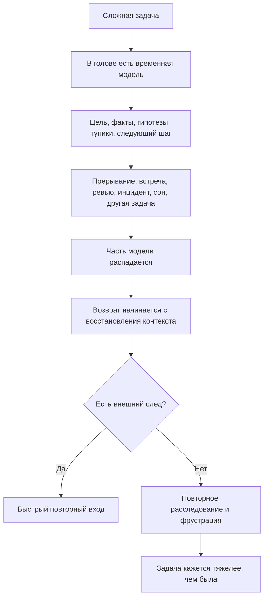

# Паспорт главы 1. Проблема: человек теряет не только время, но и состояние мысли

## Задача главы

Дать читателю узнаваемый вход в учебник: сложная интеллектуальная работа ломается не только из-за нехватки дисциплины, времени или желания. Часто человек теряет само состояние задачи: зачем он сюда пришел, что уже понял, какие гипотезы проверял, где остановился и какой шаг был следующим.

Глава должна показать, что потеря контекста — не личная слабость и не мелкая неприятность, а полноценная инженерная проблема. Если состояние задачи распадается при прерывании, возврате после выходных, встрече, ревью или смене трека, значит нужно проектировать внешний контур, который сохраняет не только список действий, но и ход мысли.

## Что читатель уже знает

Читатель знает бытовой опыт: трудную задачу сложно начать, после прерывания к ней трудно вернуться, а TODO-список часто не помогает восстановить понимание. Специальных знаний о нейронауке, мотивации, памяти или инженерном управлении на входе не требуется.

## Новые понятия

- состояние мысли;
- состояние задачи;
- цена входа;
- потеря контекста;
- туманная задача;
- внешний след;
- повторный вход в задачу;
- когнитивная работа восстановления.

## Главная мысль

Для простой задачи достаточно помнить действие. Для сложной задачи нужно сохранять состояние понимания. Когда человек возвращается к задаче без внешнего следа, он часто заново выполняет часть уже проделанной когнитивной работы: вспоминает цель, ограничения, источники, тупики, гипотезы и критерий следующего шага.

Когнитивное инженерство начинается с признания этой потери как проектируемой проблемы: не "надо быть собраннее", а "надо сделать так, чтобы состояние задачи переживало прерывание".

## Обязательные различения

| Похожее явление | Что это на самом деле | Почему важно различать |
| --- | --- | --- |
| Потеря времени | Часы ушли, но задача могла быть понятной. | Тайм-менеджмент отвечает только на часть проблемы. |
| Потеря мотивации | Действие не запускается или не удерживается. | Иногда мотивация есть, но вход слишком дорогой. |
| Потеря контекста | Человек не может быстро восстановить модель задачи. | Нужны внешние опоры, а не только волевое усилие. |
| Незнание следующего действия | Нет ясного ближайшего шага. | TODO может помочь, но не заменяет контекст. |
| Туманная задача | Непонятны факты, ограничения, гипотезы или критерий успеха. | Сначала нужно сделать неопределенность видимой. |

## Визуальная опора

В главе нужна схема "как распадается состояние задачи". Она должна появиться в начале главы, сразу после узнаваемого примера возвращения к прерванной работе.

Схему нужно разобрать в тексте: центральная потеря происходит не в календаре, а в рабочей модели задачи. Именно поэтому человек может "потратить час" и при этом объективно заниматься не прокрастинацией, а восстановлением состояния вычисления.

## Пример

Обезличенный инженерный пример: сервис иногда создает запись в одной системе, но не создает связанный объект во второй. Через день после перерыва разработчик помнит только "надо разобраться с интеграцией", но уже не помнит:

- какой сценарий был успешным;
- какой correlation_id проверялся;
- подозревался ли таймаут или идемпотентность;
- где лежали логи;
- какие варианты уже отброшены;
- какой первый безопасный шаг был выбран.

Глава должна показать, что это не просто забывчивость. Сложная задача требует удерживать временную модель, а память плохо хранит такую модель без внешней поддержки.

## Практический вывод

Если задача туманная, первым объектом проектирования становится не решение, а повторный вход в задачу. Нужно заранее оставлять будущему себе:

- текущую цель;
- что уже известно;
- что непонятно;
- какие гипотезы проверялись;
- что не сработало;
- где остановилась мысль;
- какой следующий физический шаг.

## Границы применимости

Глава не должна превращаться в обещание, что хороший журнал решает любую проблему продуктивности. Потеря контекста — только один класс сбоев. Бывают плохие приоритеты, перегруз, выгорание, конфликт целей, токсичная среда, клинические состояния, недостаток сна и реальные пробелы в навыке. Здесь вводится первый слой: работа с состоянием задачи.

## Опорные источники

- [[Прооекты/Когнитивное инженерство/2026-05-23 Идеи для внешней статьи - Когнитивное инженерство разработчика - как входить в туманные задачи и не терять контекст]]
- [[Прооекты/productivity-framework/2025-04-06 21-46 chatgpt-converstion Личностная система - политика, цель, стратегия, тактика]]
- [[Психология, нейрофизиология/кратковременная память]]
- [[Психология, нейрофизиология/Дефолт-система мозга]]

## Популярные ошибки, которые глава предотвращает

- Объяснять трудный вход в задачу только ленью.
- Считать TODO-список достаточным для задач с неопределенностью.
- Путать "я не работал" и "я восстанавливал контекст".
- Требовать от памяти того, что лучше хранить во внешнем контуре.
- Начинать учебник с нейромедиаторов или продуктивностных советов, пока не объяснена исходная боль.

## Связь с соседними главами

Глава 1 ставит проблему. Глава 2 вводит название и рабочее определение дисциплины, которая будет эту проблему разбирать. Главы 4-6 дадут первый практический ответ: контекст задачи, рабочий журнал, ритуалы входа и выхода.

## Статус

`ready-for-review`

Следующий шаг: при финальной редактуре использовать этот паспорт как контроль, что глава вводит исходную боль и не забирает материал глав 4-6, 7-11 и 12-15.
