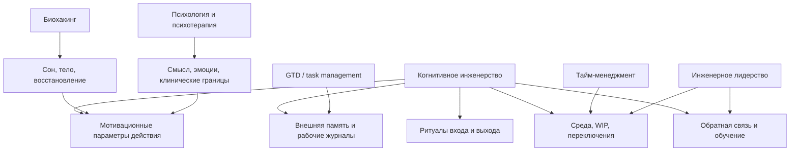

# Паспорт главы 2. Что такое когнитивное инженерство

## Задача главы

Дать рабочее определение когнитивного инженерства без академической тяжести и без ложной претензии на готовую научную дисциплину. Глава должна объяснить, почему здесь уместно слово "инженерство": речь идет о проектировании систем, интерфейсов, ограничений, ритуалов, обратной связи и среды, в которой мышление и действие становятся более устойчивыми.

Глава должна также сразу развести когнитивное инженерство с соседними практиками: productivity hacks, тайм-менеджментом, GTD, биохакингом, психотерапией, медициной, обучением и инженерным менеджментом. Эти области пересекаются, но учебник не должен раствориться ни в одной из них.

## Что читатель уже знает

После главы 1 читатель понимает проблему потери состояния задачи и цену повторного входа. Он уже видел, что TODO-список не хранит состояние мышления, а сложная работа требует внешнего следа.

## Новые понятия

- когнитивное инженерство;
- внешний контур мышления;
- проектирование условий действия;
- когнитивный интерфейс;
- обратная связь;
- граница модели;
- рабочая эвристика;
- соседние практики.

## Главная мысль

Когнитивное инженерство — это проектирование условий, в которых мышлению, вниманию, памяти, мотивации и действию легче работать точно, устойчиво и воспроизводимо.

Это не способ "стать продуктивнее любой ценой". Это инженерный взгляд на повторяющиеся сбои: если человек регулярно теряет контекст, избегает туманной задачи, перегружается от переключений или не получает обратной связи, нужно менять не только волевое усилие, но и конструкцию работы.

## Обязательные различения

| Подход | Что берет в фокус | Где полезен | Где его недостаточно |
| --- | --- | --- | --- |
| Тайм-менеджмент | Время, календарь, приоритеты. | Когда проблема в распределении времени. | Не хранит состояние мысли и не объясняет мотивационные контуры. |
| Productivity hacks | Приемы повышения эффективности. | Для локальных улучшений. | Часто не имеют модели и плохо работают при выгорании или тумане. |
| GTD и task management | Захват дел, next actions, списки. | Для разгрузки открытых обязательств. | Не всегда сохраняют ход исследования и состояние понимания. |
| Биохакинг | Сон, питание, стимуляторы, метрики тела. | Когда тело сильно влияет на доступность действия. | Риск свести сложное поведение к физиологии и оптимизации. |
| Психотерапия и медицина | Клинические состояния, страдание, здоровье. | Когда нужна профессиональная помощь. | Когнитивное инженерство не должно имитировать лечение. |
| Когнитивное инженерство | Условия мышления, действия, памяти, мотивации и обратной связи. | Для проектирования работы с задачами, собой, инструментами и командой. | Не заменяет клинику, организационные решения и реальный отдых. |

## Визуальная опора

В главе нужна карта отличий от соседних практик. Она должна показать не превосходство, а границы и пересечения.



После схемы нужно пояснить: когнитивное инженерство не отрицает соседние области. Оно собирает из них рабочую рамку для проектирования условий сложной интеллектуальной работы.

## Пример

Одна и та же проблема — "я не возвращаюсь к сложной задаче" — по-разному читается соседними подходами:

- тайм-менеджмент спросит, выделено ли время;
- task management спросит, есть ли next action;
- психология спросит, что человек переживает и чего избегает;
- биохакинг спросит, есть ли сон, нагрузка и восстановление;
- инженерное управление спросит, не слишком ли много WIP и прерываний;
- когнитивное инженерство спросит, какая конструкция работы делает повторный вход дорогим и как ее перестроить.

## Практический вывод

Когда система мышления регулярно ломается в одном месте, полезно описать ее как инженерную систему:

```text
сбой -> условия сбоя -> что перегружено -> какой внешний интерфейс нужен -> какая обратная связь покажет, что стало лучше
```

Такой способ мышления переводит разговор из самоупрека в проектирование.

## Границы применимости

Когнитивное инженерство в этом учебнике — практическая интегративная рамка. Она опирается на психологию, нейронауку, теорию обучения, инженерные практики и управление, но не является медицинским протоколом, клинической диагностикой или строгой нейробиологической теорией. Там, где речь идет о здоровье, диагнозах, лекарствах, стойком страдании или рисках безопасности, нужны специалисты и отдельные протоколы.

## Опорные источники

- [[Прооекты/Когнитивное инженерство/00-Когнитивное-инженерство-Навигатор]]
- [[Прооекты/Когнитивное инженерство/Учебник/00-Учебник-Когнитивное-инженерство]]
- [[Прооекты/Когнитивное инженерство/Учебник/03-Визуальная-система]]
- [[Прооекты/productivity-framework/2025-04-06 21-46 chatgpt-converstion Личностная система - политика, цель, стратегия, тактика]]

## Популярные ошибки, которые глава предотвращает

- Делать из когнитивного инженерства новое название тайм-менеджмента.
- Превращать учебник в сборник productivity hacks.
- Уходить в нейропоп и объяснять работу одним медиатором или "зоной мозга".
- Подменять медицинские и психотерапевтические вопросы самодельной инженерной рамкой.
- Обещать универсальную систему вместо честного набора моделей и границ.

## Связь с соседними главами

Глава 1 показывает исходную боль. Глава 2 называет рамку и задает ее границы. Глава 3 даст минимальную модель человека как работающей системы, чтобы дальше можно было говорить не лозунгами, а через внимание, память, тело, среду, мотивацию и обратную связь.

## Статус

`ready-for-review`

Следующий шаг: при финальной редактуре использовать паспорт как контроль границ: когнитивное инженерство не должно расползтись в тайм-менеджмент, нейропоп, терапию или набор productivity hacks.
