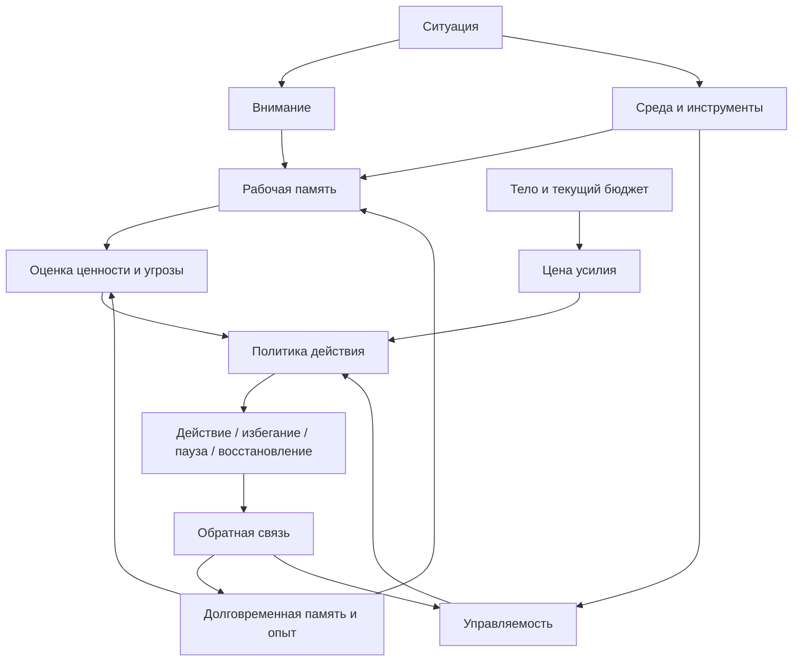

# Паспорт главы 3. Минимальная модель человека как работающей системы

## Задача главы

Ввести базовую модель, на которую будет опираться весь учебник. До разговора о мотивации, нейромедиаторах, выгорании, обучении и лидерстве читателю нужна простая карта: что именно в человеке и вокруг человека участвует в сложной работе.

Глава должна объяснить человека не как "мозг, который принимает решения", и не как "силу воли", а как работающую систему: внимание ограничено, рабочая память узкая, долговременная память хранит следы и смысловые блоки, тело меняет доступность действия, среда может помогать или мешать, действие выбирается через оценку ценности, угрозы, усилия и управляемости.

## Что читатель уже знает

Читатель понимает, что трудная задача может терять состояние, а когнитивное инженерство проектирует условия мышления и действия. Он еще не обязан знать терминов из нейронауки, теории памяти или психологии мотивации.

## Новые понятия

- внимание как ограниченный канал;
- рабочая память;
- долговременная память;
- чанк;
- тело как регулятор доступности действия;
- среда как внешний контур;
- оценка действия;
- обратная связь;
- предсказательная модель;
- телесный бюджет.

## Главная мысль

Человек не просто "думает" и "делает". В сложной задаче он:

- входит в состояние;
- удерживает контекст;
- выбирает, на что направить внимание;
- сверяется с памятью и прошлым опытом;
- оценивает цену усилия и угрозу ошибки;
- чувствует телесную доступность действия;
- опирается на среду и внешние артефакты;
- действует;
- получает обратную связь;
- обновляет будущий прогноз.

Если один элемент этой системы перегружен, поведение меняется. Поэтому учебник будет проектировать не только список задач, но и контур "человек — среда — действие — обратная связь".

## Обязательные различения

| Понятие | Что оно означает в учебнике | Что не нужно с ним путать |
| --- | --- | --- |
| Внимание | Ограниченный канал выбора и удержания значимого. | Бесконечный прожектор, который можно просто "направить". |
| Рабочая память | Узкое окно текущего удержания и преобразования информации. | Надежное хранилище сложных задач. |
| Долговременная память | Сеть следов, смыслов, навыков и прежнего опыта. | Архив, из которого все достается без искажений. |
| Тело | Активная часть регуляции энергии, угрозы и допустимости действия. | Фон, который можно игнорировать до болезни. |
| Среда | Внешняя часть системы мышления: заметки, инструменты, порядок работы, люди. | Декорация вокруг "настоящего мышления". |
| Действие | Итог оценки ценности, угрозы, усилия, управляемости и контекста. | Прямое следствие желания. |

## Визуальная опора

В главе нужна центральная схема "человек как рабочая система". Она должна стать первым простым вариантом сквозной модели действия из визуальной системы учебника.



Схему нужно читать не как нейробиологическую карту, а как рабочую модель для дальнейшего учебника. Она показывает, где можно вмешиваться инженерно: уменьшать нагрузку на память, улучшать среду, снижать цену входа, возвращать управляемость, делать обратную связь видимой.

## Пример

Возврат к сложной задаче после выходных:

- внимание сначала цепляется за неприятное ощущение "я опять ничего не понимаю";
- рабочая память не удерживает старую модель задачи;
- долговременная память дает отдельные следы, но не всю структуру;
- тело может добавлять усталость или тревогу;
- среда либо помогает заметкой, логом и следующим шагом, либо оставляет человека перед пустым экраном;
- действие либо запускается, либо заменяется избеганием, суетой и повторным расследованием.

## Практический вывод

Любую трудность входа в задачу можно предварительно разложить по системе:

```text
что перегружено: внимание, рабочая память, тело, среда, мотивационная оценка, обратная связь?
```

Такой вопрос не решает задачу автоматически, но мешает объяснять все одной причиной. Иногда нужно не "собраться", а вынести контекст из головы. Иногда нужно не "прокачать мотивацию", а снизить угрозу первой попытки. Иногда нужно не "лучше планировать", а восстановиться.

## Границы применимости

Эта модель намеренно минимальная. Она не объясняет подробно нейронные структуры, медиаторы, гормоны, клинические состояния и социальные системы. Эти слои будут добавляться позже. В этой главе важно не перегрузить читателя терминами, но и не оставить ложного впечатления, что человек — это простой автомат "стимул -> действие".

## Опорные источники

- [[Прооекты/Когнитивное инженерство/Учебник/02-Карта-понятий-и-пробелов]]
- [[Прооекты/Когнитивное инженерство/Учебник/03-Визуальная-система]]
- [[Психология, нейрофизиология/кратковременная память]]
- [[Психология, нейрофизиология/Дефолт-система мозга]]
- [[Темы/GeekBrains Умение учиться/01 Мозг — это супермашина/режимы работы мозга]]
- [[Темы/GeekBrains Умение учиться/01 Мозг — это супермашина/Мозг работает как предиктивная машина]]

## Популярные ошибки, которые глава предотвращает

- Сводить поведение к "мотивация есть / мотивации нет".
- Считать память надежным хранилищем сложного состояния задачи.
- Говорить о мозге и теле как о двух независимых сущностях.
- Игнорировать среду, инструменты и внешние следы.
- Давать практические советы до введения модели, к чему именно эти советы применяются.

## Связь с соседними главами

Глава 3 завершает первый фундаментальный блок. После нее можно перейти к внешнему контуру мышления: если рабочая память узкая, среда и заметки становятся не украшением, а частью системы. Глава 4 начнет с вопроса, какой именно контекст задачи нужно вынести из головы.

## Статус

`ready-for-review`

Черновик главы: [[../Главы/03-Минимальная-модель-человека-как-работающей-системы]].

Связка с первым практическим блоком проверена: [[../Проверки/2026-05-24 Связка глав 3-6]].

Следующий шаг: при финальной редактуре следить, чтобы глава 3 оставалась минимальной моделью, а не преждевременной главой по мотивации или нейрофизиологии.
