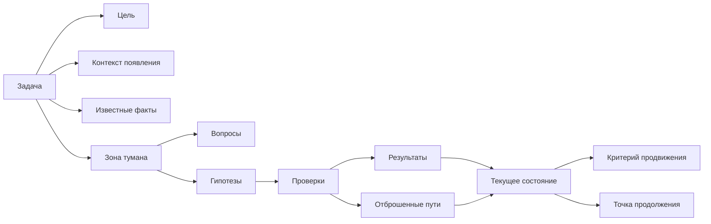

# Паспорт главы 4. Контекст задачи: что нужно вынести из головы

## Задача главы

Показать, что сложная задача требует сохранять не только действие, но и контекст: цель, факты, ограничения, неизвестные места, гипотезы, проверенные тупики, критерий продвижения и точку продолжения. Глава должна стать первым практическим шагом после модели человека как системы.

Главная функция главы — научить читателя видеть состояние задачи как отдельный объект. Пока контекст не назван, человек пытается удерживать его в голове. Когда контекст вынесен наружу, с ним можно работать: уточнять, проверять, сокращать туман, возвращаться после прерывания.

## Что читатель уже знает

Читатель уже понимает, что потеря контекста — самостоятельная проблема, когнитивное инженерство проектирует условия мышления, а человек как система ограничен вниманием и рабочей памятью.

## Новые понятия

- контекст задачи;
- состояние задачи;
- известные факты;
- неизвестные места;
- проверенная гипотеза;
- отброшенный путь;
- критерий продвижения;
- точка продолжения;
- зона тумана.

## Главная мысль

Для туманной задачи "что сделать" — это только верхний слой. Чтобы задача стала управляемой, нужно вынести из головы состояние понимания:

- зачем задача существует;
- что уже известно;
- что пока непонятно;
- какие гипотезы конкурируют;
- какие проверки уже были;
- какие ограничения нельзя нарушать;
- что будет считаться продвижением;
- с какого действия можно продолжить.

Чем выше неопределенность, тем меньше помогает голый список действий и тем важнее карта контекста.

## Обязательные различения

| Элемент | Вопрос | Чем полезен |
| --- | --- | --- |
| Цель | Что должно измениться после выполнения? | Защищает от суеты и случайных действий. |
| Контекст появления | Почему задача возникла? | Помогает понять смысл и ограничения. |
| Известные факты | Что уже подтверждено? | Уменьшает повторные проверки. |
| Неизвестные места | Где туман? | Делает неопределенность видимой. |
| Гипотезы | Что может объяснять ситуацию? | Дает направления проверки. |
| Проверенные тупики | Что уже не сработало? | Защищает от хождения по кругу. |
| Ограничения | Что нельзя сломать или нарушить? | Удерживает безопасность решения. |
| Критерий продвижения | Как понять, что стало яснее? | Позволяет видеть прогресс до финального результата. |
| Точка продолжения | Что сделать первым после возврата? | Снижает цену повторного входа. |

## Визуальная опора

В главе нужна схема "состояние задачи как внешний объект".



Схему нужно сопровождать примером заполнения. Без примера она останется похожей на красивую форму, а глава должна научить читателя реально отличать факты от гипотез и туман от следующего действия.

## Пример

Обезличенная задача про промежуточное состояние объекта:

```markdown
## Цель
Понять, почему объект иногда остается в промежуточном состоянии, и выбрать безопасный способ исправления.

## Что известно
- событие приходит из системы A;
- запись в базе создается;
- объект в системе B создается не всегда;
- проблема воспроизводится не на каждом запуске.

## Что непонятно
- теряется ли событие;
- падает ли внешний вызов;
- есть ли повторная обработка;
- можно ли безопасно повторить операцию.

## Гипотезы
1. Ошибка внешнего API.
2. Неверная обработка таймаута.
3. Неатомарное обновление состояния.
4. Нет компенсации при частичном успехе.

## Точка продолжения
Сравнить логи по одному успешному и одному неуспешному correlation_id.
```

## Практический вывод

Когда задача кажется бесформенной, первым действием становится не "решить", а "собрать контекст". Минимальный набор:

```text
цель -> что известно -> что непонятно -> гипотезы -> проверенный тупик -> следующий проверяемый шаг
```

Этого достаточно, чтобы снизить туман и подготовить рабочий журнал из следующей главы.

## Границы применимости

Не каждая задача требует полного контекстного паспорта. Для простых действий достаточно короткой записи. Полная карта нужна там, где есть неопределенность, высокая цена ошибки, много источников, прерывания, несколько гипотез или необходимость объяснить ход работы другому человеку.

Важно не превратить контекст в бюрократию. Если заметка стала тяжелее самой задачи, контур нужно упростить.

## Опорные источники

- [[Прооекты/Когнитивное инженерство/2026-05-23 Идеи для внешней статьи - Когнитивное инженерство разработчика - как входить в туманные задачи и не терять контекст]]
- [[Прооекты/productivity-framework/2025-04-06 21-46 chatgpt-converstion Личностная система - политика, цель, стратегия, тактика]]
- [[Прооекты/Когнитивное инженерство/Учебник/03-Визуальная-система]]

## Популярные ошибки, которые глава предотвращает

- Записывать только действие и терять причины, ограничения и гипотезы.
- Смешивать факт, предположение и желание.
- Считать "непонятно" личным провалом, а не материалом для структурирования.
- Не фиксировать отброшенные варианты и затем ходить по кругу.
- Оставлять будущему себе задачу без точки продолжения.

## Связь с соседними главами

Глава 4 показывает, какой контекст нужно вынести из головы. Глава 5 соберет этот контекст в рабочий журнал как повторяемый внешний контур. Глава 6 превратит журнал в ритуалы входа и выхода.

## Статус

`ready-for-review`

Черновик главы: [[../Главы/04-Контекст-задачи]].

Следующий шаг: при финальной редактуре проверить, что глава остается мостом от минимальной модели к рабочему журналу и не превращается в бюрократическую форму.
