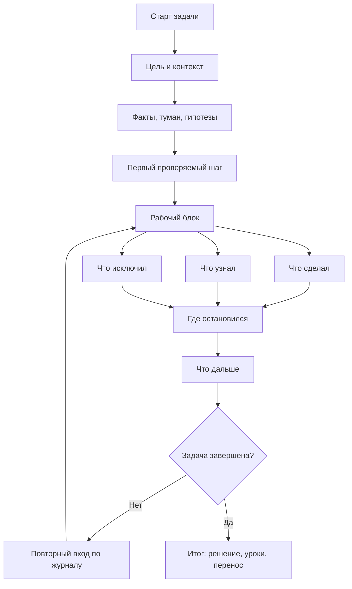

# Паспорт главы 5. Рабочий журнал как внешний контур мышления

## Задача главы

Описать рабочий журнал не как дневник, архив или красивую систему заметок, а как внешний контур мышления. Журнал должен хранить состояние вычисления: текущую модель задачи, факты, гипотезы, проверки, результаты, решения, место остановки и следующий шаг.

Глава должна показать, как рабочий журнал снижает цену повторного входа, уменьшает хождение по кругу и делает прогресс видимым до финального результата.

## Что читатель уже знает

Читатель уже понимает проблему потери контекста, рабочую модель человека как системы и состав контекста задачи. Он знает, что в сложной задаче нужно выносить из головы не только TODO, но и состояние понимания.

## Новые понятия

- рабочий журнал;
- внешний контур мышления;
- снимок состояния задачи;
- лог работы;
- жизненный цикл записи;
- будущий читатель;
- точка продолжения;
- рабочий интерфейс к задаче.

## Главная мысль

Рабочий журнал нужен не для того, чтобы "вести заметки", а для того, чтобы задача переживала прерывания. Его главный читатель — сам человек через два часа, завтра утром или через неделю. Поэтому хорошая запись должна отвечать не на вопрос "красиво ли описана задача", а на вопрос "могу ли я по этой записи быстро продолжить работу".

## Обязательные различения

| Форма записи | Для чего подходит | Почему это не то же самое, что рабочий журнал |
| --- | --- | --- |
| Дневник | Личная рефлексия, переживания, смысл. | Может не хранить проверяемое состояние задачи. |
| TODO-список | Перечень действий. | Не хранит цель, факты, гипотезы и результаты проверок. |
| Конспект | Сохранение внешней информации. | Не всегда показывает, как эта информация меняет текущую задачу. |
| Отчет | Коммуникация результата другим. | Часто пишется после факта и сглаживает путь рассуждения. |
| Рабочий журнал | Продолжение задачи без потери состояния. | Хранит ход мысли, проверок и точку продолжения. |

## Визуальная опора

В главе нужна схема жизненного цикла рабочего журнала: старт задачи, рабочий блок, выход, возврат, завершение.



Схему нужно дополнить минимальным шаблоном и примером заполнения. Важно показать, что журнал не обязан быть длинным: он должен быть достаточным для продолжения.

## Пример

Минимальная запись рабочего блока:

```markdown
## Рабочий блок

### Перед началом
- Что пытаюсь сделать:
- Что сейчас непонятно:
- Первый проверяемый шаг:

### После блока
- Сделал:
- Узнал:
- Исключил:
- Остановился на:
- Дальше:
```

Для инженерной задачи:

```markdown
### После блока
- Сделал: сравнил логи по двум correlation_id.
- Узнал: в неуспешном сценарии внешний вызов получает timeout, но состояние уже переведено в промежуточное.
- Исключил: событие не теряется до обработчика.
- Остановился на: нужно проверить, есть ли компенсация после timeout.
- Дальше: найти код перехода состояния и место обработки ошибки внешнего вызова.
```

## Практический вывод

Рабочий журнал должен быть достаточно мал, чтобы его реально вести, и достаточно полон, чтобы он сохранял состояние задачи. Минимальная формула после блока:

```text
сделал -> узнал -> исключил -> где остановился -> что дальше
```

Если сил мало, достаточно оставить точку продолжения. Это лучше, чем бросить задачу в состоянии "потом вспомню".

## Границы применимости

Рабочий журнал не должен превращаться в архив ради архива. Если запись не помогает продолжить работу, она потеряла функцию. Если запись требует слишком много времени, ее нужно сжать. Если проблема не в контексте, а в перегрузе, болезни, токсичной среде или неверных приоритетах, журнал может помочь увидеть это, но не заменит другое решение.

## Опорные источники

- [[Прооекты/Когнитивное инженерство/2026-05-23 Идеи для внешней статьи - Когнитивное инженерство разработчика - как входить в туманные задачи и не терять контекст]]
- [[Прооекты/productivity-framework/2025-04-06 21-46 chatgpt-converstion Личностная система - политика, цель, стратегия, тактика]]
- [[Психология, нейрофизиология/кратковременная память]]
- [[Психология, нейрофизиология/эффект дезинформации]]

## Популярные ошибки, которые глава предотвращает

- Вести журнал как красивый архив, а не как рабочий интерфейс.
- Писать слишком много и бросать систему.
- Писать слишком мало и не сохранять состояние.
- Не отличать "что сделал" от "что узнал".
- Не фиксировать "что исключил" и затем повторять проверки.
- Не оставлять следующий физический шаг.

## Связь с соседними главами

Глава 5 собирает контекст из главы 4 в устойчивую форму. Глава 6 покажет, как встроить журнал в ритуалы входа и выхода, чтобы он не оставался хорошей идеей, которую человек вспоминает только в спокойные дни.

## Статус

`ready-for-review`

Черновик главы написан: [[../Главы/05-Рабочий-журнал-как-внешний-контур-мышления]].

Следующий шаг: при финальной редактуре оставить базовой короткую формулу журнала, а расширенные формы использовать только там, где сложность задачи это оправдывает.
