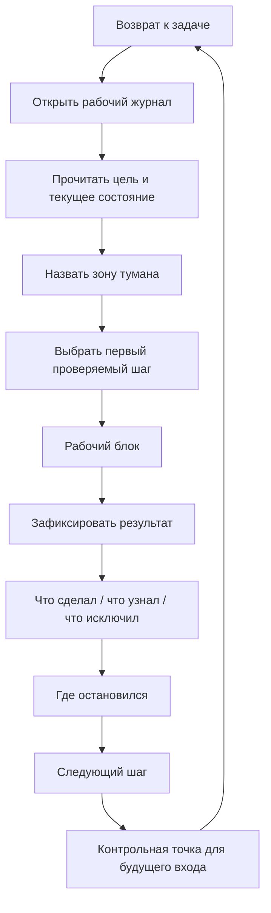

# Паспорт главы 6. Ритуалы входа и выхода

## Задача главы

Перевести рабочий журнал из "полезной идеи" в повторяемую практику. Глава должна объяснить, как входить в туманную задачу, как выходить из нее без потери состояния и почему ритуал — это не бюрократия, а способ защитить будущий повторный вход.

Глава завершает первый практический блок учебника: после нее читатель должен уметь начать сложную задачу, сделать неопределенность видимой, выполнить первый проверяемый шаг и оставить точку продолжения.

## Что читатель уже знает

Читатель понимает, что сложная задача теряет состояние, знает состав контекста задачи и видел рабочий журнал как внешний контур мышления.

## Новые понятия

- ритуал входа;
- ритуал выхода;
- контрольная точка;
- первый проверяемый шаг;
- защита будущего внимания;
- минимальная версия практики;
- рабочий блок;
- антибюрократический критерий.

## Главная мысль

Ритуал нужен не для торжественности и не для контроля ради контроля. Он нужен, чтобы каждый раз не изобретать вход в сложную работу заново. Хороший ритуал снижает трение:

- перед началом: возвращает цель, контекст и первый шаг;
- во время работы: удерживает фокус на проверяемом действии;
- перед выходом: сохраняет состояние задачи для будущего себя.

Если ритуал не снижает цену входа, его нужно упростить.

## Обязательные различения

| Понятие | Что это | Как проверить |
| --- | --- | --- |
| Ритуал | Повторяемая короткая последовательность действий, которая запускает нужный режим работы. | После него легче начать или продолжить. |
| Бюрократия | Заполнение формы ради формы. | Она не помогает действию и увеличивает сопротивление. |
| Первый проверяемый шаг | Действие, которое уменьшает неопределенность. | После него становится что-то яснее. |
| Контрольная точка | Снимок текущего состояния перед выходом. | По нему можно продолжить без долгого разгона. |
| Защита будущего внимания | Забота о повторном входе заранее. | Будущему себе не нужно заново собирать всю модель. |

## Визуальная опора

В главе нужна диаграмма входа и выхода из задачи.



Схему нужно показать как цикл, а не как линейный чек-лист. Каждый выход готовит следующий вход.

## Пример

Минимальный ритуал входа в туманную задачу:

```text
1. Открыть заметку задачи.
2. Прочитать цель и последнее состояние.
3. Одной фразой назвать текущий туман.
4. Выбрать один проверяемый шаг на 20-40 минут.
5. Не требовать от шага полного решения.
```

Минимальный ритуал выхода:

```text
1. Что сделал?
2. Что узнал?
3. Что исключил или подтвердил?
4. Где остановился?
5. Что сделать первым при следующем входе?
```

Важно показать, что выход может занимать 60-90 секунд. Его ценность не в длине, а в сохранении точки продолжения.

## Практический вывод

Для старта достаточно одной привычки: в конце каждого рабочего блока оставить будущему себе точку продолжения. Если есть еще немного ресурса, добавить "что узнал" и "что исключил". Полная система может вырасти позже, но минимальный ритуал должен быть рабочим уже сегодня.

## Границы применимости

Ритуалы не должны маскировать перегруз, недосып, плохие приоритеты или отсутствие полномочий. Если человек физически истощен, ритуал входа не обязан "продавить" действие. Если задача бессмысленна или заблокирована, ритуал должен помочь это увидеть, а не заставить имитировать работу.

Также важно не усложнять ритуал ради эстетики системы. Ритуал хорош, пока снижает трение входа и выхода.

## Опорные источники

- [[Прооекты/Когнитивное инженерство/2026-05-23 Идеи для внешней статьи - Когнитивное инженерство разработчика - как входить в туманные задачи и не терять контекст]]
- [[Прооекты/productivity-framework/2025-04-06 21-46 chatgpt-converstion Личностная система - политика, цель, стратегия, тактика]]
- [[Прооекты/productivity-framework/2022-05-03-0936 Утренние ритуалы для входа в ресурсное состояние]]
- [[Прооекты/productivity-framework/2022-03-16-1810 Что работало для увеличения продуктивности]]
- [[Психология, нейрофизиология/Выгорание/мыслетопливо]]

## Популярные ошибки, которые глава предотвращает

- Пытаться войти в туманную задачу сразу через код или финальное решение.
- Считать ритуал чем-то мистическим или декоративным.
- Делать ритуал слишком длинным и бросать его.
- Выходить из работы без контрольной точки и затем заново восстанавливать контекст.
- Подменять первый проверяемый шаг требованием "решить всю задачу".
- Использовать ритуал как способ игнорировать усталость и перегруз.

## Связь с соседними главами

Глава 6 завершает блок внешнего контура мышления. После нее читатель получает первый практический инструмент учебника. Глава 7 начнет мотивационный блок и покажет, почему даже при хорошем журнале действие может не запускаться: ценность, угроза, доступность шага и управляемость образуют отдельную систему.

## Статус

`ready-for-review`

Черновик главы написан: [[../Главы/06-Ритуалы-входа-и-выхода]].

Следующий шаг: при финальной редактуре удержать ритуалы как короткие процедуры входа и выхода, а не как скрытую продуктивностную мораль.
