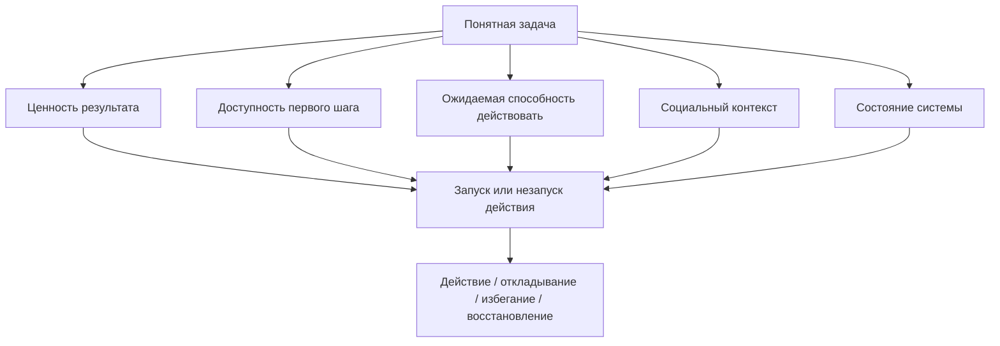

# Паспорт главы 7. Мотивация — это не желание

## Задача главы

Открыть мотивационный блок и показать, почему действие может не запускаться даже тогда, когда задача понятна, записана и формально важна.

Глава должна заменить бытовую модель "мотивирован значит хочется" рабочей моделью: мотивация складывается из ценности, потребностей, ожидаемой способности действовать, доступности шага, социального контекста и состояния системы.

## Что читатель уже знает

Читатель понимает проблему потери контекста, знает минимальную модель человека как работающей системы, умеет смотреть на задачу через контекст, рабочий журнал и ритуалы входа/выхода.

Теперь нужно объяснить ограничение первого практического блока: внешний контур помогает продолжать мысль, но не гарантирует запуск действия.

## Новые понятия

- мотивационное состояние;
- ценность результата;
- качество регуляции;
- доступность действия;
- потребность;
- ожидаемая способность действовать;
- социальный контекст мотивации;
- устойчивость мотивации.

## Главная мысль

Мотивация — не отдельное чувство и не внутренний тумблер. Это состояние системы, в котором результат кажется достаточно ценным, шаг достаточно доступным, угроза достаточно переносимой, а человек достаточно способен повлиять на исход.

Если один из параметров ломается, действие может не запускаться даже при высокой важности цели.

Рабочая формула главы:

```text
мотивация = ценность + потребности + ожидаемая способность действовать + доступность шага + социальный контекст + состояние системы
```

## Обязательные различения

| Понятие | Что это | Почему важно |
| --- | --- | --- |
| Желание | Переживание привлекательности или тяги к результату. | Может быть, но не запускать действие. |
| Ценность | Значимость результата для человека, роли, отношений, мастерства или безопасности. | Высокая ценность не отменяет высокую цену входа. |
| Мотивационное состояние | Конфигурация ценности, угрозы, доступности, управляемости и состояния тела. | Позволяет диагностировать "не делаю" без морализма. |
| Внутренняя/внешняя мотивация | Разные источники и качества регуляции. | Нельзя писать "внутренняя всегда хороша, внешняя всегда плоха". |
| Компетентность в SDT | Потребность чувствовать эффективность во взаимодействии со средой. | Близко к self-efficacy, но не тождественно ей. |
| Самоэффективность | Ожидание, что я способен выполнить действие и повлиять на исход. | Нужна для перехода к главе 10. |

## Визуальная опора

В главе нужна схема мотивационного запуска действия.



Схема должна показать, что ясная задача — только один вход в действие. Мотивация не равна ясности.

## Пример

Разработчик понимает задачу, видит следующий шаг и даже оставил хорошую контрольную точку. Но утром он не открывает задачу.

Разбор по модели:

- ценность есть: задачу надо закончить;
- доступность шага средняя: понятно, что открыть;
- угроза высокая: есть риск вскрыть архитектурную ошибку;
- управляемость низкая: кажется, что без другого человека решение невозможно;
- социальный контекст напряженный: ошибка может выглядеть как личный провал;
- состояние системы плохое: недосып и усталость повышают цену входа.

Такое "не делаю" нельзя честно объяснить словом "не хочется".

## Практический вывод

Когда действие не запускается, первый вопрос не "как себя заставить", а "какой параметр мотивационной системы сейчас делает действие недоступным".

Минимальная диагностика:

```text
Что здесь ценно?
Что здесь угрожает?
Какой первый шаг реально доступен?
Верю ли я, что могу повлиять на исход?
Что с состоянием тела и среды?
```

## Границы применимости

Глава не должна уходить в биохимию, клиническую апатию, депрессию или медицинские объяснения. Это первый учебный слой: психологическая и деятельностная модель запуска действия.

Нейробиология усилия, дофамин, fatigue и allostasis появятся позже, когда читатель уже умеет различать ценность, доступность действия и управляемость.

## Опорные источники

- [[../Источники/2026-05-24 Пакет источников для мотивационного блока 7-11]]
- [[../../2026-04-25 Мотивация как система I - достижение, принадлежность, влияние и избегание]]
- [[../../2026-05-01 Мотивация как система II - нейрофизиология побуждения, усилия, избегания и истощения]]
- [[Психология, нейрофизиология/Мотивация/00 Мотивация]]
- [[Психология, нейрофизиология/Мотивация/контекст постановки задачи и мотивация]]

## Популярные ошибки, которые глава предотвращает

- Считать мотивацию синонимом желания.
- Объяснять незапуск действия ленью.
- Думать, что достаточно сделать задачу понятной.
- Писать "внутренняя мотивация лучше внешней" без условий.
- Смешивать ценность результата с доступностью действия.
- Начинать разговор о мотивации с дофамина.

## Связь с соседними главами

Глава 7 принимает эстафету от главы 6: даже хороший ритуал входа не отменяет мотивационных параметров. Глава 8 разложит ценность по областям: достижение, принадлежность, влияние и безопасность.

## Статус

`ready-for-review`

Карта объяснения создана: [[../Карты объяснения/07-Мотивация-это-не-желание]].

Черновик главы написан: [[../Главы/07-Мотивация-это-не-желание]].

Следующий шаг: при финальной редактуре проверить, что глава 7 остается входом в мотивационный блок и не забирает материал глав 8-11.
