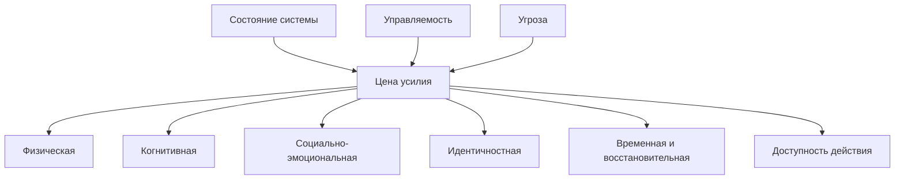

# Паспорт главы 11. Цена усилия, усталость и ощущаемая энергия

## Задача главы

Закрыть первый мотивационный блок через цену действия. Показать, почему "нет энергии" нельзя понимать как один бак топлива и почему доступность действия зависит не только от ценности и управляемости.

## Что читатель уже знает

Читатель знает, что мотивация не равна желанию, видит области ценности, режимы приближения/избегания и роль управляемости.

## Новые понятия

- цена усилия;
- когнитивная цена;
- физическая цена;
- социально-эмоциональная цена;
- идентичностная цена;
- восстанавливаемая усталость;
- медленно восстанавливаемая усталость;
- аллостатический бюджет;
- интероцептивная оценка;
- ощущаемая энергия.

## Главная мысль

Система выбирает не только "стоит ли результат того". Она оценивает, сколько будет стоить действие сейчас: вниманием, телом, эмоциями, отношениями, риском для самообраза и восстановлением.

Ощущение "нет энергии" часто является грубым итоговым сигналом. Его нужно раскладывать на виды цены и состояния, а не спорить с ним лозунгом "просто соберись".

## Обязательные различения

| Понятие | Что это | Почему важно |
| --- | --- | --- |
| Цена усилия | Субъективная стоимость действия в текущем состоянии. | Может быть высокой даже для ценной задачи. |
| Усталость | Снижение готовности продолжать усилие. | Не всегда означает полную невозможность действия. |
| Восстанавливаемая усталость | То, что может заметно снизиться коротким отдыхом или сменой режима. | Не требует драматических решений. |
| Медленно восстанавливаемая усталость | Накопленная цена, которая не уходит за один перерыв. | Ведет к разговору о восстановлении и выгорании. |
| Аллостатический бюджет | Рабочее обозначение регуляторной цены состояния. | Не буквальный бак энергии. |
| Отдых | Восстановление доступности действия. | Не то же самое, что избегание. |

## Визуальная опора

В главе нужна карта видов цены усилия.



## Пример

Две задачи занимают по часу.

Первая требует аккуратно дописать понятный текст. Цена усилия в основном когнитивная.

Вторая требует написать неприятное сообщение, признать ошибку, выдержать возможный конфликт и затем вернуться к коду. Формально время то же, но социально-эмоциональная и идентичностная цена намного выше.

Если считать только время, разницы не видно. Если считать цену усилия, становится понятно, почему вторая задача откладывается.

## Практический вывод

Перед тем как требовать от себя "больше дисциплины", нужно уточнить вид цены:

```text
Что именно здесь дорого?
Внимание?
Телесное состояние?
Социальный риск?
Стыд и самообраз?
Долгое восстановление после действия?
Можно ли снизить цену шага, не обесценивая задачу?
```

## Границы применимости

Глава не должна становиться медицинским руководством. Она не диагностирует депрессию, хроническую усталость, эндокринные нарушения или burnout. Она дает язык для различения цены усилия и переход к будущим главам о стрессе, восстановлении и выгорании.

Для черновика нужен отдельный пакет источников по effort-based decision making, fatigue, allostasis, interoception и recovery.

## Опорные источники

- [[../Источники/2026-05-24 Пакет источников для мотивационного блока 7-11]]
- [[../../2026-05-01 Мотивация как система II - нейрофизиология побуждения, усилия, избегания и истощения]]
- [[../../2026-05-14  Мотивация как система III - Управляемость действия - как мозг выбирает между усилием, избеганием, привычкой и восстановлением]]
- [[Прооекты/productivity-framework/2022-04-29-1409 Обрести силу]]
- [[Прооекты/productivity-framework/2022-04-06-0948 Обрести перманентное ресурсное состояние]]

## Популярные ошибки, которые глава предотвращает

- Говорить об энергии как об одном баке.
- Считать усталость моральной слабостью.
- Игнорировать социальную и идентичностную цену действия.
- Называть отдых избеганием.
- Называть избегание восстановлением.
- Делать из аллостатического бюджета буквальную физиологическую емкость.

## Связь с соседними главами

Глава 11 завершает мотивационный блок: после нее модель "ценность - угроза - управляемость - цена усилия" становится рабочей. Глава 12 начнет следующий уровень и научит разводить уровни объяснения, прежде чем переходить к мозгу, телу и биохимии.

## Статус

`ready-for-review`

Карта объяснения создана: [[../Карты объяснения/11-Цена-усилия-усталость-и-ощущаемая-энергия]].

Черновик главы написан: [[../Главы/11-Цена-усилия-усталость-и-ощущаемая-энергия]].

Источниковый пакет создан: [[../Источники/2026-05-24 Пакет источников для главы 11]].

Следующий шаг: при финальной редактуре удержать "ощущаемую энергию" как модельную переменную, а не биомаркер или бытовой "бак ресурса".
