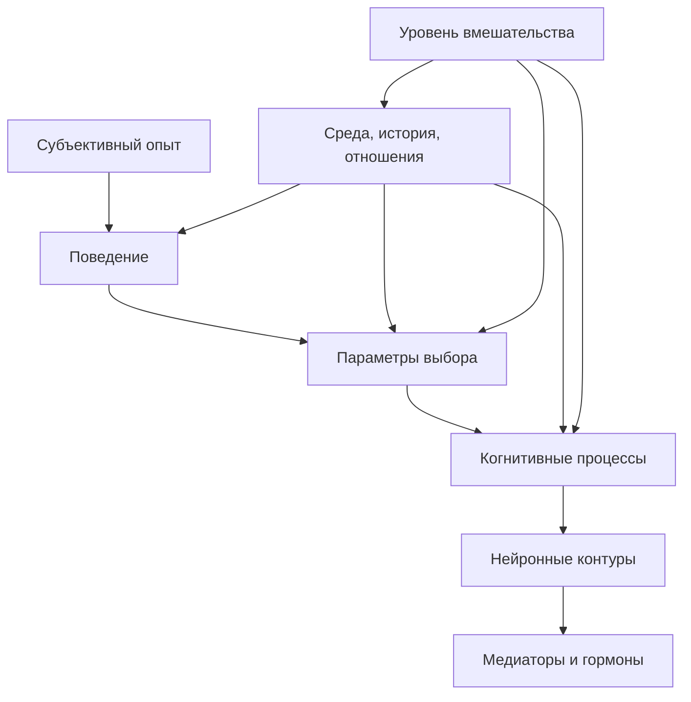

# Паспорт главы 12. Уровни объяснения

## Задача главы

Открыть часть IV и научить читателя разводить уровни объяснения: субъективный опыт, поведение, параметры выбора, когнитивные процессы, нейронные контуры, медиаторы/гормоны, тело, среду и практическое вмешательство.

Главная функция главы — защитить дальнейшую нейро- и биохимическую часть учебника от нейромифов и редукционизма.

## Что читатель уже знает

Читатель прошел мотивационный блок 7-11 и умеет разбирать действие через:

- ценность;
- угрозу;
- приближение и избегание;
- управляемость;
- цену усилия;
- усталость и ощущаемую энергию.

## Новые понятия

- уровень объяснения;
- субъективный уровень;
- поведенческий уровень;
- уровень параметров выбора;
- когнитивно-алгоритмический уровень;
- уровень нейронных контуров;
- нейрохимический уровень;
- уровень среды и истории;
- reverse inference;
- редукционизм;
- объяснительный плюрализм;
- уровень вмешательства.

## Главная мысль

Один и тот же человеческий эпизод можно честно описывать на разных уровнях. Ошибка начинается там, где один уровень объявляют единственным настоящим объяснением.

```text
"Нет энергии" не равно "низкий дофамин".
"Страшно" не равно "активировалась миндалина".
"Не могу начать" не равно "слабая префронтальная кора".
```

Эти формулы могут указывать на возможные механизмы, но не заменяют анализа поведения, задачи, среды, цены усилия, угрозы, управляемости, истории опыта и состояния тела.

## Обязательные различения

| Понятие | Что это | Почему важно |
| --- | --- | --- |
| Уровень описания | На каком языке мы описываем явление. | Помогает не смешивать переживание, поведение и механизм. |
| Уровень причины | Что реально влияет на возникновение или поддержание явления. | Причины могут лежать на нескольких уровнях сразу. |
| Уровень реализации | Через какие физические системы явление реализуется. | Реализация не всегда равна лучшему уровню вмешательства. |
| Уровень вмешательства | Где можно практически изменить ситуацию. | Иногда вмешиваться нужно в среду, а не в "биохимию". |
| Коррелят | Что меняется вместе с явлением. | Коррелят не всегда причина. |
| Механизм | Связанная цепочка, объясняющая, как возникает эффект. | Нужен для серьезного объяснения. |

## Визуальная опора

Главная схема главы — лестница уровней объяснения.



## Пример

Фраза:

```text
у меня нет энергии
```

На разных уровнях может означать:

- субъективно: ощущение недоступности действия;
- поведенчески: человек не входит в задачу;
- параметрически: цена усилия выше ценности и управляемости;
- когнитивно: потерян контекст, не виден первый шаг;
- контурно: системы контроля, угрозы и интероцепции могут быть в неблагоприятной конфигурации;
- нейрохимически: дофамин, норадреналин, кортизол и другие системы могут менять режим, но не являются единственным объяснением;
- средово: день устроен так, что задача постоянно прерывается и не восстанавливается.

## Практический вывод

Перед тем как объяснять состояние "мозгом" или "гормонами", нужно спросить:

```text
Какой вопрос я сейчас решаю?
Мне нужно понять переживание?
Предсказать поведение?
Найти механизм?
Выбрать вмешательство?
Оценить границы?
```

Разные вопросы требуют разных уровней ответа.

## Границы применимости

Глава не должна стать философским трактатом. Она нужна как рабочий инструмент чтения следующих глав.

Она не отменяет нейронауку, биохимию и физиологию. Она запрещает только слишком быстрые объяснения, где сложное состояние сводится к одному центру, одному медиатору или одной модной схеме.

## Опорные источники

- [[../Источники/2026-05-24 Пакет источников для главы 12]]
- [[../Проверки/2026-05-24 Мотивационный блок 7-11]]
- [[../Источники/2026-05-24 Пакет источников для главы 3]]
- [[../Источники/2026-05-24 Пакет источников для главы 11]]

## Популярные ошибки, которые глава предотвращает

- "Дофамин = мотивация".
- "Кортизол = стресс".
- "Миндалина = страх".
- "Префронтальная кора = сила воли".
- "Если есть нейронный коррелят, психологический и социальный уровни уже не нужны".
- "Если состояние субъективное, оно ненастоящее".
- "Лучшее вмешательство всегда должно быть биохимическим".
- "Если причина в среде, мозг ни при чем".

## Связь с соседними главами

Глава 12 принимает от главы 11 тему "нет энергии" и показывает, как не свести ее к одному биомаркеру. После этого глава 13 сможет вводить контуры действия, а глава 14 — нейромедиаторы и гормоны, не превращая их в простые кнопки поведения.

## Статус

`ready-for-review`

Карта объяснения создана: [[../Карты объяснения/12-Уровни-объяснения]].

Черновик главы написан: [[../Главы/12-Уровни-объяснения]].

Источниковый пакет создан: [[../Источники/2026-05-24 Пакет источников для главы 12]].

Ревизия блока: [[../Проверки/2026-05-25 Ревизия блока 12-15]].

Следующий шаг: при финальной редактуре удержать главу как методологический предохранитель перед контурами и медиаторами.
