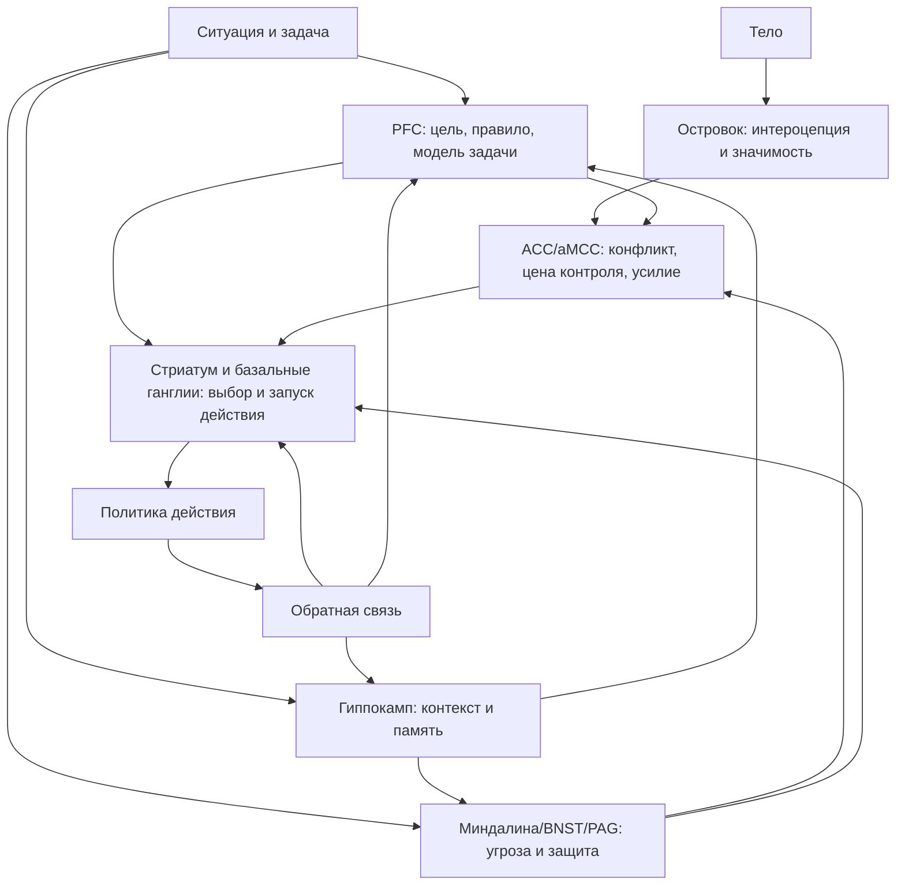

# Паспорт главы 13. Контуры действия

## Задача главы

Ввести основные мозговые контуры, которые нужны для понимания действия, избегания, усилия и саморегуляции, не превращая их в список "центров поведения".

Глава должна продолжить [[12-Уровни-объяснения]]: после дисциплины уровней объяснения читатель получает первую рабочую карту контурного уровня.

## Что читатель уже знает

Читатель уже понимает:

- мотивация не сводится к желанию;
- действие зависит от ценности, угрозы, управляемости и цены усилия;
- "нет энергии" нельзя объяснять одним баком топлива;
- переживание, поведение, параметры выбора, когнитивные процессы, контуры, медиаторы, тело и среда — разные уровни объяснения.

## Новые понятия

- контур действия;
- узел сети;
- PFC / префронтальная кора;
- dlPFC;
- OFC и vmPFC;
- ACC / dACC / aMCC;
- стриатум;
- базальные ганглии;
- кортико-стриато-таламо-кортикальные петли;
- миндалина;
- BNST;
- PAG;
- островковая кора;
- salience network;
- гиппокамп;
- защитная реакция;
- контекст памяти;
- порог запуска действия.

## Главная мысль

Мозг не содержит отдельных персонажей поведения.

```text
PFC не является "силой воли".
ACC не является "датчиком ошибок".
Стриатум не является "автопилотом".
Миндалина не является "центром страха".
Островок не является "центром телесных ощущений".
```

Каждая структура участвует в нескольких функциях и работает в сети. Для когнитивного инженерства важна не анатомическая зубрежка, а функциональная карта: какой узел помогает удерживать цель, какой оценивает конфликт и цену контроля, какой участвует в выборе действия, какой поддерживает защитную готовность, какой приносит телесную цену, какой связывает ситуацию с памятью и будущим.

## Обязательные различения

| Понятие | Что это | Почему важно |
| --- | --- | --- |
| Структура | Анатомическая область или группа областей. | Не равна готовой психологической функции. |
| Контур | Связанная сеть областей, участвующая в задаче. | Поведение реализуется через взаимодействие, а не одиночную точку. |
| Функция | Что система делает в задаче: удерживает цель, выбирает действие, оценивает угрозу. | Одна функция может использовать несколько контуров. |
| Узел сети | Структура, которая участвует в нескольких контурах. | Узел нельзя читать как самостоятельного "агента". |
| Коррелят | Что меняется вместе с задачей или состоянием. | Коррелят не всегда причина и не всегда хороший уровень вмешательства. |
| Уровень вмешательства | Где можно менять ситуацию практически. | Часто проще изменить контекст, первый шаг или угрозу, чем "тренировать зону мозга". |

## Визуальная опора

Главная схема главы — карта функциональных узлов действия.



## Практический пример

Один пример на всю главу:

```text
человек должен открыть сложную задачу, но замирает и уходит в легкие действия
```

Разбор по контурам:

- PFC: не удержана рабочая модель задачи или правило входа;
- ACC/aMCC: конфликт высок, цена контроля кажется слишком большой;
- стриатум/базальные ганглии: легкие действия имеют меньший порог запуска;
- миндалина/BNST/PAG: угроза ошибки или оценки запускает защитную готовность;
- островок: тело сообщает высокую цену входа;
- гиппокамп: прежний опыт похожих задач делает текущую ситуацию опасной или управляемой.

## Практический вывод

Контурная карта нужна не для самодиагностики "какая зона у меня сломалась", а для выбора более точного вмешательства.

```text
Если не удерживается задача — усилить внешний контекст.
Если высок конфликт — снизить ставку первого шага.
Если выигрывают легкие действия — изменить пороги запуска.
Если угроза захватывает систему — вернуть безопасность и управляемость.
Если тело сообщает высокую цену — уменьшить нагрузку или восстановиться.
Если прошлый опыт отравляет вход — создать новый опыт малого контроля.
```

## Границы применимости

Глава не дает медицинских и клинических выводов. Она не учит ставить диагнозы по ощущениям и не обещает управлять мозговыми областями напрямую.

Ее задача — дать читателю карту, которая поможет читать главы 14-15 и дальше не смешивать:

- мозговую реализацию;
- психологическую функцию;
- субъективное переживание;
- инженерное вмешательство.

## Опорные источники

- [[../Источники/2026-05-24 Пакет источников для главы 13]]
- [[../Источники/2026-05-24 Пакет источников для главы 12]]
- [[../../2026-05-01 Мотивация как система II - нейрофизиология побуждения, усилия, избегания и истощения]]
- [[../../2025-05-06 09-26 Нейроархитектура воли; как работает мозг саморегуляции и что с ним можно сделать, когнитивное инженерство]]

## Популярные ошибки, которые глава предотвращает

- "У меня слабая PFC".
- "Миндалина захватила мозг".
- "Нужно прокачать ACC".
- "Стриатум — это автопилот, который мешает думать".
- "Если я знаю область мозга, я уже знаю причину".
- "Если проблема реализуется в мозге, вмешиваться нужно только в мозг".
- "Эмоции, тело и контроль — отдельные системы, которые просто мешают друг другу".

## Связь с соседними главами

Глава 12 дала дисциплину уровней объяснения. Глава 13 применяет ее к контурам действия. Глава 14 сможет говорить о нейромедиаторах и гормонах как о регуляторах режима этих контуров, а не как о "кнопках счастья" или "кнопках мотивации".

## Статус

`ready-for-review`

Черновик главы создан: [[../Главы/13-Контуры-действия]].

Карта объяснения создана: [[../Карты объяснения/13-Контуры-действия]].

Источниковый пакет создан: [[../Источники/2026-05-24 Пакет источников для главы 13]].

Связка с предыдущей главой проверена: [[../Проверки/2026-05-24 Связка глав 12-13]].

Ревизия блока: [[../Проверки/2026-05-25 Ревизия блока 12-15]].

Следующий шаг: при финальной редактуре проверить, что контуры остаются функциональной картой действия, а не анатомическим справочником.
