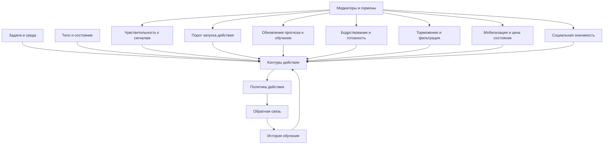

# Паспорт главы 14. Нейромедиаторы и гормоны

## Задача главы

Аккуратно ввести нейрохимический уровень учебника: показать, как нейромедиаторы и гормональные системы регулируют режимы уже введенных контуров действия, не превращая их в популярные "кнопки счастья", "кнопки мотивации", "гормоны любви" или "вещества силы воли".

Глава должна продолжить [[13-Контуры-действия]]. После карты PFC, ACC/aMCC, стриатума, сети угрозы, островка и гиппокампа читатель получает следующий слой: не новые "центры поведения", а химическую настройку чувствительности, порогов, обучения, мобилизации и торможения.

## Что читатель уже знает

Читатель уже понимает:

- мотивация не равна желанию;
- действие зависит от ценности, угрозы, управляемости и цены усилия;
- "нет энергии" нельзя понимать как один бак топлива;
- уровни объяснения нельзя смешивать;
- мозговые структуры не являются "центрами" готовых психологических функций;
- контуры действия работают как сеть, где цель, конфликт, угроза, тело, память и выбор действия влияют друг на друга.

## Новые понятия

- нейромедиатор;
- нейромодулятор;
- гормон;
- рецептор;
- дозозависимость;
- inverted-U effect;
- tonic/phasic activity;
- prediction error;
- incentive salience;
- effort allocation;
- arousal;
- neural gain;
- expected и unexpected uncertainty;
- excitation/inhibition balance;
- HPA-ось;
- аллостатическая цена;
- social salience;
- liking / wanting / learning;
- контекстный эффект медиатора.

## Главная мысль

Нейромедиаторы и гормоны не являются именами человеческих состояний.

```text
Дофамин не равен мотивации.
Норадреналин не равен вниманию.
Серотонин не равен настроению.
ГАМК не равна спокойствию.
Кортизол не равен стрессу.
Окситоцин не равен любви.
```

Они меняют режимы работы контуров: чувствительность к сигналам, пороги запуска, обучение по ошибке прогноза, готовность платить усилием, мобилизацию тела, торможение лишних действий, точность обработки и значимость социальных сигналов.

Поэтому инженерный вопрос звучит не так:

```text
какой медиатор мне поднять?
```

а так:

```text
какой режим системы сейчас нужен, какой режим фактически включен и на каком уровне разумнее вмешиваться?
```

## Обязательные различения

| Понятие | Что это | Почему важно |
| --- | --- | --- |
| Нейромедиатор | Вещество, участвующее в передаче сигнала между нервными клетками. | Не равно психологическому состоянию. |
| Нейромодулятор | Система, меняющая чувствительность, режим и динамику нейронных сетей. | Помогает говорить о настройке контуров, а не о кнопках поведения. |
| Гормон | Сигнальная молекула, действующая через эндокринную систему и тело. | Связывает мозг, тело и состояние, но не объясняет поведение в одиночку. |
| Рецептор | Молекулярная "точка чтения" сигнала. | Один медиатор может иметь разные эффекты через разные рецепторы и области. |
| Концентрация | Сколько вещества доступно в системе или участке. | "Больше" не всегда лучше; часто есть оптимум и нелинейность. |
| Контекст | Задача, угроза, тело, история, социальная ситуация и текущий контур. | Один и тот же медиатор может работать по-разному в разных условиях. |
| Уровень вмешательства | Где практически менять ситуацию. | Часто лучше менять задачу, среду, сон, угрозу и обратную связь, а не пытаться "управлять медиатором". |

## Визуальная опора

Главная схема главы — "медиаторы как регуляторы режима контуров".



Дополнительная обязательная таблица:

| Популярная формула | Точнее | Инженерный вопрос |
| --- | --- | --- |
| Дофамин = мотивация | Дофамин участвует в обучении, ошибке прогноза, значимости, усилии и выборе действия. | Есть ли ценность, обратная связь, управляемость и переносимая цена усилия? |
| Норадреналин = внимание | Норадреналин меняет режим готовности, arousal и neural gain. | Это точный фокус, тревожная мобилизация или поиск другого поведения? |
| Серотонин = настроение | Серотонин связан с торможением, наказанием, задержкой, aversive control и социально-аффективной регуляцией. | Что система тормозит, терпит или старается предотвратить? |
| ГАМК = спокойствие | Торможение формирует timing, фильтрацию и устойчивость сигналов. | Где нужно ограничить шум, импульс или runaway-возбуждение? |
| Кортизол = стресс | Кортизол входит в HPA-ось, мобилизацию и аллостатическую цену. | Это полезная краткая мобилизация или накопленная цена адаптации? |
| Окситоцин = любовь | Окситоцин может усиливать социальную значимость сигналов. | Какой социальный сигнал стал важнее: поддержка, угроза, свой/чужой, близость, оценка? |

## Практический пример

Один пример на всю главу:

```text
человек вечером открывает важную задачу, но не может войти в нее:
тело напряжено, контекст распался, уведомления притягивают, а задача кажется тяжелой и неприятной
```

Разбор:

- дофамин нельзя читать как "низкая мотивация"; нужно смотреть на прогноз успеха, обратную связь, стоимость усилия и конкурирующие быстрые подкрепления;
- норадреналин может означать не "хороший фокус", а тревожную готовность, при которой система сканирует угрозы и альтернативы;
- серотониновый уровень не стоит переводить в "настроение"; важнее вопрос, что система тормозит и каких последствий избегает;
- ГАМК/глутамат напоминают, что устойчивое мышление требует не максимального возбуждения, а правильной фильтрации и баланса;
- кортизол/HPA-ось заставляют спросить, это краткая мобилизация или накопленная цена дня;
- окситоциновые и социальные системы важны, если задача связана с оценкой, статусом, принадлежностью, стыдом или поддержкой.

## Практический вывод

Глава должна дать читателю не список веществ, а переводчик:

```text
медиатор -> какой режим контура он может менять -> где это видно в поведении -> какой инженерный вопрос задать
```

Например:

```text
Не "поднять дофамин", а улучшить контур обратной связи и снизить цену первого шага.
Не "снизить кортизол", а убрать неконтролируемость, неопределенность и постоянные прерывания.
Не "добавить серотонин", а понять, где система тормозит действие из-за наказания, угрозы или долгого ожидания.
```

## Границы применимости

Глава не является медицинским, фармакологическим или биохакинг-протоколом.

Она не должна:

- давать советы по препаратам, добавкам, дозировкам и анализам;
- объяснять личность уровнем гормонов;
- обещать прямое управление медиаторами через бытовые практики;
- делать выводы о диагнозах;
- превращать сложные состояния в нейрохимические ярлыки.

Ее задача — дать язык, который позволит дальше говорить о стрессе, сне, выгорании, привычках, ИИ и лидерстве без псевдонаучных сокращений.

## Опорные источники

- [[../Источники/2026-05-24 Пакет источников для главы 14]]
- [[../Источники/2026-05-24 Пакет источников для главы 13]]
- [[../Источники/2026-05-24 Пакет источников для главы 11]]
- [[../../2026-05-01 Мотивация как система I.5 - нейрофизиология достижения, принадлежности, влияния и избегания]]
- [[../../2026-05-01 Мотивация как система II - нейрофизиология побуждения, усилия, избегания и истощения]]
- [[Психология, нейрофизиология/Нейромедиаторы и гормоны]]

## Популярные ошибки, которые глава предотвращает

- "У меня низкий дофамин, поэтому я ничего не делаю".
- "Мне надо поднять серотонин, и настроение починится".
- "Кортизол вреден, его нужно просто снижать".
- "Окситоцин делает людей добрее".
- "ГАМК — это внутреннее спокойствие".
- "Если вещество связано с поведением, значит поведение объяснено".
- "Если вещество можно измерить где-то в теле, можно прямо понять состояние мозга".
- "Если практика приятная, она обязательно полезно регулирует биохимию".

## Связь с соседними главами

Глава 13 дала карту контуров действия. Глава 14 объясняет, как эти контуры меняют режим под влиянием нейромедиаторов и гормональных систем.

Глава 15 сможет дальше говорить о стрессе, аллостазе и окне полезной нагрузки не как о "кортизоле", а как о системной регуляции нагрузки, мобилизации и восстановления.

## Статус

`ready-for-review`

Черновик главы создан: [[../Главы/14-Нейромедиаторы-и-гормоны]].

Карта объяснения создана: [[../Карты объяснения/14-Нейромедиаторы-и-гормоны]].

Источниковый пакет создан: [[../Источники/2026-05-24 Пакет источников для главы 14]].

Связка с предыдущей главой проверена: [[../Проверки/2026-05-24 Связка глав 13-14]].

Ревизия блока: [[../Проверки/2026-05-25 Ревизия блока 12-15]].

Следующий шаг: при финальной редактуре проверить, что глава не расширилась в фармакологию и не обещает прямое управление медиаторами.
