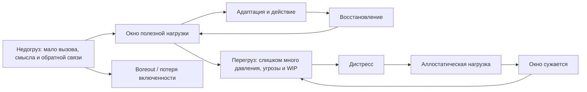

# Паспорт главы 15. Стресс, аллостаз и окно полезной нагрузки

## Задача главы

Завершить первую нейрофизиологическую часть учебника через понятие нагрузки. Показать, что стресс нельзя понимать как один гормон, одно чувство или один моральный ярлык. Стресс — это режим мобилизации и адаптации, который может помогать действию, но имеет цену и становится разрушительным при неконтролируемости, длительности, перегрузе, недогрузе и недостаточном восстановлении.

Глава должна продолжить [[14-Нейромедиаторы-и-гормоны]]. После разговора о кортизоле, норадреналине, дофамине и HPA-оси читатель должен увидеть систему целиком:

```text
медиаторы и гормоны -> режим мобилизации -> нагрузка -> окно полезной работы -> цена восстановления
```

## Что читатель уже знает

Читатель уже понимает:

- мотивация зависит от ценности, угрозы, управляемости и цены усилия;
- усталость не является одним баком энергии;
- тело участвует в оценке доступности действия;
- уровни объяснения нельзя смешивать;
- мозговые контуры не являются "центрами" поведения;
- нейромедиаторы и гормоны меняют режимы контуров, но не являются психологическими состояниями.

## Новые понятия

- стрессор;
- стрессовая реакция;
- мобилизация;
- эустресс;
- дистресс;
- закон Йеркса-Додсона;
- окно полезной нагрузки;
- перегруз;
- недогруз;
- гомеостаз;
- аллостаз;
- аллостатическая нагрузка;
- управляемость нагрузки;
- challenge stressor;
- hindrance stressor;
- восстановление после нагрузки;
- восстановительный долг.

## Главная мысль

Стресс полезно понимать не как врага и не как топливо, а как режим адаптации.

Краткая мобилизация может помочь системе собраться, выделить важный сигнал и ответить на вызов. Но та же мобилизация становится дистрессом, когда она длится слишком долго, плохо управляется, не завершается восстановлением или не соответствует сложности задачи.

Практический вопрос главы:

```text
какой уровень нагрузки сейчас полезен для этой задачи,
не вышла ли система из рабочего окна,
и что нужно изменить: давление, ясность, управляемость, WIP, восстановление или уровень вызова?
```

## Обязательные различения

| Понятие | Что это | Почему важно |
| --- | --- | --- |
| Стрессор | Событие, требование или условие, требующее адаптации. | Не равен внутреннему переживанию стресса. |
| Стрессовая реакция | Режим мобилизации тела, внимания, угрозы и действия. | Может помогать на коротком отрезке. |
| Эустресс | Мобилизация, которая помогает адаптации и оставляет доступным восстановление. | Не всякое напряжение плохо. |
| Дистресс | Нагрузка, которая перестает помогать и начинает разрушать восстановление. | Новый нажим часто ухудшает состояние. |
| Окно полезной нагрузки | Диапазон, где задача достаточно включает, но не перегружает. | Помогает видеть и перегруз, и недогруз. |
| Аллостаз | Поддержание устойчивости через изменение режима. | Организм не просто возвращается к одному покою, а перестраивается под требования. |
| Аллостатическая нагрузка | Накопленная цена повторной или хронической адаптации. | Объясняет, почему "я держусь" может быть дорогим состоянием. |
| Управляемость | Ожидаемая способность влиять на ход нагрузки и исход. | Неконтролируемый стресс дороже контролируемого. |
| Восстановление | Возврат способности снова адаптироваться. | Не бонус после работы, а часть контура нагрузки. |

## Визуальная опора

Главная схема главы — окно полезной нагрузки.



Дополнительная таблица:

| Параметр | Ниже окна | Внутри окна | Выше окна |
| --- | --- | --- | --- |
| Вызов | Скучно, бессмысленно, нет включенности. | Есть задача, интерес и напряжение роста. | Ставки и требования выше переносимого. |
| Внимание | Распадается от недовключения. | Собирается вокруг задачи. | Сужается на угрозе и ошибках. |
| Управляемость | "Не на что влиять". | "Я могу сделать следующий шаг". | "От меня требуют больше, чем я контролирую". |
| Обратная связь | Слишком слабая или бессмысленная. | Помогает корректировать действие. | Превращается в угрозу оценки. |
| Восстановление | Энергия не собирается в действие. | Нагрузка возвращает опыт и не ломает восстановление. | Восстановление не успевает закрывать цену. |

## Практический пример

Один и тот же дедлайн может работать по-разному.

Если задача понятна, объем ограничен, следующий шаг виден, а человек может влиять на ход работы, дедлайн дает полезную мобилизацию: внимание собирается, лишнее отсекается, появляется темп.

Если задача туманна, WIP уже перегружен, ставки завышены, поддержки нет, а восстановление давно просело, тот же дедлайн усиливает дистресс: внимание сужается, PFC-зависимое мышление ухудшается, растет избегание, а после рывка система возвращается не к опоре, а к долгу.

## Практический вывод

Перед тем как "поднять мотивацию", "поднажать" или добавить дедлайн, нужно проверить окно нагрузки:

```text
задача недовключает, подходит по вызову или перегружает?
стрессор контролируемый или неконтролируемый?
мобилизация помогает действовать или уже только шумит?
после рабочего блока система восстанавливается или копит долг?
```

## Границы применимости

Глава не является медицинской инструкцией и не должна давать рекомендации по диагностике, лечению, анализам, препаратам, добавкам или управлению гормонами.

Глава дает язык для инженерного анализа нагрузки: как проектировать задачи, среду, ритм, WIP, восстановление и социальную рамку так, чтобы полезная мобилизация не превращалась в хронический дистресс.

## Опорные источники

- [[../Источники/2026-05-24 Пакет источников для главы 15]]
- [[../Источники/2026-05-24 Пакет источников для главы 14]]
- [[Психология, нейрофизиология/Выгорание/Закон Йеркса - Додсона]]
- [[Психология, нейрофизиология/Выгорание/эустресс]]
- [[Психология, нейрофизиология/Выгорание/дистресс]]
- [[Психология, нейрофизиология/Выгорание/фазы стресса]]
- [[Психология, нейрофизиология/Выгорание/выгорание стресса]]
- [[Психология, нейрофизиология/Выгорание/выгорание скуки]]

## Популярные ошибки, которые глава предотвращает

- "Стресс всегда вреден".
- "Стресс всегда полезен, если правильно его использовать".
- "Кортизол — это и есть стресс".
- "Для сложной работы нужно просто больше давления".
- "Если человек не включается, ему всегда не хватает мотивации".
- "Если человек устал, значит был перегруз; недогруз не может истощать".
- "Восстановление можно поставить после завершения всех важных дел".
- "Закон Йеркса-Додсона — точная шкала возбуждения".

## Связь с соседними главами

Глава 14 ввела нейромедиаторы и гормоны как регуляторы режима контуров. Глава 15 показывает, что стресс — это не один медиатор, а динамический режим нагрузки, мобилизации, адаптации и восстановления.

Глава 16 после этого сможет перейти к обучению и пониманию: сложное обучение требует не максимального возбуждения, а такого уровня нагрузки, при котором внимание, рабочая память, извлечение и обратная связь остаются доступными.

## Статус

`ready-for-review`

Черновик главы создан: [[../Главы/15-Стресс-аллостаз-и-окно-полезной-нагрузки]].

Карта объяснения создана: [[../Карты объяснения/15-Стресс-аллостаз-и-окно-полезной-нагрузки]].

Источниковый пакет создан: [[../Источники/2026-05-24 Пакет источников для главы 15]].

Связка с предыдущей главой проверена: [[../Проверки/2026-05-24 Связка глав 14-15]].

Ревизия блока: [[../Проверки/2026-05-25 Ревизия блока 12-15]].

Следующий шаг: при финальной редактуре удержать стресс как режим нагрузки, управляемости и восстановления, не расширяя главу в полноценный раздел о burnout.
