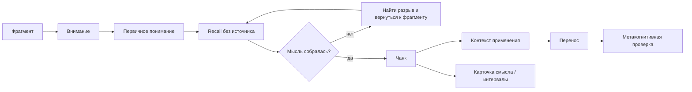

# Паспорт главы 16. Как строится понимание

## Задача главы

Открыть часть V учебника и показать, как знание становится рабочим. После главы о стрессе, аллостазе и окне полезной нагрузки читатель должен увидеть, что обучение требует не максимального нажима и не пассивного повторения, а правильной трудности: такой, которая удерживает внимание, заставляет восстановить мысль без источника, обнаруживает разрыв, помогает собрать чанк и проверить перенос.

Глава должна связать уже введенные понятия:

```text
окно полезной нагрузки -> полезная трудность -> рабочая память -> recall -> чанк -> контекст применения -> перенос
```

## Что читатель уже знает

Читатель уже понимает:

- внимание ограничено;
- рабочая память не может долго удерживать большой сырой контекст;
- внешние опоры помогают возвращать состояние задачи;
- мотивация зависит от ценности, управляемости, цены усилия и угрозы;
- высокий, длительный или неконтролируемый стресс ухудшает сложное мышление;
- полезная нагрузка отличается и от перегруза, и от недогруза.

## Новые понятия

- фрагмент знания;
- знакомость;
- узнавание;
- рабочее понимание;
- рабочая память как окно удержания и обработки;
- чанк;
- чанкинг;
- recall;
- retrieval practice;
- иллюзия компетентности;
- ловушка избыточного обучения;
- карточка смысла;
- интервальное повторение;
- синопсис;
- контекст применения;
- перемежение;
- близкий и дальний перенос;
- полезная трудность в обучении.

## Главная мысль

Понимание не равно чувству знакомости.

Знание становится рабочим, когда человек может восстановить мысль без источника, объяснить ее своими словами, увидеть ее связь с соседними знаниями, понять условия применения и использовать в новой ситуации.

Краткая формула главы:

```text
знакомость отвечает: "я это видел"
понимание отвечает: "я могу это восстановить, связать и применить"
```

## Обязательные различения

| Понятие | Что это | Почему важно |
| --- | --- | --- |
| Фрагмент | Отдельная мысль, факт, шаг, пример или термин до сборки в систему. | Сырые фрагменты быстро перегружают рабочую память. |
| Знакомость | Легкость узнавания материала при повторном контакте. | Часто маскируется под понимание. |
| Рабочее понимание | Способность восстановить смысл без источника и объяснить своими словами. | Это первый порог, где знание начинает становиться своим. |
| Чанк | Блок знания, который возвращается почти целиком и работает как одна единица. | Уменьшает нагрузку на рабочую память. |
| Чанкинг | Сборка фрагментов в рабочий блок через смысл или действие. | Не равен сортировке по папкам или выделению текста. |
| Recall | Восстановление без источника. | Показывает разрывы и само укрепляет знание. |
| Карточка смысла | Мини-тест на восстановление чанка. | Полезна после первичной сборки мысли, а не вместо нее. |
| Синопсис | Позднее сжатие темы в собственный каркас. | Проверяет, пережило ли понимание интервал. |
| Перенос | Узнавание и применение принципа в новой ситуации. | Главный тест, что знание не привязано только к исходному примеру. |

## Визуальная опора

Главная схема главы:



Дополнительная таблица:

| Проверка | Что показывает |
| --- | --- |
| Узнаю материал | Есть знакомость, но знания может еще не быть. |
| Могу пересказать без источника | Есть первичное рабочее понимание. |
| Могу объяснить связь с соседней темой | Появляется чанк, а не отдельный факт. |
| Могу выбрать, когда это применять | Есть контекст чанка. |
| Могу применить в новом примере | Начался перенос. |

## Практический пример

Человек читает объяснение `аллостатической нагрузки`.

Плохой результат: он узнает термин, кивает при чтении и может найти заметку.

Рабочий результат: он без источника объясняет, что аллостатическая нагрузка — это накопленная цена повторной или хронической адаптации, а затем применяет это к задаче: замечает, что проблема не только в текущем дедлайне, а в том, что несколько недель подряд каждая задача запускается как аварийная.

## Практический вывод

После изучения новой мысли нужно не сразу делать красивый конспект, а проверить:

```text
могу ли я убрать источник и восстановить мысль своими словами?
где объяснение рвется?
какой общий блок здесь собирается?
в какой ситуации этот блок нужно достать?
как проверить его на новом примере?
```

## Границы применимости

Глава не должна становиться общей теорией образования, педагогики или памяти. Она дает минимальную рабочую модель понимания для когнитивного инженерства: как проектировать учебные касания, заметки, карточки, практику и проверку переноса так, чтобы знание становилось доступным действием.

Глава не закрывает сон, консолидацию и восстановление после обучения. Это задача главы 17.

## Опорные источники

- [[../Источники/2026-05-24 Пакет источников для главы 16]]
- [[Темы/GeekBrains Умение учиться/00-Курс GeekBrains Умение учиться]]
- [[Темы/GeekBrains Умение учиться/02 Чанк — меч самурая знаний/чанк]]
- [[Темы/GeekBrains Умение учиться/02 Чанк — меч самурая знаний/чанкинг]]
- [[Темы/GeekBrains Умение учиться/02 Чанк — меч самурая знаний/техника recall]]
- [[Темы/GeekBrains Умение учиться/02 Чанк — меч самурая знаний/Иллюзия компетентности]]
- [[Темы/GeekBrains Умение учиться/03 Как мы запоминаем и как наш сон влияет на память/Алгоритм создания чанка]]
- [[Темы/GeekBrains Умение учиться/03 Как мы запоминаем и как наш сон влияет на память/Формирование контекста чанка]]
- [[Темы/GeekBrains Умение учиться/03 Как мы запоминаем и как наш сон влияет на память/Карточки смысла]]
- [[Психология, нейрофизиология/кратковременная память]]
- [[Психология, нейрофизиология/интервальное повторение]]

## Популярные ошибки, которые глава предотвращает

- "Я понял, потому что текст был понятный".
- "Если перечитать еще раз, знание само закрепится".
- "Чанк — это папка или группа заметок".
- "Карточки смысла можно делать прямо из чужой формулировки".
- "Интервальное повторение заменяет практику".
- "Карта понятий уже доказывает понимание".
- "Если сейчас легко выполняется упражнение, значит случилось долговременное обучение".
- "Перенос возникнет сам, если достаточно хорошо выучить исходный пример".

## Связь с соседними главами

Глава 15 ввела окно полезной нагрузки. Глава 16 показывает частный, но центральный случай этого окна: обучение. Полезная трудность нужна, потому что без нее нет восстановления из памяти, различения и переноса. Но чрезмерная трудность, угроза и перегруз рабочей памяти ломают сборку смысла.

Глава 17 после этого сможет раскрыть сон, восстановление и консолидацию: почему после фокусного контакта, recall и первичной сборки знание должно пройти через паузы, сон и повторные касания.

## Статус

`ready-for-review`

Черновик главы создан: [[../Главы/16-Как-строится-понимание]].

Карта объяснения создана: [[../Карты объяснения/16-Как-строится-понимание]].

Источниковый пакет создан: [[../Источники/2026-05-24 Пакет источников для главы 16]].

Связки проверены: [[../Проверки/2026-05-24 Связка глав 15-16]] и [[../Проверки/2026-05-24 Связка глав 16-17]].

Ревизия блока: [[../Проверки/2026-05-25 Ревизия блока 16-19]].

Следующий шаг: при финальной редактуре удержать главу как механизм понимания, а не набор учебных советов.
