# Паспорт главы 17. Сон, восстановление и консолидация

## Задача главы

Показать, что обучение и продуктивность зависят от восстановления не как морального совета, а как части системы. После главы 16 читатель уже понимает, что знание строится через внимание, recall, чанк, контекст применения и перенос. Теперь нужно объяснить, почему даже хороший фокусный контакт не завершает обучение: первичный след должен быть стабилизирован, повторно поднят, уточнен, связан с прежними знаниями и возвращен через интервалы.

Глава должна связать:

```text
первичный чанк -> пауза -> сон -> консолидация -> повторное извлечение -> уточнение -> более устойчивый чанк
```

## Что читатель уже знает

Читатель уже понимает:

- рабочая память ограничена;
- знакомость не равна пониманию;
- recall показывает разрывы и укрепляет знание;
- чанк — это рабочая единица знания, а не папка;
- полезная трудность отличается от перегруза;
- восстановление после нагрузки возвращает способность действовать;
- сон нельзя обсуждать как "просто отдых" без учета состояния системы.

## Новые понятия

- первичный след;
- энграмма как рабочая метафора отпечатка опыта;
- консолидация памяти;
- системная консолидация;
- реактивация;
- реконсолидация;
- sleep-dependent memory consolidation;
- рассеянный режим;
- фокусный контакт;
- интервал между касаниями;
- distributed practice;
- spacing effect;
- нейроворкаут;
- двигательная пауза;
- состояние обучения.

## Главная мысль

Сон, паузы и интервалы — не награда после обучения, а часть учебного контура.

Фокусный контакт создает материал для памяти, recall помогает собрать и проверить первичный чанк, но устойчивость появляется через повторные возвращения, консолидацию, реактивацию и применение. Если постоянно забирать у системы сон и паузы, обучение превращается в поток входящей информации без достаточного закрепления.

Краткая формула главы:

```text
учиться - это не только входить в материал,
но и оставлять системе время и условия,
чтобы материал стал возвращаемым
```

## Обязательные различения

| Понятие | Что это | Почему важно |
| --- | --- | --- |
| Фокусный контакт | Активная работа с материалом: чтение, разбор, recall, задача. | Без него сну и рассеянному режиму нечего перерабатывать. |
| Пауза | Интервал между подходами, где материал может дорабатываться и забываться частично. | Делает следующий recall настоящим извлечением, а не продолжением чтения. |
| Сон | Активное состояние мозга, связанное с восстановлением, регуляцией и памятью. | Нельзя бесконечно менять сон на учебные часы без потерь. |
| Консолидация | Стабилизация и реорганизация следов памяти. | Объясняет, почему знание требует времени после первого контакта. |
| Реактивация | Повторное поднятие следа памяти. | Может поддерживать закрепление и интеграцию. |
| Реконсолидация | Изменение следа после повторного обращения. | Повторение может уточнять и искажать, а не только укреплять. |
| Интервальное повторение | Разнесенное во времени извлечение. | Помогает удерживать знание, но не заменяет практику. |
| Двигательная пауза | Мягкая смена состояния через движение. | Может вернуть внимание и дать материалу паузу, но не является универсальной нейротренировкой. |

## Визуальная опора

Главная схема главы:

```mermaid
flowchart LR
    FOCUS["Фокусный контакт"] --> RECALL["Recall"]
    RECALL --> TRACE["Первичный след / чанк-кандидат"]
    TRACE --> PAUSE["Пауза"]
    PAUSE --> SLEEP["Сон"]
    SLEEP --> CONS["Консолидация и реорганизация"]
    CONS --> NEXT["Следующее касание"]
    NEXT --> RET["Повторное извлечение"]
    RET --> UPDATE["Уточнение / реконсолидация"]
    UPDATE --> STABLE["Более устойчивый чанк"]
```



Дополнительная развилка:

| Ситуация | Что происходит | Инженерный ход |
| --- | --- | --- |
| Материал только что разобран | След еще свежий и опирается на контекст источника. | Сделать recall и зафиксировать вопрос возврата. |
| Прошел короткий интервал | Часть оболочки ушла, видно, что реально держится. | Повторить извлечение, чинить разрывы. |
| Был нормальный сон | След может стать устойчивее и связаться с прежними знаниями. | Вернуться через карточку, синопсис или задачу. |
| Есть недосып | Внимание, контроль и память работают хуже. | Не добавлять сложность; сначала восстановить состояние или снизить нагрузку. |
| Фокус застрял | Мысль крутится в одном месте. | Короткая пауза, прогулка, сон, затем возврат с вопросом. |

## Практический пример

Человек вечером разобрал главу 16 и сделал карточку смысла про отличие знакомости от понимания.

Плохой ход: продолжать еще два часа читать новые главы, потому что "пошло хорошо".

Рабочий ход: сделать короткий recall, записать вопрос для следующего касания, остановиться, дать материалу интервал, выспаться и утром проверить, что осталось без источника. Если мысль возвращается, ее можно связать с задачей. Если нет, нужно чинить конкретный разрыв, а не перечитывать все с начала.

## Практический вывод

После фокусного учебного блока нужно оставлять точку возврата:

```text
что я должен достать из памяти завтра?
какой вопрос проверит не узнавание, а понимание?
где я ожидаю разрыв?
какой следующий формат нужен: карточка, синопсис, задача, прогулка или сон?
```

## Границы применимости

Глава не является медицинской инструкцией по сну, лечению бессонницы, режиму дня или хронической усталости. Она описывает сон и восстановление как часть учебной и когнитивной системы.

Глава не должна обещать, что сон сам решит задачу, создаст понимание без фокусной работы или заменит практику. Сон помогает переработке того, с чем система уже получила контакт.

## Опорные источники

- [[../Источники/2026-05-24 Пакет источников для главы 17]]
- [[Темы/техники самообразования/сон в контексте обучения]]
- [[Темы/техники самообразования/рефлексия информации]]
- [[Темы/техники самообразования/физическая активность и прогулки при обучении]]
- [[Темы/GeekBrains Умение учиться/03 Как мы запоминаем и как наш сон влияет на память/консолидация памяти]]
- [[Темы/GeekBrains Умение учиться/03 Как мы запоминаем и как наш сон влияет на память/гиппокампус]]
- [[Темы/GeekBrains Умение учиться/03 Как мы запоминаем и как наш сон влияет на память/энграммы]]
- [[Темы/GeekBrains Умение учиться/01 Мозг — это супермашина/режимы работы мозга]]
- [[Темы/GeekBrains Умение учиться/00-01 Умение учиться - Введение/нейроворкаут]]
- [[Темы/GeekBrains Умение учиться/00-01 Умение учиться - Введение/теория трёх касаний]]
- [[Психология, нейрофизиология/интервальное повторение]]

## Популярные ошибки, которые глава предотвращает

- "Сон — это просто время, которое можно обменять на учебу".
- "Если я понял материал вечером, он уже закрепился".
- "Рассеянный режим сам решит задачу без фокусного контакта".
- "Пауза — это лень или прокрастинация".
- "Интервальное повторение — это просто расписание повторов".
- "Чем плотнее учиться, тем больше закрепится".
- "Прогулка или физическая активность автоматически улучшают любую когнитивную задачу".
- "Недосып можно компенсировать мотивацией".

## Связь с соседними главами

Глава 16 показала, как строится понимание: фрагмент, внимание, recall, чанк, контекст, перенос. Глава 17 добавляет временной и восстановительный слой: даже хороший первичный чанк должен пройти через паузы, сон, повторное извлечение и уточнение.

Глава 18 после этого сможет перейти к прокрастинации: иногда откладывание выглядит как "пауза", но системно оно не создает точки возврата, не снижает угрозу и не помогает консолидации.

## Статус

`ready-for-review`

Черновик главы создан: [[../Главы/17-Сон-восстановление-и-консолидация]].

Карта объяснения создана: [[../Карты объяснения/17-Сон-восстановление-и-консолидация]].

Источниковый пакет создан: [[../Источники/2026-05-24 Пакет источников для главы 17]].

Связки проверены: [[../Проверки/2026-05-24 Связка глав 16-17]] и [[../Проверки/2026-05-24 Связка глав 17-18]].

Ревизия блока: [[../Проверки/2026-05-25 Ревизия блока 16-19]].

Следующий шаг: при финальной редактуре не превращать главу в sleep hacks и не обещать магического закрепления без recall и применения.
