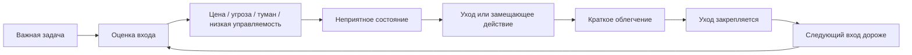
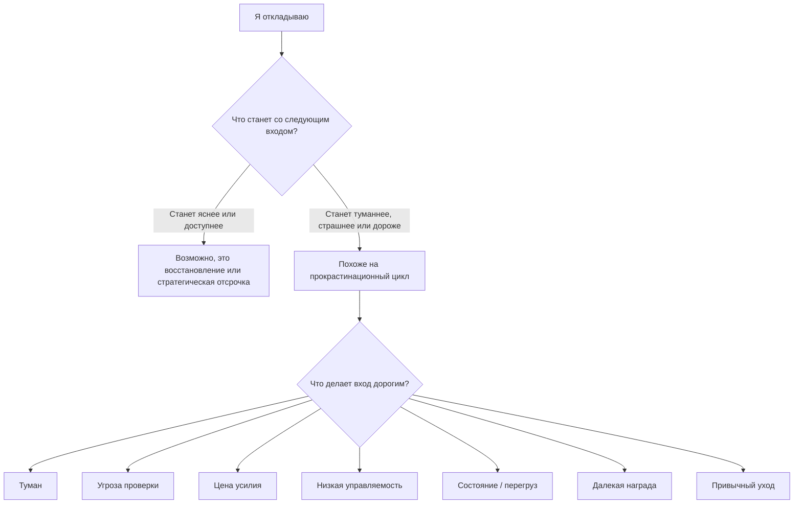

# Паспорт главы 18. Прокрастинация как конфликт систем

## Задача главы

Показать прокрастинацию не как лень и не как бытовую слабость воли, а как конфликт нескольких систем:

```text
ценность задачи
угроза входа
цена усилия
ясность следующего шага
управляемость
текущее состояние
временная перспектива
привычный уход
```

Глава должна продолжить главу 17: восстановление делает следующий вход доступнее, а прокрастинация часто дает краткое облегчение и делает следующий вход дороже.

## Что читатель уже знает

Читатель уже понимает:

- мотивация не равна желанию;
- важная задача может запускать не приближение, а избегание;
- избегание закрепляется через облегчение;
- управляемость определяет, кажется ли усилие осмысленным;
- цена усилия бывает когнитивной, эмоциональной, социальной, идентичностной и восстановительной;
- отдых отличается от избегания тем, что восстанавливает доступность действия;
- пауза полезна, если есть фокусный контакт и точка возврата.

## Новые понятия

- прокрастинация как отсрочка с будущей ценой;
- short-term mood regulation;
- ловушка старта;
- цена входа;
- временная дисконтировка;
- близкая награда;
- будущий self;
- замещающее действие;
- активное избегание;
- привычный уход;
- стратегическая отсрочка;
- имитация контроля;
- намерение реализации;
- планирование по схеме "если - то";
- первый наблюдаемый шаг;
- точка возврата после отсрочки.

## Главная мысль

Прокрастинация часто возникает не потому, что задача не важна, а потому что вход в нее сейчас слишком дорог, туманен, угрожающ, скучен, неуправляем или конфликтует с текущим состоянием.

Краткая формула:

```text
прокрастинация - это не отсутствие будущей ценности,
а победа ближайшего облегчения над дорогим входом
```

## Центральная схема



## Обязательные различения

| Пара | Различение |
| --- | --- |
| Прокрастинация / отдых | Отдых восстанавливает вход; прокрастинация снижает неприятное состояние сейчас и часто ухудшает следующий вход. |
| Прокрастинация / стратегическая отсрочка | Стратегическая отсрочка имеет причину, критерий возврата и сохраненный контекст. |
| Подготовка / избегание | Подготовка приближает проверяемый шаг; избегание заменяет момент проверки. |
| Планирование / имитация контроля | План связывает ситуацию с действием; имитация плана дает чувство контроля без контакта с задачей. |
| "Не хочу" / "дорого входить" | Низкое желание может скрывать страх, цену, усталость, туман, низкую управляемость или отсутствие близкой обратной связи. |
| Малый шаг / обесценивание задачи | Малый шаг нужен не потому, что задача маленькая, а потому что вход должен стать возможным. |
| Стыд / ответственность | Ответственность возвращает действие; стыд повышает угрозу и часто усиливает уход. |

## Визуальная опора

Главная диагностическая развилка:



## Практический пример

Разработчику нужно разобрать сложный баг. Задача важная, но вход неприятный: много логов, непонятно, где граница проблемы, есть риск признать, что он долго шел не туда.

Он открывает чат, отвечает на мелкие сообщения, чистит почту, обновляет окружение, перечитывает старые заметки. Внешне он занят. Внутренне он не входит в место проверки.

Рабочий вход:

```text
не "разобраться с багом",
а "за 12 минут выписать три факта из логов
и одно место, где моя гипотеза может быть ложной"
```

Этот шаг не решает всю задачу. Он возвращает контакт с реальностью задачи и снижает цену следующего шага.

## Практический вывод

Работа с прокрастинацией начинается не с самонажима, а с вопроса:

```text
что именно делает вход дорогим сейчас?
```

Возможные инженерные ответы:

- сделать первый шаг наблюдаемым и физически конкретным;
- уменьшить длительность входа;
- отделить черновой контакт от финального результата;
- оставить точку возврата;
- заранее связать сигнал запуска с действием через план по схеме "если - то";
- убрать ближайшие легкие награды из первого экрана;
- вернуть управляемость через критерий продвижения;
- восстановить состояние, если система уже не держит даже короткий контейнер.

## Границы применимости

Глава не является клинической инструкцией. Она описывает обычную прокрастинацию как режим саморегуляции и инженерную проблему входа в действие.

Если откладывание связано с тяжелой депрессией, выраженной тревогой, ADHD, хроническим недосыпом, выгоранием, зависимым поведением или лекарственными вопросами, самостоятельные продуктивностные техники не должны подменять профессиональную помощь.

## Опорные источники

- [[../Источники/2026-05-24 Пакет источников для главы 18]]
- [[Темы/GeekBrains Умение учиться/01 Мозг — это супермашина/прокрастинация]]
- [[Темы/GeekBrains Умение учиться/01 Мозг — это супермашина/01-04 Прокрастинация и ловушки мышления]]
- [[../../2025-05-02 00-53 Произвольное внимание, прокрастинация и нейротренировка]]
- [[../Главы/09-Приближение-и-избегание]]
- [[../Главы/10-Управляемость-действия]]
- [[../Главы/11-Цена-усилия-усталость-и-ощущаемая-энергия]]
- [[../Главы/17-Сон-восстановление-и-консолидация]]

## Популярные ошибки, которые глава предотвращает

- "Прокрастинация — это лень".
- "Если задача важная, мотивации должно хватить".
- "Нужно просто взять себя в руки".
- "Прокрастинация лечится большим планом".
- "Если я сейчас читаю полезное, значит я не избегаю".
- "Стыд помогает собраться".
- "Помодоро решает любую прокрастинацию".
- "Если я откладываю, значит мне это не нужно".
- "Отдых и прокрастинация отличаются только тем, насколько человек заслужил паузу".

## Связь с соседними главами

Глава 17 показала, как пауза, сон и интервальные касания поддерживают обучение и следующий вход. Глава 18 показывает, что внешне похожая пауза может быть противоположным процессом: не восстановлением, а уходом от неприятного состояния.

Глава 19 сможет перейти от разрыва прокрастинационного цикла к опыту преодоления: как человек растит способность оставаться в контакте с трудным, получать обратную связь и возвращать себе управляемость.

## Статус

`ready-for-review`

Черновик главы создан: [[../Главы/18-Прокрастинация-как-конфликт-систем]].

Карта объяснения создана: [[../Карты объяснения/18-Прокрастинация-как-конфликт-систем]].

Источниковый пакет создан: [[../Источники/2026-05-24 Пакет источников для главы 18]].

Связки проверены: [[../Проверки/2026-05-24 Связка глав 17-18]] и [[../Проверки/2026-05-24 Связка глав 18-19]].

Ревизия блока: [[../Проверки/2026-05-25 Ревизия блока 16-19]].

Следующий шаг: при финальной редактуре удержать главу как системное объяснение прокрастинации, а не список приемов против лени.
