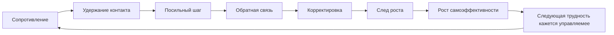

# Паспорт главы 19. Опыт преодоления

## Задача главы

Показать, как у человека формируется способность делать трудное: не через героизм, давление или красивые лозунги, а через повторяющиеся эпизоды управляемой трудности, действия, обратной связи, корректировки и видимого роста.

Глава завершает этап 5 "Обучение и преодоление" и переводит читателя от механики понимания, восстановления и прокрастинации к вопросу:

```text
как система учится не уходить от трудного входа,
а оставаться рядом с ним достаточно долго,
чтобы получить новый опыт управляемости
```

## Читательский вход

К этому месту читатель уже знает:

- что человек теряет состояние мысли и нуждается во внешнем контуре;
- что мотивация не равна желанию;
- что действие зависит от ценности, угрозы, управляемости, цены усилия и состояния;
- что полезная трудность отличается от перегруза;
- что восстановление улучшает будущий вход;
- что прокрастинация часто закрепляется через краткое облегчение.

## Новые понятия

- опыт преодоления;
- минимальная единица преодоления;
- полезная трудность;
- разрушающая трудность;
- self-efficacy как рабочая самоэффективность;
- mastery experience;
- первый контакт с задачей;
- помощь без подмены действия;
- скорость возвращения;
- ИИ как тренажер преодоления.

## Главная мысль

Опыт преодоления - это не страдание и не победа любой ценой. Это повторяющаяся связка:

```text
сопротивление
-> удержание контакта
-> посильное действие
-> обратная связь
-> корректировка
-> след роста
```

Когда эта связка повторяется, будущая трудность начинает восприниматься не как чистая угроза, а как ситуация, в которой можно действовать.

## Обязательные различения

| Различение | Что удержать |
| --- | --- |
| Преодоление / страдание | Преодоление строит способность; страдание без способа и обратной связи может строить беспомощность. |
| Полезная трудность / перегруз | Полезная трудность сохраняет первый шаг и обратную связь; перегруз разрушает управляемость. |
| Терпение / обучение | Терпение удерживает контакт, но без действия и корректировки не учит. |
| Занятость / преодоление | Человек может много делать и не встречаться с настоящей трудностью. |
| Self-efficacy / самооценка | Self-efficacy конкретна: "я могу выполнить действия в этой ситуации"; самооценка шире и может быть хрупкой. |
| Поддержка / спасение | Поддержка возвращает действие человеку; спасение забирает действие до первой попытки. |
| ИИ как тренажер / ИИ как обход | Тренажер работает после собственного первого слоя; обход забирает первый слой мышления. |

## Обязательная визуальная опора

Главная схема:



Дополнительная таблица: три зоны трудности.

| Зона | Что происходит | Что делать |
| --- | --- | --- |
| Легко | Есть вход и удовольствие, но мало роста. | Использовать для разогрева, закрепления и восстановления уверенности. |
| Посильно трудно | Есть сопротивление, но есть первый шаг, сигнал и возможность корректировки. | Это рабочая зона преодоления. |
| Разрушительно | Нет рычага, много стыда, хаоса, угрозы или перегруза. | Снижать масштаб, добавлять опоры, восстанавливать состояние, менять условия. |

## Практический пример

Сложная глава, техническая статья, учебная задача или проект:

```text
слишком туманно -> выписать, что именно непонятно
страшно написать плохо -> сделать плохой первый черновик
неясен уровень -> получить обратную связь
способ не сработал -> изменить способ
появился сдвиг -> зафиксировать след роста
```

## Опорные источники

- [[../Источники/2026-05-24 Пакет источников для главы 19]];
- [[../../2026-05-15 Опыт преодоления - как выращивать способность делать трудное]];
- [[../Источники/2026-05-24 Пакет источников для главы 10]];
- [[../Источники/2026-05-24 Пакет источников для главы 16]];
- [[../Главы/18-Прокрастинация-как-конфликт-систем]].

## Популярные ошибки, которые глава должна предотвратить

- "Преодоление - это просто терпеть".
- "Если человеку трудно, значит он растет".
- "Если ребенок или взрослый просит помощь, нужно сразу дать готовое решение".
- "Если дать ИИ сделать первый черновик, человек все равно научится по результату".
- "Достаточно сказать себе, что способности развиваются".
- "Сильный человек не избегает и не срывается".
- "Любой дискомфорт нужно убрать, потому что он вреден".

## Границы главы

Глава не является педагогическим руководством, программой психотерапии или клиническим протоколом. Если трудность связана с депрессией, тяжелым выгоранием, травматическим опытом, хронической болезнью, неврологическим состоянием или сильным истощением, работа с преодолением должна идти вместе с восстановлением и профессиональной поддержкой.

Задача главы - дать учебную модель и инженерные принципы, а не универсальный рецепт для всех состояний.

## Статус

`ready-for-review`

Черновик главы создан: [[../Главы/19-Опыт-преодоления]].

Карта объяснения создана: [[../Карты объяснения/19-Опыт-преодоления]].

Источниковый пакет создан: [[../Источники/2026-05-24 Пакет источников для главы 19]].

Связки проверены: [[../Проверки/2026-05-24 Связка глав 18-19]] и [[../Проверки/2026-05-25 Связка глав 19-20]].

Ревизия блока: [[../Проверки/2026-05-25 Ревизия блока 16-19]].

Следующий шаг: при финальной редактуре удержать главу как мост к продуктивности без самоизноса: опыт преодоления не равен культу страдания.
