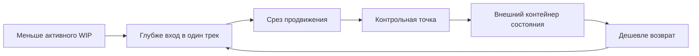
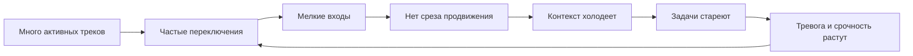
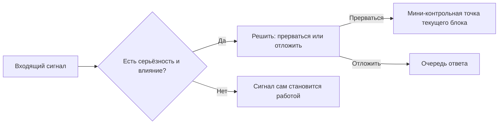

# Паспорт главы 21. Фокус, WIP и переключения

## Задача главы

Показать, почему устойчивую продуктивность невозможно построить только на намерении "лучше концентрироваться". Фокус зависит от того, сколько тяжелых контекстов человек пытается держать активными, как часто его переключают, насколько подготовлен выход из задачи и есть ли внешний контейнер состояния для возврата.

Глава должна перевести читателя от вывода главы 20:

```text
продуктивность сохраняет будущую доступность действия
```

к новому вопросу:

```text
как управлять активным WIP, переключениями и прерываниями,
чтобы не платить каждый раз полную цену повторного входа
```

## Читательский вход

К этому месту читатель уже знает:

- что сложная задача требует внешнего состояния;
- что рабочий журнал хранит цель, факты, туман, гипотезы, проверки и точку продолжения;
- что ритуалы входа и выхода делают журнал частью действия;
- что мотивация зависит от управляемости, цены усилия и состояния;
- что усталость и стресс повышают цену входа;
- что продуктивность не равна занятости, а должна оставлять ценный сдвиг и следующий вход.

## Новые понятия

- фокус как контакт с рабочим контекстом;
- WIP в задачах;
- WIP в голове;
- рабочая сфера;
- настройка задачи;
- switch cost;
- attention residue;
- resumption lag;
- глубокий блок;
- минимальная полезная единица глубокого внимания;
- срез продвижения;
- внешний контейнер состояния трека;
- запланированное переключение;
- прерывание;
- серьёзность срочности;
- канал срочности;
- личный WIP-лимит;
- командный WIP-лимит;
- старение активной задачи.

## Главная мысль

Фокус - это не способность держать в голове все важное одновременно. Фокус - это умение глубоко входить в один контекст, а остальные важные треки держать во внешнем состоянии, из которого можно вернуться без полного повторного разгона.

Центральная петля главы:

```text
меньше активного WIP
-> глубже вход в один трек
-> срез продвижения
-> контрольная точка на выходе
-> внешний контейнер состояния
-> дешевле возврат к отложенным трекам
```

Петля распыления:

```text
много активных треков
-> частые переключения
-> мелкие входы
-> нет среза продвижения
-> контекст холодеет
-> задачи стареют
-> тревога и срочность растут
-> еще больше переключений
```

## Обязательные различения

| Различение | Что удержать |
| --- | --- |
| WIP в задачах / WIP в голове | На доске может быть несколько активных задач; в глубоком внимании одновременно должен быть один тяжелый контекст. |
| "В работе" / реальный контакт | Статус не доказывает, что задача каждый день получает содержательный сдвиг. |
| Срез продвижения / завершение | Срез улучшает состояние задачи, даже если вся задача еще не закончена. |
| TODO / контейнер состояния | TODO говорит, что сделать; контейнер хранит цель, контекст, туман, решения, проверки и следующий вход. |
| Запланированное переключение / прерывание | Переключение после контрольной точки управляемо; прерывание рвет блок до нормального выхода. |
| Срочное / шумное | Срочное имеет влияние, срок и нужное действие; шумное просто требует внимания. |
| Личный фокус / командный поток | Личный фокус проектируется через блоки и контейнеры; командный - через WIP, договоренности и форматы прерываний. |
| Один глубокий трек / одна жизненная задача | В фокусе один трек сейчас; в жизни и портфеле может быть несколько важных треков с точками следующего контакта. |

## Обязательная визуальная опора

Главная схема:



Контрастная схема:



Схема прерывания:



## Практический пример

Рабочая неделя разработчика, лида или исследователя:

```text
есть несколько важных треков
-> на текущий глубокий блок выбран один
-> остальные имеют контейнер состояния и дату следующего контакта
-> вход начинается с цели и текущего состояния
-> блок работает над одним вопросом или гипотезой
-> на выходе остается контрольная точка
-> входящие срочные сигналы имеют серьёзность и понятное действие
```

Плохой вариант:

```text
несколько задач "в работе"
-> каждая немного тревожит
-> чаты проверяются как потенциально срочные
-> глубокий блок дробится
-> ни одна задача не получает среза
-> вечером кажется, что день был занят, но не двинулся
-> завтра вход снова дорогой
```

## Опорные источники

- [[../Источники/2026-05-25 Пакет источников для главы 21]];
- [[../../../tbank-spirit-code-my-internal/TEAMLEAD/03-Материалы-и-выжимки/Внимание-и-производительность-ChatGPT]];
- [[../../../tbank-spirit-code-my-internal/TEAMLEAD/02-Фокус-и-способы-работы/Распыление-фокуса-по-задачам-в-работе]];
- [[../../../productivity-framework/2024-12-17-1033 срочные и важные дела - как балансировать]];
- [[../../../productivity-framework/2022-05-17-1812 План выработки привычки 6h+ в фокусе ежедневно]];
- [[../../2026-05-23 Идеи для внешней статьи - Когнитивное инженерство разработчика - как входить в туманные задачи и не терять контекст]];
- [[../Главы/04-Контекст-задачи]];
- [[../Главы/05-Рабочий-журнал-как-внешний-контур-мышления]];
- [[../Главы/06-Ритуалы-входа-и-выхода]];
- [[../Главы/20-Продуктивность-без-самоизноса]].

## Популярные ошибки, которые глава должна предотвратить

- "Мне нужно просто научиться держать все важное в голове".
- "Если задача в работе, значит она реально двигается".
- "Пятнадцать минут на сложную тему - это уже глубокая работа".
- "Если задача не завершена, сдвига не было".
- "TODO-лист заменяет внешний контейнер состояния".
- "Любое переключение одинаково вредно".
- "Любой входящий вопрос надо проверить: вдруг срочно".
- "Срочность можно спрятать внутри длинного сообщения".
- "Командный фокус создается только личной дисциплиной".
- "WIP-лимит - это бюрократический запрет начинать новое".

## Границы главы

Глава не утверждает, что человек должен жить в одном проекте и отказываться от координации. В реальной работе есть поддержка, on-call, ревью, встречи, помощь другим людям и срочные события. Задача не в том, чтобы уничтожить переключения, а в том, чтобы отличать управляемые переключения от разрыва внимания и держать дорогие контексты во внешнем состоянии.

Глава также не является организационным регламентом. Она дает модель, из которой можно строить личные и командные договоренности: WIP-лимиты, контрольные точки, окна ответов, серьёзность срочности и разбор стареющих задач.

## Статус

`ready-for-review`

Черновик главы создан: [[../Главы/21-Фокус-WIP-и-переключения]].

Карта объяснения создана: [[../Карты объяснения/21-Фокус-WIP-и-переключения]].

Источниковый пакет создан: [[../Источники/2026-05-25 Пакет источников для главы 21]].

Связки проверены: [[../Проверки/2026-05-25 Связка глав 20-21]] и [[../Проверки/2026-05-25 Связка глав 21-22]].

Ревизия блока: [[../Проверки/2026-05-25 Ревизия блока 20-25]].

Следующий шаг: при финальной редактуре сохранить различие между необходимой координацией и разрывом контекста, чтобы глава не выглядела проповедью одиночного deep work.
