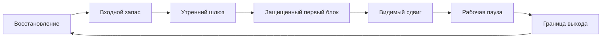
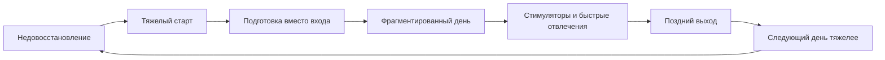

# Паспорт главы 22. Ресурсность, сила и ритуалы

## Задача главы

Собрать старый productivity-framework в современную рамку когнитивного инженерства. Показать, что ресурсность - это не настроение, вдохновение или "заряд батарейки", а рабочий режим, в котором вход в действие, удержание фокуса, обработка вскрывшихся промежуточных шагов и возврат после паузы имеют приемлемую цену.

Глава должна перевести читателя от вывода главы 21:

```text
фокус, WIP и контрольные точки нужно проектировать
```

к новому вопросу:

```text
в каком состоянии человек способен выполнять эти правила
без постоянного самопродавливания
```

## Читательский вход

К этому месту читатель уже знает:

- что сложная работа требует внешнего состояния задачи;
- что ритуалы входа и выхода защищают следующий вход;
- что мотивация зависит от ценности, угрозы, управляемости, цены усилия и состояния;
- что усталость и аллостатический долг повышают цену действия;
- что сон и восстановление поддерживают обучение и доступность следующего входа;
- что продуктивность должна оставлять ценный сдвиг и не разрушать будущую возможность продолжать;
- что активный WIP, переключения и прерывания делают повторный вход дорогим.

## Новые понятия

- ресурсность;
- ресурсное состояние;
- ресурсный режим;
- сила как входной запас;
- входная энергия;
- инициативность;
- утренний шлюз;
- ритуал состояния;
- ритуал задачи;
- рабочая пауза;
- граница работы и отдыха;
- привычка фокуса;
- сигнал запуска;
- стабильный контекст;
- дисциплина как повторяемое возвращение;
- ложная ресурсность;
- бесконечная подготовка;
- режимный долг.

## Главная мысль

Ресурсность - это режим, в котором следующий осмысленный шаг можно начать без чрезмерного внутреннего продавливания, удержать достаточно долго для сдвига и после паузы вернуться без полного повторного разгона.

Центральная петля главы:

```text
восстановление
-> входной запас
-> утренний шлюз
-> защищенный первый блок
-> видимый сдвиг
-> рабочая пауза
-> граница выхода
-> восстановление
```

Противоположная петля:

```text
недовосстановление
-> тяжелый старт
-> подготовка вместо входа
-> фрагментированный день
-> стимуляторы и быстрые отвлечения
-> поздний выход
-> следующий день тяжелее
```

## Обязательные различения

| Различение | Что удержать |
| --- | --- |
| Ресурсный пол / ресурсность | Пол - минимум доступности действия; ресурсность - устойчивый режим низкой цены входа и возврата. |
| Ресурсность / настроение | Настроение может быть хорошим, а режим плохим; ресурсность проверяется действием, фокусом и восстановлением. |
| Сила / мотивация | Сила - входной запас энергии и инициативы; мотивация шире и включает ценность, угрозу, управляемость и цену. |
| Сила / самопродавливание | Сила облегчает вход; самопродавливание покупает вход будущей ценой. |
| Ритуал состояния / ритуал задачи | Первый переводит человека в рабочий режим; второй восстанавливает состояние конкретной задачи. |
| Ритуал / подготовительная прокрастинация | Ритуал заканчивается входом в блок; подготовка бесконечно отодвигает действие. |
| Привычка / дисциплина | Привычка снижает цену запуска в стабильном контексте; дисциплина возвращает к режиму, когда контекст и состояние не идеальны. |
| Рабочая пауза / личный отдых | Рабочая пауза восстанавливает внутри режима; отдых выводит из работы и требует отдельной границы. |
| Тонус / стимуляция | Тонус поддерживает действие; стимуляция может дать краткий разгон и скрыть долг восстановления. |

## Обязательная визуальная опора

Главная схема:



Контрастная схема:



Таблица диагностики:

| Сигнал | Возможный слой | Первый вопрос |
| --- | --- | --- |
| Трудно начать понятный шаг | Сила / входной запас | Есть ли восстановление и утренний шлюз? |
| Непонятно, что делать | Контекст задачи | Есть ли цель, туман и первый шаг? |
| Все время тянет переключаться | WIP / среда | Сколько активных контекстов в голове? |
| Ритуал растет, а работа не начинается | Подготовительная прокрастинация | Где точка, после которой начинается первый блок? |
| После отдыха вход не возвращается | Глубже, чем ритуал | Не нужна ли смена нагрузки, условий или помощь? |

## Практический пример

Хороший режим:

```text
человек выспался достаточно для рабочего дня
-> утренний ритуал коротко собирает состояние
-> первый блок защищен от новостей и чатов
-> блок дает видимый сдвиг
-> пауза не уводит в личный контекст
-> вечером есть граница выхода
-> следующий день начинается без сильного долга
```

Плохой режим:

```text
недосып
-> тяжелый старт
-> новости, чаты, подготовительные действия
-> важный блок откладывается
-> кофе или возбуждение дают краткий разгон
-> день дробится
-> вечерний нажим срезает восстановление
-> завтра вход еще дороже
```

## Опорные источники

- [[../Источники/2026-05-25 Пакет источников для главы 22]];
- [[../../../productivity-framework/2022-04-06-0948 Обрести перманентное ресурсное состояние]];
- [[../../../productivity-framework/2022-04-29-1409 Обрести силу]];
- [[../../../productivity-framework/2022-05-03-0936 Утренние ритуалы для входа в ресурсное состояние]];
- [[../../../productivity-framework/2022-05-17-1812 План выработки привычки 6h+ в фокусе ежедневно]];
- [[../../../productivity-framework/2022-05-30-1948 варианты активности для выработки прививки дисциплины]];
- [[../../../productivity-framework/2022-02-10-1221 DoD по работе]];
- [[../../../productivity-framework/2022-03-16-1810 Что работало для увеличения продуктивности]];
- [[../Главы/20-Продуктивность-без-самоизноса]];
- [[../Главы/21-Фокус-WIP-и-переключения]].

## Популярные ошибки, которые глава должна предотвратить

- "Ресурсность - это хорошее настроение".
- "Сила - это моральное качество сильного человека".
- "Если есть ритуал, то можно не восстанавливаться".
- "Утренний ритуал должен быть одинаковым для всех".
- "Ритуал успешен, если все пункты отмечены".
- "Привычка формируется за фиксированное число дней".
- "Дисциплина - это заставлять себя большим объемом".
- "Рабочую паузу можно заполнить любым приятным делом".
- "Если кофе помог начать, значит ресурс восстановлен".
- "Если не получается держать режим, надо добавить еще один трекер".

## Границы главы

Глава не является медицинской рекомендацией по сну, питанию, тренировкам, БАДам, психотерапии или лечению хронической усталости. Она описывает инженерную модель рабочего режима.

Если человек не восстанавливается после сна и отдыха, постоянно живет в тревоге или провале, испытывает устойчивое отвращение к работе, теряет здоровье или не может вернуться в действие даже после снижения нагрузки, вопрос выходит за пределы ритуалов и продуктивности. Подробная рамка будет в главах 23-25 про поломку мотивационного контура, burnout/boreout и восстановление управляемости.

## Статус

`ready-for-review`

Черновик главы создан: [[../Главы/22-Ресурсность-сила-и-ритуалы]].

Карта объяснения создана: [[../Карты объяснения/22-Ресурсность-сила-и-ритуалы]].

Источниковый пакет создан: [[../Источники/2026-05-25 Пакет источников для главы 22]].

Связки проверены: [[../Проверки/2026-05-25 Связка глав 21-22]] и [[../Проверки/2026-05-25 Связка глав 22-23]].

Ревизия блока: [[../Проверки/2026-05-25 Ревизия блока 20-25]].

Следующий шаг: при финальной редактуре не дать ритуалам превратиться в магическое решение; ресурсность должна оставаться рабочей доступностью действия, связанной со сном, восстановлением, средой и нагрузкой.
