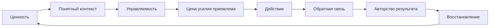
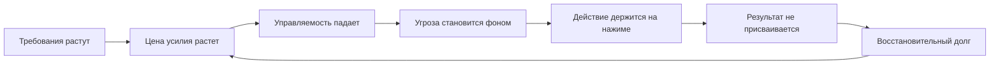

# Паспорт главы 23. Как ломается мотивационный контур

## Задача главы

Показать, как нормальный рабочий контур действия переходит в состояние системной поломки: ценность задачи еще может быть высокой, но запуск становится дорогим, управляемость падает, угроза растет, обратная связь перестает возвращать авторство результата, а восстановление уже не закрывает долг.

Глава должна перевести читателя от вывода главы 22:

```text
ресурсность делает правила фокуса исполнимыми
```

к новому вопросу:

```text
что происходит,
если ресурсность системно не возвращается
и обычные рабочие ритуалы уже не чинят вход
```

## Читательский вход

К этому месту читатель уже знает:

- что задача должна иметь внешний контекст;
- что мотивация не равна желанию и складывается из ценности, угрозы, управляемости, цены усилия и состояния;
- что усталость меняет готовность платить цену усилия;
- что стресс и аллостатическая нагрузка могут выводить систему из полезного окна;
- что продуктивность должна сохранять будущую доступность действия;
- что WIP, переключения и прерывания повышают цену входа;
- что ресурсность - это режим низкой цены входа, удержания и возврата, а не настроение.

## Новые понятия

- мотивационный контур;
- поломка мотивационного контура;
- предвыгорание;
- идеализм и чрезмерность;
- восстановительный долг;
- health-impairment process;
- motivational process;
- high demand / low resource;
- низкая decision latitude;
- effort-reward imbalance;
- потеря авторства результата;
- ментальная дистанция;
- цинизм как защитная экономия;
- редукция профессиональной эффективности;
- мотивационный нажим;
- точка, где "поднажать" становится вредным.

## Главная мысль

Мотивационный контур ломается не потому, что у человека "пропала мотивация". Он ломается, когда несколько связей перестают поддерживать друг друга:

```text
ценность не насыщает
управляемость падает
цена усилия растет
угроза становится фоном
обратная связь не возвращает авторство
восстановление не закрывает долг
```

В таком состоянии обычные продуктивностные приемы могут не помочь, потому что добавляют новый слой требований к системе, которая уже живет выше или ниже рабочего окна нагрузки.

## Обязательные различения

| Различение | Что удержать |
| --- | --- |
| Усталость / поломка контура | Усталость может быть временной; поломка контура - системное расхождение ценности, усилия, управляемости, обратной связи и восстановления. |
| Предвыгорание / здоровая вовлеченность | В предвыгорании человек может выглядеть продуктивным, но ресурс уже покупается долгом восстановления. |
| Высокая нагрузка / meaningful challenge | Нагрузка развивает, если есть управляемость, восстановление и обратная связь; без них она истощает. |
| Дистанция / равнодушие | Дистанция может быть защитным отступлением от среды, где контакт с работой слишком дорог. |
| Цинизм / плохой характер | Цинизм часто возникает как способ снизить боль от разрыва между усилием, смыслом и результатом. |
| Редукция достижений / объективная некомпетентность | Человек может делать полезное, но перестать видеть, присваивать и использовать результат. |
| Мотивационная помощь / мотивационный нажим | Помощь меняет параметры контура; нажим просто добавляет требование. |
| Burnout / любое истощение | Burnout в ICD-11 относится к профессиональному феномену хронического рабочего стресса. |

## Обязательная визуальная опора

Нормальный контур:



Контур поломки:



Диагностическая таблица:

| Сигнал | Где может быть разрыв | Первый инженерный вопрос |
| --- | --- | --- |
| После отдыха вход не дешевеет | восстановление -> цена усилия | Что мешает восстановлению закрыть долг? |
| Работа важна, но все больше отталкивает | ценность -> угроза | Какая угроза захватила ценность? |
| Любой шаг кажется бессмысленным | действие -> обратная связь | Где результат перестал быть видимым и присваиваемым? |
| Человек держится только на долге | ценность -> нажим | Что поддерживает действие кроме страха и обязательства? |
| Растет цинизм | контакт -> защитная дистанция | От чего дистанция защищает систему? |

## Практический пример

Сначала рабочий режим выглядит здоровым:

```text
важная задача
-> высокий интерес
-> много усилия
-> видимый сдвиг
-> признанный результат
-> восстановление
-> новая готовность работать
```

Потом контур начинает ломаться:

```text
важная задача
-> требования растут
-> восстановление не успевает
-> первый вход дороже
-> ошибок бояться легче
-> результат растворяется в следующем требовании
-> человек работает больше, но чувствует меньше авторства
-> завтра вход еще дороже
```

На этом этапе совет "надо сильнее мотивироваться" может ухудшить состояние, потому что он добавляет требование, не меняя цену усилия, управляемость, обратную связь и восстановление.

## Опорные источники

- [[../Источники/2026-05-25 Пакет источников для главы 23]];
- [[Психология, нейрофизиология/Выгорание/выгорание]];
- [[Психология, нейрофизиология/Выгорание/00-выгорание ч.1]];
- [[Психология, нейрофизиология/Выгорание/00-выгорание ч.2]];
- [[Психология, нейрофизиология/Выгорание/фазы стресса]];
- [[Психология, нейрофизиология/Выгорание/авторизация результата]];
- [[../Главы/20-Продуктивность-без-самоизноса]];
- [[../Главы/21-Фокус-WIP-и-переключения]];
- [[../Главы/22-Ресурсность-сила-и-ритуалы]].

## Популярные ошибки, которые глава должна предотвратить

- "Выгорание - это просто устал".
- "Если человек раньше мог, значит сейчас ему нужно только поднажать".
- "Цинизм - это плохой характер или неблагодарность".
- "Если работа важна, она должна мотивировать сама".
- "Восстановление - это награда после результата".
- "Чем выше ставка, тем сильнее мотивация".
- "Низкая продуктивность всегда лечится ритуалом, трекером или WIP-лимитом".
- "Burnout и boreout - одно и то же отсутствие мотивации".
- "Если результата нет в ощущениях, значит результата объективно не было".

## Границы главы

Глава не диагностирует burnout, депрессию, тревожные расстройства, хроническую усталость, неврологические или эндокринные состояния. Она описывает инженерную модель разрыва рабочего мотивационного контура.

Если у человека устойчиво нарушены сон, аппетит, настроение, способность к повседневным действиям, если есть постоянная тревога, отчаяние, депрессивная симптоматика или ощущение невозможности жить дальше, это выходит за пределы учебника и требует внешней профессиональной помощи.

Глава 23 объясняет механизм поломки. Глава 24 разведет burnout и boreout как разные перекосы нагрузки. Глава 25 даст осторожный практический слой восстановления управляемости без подмены медицины и психотерапии.

## Статус

`ready-for-review`

Черновик главы создан: [[../Главы/23-Как-ломается-мотивационный-контур]].

Карта объяснения создана: [[../Карты объяснения/23-Как-ломается-мотивационный-контур]].

Источниковый пакет создан: [[../Источники/2026-05-25 Пакет источников для главы 23]].

Связки проверены: [[../Проверки/2026-05-25 Связка глав 22-23]] и [[../Проверки/2026-05-25 Связка глав 23-24]].

Ревизия блока: [[../Проверки/2026-05-25 Ревизия блока 20-25]].

Следующий шаг: при финальной редактуре сохранить диагностическую аккуратность: глава должна объяснять разрыв контура, не подменяя клиническую оценку и не морализируя снижение мотивации.
