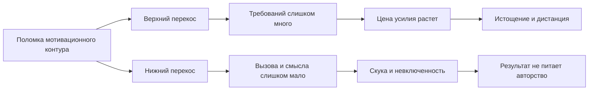

# Паспорт главы 24. Burnout и boreout

## Задача главы

Развести два разных маршрута поломки мотивационного контура: верхний перекос перегруза и нижний перекос недогруза.

Глава должна показать, что "нет мотивации" может означать разные состояния:

```text
слишком дорого действовать
```

или:

```text
действие не собирает смысл, вызов и авторство
```

## Читательский вход

К этому месту читатель уже знает:

- что мотивация складывается из ценности, угрозы, управляемости, цены усилия и состояния;
- что стресс полезен только внутри окна нагрузки;
- что продуктивность должна сохранять будущий вход;
- что ресурсность - это режим низкой цены входа и возврата;
- что мотивационный контур ломается через разрыв ценности, усилия, управляемости, обратной связи, авторства результата и восстановления.

## Новые понятия

- burnout;
- boreout;
- workplace boredom;
- job boredom;
- верхний перекос нагрузки;
- нижний перекос нагрузки;
- underload;
- low challenge;
- low meaning;
- low autonomy;
- слабая обратная связь;
- passive job;
- busy boredom;
- meaningless overload;
- challenge-skill fit;
- job characteristics;
- job crafting как осторожный мост к восстановлению включенности.

## Главная мысль

Burnout и boreout могут снаружи выглядеть похожими:

```text
человек не включается,
откладывает,
устает,
раздражается,
теряет интерес
```

Но механизмы разные.

Burnout чаще идет через верхний перекос:

```text
требований, угрозы и цены слишком много,
а управляемости, восстановления и ресурсов слишком мало
```

Boreout идет через нижний перекос:

```text
вызова, смысла, авторства, автономии и обратной связи слишком мало,
и действие перестает собирать рабочую включенность
```

Практическая ошибка - лечить оба маршрута одним инструментом.

## Обязательные различения

| Различение | Что удержать |
| --- | --- |
| Burnout / обычная усталость | Burnout связан с хроническим рабочим стрессом и не равен тяжелой неделе. |
| Boreout / отдых | Boreout - не восстановление, а неприятное состояние низкой включенности и недогруза. |
| Недогруз / безопасность | Снижение нагрузки полезно при перегрузе; хронический недогруз может разрушать смысл и включенность. |
| Вызов / давление | Вызов поддерживает рост при управляемости; давление истощает при низком контроле и плохом восстановлении. |
| Скука / лень | Скука может быть сигналом плохого соответствия задачи, навыка, смысла и автономии. |
| Низкая мотивация / разные маршруты | При burnout действие слишком дорого; при boreout действие слишком мало связано с ценностью. |
| Boreout / диагноз | В учебнике boreout - инженерная рамка хронической рабочей скуки, а не медицинский диагноз. |
| Чистые / смешанные случаи | В реальности бывают busy boredom, бессмысленный перегруз и чередование перегруза с недогрузом. |

## Обязательная визуальная опора

Матрица нагрузки:

| Зона | Требования | Ресурсы/смысл | Типичный сбой | Первый вопрос |
| --- | --- | --- | --- | --- |
| Полезный вызов | умеренно высокие | достаточно ресурсов, автономии и обратной связи | рост и вовлеченность | Как сохранить окно нагрузки? |
| Burnout route | слишком высокие | ресурсов и восстановления мало | истощение, дистанция, снижение эффективности | Что снизить и где вернуть контроль? |
| Boreout route | слишком низкие или пустые | смысла, вызова и авторства мало | скука, вялость, потеря включенности | Где вернуть вызов, вклад и рост? |
| Смешанная зона | много занятости | мало смысла и авторства | занятая скука, цинизм, распад качества | Что здесь нагрузка, а что пустое трение? |

Схема двух маршрутов:



## Практический пример

Один человек работает в режиме постоянных срочностей:

```text
много задач
мало контроля
нет восстановления
ошибки опасны
результат сразу поглощается новым требованием
```

Это верхний перекос.

Другой человек занят формально, но работа не дает вызова:

```text
задачи простые или пустые
вклад не виден
автономии мало
обратной связи почти нет
роста нет
энергия не собирается в действие
```

Это нижний перекос.

Оба могут сказать:

```text
у меня нет сил и мотивации
```

Но первый вопрос к ним будет разным.

## Опорные источники

- [[../Источники/2026-05-25 Пакет источников для главы 24]];
- [[Психология, нейрофизиология/Выгорание/выгорание стресса]];
- [[Психология, нейрофизиология/Выгорание/выгорание скуки]];
- [[Психология, нейрофизиология/Выгорание/Закон Йеркса - Додсона]];
- [[Психология, нейрофизиология/Выгорание/эустресс]];
- [[Психология, нейрофизиология/Выгорание/дистресс]];
- [[../Главы/23-Как-ломается-мотивационный-контур]].

## Популярные ошибки, которые глава должна предотвратить

- "Burnout и boreout - это одно и то же отсутствие мотивации".
- "Если человек устал, ему всегда нужен только отдых".
- "Если человеку скучно, значит ему просто легко".
- "Если работы мало, значит ресурс должен восстановиться сам".
- "Если человек перегружен, ему нужен более вдохновляющий вызов".
- "Если человек в boreout, нужно просто добавить задач".
- "Чем выше мотивация и давление, тем выше продуктивность".
- "Boreout - такой же официальный термин, как burnout".
- "Скука на работе безвредна".

## Границы главы

Глава не ставит диагноз burnout, boreout, депрессии, тревожного расстройства, хронической усталости или другого состояния. Она описывает два инженерных маршрута поломки рабочего мотивационного контура.

Burnout имеет более сильную институциональную и исследовательскую рамку. Boreout в этой главе используется осторожно: как название нижнего перекоса нагрузки, близкого к workplace boredom, low challenge и low meaning.

Глава 25 должна перевести это различение в практический вопрос восстановления управляемости: что сначала менять - нагрузку, контроль, смысл, обратную связь, восстановление, автономию или размер первого шага.

## Статус

`ready-for-review`

Черновик главы создан: [[../Главы/24-Burnout-и-boreout]].

Карта объяснения создана: [[../Карты объяснения/24-Burnout-и-boreout]].

Источниковый пакет создан: [[../Источники/2026-05-25 Пакет источников для главы 24]].

Связки проверены: [[../Проверки/2026-05-25 Связка глав 23-24]] и [[../Проверки/2026-05-25 Связка глав 24-25]].

Ревизия блока: [[../Проверки/2026-05-25 Ревизия блока 20-25]].

Следующий шаг: при финальной редактуре удержать асимметрию доказательности: burnout описывать через признанную occupational-рамку, boreout - осторожно, как инженерный язык нижнего перекоса нагрузки.
