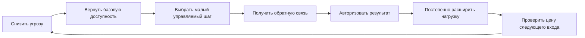

# Паспорт главы 25. Восстановление как возвращение управляемости

## Задача главы

Показать восстановление не как универсальный отдых и не как новый мотивационный рывок, а как возвращение управляемости действия.

Глава должна ответить на вопрос, оставленный главой 24:

```text
что возвращать первым:
безопасность,
восстановление,
контроль,
смысл,
обратную связь,
авторство результата
или размер первого шага
```

## Читательский вход

К этому месту читатель уже знает:

- что мотивация складывается из ценности, угрозы, управляемости, цены усилия и состояния;
- что продуктивность без восстановления превращается в самоизнос;
- что мотивационный контур ломается через разрыв ценности, усилия, управляемости, обратной связи, авторства результата и восстановления;
- что маршрут перегруза и маршрут недогруза требуют разных вмешательств;
- что трудность полезна только тогда, когда она остается частично управляемой.

## Новые понятия

- восстановление управляемости;
- психологическое отсоединение от работы;
- рабочее восстановление;
- безопасный первый шаг;
- возвращение доступности действия;
- авторизация результата;
- восстановительная петля;
- повторный вход после перегруза;
- восстановление после недогруза;
- границы личного протокола восстановления.

## Главная мысль

Восстановление в когнитивном инженерстве - это не просто пауза.

Это возвращение условий, в которых действие снова может начаться, дать сигнал, быть скорректированным и завершиться присвоенным результатом.

Короткая формула:

```text
сначала безопасность,
потом малый управляемый шаг,
потом обратная связь,
потом авторизация результата,
потом постепенное расширение нагрузки
```

## Обязательные различения

| Различение | Что удержать |
| --- | --- |
| Отдых / восстановление | Отдых снижает нагрузку; восстановление возвращает доступность действия и будущего входа. |
| Восстановление / новый рывок | Восстановление не должно незаметно превращаться в возвращение прежнего перегруза. |
| Перегруз / недогруз | Перегруз требует снижения цены и угрозы; недогруз требует возвращения смысла, вызова и обратной связи. |
| Малый шаг / мелкая занятость | Малый шаг должен давать сигнал и сдвиг, а не просто заполнять время. |
| Авторизация результата / самопохвала | Авторизация фиксирует реальный вклад; это не мотивационная риторика. |
| Control / иллюзия контроля | Управляемость должна опираться на реальный рычаг действия. |
| Личный протокол / внешняя помощь | При тяжелом истощении, депрессии, тревоге или токсичной среде личный протокол не заменяет поддержку и изменение условий. |

## Обязательная визуальная опора

Схема восстановления управляемости:



Диагностическая развилка:

| Если просадка похожа на | Первый ход | Нельзя начинать с |
| --- | --- | --- |
| Перегруз | Снизить давление, ограничить WIP, вернуть безопасность и восстановление. | Нового вызова и мотивационного нажима. |
| Недогруз | Вернуть осмысленный вызов, автономию, вклад и обратную связь. | Одного отдыха или пустого добавления задач. |
| Смешанная зона | Убрать пустую занятость и вернуть управляемый сдвиг. | Подсчета часов как главного критерия. |
| Позднее истощение | Остановить дальнейший износ и искать поддержку. | Самостоятельного героического протокола. |

## Практический пример

После перегруза человек пытается "восстановиться" тем, что берет выходной, а потом возвращается к тем же WIP, срочности и отсутствию контроля. Сил становится чуть больше, но следующий вход снова дорогой.

В терминах главы это был отдых без восстановления управляемости.

Другой человек после хронического недогруза уходит в пассивный отдых, но возвращается в такую же пустую задачу: мало смысла, автономии и обратной связи. Отдых не решает проблему, потому что источник просадки - не только усталость, а отсутствие осмысленного контакта с действием.

## Опорные источники

- [[../Источники/2026-05-25 Пакет источников для главы 25]];
- [[../Главы/24-Burnout-и-boreout]];
- [[../Главы/23-Как-ломается-мотивационный-контур]];
- [[../Главы/20-Продуктивность-без-самоизноса]];
- [[../Главы/10-Управляемость-действия]];
- [[Психология, нейрофизиология/Выгорание/00-выгорание ч.2]];
- [[Психология, нейрофизиология/Выгорание/авторизация результата]];
- [[Психология, нейрофизиология/Мотивация/00 Мотивация]].

## Популярные ошибки, которые глава должна предотвратить

- "Восстановление - это просто отдых".
- "Если стало чуть легче, можно сразу вернуть прежнюю нагрузку".
- "Малый шаг нужен, чтобы быстрее снова разогнаться до старого темпа".
- "При скуке нужно только отдохнуть".
- "При перегрузе поможет вдохновляющий челлендж".
- "Если человек не восстановился, он плохо старался восстанавливаться".
- "Авторизация результата - это самопохвала".
- "Управляемость можно вернуть внутренней установкой, даже если реальные рычаги отсутствуют".

## Границы главы

Глава не является медицинским, психотерапевтическим или организационно-правовым протоколом. Она описывает инженерную рамку: как возвращать доступность действия и обратную связь там, где это возможно.

Если просадка связана с тяжелым истощением, депрессией, тревожным состоянием, соматическими причинами, насилием, токсичной средой или отсутствием реальных полномочий, личный когнитивный контур не должен подменять внешнюю помощь и изменение условий.

Глава 26 после этого переведет вопрос управляемости в работу с ИИ: когда ИИ помогает восстановить действие, а когда становится обходом мышления.

## Статус

`ready-for-review`

Черновик главы создан: [[../Главы/25-Восстановление-как-возвращение-управляемости]].

Карта объяснения создана: [[../Карты объяснения/25-Восстановление-как-возвращение-управляемости]].

Источниковый пакет создан: [[../Источники/2026-05-25 Пакет источников для главы 25]].

Связки проверены: [[../Проверки/2026-05-25 Связка глав 24-25]] и [[../Проверки/2026-05-25 Связка глав 25-26]].

Ревизия блока: [[../Проверки/2026-05-25 Ревизия блока 20-25]].

Следующий шаг: при финальной редактуре проверить, что восстановление описано как возвращение реальных рычагов действия, а не как еще один productivity-протокол.
