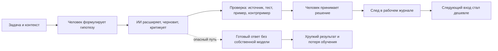

# Паспорт главы 26. ИИ как усилитель и как обход мышления

## Задача главы

Показать ИИ как новый тип внешнего когнитивного контура: он может снижать цену входа в задачу, помогать увидеть варианты, собрать черновик, найти ошибку и получить обратную связь; но он же может стать способом обойти собственное мышление, не собрать контекст, не проверить вывод и не получить опыт действия.

Глава должна перевести читателя из части про восстановление управляемости в часть про инструменты и лидерство.

Главный вопрос:

```text
ИИ помогает человеку действовать и понимать
или производит результат вместо его понимания?
```

## Читательский вход

К этому месту читатель уже знает:

- что сложная работа требует сохранения контекста задачи;
- что рабочий журнал является внешним контуром мышления;
- что мотивация зависит от ценности, угрозы, управляемости, цены усилия и состояния;
- что опыт преодоления строится через посильную трудность, обратную связь и присвоенный результат;
- что восстановление управляемости требует безопасного малого шага, сигнала и авторизации результата;
- что продуктивность без проверки границ легко превращается в самоизнос или обход реального действия.

## Новые понятия

- ИИ как внешний когнитивный контур;
- генеративный когнитивный артефакт;
- cognitive offloading через ИИ;
- calibrated reliance;
- automation bias;
- misplaced trust;
- jagged frontier;
- обход мышления;
- усиление мышления;
- сохранение субъектности;
- проверочный контур;
- skill maintenance при работе с ИИ.

## Главная мысль

ИИ не является ни самостоятельным субъектом мышления, ни обычной справочной системой.

В когнитивном инженерстве он рассматривается как внешний инструмент, который может взять на себя часть поиска, формулирования, генерации и проверки. Но качество такой работы зависит от того, остается ли у человека собственная петля:

```text
контекст
-> гипотеза
-> запрос
-> ответ ИИ
-> проверка
-> решение
-> след в рабочем журнале
```

Если эта петля сохраняется, ИИ усиливает мышление.

Если она исчезает, ИИ становится обходом мышления.

## Обязательные различения

| Различение | Что удержать |
| --- | --- |
| Усиление / обход | Усиление сохраняет человеческую постановку задачи, проверку и авторство; обход заменяет их готовым ответом. |
| Offloading / deskilling | Вынос части работы наружу полезен, если сохраняется понимание, проверка и тренировка ключевых навыков. |
| Быстрее / лучше | Ускорение не равно улучшению результата, особенно за пределами понятной границы применимости. |
| Доверие / уместная зависимость | Нужна не вера и не подозрительность, а calibrated reliance: где, насколько и почему можно опереться на ответ. |
| Черновик / решение | Черновик ИИ - материал для мышления; решение возникает после проверки и авторизации человеком. |
| Объяснение / иллюзия понимания | Связный ответ может создавать знакомость без recall, проверки и переноса. |
| Полезное трение / лишнее трение | Не вся трудность нужна, но нельзя убирать трудность, которая строит понимание и самостоятельность. |
| Помощник / субъект | ИИ может помогать, но не должен незаметно становиться носителем цели, критерия и ответственности. |

## Обязательная визуальная опора

Главная схема главы:



Диагностическая таблица:

| Признак | ИИ как усилитель | ИИ как обход |
| --- | --- | --- |
| Перед запросом | Есть цель, контекст, неизвестное место и критерий проверки. | Есть только туманное "сделай за меня" или "что мне думать". |
| Во время ответа | Человек просит варианты, основания, риски, контрпримеры. | Человек ждет гладкий финальный текст или код. |
| После ответа | Есть проверка, тест, сравнение с источником, ручное объяснение. | Ответ сразу переносится в работу. |
| След в памяти | Фиксируется, что принято и почему. | Непонятно, откуда взялось решение. |
| Эффект на навык | Человек видит больше и учится лучше проверять. | Человек получает результат, но хуже строит следующий шаг сам. |

## Практический пример

Разработчик входит в туманную задачу.

Режим обхода:

```text
вот ошибка, почини
```

ИИ выдает патч. Патч может сработать, но разработчик не восстановил модель системы: что было причиной, какие ограничения есть, как проверить соседние эффекты, почему выбран именно этот путь.

Режим усиления:

```text
вот симптом, текущие факты, что я уже проверил,
вот два возможных объяснения,
помоги найти недостающие проверки,
предложи минимальный эксперимент
и укажи, где я могу ошибаться
```

В этом случае ИИ снижает цену входа, но не забирает у человека задачу. Он помогает построить следующую проверку.

## Опорные источники

- [[../Источники/2026-05-25 Пакет источников для главы 26]];
- [[../Главы/25-Восстановление-как-возвращение-управляемости]];
- [[../Главы/21-Фокус-WIP-и-переключения]];
- [[../Главы/19-Опыт-преодоления]];
- [[../Главы/16-Как-строится-понимание]];
- [[../Главы/12-Уровни-объяснения]];
- [[../Главы/05-Рабочий-журнал-как-внешний-контур-мышления]];
- [[../../2026-05-23 Идеи для внешней статьи - Когнитивное инженерство разработчика - как входить в туманные задачи и не терять контекст]].

## Популярные ошибки, которые глава должна предотвратить

- "ИИ просто ускоряет работу".
- "ИИ обязательно портит мышление".
- "Если ответ хороший на вид, значит он хороший по делу".
- "Проверка нужна только для фактов, а не для рассуждения".
- "Если ИИ написал код, разработчик сэкономил все когнитивные усилия".
- "Пусть ИИ делает сложное, а человек только принимает".
- "Главное - хороший промпт".
- "Чтобы учиться, нужно полностью отказаться от ИИ".
- "Если человек использует ИИ, результат уже не его".

## Границы главы

Глава не является обзором всех AI tools, справочником по промптам или прогнозом рынка труда.

Она задает когнитивную рамку:

```text
какая часть мышления вынесена в ИИ,
какая часть осталась у человека,
как проходит проверка,
что происходит с навыком,
кто авторизует результат
```

Эмпирическая база по ИИ быстро меняется. Поэтому глава должна явно помечать AI productivity studies как обновляемую область и не строить вечных выводов на одной версии инструментов.

Глава 27 после этого должна дать отдельный практический режим: как работать с ИИ, не отдавая ему субъектность.

## Статус

`ready-for-review`

Черновик главы создан: [[../Главы/26-ИИ-как-усилитель-и-как-обход-мышления]].

Карта объяснения создана: [[../Карты объяснения/26-ИИ-как-усилитель-и-как-обход-мышления]].

Источниковый пакет создан: [[../Источники/2026-05-25 Пакет источников для главы 26]].

Связки проверены: [[../Проверки/2026-05-25 Связка глав 25-26]] и [[../Проверки/2026-05-25 Связка глав 26-27]].

Ревизия блока: [[../Проверки/2026-05-25 Ревизия блока 26-30]].

Следующий шаг: при финальной редактуре обновить быстро меняющийся evidence-блок по AI productivity и сохранить рамку "усилитель / обход" вместо списка инструментов.
