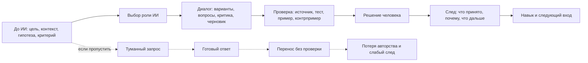

# Паспорт главы 27. Как работать с ИИ, не отдавая ему субъектность

## Задача главы

Превратить различение главы 26 в практический режим работы.

Глава должна ответить на вопрос:

```text
как использовать ИИ так,
чтобы он помогал думать, проверять и действовать,
но не забирал у человека цель,
критерий качества,
проверку,
решение
и опыт роста
```

Это не глава о "лучших промптах". Промпт здесь вторичен. Главный объект проектирования - не формулировка запроса, а человеческая петля действия вокруг ИИ.

## Читательский вход

К этому месту читатель уже знает:

- что сложная работа требует внешнего контура мышления;
- что рабочий журнал снижает цену повторного входа;
- что понимание строится через recall, self-explanation, проверку и перенос;
- что опыт преодоления растет через посильное действие, обратную связь и присвоенный результат;
- что ИИ может быть усилителем или обходом мышления;
- что гладкий ответ не равен проверенному выводу;
- что AI productivity effects неоднородны и зависят от задачи, опыта и проверки.

## Новые понятия

- субъектность как рабочая функция;
- человеческая петля вокруг ИИ;
- роль ИИ в задаче;
- минимальный pre-AI trace;
- post-AI verification;
- след решения после ИИ;
- режим ИИ как справочника;
- режим ИИ как оппонента;
- режим ИИ как тренажера;
- режим ИИ как чернового соавтора;
- режим ИИ как проверочного напарника;
- запрет на преждевременную передачу полезной трудности.

## Главная мысль

Субъектность в работе с ИИ - это не пафосное "думать самому" и не отказ от инструмента.

Это удержание пяти функций:

```text
я задаю цель
я понимаю контекст
я выбираю критерий качества
я проверяю результат
я авторизую решение
```

ИИ может помогать почти на каждом шаге. Но если все пять функций незаметно переехали в инструмент, человек получает результат без собственного контура действия.

## Обязательные различения

| Различение | Что удержать |
| --- | --- |
| Субъектность / самостоятельность без инструментов | Субъектность не требует все делать без ИИ; она требует удерживать цель, проверку и решение. |
| Помощь / подмена | Помощь усиливает человеческую петлю; подмена производит результат вместо нее. |
| Лишнее трение / полезное трение | Лишнее трение можно снимать; полезное трение, которое строит навык, нельзя отдавать слишком рано. |
| Запрос / задача | Хороший запрос не спасает плохо понятую задачу. Сначала нужно собрать контекст и критерий. |
| Черновик / решение | Черновик ИИ становится решением только после проверки и авторизации человеком. |
| Критика ИИ / проверка | Критика ИИ тоже является output инструмента и требует человеческого отбора. |
| Быстрая справка / обучение | В справочном режиме можно быстрее получить ответ; в учебном режиме часто нужны вопросы и подсказки вместо готового решения. |
| Автоматизация / ответственность | Автоматизация может ускорить действие, но не переносит ответственность за результат на инструмент. |

## Обязательная визуальная опора

Главная схема главы:



Практическая таблица ролей ИИ:

| Роль ИИ | Когда уместна | Главный риск | Проверочный вопрос |
| --- | --- | --- | --- |
| Справочник | Низкая цена ошибки, знакомая область, нужен формат или термин. | Принять устаревший или неточный ответ. | Где источник или локальная проверка? |
| Черновой соавтор | Нужен первый текст, список вариантов, boilerplate. | Принять гладкость за качество. | Что я переписал и почему? |
| Оппонент | Нужна критика плана, архитектуры, аргумента. | Принять слабую критику как сильную. | Какие возражения действительно проходят проверку? |
| Тренажер | Цель - обучение и рост навыка. | Получить готовый ответ вместо mastery experience. | Я сделал recall, попытку или объяснение сам? |
| Проверочный напарник | Нужны тесты, edge cases, скрытые допущения. | Проверять только то, что предложил ИИ. | Какие проверки я добавил независимо? |

## Практический пример

Разработчик входит в сложный bugfix.

Слабый режим:

```text
вот ошибка, почини
```

ИИ выдает патч. Разработчик переносит его, потому что код выглядит разумно. Даже если патч сработал, человек мог не понять причину, границы изменения, соседние эффекты и тест, который доказывает исправление.

Сильный режим:

```text
контекст:
симптом, окружение, свежие изменения

моя гипотеза:
ошибка может быть в X или Y

что проверено:
A не подтвердилось, B частично подтверждается

нужна роль:
не пиши патч сразу,
помоги найти недостающую проверку,
предложи минимальный тест,
назови скрытые допущения
```

ИИ помогает не обойти задачу, а лучше войти в нее.

## Опорные источники

- [[../Источники/2026-05-25 Пакет источников для главы 27]];
- [[../Источники/2026-05-25 Пакет источников для главы 26]];
- [[../Главы/26-ИИ-как-усилитель-и-как-обход-мышления]];
- [[../Главы/19-Опыт-преодоления]];
- [[../Главы/16-Как-строится-понимание]];
- [[../Главы/05-Рабочий-журнал-как-внешний-контур-мышления]];
- [[../Главы/21-Фокус-WIP-и-переключения]];
- [[../Главы/25-Восстановление-как-возвращение-управляемости]];
- [[../../2026-05-23 Идеи для внешней статьи - Когнитивное инженерство разработчика - как входить в туманные задачи и не терять контекст]];
- [[../../2026-05-15 Опыт преодоления - как выращивать способность делать трудное]].

## Популярные ошибки, которые глава должна предотвратить

- "Главное - написать хороший промпт".
- "Если я пользуюсь ИИ, значит думаю не сам".
- "Если ИИ дал хороший текст, значит я понял тему".
- "Если ИИ нашел ошибку, проверка завершена".
- "ИИ можно отдавать первое понимание задачи, потому что так быстрее".
- "Для обучения полезно сразу получить идеальное объяснение".
- "ИИ как оппонент всегда усиливает мысль".
- "Если человек отвечает за результат, можно не фиксировать след".
- "Субъектность - это внутреннее ощущение, а не проверяемый порядок работы".

## Границы главы

Глава не является руководством по промпт-инженерингу и не перечисляет конкретные инструменты.

Она задает практический режим:

```text
что человек должен сделать до ИИ,
какую роль дать ИИ,
как проверить ответ,
как принять решение,
как сохранить след,
как не потерять навык
```

Глава 28 после этого переносит ту же логику на лидерство: руководитель тоже проектирует не мотивационные лозунги, а среду действия, где люди сохраняют ясность, автономию, обратную связь и управляемость.

## Статус

`ready-for-review`

Черновик главы создан: [[../Главы/27-Как-работать-с-ИИ-не-отдавая-ему-субъектность]].

Карта объяснения создана: [[../Карты объяснения/27-Как-работать-с-ИИ-не-отдавая-ему-субъектность]].

Источниковый пакет создан: [[../Источники/2026-05-25 Пакет источников для главы 27]].

Связки проверены: [[../Проверки/2026-05-25 Связка глав 26-27]] и [[../Проверки/2026-05-25 Связка глав 27-28]].

Ревизия блока: [[../Проверки/2026-05-25 Ревизия блока 26-30]].

Следующий шаг: при финальной редактуре проверить, что практические режимы работы с ИИ не превратились в промпт-лист и достаточно различают учебные, производственные и высокорисковые задачи.
