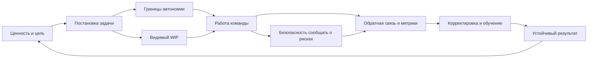

# Паспорт главы 28. Лидерство как дизайн среды действия

## Задача главы

Перенести когнитивное инженерство с индивидуального контура на командный уровень.

Глава должна показать, что лидерство - это не только влияние, контроль, харизма или мотивационные разговоры. В инженерной рамке лидерство - это проектирование среды действия, где команда может:

- понимать цель;
- видеть контекст;
- иметь границы автономии;
- держать WIP;
- получать обратную связь;
- безопасно сообщать о проблемах;
- превращать усилие в результат и обучение.

## Читательский вход

К этому месту читатель уже знает:

- как человек теряет контекст задачи;
- зачем нужен внешний контур мышления;
- что мотивация зависит от ценности, угрозы, управляемости, цены усилия и обратной связи;
- что продуктивность ломается через WIP, переключения, самоизнос и потерю восстановления;
- что выгорание и boreout связаны с перегрузом, недогрузом, требованиями, ресурсами и авторством результата;
- что ИИ показывает общий принцип: инструмент полезен, если сохраняет субъектность и проверку.

## Новые понятия

- среда действия команды;
- лидерство как дизайн условий;
- задача как мотивационный интерфейс;
- командный внешний контур;
- каденции как петли обратной связи;
- автономия в границах;
- безопасное сообщение о проблеме;
- командная управляемость;
- лидер как держатель контекста, а не хозяин мышления;
- метрики как приборная панель, а не дубинка контроля.

## Главная мысль

Лидерство в когнитивном инженерстве - это работа с условиями, в которых другие люди действуют.

Лидер не может напрямую "включить мотивацию" у человека. Но он может сильно менять параметры среды:

```text
ясность
автономия
ресурсы
WIP
обратная связь
безопасность ошибки
ритм
авторство результата
```

Эти параметры меняют цену входа, управляемость, угрозу, фокус и устойчивость команды.

## Обязательные различения

| Различение | Что удержать |
| --- | --- |
| Лидерство / харизма | Лидерство здесь - дизайн среды действия, а не личное сияние. |
| Ясность / микроменеджмент | Ясность дает цель, границы и критерий; микроменеджмент забирает способ действия. |
| Автономия / брошенность | Автономия требует рамки, ресурсов, обратной связи и права задавать вопросы. |
| Безопасность / мягкость без требований | Безопасность нужна, чтобы говорить правду о рисках; она не отменяет качество и ответственность. |
| Обратная связь / оценка личности | Обратная связь должна помогать корректировать действие, а не прибивать идентичность. |
| Метрики / контроль ради контроля | Метрики нужны для решений о системе, а не только для давления на людей. |
| Мотивация / манипуляция | Лидер не "продает любую задачу", а строит честную связь ценности, автономии, сложности и поддержки. |
| Командный ритуал / собрание | Ритуал ценен, если возвращает команде состояние работы и следующий шаг. |

## Обязательная визуальная опора

Главная схема главы:



Диагностическая таблица:

| Симптом | Возможный разрыв среды | Первый инженерный вопрос |
| --- | --- | --- |
| Команда делает много, но не туда. | Нет ясности цели и критерия ценности. | Что считается результатом и почему это важно? |
| Люди ждут указаний. | Автономия не задана или наказуема. | Где границы самостоятельного решения? |
| Все заняты, но поток стоит. | WIP скрыт, много переключений и блокеров. | Что сейчас в работе и что нужно остановить? |
| Ошибки всплывают поздно. | Небезопасно говорить о рисках рано. | Что будет с человеком, который принес плохую новость? |
| Мотивация падает. | Нет связи задачи с ценностью, ростом, принадлежностью или авторством. | Как задача связана с мотивами и развитием человека? |
| Команда устает быстрее, чем учится. | Слишком высокая цена усилия и слабое восстановление. | Какие требования нужно снизить, а какие ресурсы добавить? |

## Практический пример

Команда получает большую задачу с формулировкой:

```text
срочно сделать интеграцию
```

Если лидер просто передает давление дальше, команда получает туман, высокий WIP, страх ошибки и слабую управляемость.

Инженерный режим лидерства другой:

```text
какую ценность дает интеграция
какой минимальный результат нужен первым
что точно не входит в объем
какие решения команда принимает сама
где нужна контрольная точка
какие риски нужно поднять сразу
какая метрика покажет продвижение
```

Задача не стала легкой. Но она стала управляемее.

## Опорные источники

- [[../Источники/2026-05-25 Пакет источников для главы 28]];
- [[../Главы/27-Как-работать-с-ИИ-не-отдавая-ему-субъектность]];
- [[../Главы/21-Фокус-WIP-и-переключения]];
- [[../Главы/23-Как-ломается-мотивационный-контур]];
- [[../Главы/24-Burnout-и-boreout]];
- [[../Главы/25-Восстановление-как-возвращение-управляемости]];
- [[../Главы/10-Управляемость-действия]];
- [[../Главы/08-Четыре-области-мотивации]];
- `Прооекты/tbank-spirit-code/матрица компетенций/TL Matrix - критерии/TL Matrix - Мотивация.md`;
- `Прооекты/tbank-spirit-code/матрица компетенций/Критерии матрицы компетенции TL (сводка при переходе из SDE).md`;
- `Прооекты/tbank-spirit-code-my-internal/Курс IT M-Start`.

## Популярные ошибки, которые глава должна предотвратить

- "Лидерство - это вдохновлять людей".
- "Хороший лидер всегда знает, что делать".
- "Автономия означает не вмешиваться".
- "Ясная постановка задачи - это микроменеджмент".
- "Метрики нужны, чтобы давить на скорость".
- "Психологическая безопасность - это не требовать результата".
- "Если человек демотивирован, надо лучше продать ему задачу".
- "Командные встречи полезны сами по себе".
- "Выгорание - личная проблема сотрудника".

## Границы главы

Глава не является HR-руководством, курсом менеджмента, инструкцией по оценке результативности или описанием внутренних процессов конкретной компании.

Она дает когнитивно-инженерную рамку лидерства:

```text
какую среду действия создает лидер
как эта среда меняет ясность, автономию, WIP, обратную связь и управляемость
где лидер помогает команде думать и действовать
а где забирает мышление или создает лишнюю угрозу
```

Глава 29 после этого отдельно разберет мотивацию сотрудников: как видеть разные мотивы, не манипулировать ими и не лечить системные проблемы мотивационным нажимом.

## Статус

`ready-for-review`

Черновик главы создан: [[../Главы/28-Лидерство-как-дизайн-среды-действия]].

Карта объяснения создана: [[../Карты объяснения/28-Лидерство-как-дизайн-среды-действия]].

Источниковый пакет создан: [[../Источники/2026-05-25 Пакет источников для главы 28]].

Связки проверены: [[../Проверки/2026-05-25 Связка глав 27-28]] и [[../Проверки/2026-05-25 Связка глав 28-29]].

Ревизия блока: [[../Проверки/2026-05-25 Ревизия блока 26-30]].

Следующий шаг: при финальной редактуре удержать leadership-материал санитаризированным и не расширять главу в общий курс менеджмента, HR или внутренние процессы.
