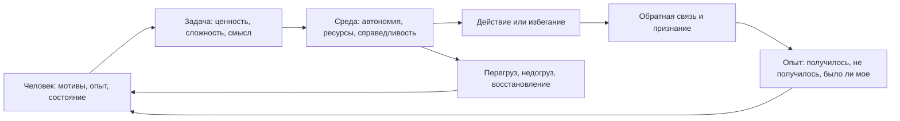

# Паспорт главы 29. Мотивация сотрудников

## Задача главы

Дать практическую модель мотивации сотрудников без манипулятивного языка.

Глава должна показать, что мотивация сотрудника - это не свойство человека "в целом" и не кнопка, на которую лидер нажимает. Это состояние на пересечении:

- личных мотивов;
- задачи;
- уровня автономии;
- ощущения компетентности;
- принадлежности;
- управляемости;
- цены усилия;
- обратной связи;
- справедливости и гигиенических условий;
- восстановления и текущего состояния системы.

## Читательский вход

К этому месту читатель уже знает:

- мотивация не равна желанию;
- есть разные области мотивации: достижение, принадлежность, влияние и безопасность;
- приближение и избегание могут включаться в любой области;
- управляемость и self-efficacy влияют на готовность действовать;
- цена усилия и усталость меняют доступность действия;
- burnout и boreout нельзя лечить простым мотивационным нажимом;
- лидерство проектирует среду действия команды.

## Новые понятия

- мотивация сотрудника как контекстное состояние;
- мотиватор как гипотеза, а не ярлык;
- мотивационный профиль задачи;
- гигиенический пол мотивации;
- внутренняя мотивация как качество регуляции;
- внешняя мотивация как стимул с разной степенью контроля;
- наблюдение мотивационных сигналов;
- разговор о мотивации без оценки личности;
- индивидуальная и системная работа с мотивацией;
- граница мотивационной работы.

## Главная мысль

Работа с мотивацией сотрудника начинается не с вопроса:

```text
как его замотивировать?
```

а с вопроса:

```text
что сейчас происходит между человеком,
задачей,
средой,
состоянием
и обратной связью?
```

Этичная мотивационная работа не продает человеку любую задачу. Она помогает увидеть, где есть ценность, управляемость, рост, принадлежность и честная обратная связь, а где задача или среда реально ломают мотивационный контур.

## Обязательные различения

| Различение | Что удержать |
| --- | --- |
| Мотивация / манипуляция | Мотивация работает с ценностью и условиями действия; манипуляция использует мотив человека против его интересов или без честной рамки. |
| Мотиватор / ярлык | Мотиватор - временная гипотеза по наблюдениям, а не тип личности. |
| Внутренняя мотивация / "горит" | Внутренняя мотивация не обязана выглядеть как энтузиазм; она связана с автономией, компетентностью, смыслом и принадлежностью. |
| Внешняя мотивация / вред | Внешняя мотивация не всегда вредна; важен ее контролирующий или поддерживающий характер. |
| Гигиена / рост мотивации | Гигиенические условия нужны как пол, но не заменяют смысл, развитие, обратную связь и авторство. |
| Потеря мотивации / плохой сотрудник | Просадка может быть сигналом среды, перегруза, недогруза, тумана, несправедливости или состояния здоровья. |
| Индивидуальная помощь / системная проблема | Разговор с человеком не чинит хронический WIP, несправедливую нагрузку или отсутствие реальных полномочий. |

## Обязательная визуальная опора

Главная схема главы:



Диагностическая таблица:

| Вид просадки | Что проверить первым |
| --- | --- |
| Человек не начинает задачу | Контекст, первый шаг, управляемость, цена входа, угроза ошибки. |
| Человек делает только минимум | Связь задачи с ценностью, автономия, признание, справедливость, скука. |
| Человек избегает ответственности | Реальные права решения, опыт наказания за инициативу, безопасность ошибки. |
| Человек выдыхался | WIP, восстановление, требования, ресурсы, нагрузка, признаки burnout. |
| Человек скучает и гаснет | Сложность, рост, значимость задачи, обратная связь, возможность job crafting. |
| Человек раздражен или дистанцируется | Effort-reward, справедливость, принадлежность, конфликт ценностей, перегруз. |

## Практический пример

Сотруднику дают "важную задачу", но он откладывает ее и отвечает формально.

Плохая интерпретация:

```text
он потерял мотивацию, надо лучше продать задачу
```

Инженерная интерпретация:

```text
какая часть мотивационного контура разорвана?
ценность?
автономия?
компетентность?
принадлежность?
управляемость?
цена усилия?
обратная связь?
справедливость?
восстановление?
```

## Опорные источники

- [[../Источники/2026-05-25 Пакет источников для главы 29]];
- [[../Главы/28-Лидерство-как-дизайн-среды-действия]];
- [[../Главы/08-Четыре-области-мотивации]];
- [[../Главы/10-Управляемость-действия]];
- [[../Главы/11-Цена-усилия-усталость-и-ощущаемая-энергия]];
- [[../Главы/23-Как-ломается-мотивационный-контур]];
- [[../Главы/24-Burnout-и-boreout]];
- [[../Главы/25-Восстановление-как-возвращение-управляемости]];
- `Прооекты/tbank-spirit-code/матрица компетенций/TL Matrix - критерии/TL Matrix - Мотивация.md`;
- [[Психология, нейрофизиология/Мотивация/00 Мотивация]].

## Популярные ошибки, которые глава должна предотвратить

- "У каждого человека есть мотивационная кнопка".
- "Внутренняя мотивация всегда лучше внешней".
- "Если поднять зарплату, мотивационная проблема решена".
- "Деньги не мотивируют".
- "Сотрудника надо просто вдохновить".
- "Хороший лидер может продать любую задачу".
- "Если человек не хочет, значит он слабый или ленивый".
- "Выгорание можно лечить признанием и интересной задачей".
- "Нужно подбирать задачи только под любимые мотиваторы человека".

## Границы главы

Глава не является HR-инструкцией, руководством по найму, оценкой результативности, компенсациям или лечением выгорания.

Она дает когнитивно-инженерную рамку:

```text
как видеть мотивацию человека внутри задачи и среды,
как отличать мотивы от ярлыков,
как не манипулировать,
как не лечить системные разрывы индивидуальными разговорами,
и как проектировать задачу так,
чтобы ценность, автономия, трудность и обратная связь могли замкнуться
```

Глава 30 после этого отдельно разберет командный фокус, прерывания и выгорание: то есть случаи, когда мотивация людей падает не из-за индивидуального смысла задачи, а из-за системного распада рабочего потока.

## Статус

`ready-for-review`

Черновик главы создан: [[../Главы/29-Мотивация-сотрудников]].

Карта объяснения создана: [[../Карты объяснения/29-Мотивация-сотрудников]].

Источниковый пакет создан: [[../Источники/2026-05-25 Пакет источников для главы 29]].

Связки проверены: [[../Проверки/2026-05-25 Связка глав 28-29]] и [[../Проверки/2026-05-25 Связка глав 29-30]].

Ревизия блока: [[../Проверки/2026-05-25 Ревизия блока 26-30]].

Следующий шаг: при финальной редактуре проверить, что мотивация сотрудников подана как контекстная диагностика, а не как типология людей, HR-инструкция или манипулятивная продажа задач.
