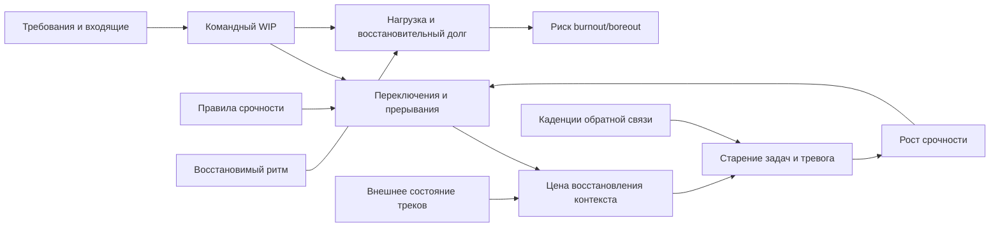

# Паспорт главы 30. Командный фокус, прерывания и выгорание

## Задача главы

Показать, как когнитивное инженерство работает на уровне команды: не только как личный фокус отдельного человека, а как дизайн общего потока работы, правил срочности, внешнего состояния треков, каденций обратной связи и восстановимого режима.

Глава должна связать:

- командный WIP;
- прерывания;
- срочность;
- внешний контейнер состояния тяжелых треков;
- старение задач;
- восстановительный долг;
- риск burnout и boreout;
- роль лидера в сохранении окна полезной нагрузки.

## Читательский вход

К этому месту читатель уже знает:

- рабочий контекст нужно выносить из головы во внешний след;
- фокус - это контакт с одним рабочим контекстом;
- WIP в голове повышает цену входа и переключений;
- мотивационный контур ломается через цену усилия, управляемость, обратную связь, авторство и восстановление;
- burnout и boreout - разные маршруты поломки рабочей включенности;
- восстановление - это возвращение управляемости, а не просто отдых;
- лидерство проектирует среду действия;
- мотивация сотрудника зависит от задачи, среды, состояния и обратной связи.

## Новые понятия

- командный фокус;
- командный WIP;
- WIP в головах команды;
- невидимый WIP;
- WIP срочности;
- бюджет прерываний;
- формат срочности;
- командный внешний контур состояния;
- старение задач без наказания;
- буфер хаоса;
- восстановительный долг команды;
- восстановимый командный ритм;
- командная профилактика burnout/boreout.

## Главная мысль

Командный фокус не создается просьбой "не отвлекаться".

Он появляется, когда команда явно проектирует:

```text
что сейчас активно,
что ждет,
что действительно срочно,
где лежит состояние тяжелых треков,
какой следующий кусок продвижения,
как закрывается рабочий блок,
как восстанавливается команда
и кто не должен становиться постоянным буфером хаоса
```

Если этого нет, даже сильные люди начинают платить за командный хаос своей рабочей памятью, восстановлением, мотивацией и здоровьем.

## Обязательные различения

| Различение | Что удержать |
| --- | --- |
| Личный фокус / командный фокус | Личный фокус зависит от среды: если все входящее потенциально срочно, личная дисциплина быстро перестает работать. |
| WIP на доске / WIP в головах | Формальные задачи не показывают всю когнитивную нагрузку: есть еще поддержка, ожидания, незакрытые решения, менторинг, координация. |
| Переключение / прерывание | Переключение может быть запланированным выходом из одного трека и входом в другой; прерывание разрывает текущий блок до нормальной контрольной точки. |
| Срочность / шум | Срочность несет влияние, срок, владельца и запрошенное действие; шум требует внимания, но не дает критерия, можно ли ждать. |
| Старение задач / вина | Стареющая задача - сигнал о системе потока, размере, тумане, блокере, WIP или перегрузе; не повод автоматически обвинять исполнителя. |
| Восстановление / слабый темп | Восстановимый ритм не отменяет результат, а защищает будущий вход в сложную работу. |
| Профилактика burnout / лечение | Команда может снижать факторы риска, но глава не дает диагностику и лечение выгорания. |
| Профилактика boreout / развлечения | Нижний перекос чинится не развлечением, а вызовом, смыслом, автономией, обратной связью и ростом. |

## Обязательная визуальная опора

Главная схема главы:



Диагностическая таблица:

| Командный сигнал | Что проверить первым |
| --- | --- |
| Задачи долго висят "в работе" | Есть ли следующий кусок продвижения, владелец, критерий сдвига и внешнее состояние. |
| Люди постоянно дергают друг друга | Различима ли срочность, есть ли асинхронный контекст, нет ли скрытого дефицита документации. |
| Сильные сотрудники всегда тушат срочное | Не стали ли они буфером хаоса, есть ли ротация, on-call, разгрузка и восстановление. |
| Команда устает, но результата не видно | Не разорвана ли петля усилие -> обратная связь -> авторизация результата. |
| Люди формально заняты, но гаснут | Нет ли маршрута недогруза: низкого смысла, вызова, автономии, обратной связи и роста. |
| Любой вопрос становится "срочным" | Есть ли уровни серьёзности, влияние, срок, владелец и запрошенное действие. |

## Практический пример

Команда одновременно ведет несколько тяжелых треков, поддержку, ревью и срочные вопросы. На доске все выглядит нормально: задачи есть, статусы обновляются, встречи идут.

Но фактически:

- каждый день появляются новые "маленькие срочности";
- тяжелые задачи стареют;
- люди не успевают оставлять контрольные точки;
- сильные участники постоянно переключаются на помощь другим;
- на ретро обсуждают усталость, но не меняют правила потока;
- мотивация падает сразу у нескольких человек.

Плохая интерпретация:

```text
команда потеряла фокус и дисциплину
```

Инженерная интерпретация:

```text
какой командный контур заставляет людей
держать слишком много активных контекстов,
постоянно проверять срочность,
платить за восстановление мыслей
и не закрывать результат обратной связью?
```

## Опорные источники

- [[../Источники/2026-05-25 Пакет источников для главы 30]];
- [[../Главы/21-Фокус-WIP-и-переключения]];
- [[../Главы/23-Как-ломается-мотивационный-контур]];
- [[../Главы/24-Burnout-и-boreout]];
- [[../Главы/25-Восстановление-как-возвращение-управляемости]];
- [[../Главы/28-Лидерство-как-дизайн-среды-действия]];
- [[../Главы/29-Мотивация-сотрудников]];
- [[../../../tbank-spirit-code-my-internal/TEAMLEAD/03-Материалы-и-выжимки/Внимание-и-производительность-ChatGPT]];
- [[../../../tbank-spirit-code-my-internal/TEAMLEAD/02-Фокус-и-способы-работы/Распыление-фокуса-по-задачам-в-работе]];
- [[Психология, нейрофизиология/Выгорание/00-выгорание ч.2]].

## Популярные ошибки, которые глава должна предотвратить

- "Команда теряет фокус, потому что люди недостаточно дисциплинированы".
- "Нужно просто запретить прерывания".
- "Любая просьба от бизнеса или соседней команды срочная по умолчанию".
- "Если задача в работе, значит по ней есть реальное продвижение".
- "Сильный сотрудник справится с постоянными переключениями".
- "Дейлик сам по себе синхронизирует состояние треков".
- "Выгорание предотвращается позитивной атмосферой".
- "Boreout лечится отдыхом".
- "Восстановление команды - личное дело каждого".
- "Лидер должен сам фильтровать все входящие".

## Границы главы

Глава не является инструкцией по Scrum, Kanban, ITIL, on-call management, SRE или организационному дизайну. Она использует некоторые управленческие идеи как примеры, но не учит внедрять конкретную методологию.

Глава также не диагностирует и не лечит burnout, depression, anxiety, chronic fatigue или другие клинические состояния.

Ее задача уже:

```text
показать,
как командный поток работы
может снижать или повышать
цену внимания,
цену переключения,
восстановительный долг
и риск поломки мотивационного контура
```

После этой главы учебник переходит к практикуму. Глава 31 соберет диагностическую карту задачи: как по шагам разобрать, что именно ломает вход в действие.

## Статус

`ready-for-review`

Черновик главы создан: [[../Главы/30-Командный-фокус-прерывания-и-выгорание]].

Карта объяснения создана: [[../Карты объяснения/30-Командный-фокус-прерывания-и-выгорание]].

Источниковый пакет создан: [[../Источники/2026-05-25 Пакет источников для главы 30]].

Связки проверены: [[../Проверки/2026-05-25 Связка глав 29-30]] и [[../Проверки/2026-05-25 Связка глав 30-31]].

Ревизия блока: [[../Проверки/2026-05-25 Ревизия блока 26-30]].

Следующий шаг: при финальной редактуре проверить, что глава не повторяет главу 21 и блок 23-25, а поднимает WIP, срочность, восстановительный долг и burnout/boreout на уровень командной среды.
