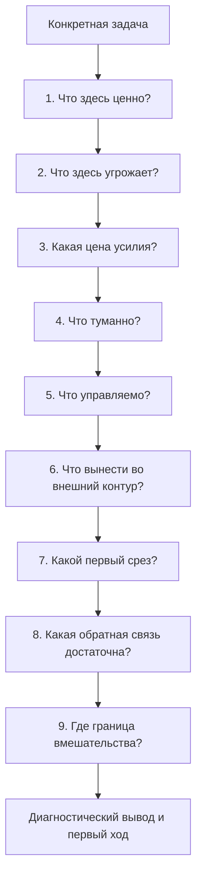

# Паспорт главы 31. Диагностика задачи

## Задача главы

Дать читателю первый полный практический инструмент учебника: диагностическую карту конкретной задачи.

Глава должна собрать уже введенные понятия в рабочий маршрут:

- что здесь ценно;
- что здесь угрожает;
- какая цена усилия;
- что туманно;
- что управляемо;
- что нужно вынести во внешний контур;
- какой первый срез можно сделать;
- какая обратная связь покажет продвижение;
- где граница личного, командного и организационного вмешательства.

## Читательский вход

К этому месту читатель уже знает:

- сложную задачу нельзя надежно держать только в голове;
- контекст задачи нужно делать внешним объектом;
- рабочий журнал сохраняет состояние мысли;
- мотивация не равна желанию;
- ценность, угроза, управляемость и цена усилия являются разными параметрами;
- прокрастинация часто связана с дорогим, угрожающим или туманным входом;
- WIP, прерывания и отсутствие контрольной точки повышают цену возвращения;
- burnout и boreout нельзя лечить простым "соберись";
- командный фокус зависит от среды, а не только от дисциплины отдельных людей.

## Новые понятия

- диагностика задачи;
- диагностическая карта задачи;
- место поломки действия;
- диагностический вход;
- первый срез;
- достаточная обратная связь;
- границы вмешательства;
- личный уровень вмешательства;
- командный уровень вмешательства;
- организационный уровень вмешательства;
- диагностический вывод.

## Главная мысль

Перед тем как чинить поведение, нужно понять, что именно делает задачу недоступной.

Одна и та же фраза:

```text
я не могу войти в задачу
```

может означать разные вещи:

```text
не вижу ценности
вижу угрозу
слишком дорого входить
не понимаю, что именно проверять
не вижу рычага влияния
держу слишком много контекста в голове
не получаю обратной связи
живу в перегрузе
пытаюсь личным усилием решить командную или организационную проблему
```

Диагностика задачи нужна, чтобы выбрать не "правильный совет вообще", а первое вмешательство в нужный параметр.

## Обязательные различения

| Различение | Что удержать |
| --- | --- |
| Диагностика / самокопание | Диагностика должна привести к рабочему выводу и первому срезу, а не к бесконечному анализу себя. |
| Задача / состояние человека | Мы диагностируем конкретную ситуацию действия, но учитываем состояние человека как один из параметров. |
| Ценность / желание | Ценность может быть реальной, даже если желания входить нет. |
| Угроза / слабость | Угроза показывает, от чего система защищается; это не моральная оценка человека. |
| Цена усилия / лень | Высокая цена может быть когнитивной, социальной, физической, идентичностной или восстановительной. |
| Туман / сложность | Туман означает, что задача не имеет проверяемого вопроса; сложность может быть высокой, но понятной. |
| Управляемость / вероятность успеха | Важен не только шанс результата, но и связь действия с обратной связью и корректировкой. |
| Первый срез / завершение | Первый срез меняет состояние задачи, но не обязан закрывать всю задачу. |
| Feedback / оценка | Достаточная обратная связь помогает корректировать действие, а не просто судит человека. |
| Личное вмешательство / системная проблема | Иногда правильный ход - не личный микрошаг, а изменение условий, эскалация, переговоры или разгрузка. |

## Обязательная визуальная опора

Главная схема главы:



Диагностическая таблица:

| Сигнал | Вероятное место поломки | Первый диагностический вопрос |
| --- | --- | --- |
| Не начинаю, хотя задача важна | Угроза, цена входа, туман | От чего меня защищает незапуск? |
| Читаю и уточняю без конца | Туман, отсутствие первого среза | Какую одну гипотезу можно проверить? |
| Делаю много мелкого вместо главного | WIP, угроза, высокая цена глубокого входа | Какой контекст я избегаю поднимать? |
| Начинаю и быстро бросаю | Нет обратной связи или слишком большой шаг | Какой сигнал покажет продвижение за 20-40 минут? |
| Задача висит у команды | Командный WIP, внешнее состояние, блокер, старение | Есть ли следующий срез и где лежит состояние трека? |
| После отдыха все равно нет входа | Медленно восстанавливаемая цена или системная нагрузка | Что в режиме работы не дает восстановить управляемость? |
| Шаг кажется бесполезным | Низкая управляемость | Какой рычаг реально влияет на исход или понимание? |
| Все зависит не от меня | Граница влияния | Что личное, что командное, что организационное? |

## Практический пример

Человек третий день не входит в туманную инженерную задачу. Поверхностная интерпретация:

```text
я прокрастинирую
```

Диагностическая карта показывает:

- ценность есть: задача снимает важный риск;
- угроза есть: можно ошибиться в архитектурной оценке;
- цена усилия высокая: нужно поднять большой контекст;
- туман не оформлен: непонятно, какую гипотезу проверять первой;
- управляемость частичная: можно проверить один сценарий;
- внешний контур слабый: факты и исключенные варианты не записаны;
- первый срез: собрать минимальную карту фактов и проверить один path в коде;
- обратная связь: после проверки станет ясно, где меняется состояние;
- граница: если не хватает полномочий или данных, нужен вопрос владельцу, а не еще час чтения.

## Опорные источники

- [[../Источники/2026-05-25 Пакет источников для главы 31]];
- [[../Главы/04-Контекст-задачи]];
- [[../Главы/05-Рабочий-журнал-как-внешний-контур-мышления]];
- [[../Главы/06-Ритуалы-входа-и-выхода]];
- [[../Главы/07-Мотивация-это-не-желание]];
- [[../Главы/08-Четыре-области-мотивации]];
- [[../Главы/09-Приближение-и-избегание]];
- [[../Главы/10-Управляемость-действия]];
- [[../Главы/11-Цена-усилия-усталость-и-ощущаемая-энергия]];
- [[../Главы/18-Прокрастинация-как-конфликт-систем]];
- [[../Главы/21-Фокус-WIP-и-переключения]];
- [[../Главы/23-Как-ломается-мотивационный-контур]];
- [[../Главы/24-Burnout-и-boreout]];
- [[../Главы/25-Восстановление-как-возвращение-управляемости]];
- [[../Главы/30-Командный-фокус-прерывания-и-выгорание]];
- [[../../2026-05-23 Идеи для внешней статьи - Когнитивное инженерство разработчика - как входить в туманные задачи и не терять контекст]];
- [[../../2026-05-14  Мотивация как система III - Управляемость действия - как мозг выбирает между усилием, избеганием, привычкой и восстановлением]].

## Популярные ошибки, которые глава должна предотвратить

- "Если задача не идет, нужно просто начать".
- "Если задача важна, мотивация должна появиться сама".
- "Диагностика - это долгое самокопание".
- "Любую проблему можно решить маленьким шагом".
- "Если я устал, значит задача невозможна".
- "Если я боюсь, значит надо давить сильнее".
- "Если нет результата, значит я плохо старался".
- "Командный WIP можно чинить личной дисциплиной".
- "Внешний контур - это бюрократия".
- "Feedback - это похвала или критика".

## Границы главы

Глава не является терапевтическим протоколом, HR-инструкцией, медицинской диагностикой, методологией управления проектами или универсальным чеклистом продуктивности.

Она дает инструмент первого разбора конкретной задачи. Если диагностика показывает длительное истощение, клинические симптомы, хронически небезопасную среду, отсутствие полномочий, перегруз команды или организационный конфликт, правильный вывод может быть за пределами личного действия.

Глава должна готовить главу 32: после диагностики отдельной задачи читатель сможет проектировать свой личный когнитивный контур как систему повторяемого входа, выхода, внешней памяти, обратной связи и восстановления.

## Статус

`ready-for-review`

Черновик главы создан: [[../Главы/31-Диагностика-задачи]].

Карта объяснения создана: [[../Карты объяснения/31-Диагностика-задачи]].

Источниковый пакет создан: [[../Источники/2026-05-25 Пакет источников для главы 31]].

Связки проверены: [[../Проверки/2026-05-25 Связка глав 30-31]] и [[../Проверки/2026-05-25 Связка глав 31-32]].

Ревизия блока: [[../Проверки/2026-05-25 Ревизия блока 31-36]].

Следующий шаг: при финальной редактуре удержать главу как короткий практический вход в модель, а не как длинную анкету или универсальный чеклист продуктивности.
