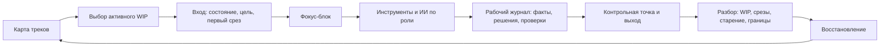

# Паспорт главы 32. Проектирование личного когнитивного контура

## Задача главы

Собрать практическую систему, которая превращает диагностику отдельной задачи в повторяемый личный контур работы.

Глава должна ответить на вопрос:

```text
как сделать так,
чтобы вход, внешний контекст, рабочий журнал,
WIP, ИИ, обратная связь, контрольная точка, разбор контура и восстановление
не зависели от вдохновения и хорошего дня,
а образовывали устойчивую рабочую систему
```

## Читательский вход

К этому месту читатель уже знает:

- сложную задачу нельзя надежно держать только в голове;
- рабочий журнал сохраняет состояние мысли во времени;
- хороший выход из задачи готовит следующий вход;
- мотивация зависит от ценности, угрозы, управляемости, цены усилия и состояния;
- фокус требует ограничения активного WIP и внешних контейнеров для отложенных треков;
- продуктивность без восстановления превращается в самоизнос;
- ИИ может усиливать мышление или обходить его;
- диагностика задачи помогает найти первый срез и границу вмешательства.

## Новые понятия

- личный когнитивный контур;
- карта треков;
- активный WIP;
- слой глубокого трека;
- операционный слой;
- ожидающий слой;
- фоновый слой;
- правила входа в контур;
- правила выхода из контура;
- разбор контура;
- признаки работоспособности контура;
- минимальный личный контур;
- контурный долг;
- поломка контура.

## Главная мысль

Личный когнитивный контур - это не приложение, не система продуктивности и не набор привычек.

Это повторяемая организация внешней памяти, входа, действия, инструментов, обратной связи, выхода, разбора контура и восстановления, которая снижает цену следующего входа и помогает важной работе регулярно получать срезы продвижения.

Короткая формула:

```text
контур работает,
если важные треки видны,
активный WIP выбран,
вход поднимает внешнее состояние,
блок дает срез,
выход оставляет контрольную точку,
разбор контура настраивает систему,
а восстановление сохраняет будущую доступность действия
```

## Обязательные различения

| Различение | Что удержать |
| --- | --- |
| Контур / набор инструментов | Инструменты помогают, но контур задается тем, как человек входит, действует, проверяет, выходит и восстанавливается. |
| Карта треков / TODO-список | TODO хранит действия; карта треков хранит рабочие контексты, состояние, следующий срез и следующий контакт. |
| Активный WIP / все важное | Важных треков может быть несколько; активный глубокий контакт в один момент должен быть ограничен. |
| Вход / подготовка | Вход должен приводить к рабочему срезу, а не бесконечно готовить человека к работе. |
| Выход / бросание задачи | Выход сохраняет состояние и точку продолжения; бросание оставляет контекст в голове или теряет его. |
| Разбор контура / самооценка | Разбор контура чинит систему; он не доказывает, хороший человек или плохой. |
| Восстановление / награда | Восстановление является частью контура, а не призом за выполненный план. |
| ИИ в контуре / ИИ вместо контура | ИИ работает по роли, с проверкой и следом; если он задает цель и решение первым, контур ослаблен. |
| Минимальный контур / идеальная система | Минимальный контур должен работать в обычный тяжелый день; идеальная система часто ломается от сложности. |

## Обязательная визуальная опора

Главная схема главы:



Диагностическая таблица работоспособности контура:

| Сигнал | Что может быть сломано | Первый ремонт |
| --- | --- | --- |
| Важные задачи тревожат фоном | Нет карты треков или следующего контакта | Выписать треки, контейнеры и следующий контакт. |
| Каждый вход начинается с "что вообще было?" | Слабая контрольная точка | Усилить выход: факты, решение, следующее действие. |
| День занят, но нет сдвига | Нет срезов продвижения | Ввести правило одного среза для активного трека. |
| ИИ дает ответы, но навык не растет | ИИ стал первым автором | Вернуть собственный след до запроса к ИИ и проверку после ответа ИИ. |
| Разбор контура вызывает вину | Разбор стал судом | Переписать разбор как ремонт среды и правил. |
| После отдыха вход не дешевле | Восстановление не включено в контур | Проверить WIP, границы, сон, паузы и нагрузку. |
| Система работает только в хороший день | Контур слишком тяжелый | Сжать до минимального контура. |

## Практический пример

У человека есть несколько рабочих треков:

- сложная инженерная задача;
- регулярные ревью;
- обучение или текст;
- координация с людьми;
- фоновый долг, который тревожит;
- необходимость восстановления после плотных дней.

Без контура все живет в одной внутренней куче. Человек открывает то, что громче шумит, отвечает на срочное, держит важное в голове, возвращается к сложному треку холодным входом и вечером не понимает, почему день был занят, но главный сдвиг не случился.

С контуром:

- есть карта треков;
- на день выбран один глубокий активный срез;
- остальные треки имеют контейнер и следующий контакт;
- вход начинается с журнала, а не с памяти;
- ИИ подключается только по роли;
- выход оставляет контрольную точку;
- короткий разбор проверяет WIP, сдвиг и восстановление;
- завтра вход начинается не с нуля.

## Опорные источники

- [[../Источники/2026-05-25 Пакет источников для главы 32]];
- [[../Главы/31-Диагностика-задачи]];
- [[../Главы/04-Контекст-задачи]];
- [[../Главы/05-Рабочий-журнал-как-внешний-контур-мышления]];
- [[../Главы/06-Ритуалы-входа-и-выхода]];
- [[../Главы/20-Продуктивность-без-самоизноса]];
- [[../Главы/21-Фокус-WIP-и-переключения]];
- [[../Главы/22-Ресурсность-сила-и-ритуалы]];
- [[../Главы/25-Восстановление-как-возвращение-управляемости]];
- [[../Главы/26-ИИ-как-усилитель-и-как-обход-мышления]];
- [[../Главы/27-Как-работать-с-ИИ-не-отдавая-ему-субъектность]];
- [[../../2026-05-23 Идеи для внешней статьи - Когнитивное инженерство разработчика - как входить в туманные задачи и не терять контекст]];
- `Прооекты/productivity-framework`.

## Популярные ошибки, которые глава должна предотвратить

- "Нужно найти правильное приложение, и система заработает".
- "Все важное нужно держать перед глазами одновременно".
- "Разбор контура нужен, чтобы оценить, насколько я хорошо справился".
- "Если есть TODO, контекст задачи сохранен".
- "Хороший вход - это когда я почувствовал готовность".
- "Хороший выход - это когда я устал и закрыл ноутбук".
- "ИИ можно подключать вместо первого собственного понимания".
- "Восстановление можно добавить потом, когда дела пойдут лучше".
- "Личная система должна быть полной сразу".
- "Если система не работает, значит у меня мало дисциплины".

## Границы главы

Глава не является медицинским, психотерапевтическим, организационным или карьерным протоколом. Она не обещает, что личный контур решит хроническую перегрузку, токсичную среду, отсутствие полномочий, депрессию, тревожное состояние, соматические причины усталости или системный конфликт приоритетов.

Личный контур помогает там, где у человека есть хотя бы частичные рычаги: вынести состояние наружу, выбрать активный WIP, защитить вход, оставить контрольную точку, проверить результат, настроить разбор контура и восстановление. Если рычагов нет, зрелый контур должен показать границу, а не заставлять человека героически чинить недоступное.

Глава готовит главу 33: после проектирования личного контура учебник сможет разобрать практические кейсы по единой схеме.

## Статус

`ready-for-review`

Черновик главы создан: [[../Главы/32-Проектирование-личного-когнитивного-контура]].

Карта объяснения создана: [[../Карты объяснения/32-Проектирование-личного-когнитивного-контура]].

Источниковый пакет создан: [[../Источники/2026-05-25 Пакет источников для главы 32]].

Связки проверены: [[../Проверки/2026-05-25 Связка глав 31-32]] и [[../Проверки/2026-05-25 Связка глав 32-33]].

Ревизия блока: [[../Проверки/2026-05-25 Ревизия блока 31-36]].

Следующий шаг: при финальной редактуре проверить, что личный контур не стал списком приложений и ритуалов, а остался системой входа, следа, обратной связи, разбора контура и восстановления.
