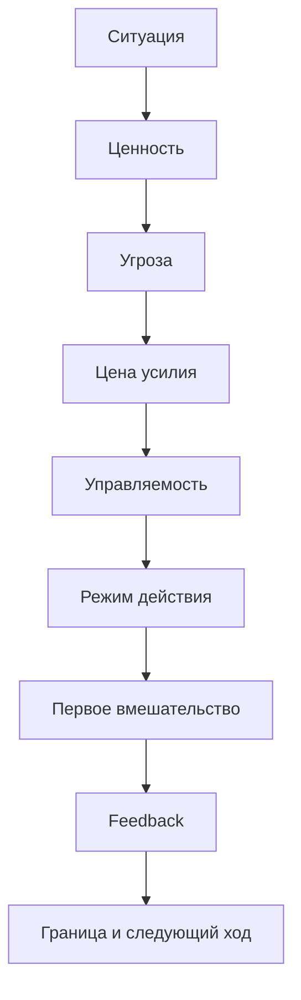

# Паспорт главы 33. Практические кейсы

## Задача главы

Показать, как модель когнитивного инженерства работает на разных типах ситуаций:

- туманная инженерная задача после прерывания;
- прокрастинация из-за высокой цены входа;
- перегруженный лид с несколькими тяжелыми треками;
- потеря мотивации сотрудника;
- ИИ как обход мышления;
- команда в постоянных срочных переключениях;
- восстановление после перегруза.

Глава должна не вводить новую теорию, а проверить уже построенную модель на применимость.

Главный вопрос главы:

```text
как по одной схеме разобрать разные ситуации
и выйти не к совету вообще,
а к первому вмешательству, обратной связи и границе применимости?
```

## Читательский вход

К этому месту читатель уже знает:

- сложная задача требует внешнего состояния, а не только TODO;
- рабочий журнал снижает цену повторного входа;
- мотивация складывается из ценности, угрозы, цены усилия, управляемости и состояния;
- прокрастинация часто является защитным режимом, а не ленью;
- фокус требует ограничения WIP и правил переключения;
- ИИ может усиливать мышление или обходить его;
- восстановление является частью системы действия;
- лидерство и командный фокус являются дизайном среды;
- глава 31 дала диагностическую карту задачи;
- глава 32 собрала личный когнитивный контур.

## Новые понятия

Новых теоретических понятий быть не должно.

Глава вводит только прикладные рабочие формы:

- кейс как проверка модели;
- единая схема разбора кейса;
- диагностический вывод кейса;
- первый ремонт ситуации;
- обратная связь вмешательства;
- граница кейса;
- анти-вывод: что было бы ошибочным рецептом.

## Главная мысль

Когнитивное инженерство становится практикой только тогда, когда человек может разобрать конкретную ситуацию:

```text
что здесь ценно
что угрожает
какая цена усилия
что управляемо
какой режим действия включился
какое вмешательство меняет ситуацию
какая обратная связь покажет, что стало лучше или яснее
где граница личного уровня
```

Один и тот же сигнал не должен вести к одному и тому же совету. "Не начинаю", "устал", "нет мотивации", "все срочно", "ИИ помог" - это не диагнозы. Это входные сигналы, которые нужно разбирать.

## Обязательные различения

| Различение | Что удержать |
| --- | --- |
| Кейс / история | Кейс нужен для проверки модели; история нужна для вовлечения. В главе нужны кейсы, а не рассказы ради драматургии. |
| Сигнал / причина | "Не начинаю" или "нет мотивации" - сигнал. Причина может быть в угрозе, тумане, цене, WIP, обратной связи, восстановлении или границе влияния. |
| Первый ход / финальное решение | Первый ход не обязан решить всю ситуацию. Он должен изменить параметр и дать обратную связь. |
| Feedback / успех | Feedback может быть неприятным или отрицательным, но он повышает управляемость, если помогает корректировать действие. |
| Личный уровень / командный уровень / организационный уровень | Не все чинится личной дисциплиной. Часть кейсов требует изменения среды или признания границы. |
| ИИ как усилитель / ИИ как обход | ИИ полезен, когда работает внутри человеческого контура цели, проверки и решения; опасен, когда заменяет первый контакт с задачей. |
| Восстановление / новый рывок | После перегруза первый ход часто должен возвращать доступность действия, а не увеличивать давление. |

## Обязательная визуальная опора

Главная схема разбора:



Обязательная сводная таблица:

| Кейс | Главный сигнал | Где сбой | Первый ход | Feedback | Граница |
| --- | --- | --- | --- | --- | --- |

Для каждого кейса нужна одинаковая рамка:

```text
ситуация
диагностика
первое вмешательство
обратная связь
границы
что проверяет кейс
```

## Практические кейсы

Минимальный набор:

1. Разработчик возвращается к сложной задаче после прерывания.
2. Человек прокрастинирует задачу из-за высокой цены входа.
3. Лид перегружен несколькими тяжелыми треками.
4. Сотрудник потерял мотивацию.
5. Человек использует ИИ как обход мышления.
6. Команда живет в постоянных срочных переключениях.
7. Человек восстанавливается после перегруза.

Кейсы должны быть синтетическими, санитаризированными и не узнаваемыми как конкретные рабочие эпизоды.

## Опорные источники

- [[../Источники/2026-05-25 Пакет источников для главы 33]];
- [[../Главы/31-Диагностика-задачи]];
- [[../Главы/32-Проектирование-личного-когнитивного-контура]];
- [[../Главы/18-Прокрастинация-как-конфликт-систем]];
- [[../Главы/21-Фокус-WIP-и-переключения]];
- [[../Главы/25-Восстановление-как-возвращение-управляемости]];
- [[../Главы/26-ИИ-как-усилитель-и-как-обход-мышления]];
- [[../Главы/27-Как-работать-с-ИИ-не-отдавая-ему-субъектность]];
- [[../Главы/29-Мотивация-сотрудников]];
- [[../Главы/30-Командный-фокус-прерывания-и-выгорание]].

## Популярные ошибки, которые глава должна предотвратить

- "Если человек не начинает, значит, ему нужен таймер или сила воли".
- "Если сотрудник потерял мотивацию, его нужно лучше замотивировать".
- "Если команда живет в срочности, нужно просто запретить прерывания".
- "Если ИИ дал хороший ответ, мышление сэкономлено без потерь".
- "Если после отдыха не стало легче, значит, нужно собраться сильнее".
- "Если у лида много треков, это просто нормальная цена роли".
- "Если кейс похож на рабочую ситуацию, можно использовать реальные детали".
- "Практическая глава может быть короче и проще, потому что теория уже дана".

## Границы главы

Глава не заменяет:

- клиническую диагностику;
- психотерапию;
- медицинскую помощь;
- HR-процессы;
- организационные решения;
- полноценный разбор конкретной рабочей ситуации;
- финальную главу о доказательной грамотности и чтении исследований.

Кейсы показывают, как думать по модели. Они не доказывают, что любой похожий случай решается тем же вмешательством.

Глава готовит главу 34: после практических кейсов нужно честно разобрать, чего модель не объясняет и где она должна остановиться.

## Статус

`ready-for-review`

Черновик главы создан: [[../Главы/33-Практические-кейсы]].

Карта объяснения создана: [[../Карты объяснения/33-Практические-кейсы]].

Источниковый пакет создан: [[../Источники/2026-05-25 Пакет источников для главы 33]].

Связки проверены: [[../Проверки/2026-05-25 Связка глав 32-33]] и [[../Проверки/2026-05-25 Связка глав 33-34]].

Ревизия блока: [[../Проверки/2026-05-25 Ревизия блока 31-36]].

Следующий шаг: при финальной редактуре сохранить кейсы синтетическими и санитаризированными, а каждый разбор довести до обратной связи и границы применимости.
