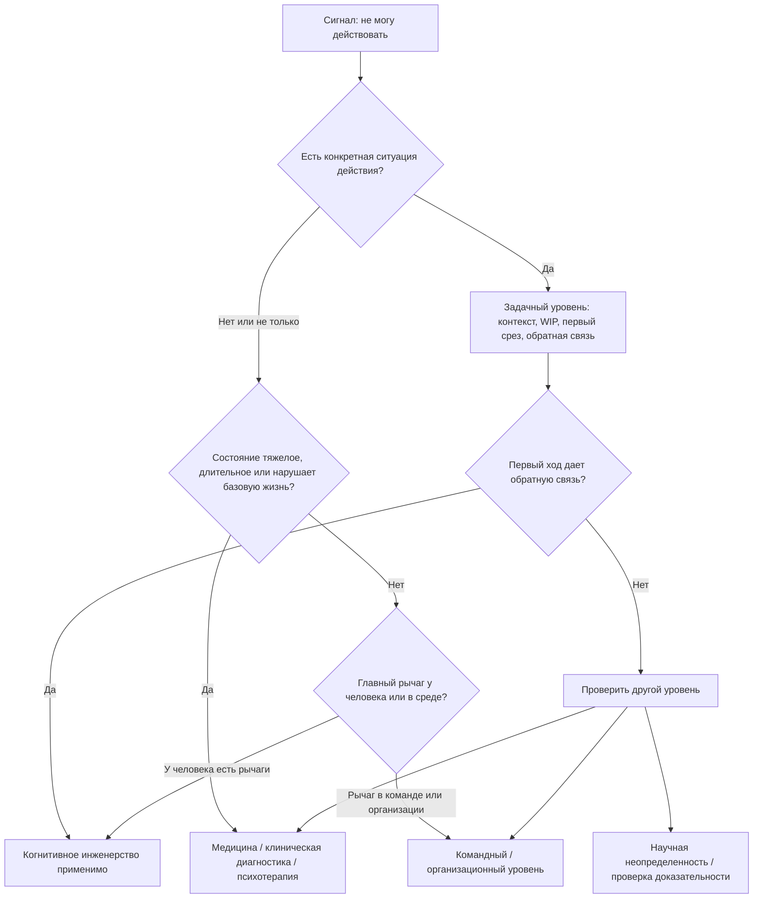

# Паспорт главы 34. Чего эта модель не объясняет

## Задача главы

Честно показать границы модели когнитивного инженерства после практических кейсов.

Глава должна ответить на вопрос:

```text
где когнитивное инженерство помогает разобрать ситуацию действия,
а где оно должно остановиться
и передать вопрос другому уровню помощи, ответственности или доказательства?
```

Это не глава для самооправдания учебника и не формальная дисклеймерная вставка. Она нужна, чтобы читатель не стал применять рабочий журнал, WIP, ритуалы, ИИ-контур или восстановительный микрошаг там, где нужна медицина, психотерапия, клиническая диагностика, изменение условий работы или более строгая научная проверка.

## Читательский вход

К этому месту читатель уже знает:

- сложная задача требует внешнего состояния и контекста;
- рабочий журнал снижает цену повторного входа;
- мотивация складывается из ценности, угрозы, цены усилия, управляемости и состояния;
- прокрастинация может быть защитной политикой, а не ленью;
- burnout и boreout связаны с перекосами рабочей нагрузки и среды;
- восстановление не равно новому протоколу продуктивности;
- ИИ может усиливать мышление или обходить его;
- лидерство и командный фокус требуют дизайна среды, а не мотивационного нажима;
- глава 31 дала диагностику задачи;
- глава 32 дала личный когнитивный контур;
- глава 33 показала кейсы, где каждый раз нужна граница применимости.

## Новые понятия

- граница модели;
- смена уровня вмешательства;
- медицинская граница;
- психотерапевтическая граница;
- клиническая диагностика;
- организационная граница;
- граница научной неопределенности;
- маркер и диагноз;
- симптом и рабочий сигнал;
- помощь на другом уровне;
- предохранитель модели.

## Главная мысль

Сильная практическая модель должна уметь не только давать первый ход, но и останавливаться.

Когнитивное инженерство помогает там, где нужно проектировать условия действия: внешний контекст, ритм входа и выхода, WIP, обратную связь, восстановление, работу с ИИ, командные договоренности. Но оно не должно превращаться в объяснение всего человеческого состояния.

Короткая формула главы:

```text
модель полезна,
если помогает выбрать правильный уровень вопроса;

модель опасна,
если начинает чинить личной практикой
медицинскую, терапевтическую, клиническую,
организационную или научно неопределенную проблему
```

## Обязательные различения

| Различение | Что удержать |
| --- | --- |
| Рабочий сигнал / клинический симптом | "Не могу начать" может быть дорогим входом в задачу, но может быть частью длительного состояния, требующего помощи. |
| Диагностика задачи / клиническая диагностика | Первая ищет параметр действия и первый ход; вторая требует критериев, длительности, нарушения повседневного функционирования, дифференциальной диагностики и клинического суждения. |
| Восстановление / лечение | Восстановление возвращает управляемость режима; лечение относится к состояниям здоровья и требует специалиста. |
| Психологическая техника / психотерапия | Техника может помогать в задаче; терапия работает с устойчивыми паттернами переживания, поведения, отношений и симптомов. |
| Нейромедиатор / диагноз | Дофамин, серотонин, кортизол или HRV не говорят сами по себе, что с человеком и что ему делать. |
| Личная система / организационная проблема | Личный контур не чинит хронически завышенные требования, низкий контроль, несправедливость, опасную среду или дискриминацию. |
| Научная модель / установленный факт | Даже полезная модель может быть упрощением, гипотезой или областью с ограниченной доказательностью. |
| Граница / поражение | Признать границу не значит сдаться; это значит перестать чинить не тот уровень. |

## Обязательная визуальная опора

Главная схема главы:



Обязательная таблица границ:

| Сигнал | Что модель может сделать | Где модель должна остановиться |
| --- | --- | --- |
| Дорогой вход в задачу | Снизить туман, вынести состояние, сделать первый срез. | Если состояние длительное, тяжелое, нарушает сон, тело, базовые дела или безопасность. |
| Потеря мотивации | Проверить ценность, автономию, компетентность, обратную связь, WIP, восстановление. | Если есть клиническая картина апатии, ангедонии, депрессивно-подобного состояния или резкое изменение состояния. |
| Выгорание | Разобрать требования, ресурсы, восстановление, контроль, командную среду. | Если нужны медицинская оценка, психотерапия, отпуск/больничный, HR/организационные решения. |
| "Низкий дофамин" | Перевести разговор с бытового нейроярлыка на поведение, контекст, состояние и доказательность. | Если человек пытается диагностировать себя по медиатору, анализу, БАДу или популярному тесту. |
| Постоянные срочные переключения | Сделать WIP, серьезность, внешнее состояние, правила срочности. | Если организация требует постоянной реактивности без ресурсов, ролей и контроля. |
| ИИ ухудшает мышление | Вернуть собственный след до запроса к ИИ, проверку, роль ИИ, сохранение навыка. | Если утверждение требует фактической, юридической, медицинской или быстро меняющейся экспертной проверки. |

## Практический пример

Человек после перегруза не может вернуться к работе.

Модель может помочь спросить:

- есть ли конкретный активный трек;
- какой вход безопасен;
- какой WIP нужно заморозить;
- что стало угрозой;
- какой малый срез даст обратную связь;
- как защитить восстановление;
- где среда снова возвращает человека в прежний перегруз.

Но если состояние длится неделями, сопровождается выраженным ухудшением сна, аппетита, концентрации, телесными симптомами, утратой способности делать базовые дела, паникой, депрессивными симптомами, мыслями о самоповреждении или резким изменением состояния, глава не должна предлагать еще один протокол входа.

Правильный вывод:

```text
это уже не только задача входа;
нужно подключать помощь и менять уровень вопроса
```

## Опорные источники

- [[../Источники/2026-05-25 Пакет источников для главы 34]];
- [[../Главы/12-Уровни-объяснения]];
- [[../Главы/14-Нейромедиаторы-и-гормоны]];
- [[../Главы/23-Как-ломается-мотивационный-контур]];
- [[../Главы/24-Burnout-и-boreout]];
- [[../Главы/25-Восстановление-как-возвращение-управляемости]];
- [[../Главы/31-Диагностика-задачи]];
- [[../Главы/32-Проектирование-личного-когнитивного-контура]];
- [[../Главы/33-Практические-кейсы]];
- [[../../2026-05-01 Мотивация как система II - нейрофизиология побуждения, усилия, избегания и истощения]];
- [[../../2026-05-14  Мотивация как система III - Управляемость действия - как мозг выбирает между усилием, избеганием, привычкой и восстановлением]].

## Популярные ошибки, которые глава должна предотвратить

- "Если модель объясняет состояние, значит, она может его исправить".
- "Депрессию, тревогу, ADHD, травму или хроническую бессонницу можно разобрать как задачу с дорогим входом".
- "Burnout - это просто перегруз, который лечится отдыхом и новым ритмом".
- "Если нет мотивации, значит, нужно вернуть дофамин".
- "Если человек не справляется, ему нужна лучшая личная система".
- "Психотерапия - это просто разговорная версия коучинга продуктивности".
- "Медицинская помощь нужна только в крайних случаях".
- "Организационную проблему можно компенсировать личной дисциплиной".
- "Научная статья автоматически превращается в практическую рекомендацию".
- "Граница применимости делает модель слабой".

## Границы главы

Глава не является медицинским справочником, психотерапевтическим руководством, диагностическим чеклистом или учебником по оценке доказательности.

Она должна дать читателю карту остановки: когда продолжать работать по модели, когда поднять вопрос на командный или организационный уровень, когда обращаться за медицинской или психотерапевтической помощью, когда нужен клинический диагноз, а когда нужно сначала проверить качество доказательств.

Глава готовит главу 35: после карты границ нужно научить читателя читать исследования так, чтобы не построить новый нейромиф на красивой статье, фМРТ-картинке, животной модели, маркере или громком обзоре.

## Статус

`ready-for-review`

Черновик главы создан: [[../Главы/34-Чего-эта-модель-не-объясняет]].

Карта объяснения создана: [[../Карты объяснения/34-Чего-эта-модель-не-объясняет]].

Источниковый пакет создан: [[../Источники/2026-05-25 Пакет источников для главы 34]].

Связки проверены: [[../Проверки/2026-05-25 Связка глав 33-34]] и [[../Проверки/2026-05-25 Связка глав 34-35]].

Ревизия блока: [[../Проверки/2026-05-25 Ревизия блока 31-36]].

Следующий шаг: при финальной редактуре сделать границы конкретными и полезными, а не формальным дисклеймером или отказом от силы модели.
