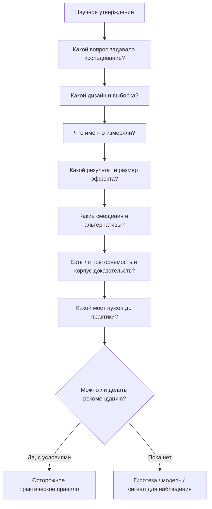

# Паспорт главы 35. Как читать исследования и не построить нейромиф

## Задача главы

Дать читателю практическую доказательную грамотность: как читать научные утверждения так, чтобы не превращать их в нейромифы, псевдоточность и слишком уверенные рекомендации.

Глава должна ответить на вопрос:

```text
как перейти от исследования к осторожному пониманию,
а не к лозунгу, бытовому диагнозу или универсальному совету?
```

Это не академический курс статистики и не методологическое послесловие для специалистов. Глава нужна человеку, который будет читать статьи, популярные пересказы, ИИ-бенчмарки, обзоры, рекомендации и заметки учебника, а потом принимать практические решения: как работать, учиться, восстанавливаться, пользоваться ИИ, строить личный контур или менять командную среду.

## Читательский вход

К этому месту читатель уже знает:

- сложная работа требует внешнего состояния задачи;
- мотивация не сводится к желанию;
- действие зависит от ценности, угрозы, цены усилия, управляемости и состояния;
- нейромедиаторы и гормоны являются регуляторами режимов, а не бытовыми диагнозами;
- стресс, сон, усталость и восстановление меняют доступность контроля;
- ИИ может усиливать мышление или обходить его;
- модель когнитивного инженерства имеет медицинские, терапевтические, организационные и научные границы;
- глава 34 показала: если уровень вопроса выбран неправильно, практическая модель может стать новым языком самонажима.

## Новые понятия

- доказательная дисциплина;
- исследовательский вопрос;
- дизайн исследования;
- выборка;
- исход или результат;
- корреляция;
- причинность;
- смешивающие факторы;
- обратный вывод;
- маркер, механизм и рычаг;
- статистическая значимость;
- практическая значимость;
- размер эффекта;
- неопределенность;
- одиночное исследование;
- систематический обзор;
- мета-анализ;
- риск смещения;
- публикационное смещение;
- трансляционный мост;
- быстро меняющаяся доказательная база;
- заявление поставщика;
- нейромиф.

## Главная мысль

Научное исследование не превращается в практическую рекомендацию автоматически.

Сначала нужно понять, какой вопрос оно задает, на ком проведено, что измеряет, какой дизайн использует, насколько велик эффект, какие альтернативные объяснения остаются, повторяется ли результат и какой мост нужен до практического действия.

Короткая формула главы:

```text
сначала вопрос и дизайн,
потом результат,
потом ограничения,
потом перенос,
и только потом осторожная практика
```

## Обязательные различения

| Различение | Что удержать |
| --- | --- |
| Корреляция / причинность | Связь между явлениями не доказывает, что одно вызывает другое. |
| Коррелят / механизм | То, что меняется вместе с состоянием, не обязательно объясняет, как состояние возникает. |
| Механизм / рычаг | Даже верный механизм не всегда дает человеку доступное вмешательство. |
| Маркер / диагноз | Маркер может быть полезным индикатором, но не обязан быть диагностическим критерием или планом действия. |
| Статистическая значимость / практическая значимость | Статистический результат может быть малым, нестабильным или практически неважным. |
| Одиночное исследование / корпус доказательств | Одна статья редко должна становиться правилом поведения. |
| Обзор / мета-анализ | Обзор и мета-анализ полезны только настолько, насколько хороши вопрос, поиск, включенные исследования и анализ смещений. |
| Рецензирование / истина | Рецензирование снижает часть ошибок, но не делает вывод окончательным. |
| Препринт / мусор | Препринт не прошел финальную журнальную проверку, но может быть ценным ранним сигналом. |
| Заявление поставщика / независимое доказательство | Утверждение производителя или заинтересованной стороны требует отдельной проверки. |
| Популяризация / искажение | Можно писать просто; нельзя делать причинность, уверенность и границы проще, чем они есть. |

## Обязательная визуальная опора

Главная схема главы:



Обязательная таблица лестницы доказательности:

| Уровень утверждения | Что можно сказать | Чего нельзя делать |
| --- | --- | --- |
| Одиночное наблюдение | Есть интересный сигнал. | Строить правило. |
| Корреляционное исследование | Переменные связаны в этой выборке. | Делать причинный вывод без дополнительных оснований. |
| Эксперимент | При этих условиях вмешательство изменило результат. | Переносить на все группы, задачи и сроки. |
| Животная модель | Возможен механизм или путь влияния. | Давать человеческую практическую рекомендацию без трансляционного моста. |
| Нейровизуализация | Видна связь задачи/состояния с активностью или сетью. | Читать психику по картинке мозга. |
| Обзор | Есть карта литературы. | Считать вывод сильным без оценки качества источников. |
| Мета-анализ | Есть количественная сводка эффектов. | Игнорировать неоднородность, смещения и качество исходных исследований. |
| Практическая рекомендация | Есть мост от доказательств к действию. | Прятать условия применимости и цену ошибки. |

## Практический пример

Человек читает популярный пересказ:

```text
Новое исследование показало, что дофамин отвечает за мотивацию.
Значит, чтобы перестать прокрастинировать, нужно повысить дофамин.
```

Глава должна научить разбирать это не через спор "дофамин важен / не важен", а через вопросы:

- какое исследование?
- люди или животные?
- какая задача?
- что измеряли: активность нейронов, BOLD-сигнал, поведение, самоотчет, фармакологическое вмешательство?
- речь об ошибке предсказания награды, усилии, значимости, обучении или выборе действия?
- есть ли причинное вмешательство или только корреляция?
- какой результат у человека?
- что значит "повысить дофамин" практически?
- какова цена ошибки?
- есть ли более прямой инженерный рычаг: ясность задачи, первый срез, обратная связь, снижение угрозы, сон, WIP?

Правильный вывод:

```text
дофаминовые системы могут быть частью механизма мотивационного выбора;
это не дает бытового диагноза и не превращается в универсальный прием
```

## Опорные источники

- [[../Источники/2026-05-25 Пакет источников для главы 35]];
- [[../Главы/12-Уровни-объяснения]];
- [[../Главы/14-Нейромедиаторы-и-гормоны]];
- [[../Главы/26-ИИ-как-усилитель-и-как-обход-мышления]];
- [[../Главы/27-Как-работать-с-ИИ-не-отдавая-ему-субъектность]];
- [[../Главы/34-Чего-эта-модель-не-объясняет]];
- [[../../2026-05-01 Мотивация как система II - нейрофизиология побуждения, усилия, избегания и истощения]];
- [[../../2026-05-14  Мотивация как система III - Управляемость действия - как мозг выбирает между усилием, избеганием, привычкой и восстановлением]].

## Популярные ошибки, которые глава должна предотвратить

- "В исследовании нашли связь, значит, нашли причину".
- "Если активировалась область мозга, значит, мы знаем психологическое состояние".
- "У животных сработало, значит, человеку нужно делать то же".
- "Маркер изменился, значит, это причина и рычаг".
- "p < 0.05 означает, что эффект важный и настоящий".
- "Мета-анализ поставил точку".
- "Препринт можно игнорировать".
- "Рецензирование гарантирует истину".
- "ИИ-бенчмарк этого года говорит, как все ИИ будут работать дальше".
- "Если звучит научно, можно писать проще и увереннее".
- "Популярный текст обязан быть либо точным и скучным, либо понятным и неточным".

## Границы главы

Глава не учит самостоятельно проводить статистический анализ, не заменяет систематический обзор и не делает читателя экспертом по методологии.

Она дает защитный слой для учебника: читатель должен понимать, когда источник поддерживает практический вывод, когда дает только механизм, когда является гипотезой, когда требует обновления и когда вообще не подходит для вывода на уровне личной или командной практики.

Глава готовит главу 36: после доказательной дисциплины можно дать маршруты использования учебника для разных читателей и задач, не превращая эти маршруты в набор универсальных советов.

## Статус

`ready-for-review`

Черновик главы создан: [[../Главы/35-Как-читать-исследования-и-не-построить-нейромиф]].

Карта объяснения создана: [[../Карты объяснения/35-Как-читать-исследования-и-не-построить-нейромиф]].

Источниковый пакет создан: [[../Источники/2026-05-25 Пакет источников для главы 35]].

Связки проверены: [[../Проверки/2026-05-25 Связка глав 34-35]] и [[../Проверки/2026-05-25 Связка глав 35-36]].

Ревизия блока: [[../Проверки/2026-05-25 Ревизия блока 31-36]].

Следующий шаг: при финальной редактуре удержать главу как практическую доказательную грамотность, не расширяя ее в курс статистики и не обесценивая науку.
