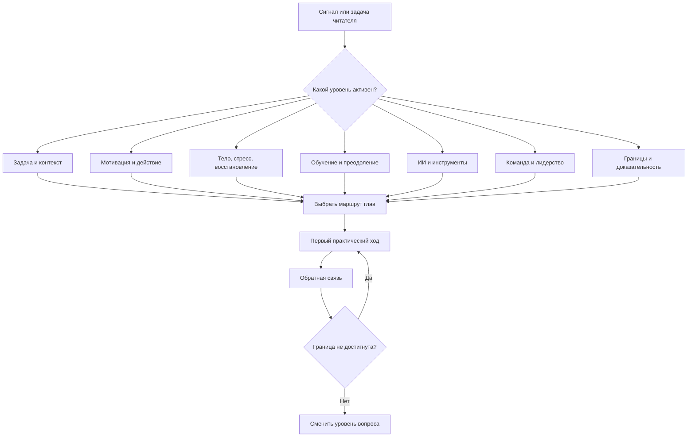

# Паспорт главы 36. Как пользоваться учебником

## Задача главы

Завершить первый полный проход учебника практической навигацией: показать, как читать и использовать книгу линейно, по ролям, по состояниям и по типам задач.

Глава должна ответить на вопрос:

```text
как пользоваться этим учебником,
чтобы он стал рабочей картой,
а не набором интересных глав и приемов?
```

Это не торжественное заключение, не мотивационная речь и не краткий пересказ всего учебника. Глава должна дать читателю маршруты входа, правила возврата к материалу, способ выбирать главу по сигналу и напоминание о границах модели.

## Читательский вход

К этому месту читатель уже получил:

- определение когнитивного инженерства;
- внешний контур мышления: контекст задачи, рабочий журнал, ритуалы входа и выхода;
- мотивационную модель: ценность, угроза, цена усилия, управляемость, обратная связь;
- нейрофизиологический слой без нейромифов;
- модель обучения, прокрастинации и преодоления;
- продуктивность без самоизноса;
- выгорание, профессиональная скука (boreout) и восстановление;
- ИИ как усилитель или обход мышления;
- лидерство как дизайн среды действия;
- практическую диагностику задачи;
- личный когнитивный контур;
- кейсы применения;
- границы модели;
- дисциплину доказательности.

## Новые понятия

- маршрут чтения;
- маршрут применения;
- линейное чтение;
- чтение по сигналу;
- справочный режим;
- маршрут по роли;
- маршрут по состоянию;
- петля обратной связи после чтения;
- проверка границ после практики;
- ревизионный цикл учебника.

## Главная мысль

Учебник нужен не для того, чтобы запомнить все главы подряд, а чтобы научиться выбирать правильный уровень вопроса и находить маршрут к рабочему действию.

Короткая формула главы:

```text
сигнал -> уровень вопроса -> маршрут -> глава -> первый ход -> обратная связь -> граница
```

## Обязательные различения

| Различение | Что удержать |
| --- | --- |
| Линейное чтение / чтение по сигналу | Линейное чтение строит модель; чтение по сигналу помогает в конкретной ситуации. |
| Маршрут / рецепт | Маршрут ведет через понятия и границы; рецепт обещает действие без диагностики. |
| Практика / самонажим | Практика снижает туман и возвращает обратную связь; самонажим требует результата без учета состояния и уровня. |
| Личный контур / клиническая помощь | Личный контур помогает при доступных рычагах; тяжелые состояния требуют другого уровня. |
| ИИ как помощь / ИИ как обход | ИИ полезен, если сохраняется постановка, проверка, решение и след рассуждения. |
| Завершение черновика / готовая книга | Черновик 36 глав закрывает первый проход; готовая книга требует ревизии, источниковой проверки и языкового прохода. |

## Обязательная визуальная опора

Главная схема главы:



Обязательная таблица маршрутов:

| Задача читателя | Начать с | Затем читать | Обязательно проверить |
| --- | --- | --- | --- |
| Войти в туманную задачу | 1, 4-6 | 21, 31-33 | Цена входа, WIP, контрольная точка, обратная связь. |
| Разобрать мотивацию | 7-11 | 18-19, 23-25, 29 | Угроза, управляемость, состояние, границы. |
| Работать с ИИ | 26-27 | 5, 16, 19, 31, 35 | Собственный след до ИИ, проверка, сохранение навыка. |
| Восстановиться после перегруза | 11, 15, 23-25 | 31-34 | Медицинская, организационная граница и граница восстановления. |
| Учиться сложному | 16-19 | 17, 26-27, 35 | Воспроизведение, полезная трудность, перенос, ИИ-обход. |
| Вести команду | 28-30 | 7-11, 20-25, 31, 34 | WIP, автономия, обратная связь, выгорание и профессиональная скука (boreout). |

## Практический пример

Читатель приходит не "читать книгу", а с сигналом:

```text
я снова не могу начать важную задачу
```

Глава должна показать, как не прыгать сразу к совету:

1. Сначала проверить главу 31: что именно делает задачу недоступной.
2. Если потерян контекст, идти в главы 4-6.
3. Если высокая угроза, идти в главы 8-10 и 18.
4. Если высокая цена усилия и усталость, идти в главы 11, 15, 20-25.
5. Если используется ИИ, проверить главы 26-27.
6. Если ход не дает обратной связи или состояние тяжелое, проверить главу 34.
7. Если практический вывод опирается на исследование или популярный нейротекст, проверить главу 35.

## Опорные источники

- [[../Источники/2026-05-25 Пакет источников для главы 36]];
- [[../00-Учебник-Когнитивное-инженерство]];
- [[../01-Архитектура-и-оглавление]];
- [[../02-Карта-понятий-и-пробелов]];
- [[../03-Визуальная-система]];
- [[../04-Порядок-написания-и-критерии-глав]];
- [[../05-Реестр-глав]];
- [[../Главы/31-Диагностика-задачи]];
- [[../Главы/32-Проектирование-личного-когнитивного-контура]];
- [[../Главы/33-Практические-кейсы]];
- [[../Главы/34-Чего-эта-модель-не-объясняет]];
- [[../Главы/35-Как-читать-исследования-и-не-построить-нейромиф]].

## Популярные ошибки, которые глава должна предотвратить

- Читать учебник как список лайфхаков.
- Начинать с нейромедиаторов, когда не разобран уровень задачи.
- Лечить перегруз новыми ритуалами продуктивности.
- Использовать ИИ как обходной путь через обучение и понимание.
- Читать главы про лидерство как технику мотивационного воздействия на людей.
- Применять маршруты без обратной связи и проверки границ.
- Считать первый полный черновик учебника готовой книгой.

## Границы главы

Глава 36 не делает учебник завершенным в статусе `done`. Она закрывает первый полный проход по 36 главам и переводит работу в следующий режим: ревизия полноты, языка, источников, визуального слоя, связок, пробелов и темных пятен.

Глава должна прямо сохранить это различие:

```text
полный черновик учебника создан;
готовая книга требует редакционного и источникового прохода
```

## Статус

`ready-for-review`

Черновик главы создан: [[../Главы/36-Как-пользоваться-учебником]].

Карта объяснения создана: [[../Карты объяснения/36-Как-пользоваться-учебником]].

Источниковый пакет создан: [[../Источники/2026-05-25 Пакет источников для главы 36]].

Связки проверены: [[../Проверки/2026-05-25 Связка глав 35-36]].

Ревизия блока: [[../Проверки/2026-05-25 Ревизия блока 31-36]].

Следующий шаг: при финальной редактуре проверить, что глава завершает первый полный проход как навигация и ревизионный вход, а не как торжественное заключение или объявление книги `done`.
