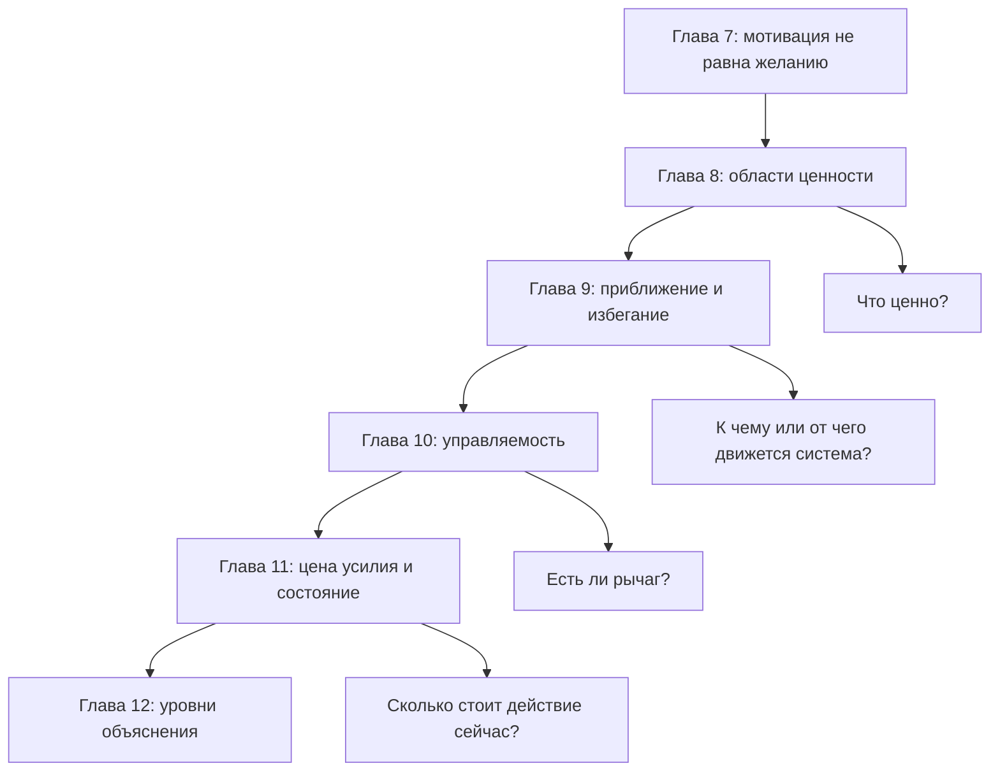

# Мотивационный блок 7-11

Дата проверки: `2026-05-24`.

Проверяемый блок:

```text
7. Мотивация — это не желание
8. Четыре области мотивации
9. Приближение и избегание
10. Управляемость действия
11. Цена усилия, усталость и ощущаемая энергия
```

## Главный вопрос проверки

Блок должен вести читателя от простой ошибки "мотивация = хочется" к рабочей модели мотивационного действия:

```text
ценность
+ угроза
+ режим действия
+ управляемость
+ цена усилия
+ состояние системы
```

Проверка нужна, чтобы убедиться: пять глав образуют учебную лестницу, а не пять самостоятельных статей.

## Итоговая линия блока

```text
Глава 7: мотивация не равна желанию.
Глава 8: ценность бывает разной.
Глава 9: внутри любой ценности возможны приближение и избегание.
Глава 10: угроза становится переносимее, когда есть рычаг.
Глава 11: даже при рычаге действие имеет цену.
```

Эта линия работает.

После главы 11 читатель получает минимальную диагностическую модель:

```text
Почему действие не начинается?

1. Нет ценности или ценность конфликтует.
2. Есть угроза.
3. Включилось избегание.
4. Не виден рычаг действия.
5. Слишком высока цена усилия.
6. Состояние системы делает цену слишком дорогой.
```

## Проверка ролей глав

| Глава | Учебная роль | Основной новый параметр | Риск повтора | Статус |
| --- | --- | --- | --- | --- |
| 7 | Разрушить бытовую модель мотивации. | Мотивационное состояние. | Повторить внешний контур глав 4-6. | ок |
| 8 | Разложить ценность на области. | Достижение, принадлежность, влияние, безопасность. | Превратить области в типы людей. | ок |
| 9 | Развести движение к ценности и уход от угрозы. | Приближение и избегание. | Смешать безопасность с избеганием. | ок |
| 10 | Добавить рычаг действия. | Управляемость. | Свести к оптимизму или самооценке. | ок |
| 11 | Добавить стоимость действия и состояние. | Цена усилия, усталость, ощущаемая энергия. | Уйти в нейромифы или один "бак энергии". | ок |

## Проверка учебной последовательности

| Критерий | Наблюдение | Статус |
| --- | --- | --- |
| От простого к сложному | Блок начинается с бытового "хочется/не хочется" и заканчивает моделью цены действия и состояния системы. | ок |
| Термины вводятся до использования | Ценность, угроза, избегание, управляемость и цена усилия вводятся по очереди. | ок |
| Нет преждевременной нейробиологии | Главы 7-11 используют источники, но оставляют подробные контуры и медиаторы для глав 12-15. | ок |
| Области и режимы разведены | Глава 8 держит области ценности, глава 9 - режимы приближения/избегания. | ок |
| Управляемость не смешана с вероятностью успеха | Глава 10 дает отдельную матрицу и примеры. | ок |
| Цена усилия не сведена к физической усталости | Глава 11 вводит физическую, когнитивную, социальную, идентичностную и восстановительную цену. | ок |
| Есть визуальная поддержка | В каждой главе есть схема, таблица или диагностическая карта. | ок |
| Есть практика | Главы 9-11 дают практические диагностические таблицы; главы 7-8 дают понятийный вход и формы для рабочей карты. | ок |
| Есть источниковый gate | Созданы пакеты для базового мотивационного блока, глав 9, 10 и 11. | ок |
| Подготовлен переход к части IV | Глава 11 явно выводит к необходимости развести уровни объяснения перед нейрофизиологией. | ок |

## Карта блока



## Сводная диагностическая рамка

| Вопрос | Где введен | Что проверяет |
| --- | --- | --- |
| Что здесь ценно? | Глава 7-8 | Есть ли смысл входить в задачу и какая область ценности включена. |
| Что здесь угрожает? | Глава 8-9 | Почему ценная задача может пугать. |
| К чему я иду или от чего ухожу? | Глава 9 | Приближение или избегание организует поведение. |
| Есть ли конкретный рычаг? | Глава 10 | Можно ли действием изменить исход, ясность или следующий шаг. |
| Что именно дорого? | Глава 11 | Какой вид цены блокирует или утяжеляет действие. |
| Это отдых или избегание? | Глава 9 и 11 | Восстанавливается ли доступность действия или закрепляется уход. |

## Что усилить при следующей ревизии

1. Проверить повторы между главами 7, 10 и 11: все три говорят о доступности действия, но должны делать это с разных сторон.
2. Уплотнить переходы в начале глав 8-11, чтобы читатель каждый раз ясно видел, зачем появляется новый параметр.
3. Пройти главы 7-11 на стиль: убрать возможные повторы "не лень, не слабость" там, где мысль уже введена.
4. Решить единую политику источникового блока в конце глав: оставить краткий блок в каждой главе или вынести подробности в общий аппарат.
5. Перед главой 12 составить карту "уровни объяснения" на примерах из блока: желание, избегание, управляемость, усталость, дофамин, аллостатический бюджет.

## Решение по статусам

Историческое решение на `2026-05-24`: главы 7-11 остаются в статусе `draft`.

Причина: блок учебно связан и достаточно полон для первого прохода, но еще не прошел общий стиль-проход, выравнивание плотности и редактуру аппарата ссылок. Поднимать главы в `ready-for-review` рано.

Актуализация `2026-05-25`: после отдельной ревизии блока 7-11 статусы глав 7-11 подняты до `ready-for-review`; см. [[2026-05-25 Ревизия блока 7-11]]. Финальная редактура все еще должна проверить плотность, повторы и единую политику источникового аппарата.

## Статус

`checked`

Следующий шаг закрыт последующей работой: глава 12 написана, а актуальный следующий ревизионный фронт после [[2026-05-25 Ревизия блока 7-11]] — блок 12-15.
