# Связка глав 16-17

## Что проверяется

Проверяется переход:

```text
понимание -> первичный чанк -> сон, восстановление, консолидация и интервальные возвраты
```

Глава 16 объясняет, как фрагмент знания становится рабочим пониманием через внимание, recall, ремонт разрыва, чанк, контекст применения и перенос.

Глава 17 должна добавить временной и восстановительный слой: даже хороший первичный чанк не становится устойчивым автоматически. Ему нужны паузы, сон, повторное извлечение, уточнение, применение и интервальные касания.

## Итоговая связка

```mermaid
flowchart LR
    F["Фрагмент"] --> A["Внимание"]
    A --> U["Первичное понимание"]
    U --> R["Recall"]
    R --> C["Чанк-кандидат"]
    C --> P["Пауза"]
    P --> S["Сон / восстановление"]
    S --> K["Консолидация"]
    K --> RR["Повторное извлечение"]
    RR --> RC["Уточнение / реконсолидация"]
    RC --> ST["Более устойчивый чанк"]
    ST --> T["Применение / перенос"]
```



## Роль каждой главы

| Глава | Роль | Что не должна делать |
| --- | --- | --- |
| 16. Как строится понимание | Ввести знакомость, рабочее понимание, recall, чанк, карточку смысла, интервал и перенос. | Не превращаться в полный раздел о сне, восстановлении и режиме. |
| 17. Сон, восстановление и консолидация | Показать, что знание должно пережить время, паузу, сон, повторное извлечение и уточнение. | Не превращаться в набор sleep hacks или медицинские рекомендации. |

## Проверка непрерывности

| Критерий | Наблюдение | Статус |
| --- | --- | --- |
| Глава 17 начинается из главы 16 | Первый раздел прямо берет путь `фрагмент -> внимание -> recall -> чанк` и добавляет недостающий слой времени. | ok |
| Нет повторного объяснения всей главы 16 | Глава 17 не пересказывает подробно чанк, карточки и перенос, а использует их как уже введенные понятия. | ok |
| Сон не подан как магия | Текст разводит фокусный контакт, recall, сон, консолидацию и повторное касание. | ok |
| Пауза отделена от избегания | Есть отдельная таблица "восстановительная пауза / избегание". | ok |
| Недосып описан как state problem | Глава говорит о внимании, рабочей памяти, контроле, эмоциональной регуляции и цене сложного действия. | ok |
| Spacing связан с recall | Интервалы объяснены как способ сделать следующее касание извлечением, а не продолжением знакомости. | ok |
| Прогулки и движение описаны осторожно | Движение подано как смена состояния и поддержка генерации идей, а не универсальная нейротренировка. | ok |
| Есть подготовка к главе 18 | Завершение разводит восстановление и прокрастинацию как внешне похожие, но системно разные процессы. | ok |

## Главная редакционная защита

Глава 17 должна удерживать формулу:

```text
сон, паузы и интервалы - часть учебного контура,
но не замена фокусного контакта, recall и применения
```

Запрещенные упрощения для ревизии:

- "сон записывает знания";
- "сон очищает мозг от токсинов" как основной тезис;
- "рассеянный режим сам решает задачу";
- "прогулка улучшает любую когнитивную функцию";
- "интервальное повторение заменяет практику";
- "недосып можно компенсировать мотивацией";
- "пауза всегда полезна".

## Что глава 17 добавила к учебнику

- Временной слой обучения: знание должно пережить интервал.
- Понятие первичного следа как хрупкого результата первого контакта.
- Консолидацию как стабилизацию, реорганизацию и интеграцию следов.
- Реактивацию и реконсолидацию как механизм повторного обращения к памяти.
- Различение восстановительной паузы и избегания.
- Сон и недосып как параметры состояния системы, влияющие на внимание, память, контроль и эмоциональную регуляцию.
- Практический цикл вечернего и утреннего recall.
- Инженерную рамку для пауз, прогулок и двигательных переключений без нейромифов.

## Следующий переход

После ревизии блока 16-19 главы 16 и 17 идут в статус `ready-for-review`.

Переход работает в таком виде:

```text
восстановление улучшает следующий вход в задачу;
прокрастинация часто дает краткое облегчение,
но ухудшает следующий вход
```

Для главы 18 нужно не начинать с морализаторства о лени, а использовать уже введенные блоки:

- контекст задачи;
- рабочий журнал;
- ритуал входа;
- мотивационные области;
- приближение и избегание;
- управляемость;
- цена усилия;
- состояние системы;
- полезная пауза и избегание.

## Статус

`done`

Актуализация `2026-05-25`: глава 18 уже создана и проверена в составе [[2026-05-25 Ревизия блока 16-19]]; прежний next-step закрыт последующей работой.

Статус главы 17: `ready-for-review`.
