# Когнитивное инженерство

Учебник о том, как проектировать мышление, действие, среду, восстановление и работу с инструментами так, чтобы сложные задачи становились понятнее, управляемее и честнее по своей цене.

## Коротко о книге

"Когнитивное инженерство" - это учебник о человеке как работающей системе: внимании, памяти, мотивации, телесном состоянии, среде, инструментах, команде и обратной связи.

Книга ведет читателя от простой проблемы - человек теряет состояние мысли и не может войти в задачу - к более сложной модели: как ценность, угроза, цена усилия, управляемость, восстановление, ИИ, лидерство и доказательная дисциплина связаны в один контур действия.

Главная идея учебника: трудность не нужно объяснять только ленью, слабой волей или нехваткой мотивации. Часто действие становится недоступным из-за цены входа, тумана, угрозы, перегруза, отсутствия внешнего состояния, плохой обратной связи, неудачного контура работы или системной границы.

## Для кого

Учебник рассчитан на разработчиков и инженеров, которые работают с туманными задачами и большим контекстом; тимлидов и инженерных руководителей; людей, которые учатся сложному; пользователей ИИ, которым важно не потерять собственное мышление, навык и ответственность; всех, кто хочет говорить о продуктивности, мотивации, усталости и восстановлении без самообмана и нейромифов.

## Чем книга не является

Это не медицинский справочник, не психотерапевтический протокол, не инструкция по фармакологии, гормонам, БАДам, биохакингу или лечению. Это не HR-рецепт и не набор техник продуктивности.

Это учебник о проектировании условий действия. Там, где вопрос выходит в здоровье, клиническое состояние, психотерапию, юридическую ответственность, организационную власть или безопасность, книга помогает увидеть границу и перейти к соответствующему уровню помощи или решения.

---

## Оглавление

- Глава 1. Проблема: человек теряет не только время, но и состояние мысли
- Глава 2. Что такое когнитивное инженерство
- Глава 3. Минимальная модель человека как работающей системы
- Глава 4. Контекст задачи: что нужно вынести из головы
- Глава 5. Рабочий журнал как внешний контур мышления
- Глава 6. Ритуалы входа и выхода
- Глава 7. Мотивация — это не желание
- Глава 8. Четыре области мотивации
- Глава 9. Приближение и избегание
- Глава 10. Управляемость действия
- Глава 11. Цена усилия, усталость и ощущаемая энергия
- Глава 12. Уровни объяснения
- Глава 13. Контуры действия
- Глава 14. Нейромедиаторы и гормоны
- Глава 15. Стресс, аллостаз и окно полезной нагрузки
- Глава 16. Как строится понимание
- Глава 17. Сон, восстановление и консолидация
- Глава 18. Прокрастинация как конфликт систем
- Глава 19. Опыт преодоления
- Глава 20. Продуктивность без самоизноса
- Глава 21. Фокус, WIP и переключения
- Глава 22. Ресурсность, сила и ритуалы
- Глава 23. Как ломается мотивационный контур
- Глава 24. Выгорание и профессиональная скука
- Глава 25. Восстановление как возвращение управляемости
- Глава 26. ИИ как усилитель и как обход мышления
- Глава 27. Как работать с ИИ, не отдавая ему субъектность
- Глава 28. Лидерство как дизайн среды действия
- Глава 29. Мотивация сотрудников
- Глава 30. Командный фокус, прерывания и выгорание
- Глава 31. Диагностика задачи
- Глава 32. Проектирование личного когнитивного контура
- Глава 33. Практические кейсы
- Глава 34. Чего эта модель не объясняет
- Глава 35. Как читать исследования и не построить нейромиф
- Глава 36. Как пользоваться учебником

---

# Глава 1. Проблема: человек теряет не только время, но и состояние мысли

## Зачем начинается именно отсюда

Сложная интеллектуальная работа часто ломается не там, где ее принято ругать.

Не в календаре. Не в отсутствии красивой системы задач. Не всегда в лени, слабой дисциплине или плохой мотивации.

Иногда человек открывает задачу и видит перед собой не задачу, а остатки задачи: тикет, файл, заметку, несколько ссылок, фрагмент переписки, логи, старое ощущение "я уже почти понял". Но самого понимания под рукой нет. Вчера или на прошлой неделе внутри была собранная рабочая модель: что происходит, какие варианты уже проверены, где слабое место, что нужно сделать следующим. Сегодня эта модель распалась.

В такой момент теряется не только время. Теряется состояние мысли.

Сначала нужно назвать сам сбой. Иначе легко выбрать неправильное средство: давить на дисциплину, заводить еще один список дел, искать мотивацию, хотя реальная проблема в том, что рабочая модель задачи не пережила прерывание.

## Узнаваемая сцена

Представим обычную ситуацию.

Есть задача с неопределенностью. Например, сервис иногда создает запись в одной системе, но не создает связанный объект во второй. Ошибка не воспроизводится каждый раз. Нужно понять, где теряется состояние: событие не доходит, внешний вызов падает, таймаут обрабатывается неверно, повторная обработка не работает или состояние меняется в неправильном порядке.

В первый день работа идет тяжело, но продвигается. Ты находишь несколько логов, смотришь один успешный и один неуспешный сценарий, формулируешь гипотезу, исключаешь один тупик, почти доходишь до следующей проверки.

Потом начинается обычная жизнь сложной работы:

- встреча;
- ревью;
- срочный вопрос;
- другая задача;
- конец дня;
- выходные;
- перерыв на сон;
- несколько часов в другом контексте.

Через некоторое время ты возвращаешься. Открываешь тот же тикет, тот же код, те же логи. Формально все на месте. Но внутри уже нет собранной картины.

Остались обрывки:

- "там был какой-то timeout";
- "кажется, событие не терялось";
- "я смотрел correlation_id, но какой именно?";
- "кажется, следующий шаг был в обработке ошибки";
- "почему я решил не смотреть тот вариант?";
- "с чего теперь начать?"

Первые полчаса или час уходят не на новое продвижение, а на восстановление прежнего состояния. Внешне это может выглядеть как раскачка, прокрастинация или медленный старт. По сути это другая работа: повторная сборка контекста.

## Что именно теряется

У сложной задачи есть внешнее существование: тикет, файлы, документы, сообщения, логи, тесты. Но во время работы у нее появляется и внутреннее состояние: временная модель в голове человека.

Эта модель содержит не только "что надо сделать". Она содержит:

- зачем задача существует;
- что уже известно;
- какие факты подтверждены;
- какие места остаются туманными;
- какие гипотезы кажутся сильными;
- какие варианты уже проверены и отброшены;
- какие ограничения нельзя нарушить;
- где остановилась мысль;
- какой следующий шаг был выбран.

Пока человек работает, все это кажется доступным. Но доступность не равна надежному хранению. Временная модель держится на внимании, рабочей памяти, свежих следах и связи между фрагментами. После прерывания часть этой связности распадается.

Поэтому человек может помнить отдельные детали и все равно потерять состояние задачи. Он помнит слова, но не ход рассуждения. Помнит файл, но не причину, почему пришел именно туда. Помнит гипотезу, но не ее силу. Помнит, что что-то уже проверял, но не помнит результат проверки.

Это важное различение:

```text
память о фрагментах задачи != сохраненное состояние задачи
```

Сохраненное состояние задачи — это не набор случайных следов. Это связная рабочая картина, по которой можно продолжить действие.

## Потеря времени, мотивации и контекста — разные вещи

Когда работа не начинается, легко сказать: "я потерял время". Это иногда правда, но слишком грубо. Под одним ощущением могут лежать разные сбои.

| Что кажется | Что может происходить | Какой тип ответа нужен |
| --- | --- | --- |
| "Я теряю время" | Время уходит на восстановление контекста, а не на новое действие. | Сохранять состояние задачи между подходами. |
| "У меня нет мотивации" | Ценность есть, но вход слишком дорогой или угрожающий. | Снизить цену входа, сделать первый шаг управляемым. |
| "Я не знаю, что делать" | Следующее действие не выделено из тумана. | Сформулировать первый проверяемый шаг. |
| "Я опять ничего не понимаю" | Распалась рабочая модель задачи. | Восстановить или заранее сохранить контекст. |
| "Я туплю" | Рабочая память перегружена разрозненными фрагментами. | Вынести структуру наружу и собрать ее на внешней опоре. |

Эти состояния могут сочетаться. Потеря контекста может снижать мотивацию: задача начинает казаться тяжелее, чем она была. Низкая мотивация может мешать восстанавливать контекст. Усталость может усиливать оба эффекта.

Но для учебника важно не смешивать все в одно слово. Если человек потерял именно состояние задачи, дополнительная самокритика не помогает. Полезна конструкция, которая помогает снижать вероятность этой потери.

## Почему списка дел часто недостаточно

Список дел хорошо работает, когда действие понятно и не требует большой модели.

```text
- отправить письмо
- оплатить счет
- обновить зависимость
- назначить встречу
```

Для таких задач полезно просто не забыть действие.

Но туманная задача устроена иначе. Запись вида:

```text
- разобраться с интеграцией
```

сохраняет только верхнюю оболочку. Она не отвечает на вопросы:

- почему интеграция сломалась;
- что уже проверено;
- какая гипотеза сейчас главная;
- какой сценарий был успешным;
- какой сценарий был неуспешным;
- где лежат нужные логи;
- что уже точно не причина;
- какой шаг безопасно сделать первым.

Для сложной задачи нужен не только список действий. Нужен снимок состояния понимания.

Сравним две записи.

Первая:

```text
Разобраться с промежуточным состоянием объекта.
```

Вторая:

```text
Цель: понять, почему объект иногда остается в промежуточном состоянии.
Факты: событие приходит, запись в базе создается, объект во второй системе иногда не создается.
Проверено: событие не теряется до обработчика.
Текущая гипотеза: timeout внешнего вызова обрабатывается после изменения состояния.
Следующий шаг: открыть код перехода состояния и проверить ветку обработки timeout.
```

Обе записи относятся к одной задаче. Но только вторая возвращает человека в ход работы. Она не просто напоминает, что задача существует. Она восстанавливает рабочую позицию.

## Временная модель задачи

Чтобы точнее говорить о проблеме, введем термин.

**Временная модель задачи** — это собранное на время работы представление о том, что происходит в задаче, что уже известно, что неизвестно, какие объяснения проверяются и какой шаг имеет смысл сделать дальше.

Она временная по двум причинам.

Во-первых, она нужна для текущего действия. Человек собирает ее, чтобы прямо сейчас думать, проверять, сравнивать, принимать решение.

Во-вторых, она не гарантированно сохраняется сама. Часть модели может перейти в долговременное знание, если задача повторяется, хорошо осмыслена или закреплена. Но большая часть конкретного рабочего состояния держится слабо: на свежих связях, открытых файлах, последних командах, ощущении направления.

Поэтому после прерывания человек часто не начинает с нуля, но и не продолжает с прежней точки. Он оказывается в промежуточном состоянии: что-то знакомо, но связность потеряна.

Именно это состояние неприятно. Оно создает ощущение, что задача стала вязкой. Не потому, что в ней обязательно стало больше работы, а потому, что вход снова требует сборки модели.

## Как распадается состояние задачи

Схема ниже показывает не устройство мозга, а рабочий механизм потери контекста.


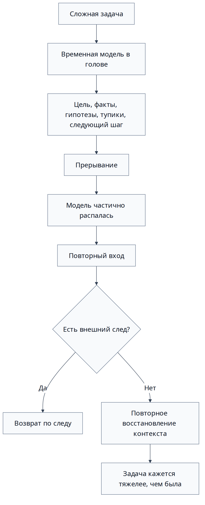{.diagram}


Читать схему нужно слева направо.

Пока человек работает, задача живет не только во внешних артефактах, но и во временной модели. В этой модели связаны цель, факты, гипотезы, проверенные тупики и следующий шаг.

Прерывание не обязано уничтожать все. Человек может помнить название задачи, часть деталей и общее ощущение. Но связность модели ослабевает. При повторном входе нужно либо восстановить ее по внешнему следу, либо собирать заново из обрывков.

Если внешнего следа нет, восстановление контекста конкурирует с самой задачей. Человек тратит силы на вход еще до того, как сделал новый шаг. Отсюда возникает знакомое ощущение: "задача какая-то тяжелая". Иногда тяжелой стала не задача, а цена возвращения к ней.

## Почему восстановление контекста — настоящая работа

Восстановление контекста может не выглядеть как работа, потому что результат не всегда виден снаружи. Код не изменился. Документ не вырос. Тикет не сдвинулся по статусу. Но внутри человек делает много операций:

- ищет прежние источники;
- вспоминает, почему выбрал один путь и отбросил другой;
- заново сопоставляет факты;
- проверяет, не изменились ли условия;
- восстанавливает причинную цепочку;
- пытается понять, какой шаг безопасен.

Это когнитивная работа. Она может быть необходимой. Проблема не в том, что она существует, а в том, что она часто повторяется без пользы.

Если каждый возврат к задаче требует заново проходить один и тот же путь, система работы теряет энергию на повторную сборку. Это похоже на разработку без сохранения промежуточного состояния: каждый запуск начинается с восстановления окружения руками.

В инженерной работе такие потери стараются не героически терпеть, а снижать конструкцией. Если сборка окружения каждый день занимает час, ее автоматизируют. Если расследование каждый раз начинается с поиска одних и тех же логов, оставляют команды и ссылки. Если состояние задачи распадается после прерывания, оставляют внешний след.

## Внешний след

**Внешний след** — это запись, схема, журнал или другой артефакт, который сохраняет часть состояния задачи вне головы.

Он не обязан быть длинным. На раннем этапе достаточно нескольких строк:

```text
Что сделал:
Что узнал:
Что исключил:
Где остановился:
Что дальше:
```

Ценность внешнего следа в том, что он обращен к будущему входу. Он пишется не для архива, не для красивой базы знаний и не для отчета. Он нужен человеку, который вернется позже и захочет быстро понять, где продолжать.

Хороший внешний след отвечает на вопрос:

```text
Что мне нужно знать, чтобы продолжить без повторного расследования?
```

Плохой внешний след отвечает только на вопрос:

```text
Как называлась задача?
```

Или превращается в другую крайность: длинную запись, которую трудно перечитать и поддерживать. Полезно, чтобы внешний след был достаточно полным для продолжения и достаточно коротким, чтобы его реально оставлять.

## Мини-словарь главы

| Понятие | Рабочее определение |
| --- | --- |
| Состояние мысли | Связная рабочая картина, которая позволяет продолжать рассуждение, а не просто помнить отдельные слова и факты. |
| Состояние задачи | То, что сейчас понятно о задаче: цель, факты, туман, гипотезы, ограничения, проверенные пути и следующий шаг. |
| Временная модель задачи | Собранное на время работы представление о том, что происходит и что имеет смысл делать дальше. |
| Потеря контекста | Распад связности между элементами задачи после прерывания или переключения. |
| Внешний след | Запись, схема или другой артефакт, который сохраняет часть состояния задачи вне головы. |
| Повторный вход | Возврат к задаче после перерыва, переключения или прерывания. |

Эти определения пока рабочие. В следующих главах они будут уточняться: глава 2 объяснит общий подход, глава 3 покажет минимальную модель человека как системы, а главы 4-6 превратят внешний след в контекст задачи, рабочий журнал и ритуалы входа-выхода.

## Инженерный взгляд на сбой

Теперь можно сделать первый шаг к теме учебника.

Если человек регулярно теряет состояние сложных задач, это не стоит объяснять только характером. Перед нами повторяющийся сбой системы работы.

Инженерный вопрос звучит так:

```text
При каких условиях состояние задачи распадается, что именно не сохраняется и какой внешний интерфейс поможет вернуться к работе дешевле?
```

Такой вопрос меняет тон разговора.

Вместо:

```text
Почему я опять не могу собраться?
```

появляется:

```text
Какая часть задачи осталась только в голове и не пережила прерывание?
```

Вместо:

```text
Надо быть дисциплинированнее.
```

появляется:

```text
Нужно оставить будущему себе цель, факты, гипотезу и следующий шаг.
```

Это не отменяет дисциплину. Но дисциплина становится не героическим давлением на себя, а частью конструкции: открыть журнал, прочитать состояние, выбрать первый проверяемый шаг, после блока оставить контрольную точку.

## Где проходит граница

Здесь нужна точная граница.

Внешний след не решает все проблемы продуктивности. Он не заменяет сон, восстановление, здоровье, нормальные приоритеты, ясные полномочия, обучение и поддержку среды. Если человек истощен, заметка не обязана превращать истощение в рабочий ресурс. Если задача бессмысленна, запись не сделает ее ценной. Если среда постоянно разрывает внимание, личный журнал поможет не всё.

Потеря контекста — только один класс сбоев. В следующих частях учебника появятся другие:

- действие может не запускаться из-за низкой управляемости;
- задача может быть слишком угрожающей;
- цена усилия может быть слишком высокой;
- тело может находиться в перегрузе;
- система обратной связи может не показывать прогресс;
- команда может разрушать фокус прерываниями;
- восстановление может быть недостаточным.

Но начинать полезно именно с потери состояния задачи. Это самый близкий и прикладной вход: его можно увидеть уже сегодня, без специальных знаний.

## Мини-практика

В ближайшей туманной задаче не нужно сразу строить сложную систему. Достаточно один раз оставить внешний след после рабочего блока.

Форма:

```markdown
## Точка продолжения

- Что сделал:
- Что узнал:
- Что исключил:
- Где остановился:
- Что открыть или проверить первым:
```

Если сил мало, оставить две строки:

```text
Где остановился:
Что сделать первым:
```

Это не идеальная система. Но даже такой след может менять будущий вход. Через несколько часов или на следующий день человек возвращается не к пустому ощущению "надо снова разобраться", а к точке продолжения.

## Короткое резюме

1. В сложной задаче теряется не только время. Может теряться состояние мысли.
2. Состояние задачи — это связная рабочая модель: цель, факты, туман, гипотезы, тупики и следующий шаг.
3. Список дел часто хранит действие, но не хранит ход понимания.
4. Восстановление контекста — настоящая когнитивная работа, но ее повторение можно снижать.
5. Первый инженерный ответ — внешний след, который помогает будущему входу.
6. Метод не заменяет отдых, здоровье, приоритеты и хорошую среду. Он помогает с конкретной проблемой: сохранением состояния задачи между подходами.

## Вопросы для самопроверки

Ответьте коротко, без красивых формулировок.

1. В какой вашей недавней задаче повторный вход был дороже самой первой проверки?
2. Что именно вы потеряли при возврате: цель, факты, гипотезу, проверенный тупик, следующий шаг или ощущение управляемости?
3. Какая запись помогла бы вам вернуться быстрее?
4. Как отличить в этой задаче потерю контекста от усталости, отсутствия смысла или плохого приоритета?

Если на эти вопросы трудно ответить, это не провал. Это признак, что состояние задачи раньше оставалось слишком внутренним. В следующих главах мы будем учиться выносить его наружу.

## Переход к следующей главе

Первый тип сбоя теперь назван: состояние задачи распадается, и человек вынужден заново собирать контекст. Следующий шаг — назвать общий подход, который занимается такими сбоями не через самоупрек, а через проектирование условий мышления и действия.

Этот подход в учебнике называется когнитивным инженерством.

---

# Глава 2. Что такое когнитивное инженерство

## От проблемы к подходу

В первой главе мы начали не с теории, а с простого сбоя: человек возвращается к сложной задаче и обнаруживает, что потерял состояние мысли. Тикет остался. Файлы остались. Логи остались. Но временная модель задачи распалась: что уже проверено, какая гипотеза главная, где был тупик, какой шаг следующий.

Такой сбой можно объяснить по-разному.

Можно сказать: "надо быть дисциплинированнее". Иногда это полезно, но часто слишком грубо.

Можно сказать: "нужно лучше планировать". Иногда да, но план не всегда хранит ход понимания.

Можно сказать: "надо вести заметки". Это ближе, но тоже недостаточно. Заметки могут быть архивом, дневником, конспектом, списком дел или рабочим интерфейсом. Форма записи сама по себе не решает проблему.

Когнитивное инженерство начинается там, где мы смотрим на повторяющийся сбой как на свойство конструкции работы.

Если человек раз за разом теряет контекст, полезно спросить не только "что с человеком не так?", а:

```text
какие условия делают потерю контекста вероятной;
какая часть состояния остается только в голове;
какой внешний интерфейс поможет продолжать дешевле;
какая обратная связь покажет, что стало лучше.
```

Это и есть переход от самоупрека к проектированию.

## Рабочее определение

В этом учебнике мы будем использовать такое определение:

```text
Когнитивное инженерство — это проектирование условий, в которых мышлению, вниманию, памяти, мотивации и действию легче работать точно, устойчиво и воспроизводимо.
```

В определении важна каждая часть.

**Проектирование** означает, что мы меняем конструкцию работы, а не только пытаемся сильнее стараться. Конструкция может быть маленькой: оставить точку продолжения после рабочего блока. Может быть средней: ввести шаблон рабочего журнала. Может быть командной: ограничить объем параллельной работы, договориться о правилах прерываний, сделать обратную связь по задачам быстрее и яснее.

**Условия** — это не только внутреннее состояние человека. Условия включают среду, инструменты, формулировку задачи, порядок входа, способ выхода, ритм работы, доступность информации, отношения с людьми, уровень угрозы и восстановление.

**Мышление, внимание, память, мотивация и действие** названы вместе, потому что в реальной работе они не живут отдельно. Человек может понимать важность задачи, но не иметь доступного первого шага. Может помнить цель, но потерять гипотезу. Может хотеть результата, но воспринимать вход как слишком дорогой. Может иметь хороший план, но быть в таком перегрузе, что план не запускается.

**Точно, устойчиво и воспроизводимо** не означает идеально. Когнитивное инженерство не обещает состояние вечной ясности. Оно стремится снизить случайность: чтобы вход в сложную работу меньше зависел от настроения, свежести, удачи и героического усилия.

## Почему здесь уместно слово "инженерство"

Слово "инженерство" здесь не означает, что человека нужно превратить в машину. И не означает, что все переживания можно свести к схеме.

Инженерный взгляд полезен по другой причине: он помогает работать с повторяющимися сбоями через системы, интерфейсы, ограничения и обратную связь.

| Инженерное слово | Как оно переводится в работу с мышлением |
| --- | --- |
| Система | Есть элементы, связи, ограничения, входы, выходы и типовые сбои. |
| Интерфейс | Человек взаимодействует с задачей через заметки, тикеты, документы, файлы, людей, ритуалы и инструменты. |
| Ограничение | Внимание, рабочая память, время, тело, контекст и социальная среда не бесконечны. |
| Обратная связь | Нужно видеть, стало ли легче входить, продолжать, проверять гипотезы, завершать и восстанавливаться. |
| Конструкция | Повторяющийся результат зависит не только от усилия, но и от устройства среды и процесса. |

Рассмотрим потерю контекста из первой главы.

Если смотреть на нее как на личную слабость, решение будет звучать так: "надо собраться".

Если смотреть на нее инженерно, появляются другие вопросы:

- где именно распадается состояние задачи;
- какие элементы остаются только в голове;
- какой минимальный внешний след нужен для повторного входа;
- когда его лучше оставлять;
- как понять, что он работает;
- не стал ли сам след новой бюрократией.

Такой подход мягче к человеку и строже к конструкции. Он не снимает ответственности, но переносит внимание с самокритики на устройство работы.

## Что становится объектом проектирования

Когнитивное инженерство не ограничивается заметками. Заметки — только один из возможных интерфейсов.

Проектировать можно разные части контура.

| Объект проектирования | Главный вопрос |
| --- | --- |
| Формулировка задачи | Понятно ли, что должно измениться и зачем? |
| Контекст задачи | Где хранятся факты, туман, гипотезы, ограничения и точка продолжения? |
| Первый шаг | Есть ли действие, которое можно выполнить без попытки решить всё сразу? |
| Ритуал входа | Как человек возвращается к задаче после перерыва? |
| Ритуал выхода | Что сохраняет состояние задачи для будущего входа? |
| Среда | Помогают ли инструменты и документы думать или создают дополнительный шум? |
| Ритм работы | Есть ли место для фокуса, восстановления и проверки результата? |
| Обратная связь | Видно ли, что изменилось после действия? |
| Командные договоренности | Не разрушает ли среда фокус постоянными прерываниями, лишней параллельной работой и неясными ожиданиями? |

Эти объекты не равны по масштабу. Иногда достаточно одной строки "что дальше". Иногда нужно перестроить шаблон задачи. Иногда проблема вообще не в личном контуре, а в команде: слишком много параллельной работы, мало ясности, задачи приходят без контекста, обратная связь запаздывает.

Когнитивное инженерство полезно тем, что не заставляет заранее выбирать один уровень. Оно предлагает смотреть на весь контур: человек, задача, среда, тело, инструменты, другие люди, обратная связь.

## Это не продуктивность любой ценой

Сразу уберем опасное недоразумение.

Когнитивное инженерство не должно быть еще одним способом выжать из человека больше работы. Если подход используется только для того, чтобы сильнее давить на себя, он теряет смысл.

Цель не в том, чтобы всегда делать больше. Цель в том, чтобы делать сложную работу более управляемой:

- вход в задачу дешевле;
- туман виднее;
- первый шаг яснее;
- повторные тупики реже;
- обратная связь ближе;
- восстановление не считается слабостью;
- границы нагрузки видны раньше, чем наступает срыв.

Иногда хороший инженерный ответ — не "работать эффективнее", а "снизить давление", "уменьшить объем параллельной работы", "отложить решение до сна", "снять угрозу оценки", "попросить контекст", "не брать новую задачу до закрытия старой".

Если система помогает только ускоряться, но не помогает останавливаться, восстанавливаться и видеть перегруз, это плохая система.

## Чем когнитивное инженерство отличается от соседних практик

Когнитивное инженерство пересекается с несколькими областями. Это нормально: сложная работа не помещается в одну полку. Но пересечение не означает совпадение.

Вопрос схемы: какие элементы соседних практик нужны когнитивному инженерству, и где оно не должно растворяться в них целиком.


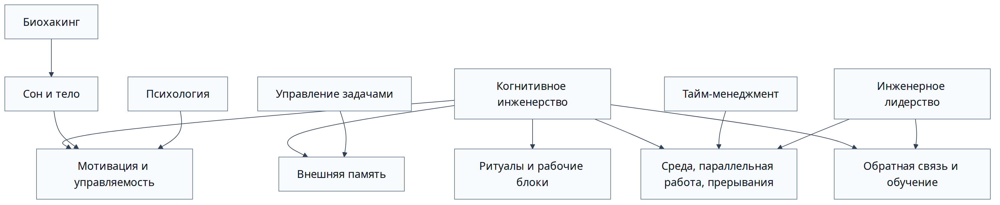{.diagram}


Эта схема не говорит, что когнитивное инженерство "лучше" соседних практик. Она показывает, что оно собирает рабочую рамку на пересечении нескольких вопросов.

Читать ее нужно от центра к границам. В центре находится не набор советов, а вопрос: как сделать действие доступнее, устойчивее и проверяемее. Внешняя память, объем параллельной работы, тело, мотивация, обратная связь и лидерская среда становятся частями этой рамки только тогда, когда помогают проектировать действие. Если они превращаются в отдельный культ метода, метрики или контроля, это уже другой разговор.

Управление задачами помогает не забывать обязательства и выделять действия. Но оно может не хранить ход исследования.

Тайм-менеджмент помогает распределять время. Но он может не объяснять, почему выделенный час уходит на повторное восстановление контекста.

Биохакинг напоминает, что сон, тело, нагрузка и восстановление влияют на доступность действия. Но он легко становится редукцией поведения к метрикам, добавкам или режиму.

Психология помогает говорить о смысле, эмоциях, страхе, избегании, идентичности и отношениях. Но когнитивное инженерство не должно притворяться психотерапией.

Инженерное лидерство работает с командной средой: параллельной работой, прерываниями, ясностью задач, безопасностью, обратной связью. Но личная когнитивная система не исчезает внутри командной.

Когнитивное инженерство задает свой вопрос:

```text
какая конструкция помогает человеку или группе лучше мыслить, действовать, учиться и восстанавливаться в конкретных условиях?
```

## Один пример в разных рамках

Возьмем тот же пример: человек не возвращается к расследованию интеграции после перерыва.

Разные подходы увидят разные стороны.

| Рамка | Какой вопрос она задаст |
| --- | --- |
| Тайм-менеджмент | Было ли выделено время на задачу? |
| Управление задачами | Есть ли следующее действие? |
| Психология | Что человек переживает при входе и чего избегает? |
| Биологический слой | Есть ли сон, восстановление, перегруз, телесное напряжение? |
| Инженерное лидерство | Не разрывает ли командная среда фокус постоянными прерываниями и избытком параллельной работы? |
| Когнитивное инженерство | Какая конструкция хранения контекста, входа и выхода может сделать возврат дешевле? |

Все эти вопросы могут быть полезны. Ошибка начинается, когда один вопрос выдают за все объяснение.

Если проблема в усталости, один рабочий журнал не спасет. Если проблема в отсутствии следующего шага, календарь не поможет. Если проблема в токсичной среде, индивидуальная система заметок будет только частичной компенсацией. Если проблема в распаде контекста, мотивационная речь не восстановит проверенные гипотезы.

Поэтому когнитивное инженерство не ищет одну магическую причину. Оно учится различать, какая часть контура сейчас ломается.

## Базовый цикл работы

В упрощенном виде когнитивно-инженерный подход можно описать так:

```text
сбой -> условия сбоя -> перегруженный элемент -> изменение конструкции -> обратная связь
```

Раскроем на примере.

**Сбой:** после перерыва сложно вернуться к задаче.

**Условия сбоя:** задача туманная, много гипотез, работа часто прерывается, состояние хранится в голове.

**Перегруженный элемент:** рабочая память и внимание вынуждены заново собирать модель.

**Изменение конструкции:** после каждого блока оставлять внешний след: что сделал, что узнал, что исключил, где остановился, что дальше.

**Обратная связь:** повторный вход стал короче; меньше повторных проверок; проще объяснить, куда ушло время; меньше неприятного ощущения "я опять ничего не понимаю".

Этот цикл будет возвращаться во всем учебнике. Позже мы применим его к мотивации, прокрастинации, обучению, восстановлению, работе с ИИ и лидерству. Логика останется похожей: не ругать симптом, а разбирать контур.

## Границы подхода

Когнитивное инженерство в этом учебнике — практическая интегративная рамка. Она полезна, пока помогает точнее видеть условия работы и проектировать более здоровый контур действия.

Но у нее есть границы.

Она не является медицинским протоколом. Если речь идет о диагнозах, лекарствах, стойком страдании, резком ухудшении состояния, риске для жизни или здоровья, нужен специалист.

Она не заменяет психотерапию. Иногда проблема лежит глубже, чем рабочий контур: травматический опыт, хроническая тревога, депрессия, тяжелые отношения, устойчивые паттерны самонаказания. Инженерная рамка может помогать описывать среду, но не должна притворяться лечением.

Она не заменяет организационные решения. Если команда живет в постоянном пожаре, с неясными приоритетами и бесконечными прерываниями, личные практики помогут только частично. Иногда нужно менять правила работы, а не только личный журнал.

Она не отменяет отдых. Если ресурс исчерпан, проектирование условий не должно становиться способом продолжать износ.

И она не является полной теорией мозга. В учебнике будут нейрофизиология, медиаторы, гормоны и контуры действия, но они нужны для более точной практической модели, а не для псевдонаучного объяснения всего через одно слово.

## Мини-практика

Возьмите один повторяющийся сбой в своей работе. Не самый драматичный, а достаточно частый.

Запишите его по пяти строкам:

```markdown
## Сбой
Что регулярно идет не так?

## Условия
Когда это чаще всего происходит?

## Что перегружено
Память, внимание, тело, среда, мотивация, обратная связь, коммуникация?

## Изменение конструкции
Что можно изменить в задаче, среде, ритуале, записи или договоренности?

## Обратная связь
Как я пойму, что стало лучше?
```

Не нужно сразу строить большую систему. Достаточно увидеть один сбой как элемент конструкции. Это уже смена режима мышления.

## Мини-словарь главы

| Понятие | Рабочее определение |
| --- | --- |
| Когнитивное инженерство | Проектирование условий, в которых мышлению, вниманию, памяти, мотивации и действию легче работать точно, устойчиво и воспроизводимо. |
| Условия работы | Среда, инструменты, формулировка задачи, ритм, тело, отношения, обратная связь и правила входа-выхода. |
| Когнитивный интерфейс | Способ, через который человек взаимодействует с задачей: журнал, схема, тикет, шаблон, список вопросов, ритуал. |
| Конструкция работы | Устройство процесса, которое делает одни действия легкими, а другие дорогими или хрупкими. |
| Обратная связь | Сигнал, по которому видно, стало ли понятнее, легче, устойчивее или безопаснее действовать. |
| Граница модели | Место, где когнитивное инженерство перестает быть достаточным и нужны медицина, психотерапия, организационное решение или отдых. |

## Вопросы для самопроверки

1. Почему когнитивное инженерство не сводится к ведению заметок?
2. Чем инженерный вопрос отличается от самоупрека?
3. Какой повторяющийся сбой в вашей работе можно описать через цикл "сбой -> условия -> перегруженный элемент -> изменение конструкции -> обратная связь"?
4. Где в вашем случае может быть граница подхода: здоровье, организация, приоритеты, отношения, недостаток навыка?

## Короткое резюме

1. Когнитивное инженерство начинается с повторяющихся сбоев мышления и действия.
2. Его задача — проектировать условия, а не требовать от человека бесконечного усилия.
3. Объектом проектирования может быть задача, среда, ритуал, журнал, обратная связь, нагрузка или командная договоренность.
4. Подход пересекается с тайм-менеджментом, управлением задачами, психологией, биологическим слоем и лидерством, но не совпадает с ними.
5. Хорошая система помогает не только ускоряться, но и останавливаться, восстанавливаться, видеть границы и снижать повторные потери.
6. У метода есть границы: он не заменяет медицину, психотерапию, организационные изменения и отдых.

## Переход к следующей главе

Теперь у нас есть рабочее определение подхода. Но чтобы проектировать условия мышления, нужно понимать хотя бы минимально, какая система работает внутри этих условий.

Дальше нужна базовая модель человека как работающей системы: внимание, рабочая память, долговременная память, тело, среда, действие и обратная связь.

---

# Глава 3. Минимальная модель человека как работающей системы

## Зачем нужна эта глава

В первой главе мы назвали проблему: человек может потерять не только время, но и состояние мысли. Во второй главе мы ввели подход: когнитивное инженерство проектирует условия, в которых мышлению, вниманию, памяти, мотивации и действию легче работать точно, устойчиво и воспроизводимо.

Теперь нужен следующий шаг. Если мы собираемся проектировать условия, надо понимать, какую систему эти условия поддерживают.

Не в полном научном смысле. Эта глава не будет анатомическим атласом мозга, обзором нейромедиаторов или теорией личности. Такой уровень появится позже, когда для него уже будет место. Сейчас нужна минимальная рабочая модель: достаточно простая, чтобы ей можно было пользоваться, и достаточно точная, чтобы не строить учебник на бытовых мифах.

Эта модель отвечает на один вопрос:

```text
что участвует в сложной работе, кроме желания "сделать задачу"?
```

Короткий ответ такой:

```text
внимание, рабочая память, долговременная память, тело, среда, оценка действия и обратная связь
```

Человек не просто видит задачу и начинает действовать. Он входит в состояние, выбирает, что важно, удерживает часть контекста, достает следы из опыта, ощущает цену действия телом, опирается на инструменты и людей, оценивает ценность, угрозу и управляемость, делает шаг или уходит от него, получает обратную связь и обновляет будущий прогноз.

Если один элемент этой системы перегружен, поведение может меняться. Поэтому когнитивное инженерство не должно начинаться с лозунга "надо лучше стараться". Оно начинается с более точного вопроса:

```text
какая часть системы сейчас несет слишком большую нагрузку?
```

## Человек как система, а не как кнопка

В бытовом языке действие часто объясняют слишком коротко:

```text
захотел -> сделал
не захотел -> не сделал
```

Для простых ситуаций этого иногда достаточно. Если человек хочет пить и рядом стоит стакан воды, путь от желания к действию короткий. Но сложная интеллектуальная работа устроена иначе.

Допустим, нужно вернуться к задаче после выходных. Тикет открыт. Файлы есть. Переписка сохранилась. Формально ничего не исчезло. Но внутри нет прежней собранной картины.

В этот момент человек не просто "не хочет работать". В системе может происходить сразу несколько вещей:

- внимание цепляется за неприятное ощущение тумана;
- рабочая память не удерживает старую гипотезу;
- долговременная память отдает отдельные фрагменты, но не всю структуру;
- тело добавляет усталость, напряжение или тревогу;
- среда не дает хорошей точки продолжения;
- действие кажется дорогим и плохо управляемым;
- обратная связь от прошлых попыток не собрана в понятный след.

Снаружи все это может выглядеть одинаково: человек медлит, переключается, открывает лишние вкладки, перечитывает старое, делает видимую активность без продвижения.

Но внутри это не один сбой. Это конфигурация системы.

Этот взгляд станет опорным для всей книги. Мы не будем объяснять поведение одной причиной там, где работает несколько слоев, и не будем добавлять научные слова ради глубины. Модель нужна не для красоты, а для выбора более точных вмешательств.

## Центральная схема главы

Схема ниже показывает минимальную рабочую модель человека в сложной задаче.


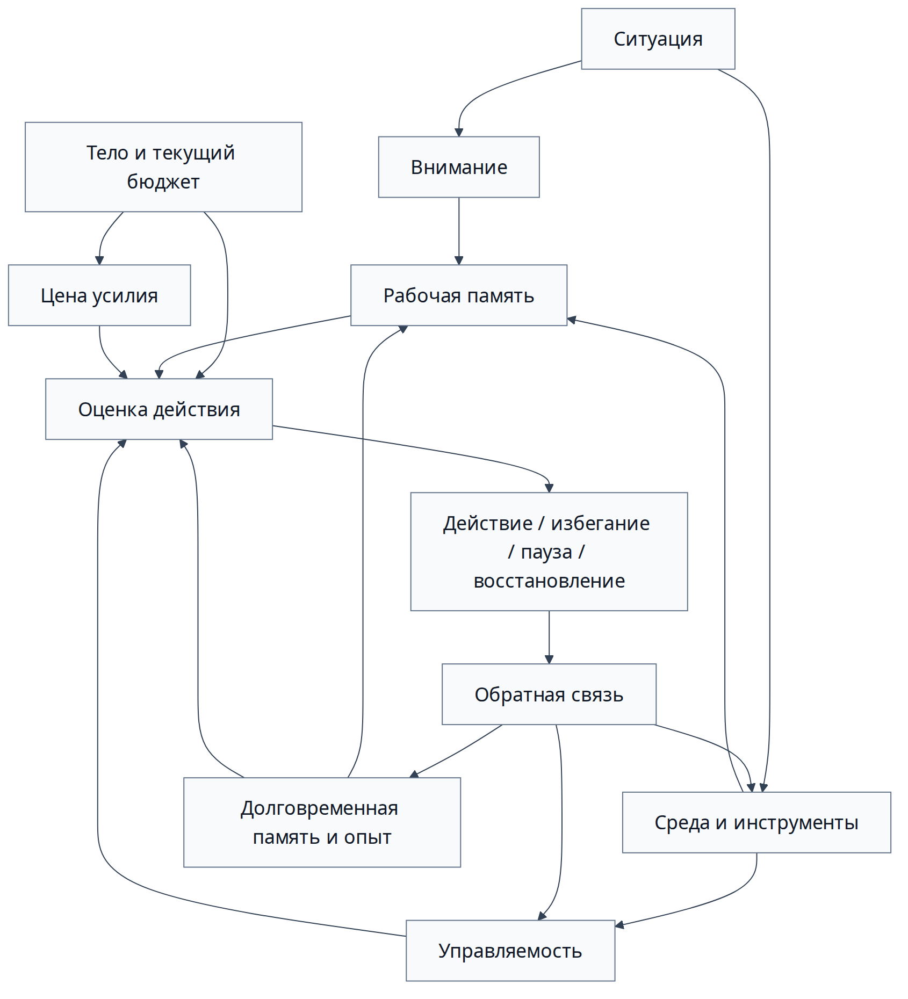{.diagram}


Эту схему нужно читать осторожно.

Она не говорит, что в голове есть отдельные коробочки с такими названиями. Она не заменяет нейронауку. Это рабочая карта для учебника. Ее задача: показать, что ситуация не идет прямо в действие. Между ними есть внимание, память, тело, среда, оценка и обратная связь.

Главная мысль схемы:

```text
действие возникает из состояния системы, а не из одного желания
```

Поэтому вмешиваться можно в разных местах:

- уменьшить шум для внимания;
- разгрузить рабочую память;
- собрать фрагменты опыта в понятные блоки;
- снизить телесную цену входа;
- изменить среду и инструменты;
- сделать первый шаг более управляемым;
- ускорить и прояснить обратную связь.

Теперь разберем элементы модели по одному.

## Внимание: ограниченный выбор значимого

Внимание часто представляют как прожектор: куда направил, там и видно. В этой метафоре есть польза, но есть и ловушка. Она создает впечатление, будто внимание можно просто приказом повернуть куда нужно.

В сложной работе внимание не только освещает объект. Оно выбирает, что считать значимым прямо сейчас, и удерживает это среди конкурентов.

Конкурентов много:

- новые сообщения;
- тревожная мысль;
- старый незакрытый вопрос;
- шум вокруг;
- открытые вкладки;
- более легкая задача;
- неприятное чувство неясности;
- желание быстро получить маленькую награду.

Когда задача туманная, внимание часто тратится не на решение, а на вход:

```text
что это была за задача?
где я остановился?
почему я сюда пришел?
какой файл открыть?
какой кусок сейчас главный?
```

Это не лень. Это цена восстановления значимого.

Внимание ограничено. Оно не может одновременно держать всю цель, все факты, все гипотезы, все риски и все следующие шаги. Поэтому первое инженерное следствие простое:

```text
если задача сложная, не стоит заставлять внимание каждый раз заново искать ее структуру
```

Полезно сделать так, чтобы важное было видно снаружи: в названии, заметке, схеме, тикете, рабочем журнале, порядке файлов, следующем шаге.

## Рабочая память: узкое окно текущей работы

Рабочая память нужна, когда человек не просто вспоминает, а удерживает и преобразует информацию прямо сейчас.

Например:

- сравнивает две гипотезы;
- держит в голове условие и исключение;
- читает код и помнит, зачем открыл этот файл;
- собирает цепочку "событие -> обработчик -> состояние -> внешний вызов";
- удерживает вопрос, пока просматривает логи.

Рабочая память не похожа на надежный склад. Она больше похожа на маленький рабочий стол. На нем можно разложить несколько предметов, сравнить их, поменять местами, собрать решение. Но если на стол высыпать слишком много, порядок развалится.

Отсюда возникает знакомое ощущение:

```text
я вроде понимаю каждый фрагмент отдельно, но вся задача не держится
```

Это особенно заметно в задачах с несколькими уровнями:

- бизнес-цель;
- текущий симптом;
- техническая причина;
- логика кода;
- данные;
- ограничения;
- риски изменения;
- следующий безопасный шаг.

Если все это держится только в голове, рабочая память легко становится бутылочным горлышком.

Отсюда первое различение:

```text
понять фрагмент != удержать систему фрагментов
```

Человек может понимать каждый отдельный лог, каждый метод, каждую фразу в тикете и все равно терять общую картину. Проблема не в глупости. Проблема в том, что система требует больше удержания, чем доступно внутреннему рабочему окну.

Инженерный вывод:

```text
рабочую память лучше использовать для мышления, а не для хранения всего состояния задачи
```

То, что нужно удерживать долго или возвращать после перерыва, лучше вынести наружу.

## Долговременная память: следы, связи и смысловые блоки

Долговременная память тоже легко представить слишком просто. Как будто внутри есть архив, где лежит папка "задача", и при возвращении ее можно открыть целиком.

В реальности человек часто достает не полную папку, а следы:

- знакомое название;
- кусок причины;
- ощущение "этот вариант уже проверял";
- имя файла;
- место в коде;
- один важный лог;
- эмоциональный след "там было неприятно";
- общий вывод без доказательства.

Эти следы могут быть полезны, но они не всегда собираются обратно в структуру. Поэтому после перерыва человек может помнить детали и все равно не понимать, где продолжать.

Здесь помогает понятие чанка.

**Чанк** в этом учебнике: смысловой блок, который объединяет несколько элементов в одну рабочую единицу.

Например, для новичка фраза:

```text
проверить обработку timeout после изменения состояния
```

может состоять из многих отдельных элементов: timeout, состояние, обработчик, порядок операций, побочный эффект, повторная попытка.

Для опытного инженера это уже один блок: типовой класс проблемы. Он удерживается легче, потому что внутри есть сжатая структура.

Чанки не появляются магически. Они формируются через опыт, объяснение, повторение, обратную связь и хорошую внешнюю фиксацию. Когда человек оставляет рабочий журнал, он не только помогает будущему входу. Он может постепенно превращать хаотичные фрагменты в более устойчивые смысловые блоки.

Инженерный вывод:

```text
стоит помогать памяти собирать не россыпь деталей, а связные блоки смысла
```

Для этого полезны схемы, названия гипотез, короткие выводы после проверки, списки "что уже исключено" и явные формулировки текущего понимания.

## Тело: не фон, а часть доступности действия

До нейрофизиологии мы еще не дошли, но одну вещь нужно ввести уже сейчас: тело не является фоном для мышления.

Сложная работа меняется в зависимости от состояния организма:

- недосып может делать удержание контекста хрупким;
- усталость часто повышает цену входа;
- тревога может усиливать внимание к угрозе;
- хроническое напряжение может сужать доступность гибкого мышления;
- восстановление может делать тот же первый шаг легче.

Это не значит, что каждое сложное чувство надо сразу объяснять биохимией. Наоборот, в этой главе мы специально не будем говорить про кортизол, дофамин, норадреналин и аллостаз. Эти темы требуют отдельной подготовки.

Сейчас достаточно ввести практическое различение:

```text
задача может быть той же самой, но цена входа в нее меняется вместе с состоянием тела
```

Один и тот же шаг утром после сна и вечером после перегруза может ощущаться как две разные задачи. Формально действие одинаковое. Системная цена разная.

Тело участвует в оценке:

- насколько действие сейчас допустимо;
- не слишком ли высока ставка ошибки;
- есть ли силы удерживать неопределенность;
- можно ли терпеть отсутствие быстрого результата;
- безопасно ли входить в трудный контакт с задачей.

Если это игнорировать, легко сделать неправильный вывод:

```text
я не сделал, значит у меня нет мотивации
```

Иногда точнее сказать:

```text
цена действия сейчас стала слишком высокой для текущего состояния системы
```

Это не оправдание и не капитуляция. Это более точная диагностика. Иногда нужен первый маленький шаг. Иногда нужен внешний след. Иногда нужна помощь. Иногда нужен сон.

## Среда: внешний контур мышления

Среда в этой модели не декорация. Среда участвует в мышлении.

К среде относятся:

- заметки;
- тикеты;
- документы;
- диаграммы;
- структура файлов;
- открытые вкладки;
- календарь;
- чек-листы;
- команды в терминале;
- тесты;
- рабочие ритуалы;
- договоренности с людьми;
- правила прерываний;
- инструменты поиска и проверки.

Среда не думает вместо человека. Но она меняет, какую работу приходится делать внутри головы.

Плохо устроенная среда может заставлять человека каждый раз вспоминать, искать, заново собирать, держать лишнее, угадывать правила, восстанавливать старые решения.

Хорошо устроенная среда делает часть состояния видимой:

- цель задачи;
- где лежит контекст;
- что уже проверено;
- какие гипотезы живы;
- какие тупики закрыты;
- какой следующий шаг;
- как понять, что шаг сработал.

Это и есть внешний контур мышления.

Внешний контур не нужен для того, чтобы человек меньше думал. Он нужен, чтобы думать о главном, а не тратить рабочую память на восстановление служебного состояния.

Сравним две среды.

Первая:

```text
тикет с общим названием;
несколько ссылок в переписке;
логи искались вручную;
выводы остались в голове;
следующий шаг не записан.
```

Вторая:

```text
тикет содержит цель;
рабочая заметка содержит факты, гипотезы и исключенные варианты;
ссылки на логи сохранены;
последний вывод записан;
следующий шаг сформулирован как проверка.
```

Задача может быть одной и той же. Но для человека это две разные когнитивные среды. Во второй возвращение обычно дешевле.

Инженерный вывод:

```text
если часть работы повторно тратится на восстановление контекста, эту часть стоит превратить во внешний интерфейс
```

## Оценка действия: почему желание не равно запуску

Теперь можно аккуратно ввести действие.

Пока без подробной теории мотивации. Она начнется в главе 7. Здесь нам нужен только общий принцип:

```text
действие зависит не только от ценности результата
```

Человек может считать результат важным и все равно не входить в задачу. Почему?

Потому что система оценивает не только "стоит ли результат того". Она оценивает еще несколько вещей:

- насколько понятен контекст;
- насколько высока угроза ошибки, стыда, провала, конфликта или перегруза;
- сколько усилия потребуется;
- есть ли управляемый первый шаг;
- меняло ли похожее действие что-то раньше;
- есть ли обратная связь;
- выдержит ли текущее состояние тела эту неопределенность.

Поэтому фраза "я хочу результата" не гарантирует действия.

Например, человек хочет закрыть сложный баг. Ценность высокая. Но если он не понимает, где продолжать, боится сломать важный поток, устал, не видит первого безопасного шага и помнит прошлые бесплодные попытки, действие может не запуститься.

В такой ситуации мотивационная речь звучит мимо:

```text
просто соберись, задача важная
```

Задача и так важная. Проблема в другом: вход слишком дорогой, угроза высока, управляемость низкая.

Эти понятия будут подробно разобраны позже. Сейчас достаточно поставить их на карту. Когда мы дойдем до мотивации, прокрастинации, выгорания и лидерства, мы будем возвращаться к этой схеме.

## Обратная связь: как система учится

После действия система не возвращается в исходную точку. Она обновляется.

Если человек сделал маленькую проверку и получил понятный результат, меняется несколько вещей:

- появляется новый факт;
- часть тумана исчезает;
- одна гипотеза усиливается или слабеет;
- следующий шаг становится яснее;
- управляемость может вырасти;
- будущий вход может стать дешевле.

Если действие было хаотичным и без фиксации, обратная связь теряется. Человек вроде работал, но система почти не обучилась. Завтра снова придется разбираться, что произошло.

Поэтому в когнитивном инженерстве важен не только запуск действия, но и то, как результат возвращается в систему.

Хорошая обратная связь отвечает хотя бы на один вопрос:

- что стало понятнее;
- что можно исключить;
- что изменилось в задаче;
- какой следующий шаг теперь имеет смысл;
- стало ли действие более управляемым;
- что сохранить для будущего входа.

Плохая обратная связь оставляет только ощущение:

```text
я что-то делал, но не понимаю, продвинулся ли
```

Это особенно опасно в туманных задачах. Без видимой обратной связи действие хуже обучает и легко превращается в расход сил.

Инженерный вывод:

```text
после сложного действия важно сохранять не только результат, но и изменение понимания
```

## Где можно вмешиваться

Теперь соберем модель в практическую карту.


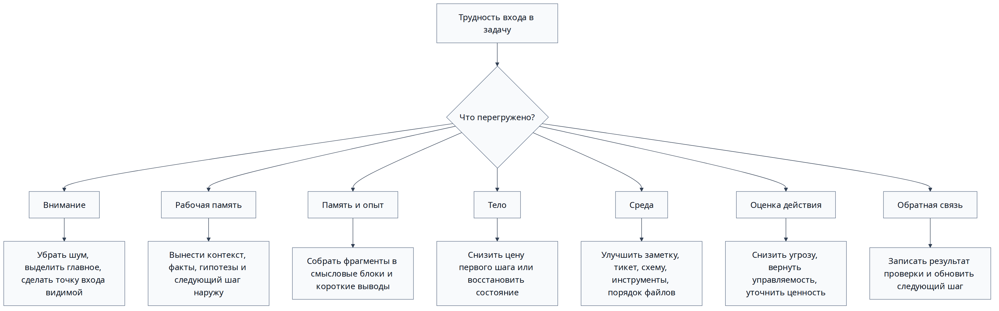{.diagram}


Эта схема не является диагностикой всего человека. Она помогает не бросаться к одному объяснению.

Если вход в задачу тяжелый, можно спросить:

- я не вижу главное?
- я держу слишком много в голове?
- у меня есть фрагменты, но нет структуры?
- текущее состояние тела делает шаг слишком дорогим?
- среда заставляет меня заново искать контекст?
- шаг кажется неуправляемым или угрожающим?
- прошлые действия не оставили понятной обратной связи?

Один и тот же симптом может требовать разных ответов.

## Пример: возврат к интеграционной задаче

Вернемся к примеру из первой главы.

Есть интеграционная задача: объект иногда остается в промежуточном состоянии. Нужно понять, где ломается цепочка.

Человек возвращается после перерыва и чувствует туман.

Разложим по модели.

### Внимание

Внимание не знает, за что зацепиться. На экране тикет, код, логи, переписка. Все потенциально важно. Человек открывает одно, потом другое, потом третье. Внешне это выглядит как суета. Внутри внимание пытается найти главный вход.

Что помогает: явная строка "сейчас проверяем гипотезу X".

### Рабочая память

В голове нужно удерживать цепочку:

```text
событие пришло -> обработчик вызвался -> состояние изменилось -> внешний вызов ушел -> timeout -> повторная обработка
```

Если цепочка не вынесена наружу, рабочая память быстро переполняется. Человек перечитывает тот же код, потому что теряет, зачем его открыл.

Что помогает: короткая схема цепочки и список проверенных звеньев.

### Долговременная память

Память дает следы:

```text
кажется, событие не терялось
там был correlation_id
я уже смотрел timeout
```

Но следы не равны доказательству. Без записи трудно понять, что именно было проверено.

Что помогает: блок "проверено и исключено".

### Тело

Если человек устал, цена входа выше. Туман переживается не нейтрально, а как угроза: "сейчас опять утону". Это может запустить избегание.

Что помогает: снизить ставку входа до маленькой проверки, например "10 минут только восстановить карту, не решать".

### Среда

Если в тикете нет фактов и гипотез, среда не держит состояние. Человек вынужден делать повторное расследование.

Что помогает: рабочая заметка с целью, фактами, гипотезой, ссылками на логи и следующим шагом.

### Оценка действия

Ценность результата высокая, но управляемость низкая. Поэтому действие не запускается легко.

Что помогает: первый управляемый шаг:

```text
открыть обработчик timeout и проверить, меняется ли состояние до внешнего вызова или после него
```

### Обратная связь

После проверки важно не просто закрыть вкладку, а обновить состояние задачи:

```text
Проверка: состояние меняется до внешнего вызова.
Вывод: если timeout, объект уже может остаться в промежуточном состоянии.
Следующий шаг: проверить ветку компенсации и повторной обработки.
```

Так действие может превращаться в обучение системы. Будущий вход может стать дешевле.

## Почему эта модель ведет к внешнему контуру

Теперь видно, почему следующие главы будут посвящены контексту задачи, рабочему журналу и ритуалам входа-выхода.

Это не отдельная тема про "вести заметки". Это прямое следствие модели.

Если внимание ограничено, стоит сделать главное видимым.

Если рабочая память узкая, стоит вынести состояние задачи наружу.

Если долговременная память хранит следы, но не всегда структуру, стоит оставлять связные выводы.

Если тело меняет цену входа, стоит проектировать первый шаг так, чтобы он был посильным для текущего состояния.

Если среда участвует в мышлении, ее стоит строить как интерфейс, а не как свалку.

Если действие зависит от управляемости, стоит не только хотеть результата, но и видеть шаг, который реально меняет ситуацию.

Если обратная связь обучает систему, ее стоит фиксировать.

Отсюда появляется рабочая формула:

```text
внешний контур нужен не для памяти вообще, а для сохранения состояния действия
```

Эта формула разворачивается в три последовательных инструмента.

| Следующий шаг | Какой элемент модели он разгружает | Что читатель получит |
| --- | --- | --- |
| Контекст задачи | Внимание, рабочую память и долговременную память. | Способ вынести из головы цель, факты, туман, гипотезы, ограничения и следующий шаг. |
| Рабочий журнал | Рабочую память, обратную связь и историю проверок. | Способ вести состояние задачи во времени, не теряя ход рассуждения после пауз. |
| Ритуалы входа и выхода | Переключение внимания, цену повторного входа и сохранение обратной связи. | Повторяемый цикл: открыть журнал, восстановить состояние, выбрать первый проверяемый шаг, оставить контрольную точку. |

Так главы 4-6 становятся не набором советов по заметкам, а первым практическим применением модели человека как работающей системы.

## Мини-практика

Возьмите одну задачу, к которой тяжело возвращаться. Не выбирайте самую болезненную. Подойдет обычная туманная задача: баг, текст, учебный материал, проектное решение, разговор, исследование.

Разложите ее по семи строкам.

```markdown
## Внимание
Что сейчас конкурирует за внимание и где главный вход?

## Рабочая память
Что я пытаюсь держать в голове, хотя это лучше вынести наружу?

## Долговременная память
Какие фрагменты я помню, но не могу собрать в структуру?

## Тело
Какая сейчас цена входа: усталость, напряжение, тревога, перегруз?

## Среда
Что в заметках, тикете, файлах или инструментах помогает или мешает?

## Оценка действия
Что делает первый шаг ценным, угрожающим, дорогим или неуправляемым?

## Обратная связь
Что я запишу после следующего шага, чтобы будущий вход был легче?
```

Эта практика не требует большой системы. Она учит видеть задачу не как один комок, а как конфигурацию элементов.

## Мини-словарь главы

| Понятие | Рабочее определение |
| --- | --- |
| Внимание | Ограниченный выбор и удержание значимого среди конкурирующих стимулов, мыслей и задач. |
| Рабочая память | Узкое окно, где информация временно удерживается и преобразуется для текущего действия. |
| Долговременная память | Сеть следов, связей, знаний, навыков и смысловых блоков, а не идеальный архив. |
| Чанк | Смысловой блок, который объединяет несколько элементов в одну рабочую единицу. |
| Телесный бюджет | Рабочее обозначение текущей доступности действия с учетом усталости, напряжения, восстановления и нагрузки. |
| Среда | Внешние условия и артефакты, через которые человек работает с задачей: заметки, инструменты, люди, порядок, ритуалы. |
| Внешний контур мышления | Часть системы мышления, вынесенная в среду: записи, схемы, журналы, чек-листы, интерфейсы, договоренности. |
| Оценка действия | Сводная оценка ценности, угрозы, цены усилия, управляемости и контекста перед запуском или отказом от действия. |
| Обратная связь | Информация после действия, которая меняет понимание, опыт, управляемость и будущий прогноз. |

## Вопросы для самопроверки

1. Почему в сложной задаче желание результата не гарантирует запуск действия?
2. Чем рабочая память отличается от долговременной памяти?
3. Почему человек может помнить отдельные фрагменты задачи и все равно потерять ее состояние?
4. Как среда может быть частью мышления, не "думая вместо человека"?
5. Что значит "сохранить изменение понимания", а не только результат действия?
6. Какой элемент системы чаще всего перегружается в ваших туманных задачах: внимание, рабочая память, тело, среда, оценка действия или обратная связь?

## Короткое резюме

1. Человек в сложной работе не является кнопкой "захотел -> сделал".
2. Действие возникает из системы: внимание, память, тело, среда, оценка и обратная связь.
3. Рабочая память полезна для мышления, но плохо подходит для хранения полного состояния сложной задачи.
4. Долговременная память может сохранить фрагменты, но не обязательно сохраняет структуру рассуждения.
5. Тело меняет цену входа в задачу, поэтому усталость и тревога являются частью рабочей модели.
6. Среда может снижать или повышать когнитивную цену задачи.
7. Хорошая обратная связь сохраняет не только "что сделано", но и "что стало понятнее".
8. Следующие главы про контекст задачи, рабочий журнал и ритуалы входа-выхода вырастают прямо из этой модели.

## Переход к следующей главе

Теперь у нас есть минимальная модель человека как работающей системы. Из нее прямо следует следующий вопрос:

```text
если рабочая память узкая, внимание ограничено, а состояние задачи распадается, что именно нужно вынести из головы?
```

Глава 4 ответит на этот вопрос. Она разберет контекст задачи: цель, факты, туман, гипотезы, ограничения, проверенные тупики и следующий шаг. Затем главы 5-6 покажут, как этот контекст вести во времени через рабочий журнал и как встроить его в повторяемые входы и выходы из задачи.

---

# Глава 4. Контекст задачи: что нужно вынести из головы

## От модели к первому инструменту

В главе 3 мы собрали минимальную модель человека как работающей системы. Внимание ограничено. Рабочая память узкая. Долговременная память хранит следы, но не всегда возвращает целую структуру. Тело меняет цену входа. Среда может помогать или мешать. Действие зависит не только от желания, но и от того, насколько понятен и управляем следующий шаг.

Из этой модели сразу следует практический вопрос:

```text
если сложная задача не должна целиком жить в голове, что именно нужно вынести наружу?
```

Не все подряд. Если записывать каждую мысль, заметка станет такой же туманной, как сама задача. Если записывать только ближайшее действие, будет потерян ход понимания. Полезен средний слой: карта контекста задачи.

Первый практический объект учебника:

```text
контекст задачи как внешний объект
```

Он нужен, чтобы человек мог не только помнить, что задача существует, но и возвращаться в ее состояние: зачем она нужна, что уже известно, где туман, какие гипотезы проверяются, какие пути закрыты, что считается продвижением и какой шаг открыть первым после паузы.

## Задача, действие и состояние задачи

Начнем с различения, без которого рабочие заметки быстро превращаются в кашу.

| Объект | Пример | Что хранит |
| --- | --- | --- |
| Задача | "Разобраться, почему объект иногда остается в промежуточном состоянии". | Контейнер проблемы. |
| Действие | "Сравнить логи по одному успешному и одному неуспешному `correlation_id`". | Ближайший физический или проверяемый шаг. |
| Состояние задачи | "Событие не теряется до обработчика; подозрение сместилось на обработку timeout после изменения состояния". | Текущее понимание, из которого можно продолжать. |

Список дел чаще всего хранит действие. Тикет хранит задачу. Но в туманных задачах решающее значение имеет третий слой: состояние задачи.

Именно оно чаще всего теряется после прерывания.

Можно открыть тот же тикет и тот же файл, но не восстановить состояние:

```text
что мы уже знаем?
какая гипотеза была сильной?
какой путь закрыт?
почему следующий шаг был именно таким?
```

Поэтому глава 4 не про красивое оформление заметок. Она про сохранение состояния задачи в форме, к которой можно вернуться.

## Состояние задачи как внешний объект

Схема ниже показывает, из чего состоит контекст туманной задачи.


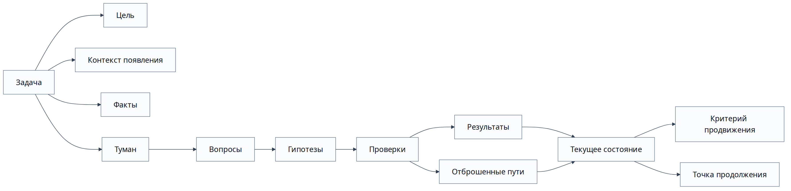{.diagram}


Читать схему нужно так:

1. Задача не равна списку действий.
2. Контекст начинается с цели и причины появления задачи.
3. Факты и туман нужно разделить.
4. Туман становится рабочим, когда превращается в вопросы и гипотезы.
5. Рабочие проверки меняют текущее состояние задачи.
6. Отброшенные пути сохраняются, чтобы не ходить по кругу.
7. Точка продолжения связывает текущий подход со следующим.

Эта схема не обязана каждый раз превращаться в большую форму. Для простой задачи хватит двух строк. Но если задача туманная, дорогая или часто прерывается, отсутствие такой карты часто оплачивается повторным восстановлением контекста.

## Цель: что должно измениться

Цель отвечает на вопрос:

```text
что должно стать иначе после выполнения задачи?
```

Плохая цель слишком общая:

```text
Разобраться с интеграцией.
```

Она не говорит, что значит "разобраться", где граница работы и какой результат нужен.

Рабочая цель точнее:

```text
Понять, почему объект иногда остается в промежуточном состоянии, и выбрать безопасный способ исправления.
```

В этой формулировке уже есть несколько полезных вещей:

- объект проблемы;
- повторяемый симптом;
- не только поиск причины, но и выбор безопасного исправления;
- граница: задача не сводится к "поглядеть логи", она должна привести к пониманию и решению.

Цель не должна быть длинной. Но она должна защищать от случайной активности. Если цель не ясна, человек может делать технически полезные действия, которые не продвигают именно эту задачу.

Например, можно полдня улучшать логирование, читать код соседнего сервиса и обсуждать архитектуру ретраев. Все это может быть полезно. Но если цель — понять конкретный промежуточный статус, нужно видеть, какое действие приближает именно к этой цели.

## Контекст появления: почему задача возникла

Задача редко появляется из пустоты. У нее есть причина:

- пользователь столкнулся с ошибкой;
- метрика изменилась;
- тест начал падать;
- бизнес-процесс завис;
- команда готовит изменение;
- в архитектуре появился риск;
- старое решение стало мешать новому.

Контекст появления помогает понять смысл задачи и ее ограничения.

Например:

```markdown
## Контекст появления
В поддержке появились обращения: объект создан в системе A, но связанный объект в системе B иногда отсутствует. Повтор не всегда воспроизводит проблему. Нужно понять, где возникает промежуточное состояние, потому что ручная правка рискованна.
```

Такая запись сразу объясняет, почему нельзя просто "переотправить все", почему важна безопасность исправления и почему задача не сводится к локальному багу в одном файле.

Если контекст появления не записан, через несколько дней часто остается только действие. Человек помнит "посмотреть интеграцию", но не помнит, почему именно это важно и какая цена ошибки.

## Факты: на что уже можно опираться

Факт — это не то, что кажется вероятным. Факт — это то, что сейчас принято как подтвержденная опора.

Примеры фактов:

```markdown
## Факты
- событие приходит из системы A;
- запись в базе создается;
- объект в системе B создается не всегда;
- в неуспешном сценарии виден timeout внешнего вызова;
- проблема не воспроизводится на каждом запуске.
```

Факты нужны для двух вещей.

Во-первых, они уменьшают повторные проверки. Если уже проверено, что событие доходит до обработчика, не нужно каждый раз начинать с вопроса "а приходит ли событие вообще?".

Во-вторых, они защищают от смешивания знания и предположения. В туманной задаче мозг быстро склеивает "мы видели один случай" и "так происходит всегда". Хорошая карта контекста помогает спросить:

```text
это подтверждено или пока только похоже?
```

Факт может измениться. Если позже выяснится, что проверка была неполной, запись стоит обновить. Но пока факт используется как опора, его лучше отделять от гипотез.

## Туман: что пока не имеет формы

Туман — это не провал мышления. Это материал задачи.

Туман начинается как неприятное общее ощущение:

```text
непонятно, что происходит
```

В таком виде с ним трудно работать. Его полезно дробить на вопросы:

```markdown
## Туман
- что происходит после timeout?
- меняется ли состояние до внешнего вызова или после него?
- есть ли компенсация при частичном успехе?
- можно ли безопасно повторить операцию?
- почему проблема не воспроизводится каждый раз?
```

Так неопределенность становится видимой. Человек больше не пытается "понять все". Он видит набор мест, где модели пока нет.

Это может снижать сопротивление. Часто задача кажется невыносимой именно потому, что туман не разделен. Он переживается как один большой комок. После разделения появляется рабочая форма:

```text
не "я ничего не понимаю", а "у меня есть пять вопросов, и первый можно проверить"
```

## Гипотезы: временные объяснения, а не убеждения

Гипотеза — это временное объяснение, которое направляет проверку.

Она не обязана быть правой. Хорошая гипотеза полезна уже тем, что подсказывает, что смотреть дальше.

Например:

```markdown
## Гипотезы
1. Состояние меняется до внешнего вызова, а timeout оставляет объект в промежуточном статусе.
2. Timeout обрабатывается как частичный успех.
3. Ретрай отсутствует или не видит промежуточное состояние.
4. Есть гонка между обновлением состояния и повторной обработкой.
```

Опасность гипотез в том, что человек быстро начинает защищать понравившееся объяснение. Поэтому рядом с гипотезой нужна проверка:

```markdown
## Проверка
Открыть код перехода состояния и посмотреть, где именно меняется статус: до внешнего вызова, после успеха или в блоке обработки ошибки.
```

Рабочая проверка меняет состояние задачи:

- усилить гипотезу;
- ослабить гипотезу;
- отбросить гипотезу;
- породить новый вопрос;
- уточнить следующий шаг.

Если проверка ничего не меняет, возможно, это была не проверка, а движение внутри тумана.

## Отброшенные пути: защита от хождения по кругу

В туманной задаче важно сохранять не только то, что сработало. Стоит сохранять и то, что уже не сработало.

Пример:

```markdown
## Отброшенные пути
- Потеря события до обработчика: проверено по логам двух сценариев, событие доходит.
- Ошибка создания записи в базе: запись создается до внешнего вызова.
- Гипотеза "API всегда недоступен": в успешном сценарии тот же endpoint отвечает нормально.
```

Это не мусор. Это карта закрытых дверей.

Если отброшенные пути не фиксировать, будущий повторный вход часто начинается с того же самого:

```text
а может, событие вообще не приходит?
```

Иногда такой повтор нужен, если появились новые данные. Но по умолчанию системе лучше не платить за уже сделанную работу второй раз.

Отброшенный путь особенно полезен, когда:

- задача идет несколько дней;
- к ней возвращаются после перерывов;
- в ней участвует несколько людей;
- есть много похожих причин;
- гипотезы легко перепутать.

## Ограничения: что нельзя сломать

Ограничения — это часть контекста, а не внешний бюрократический слой.

Они отвечают на вопрос:

```text
что нельзя нарушить, пока мы решаем задачу?
```

Например:

```markdown
## Ограничения
- нельзя повторить операцию без проверки идемпотентности;
- нельзя потерять уже созданные объекты;
- нельзя менять порядок событий без миграционного плана;
- исправление должно быть безопасным для уже зависших объектов;
- публичное описание не должно раскрывать внутренние рабочие детали.
```

Ограничения помогают не перепутать "нашел быстрое действие" с "нашел допустимое действие".

В сложных задачах ограничение часто меняет саму форму решения. Если нельзя безопасно повторять операцию, ретрай перестает быть очевидным ответом. Если нельзя ломать совместимость, локальный фикс может оказаться недостаточным. Если нельзя раскрывать приватные детали, пример для учебника должен быть обезличен.

## Критерий продвижения: как увидеть прогресс до финала

В туманной задаче прогресс часто наступает раньше финального решения.

Прогресс есть, если:

- стало ясно, какая гипотеза слабее;
- закрыт один путь;
- найдено место, где расходятся успешный и неуспешный сценарии;
- сформулирован более точный вопрос;
- появился безопасный следующий шаг;
- снизилась неопределенность;
- стало понятно, кому и какой вопрос задать.

Поэтому полезно заранее записывать критерий продвижения:

```markdown
## Критерий продвижения
Задача продвинулась, если после следующей проверки станет ясно, меняется ли состояние до внешнего вызова или после него.
```

Такой критерий защищает от ощущения "я ничего не сделал", когда финального исправления еще нет. В исследовательских и инженерных задачах промежуточное знание — реальный результат.

Но критерий продвижения должен быть конкретным. Формулировка:

```text
стало понятнее
```

слишком туманна. Лучше:

```text
после проверки мы сможем исключить потерю события до обработчика или оставить ее основной гипотезой
```

## Точка продолжения: подарок будущему входу

Точка продолжения — это то, что будущий человек должен сделать первым после возвращения.

Она должна быть физической или проверяемой.

Хорошие точки продолжения:

```text
открыть обработчик timeout в файле X и проверить порядок изменения состояния
сравнить два лога по `correlation_id`: успешный и неуспешный
запустить тест Y с включенным логированием переходов состояния
спросить владельца системы B, является ли операция идемпотентной
```

Плохая точка продолжения:

```text
продолжить разбираться
```

Она почти не снижает цену входа. Человеку снова придется решать, с чего начать.

Точка продолжения особенно важна перед перерывом:

- встречей;
- переключением на срочную задачу;
- концом дня;
- выходными;
- ожиданием ответа от другого человека.

Если у вас есть только 30 секунд перед переключением, запишите хотя бы:

```text
Следующий шаг: открыть X и проверить Y.
```

Это маленькая строка, но она сохраняет направление.

## Минимальная карта контекста

Полная карта полезна не всегда. Иногда она слишком тяжелая. В когнитивном инженерстве хорошая форма должна быть соразмерна задаче.

Минимальная версия:

```markdown
## Цель

## Что известно

## Что непонятно

## Гипотезы

## Проверено / исключено

## Следующий проверяемый шаг
```

Еще короче:

```text
Знаю:
Не знаю:
Дальше:
```

Самая короткая версия перед уходом:

```text
Остановился на:
Первым делом открыть/проверить:
```

Главное — не полнота формы, а функция:

```text
помочь будущему себе восстановить состояние задачи дешевле, чем заново расследовать
```

Если заметка стала тяжелее самой задачи, форма плохая. Ее нужно упростить.

## Полный пример карты контекста

Ниже пример для условной задачи. Он намеренно обезличен: нам важна структура, а не рабочие детали.

```markdown
# Задача: объект остается в промежуточном состоянии

## Цель
Понять, почему объект иногда остается в промежуточном состоянии, и выбрать безопасный способ исправления.

## Контекст появления
Появились обращения: объект создан в системе A, но связанный объект в системе B иногда отсутствует. Ручная правка рискованна, потому что непонятно, можно ли безопасно повторять операцию.

## Факты
- Событие из системы A доходит до обработчика.
- Запись в базе создается.
- Объект в системе B создается не всегда.
- В неуспешном сценарии виден timeout внешнего вызова.
- Проблема не воспроизводится на каждом запуске.

## Туман
- Что происходит после timeout?
- Где именно меняется состояние?
- Есть ли компенсация при частичном успехе?
- Можно ли безопасно повторить операцию?

## Гипотезы
1. Состояние меняется до внешнего вызова, и timeout оставляет объект в промежуточном статусе.
2. Timeout обрабатывается как частичный успех.
3. Ретрай отсутствует или не видит промежуточное состояние.

## Проверено / исключено
- Потеря события до обработчика: маловероятно, событие видно в логах обоих сценариев.
- Ошибка создания записи в базе: маловероятно, запись создается до внешнего вызова.

## Ограничения
- Нельзя повторять операцию без проверки идемпотентности.
- Нельзя потерять уже созданные объекты.
- Исправление должно быть безопасным для уже зависших объектов.

## Критерий продвижения
После следующей проверки должно стать ясно, меняется ли состояние до внешнего вызова или после результата внешнего вызова.

## Точка продолжения
Открыть код перехода состояния и обработку ошибки внешнего вызова. Сравнить порядок операций в успешном и timeout-сценарии.
```

Эта карта не решает задачу. Но она меняет состояние работы. Теперь повторный вход может начинаться не с пустого "что вообще происходит?", а с конкретного положения: что известно, что не известно и какой шаг продолжает рассуждение.

## Как понять, что карта контекста хорошая

Хорошая карта контекста проходит пять проверок.

| Проверка | Вопрос |
| --- | --- |
| Возврат | Смогу ли я через день понять, где остановился? |
| Различение | Отделены ли факты от гипотез и тумана? |
| Неповторение | Видно ли, что уже проверено и что не нужно повторять без причины? |
| Безопасность | Видны ли ограничения и цена ошибки? |
| Действие | Есть ли следующий проверяемый шаг? |

Если хотя бы на один вопрос ответ "нет", карта может выглядеть красиво, но плохо выполнять работу.

## Типовые ошибки

### Ошибка 1. Записать только действие

```text
Проверить timeout.
```

Через день эта запись почти бесполезна. Какой timeout? Почему он важен? Что уже известно? Что будет результатом проверки?

Лучше:

```text
Гипотеза: timeout внешнего вызова происходит после изменения состояния.
Проверка: найти порядок операций в обработчике.
```

### Ошибка 2. Записать поток мыслей без структуры

Длинный поток может быть полезен во время размышления, но он плохо работает как точка возврата. Будущий человек вынужден перечитывать все, чтобы найти текущее состояние.

Лучше иметь короткий блок:

```text
Текущее состояние:
Факты:
Гипотезы:
Следующий шаг:
```

### Ошибка 3. Смешать факт и предположение

```text
Timeout ломает объект.
```

Это может быть правдой, а может быть гипотезой. Пока не проверено, лучше писать:

```text
Гипотеза: timeout оставляет объект в промежуточном состоянии.
```

### Ошибка 4. Не фиксировать закрытые пути

Если не записывать исключенные варианты, человек снова и снова возвращается к тем же вопросам. Это создает ощущение работы, но не обязательно продвижение.

### Ошибка 5. Оставить слишком общий следующий шаг

```text
Продолжить расследование.
```

Это не точка продолжения. Точка продолжения должна открыть дверь:

```text
Сравнить порядок изменения состояния в успешном и timeout-сценарии.
```

## Мини-практика

Выберите одну туманную задачу и составьте минимальную карту контекста.

```markdown
## Цель
Что должно измениться?

## Факты
Что уже подтверждено?

## Туман
Что пока непонятно?

## Гипотезы
Какие объяснения стоит проверить?

## Проверено / исключено
Куда уже не нужно возвращаться без новых данных?

## Ограничения
Что нельзя нарушить?

## Критерий продвижения
Что должно стать яснее после ближайшей проверки?

## Точка продолжения
Что открыть, сравнить, спросить или проверить первым?
```

Не стремитесь заполнить красиво. Задача формы — не впечатлить, а помочь будущему входу.

## Мини-словарь главы

| Понятие | Рабочее определение |
| --- | --- |
| Контекст задачи | Внешне зафиксированное состояние понимания: цель, факты, туман, гипотезы, проверки, ограничения и следующий шаг. |
| Состояние задачи | Текущая модель того, что происходит и что имеет смысл делать дальше. |
| Факт | Подтвержденная опора, на которую можно временно опираться. |
| Туман | Область неопределенности, где пока нет достаточной модели. |
| Вопрос | Проверяемая формулировка тумана. |
| Гипотеза | Временное объяснение, которое направляет проверку. |
| Отброшенный путь | Проверенное направление, к которому не нужно возвращаться без новых данных. |
| Ограничение | Условие безопасности, совместимости, приватности или допустимости решения. |
| Критерий продвижения | Признак, по которому видно, что ближайшая проверка уменьшила неопределенность. |
| Точка продолжения | Конкретный первый шаг для будущего входа в задачу. |

## Вопросы для самопроверки

1. Чем задача отличается от действия и состояния задачи?
2. Почему "непонятно" полезно превращать в вопросы?
3. Почему отброшенные пути являются частью контекста, а не мусором?
4. Чем критерий продвижения отличается от финального результата?
5. Почему точка продолжения должна быть физической или проверяемой?

## Короткое резюме

1. Для туманной задачи недостаточно хранить ближайшее действие.
2. Контекст задачи — это состояние понимания, вынесенное наружу.
3. Факты, туман и гипотезы нужно разделять.
4. Проверка должна менять состояние задачи, иначе это не проверка, а движение внутри тумана.
5. Отброшенные пути защищают от хождения по кругу.
6. Критерий продвижения помогает видеть результат до финального решения.
7. Точка продолжения может снижать цену будущего входа.
8. Хорошая карта контекста соразмерна задаче: чем больше тумана и прерываний, тем больше смысла в явной структуре.

## Переход к следующей главе

Теперь есть первая внешняя форма: цель, факты, туман, гипотезы, проверки, ограничения, критерий продвижения и точка продолжения.

Но разовая карта контекста еще не является рабочей системой. В следующей главе мы соберем эти элементы в рабочий журнал: внешний контур, который сопровождает задачу от входа до выхода и помогает не терять состояние между рабочими блоками.

---

# Глава 5. Рабочий журнал как внешний контур мышления

## От карты контекста к журналу

В главе 4 мы разобрали, что именно нужно выносить из головы в сложной задаче: цель, факты, туман, гипотезы, проверки, ограничения, критерий продвижения и точку продолжения. Это уже меняет рамку работы: задача меньше похожа на бесформенное ощущение и больше на внешний объект, к которому можно вернуться.

Но у карты контекста есть ограничение: она показывает состояние задачи в один момент времени.

Сложная работа не стоит на месте. Каждый рабочий блок что-то меняет:

- один факт подтверждается;
- одна гипотеза становится слабее;
- один путь закрывается;
- появляется новое ограничение;
- меняется следующий шаг;
- становится понятнее, что именно считать продвижением.

Если эти изменения не фиксировать, карта быстро стареет. Вчера она помогала войти в задачу, а сегодня уже не показывает, почему мысль свернула именно сюда. Поэтому после карты контекста нужен следующий инструмент: рабочий журнал.

Рабочий журнал — это способ вести состояние задачи во времени.

Он отвечает не только на вопрос:

```text
что сейчас известно?
```

но и на вопросы:

```text
что изменилось после последнего блока?
почему мы больше не проверяем этот путь?
где остановилась мысль?
что открыть первым после возвращения?
что из этой задачи можно перенести в будущие задачи?
```

Речь не о красивом ведении заметок и не о том, чтобы превратить каждую задачу в административный отчет. Рабочий журнал нужен для более простой и более важной вещи: чтобы задача переживала прерывания.

## Что такое рабочий журнал

Рабочий журнал — это внешний контур мышления, который хранит ход работы с задачей так, чтобы человек мог продолжить ее после паузы без повторного восстановления всей модели с нуля.

В этом определении важны четыре слова.

**Внешний** — часть состояния находится не в голове, а в записи, схеме, таблице, тикете, документе или другом артефакте.

**Контур** — журнал не лежит отдельно от работы. Он включен в цикл: открыть задачу, понять состояние, сделать проверку, записать результат, оставить точку продолжения.

**Ход работы** — журнал хранит не только итог, но и путь: что проверяли, что узнали, что исключили, почему следующий шаг именно такой.

**Продолжить** — главный критерий качества записи. Хорошая запись помогает следующему входу. Плохая запись может быть подробной, умной и аккуратной, но не отвечать на вопрос: "что мне делать дальше?"

Можно сказать еще короче:

```text
рабочий журнал — это интерфейс к продолжающейся задаче
```

Он нужен не для памяти вообще, а для конкретного будущего действия.

## Главный читатель журнала

У рабочего журнала есть особый читатель. Это не начальник, не команда, не внешний рецензент и не архив будущей истории проекта.

Главный читатель рабочего журнала — вы сами через два часа, завтра утром, после встречи, после выходных или после срочного переключения.

Этот будущий человек будет в другом состоянии:

- у него уже не будет свежего следа рабочей памяти;
- часть деталей смешается;
- эмоциональная уверенность "я же понял" ослабнет;
- ближайший шаг снова станет неочевидным;
- задача может начать выглядеть более тяжелой, чем была на самом деле.

Поэтому рабочую запись лучше делать дружелюбной не к идеальному читателю, а к уставшему человеку, который пытается снова войти в задачу.

Проверка простая:

```text
смогу ли я по этой записи начать следующий блок за несколько минут?
```

Если ответ "нет", запись может быть ценной для архива, но как рабочий журнал она не справилась.

## Чем журнал отличается от похожих форм

Рабочий журнал часто путают с дневником, списком дел, конспектом или отчетом. Все эти формы полезны, но у них разные функции.

| Форма записи | Для чего подходит | Почему это не рабочий журнал |
| --- | --- | --- |
| Дневник | Личная рефлексия, переживания, смысл, самонаблюдение. | Может честно описывать состояние человека, но не хранить проверяемое состояние задачи. |
| Список дел | Перечень действий, напоминания, короткое управление делами. | Обычно не хранит цель, факты, гипотезы, результаты проверок и причины выбора следующего шага. |
| Конспект | Сохранение внешней информации: статьи, лекции, документации, обсуждения. | Может хранить знания, но не показывать, как эти знания изменили текущую задачу. |
| Отчет | Коммуникация результата другим людям. | Часто сглаживает путь, убирает тупики и пишет итог так, будто он был ясен с самого начала. |
| Рабочий журнал | Продолжение задачи без потери состояния. | Хранит ход проверок, изменения понимания, закрытые пути и точку продолжения. |

Без этого различения рабочий журнал легко начинает выполнять чужую функцию.

Если вести его как дневник, можно получить много честного текста о том, как тяжело и мутно, но не получить следующего действия.

Если вести его как список дел, можно сохранить шаги, но потерять, зачем эти шаги нужны.

Если вести его как конспект, можно накопить много информации, но не понять, какая часть информации изменила решение.

Если вести его как отчет, можно написать гладкий итог, но потерять шероховатость исследования: почему один вариант был отброшен, где был риск, какая проверка изменила направление.

Рабочий журнал не обязан быть красивым. Он должен быть продолжабельным.

## Что журнал должен хранить

Журнал не должен хранить все мысли подряд. Это быстро делает его непригодным.

Его базовая задача — хранить изменения состояния задачи.

Минимальный набор после рабочего блока:

```text
сделал -> узнал -> исключил -> остановился -> дальше
```

Эти пять полей различают пять разных вещей.

| Поле | Что фиксирует | Зачем нужно |
| --- | --- | --- |
| Сделал | Физическое или интеллектуальное действие. | Помогает видеть расход времени и не путать активность с результатом. |
| Узнал | Изменение модели задачи. | Показывает, что стало понятнее после действия. |
| Исключил | Закрытый путь или ослабленная гипотеза. | Защищает от повторных проверок и хождения по кругу. |
| Остановился | Место, где работа была прервана. | Помогает восстановить состояние без перечитывания всего пути. |
| Дальше | Первый проверяемый шаг следующего входа. | Может снижать цену начала и уменьшать сопротивление. |

В формуле нет лишней сложности, но она дисциплинирует мышление.

Например, запись:

```text
смотрел логи
```

почти ничего не сохраняет.

Запись:

```text
Сделал: сравнил логи успешного и неуспешного сценария.
Узнал: в неуспешном сценарии timeout появляется после перевода объекта в промежуточное состояние.
Исключил: событие не теряется до обработчика.
Остановился: нужно понять, что делает обработка ошибки внешнего вызова.
Дальше: открыть код перехода состояния и проверить ветку timeout.
```

сохраняет состояние задачи. По ней можно продолжать.

## Жизненный цикл рабочего журнала

Журнал сопровождает задачу не одной записью, а циклом.


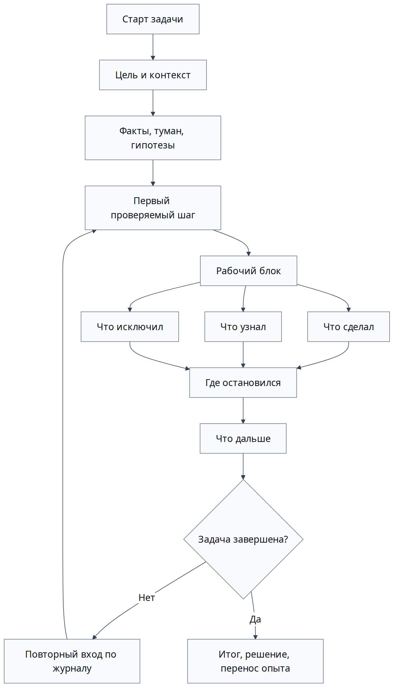{.diagram}


Схему нужно читать так.

Сначала журнал создает вход: цель, контекст, факты, туман, гипотезы и первый проверяемый шаг.

Затем каждый рабочий блок обновляет состояние задачи: что сделано, что стало понятно, что можно исключить.

Перед выходом журнал оставляет будущую точку входа: где остановился и что дальше.

При повторном входе человек может не начинать с пустого места. Он открывает журнал, восстанавливает состояние и продолжает с первого проверяемого шага.

Когда задача завершена, журнал не обязан исчезать. Он может сохранить итог, решение и переносимый опыт: что теперь пригодится в похожих задачах.

## Три момента записи

Вести журнал постоянно, во время каждой мысли, обычно не нужно. Это перегружает работу и превращает инструмент в шум.

Гораздо полезнее выделить три момента.


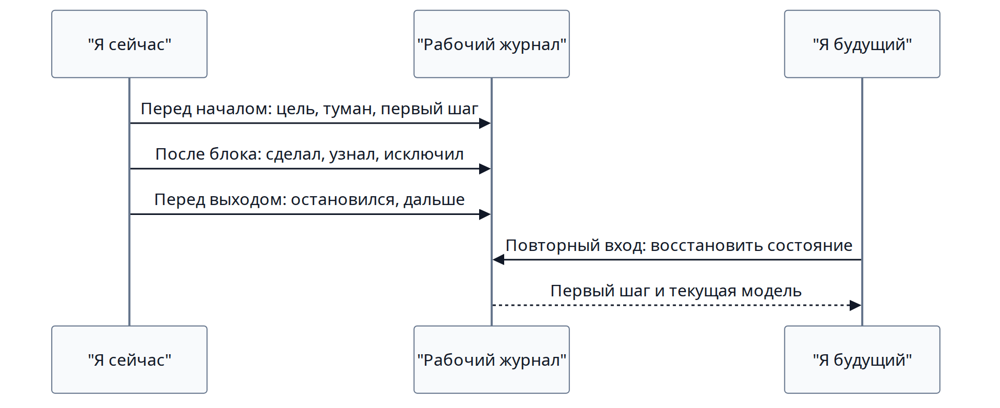{.diagram}


Эту схему нужно читать не как обязанность писать больше, а как распределение записи по точкам максимальной пользы.

Перед началом журнал помогает уменьшить туман: что я делаю, зачем и каким первым шагом. После блока он помогает сохранить изменение состояния: что стало известно и что больше не нужно проверять. Перед выходом он оставляет будущему входу не архив размышлений, а точку продолжения. Поэтому главный критерий такой: запись должна помогать будущему читателю журнала быстрее войти в действие, а не заставлять его заново разбирать весь ход мыслей.

### Перед началом

Перед началом не нужно писать много. Нужно зафиксировать направление.

Минимально:

```markdown
## Перед началом
- Что пытаюсь сделать:
- Что сейчас непонятно:
- Первый проверяемый шаг:
```

Это помогает защититься от бесформенного входа. Если первый шаг не получается сформулировать, возможно, задача еще слишком туманна. Тогда первым действием становится не "решить", а "сделать неопределенность видимой".

### После рабочего блока

После блока важно отделить действие от изменения понимания.

```markdown
## После блока
- Сделал:
- Узнал:
- Исключил:
```

Человек может много сделать и мало узнать. Может сделать мало, но резко уточнить модель. Может не найти решение, но закрыть неправильный путь. В туманной задаче все это разные типы результата.

### Перед выходом

Перед выходом журнал готовит будущий вход.

```markdown
## Выход
- Остановился на:
- Дальше:
```

Если времени почти нет, эти две строки важнее красивого итога.

Плохой выход:

```text
потом продолжить
```

Хороший выход:

```text
Дальше: открыть обработчик timeout и проверить, меняется ли состояние до внешнего вызова или после него.
```

Хороший выход не требует героической памяти от будущего человека.

## Минимальный шаблон

Базовый шаблон рабочего журнала может быть таким:

```markdown
# Рабочий журнал задачи

## Карта задачи

### Цель

### Контекст появления

### Факты

### Туман / вопросы

### Гипотезы

### Проверено / исключено

### Ограничения

### Критерий продвижения

### Точка продолжения

## Лог работы

### YYYY-MM-DD HH:MM

#### Перед началом
- Что пытаюсь сделать:
- Что сейчас непонятно:
- Первый проверяемый шаг:

#### После блока
- Сделал:
- Узнал:
- Исключил:
- Остановился на:
- Дальше:

## Завершение
- Что решено:
- Что изменилось:
- Что можно перенести в похожие задачи:
- Какие долги остались:
```

Это полная форма. Ее не нужно применять всегда.

Для короткого рабочего блока достаточно:

```markdown
## Итог блока
- Сделал:
- Узнал:
- Остановился:
- Дальше:
```

Для очень короткого выхода:

```text
Остановился:
Первым делом:
```

Главное правило:

```text
форма должна быть легче, чем цена повторного восстановления контекста
```

Если на задачу уйдет десять минут, полная форма бессмысленна. Если задача длится несколько дней, часто прерывается и содержит неопределенность, отсутствие журнала будет стоить дороже.

## Пример: та же инженерная задача

Продолжим обезличенный пример из главы 4.

Есть задача: объект иногда остается в промежуточном состоянии. Мы уже собрали карту контекста: цель, факты, туман, гипотезы, ограничения и точку продолжения.

Теперь посмотрим, как это превращается в рабочий журнал.

```markdown
# Рабочий журнал: объект остается в промежуточном состоянии

## Карта задачи

### Цель
Понять, почему объект иногда остается в промежуточном состоянии, и выбрать безопасный способ исправления.

### Контекст появления
Появились обращения: объект создан в системе A, но связанный объект в системе B иногда отсутствует. Ручная правка рискованна, потому что непонятно, можно ли безопасно повторять операцию.

### Факты
- Событие из системы A доходит до обработчика.
- Запись в базе создается.
- Объект в системе B создается не всегда.
- В неуспешном сценарии виден timeout внешнего вызова.

### Туман / вопросы
- Где именно меняется состояние?
- Что происходит после timeout?
- Есть ли компенсация при частичном успехе?
- Можно ли безопасно повторить операцию?

### Гипотезы
1. Состояние меняется до внешнего вызова, и timeout оставляет объект в промежуточном статусе.
2. Timeout обрабатывается как частичный успех.
3. Ретрай отсутствует или не видит промежуточное состояние.

### Проверено / исключено
- Потеря события до обработчика: маловероятно, событие видно в логах обоих сценариев.
- Ошибка создания записи в базе: маловероятно, запись создается до внешнего вызова.

### Ограничения
- Нельзя повторять операцию без проверки идемпотентности.
- Нельзя потерять уже созданные объекты.
- Исправление должно быть безопасным для уже зависших объектов.

### Точка продолжения
Открыть код перехода состояния и обработку ошибки внешнего вызова.

## Лог работы

### 2026-05-24 10:20

#### Перед началом
- Что пытаюсь сделать: проверить гипотезу, что состояние меняется до внешнего вызова.
- Что сейчас непонятно: где именно происходит переход в промежуточное состояние.
- Первый проверяемый шаг: найти обработчик операции и порядок вызовов.

#### После блока
- Сделал: нашел обработчик операции и место перехода состояния.
- Узнал: состояние меняется до внешнего вызова в систему B.
- Исключил: гипотезу, что промежуточное состояние появляется только после ошибки внешнего API.
- Остановился на: нужно понять, что делает код при timeout внешнего вызова.
- Дальше: открыть ветку обработки ошибки внешнего вызова и проверить, есть ли компенсация или ретрай.

### 2026-05-24 13:40

#### Перед началом
- Что пытаюсь сделать: проверить обработку timeout.
- Что сейчас непонятно: считается ли timeout частичным успехом, ошибкой или поводом для повтора.
- Первый проверяемый шаг: посмотреть ветку обработки ошибки внешнего вызова.

#### После блока
- Сделал: проверил ветку timeout и поискал ретрай.
- Узнал: timeout логируется как ошибка, но состояние не откатывается; отдельного ретрая для промежуточного состояния нет.
- Исключил: гипотезу, что ретрай есть, но не виден в логах.
- Остановился на: нужен безопасный вариант восстановления для уже зависших объектов.
- Дальше: проверить идемпотентность операции в системе B и возможность безопасного повторного вызова.
```

Обратите внимание: журнал не является финальным решением. Он не подменяет код, тесты, обсуждение с владельцами системы или план исправления.

Но он делает несколько важных вещей.

Во-первых, сохраняет траекторию. Видно, почему мы пришли к текущей гипотезе.

Во-вторых, отделяет результат действия от самого действия. "Проверил timeout" превращается в "узнал, что timeout не откатывает состояние".

В-третьих, помогает защищаться от повторов. Нет смысла снова искать ретрай, если уже проверено, что его нет, пока не появились новые данные.

В-четвертых, оставляет следующий вход. После паузы меньше шансов снова начинать с вопроса, с чего начать.

## Журнал как интерфейс, а не хранилище

У рабочего журнала есть соблазнительная ловушка: если он полезен, хочется сделать его полным.

Добавить теги, статусы, таблицы, ссылки, шаблоны, категории, оценку времени, уровни риска, историю всех команд, отдельные разделы для решений, вопросов и мыслей.

Иногда это действительно нужно. Но базовый критерий другой:

```text
помогает ли эта часть записи следующему действию?
```

Журнал — это интерфейс к задаче. Интерфейсу лучше давать нужное состояние в нужный момент.

Если запись слишком короткая, будущий вход снова дорогой.

Если запись слишком длинная, будущий вход тоже дорогой, потому что человеку нужно читать собственный архив, чтобы найти живую точку работы.

Полезная форма находится между этими крайностями.


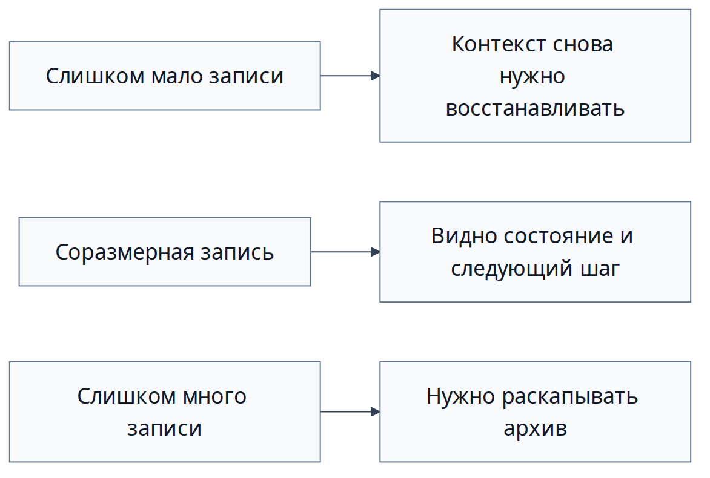{.diagram}


Практический вопрос:

```text
что будущему мне нужно увидеть за первые 1-3 минуты?
```

Ответ на этот вопрос важнее любой универсальной структуры.

## Масштабы журнала

Полезно, чтобы рабочий журнал масштабировался.

### Версия на 30 секунд

Когда нужно срочно выйти из задачи:

```markdown
Остановился: проверил логи, событие до обработчика доходит.
Первым делом: открыть обработчик timeout и проверить порядок изменения состояния.
```

Это лучше, чем ничего. Такая запись не объясняет всю задачу, но сохраняет направление.

### Версия на 3 минуты

Когда рабочий блок завершился нормально:

```markdown
## Итог блока
- Сделал: сравнил успешный и неуспешный сценарий.
- Узнал: timeout происходит после промежуточного состояния.
- Исключил: потерю события до обработчика.
- Дальше: проверить обработку timeout и наличие компенсации.
```

Этого часто достаточно для ежедневной работы.

### Полная версия

Когда задача новая, дорогая, туманная или длится несколько дней, нужна карта задачи плюс лог работы:

```text
цель
контекст появления
факты
туман
гипотезы
проверено / исключено
ограничения
критерий продвижения
лог блоков
точка продолжения
итог
```

Полная версия нужна не потому, что "так правильно", а потому, что цена ошибки и повторного входа выше цены записи.

## Как журнал помогает качеству решений

Рабочий журнал часто воспринимают как инструмент продуктивности. Это верно, но неполно.

Он помогает не только быстрее возвращаться к задаче, но и лучше думать.

### Видно, как менялась модель

Когда гипотезы и проверки записаны, можно увидеть, что именно изменило мнение.

Без журнала человек часто помнит только текущую уверенность:

```text
кажется, дело в timeout
```

С журналом видно основание:

```text
timeout появляется после изменения состояния; ретрая не найдено; потеря события до обработчика исключена
```

Это не делает вывод автоматически верным, но делает его проверяемым.

### Меньше повторов

Туманные задачи часто дают ложное ощущение продвижения через повторение. Человек снова открывает те же логи, снова проверяет тот же путь, снова приходит к той же неопределенности.

Журнал фиксирует закрытые двери.

Важно: "исключил" не означает "навсегда доказал невозможность". Это означает:

```text
без новых данных не возвращаемся сюда как к первому пути
```

Так журнал помогает защищать внимание.

### Легче обсуждать задачу

Даже если журнал пишется для себя, он помогает разговаривать с другими.

Вместо:

```text
я там смотрел, кажется, проблема где-то после вызова
```

можно сказать:

```text
сейчас известно вот что; вот эти две гипотезы закрыты; открытый вопрос — идемпотентность повторного вызова
```

Это уже не поток впечатлений, а состояние расследования.

### Понятнее, куда ушло время

В сложной интеллектуальной работе часть результата невидима. Человек мог не закрыть задачу, но сузить пространство поиска вдвое.

Журнал может делать такой прогресс видимым:

- какие проверки были сделаны;
- какие варианты закрыты;
- что стало яснее;
- почему финальное решение пока невозможно;
- что нужно для следующего шага.

Это важно не только для отчетности. Это может снижать внутреннее ощущение "я весь день ничего не сделал", когда на самом деле был выполнен кусок исследовательской работы.

## Когда журнал особенно полезен

Полная форма журнала нужна не всегда. Она особенно полезна, когда есть хотя бы один из признаков:

- задача туманная и неизвестно, с чего начать;
- задача длится больше одного рабочего блока;
- есть риск прерываний;
- много гипотез и похожих причин;
- высока цена ошибки;
- нужно объяснить ход рассуждения другому человеку;
- задача связана с несколькими системами или людьми;
- уже было ощущение "я снова возвращаюсь к тому же месту";
- нужно сохранить переносимый опыт для будущих похожих задач.

Если задача простая, журнал может быть коротким:

```text
сделал -> дальше
```

Когнитивное инженерство не требует максимальной формы. Оно требует формы, соответствующей нагрузке.

## Когда журнал не решит проблему

Рабочий журнал помогает с потерей контекста. Но не всякая трудность входа в задачу является потерей контекста.

Журнал не заменяет сон. Если человек физически истощен, запись может помочь понять следующий шаг, но не вернет ресурс сложного контроля.

Журнал не заменяет приоритизацию. Если задач слишком много и все одновременно срочные, фиксация контекста снизит потери, но не решит конфликт фокуса.

Журнал не заменяет безопасную среду. Если человека постоянно дергают, наказывают за вопросы или требуют невозможного, личная техника не исправит системную причину.

Журнал не заменяет медицинскую или психологическую помощь. Если проблема связана с длительным истощением, депрессивными состояниями, тревогой или другими клиническими факторами, рабочая запись может быть поддержкой, но не лечением.

Это важная граница. Цель рабочего журнала — не выжать из человека больше. Его цель — не заставлять память и внимание снова и снова выполнять одну и ту же восстановительную работу.

## Типовые ошибки

### Ошибка 1. Вести журнал как архив

Архив отвечает на вопрос:

```text
что когда-то происходило?
```

Рабочий журнал отвечает на вопрос:

```text
как продолжить сейчас?
```

Если запись не помогает ответить на второй вопрос, ее нужно сжать или перестроить.

### Ошибка 2. Писать только действия

```markdown
- посмотрел логи
- открыл код
- спросил коллегу
```

Это показывает активность, но не показывает изменение понимания.

Лучше:

```markdown
- Сделал: сравнил логи.
- Узнал: timeout появляется после изменения состояния.
- Исключил: потерю события до обработчика.
```

### Ошибка 3. Писать только выводы

Иногда человек пишет:

```text
проблема, скорее всего, в обработке timeout
```

Но не пишет, почему.

Через день такая запись может стать опасной. Она сохраняет уверенность, но не сохраняет основание. Лучше рядом держать проверку, которая привела к выводу.

### Ошибка 4. Не фиксировать остановку

Многие записи заканчиваются на результате:

```text
нашел место изменения состояния
```

Но следующий вход все равно дорогой, потому что не ясно, что делать первым.

Нужно дописывать:

```text
Дальше: проверить ветку timeout и наличие компенсации.
```

### Ошибка 5. Делать форму слишком тяжелой

Если журнал требует десять полей после каждого маленького действия, его быстро бросят.

Форма должна иметь аварийный режим:

```text
Остановился:
Дальше:
```

Лучше устойчиво вести короткий журнал, чем неделю вести идеальный и потом перестать.

### Ошибка 6. Прятать туман

Иногда хочется писать журнал так, будто все уже ясно. Это делает запись аккуратной, но снижает ее пользу.

Рабочий журнал должен разрешать фразы:

```text
не понимаю, почему это воспроизводится только иногда
пока не ясно, где меняется состояние
эта гипотеза слабая, но проверяемая
```

Туман, записанный в рабочей форме, может перестать быть просто неприятным состоянием и стать списком проверяемых мест.

## Мини-практика

Выберите одну задачу, к которой вы уже возвращались несколько раз и каждый раз тратили время на разгон.

Создайте для нее минимальный рабочий журнал.

```markdown
# Рабочий журнал: ...

## Карта задачи

### Цель
Что должно измениться?

### Факты
Что уже подтверждено?

### Туман
Что пока непонятно?

### Гипотезы
Какие объяснения проверяются?

### Проверено / исключено
Куда не возвращаться без новых данных?

### Точка продолжения
Что открыть, проверить, сравнить или спросить первым?

## Итог текущего блока
- Сделал:
- Узнал:
- Исключил:
- Остановился:
- Дальше:
```

Не пытайтесь сразу создать идеальную систему. Цель упражнения — оставить будущему себе рабочий вход.

После следующего возвращения к задаче проверьте журнал по трем вопросам:

1. Сколько времени заняло понять, где вы остановились?
2. Был ли следующий шаг достаточно конкретным?
3. Что нужно убрать или добавить, чтобы следующий вход стал дешевле?

## Мини-словарь главы

| Понятие | Рабочее определение |
| --- | --- |
| Рабочий журнал | Внешний контур, который хранит ход работы с задачей для продолжения после паузы. |
| Внешний контур мышления | Артефакты, записи, схемы и процедуры, которые принимают на себя часть когнитивной работы. |
| Снимок состояния задачи | Короткая фиксация текущей модели: что известно, что непонятно, что проверяется, что дальше. |
| Лог работы | Последовательность рабочих блоков с действиями, результатами, исключениями и точками продолжения. |
| Будущий читатель | Сам автор записи в другом состоянии и в другой момент времени. |
| Точка продолжения | Конкретное первое действие для повторного входа. |
| Переносимый опыт | То, что из текущей задачи пригодится для похожих задач в будущем. |

## Вопросы для самопроверки

1. Чем рабочий журнал отличается от списка дел?
2. Почему "что сделал" и "что узнал" нужно разделять?
3. Зачем фиксировать "что исключил"?
4. Почему главный читатель журнала — будущий автор?
5. В чем разница между архивом и рабочим интерфейсом к задаче?
6. Когда полная форма журнала оправдана, а когда достаточно двух строк?

## Короткое резюме

1. Карта контекста показывает состояние задачи; рабочий журнал показывает, как это состояние меняется во времени.
2. Рабочий журнал нужен не для красоты и не для архива, а для продолжения работы.
3. Минимальная формула после блока: сделал, узнал, исключил, остановился, дальше.
4. Запись должна помогать будущему человеку войти в задачу за минуты, а не заново проводить расследование.
5. Хороший журнал сохраняет не только выводы, но и основания выводов.
6. Журнал должен быть соразмерен задаче: чем больше тумана, цены ошибки и прерываний, тем полезнее явная структура.
7. Если запись стала тяжелее повторного входа, форму нужно упростить.
8. Рабочий журнал помогает с контекстом и неопределенностью, но не заменяет сон, приоритизацию, восстановление и здоровую рабочую среду.

## Переход к следующей главе

Теперь у нас есть две вещи: карта контекста задачи и рабочий журнал, который ведет эту карту во времени.

Но даже хороший журнал не работает сам по себе. Его стоит встроить в повторяемые действия: как входить в задачу, как начинать первый проверяемый шаг, как выходить перед переключением и как оставлять контрольную точку будущему себе.

Дальше понадобятся ритуалы входа и выхода: не магические привычки, а короткие процедуры, которые соединяют внимание, контекст, журнал и действие.

---

# Глава 6. Ритуалы входа и выхода

## От артефакта к действию

В главе 4 мы собрали карту контекста задачи. В главе 5 превратили ее в рабочий журнал: внешний контур, который ведет состояние задачи во времени.

Но даже хороший журнал сам по себе не гарантирует работы.

Можно иметь прекрасную заметку и все равно каждый раз начинать с пустого экрана. Можно знать, что нужно оставить точку продолжения, и все равно уходить из задачи в середине мысли. Можно понимать пользу внешнего контура, но пользоваться им только в спокойные дни, когда он меньше всего нужен.

Чтобы журнал стал частью работы, нужен повторяемый способ входить и выходить из задачи.

В учебнике такой способ называется ритуалом.

Слово "ритуал" здесь не означает торжественность, мистику или красивую привычку. Ритуал в когнитивном инженерстве — это короткая повторяемая последовательность действий, которая может снижать цену переключения и помогает запустить нужный режим работы.

Ритуал нужен не для того, чтобы "быть дисциплинированным". Он нужен, чтобы каждый раз не изобретать заново:

- как войти в туманную задачу;
- как выбрать первый шаг;
- как не пытаться решить все сразу;
- как выйти без потери состояния;
- как оставить будущему себе нормальный вход.

Если рабочий журнал — это внешний контур мышления, то ритуалы входа и выхода — это способ этот контур замкнуть.

## Зачем нужен ритуал после журнала

Журнал хранит состояние задачи. Но человек должен к нему обратиться, прочитать правильные места, выбрать действие и обновить запись после блока.

Если этого не происходит, журнал превращается в архив.

Схема простая:


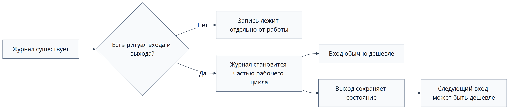{.diagram}


Главная мысль главы:

```text
хороший выход из задачи — это уже начало следующего входа
```

Мы обычно думаем о входе и выходе как о двух разных действиях. Сначала "собраться и начать", потом "закончить и закрыть". В туманных задачах это не так. Если выход был плохим, следующий вход часто становится дорогим. Если выход оставил контрольную точку, следующий вход может начинаться с уже подготовленного состояния.

## Что такое ритуал

Ритуал — это повторяемая короткая последовательность действий, которая переводит человека из одного режима в другой.

В этой книге нас интересуют два режима:

- рассеянное состояние перед задачей;
- рабочее состояние внутри задачи.

Ритуал входа переводит человека из первого во второе.

Ритуал выхода переводит задачу из живого рабочего состояния во внешний след, из которого ее можно будет поднять позже.

Сразу отделим ритуал от бюрократии.

| Понятие | Что это | Как проверить |
| --- | --- | --- |
| Ритуал | Короткая последовательность, которая помогает снижать цену входа, выхода или переключения. | После нее легче начать, продолжить или вернуться. |
| Бюрократия | Заполнение формы ради формы или ради ощущения контроля. | Она не помогает действию и увеличивает сопротивление. |
| Привычка | Автоматизирующееся повторение поведения в похожих условиях. | Срабатывает все легче при стабильном контексте. |
| Рабочий протокол | Явная процедура для ситуации, где важно не пропустить шаг. | Помогает действовать точнее, особенно при сложности или риске. |

Ритуал входа и выхода находится между привычкой и протоколом. Он должен быть достаточно коротким, чтобы его реально повторять, и достаточно явным, чтобы не терять важные элементы: цель, состояние, туман, первый шаг, контрольную точку.

## Ритуал входа

Ритуал входа нужен, когда задача уже существует, но человек еще не находится в ее состоянии.

Типичная ситуация:

```text
открыл задачу, вроде помню, что там было, но внутри туман
```

Плохой вход пытается сразу начать с действия:

```text
надо просто открыть код и уже что-нибудь делать
```

Иногда это срабатывает. Но в туманной задаче такой вход часто приводит к лишнему блужданию. Человек начинает с того места, которое легче открыть, а не с того, которое действительно продолжает рассуждение.

Хороший вход начинается с восстановления состояния.

Минимальный ритуал:

```text
1. Открыть рабочий журнал.
2. Прочитать цель и текущее состояние.
3. Назвать текущую зону тумана.
4. Выбрать один первый проверяемый шаг.
5. Ограничить рабочий блок по времени или объему.
```

Разберем каждый пункт.

### 1. Открыть рабочий журнал

Это звучит слишком просто, но именно здесь контур часто рвется.

Человек помнит, что у него "где-то есть заметка", но начинает с кода, чата, почты, тикета или внутреннего монолога. Через несколько минут он снова собирает контекст вручную.

Первый шаг ритуала:

```text
сначала открыть внешний след
```

Это не поклон системе заметок. Это признание ограничения: рабочая память не обязана хранить полное состояние сложной задачи после паузы.

### 2. Прочитать цель и текущее состояние

Вход не должен превращаться в перечитывание всего архива. Достаточно увидеть:

- зачем задача нужна;
- где она сейчас находится;
- что было последним существенным изменением понимания;
- какая точка продолжения была оставлена.

Если журнал устроен хорошо, это занимает минуты, а не полчаса.

Если для входа нужно прочитать двадцать экранов текста, проблема не в слабой дисциплине. Проблема в форме журнала: в нем не выделено текущее состояние.

### 3. Назвать текущую зону тумана

Перед действием полезно одной фразой назвать, что именно сейчас непонятно.

Например:

```text
непонятно, что происходит после timeout
```

или:

```text
непонятно, можно ли безопасно повторить внешний вызов
```

Это может снижать внутреннее давление. Человек больше не пытается "решить всю задачу". Он видит конкретную область неопределенности.

Правило:

```text
если туман нельзя назвать, первым шагом становится его разделение
```

То есть сначала не код, не решение и не обсуждение, а превращение общего "не понимаю" в несколько вопросов.

### 4. Выбрать первый проверяемый шаг

Первый проверяемый шаг — это действие, после которого что-то станет яснее.

Он не обязан решать задачу. Более того, требование "пусть первый шаг сразу ведет к решению" часто блокирует вход.

Хорошие первые шаги:

```text
сравнить успешный и неуспешный сценарий по одному идентификатору
открыть обработчик ошибки и найти порядок изменения состояния
проверить, есть ли ретрай для промежуточного состояния
сформулировать вопрос владельцу внешней системы про идемпотентность
```

Плохие первые шаги:

```text
разобраться полностью
починить интеграцию
подумать над архитектурой
посмотреть все логи
```

Они слишком широкие. Они не говорят, что именно изменится после действия.

Формула:

```text
после первого шага должно стать яснее хотя бы одно место
```

### 5. Ограничить рабочий блок

Туманная задача легко разрастается. Поэтому полезно, чтобы вход задавал размер ближайшего блока.

Например:

```text
20 минут: найти место изменения состояния
40 минут: сравнить два сценария и записать различия
один блок: проверить только гипотезу про timeout
```

Это не жесткий тайм-менеджмент. Это защита рабочей памяти и внимания от попытки удержать всю задачу сразу.

## Рабочий блок

После входа начинается рабочий блок.

Его задача — не обязательно "сделать много". Его задача — изменить состояние задачи.

Для туманной работы полезна формула:

```text
на один блок — один главный вопрос или одна проверяемая гипотеза
```

Например:

| Слишком широкий блок | Рабочий блок |
| --- | --- |
| Разобраться с интеграцией. | Проверить, меняется ли состояние до внешнего вызова. |
| Починить flaky-тесты. | Найти, отличаются ли окружения успешного и неуспешного запуска. |
| Подумать над архитектурой. | Сравнить два варианта по одному ограничению: безопасность миграции. |
| Написать документацию. | Составить список решений, которые должен понять будущий читатель. |

Такой блок не гарантирует легкости. Но он может уменьшить бесформенность.

Во время блока важно не перескакивать к оценке всего результата каждые пять минут.

Если постоянно держать в голове финальный исход:

```text
успею ли закрыть задачу?
получится ли вообще?
почему так долго?
```

внимание расходуется на самооценку, а не на проверку. Гораздо дешевле держать текущий вопрос:

```text
меняется ли состояние до внешнего вызова?
```

Это не запрет на оценку. Это разделение режимов: во время блока — проверяемый шаг; после блока — обновление состояния.

## Ритуал выхода

Ритуал выхода особенно полезен перед паузой:

- конец рабочего блока;
- встреча;
- переключение на срочное;
- конец дня;
- ожидание ответа;
- момент, когда стало ясно, что ресурса на продолжение уже нет.

Плохой выход выглядит так:

```text
я примерно помню, завтра продолжу
```

Иногда получится. Часто нет.

Хороший выход оставляет контрольную точку.

Контрольная точка — это короткий снимок состояния перед паузой, по которому можно продолжить без долгого разгона.

Минимальная форма:

```markdown
## Контрольная точка
- Сделал:
- Узнал:
- Исключил:
- Остановился:
- Дальше:
```

Если времени мало:

```markdown
Остановился:
Дальше:
```

Если задача дорогая и туманная, лучше полная форма.

Разберем поля.

### Сделал

Это действие.

```text
сравнил логи
нашел обработчик
прочитал документацию
поговорил с владельцем системы
```

Без этого трудно понять, куда ушло время. Но само по себе поле "сделал" еще не показывает продвижение.

### Узнал

Это изменение модели.

```text
timeout возникает после перехода в промежуточное состояние
ретрай для этого состояния не запускается
операция во внешней системе не гарантирует идемпотентность
```

Это главное поле для туманной задачи. Оно показывает, что работа изменила понимание.

### Исключил

Это закрытый или ослабленный путь.

```text
событие не теряется до обработчика
проблема не в создании записи в базе
ретрай не скрыт в отдельном worker
```

Это поле может экономить будущие силы. Без него человек часто повторяет уже сделанную проверку.

### Остановился

Это место остановки.

```text
нашел место обработки timeout, но еще не проверил компенсацию
получил ответ владельца системы, нужно сверить его с кодом
```

Оно отвечает на вопрос "где была мысль, когда я вышел?"

### Дальше

Это первое действие будущего входа.

```text
открыть функцию обработки ошибки и проверить, меняется ли статус после timeout
написать владельцу системы B вопрос об идемпотентности повторного вызова
запустить тест с логированием переходов состояния
```

Поле "дальше" должно быть физическим или проверяемым. Фраза "продолжить разбираться" не считается контрольной точкой.

## Цикл входа и выхода

Вход и выход образуют один цикл.


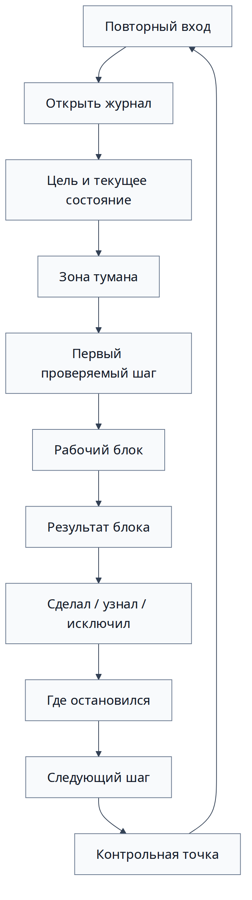{.diagram}


Этот цикл важнее отдельных полей.

Если есть вход, но нет выхода, задача часто снова теряет состояние.

Если есть выход, но нет входа, контрольная точка лежит в журнале, но человек ей не пользуется.

Если есть журнал, но нет рабочего блока, система превращается в подготовку вместо работы.

Если есть рабочий блок, но нет обновления журнала, внешний контур не обновляется вместе с задачей.

В когнитивном инженерстве полезны не отдельные красивые практики, а замкнутые контуры.

## Быстрые версии ритуала

Ритуал должен иметь несколько размеров. Иначе он сломается в обычный день.

### Версия на 30 секунд

Когда нужно срочно переключиться:

```text
Остановился:
Дальше:
```

Пример:

```text
Остановился: нашел обработчик timeout, не проверил компенсацию.
Дальше: открыть блок обработки ошибки и проверить изменение статуса.
```

Это не идеальная запись. Но она может сохранить направление.

### Версия на 90 секунд

После обычного рабочего блока:

```markdown
Сделал:
Узнал:
Остановился:
Дальше:
```

Если сил хватает, добавить:

```markdown
Исключил:
```

### Полная версия

Для дорогой туманной задачи:

```markdown
## Перед началом
- Цель:
- Текущее состояние:
- Зона тумана:
- Первый проверяемый шаг:
- Размер блока:

## После блока
- Сделал:
- Узнал:
- Подтвердил:
- Исключил:
- Открытые вопросы:
- Остановился:
- Дальше:
```

Полная версия нужна там, где стоимость потери контекста высока.

## Пример полного цикла

Возьмем ту же обезличенную задачу: объект иногда остается в промежуточном состоянии.

### Вход

```markdown
## Вход в блок

- Цель: понять, почему объект остается в промежуточном состоянии.
- Текущее состояние: событие до обработчика доходит; состояние меняется до внешнего вызова; timeout не откатывает состояние.
- Зона тумана: можно ли безопасно повторить внешний вызов?
- Первый проверяемый шаг: проверить идемпотентность операции в документации и коде клиента.
- Размер блока: 40 минут или до первого ясного вывода.
```

Читателю не нужно вспоминать всю задачу. Вход сразу показывает, где находится мысль.

### Рабочий блок

Человек проверяет документацию, код клиента и место обработки повторного вызова.

Главный вопрос блока:

```text
можно ли повторить операцию без риска создать дубль или повредить уже созданный объект?
```

### Выход

```markdown
## Контрольная точка

- Сделал: проверил документацию внешнего API и код клиента.
- Узнал: внешний API не обещает идемпотентность по текущему идентификатору; в клиенте нет отдельного ключа идемпотентности.
- Исключил: безопасный простой ретрай текущего вызова без дополнительной защиты.
- Остановился: нужно выбрать между компенсацией промежуточного состояния и добавлением идемпотентного ключа.
- Дальше: составить два варианта исправления и сравнить их по риску для уже зависших объектов.
```

Это не финальный ответ. Но это хорошая контрольная точка. После нее следующий вход начинается не с вопроса "что вообще было?", а с выбора между двумя вариантами исправления.

## Антибюрократический критерий

Ритуал хорош, пока он экономит больше внимания, чем стоит.

Проверка:

| Вопрос | Если да | Если нет |
| --- | --- | --- |
| После входа стало легче начать? | Ритуал выполняет функцию. | Сократить или изменить вход. |
| После выхода понятно, где продолжать? | Контрольная точка работает. | Усилить поле "дальше". |
| Запись занимает меньше сил, чем повторный разгон? | Форма соразмерна. | Упростить до короткой версии. |
| Ритуал помогает действию, а не заменяет его? | Контур замкнут. | Убрать лишнюю подготовку. |
| Ритуал применим в обычный день? | Его можно повторять. | Сделать аварийную версию. |

Если ритуал стал еще одной задачей, которую нужно преодолевать, он слишком тяжелый.

Желательно, чтобы нормальный ритуал выдерживал не только идеальный день, но и день с встречами, усталостью и прерываниями.

Поэтому минимальная версия важна не меньше полной.

## Когда вход должен остановить работу

Иногда ритуал входа показывает, что работать не нужно или нельзя.

Например:

- цель стала неактуальной;
- задача заблокирована чужим ответом;
- следующий шаг требует полномочий, которых нет;
- ресурс настолько низкий, что сложная проверка будет имитацией;
- задача конфликтует с более важным приоритетом;
- риск действия выше допустимого.

Это не провал ритуала. Это его работа.

Ритуал не должен быть способом продавить себя через любое состояние. Он должен помочь увидеть реальное положение:

```text
готов ли я к этому типу действия сейчас?
что именно мешает?
какой следующий честный шаг?
```

Иногда честный следующий шаг:

```text
сформулировать блокер
попросить доступ
перенести задачу после отдыха
задать уточняющий вопрос
снизить размер блока до 10 минут
```

Это лучше, чем изображать работу внутри неуправляемого тумана.

## Как понять, что блок внешнего контура заработал

После глав 4-6 у нас есть первый полноценный практический блок учебника.

Он работает, если:

- туманная задача превращается в карту контекста;
- карта живет в рабочем журнале;
- вход начинается с журнала, а не с пустого усилия;
- рабочий блок ограничен проверяемым шагом;
- выход оставляет контрольную точку;
- следующий вход дешевле предыдущего;
- закрытые пути не проверяются заново без новых данных;
- прогресс виден до финального результата.

Эта система не делает человека бесконечно продуктивным. Она может делать сложную работу менее зависимой от случайной свежести памяти и настроения.

## Мини-практика

Выберите одну туманную задачу и проведите через полный цикл.

### 1. Вход

```markdown
## Вход
- Цель:
- Текущее состояние:
- Зона тумана:
- Первый проверяемый шаг:
- Размер блока:
```

### 2. Рабочий блок

Ограничьте блок одним вопросом или одной гипотезой.

```text
На этот блок я проверяю:
```

### 3. Выход

```markdown
## Контрольная точка
- Сделал:
- Узнал:
- Исключил:
- Остановился:
- Дальше:
```

### 4. Повторный вход

При следующем возвращении проверьте:

1. Было ли понятно, где задача находится?
2. Был ли первый шаг достаточно конкретным?
3. Что оказалось лишним в записи?
4. Чего не хватило для быстрого входа?

Так ритуал начинает улучшаться не через идею, а через обратную связь.

## Мини-словарь главы

| Понятие | Рабочее определение |
| --- | --- |
| Ритуал входа | Короткая последовательность действий, которая восстанавливает состояние задачи и выбирает первый проверяемый шаг. |
| Ритуал выхода | Короткая последовательность действий, которая сохраняет результат блока и готовит будущий вход. |
| Контрольная точка | Снимок состояния перед паузой: что сделано, что узнано, где остановились, что дальше. |
| Первый проверяемый шаг | Действие, после которого хотя бы одно место в задаче станет яснее. |
| Рабочий блок | Ограниченный отрезок работы вокруг одного вопроса, гипотезы или проверяемого действия. |
| Защита будущего внимания | Забота о том, чтобы следующий вход не начинался с повторного восстановления всей модели. |
| Антибюрократический критерий | Проверка, что ритуал экономит больше внимания, чем стоит. |

## Вопросы для самопроверки

1. Почему рабочий журнал без ритуала может остаться архивом?
2. Чем ритуал отличается от бюрократии?
3. Почему первый проверяемый шаг не обязан решать задачу целиком?
4. Какой выход из задачи можно назвать хорошим?
5. Почему хороший выход уже готовит следующий вход?
6. В каких случаях ритуал должен остановить работу, а не помогать ее продавить?

## Короткое резюме

1. Ритуал входа восстанавливает цель, состояние, туман и первый проверяемый шаг.
2. Рабочий блок лучше держать вокруг одного вопроса или одной гипотезы.
3. Ритуал выхода сохраняет контрольную точку для будущего входа.
4. Хороший выход из задачи — это уже начало следующего входа.
5. Ритуал должен иметь короткую аварийную версию.
6. Если ритуал стал тяжелее пользы от него, его нужно упростить.
7. Ритуал не заменяет ресурс, приоритеты, полномочия и здоровую рабочую среду.
8. Блок `контекст -> журнал -> вход -> блок -> выход -> контрольная точка` является первым полноценным инструментом когнитивного инженерства в этом учебнике.

## Переход к следующей главе

Первые шесть глав дали читателю практический внешний контур мышления. Теперь можно входить в туманную задачу, выносить контекст наружу, вести рабочий журнал и оставлять контрольную точку.

Но даже при хорошей внешней системе остается следующий вопрос:

```text
почему иногда понятная задача все равно не запускается?
```

Здесь начинается мотивационный блок: мотивация — это не просто "хочется или не хочется", а система ценности, угрозы, доступности шага, управляемости и ожидаемой цены усилия.

---

# Глава 7. Мотивация — это не желание

## Почему после внешнего контура нужна мотивация

Первые шесть глав дали нам внешний контур мышления.

Теперь сложная задача может быть вынесена из головы. У нее есть контекст, рабочий журнал, ритуал входа, рабочий блок, ритуал выхода и контрольная точка. Это уже серьезное изменение: задача меньше зависит от свежести памяти, настроения и случайного "я вроде помню, где остановился".

Но внешний контур не решает все.

Можно открыть рабочий журнал, увидеть цель, прочитать контрольную точку, понять следующий шаг — и все равно не начать.

Не потому, что запись плохая. Не потому, что человек "ленивый". Не потому, что метод не работает. Просто мы подошли к другой части системы.

Внешний контур может помогать удерживать состояние мысли. Он может снижать цену повторного входа и делать задачу видимой. Но действие запускается не только из ясности. Чтобы человек начал и удержал действие, система должна оценить несколько вещей:

- зачем это делать;
- что здесь ценно;
- что здесь опасно;
- могу ли я повлиять на исход;
- какой шаг реально доступен;
- сколько это будет стоить сейчас;
- что будет с отношениями, статусом, телом и будущим состоянием после действия.

Если ответ на один из этих вопросов неблагоприятен, понятная задача может оставаться неподвижной.

Поэтому следующий блок учебника — мотивационный.

Он нужен не для того, чтобы "научиться себя мотивировать" в бытовом смысле. Нас интересует другое: как устроена система, которая выбирает между действием, откладыванием, избеганием, контролем, восстановлением и отказом от шага.

Первая ошибка, которую нужно убрать сразу:

```text
мотивация = хочется
```

Это слишком бедная модель.

## Почему "хочется" не объясняет действие

В бытовом языке мотивацией часто называют желание.

```text
Есть мотивация — хочется делать.
Нет мотивации — не хочется делать.
```

Иногда это похоже на правду. Хочется читать интересную книгу, играть, собирать новый проект, спорить с увлекательной задачей. Не хочется писать неприятное письмо, разбирать старый долг, открывать сложный документ, идти в конфликтный разговор.

Но как только мы смотрим на реальную работу, модель быстро ломается.

### Человек может хотеть результата, но не начинать

Разработчик хочет закрыть сложный дефект. Лиду важно подготовить сильный план. Студент хочет сдать экзамен. Автор хочет закончить текст.

Результат важен. Но действие не запускается.

Причина может быть не в отсутствии желания, а в другом:

- первый шаг слишком широкий;
- задача угрожает самооценке;
- непонятно, что считать продвижением;
- человек не верит, что его действие изменит исход;
- тело уже в усталости;
- социальная цена ошибки слишком высока.

В такой ситуации фраза "ты просто недостаточно хочешь" не помогает. Она закрывает диагностику.

### Человек может не хотеть процесса, но делать

Многие важные действия неприятны в моменте.

Не хочется идти на тренировку, но человек идет. Не хочется делать скучную проверку, но инженер делает ее, потому что от нее зависит надежность. Не хочется начинать сложный разговор, но руководитель начинает, потому что молчание разрушает команду сильнее.

Здесь действие запускается не из приятного желания. Оно запускается из ценности, ответственности, привычки, внешнего обязательства, профессионального стандарта, заботы о будущем или понимания цены бездействия.

Если считать мотивацией только желание процесса, значительная часть зрелого поведения окажется "немотивированной". Это странно.

### Человек может действовать, чтобы снизить угрозу

Есть еще один случай: действие начинается не потому, что результат привлекает, а потому что бездействие пугает.

Человек готовит доклад не из интереса к теме, а чтобы не выглядеть слабым. Помогает всем подряд не из свободной щедрости, а чтобы не оказаться отвергнутым. Контролирует каждую мелочь не потому, что видит лучший путь, а потому что плохо переносит ощущение бессилия.

Снаружи это может выглядеть как высокая мотивация. Внутри это может быть защита.

Поэтому видимое действие тоже не доказывает, что мотивация устроена здорово. Иногда человек много делает не потому, что идет к ценности, а потому что бежит от угрозы.

Нам нужна модель, которая видит все эти случаи.

## Рабочее определение мотивации

В этом учебнике мотивация — это не отдельное чувство и не внутренний тумблер.

Мотивация — это временная конфигурация системы, которая делает действие более или менее вероятным.

Проще:

```text
мотивационное состояние = как сейчас система оценивает смысл, доступность, риск, управляемость и цену действия
```

Такое определение не пытается измерить мотивацию одной цифрой. Оно нужно для диагностики.

Когда действие не запускается, мы не спрашиваем сразу:

```text
почему я такой несобранный?
```

Мы спрашиваем точнее:

```text
какой параметр системы делает действие недоступным?
```

Для первого прохода нам нужна первичная рабочая формула:

```text
мотивация = ценность + потребности + доступность шага + ожидаемая способность действовать + социальный контекст + состояние системы
```

Позже мы добавим угрозу, избегание, управляемость, цену усилия, усталость, привычки и нейрофизиологический слой. Сейчас важно собрать входную карту.

## Схема мотивационного запуска

Понятная задача — только начало. Она входит в систему оценки.

Вопрос схемы: почему даже понятная и важная задача может не запуститься прямо сейчас.


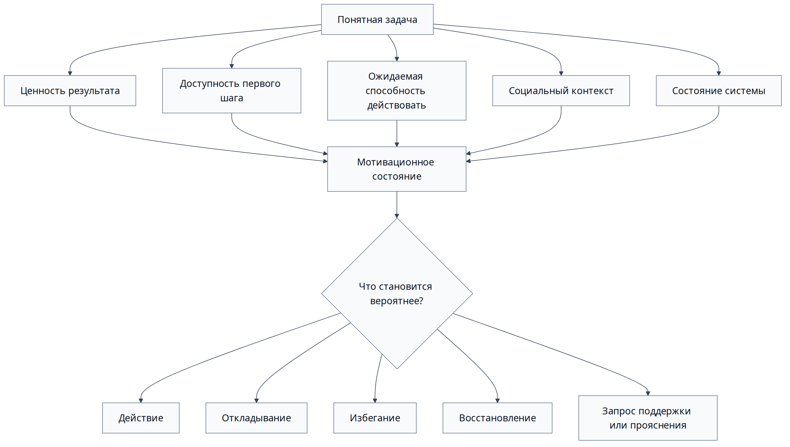{.diagram}


Схему нужно читать так.

Сначала есть задача. Она может быть хорошо описана: цель ясна, факты собраны, контрольная точка оставлена. Но дальше система оценивает не только "что делать". Она оценивает, стоит ли действие текущей цены и есть ли у человека рабочий вход.

Если ценность видна, шаг доступен, человек ожидает, что способен повлиять на исход, социальная среда не делает задачу чрезмерно опасной, а состояние системы допускает усилие, действие становится вероятнее.

Если хотя бы один узел дает сильный отрицательный сигнал, система может выбрать другое:

- отложить;
- уйти в более безопасную задачу;
- начать бесконечную подготовку;
- попросить помощи;
- восстановиться;
- уточнить контекст;
- отказаться от действия как неактуального или неуправляемого.

Это не всегда плохо. Иногда отказ от действия — правильный результат диагностики. Когнитивное инженерство не должно превращаться в машину самопродавливания.

## Параметры мотивационного состояния

Разложим схему на рабочие параметры.

| Параметр | Главный вопрос | Если параметр проседает |
| --- | --- | --- |
| Ценность | Зачем это делать? Что здесь важно? | Задача выглядит чужой, пустой или навязанной. |
| Потребности | Поддерживает ли задача автономию, компетентность, связь, смысл, влияние? | Действие может ощущаться как давление, бессилие или социальный риск. |
| Доступность шага | Что именно можно сделать сейчас? | Цель важна, но вход размыт. |
| Ожидаемая способность | Верю ли я, что смогу выполнить действие и повлиять на исход? | Усилие кажется расходом в пустоту. |
| Социальный контекст | Что это действие меняет в отношениях, статусе, доверии, ответственности? | Ошибка или несогласие становятся слишком дорогими. |
| Состояние системы | Хватает ли внимания, сна, восстановления, окна нагрузки? | Даже понятный шаг ощущается чрезмерным. |

Эта таблица не заменяет будущие главы. Она дает первую диагностическую карту.

Параметры не независимы.

Низкая управляемость повышает цену усилия. Угроза ухудшает доступность шага. Плохое состояние тела усиливает ощущение угрозы. Социальный контекст может одновременно повышать ценность и делать ошибку болезненной.

Поэтому в реальности мотивация редко ломается в одном месте. Обычно проседает связка.

## Ценность: почему задача вообще имеет вес

Первый слой мотивации — ценность.

Ценность отвечает на вопрос:

```text
почему этот результат имеет значение?
```

Значение может быть разным:

- предметным: задача улучшит систему;
- профессиональным: это часть роли;
- учебным: через нее растет компетентность;
- социальным: от нее зависит команда или отношения;
- статусным: она влияет на доверие и репутацию;
- защитным: она снижает риск;
- смысловым: она связана с тем, каким человеком я хочу быть.

У David McClelland полезно брать не ярлыки людей, а саму идею разных мотивационных областей. Человека может притягивать достижение, принадлежность, влияние; его может активно организовывать и избегание угрозы. Это не четыре типа личности. Это разные области ценности и риска.

Одна задача может включать несколько ценностей сразу.

Например, подготовить архитектурное решение:

- достижение: сделать сильную, ясную конструкцию;
- принадлежность: не потерять контакт с командой;
- влияние: изменить техническое направление;
- безопасность: не заложить опасное решение.

Если видеть только одну ценность, легко ошибиться. Можно сказать: "Мне просто важно качество", хотя на самом деле страшно потерять доверие. Или: "Мне неинтересна эта задача", хотя проблема не в интересе, а в ощущении бессилия.

Дальше мы развернем эти области подробно. Сейчас важно одно: ценность не сводится к слову "хочу".

## Потребности и качество регуляции

Даже когда ценность понятна, остается другой вопрос:

```text
как человек включен в действие?
```

В теории самодетерминации Ryan и Deci важны три базовые психологические потребности:

- автономия;
- компетентность;
- связанность.

Для нашего учебника это не три магических слова. Это способ понять качество мотивации.

Поздние обзоры SDT уточняют важную для нас деталь: важны не только удовлетворенные потребности, но и их фрустрация. Человек может не просто "не получать автономии", а переживать давление; не просто "не чувствовать компетентности", а получать от среды постоянный сигнал бессилия; не просто "не иметь связанности", а чувствовать изоляцию или угрозу месту среди людей. Для когнитивного инженерства это существенно: мы проектируем не вдохновляющую речь, а условия, в которых действие не превращается в защиту от среды.

### Автономия

Автономия означает не "делаю что хочу". Это ощущение, что действие внутренне принято, что человек понимает смысл шага и не переживает себя только объектом давления.

Задача может быть внешне заданной и при этом автономно принятой:

```text
я не выбирал саму необходимость, но понимаю смысл и согласен с направлением
```

И наоборот, задача может быть формально личной, но переживаться как внутренний нажим:

```text
я должен доказать, иначе со мной что-то не так
```

В первом случае мотивация обычно устойчивее. Во втором она легче превращается в угрозу.

### Компетентность

Компетентность в SDT — это потребность чувствовать, что взаимодействие со средой не бессмысленно, что навыки могут расти, а действия получают понятную обратную связь.

Это близко к теме самоэффективности, но не то же самое.

Компетентность как потребность говорит:

```text
мне важно чувствовать, что я могу становиться эффективнее в этой среде
```

Самоэффективность у Bandura говорит более конкретно:

```text
верю ли я, что способен выполнить это действие и справиться с этой ситуацией
```

Обе линии важны, но смешивать их нельзя.

### Связанность

Связанность — это не приятное общение поверх "настоящей" мотивации. Baumeister и Leary показывают принадлежность как фундаментальную человеческую потребность.

Для работы это означает простую вещь: социальная среда входит в мотивацию не как украшение.

Если задача угрожает принадлежности, признанию, доверию или месту среди людей, она становится дороже. Человек может откладывать не саму задачу, а возможное социальное последствие.

Например:

```text
если я задам вопрос, меня сочтут некомпетентным
если я не соглашусь, я испорчу отношения
если я признаю ошибку, доверие ко мне снизится
```

Такой человек может выглядеть "немотивированным", хотя на деле система защищает принадлежность.

## Ценность не равна доступности действия

Одна из самых частых ошибок:

```text
если цель важна, действие должно начаться
```

Не должно.

Ценность отвечает на вопрос:

```text
зачем?
```

Доступность действия отвечает на другой вопрос:

```text
что именно можно сделать сейчас?
```

Между ними большая разница.

Цель:

```text
улучшить архитектуру сервиса
```

может быть важной, но недоступной как первый шаг.

Доступный шаг:

```text
за 30 минут выписать три места, где текущая архитектура создает повторяющиеся ошибки
```

или:

```text
сравнить два варианта изменения по одному ограничению: миграционный риск
```

Действие становится доступнее, когда оно:

- достаточно маленькое;
- проверяемое;
- связано с текущим контекстом;
- имеет понятный критерий завершения;
- допускает ошибку или корректировку;
- не требует сразу решить всю задачу;
- дает обратную связь.

Это место напрямую связывает мотивационный блок с главами 4-6.

Контекст задачи, рабочий журнал и ритуал входа не создают ценность сами по себе. Но они могут повышать доступность действия. Они помогают превратить большое "надо разобраться" в первый проверяемый шаг.

Если ценность есть, а действие недоступно, часто помогает не "добавить мотивации", а сузить вход.

## Ожидаемая способность действовать

Следующий параметр — ожидаемая способность.

Человек может видеть ценность и даже понимать первый шаг, но не верить, что способен выполнить его достаточно хорошо или что действие повлияет на исход.

У Bandura это поле описывается через самоэффективность: ожидание собственной способности организовать и выполнить действия, необходимые для результата.

Для нас важно не превращать это в общую "уверенность в себе".

Самоэффективность всегда конкретнее:

```text
могу ли я разобраться с этим классом задач?
могу ли я задать этот вопрос?
могу ли я выдержать эту обратную связь?
могу ли я сделать маленькую проверку, даже если полное решение пока не ясно?
```

Если самоэффективность низкая, действие становится дороже. Человек ожидает, что усилие не даст результата или приведет к болезненному подтверждению неспособности.

Тогда появляются знакомые формы:

- бесконечно готовиться;
- ждать "нормального состояния";
- выбирать более безопасные задачи;
- спорить о постановке вместо проверки;
- просить еще контекста, хотя первый шаг уже возможен;
- делать работу слишком широко, чтобы не столкнуться с конкретной оценкой.

Управляемость и ожидаемую способность действовать мы подробно разберем дальше. Сейчас нужен мост:

```text
ценная задача не запускается, если человек не ожидает, что его действие может иметь эффект
```

## Социальный контекст как часть мотивации

Работа почти никогда не происходит в пустоте.

Даже одиночная интеллектуальная задача часто связана с людьми:

- кто поставил задачу;
- кто будет смотреть результат;
- кто может помочь;
- кто может осудить;
- кому придется объяснять решение;
- чье доверие может вырасти или снизиться;
- какие ожидания закрепятся после действия.

Поэтому социальный контекст может усиливать или блокировать действие.

Один и тот же технический шаг воспринимается по-разному:

```text
проверить гипотезу в спокойной исследовательской среде
```

и:

```text
проверить гипотезу, когда каждая ошибка будет использована как доказательство некомпетентности
```

Во втором случае задача не просто техническая. Она становится социальным экзаменом.

Это важно для лидерства. Нельзя рассуждать о мотивации сотрудников так, будто у человека внутри есть ручка "хочет / не хочет". Среда постановки задачи, обратная связь, право на вопрос, безопасность ошибки и признание вклада меняют мотивационное состояние.

В хорошем контексте человек чаще может сказать:

```text
мне понятно, зачем это нужно
я могу задать вопрос
ошибка даст данные, а не только стыд
мой вклад виден
у меня есть пространство повлиять на результат
```

В плохом контексте даже ценная задача становится дорогой.

## Состояние системы

Последний параметр этой главы — состояние системы.

Пока достаточно простой мысли:

```text
мотивация зависит не только от смысла задачи, но и от текущего состояния организма
```

Недосып, длительное напряжение, сенсорный перегруз, конфликт, боль, голод, тревога, усталость после серии переключений — все это меняет доступность действия.

Это не означает, что человек полностью определяется состоянием. Но состояние меняет цену входа.

Одна и та же задача утром после нормального сна и вечером после десяти часов встреч — не одна и та же задача для системы действия.

На бумаге она та же:

```text
написать техническое решение
```

Для организма это может быть два разных режима:

```text
есть внимание, терпимость к неопределенности, способность держать модель
```

или:

```text
любой новый фрагмент кажется перегрузом, ошибка пугает сильнее, первый шаг распадается
```

В главе 11 мы подробно разберем цену усилия, усталость и ощущаемую энергию. Сейчас нужно только убрать моральную ошибку:

```text
если действие не запускается в плохом состоянии, это не автоматически слабость характера
```

Иногда правильное вмешательство — не усилить давление, а снизить цену входа, дать восстановление, уменьшить шаг или вернуть безопасность.

## Пример: задача понятна, но не начинается

Возьмем обезличенную инженерную ситуацию.

Есть задача: разобраться, почему объект иногда остается в промежуточном состоянии после внешнего вызова.

После предыдущего блока человек оставил хорошую контрольную точку:

```markdown
Сделал: проверил документацию внешнего API и код клиента.
Узнал: внешний API не обещает идемпотентность по текущему идентификатору.
Исключил: безопасный простой ретрай без дополнительной защиты.
Остановился: нужно выбрать между компенсацией промежуточного состояния и добавлением идемпотентного ключа.
Дальше: составить два варианта исправления и сравнить их по риску для уже зависших объектов.
```

На следующий день задача не начинается.

С точки зрения внешнего контура все хорошо:

- задача есть;
- текущая модель сохранена;
- следующий шаг понятен;
- рабочий блок можно начать.

Но человек ходит вокруг. Открывает почту. Проверяет мелкие задачи. Еще раз перечитывает документацию. Пишет черновик, стирает. Откладывает.

Плохая диагностика:

```text
нет мотивации
```

Рабочая диагностика:

| Параметр | Что видно |
| --- | --- |
| Ценность | Высокая: задача влияет на надежность и доверие к системе. |
| Доступность шага | Средняя: следующий шаг понятен, но требует сравнить два неприятных варианта. |
| Ожидаемая способность | Снижена: кажется, что без владельца внешней системы решение может быть неверным. |
| Социальный контекст | Напряженный: если выяснится, что текущий дизайн был ошибочным, это затронет прошлые решения. |
| Состояние системы | Плохое: недосып и серия встреч снизили терпимость к неопределенности. |
| Угроза | Высокая: можно вскрыть архитектурный долг и получить конфликт вокруг ответственности. |

Теперь видно, что проблема не в отсутствии желания. Проблема в сочетании:

```text
ценность высокая + угроза высокая + управляемость снижена + состояние плохое
```

Что можно сделать инженерно?

Не "заставить себя решить задачу", а изменить вход:

```text
не выбирать финальное решение;
составить таблицу двух вариантов без решения;
отдельно выписать вопросы владельцу внешней системы;
ограничить блок 30 минутами;
после блока зафиксировать только различия и неизвестные места.
```

Так действие может стать меньше, обратимее и управляемее.

Задача не исчезла. Но первый шаг перестал требовать героического входа.

## Минимальная диагностика мотивации

Когда действие не запускается, используйте короткий протокол.

### 1. Что здесь ценно?

Не отвечайте общим словом "надо".

Лучше:

```text
это снижает риск инцидента
это даст мне понимание системы
это поможет команде договориться
это закроет долг, который постоянно возвращается
```

Если ценность не удается сформулировать, возможно, задача действительно чужая, устаревшая или плохо связана с целями.

### 2. Что здесь угрожает?

Угроза может быть неочевидной:

```text
провал
стыд
конфликт
потеря статуса
перегруз
невозможность закончить
разочарование после усилия
```

Называние угрозы не делает человека слабее. Оно возвращает точность.

### 3. Какой шаг доступен сейчас?

Не "решить задачу", а действие, после которого что-то станет яснее.

```text
выписать неизвестные места
сравнить два варианта по одному критерию
сформулировать вопрос
проверить одну гипотезу
прочитать один нужный фрагмент документации
```

### 4. Верю ли я, что могу повлиять на исход?

Если ответ "нет", нужно искать рычаг:

```text
какая часть исхода зависит от меня?
какая обратная связь покажет эффект?
какой ресурс нужен?
какой человек может снять блокер?
какое решение я не имею права принимать один?
```

### 5. Что с состоянием системы?

Иногда честный ответ:

```text
сейчас не время для тяжелой когнитивной работы
```

Тогда возможны другие действия:

- оставить короткую контрольную точку;
- сделать подготовительный шаг;
- перенести сложный блок;
- восстановиться;
- снизить размер входа;
- попросить помощь;
- не открывать тяжелую задачу в заведомо плохом окне.

## Как мотивационная диагностика связана с рабочим журналом

Рабочий журнал можно расширить маленьким мотивационным блоком. Не всегда. Только когда задача застряла.

Пример:

```markdown
## Почему не начинаю

- Что здесь ценно:
- Что здесь угрожает:
- Первый доступный шаг:
- Что повысит управляемость:
- Что с состоянием:
```

Это не психотерапевтический дневник. Это рабочая диагностика входа в задачу.

Ее задача — не подробно описывать переживания, а найти параметр, который делает действие недоступным.

Например:

```markdown
## Почему не начинаю

- Что здесь ценно: снизить риск зависших объектов и закрыть повторяющийся дефект.
- Что здесь угрожает: если простой ретрай невозможен, придется признать архитектурный долг.
- Первый доступный шаг: не решать, а составить таблицу двух вариантов исправления.
- Что повысит управляемость: вопрос владельцу внешнего API про идемпотентность.
- Что с состоянием: после встреч не брать полный блок, сделать 25 минут.
```

После такой записи следующий шаг часто становится мягче:

```text
составить таблицу вариантов, не выбирать решение
```

Это и есть когнитивное инженерство: не спорить с состоянием общими словами, а менять форму входа.

## Что делать с внешней мотивацией

Нужно отдельно сказать о внешней мотивации.

В популярной культуре часто звучит упрощение:

```text
внутренняя мотивация хорошая, внешняя плохая
```

Так писать нельзя.

Внешние требования, дедлайны, роли, деньги, обязательства, ожидания команды и стандарты профессии реальны. Они могут быть разрушительными, если переживаются как давление без смысла, автономии и управляемости. Но они могут быть нормально встроены в действие, если человек понимает их смысл, принимает рамку и видит свою роль.

Разница не только в том, "изнутри" или "снаружи" пришла задача. Разница в качестве регуляции:

| Ситуация | Как переживается действие | Что будет с мотивацией |
| --- | --- | --- |
| Внешний нажим без смысла | "Меня заставляют, я объект давления." | Сопротивление, избегание, формальное выполнение. |
| Внешняя задача с принятым смыслом | "Это не я придумал, но я понимаю зачем и согласен с ролью." | Действие обычно устойчивее. |
| Внутренний интерес | "Мне интересно разобраться и увидеть результат." | Высокая вовлеченность, если цена действия не разрушительна. |
| Внутренний нажим | "Я обязан доказать, иначе со мной что-то не так." | Может дать усилие, но дорого и нестабильно. |

Такой взгляд защищает от двух ошибок:

- романтизировать только внутренний интерес;
- считать любое внешнее обязательство насилием над мотивацией.

В реальной взрослой работе мотивация часто смешанная. Человек делает задачу потому, что она нужна команде, входит в роль, поддерживает его компетентность, снижает риск и дает чувство влияния.

Наша задача — не найти "чистую" мотивацию, а понять, какие условия делают действие устойчивым и неразрушительным.

## Мини-практика

Выберите задачу, которая понятна, но не начинается.

Не берите самую тяжелую жизненную проблему. Лучше взять рабочую, учебную или личную задачу среднего размера.

Заполните таблицу.

| Вопрос | Ответ |
| --- | --- |
| Что здесь ценно? |  |
| Что здесь угрожает? |  |
| Какой первый шаг доступен за 20-40 минут? |  |
| Верю ли я, что этот шаг может что-то изменить? |  |
| Какая обратная связь покажет продвижение? |  |
| Что с состоянием системы? |  |
| Как снизить цену входа без отказа от задачи? |  |

После этого сформулируйте не план всей задачи, а только следующий рабочий блок:

```markdown
## Следующий блок

- Цель блока:
- Один проверяемый шаг:
- Что должно стать яснее:
- Что я не пытаюсь решить в этом блоке:
- Контрольная точка после блока:
```

Последняя строка важна. Мотивационная диагностика должна возвращаться в действие, а не превращаться в бесконечный самоанализ.

## Мини-словарь главы

| Понятие | Рабочее определение |
| --- | --- |
| Мотивация | Временная конфигурация системы, которая делает действие более или менее вероятным. |
| Мотивационное состояние | Оценка ценности, угрозы, доступности шага, управляемости, социальной цены и состояния системы. |
| Желание | Переживание привлекательности результата или процесса. Может поддерживать действие, но не исчерпывает мотивацию. |
| Ценность | Значимость результата для задачи, роли, отношений, мастерства, безопасности или смысла. |
| Доступность шага | Насколько понятно, что можно сделать сейчас и как увидеть продвижение. |
| Самоэффективность | Ожидание, что я способен выполнить действие и справиться с ситуацией. |
| Автономия | Ощущение, что действие принято и имеет смысл, а не только навязано давлением. |
| Компетентность | Потребность чувствовать, что действие может становиться эффективнее и получать обратную связь. |
| Связанность | Потребность в принадлежности, контакте и признании, которая влияет на цену социальных действий. |

## Вопросы для самопроверки

1. Почему понятная задача может не запускаться?
2. Чем желание отличается от мотивационного состояния?
3. Почему высокая ценность результата не гарантирует действие?
4. Что меняется, если смотреть на мотивацию через доступность первого шага?
5. Почему социальный контекст входит в мотивацию?
6. Чем компетентность в теории самоопределения отличается от самоэффективности у Bandura?
7. В каком случае лучше снижать цену входа, а не "добавлять мотивации"?

## Короткое резюме

1. Мотивация — не синоним желания.
2. Действие зависит от ценности, доступности шага, ожидаемой способности, социального контекста и состояния системы.
3. Ценная задача может не запускаться, если первый шаг не доступен или действие кажется неуправляемым.
4. Внешний контур мышления может снижать цену входа, но не отменяет мотивационную систему.
5. Принадлежность, автономия и компетентность — не декоративные темы, а условия устойчивой регуляции.
6. Самоэффективность — не общая самооценка, а ожидание способности справиться с конкретным действием.
7. Внешняя мотивация не всегда вредна, а внутренняя не всегда здорова: важно качество регуляции.
8. Когда действие не начинается, полезнее диагностировать параметр системы, чем обвинять себя в лени.

## Переход к следующей главе

Мотивация теперь описана как система параметров. Но один параметр остался слишком общим: ценность.

Сказать "задача ценна" недостаточно. Ценность бывает разной. Одно действие важно как рост мастерства, другое как принадлежность, третье как влияние на ситуацию, четвертое как безопасность и защита от вреда.

Дальше мы разложим мотивацию по четырем областям:

```text
достижение -> принадлежность -> влияние -> безопасность
```

Это поможет увидеть, почему одна и та же задача может одновременно притягивать и пугать.

---

# Глава 8. Четыре области мотивации

## От ценности к карте ценностей

В прошлой главе мы разобрали мотивацию как систему параметров. Один из них — ценность.

Но слово "ценность" пока слишком широкое.

Когда мы говорим:

```text
задача для меня важна
```

это еще не объясняет, чем именно она важна.

Одна задача может быть важна потому, что через нее растет мастерство. Другая — потому что от нее зависит связь с людьми. Третья — потому что она дает возможность повлиять на ситуацию. Четвертая — потому что снижает риск и защищает от ущерба.

Иногда одна и та же задача включает все это сразу.

Например, подготовить архитектурное решение:

- важно сделать его качественно;
- важно, чтобы команда поняла и приняла ход мысли;
- важно изменить техническое направление;
- важно не заложить риск, который потом ударит по системе.

Если все это назвать одним словом "важно", мы потеряем структуру мотивации. А без структуры труднее понять, почему человек иногда одновременно хочет войти в задачу и избегает ее.

Для этого введем четыре рабочие области мотивации:

```text
достижение -> принадлежность -> влияние -> безопасность
```

Это не типы людей. Это области ценности, которые могут включаться в разных задачах, ролях и состояниях.

## Почему это не типология людей

Самая опасная ошибка главы:

```text
этот человек про достижение
этот человек про принадлежность
этот человек про влияние
этот человек про безопасность
```

Так делать нельзя.

Человек не живет в одной области. У него есть разные мотивы, разные роли, разный опыт и разные состояния. В одной ситуации он может быть чувствителен к качеству результата, в другой — к отвержению, в третьей — к бессилию, в четвертой — к риску перегруза.

Даже внутри одной задачи могут работать несколько областей.

Если руководитель готовит сложный разговор с сотрудником, там может быть:

- достижение: провести разговор профессионально;
- принадлежность: не разрушить доверие;
- влияние: изменить поведение или договоренность;
- безопасность: не усилить конфликт и не оставить токсичный риск висеть.

Если назвать его "человеком влияния", мы потеряем принадлежность. Если назвать "человеком безопасности", потеряем профессиональный стандарт. Если сказать "просто не хочет разговаривать", потеряем весь механизм.

Поэтому в этой главе область мотивации — это не ярлык личности, а вопрос:

```text
какая ценность сейчас делает задачу значимой?
```

и второй вопрос:

```text
какая потеря в этой области делает задачу опасной?
```

## Что такое область мотивации

Область мотивации — это тип ценности, который меняет внимание, критерий успеха и чувствительность к угрозе.

Проще:

```text
область мотивации показывает, что для человека здесь особенно важно сохранить, получить, развить или защитить
```

У каждой области есть две стороны:

- притягательная: что человек хочет получить или построить;
- уязвимая: какую потерю он особенно болезненно ожидает.

Например, в области достижения притягивает мастерство, качество и рост. Уязвимость — провал, бессмысленное усилие, потеря ощущения компетентности.

В области принадлежности притягивает связь и принятие. Уязвимость — отвержение, стыд, выпадение из группы.

В области влияния притягивает способность менять ситуацию. Уязвимость — бессилие, потеря веса, невозможность воздействовать.

В области безопасности притягивает защита, предсказуемость и сохранение ресурса. Уязвимость — ошибка, боль, перегруз, разрушение.

Есть и более специализированные модели социальных мотивов. Например, Zurich model of motivation описывает социальную динамику через потребности безопасности, активации и власти, а также через поведение приближения и дистанции. Для учебника это полезно как напоминание: социальные мотивы не исчерпываются приятной принадлежностью. В отношениях с людьми есть и поиск близости, и защита от угрозы, и статусно-властная динамика, и потребность чувствовать возможность влиять. Но эта модель остается вспомогательной. Наша четверка областей нужна как рабочая карта диагностики задачи, а не как новая теория личности.

Вопрос схемы: какие виды ценности и угрозы задача включает прямо сейчас.

Это не схема типов людей. Один и тот же человек в разных задачах может действовать из мастерства, принадлежности, влияния, безопасности или из их конфликта.


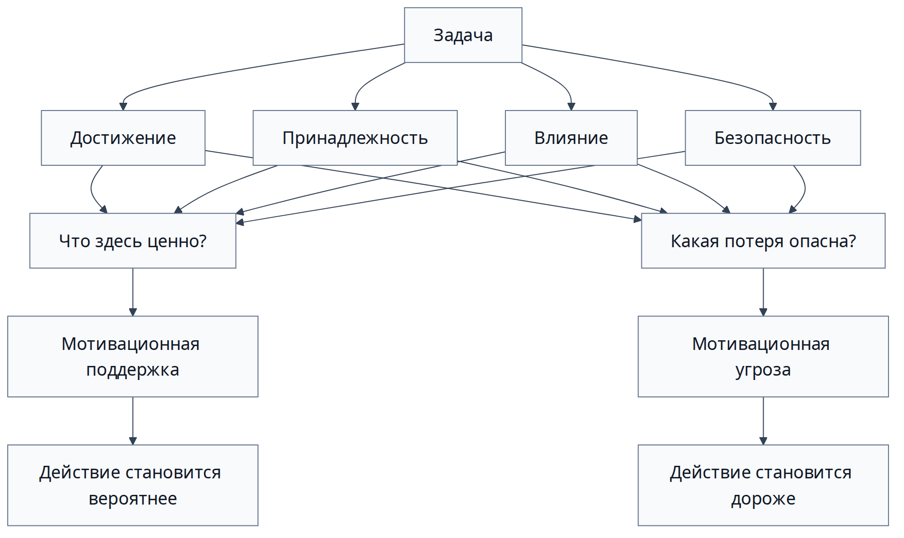{.diagram}


Эта схема не говорит, что все четыре области всегда равны. Она говорит другое: чтобы понять мотивационное состояние, нужно увидеть не только "сколько важности", но и "какого типа важность".

Читать ее нужно от задачи к двум вопросам: что здесь ценно и какая потеря опасна. Поддержка действия может появляться там, где область дает человеку смысл, связь, влияние или защиту. Угроза может появляться там, где та же область обещает провал, отвержение, бессилие или ущерб. Поэтому карта областей помогает не навесить ярлык на человека, а точнее описать задачу.

## Общая карта четырех областей

| Область | Главный вопрос | Что поддерживает действие | Что делает действие опасным |
| --- | --- | --- | --- |
| Достижение | Получится ли сделать лучше, освоить, вырасти? | Ясный стандарт, умеренная трудность, обратная связь, видимый прогресс. | Провал, бессмысленное усилие, размытый критерий, невозможность улучшиться. |
| Принадлежность | Останусь ли я в связи, доверии и принятии? | Поддержка, честная обратная связь, право на вопрос, надежность отношений. | Отвержение, стыд, выпадение из группы, потеря контакта. |
| Влияние | Могу ли я изменить ситуацию и иметь вес? | Полномочия, рычаг действия, возможность предлагать и менять рамку. | Бессилие, хаос, контроль без влияния, ответственность без рычага. |
| Безопасность | Не станет ли хуже? Что нужно защитить? | Предсказуемость, допустимый риск, границы нагрузки, защита от ущерба. | Ошибка, боль, перегруз, наказание, разрушение, непереносимый риск. |

Эта таблица полезна как диагностический инструмент.

Если действие не запускается, можно спросить:

```text
какая область делает задачу ценной?
какая область делает задачу опасной?
какая область сейчас не получает поддержки?
какую область я не замечаю?
```

## Достижение: мастерство, качество и рост

Область достижения включается там, где человеку важны результат, мастерство, сложность, качество и рост компетентности.

Ее центральный вопрос:

```text
смогу ли я сделать лучше, понять глубже, приблизиться к сильному уровню?
```

Это не обязательно карьеризм и не обязательно соревнование с другими. Человек может быть сильно мотивирован достижением в тихой исследовательской работе, в ремесле, в коде, в письме, в обучении, в настройке процесса.

Зрелое достижение ищет задачу, где есть вызов и обратная связь.

Слишком простая задача скучна: она не дает роста.

Задача, которая переживается как совсем невозможная, обычно не дает управляемого обучения.

Рабочая зона достижения — там, где трудно, но можно действовать, получать данные и становиться сильнее.

### Что поддерживает достижение

Достижение поддерживают:

- понятный критерий качества;
- умеренная трудность;
- видимый прогресс;
- обратная связь по работе, а не по личности;
- возможность улучшить следующий подход;
- право на черновик, ошибку и повтор.

В инженерной работе это особенно видно.

Задача "разобраться с flaky-тестом" может быть мотивирующей, если есть возможность проверить гипотезу, увидеть результат, сузить причину и почувствовать рост понимания.

Та же задача может стать демотивирующей, если критерий размытый, окружение нестабильно, прогресс не виден, а каждая неудачная попытка переживается как доказательство некомпетентности.

### Что угрожает достижению

Главные угрозы:

- провал;
- стыд за несовершенный результат;
- невозможность увидеть прогресс;
- бессмысленное усилие;
- слишком легкая задача без роста;
- слишком трудная задача без управляемости;
- оценка личности вместо оценки способа действия.

Здесь не нужно морализировать.

Если человек откладывает задачу, где возможен провал, это не обязательно отсутствие мотива достижения. Иногда наоборот: достижение слишком важно, и поэтому проверка способности становится страшной.

Дальше станет видно, как достижение может перейти в режим избегания провала. Сейчас достаточно видеть: достижение — это область ценности, а не гарантия смелого действия.

## Принадлежность: связь, принятие и надежность отношений

Область принадлежности включается там, где человеку важны связь, принятие, доверие, совместность и место среди людей.

Ее центральный вопрос:

```text
я здесь принят, слышим, нужен, не один?
```

Это не "мягкая" тема поверх настоящей работы. Принадлежность влияет на внимание, обучение, готовность задавать вопросы, способность признавать незнание и переносить обратную связь.

Если человек чувствует, что ошибка не уничтожит его место в группе, ему обычно легче учиться. Если любой вопрос может стать поводом для стыда, задача становится дороже.

### Что поддерживает принадлежность

Принадлежность поддерживают:

- возможность задавать вопросы без унижения;
- честная, но не разрушающая обратная связь;
- ясность роли и ожиданий;
- признание вклада;
- надежность договоренностей;
- возможность быть неидеальным и оставаться "своим";
- культура, где ошибка является материалом работы, а не поводом для изгнания.

В командной работе принадлежность не означает бесконечное одобрение. Иногда честный конфликт лучше фальшивого мира. Но конфликт становится переносимым, если связь не ставится на карту целиком.

### Что угрожает принадлежности

Главные угрозы:

- отвержение;
- стыд;
- выпадение из группы;
- потеря доверия;
- холодное молчание после ошибки;
- невозможность попросить помощь;
- ощущение, что ценность человека зависит только от безошибочного результата.

Пример.

Инженер не задает уточняющий вопрос по задаче. Снаружи это может выглядеть как самостоятельность или уверенность. Внутри может быть страх:

```text
если я спрошу, все поймут, что я не должен быть на этом уровне
```

Тогда проблема не в отсутствии мотивации. Проблема в социальной цене вопроса.

Глава 7 уже ввела связанность как базовую потребность. Здесь мы видим, как она становится областью мотивации в конкретной задаче.

## Влияние: способность менять ситуацию

Область влияния включается там, где человеку важно воздействовать на ситуацию, иметь вес, менять ход событий, задавать направление, защищать границы и проводить решения.

Ее центральный вопрос:

```text
могу ли я здесь что-то изменить?
```

Здесь нужно важное уточнение.

В источниках McClelland используется мотив `power`. Но в учебнике мы говорим "влияние", потому что слово "власть" слишком легко сужает тему до доминирования над людьми.

Влияние шире.

| Понятие | Что это | Как соотносится с влиянием |
| --- | --- | --- |
| Власть | Формальная или неформальная возможность распоряжаться решениями и ресурсами. | Частный случай влияния. |
| Статус | Признанное положение в группе. | Может усиливать влияние, но не равен ему. |
| Контроль | Удержание параметров ситуации. | Может помогать влиянию, но может стать защитной попыткой убрать неопределенность. |
| Влияние | Способность воздействовать на ситуацию и менять траекторию событий. | Более широкая область мотивации. |

Человек может хотеть влияния не потому, что хочет подчинить других, а потому что плохо переносит бессмысленную пассивность. Ему важно видеть, что его действие меняет реальность.

### Что поддерживает влияние

Влияние поддерживают:

- ясные полномочия;
- право предлагать и оспаривать решения;
- доступ к информации;
- возможность менять приоритеты или рамку;
- доверие к роли;
- обратная связь, что действие действительно повлияло;
- пространство для ответственности без необходимости контролировать все.

В инженерной работе влияние проявляется не только в менеджменте.

Разработчик влияет, когда предлагает архитектурное упрощение, находит корень дефекта, меняет практику review, формулирует риск, останавливает небезопасный rollout, пишет документ, который меняет общее понимание.

### Что угрожает влиянию

Главные угрозы:

- бессилие;
- ответственность без полномочий;
- хаос, в котором действие не меняет исход;
- потеря веса;
- невозможность быть услышанным;
- контроль сверху без возможности влиять снизу;
- необходимость отвечать за результат, на который нельзя воздействовать.

Здесь легко спутать влияние с управляемостью из главы 10.

Управляемость — это параметр конкретного действия:

```text
может ли это действие изменить этот исход?
```

Влияние — это область ценности:

```text
важно ли мне вообще иметь возможность воздействовать на ситуацию?
```

Они связаны, но не одинаковы. Человек с сильной областью влияния может особенно болезненно переживать низкую управляемость, потому что она бьет по ценности "я могу менять ход событий".

## Безопасность: защита от ущерба и сохранение возможности действовать

Область безопасности включается там, где человеку важно не допустить вреда: системе, телу, отношениям, репутации, ресурсу, будущему состоянию, границам или жизненной устойчивости.

Ее центральный вопрос:

```text
не станет ли хуже и что нужно защитить?
```

Безопасность нельзя считать трусостью. Без нее человек шел бы в риск без оценки последствий, игнорировал усталость, ломал договоренности, подставлял систему и себя.

Но безопасность нужно отличать от избегания.

| Понятие | Что означает | Где раскрывается |
| --- | --- | --- |
| Безопасность | Область ценности: защита от ущерба, предсказуемость, сохранение ресурса. | Глава 8. |
| Избегание | Режим действия: уход, откладывание, замирание или замена действия для снижения угрозы. | Глава 9. |

Безопасность может вести к зрелому действию:

```text
проверить миграционный план
настроить откат
снизить объем параллельной работы
не брать тяжелую задачу в состоянии недосыпа
обозначить границу нагрузки
```

А может перейти в избегание:

```text
не начинать, потому что любой риск кажется непереносимым
```

Это разные вещи.

### Что поддерживает безопасность

Безопасность поддерживают:

- ясные ограничения;
- понятный риск;
- возможность отката;
- контроль нагрузки;
- право остановиться при опасном состоянии;
- границы ответственности;
- видимые критерии "достаточно безопасно";
- среда, где сообщение о риске не наказывается.

В инженерной работе безопасность часто выглядит как профессиональная зрелость: не выкатывать изменение без отката, не замалчивать риск, не брать больше параллельной работы, чем система выдержит, не путать смелость с безрассудством.

### Что угрожает безопасности

Главные угрозы:

- ошибка с большим ущербом;
- перегруз;
- наказание за честный сигнал о проблеме;
- неопределенность без рамки;
- невозможность остановить опасное действие;
- давление "надо быстрее" без учета последствий;
- состояние, где тело уже сигналит о пределе.

Если область безопасности игнорировать, продуктивность может превращаться в самоизнос.

Если область безопасности разрастается без проверки реальности, она может сжать жизнь до избегания.

Зрелая безопасность не запрещает риск. Она помогает сделать риск видимым и управляемым.

## Одна задача, четыре области

Возьмем пример из предыдущих глав: объект иногда остается в промежуточном состоянии после внешнего вызова.

С технической стороны задача звучит так:

```text
выбрать между компенсацией промежуточного состояния и добавлением идемпотентного ключа
```

Но мотивационно это не одна плоская задача.

| Область | Как задача становится ценной | Как она становится опасной |
| --- | --- | --- |
| Достижение | Хочется найти качественное, технически зрелое решение. | Можно ошибиться, выбрать слабую архитектуру, не разобраться глубоко. |
| Принадлежность | Важно не подвести команду и договориться с владельцами соседней системы. | Можно получить критику, конфликт, потерю доверия. |
| Влияние | Нужно изменить техническую траекторию и провести решение через обсуждение. | Можно оказаться без рычага, если решение зависит от других. |
| Безопасность | Нужно снизить риск зависших объектов и будущих инцидентов. | Можно сломать существующие данные, усилить долг или перегрузить команду. |

Теперь становится видно, почему человек может не входить в задачу, хотя она понятна.

Достижение тянет к качественному решению.

Безопасность требует осторожности.

Влияние требует провести изменение через людей и ограничения.

Принадлежность делает возможный конфликт дороже.

Внутри одной задачи возникает не один мотив, а несколько областей, которые могут поддерживать и тормозить друг друга.

## Как области конфликтуют

Мотивационный конфликт часто появляется не потому, что одна часть человека "хочет", а другая "ленится". Чаще сталкиваются разные ценности.

### Достижение против безопасности

Хочется сделать сильное, красивое решение. Но сильное решение может быть рискованным, дорогим или слишком масштабным для текущего состояния системы.

Вопрос:

```text
как сделать достаточно хорошо, не разрушая безопасность?
```

### Достижение против принадлежности

Хочется сказать правду о слабом решении. Но есть риск задеть человека, разрушить доверие или стать "тем, кто всегда критикует".

Вопрос:

```text
как дать точную обратную связь и сохранить контакт?
```

### Влияние против принадлежности

Хочется изменить курс, настоять на важном, остановить плохую идею. Но влияние может выглядеть как давление, и связь с людьми оказывается под угрозой.

Вопрос:

```text
как воздействовать на ситуацию без разрушения отношений?
```

### Влияние против безопасности

Хочется быстро провести изменение. Но безопасность требует замедлиться, проверить, поставить защитные ограничения, договориться об откате.

Вопрос:

```text
где скорость уже стала угрозой системе?
```

### Принадлежность против безопасности

Хочется быть удобным, не спорить, не обострять. Но безопасность требует сказать неприятную правду: нагрузка слишком высока, риск не закрыт, решение опасно.

Вопрос:

```text
какую границу нужно обозначить, чтобы сохранить систему и отношения в долгом горизонте?
```

Эти конфликты нельзя решать одной фразой "расставь приоритеты". Нужно увидеть, какие области реально включены.

## Как пользоваться картой областей

Карта областей нужна не для самонаблюдения ради самонаблюдения. Она нужна, когда задача стала мотивационно мутной.

Минимальный протокол:

```text
1. Назвать задачу.
2. Разложить, что в ней ценно по четырем областям.
3. Разложить, какая потеря пугает по четырем областям.
4. Найти область, которая поддерживает действие.
5. Найти область, которая делает действие опасным.
6. Сформулировать первый шаг, учитывающий обе стороны.
```

Форма для рабочего журнала:

```markdown
## Области мотивации

| Область | Что здесь ценно | Что здесь опасно |
| --- | --- | --- |
| Достижение |  |  |
| Принадлежность |  |  |
| Влияние |  |  |
| Безопасность |  |  |

Поддерживает действие:
Делает действие опасным:
Первый шаг с учетом карты:
```

Пример заполнения:

```markdown
## Области мотивации

| Область | Что здесь ценно | Что здесь опасно |
| --- | --- | --- |
| Достижение | Найти технически зрелое решение. | Ошибиться в архитектуре. |
| Принадлежность | Договориться с командой и соседней системой. | Получить конфликт или обвинение. |
| Влияние | Провести изменение, которое реально снизит дефект. | Не иметь полномочий на решение. |
| Безопасность | Не сломать существующие объекты и снизить инцидентный риск. | Сделать миграцию опаснее исходной проблемы. |

Поддерживает действие: достижение и безопасность.
Делает действие опасным: принадлежность и низкое влияние.
Первый шаг с учетом карты: составить два варианта решения и отдельный список вопросов к владельцу внешней системы, не выбирая финальный вариант в одиночку.
```

Так карта областей возвращает нас к инженерному действию. Она не говорит: "разберись в чувствах". Она говорит: "увидь, какие ценности и угрозы делают шаг тяжелым, и измени форму входа".

## Частые ошибки при использовании карты

### Ошибка 1. Искать главный мотив навсегда

Вопрос не в том, какой мотив у человека "главный по жизни".

Лучший вопрос:

```text
какая область активна в этой задаче сейчас?
```

### Ошибка 2. Считать одну область хорошей, другую плохой

Достижение не лучше принадлежности. Влияние не выше безопасности. Безопасность не ниже смелости. У каждой области есть зрелая и защитная форма.

### Ошибка 3. Считать принадлежность слабостью

Потребность в связи не делает человека менее профессиональным. Наоборот, многие сложные действия становятся доступнее, когда есть доверие, поддержка и право на ошибку.

### Ошибка 4. Считать влияние доминированием

Влияние может быть заботой о системе: поднять риск, сформулировать решение, защитить команду от лишней параллельной работы, провести сложное изменение.

### Ошибка 5. Считать безопасность избеганием

Безопасность — ценность защиты. Избегание — один из возможных режимов действия. Зрелая безопасность может вести к смелым, но аккуратным шагам.

## Мини-практика

Выберите задачу, в которой вы чувствуете смешанную реакцию: она важна, но вход в нее тяжелый.

Заполните таблицу.

| Область | Что я хочу получить, сохранить или развить? | Какая потеря здесь пугает? |
| --- | --- | --- |
| Достижение |  |  |
| Принадлежность |  |  |
| Влияние |  |  |
| Безопасность |  |  |

Затем ответьте:

```text
Какая область сильнее всего поддерживает действие?
Какая область сильнее всего тормозит действие?
Какая область была незаметна, пока я не разложил задачу?
Какой первый шаг учтет обе стороны: ценность и угрозу?
```

Не пытайтесь сразу решить конфликт всех областей. Достаточно найти более честный первый шаг.

## Мини-словарь главы

| Понятие | Рабочее определение |
| --- | --- |
| Область мотивации | Тип ценности, который меняет внимание, критерий успеха и чувствительность к угрозе. |
| Достижение | Область мастерства, качества, результата, роста и проверки компетентности. |
| Принадлежность | Область связи, принятия, доверия, совместности и места среди людей. |
| Влияние | Область способности менять ситуацию, задавать направление и видеть эффект своего действия. |
| Безопасность | Область защиты от ущерба, предсказуемости, границ нагрузки и сохранения возможности действовать. |
| Власть | Частный случай влияния, связанный с распоряжением решениями, ресурсами или поведением других. |
| Статус | Признанное положение в группе, которое может поддерживать или угрожать влиянию. |
| Избегание | Режим действия, направленный на снижение ожидаемого вреда. В этой главе только подготовлен, подробно разбирается в главе 9. |

## Вопросы для самопроверки

1. Почему "задача важна" — слишком бедное описание мотивации?
2. Почему четыре области нельзя превращать в типы людей?
3. Чем влияние отличается от власти, статуса и контроля?
4. Почему безопасность не равна избеганию?
5. Как одна задача может одновременно поддерживаться достижением и тормозиться принадлежностью?
6. Как карта областей помогает выбрать первый шаг?

## Короткое резюме

1. Ценность не является одной плоской шкалой.
2. Достижение, принадлежность, влияние и безопасность — области ценности, а не типы людей.
3. Каждая область имеет притягательную сторону и уязвимость.
4. Одна задача может включать несколько областей сразу.
5. Влияние шире власти и не сводится к доминированию.
6. Безопасность — не трусость и не избегание, а ценность защиты и сохранения возможности действовать.
7. Мотивационный конфликт часто является конфликтом ценностей, а не борьбой "желания" с "ленью".
8. Хорошая карта областей возвращает к действию: помогает сделать первый шаг более точным, безопасным и управляемым.

## Переход к следующей главе

Теперь мы видим, что задача может быть ценной в разных областях.

Но область ценности еще не говорит, как человек будет действовать.

Внутри каждой области возможны два направления:

```text
идти к ценному
или уходить от угрожающего
```

Достижение может быть движением к мастерству или бегством от провала. Принадлежность может быть движением к связи или защитой от отвержения. Влияние может быть ответственным воздействием на ситуацию или защитой от бессилия. Безопасность может быть зрелой заботой о риске или хроническим уходом от любого напряжения.

Дальше нужно разобрать это различение:

```text
приближение и избегание
```

---

# Глава 9. Приближение и избегание

## Почему важное может отталкивать

В прошлой главе мы разобрали четыре области мотивации:

```text
достижение -> принадлежность -> влияние -> безопасность
```

Мы увидели, что задача может быть ценной по-разному. Она может обещать рост мастерства, контакт с людьми, влияние на ситуацию или защиту от риска.

Но ценность сама по себе еще не говорит, что человек начнет действовать.

Иногда происходит странное:

```text
задача важна, но я ее избегаю
```

Это не обязательно противоречие.

Чем важнее задача, тем больше в ней может быть не только ценности, но и угрозы. Если задача связана с достижением, в ней появляется риск провала. Если она связана с принадлежностью, в ней появляется риск отвержения. Если она связана с влиянием, в ней появляется риск бессилия, сопротивления или ответственности. Если она связана с безопасностью, в ней появляется риск ущерба, перегруза или непредсказуемости.

Поэтому одна и та же задача может одновременно притягивать и отталкивать.

Написать важный текст хочется, потому что он может собрать мысль. И страшно, потому что он может оказаться слабым.

Провести сложный разговор нужно, потому что от него зависит команда. И страшно, потому что можно разрушить контакт.

Взять лидерскую ответственность важно, потому что можно изменить ситуацию. И страшно, потому что можно не справиться.

Начать разбор здоровья, денег, отношений или рабочей проблемы полезно, потому что это снижает долгосрочный риск. И страшно, потому что придется встретиться с реальным положением дел.

Если видеть только ценность, мы будем удивляться:

```text
почему я не делаю то, что для меня важно?
```

Если видеть только угрозу, мы решим:

```text
наверное, мне это не нужно
```

Обе версии неполны.

Глава 9 добавляет к карте областей мотивации вторую ось: направление действия.

```text
идти к ценному
или уходить от угрожающего
```

Эта ось называется проще:

```text
приближение и избегание
```

## Два режима действия

Приближение — это режим, в котором система организует действие вокруг получения, построения или сохранения ценности.

Избегание — это режим, в котором система организует действие вокруг снижения ожидаемого вреда.

Это не моральное деление на хорошее и плохое.

Приближение не всегда мудро. Человек может приближаться к соблазну, зависимости, опасному статусному выигрышу или задаче, которая разрушит восстановление.

Избегание не всегда вредно. Иногда уйти от риска, перегруза, токсичного контакта, бессмысленной задачи или опасной среды — зрелое решение.

Различение нужно не для оценки личности. Оно нужно для диагностики:

```text
что сейчас организует мое действие: ценность, к которой я иду, или угроза, от которой я ухожу?
```

Одна и та же внешняя активность может иметь разный внутренний режим.

Разработчик может делать code review, потому что хочет улучшить качество решения и помочь автору. Это приближение к качеству и совместной работе.

Он же может делать code review, потому что боится, что его сочтут слабым лидом, если он пропустит проблему. Это защитное действие от угрозы статуса или провала.

Снаружи оба варианта похожи. Внутри они отличаются.

В первом случае обратная связь и ошибка чаще становятся материалом работы. Во втором — угрозой, которую нужно не допустить любой ценой.

## Схема главы

Вопрос схемы: когда задача ведет человека к контакту с ценностью, а когда запускает защитный уход.


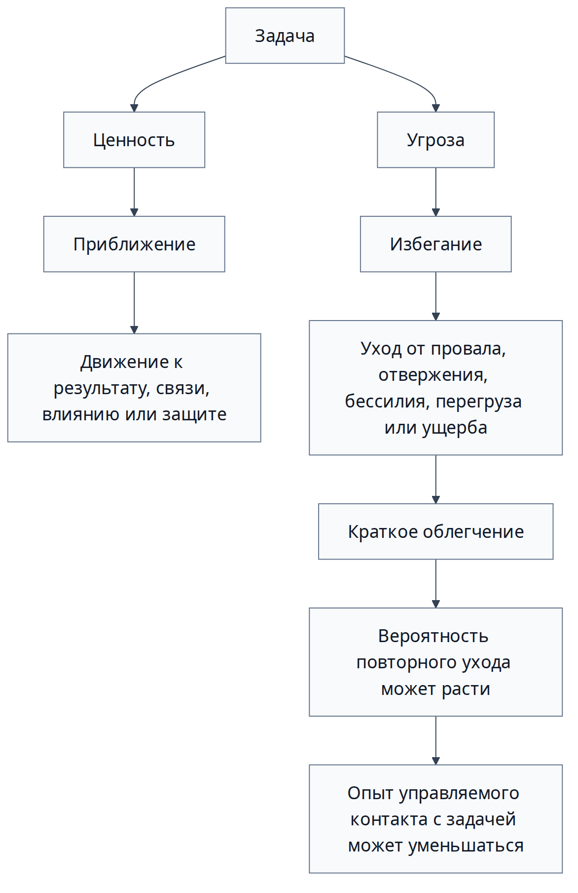{.diagram}


Эта схема показывает центральную ловушку.

Читать ее нужно не как деление действий на хорошие и плохие. Приближение и избегание могут быть разумными в разных условиях. Проблема начинается там, где уход дает краткое облегчение, но забирает опыт управляемого контакта с задачей.

Избегание может быть разумной защитой в конкретный момент. Но если оно повторяется, человек получает меньше опыта управляемого контакта с задачей. Он не проверяет, насколько угроза реальна. Не получает обратную связь. Не учится выдерживать следующий шаг. Не обновляет прогноз о собственной способности действовать.

В результате задача может становиться не только незавершенной, но и более страшной.

## Приближение

Приближение работает через вопрос:

```text
что я хочу получить, создать, освоить, изменить или защитить?
```

В области достижения приближение выглядит как движение к мастерству:

- разобраться;
- сделать качественнее;
- проверить гипотезу;
- научиться;
- увидеть прогресс.

В области принадлежности приближение выглядит как движение к связи:

- задать вопрос;
- попросить обратную связь;
- вступить в разговор;
- восстановить контакт;
- сделать вклад в общее дело.

В области влияния приближение выглядит как движение к воздействию:

- предложить решение;
- взять ответственность;
- изменить процесс;
- обозначить рамку;
- провести людей через неопределенность.

В области безопасности приближение выглядит как движение к защите:

- снизить риск;
- поставить границу;
- проверить опасное место;
- создать запас;
- сделать систему устойчивее.

Приближение обычно расширяет поле действия. Человек видит не только опасность, но и возможности. Он может пробовать, уточнять, просить данные, делать черновик, ошибаться, исправлять.

Это не значит, что в приближении нет напряжения. Хорошая задача может быть трудной. Но трудность здесь не полностью равна угрозе. Она остается связанной с ценностью.

## Избегание

Избегание работает через другой вопрос:

```text
чего нельзя допустить?
```

В области достижения:

- не провалиться;
- не выглядеть некомпетентным;
- не показать сырой результат;
- не получить критику;
- не столкнуться с тем, что задача сложнее меня.

В области принадлежности:

- не быть отвергнутым;
- не испортить отношения;
- не задать глупый вопрос;
- не оказаться неудобным;
- не потерять место среди своих.

В области влияния:

- не оказаться бессильным;
- не встретить сопротивление;
- не взять ответственность без рычагов;
- не потерять статус;
- не признать, что ситуация не поддается контролю.

В области безопасности:

- не получить ущерб;
- не перегрузиться;
- не попасть в хаос;
- не открыть неприятную правду;
- не войти в состояние, из которого потом трудно выйти.

Избегание часто сужает поле. Внимание может начинать искать не лучший путь к ценности, а самый быстрый способ снизить угрозу.

Иногда это правильно. Если угроза реальна и цена ошибки высока, сужение внимания помогает защититься.

Но в интеллектуальной работе, обучении, лидерстве и отношениях угроза часто смешана с неопределенностью. Нужно не убежать от нее целиком, а войти в контакт с задачей в такой форме, где риск становится управляемым.

## Избегание как активная политика

Главная ошибка бытового языка:

```text
избегание = ничего не делать
```

На практике избегание часто очень деятельно.

Человек может:

- чистить почту вместо важного письма;
- доводить оформление до идеала вместо публикации;
- читать еще один источник вместо формулировки собственной мысли;
- спорить о форме задачи вместо входа в суть;
- начинать безопасные мелкие задачи вместо трудной;
- бесконечно уточнять требования, хотя первый проверяемый шаг уже понятен;
- помогать другим, чтобы не войти в собственный риск;
- собирать инструменты вместо работы;
- планировать систему продуктивности вместо выполнения одного конкретного действия.

Снаружи это может выглядеть как занятость, аккуратность, ответственность, подготовка или даже высокая продуктивность.

Внутренний вопрос другой:

```text
приближает ли это к важной ценности
или снижает напряжение от встречи с угрозой?
```

Не всякая подготовка является избеганием. Подготовка полезна, если после нее растет способность сделать следующий шаг.

Подготовка становится избеганием, если она снова и снова заменяет проверку.

Не всякое уточнение является избеганием. Уточнение полезно, если оно снижает реальную неопределенность.

Уточнение становится избеганием, если оно защищает от момента, где нужно взять на себя риск чернового действия.

Не всякая мелкая задача является избеганием. Иногда мелкие задачи действительно нужно закрыть.

Они становятся избеганием, если постоянно выбираются потому, что дают короткое чувство контроля и не требуют встречи с главной угрозой.

## Облегчение как подкрепление

Почему избегание закрепляется?

Потому что оно часто работает.

Не в долгосрочном смысле. В краткосрочном.

Человек не открывает неприятное письмо — напряжение падает.

Не начинает сложную главу — исчезает риск увидеть, что мысль пока слабая.

Не задает вопрос — не сталкивается с возможным стыдом.

Не идет в разговор — не встречает конфликт.

Не смотрит на проблему — не чувствует ее масштаб.

Система получает сигнал:

```text
угроза была -> я ушел -> стало легче
```

Это облегчение может стать подкрепляющим механизмом. Уход начинает казаться рабочим способом регуляции состояния.


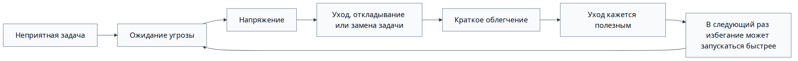{.diagram}


Эта схема важна для понимания прокрастинации.

Прокрастинация часто выглядит как проблема времени:

```text
я плохо планирую
```

Но во многих случаях это проблема регуляции состояния:

```text
я выбираю действие, которое быстрее снижает неприятное чувство сейчас
```

Задача остается важной. Но система отдает приоритет краткосрочному снижению дискомфорта.

Отсюда видно, почему стыд часто плохо работает как ответ на прокрастинацию. Стыд добавляет угрозу к задаче. А если избегание уже было способом уйти от угрозы, дополнительный стыд делает вход еще дороже.

## Матрица областей и режимов

Теперь соединим две оси:

```text
область ценности x режим действия
```

| Область | Приближение | Избегание |
| --- | --- | --- |
| Достижение | Сделать лучше, освоить, проверить мастерство, получить обратную связь. | Не начинать, не показывать черновик, выбирать безопасные задачи, чтобы не столкнуться с провалом. |
| Принадлежность | Вступить в контакт, задать вопрос, попросить обратную связь, восстановить доверие. | Молчать, соглашаться, исчезать, угождать или избегать разговора, чтобы не получить отвержение. |
| Влияние | Внести предложение, изменить ход работы, взять ответственность, обозначить рамку. | Не брать инициативу, гиперконтролировать или спорить о полномочиях, чтобы не встретить бессилие. |
| Безопасность | Построить защиту, снизить риск, поставить границу, сделать систему устойчивее. | Уходить от всего, что похоже на опасность, даже если риск можно проверить и сузить. |

Эта матрица не говорит, что приближение всегда лучше. Она помогает назвать внутреннюю функцию поведения.

Например, молчание на встрече может быть зрелой осторожностью: человек не имеет данных и не хочет вносить шум.

Но то же молчание может быть избеганием: человек понимает важный риск, но боится выглядеть неудобным.

Гиперконтроль может быть временной защитой системы в аварийной ситуации.

Но он же может быть хроническим избеганием бессилия: человек пытается контролировать все, чтобы не встретить границу собственного влияния.

Отдых может быть восстановлением.

Но похожее внешне "полежать и ничего не делать" может быть избеганием, если человек не восстанавливается, а только откладывает встречу с угрозой и остается в фоновом напряжении.

Поэтому нам нужно не угадывать по внешнему виду, а спрашивать о функции.

```text
какую угрозу это поведение снижает?
какую ценность оно помогает построить?
что будет доступнее после этого действия?
```

## Достижение: мастерство или защита от провала

В области достижения приближение направлено к мастерству.

Человек хочет понять, сделать, улучшить, проверить себя на задаче, получить обратную связь и стать сильнее.

Ошибка здесь неприятна, но она не уничтожает смысл. Она дает данные.

Избегание в области достижения направлено от провала.

Тогда задача становится экзаменом личности.

Не:

```text
сработает ли мой подход?
```

а:

```text
что это скажет обо мне, если не получится?
```

Отсюда появляются типичные формы:

- перфекционизм;
- откладывание черновика;
- выбор мелких задач вместо важной;
- бесконечное чтение перед первой попыткой;
- отказ просить обратную связь;
- слишком поздний старт, чтобы не успеть встретиться с полным масштабом задачи;
- объяснение неудачи внешними условиями до проверки реального действия.

Здесь полезно спросить:

```text
я сейчас иду к мастерству
или защищаюсь от свидетельства собственной некомпетентности?
```

Если второе, решение не в том, чтобы сильнее себя продавить. Нужно уменьшить угрозу проверки.

Например:

- назвать первый результат черновиком;
- заранее определить, что будет считаться продвижением, а не успехом целиком;
- показать кусок, а не весь результат;
- запросить обратную связь по одному аспекту;
- ограничить время первой попытки;
- зафиксировать, что ошибка является данными, а не приговором.

Так приближение к мастерству становится снова возможным.

## Принадлежность: связь или защита от отвержения

В области принадлежности приближение направлено к связи.

Человек вступает в контакт, задает вопрос, просит помощи, поддерживает другого, дает честную обратную связь, восстанавливает отношения после напряжения.

Избегание направлено от отвержения.

Тогда контакт становится опасным. Даже нейтральная реакция может читаться как сигнал:

```text
сейчас меня не примут
```

Типичные формы:

- молчать, хотя вопрос важен;
- соглашаться, хотя внутри есть несогласие;
- не просить помощи, чтобы не выглядеть слабым;
- не давать обратную связь, чтобы не испортить отношения;
- исчезать после неоднозначного сообщения;
- брать лишнюю работу, чтобы оставаться удобным;
- делать вид, что все понятно, чтобы не оказаться "не своим".

Здесь полезно спросить:

```text
я сейчас строю связь
или пытаюсь не получить отвержение?
```

Если включено избегание, безопасный вход может выглядеть так:

- задать вопрос в форме проверки понимания;
- попросить короткую обратную связь по одному пункту;
- отделить отношение к человеку от содержания работы;
- явно назвать намерение: "Хочу улучшить решение, не спорить ради спора";
- выбрать формат, где риск стыда меньше: текст, короткая встреча, один собеседник;
- согласовать право на черновую мысль.

Цель не в том, чтобы убрать социальный риск целиком. В живой работе это невозможно. Цель — сделать его переносимым.

## Влияние: действие на ситуацию или защита от бессилия

В области влияния приближение направлено к изменению ситуации.

Человек предлагает, ведет, организует, берет ответственность, собирает рамку, меняет процесс, защищает направление.

Избегание направлено от бессилия.

Бессилие может переживаться по-разному:

- меня не услышат;
- я отвечаю, но не имею рычагов;
- ситуация хаотична;
- другие сопротивляются;
- решение зависит не от меня;
- я потеряю статус, если признаю ограничение влияния.

Избегание влияния бывает двух противоположных видов.

Первый вид — уход:

- не предлагать;
- не брать инициативу;
- не обозначать проблему;
- не входить в спор о направлении;
- ждать, пока кто-то другой решит.

Второй вид — гиперконтроль:

- контролировать каждую мелочь;
- не делегировать;
- давить на форму вместо сути;
- спорить за полномочия;
- удерживать решения у себя;
- пытаться управлять тем, что нельзя управлять напрямую.

Оба варианта могут быть защитой от одного и того же чувства:

```text
я не выдержу столкновение с собственной ограниченностью
```

Здесь полезно спросить:

```text
какой реальный рычаг у меня есть?
```

и второй вопрос:

```text
какой исход я пытаюсь контролировать, хотя он не полностью мой?
```

Безопасный вход в влияние часто начинается не с большого решения, а с уточнения контура:

- что я могу изменить сам;
- на что могу повлиять через аргументы;
- где нужна договоренность;
- где нужно эскалировать;
- где нужно принять ограничение;
- где моя ответственность заканчивается.

Это подготавливает главу 10, где управляемость станет центральным параметром действия.

## Безопасность: защита или хронический уход

В области безопасности приближение направлено к защите.

Это может звучать странно: как можно "приближаться" к безопасности?

Можно.

Человек строит защиту, снижает риск, создает запас, ставит границу, проверяет опасное место, делает систему устойчивее.

Это активная забота о возможности продолжать действовать.

Избегание безопасности выглядит иначе. Оно направлено не на построение защиты, а на уход от всего, что напоминает опасность.

Формы:

- не смотреть на проблему;
- не открывать неприятные данные;
- не принимать решение;
- не входить в задачу с неопределенным исходом;
- не обсуждать риск;
- не менять ничего, даже если текущее положение ухудшается;
- требовать полной гарантии перед первым шагом.

Зрелая безопасность спрашивает:

```text
какой риск реален и как его снизить?
```

Хроническое избегание спрашивает:

```text
как не чувствовать риск вообще?
```

Полностью не чувствовать риск невозможно. Поэтому хроническое избегание начинает требовать все больше контроля, гарантий, подготовки и отсрочек.

В итоге безопасность, которая должна сохранять возможность действия, начинает уничтожать возможность действия.

## Прокрастинация как частный случай избегания

Прокрастинация не всегда является избеганием. Иногда задача правда плохо сформулирована. Иногда человек устал. Иногда среда перегружена. Иногда приоритеты изменились. Иногда нужно восстановиться, а не давить на себя.

Но часто прокрастинация поддерживается именно избеганием.

Задача вызывает неприятное состояние:

- скуку;
- тревогу;
- стыд;
- неопределенность;
- страх провала;
- страх конфликта;
- ощущение бессилия;
- перегруз от масштаба.

Человек выбирает другое действие, которое быстро облегчает состояние:

- открыть новости;
- ответить на простые сообщения;
- заняться настройкой среды;
- сделать второстепенную задачу;
- почитать еще;
- лечь "на пять минут";
- придумать новый план.

Неприятное состояние может уменьшиться.

Именно поэтому поведение может повторяться.

Проблема в том, что краткосрочное облегчение не решает исходную задачу. Более того, оно может увеличить ее будущую цену:

- срок ближе;
- стыда больше;
- контекст холоднее;
- уверенность ниже;
- задача кажется еще опаснее.

Так прокрастинация может становиться не просто потерей времени, а механизмом усиления угрозы.


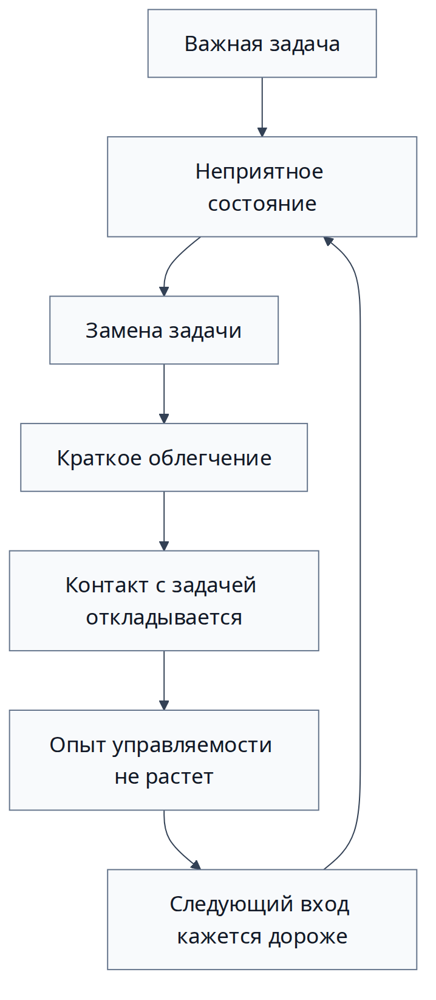{.diagram}


В такой ситуации вопрос "почему я ленюсь?" часто хуже вопроса:

```text
какое состояние я пытаюсь не чувствовать, когда откладываю?
```

Еще точнее:

```text
от какой угрозы меня сейчас защищает незапуск действия?
```

## Избегание и отдых

Избегание часто путают с отдыхом.

Снаружи они могут быть похожи: человек не делает задачу.

Но функция разная.

| Признак | Отдых | Избегание |
| --- | --- | --- |
| Главная функция | Восстановить доступность действия. | Снизить угрозу встречи с задачей. |
| После паузы | Становится немного легче вернуться. | Возвращение часто становится страшнее или стыднее. |
| Отношение к задаче | Задача остается видимой и имеет точку продолжения. | Задача вытесняется, размывается или окружена напряжением. |
| Телесное состояние | Может появиться восстановление. | Часто остается фоновое напряжение. |
| Критерий качества | После отдыха больше ясности, терпимости, сил. | После избегания больше долга, тумана, самокритики. |

Отдых может быть частью приближения. Если задача важна, а система истощена, восстановление является способом сохранить возможность действия.

Избегание может маскироваться под отдых. Тогда человек вроде бы отдыхает, но не восстанавливается, потому что внутри продолжает удерживать угрозу.

Практический вопрос:

```text
после этой паузы я стану ближе к возвращению
или только отложу встречу с угрозой?
```

Если нужен отдых, ему стоит дать форму:

- сколько времени;
- от чего именно восстанавливаюсь;
- какая контрольная точка сохранена;
- каким будет первый шаг после возвращения.

Так отдых перестает быть туманной зоной и становится частью когнитивного контура.

## Полезное и хроническое избегание

Избегание полезно, когда оно защищает от реального вреда и сохраняет возможность действовать дальше.

Примеры полезного избегания:

- не входить в разговор, если человек сейчас в ярости и разговор только ухудшит ситуацию;
- не брать задачу без полномочий, если ответственность не сопровождается рычагами;
- не работать ночью над сложной проблемой, если цена ошибки выше выигрыша во времени;
- не раскрывать личную уязвимость в небезопасной среде;
- не продолжать нагрузку, когда тело уже на границе срыва.

Здесь избегание не является слабостью. Это защита.

Но полезное избегание обычно оставляет следующий разумный шаг:

```text
вернуться позже
поменять формат
получить поддержку
снизить риск
уточнить полномочия
восстановиться
```

Хроническое избегание устроено иначе. Оно обычно не проектирует следующий вход. Оно в основном снижает напряжение сейчас.

Признаки хронического избегания:

- задача возвращается снова и снова;
- каждый вход кажется тяжелее;
- человек не получает опыта, что может выдержать шаг;
- реальные риски не проверяются;
- фантазия об угрозе становится сильнее фактов;
- самооценка падает;
- возникает цикл стыда и нового ухода.

Главная цена хронического избегания — не только несделанная задача. Главная цена — потеря управляемости.

Человек может все меньше верить, что способен входить в трудное и влиять на исход.

Именно поэтому следующая глава будет про управляемость действия.

## Практическая диагностика

Когда действие не запускается, не начинайте с обвинения.

Начните с карты.

```text
1. Какая ценность здесь есть?
2. Какая угроза здесь есть?
3. Какой режим сейчас сильнее: приближение или избегание?
4. Какое поведение дает краткое облегчение?
5. Что будет безопасным первым контактом с задачей?
```

Можно использовать таблицу.

| Вопрос | Зачем он нужен | Пример ответа |
| --- | --- | --- |
| Что я хочу получить или построить? | Найти ценность. | Хочу дать качественный review и улучшить решение. |
| Чего я пытаюсь не встретить? | Найти угрозу. | Боюсь конфликта с автором и ошибки в оценке. |
| Как я ухожу? | Увидеть активное избегание. | Читаю другие MR, отвечаю в чатах, уточняю второстепенное. |
| Какое облегчение я получаю? | Понять подкрепление. | Не чувствую риск испортить отношения. |
| Какой вход снизит угрозу, но сохранит движение? | Спроектировать следующий шаг. | Прочитать только архитектурный контекст и оставить 3 вопроса, без финального вердикта. |

Цель диагностики не в том, чтобы уничтожить страх.

Цель — сделать следующий контакт с задачей достаточно безопасным, чтобы система не выбирала автоматический уход.

## Инженерные способы снизить угрозу входа

Если избегание защищает от угрозы, то простое давление часто усиливает защиту.

Лучше проектировать вход.

| Угроза | Что обычно делает избегание | Более инженерный вход |
| --- | --- | --- |
| Провал | Не начинать или готовиться бесконечно. | Сделать черновую попытку с маленьким критерием продвижения. |
| Критика | Не показывать работу. | Показать фрагмент и запросить обратную связь по одному аспекту. |
| Отвержение | Молчать или соглашаться. | Задать короткий вопрос в безопасном формате. |
| Бессилие | Уйти или гиперконтролировать. | Выписать реальный рычаг действия и границу влияния. |
| Перегруз | Оттягивать вход. | Ограничить рабочий блок по времени и сохранить контрольную точку. |
| Неопределенность | Читать и уточнять без конца. | Сформулировать одну проверяемую гипотезу. |
| Конфликт | Не вступать в разговор. | Разделить намерение, факты и просьбу. |

Эти способы не делают задачу легкой. Они делают ее входной.

Это важное различие.

Когнитивное инженерство не обещает убрать трудность. Оно помогает менять форму контакта с трудностью так, чтобы система могла действовать, учиться и восстанавливаться.

## Подробный пример: отложенный code review

Разберем пример из паспорта главы.

Человек откладывает code review.

Поверхностное объяснение:

```text
не хочет
```

Но если разложить ситуацию, картина сложнее.

### Ценность

В задаче есть достижение:

- хочется дать качественный review;
- важно понять решение;
- важно не пропустить архитектурный риск.

Есть принадлежность:

- важно сохранить рабочий контакт с автором;
- не хочется звучать высокомерно;
- важно быть полезным, а не разрушительным.

Есть влияние:

- review реально меняет качество системы;
- нужно обозначить проблему, если она есть;
- от позиции reviewer зависит техническое направление.

Есть безопасность:

- нужно снизить риск ошибки в production;
- нужно не создать конфликт;
- нужно не потратить слишком много ресурса на неясный MR.

### Угроза

Та же задача содержит угрозы:

- можно ошибиться в оценке;
- можно задеть автора;
- можно обнаружить, что не хватает контекста;
- можно взять на себя спор, который будет трудно закончить;
- можно потратить много времени и не получить ясного вывода.

### Избегание

Поведение:

- открываются более простые MR;
- проверяется почта;
- уточняется второстепенная деталь;
- читается документация без конкретного вопроса;
- review переносится "на момент, когда будет больше сил".

Это не пустота. Это активная замена опасной задачи более безопасными действиями.

### Облегчение

Каждый перенос часто дает облегчение:

```text
сейчас не нужно входить в риск конфликта
сейчас не нужно выносить оценку
сейчас не нужно показывать, что я не все понимаю
```

Но следующий вход часто становится дороже:

- контекст холодеет;
- автор ждет;
- чувство долга растет;
- review превращается из рабочей задачи в социально-статусный узел.

### Более безопасный вход

Не нужно начинать с полного review.

Можно спроектировать первый контакт:

```text
15 минут: прочитать цель MR и архитектурный diff.
Не выносить вердикт.
Выписать только:
1. что понял;
2. какие 2-3 вопроса требуют ответа;
3. есть ли один блокирующий риск.
```

Это может снижать угрозу.

Теперь задача не звучит как:

```text
сделать идеальный review и не ошибиться
```

Она звучит так:

```text
восстановить контекст и сформулировать первые вопросы
```

Приближение может снова стать возможным.

## Что делать, если избегание оправдано

Иногда диагностика показывает: система избегает не фантазии, а реального плохого условия.

Например:

- задача действительно поставлена без полномочий;
- срок нереалистичен;
- среда наказывает за честную ошибку;
- человек истощен;
- конфликт сейчас неуправляем;
- риск слишком велик для одиночного решения;
- задача нарушает ценности или границы.

Тогда цель не в том, чтобы "победить избегание".

Цель — изменить условие.

Возможные шаги:

- запросить полномочия;
- уточнить критерий результата;
- уменьшить объем;
- перевести задачу в совместный формат;
- отложить до восстановления;
- поставить границу;
- отказаться от задачи;
- эскалировать риск;
- разделить ответственность.

Когнитивное инженерство не должно делать человека более удобным для плохих систем.

Если избегание сообщает о реальном вреде, его нужно слушать. Но слушать — не значит автоматически подчиняться. Значит проверить: что именно опасно, насколько это реально, чем можно снизить риск и какой шаг сохраняет управляемость.

## Мини-словарь главы

| Понятие | Рабочее определение |
| --- | --- |
| Приближение | Режим действия, организованный вокруг получения, построения или сохранения ценности. |
| Избегание | Режим действия, организованный вокруг снижения ожидаемого вреда. |
| Угроза | Ожидаемый вред: физический, социальный, статусный, эмоциональный, когнитивный или ресурсный. |
| Защитная политика | Повторяемый способ поведения, который снижает угрозу или напряжение. |
| Облегчение | Снижение неприятного состояния после ухода от задачи или угрозы. |
| Подкрепление ухода | Закрепление избегания благодаря тому, что уход быстро снижает напряжение. |
| Хроническое избегание | Повторяющийся уход от задачи, который снижает дискомфорт сейчас, но уменьшает будущую управляемость. |
| Замаскированное избегание | Внешне продуктивное действие, функция которого — не приблизить ценность, а не встретиться с угрозой. |
| Конфликт цель-угроза | Ситуация, где один и тот же объект одновременно ценен и опасен. |

## Вопросы для самопроверки

1. Почему важная задача может вызывать избегание?
2. Чем избегание отличается от отсутствия мотивации?
3. Почему краткое облегчение закрепляет уход?
4. Как отличить отдых от избегания?
5. Почему безопасность не равна избеганию?
6. Как одна и та же область мотивации может работать в режиме приближения и в режиме избегания?
7. Почему стыд часто ухудшает прокрастинацию?
8. Какой первый шаг снижает угрозу, но сохраняет движение?

## Мини-практика

Возьмите одну задачу, которую вы откладываете.

Заполните таблицу:

| Вопрос | Ответ |
| --- | --- |
| Что в этой задаче ценно? |  |
| Какая область мотивации сильнее всего включена: достижение, принадлежность, влияние, безопасность? |  |
| Какая потеря или угроза делает задачу опасной? |  |
| Как я обычно ухожу от встречи с этой угрозой? |  |
| Какое краткое облегчение я получаю? |  |
| Какую цену я плачу позже? |  |
| Какой первый контакт с задачей будет достаточно безопасным? |  |

После этого сформулируйте шаг в таком виде:

```text
Я не обязан сейчас решить всю задачу.
Я делаю только первый безопасный контакт:
<конкретное действие>
в течение <ограничение по времени>
чтобы получить <какой сигнал или данные>.
```

Пример:

```text
Я не обязан сейчас написать всю главу.
Я делаю только первый безопасный контакт:
выписываю 5 тезисов и 3 угрозы текста
в течение 25 минут,
чтобы увидеть, где настоящая трудность.
```

## Короткое резюме

1. Мотивация работает не только как движение к ценности, но и как уход от угрозы.
2. Избегание — активный режим действия, а не пустое отсутствие мотивации.
3. Одна и та же область ценности может работать в режиме приближения или избегания.
4. Краткое облегчение может закреплять уход, поэтому избегание часто повторяется.
5. Прокрастинация часто является регуляцией неприятного состояния сейчас, а не доказательством отсутствия ценности.
6. Хороший отдых восстанавливает или поддерживает доступность действия; избегание снижает угрозу встречи с задачей.
7. Полезное избегание защищает от реального вреда и оставляет следующий шаг. Хроническое избегание сужает будущую управляемость.
8. Лучший вопрос главы: `От какой угрозы меня сейчас защищает незапуск действия?`
9. Инженерное решение — не давить сильнее, а проектировать более безопасный вход в задачу.

## Переход к следующей главе

Теперь мы умеем видеть, что действие может быть направлено к ценности или от угрозы.

Но остается следующий вопрос:

```text
почему в одних случаях человек выдерживает угрозу и действует,
а в других уходит, замирает или откладывает?
```

Ответ часто связан с управляемостью.

Если человек ожидает, что его действие может изменить исход, угроза часто становится переносимее. Если действие кажется бесполезным, даже ценная задача может начинать выглядеть как расход в пустоту.

Дальше нужно разобрать управляемость действия:

```text
могу ли я повлиять на то, что произойдет?
```

---

# Глава 10. Управляемость действия

## Почему ценности и угрозы недостаточно

В главе 9 мы увидели две направленности действия:

```text
приближение -> движение к ценности
избегание -> уход от угрозы
```

Но остается важный вопрос.

Почему в одних случаях человек видит угрозу и все равно действует, а в других — уходит, замирает, откладывает или начинает защищаться?

Один ответ уже был подготовлен раньше:

```text
значение имеет управляемость
```

Если человек ожидает, что его действие может что-то изменить, угроза часто становится переносимее. Трудность не исчезает, но может превращаться в рабочий материал.

Если человек ожидает, что его действие ничего не изменит, даже ценная задача начинает выглядеть как расход в пустоту.

Управляемость здесь становится одним из центральных параметров когнитивного инженерства.

Управляемость нужна, чтобы не путать разные состояния:

- "я хочу, но не знаю, что могу сделать";
- "я знаю, что делать, но не верю, что это повлияет";
- "шанс успеха есть, но исход зависит не от меня";
- "шанс успеха низкий, но каждая попытка дает данные";
- "меня просят стараться, но не дают рычага";
- "я чувствую контроль, но реального рычага нет";
- "мне трудно, но я могу сделать следующий шаг и получить обратную связь".

Все эти состояния нельзя лечить одной фразой:

```text
надо больше мотивации
```

Иногда нужна не мотивация, а рычаг.

## Рабочее определение

Управляемость — это ожидание, что конкретное действие может повлиять на конкретный исход.

Проще:

```text
если я сделаю X, изменится ли Y?
```

Здесь важны все три части:

- конкретное действие;
- конкретный исход;
- ожидаемая связь между ними.

Если действие не названо, управляемость размывается.

Если исход не назван, непонятно, на что мы пытаемся влиять.

Если связь между действием и исходом не видна, усилие начинает казаться бессмысленным.

Управляемость не означает:

```text
я все контролирую
```

Она означает:

```text
у меня есть хотя бы частичный рычаг
```

Это важное различие.

В сложных человеческих задачах почти никогда нет полного контроля. Разработчик не контролирует всю систему. Лидер не контролирует всех людей. Автор не контролирует реакцию читателя. Родитель не контролирует внутренний мир ребенка. Человек не контролирует тело как механизм.

Но между полным контролем и полной беспомощностью есть рабочая зона:

```text
я не управляю всем исходом,
но могу сделать действие, которое меняет вероятность, качество, скорость, ясность или следующий шаг
```

Именно эта зона нужна для действия.

## Схема управляемости

Вопрос схемы: есть ли у человека рычаг, который связывает действие с изменением ситуации.


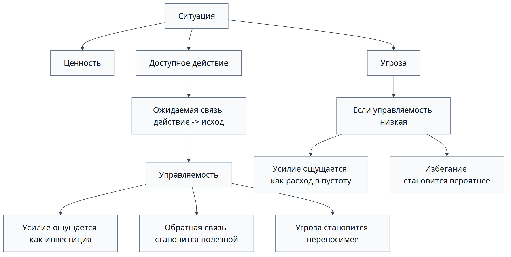{.diagram}


Схему нужно читать так.

Ценность говорит, зачем вообще входить в задачу. Угроза говорит, что может пойти плохо. Но управляемость отвечает на другой вопрос:

```text
есть ли у меня способ повлиять на то, что произойдет?
```

Если способ есть, усилие может получить смысл. Оно может становиться не просто болью, а вложением.

Если способа нет, усилие теряет смысл. Даже небольшое действие может ощущаться тяжелым, потому что система не видит причинной связи между затратой и результатом.

Эта схема не обещает полного контроля. Наоборот, она нужна, чтобы найти частичный рычаг: что можно проверить, изменить, уточнить, ограничить или вынести во внешний контур.

## Управляемость не равна вероятности успеха

Самая важная таблица главы:

| Ситуация | Высокая управляемость | Низкая управляемость |
| --- | --- | --- |
| Высокая вероятность успеха | Рабочее действие: понятно, что делать, и шанс хороший. | Пассивное ожидание: исход может быть хорошим, но не от меня зависит. |
| Низкая вероятность успеха | Исследование: шанс мал, но можно пробовать, получать данные и учиться. | Беспомощность: шанс мал и рычага нет. |

Разберем все четыре клетки.

### Высокая вероятность успеха, высокая управляемость

Это самая простая зона.

Человек понимает, что нужно сделать, и ожидает, что действие с хорошей вероятностью приведет к результату.

Примеры:

- запустить известную проверку;
- написать понятное письмо;
- выполнить привычную тренировку;
- закрыть задачу с ясным критерием;
- повторить навык, который уже освоен.

Здесь мотивация обычно не требует сложной инженерии. Часто достаточно защитить время, контекст и состояние.

### Высокая вероятность успеха, низкая управляемость

Эта зона обманчива.

Исход может быть почти наверняка хорошим, но человек не чувствует, что он сам на него влияет.

Примеры:

- заявка почти наверняка будет одобрена, но решение полностью у другого отдела;
- проект, скорее всего, пройдет, но вклад конкретного человека неразличим;
- команда справится, но отдельный участник не видит своего рычага;
- процесс идет по инерции, а человек только ждет результата.

Снаружи все неплохо. Но авторства мало.

Здесь может не быть тревоги. Может быть скука, отчуждение, пассивность или ощущение:

```text
от меня ничего не зависит
```

Такая ситуация особенно важна для лидерства и командной работы. Если человек не видит своего вклада, он может формально участвовать, но не включаться.

### Низкая вероятность успеха, высокая управляемость

Это зона исследования.

Шанс полного успеха пока низкий. Но каждое действие дает данные. Можно пробовать, корректировать, учиться, менять стратегию.

Примеры:

- сложный баг, где гипотезы можно проверять;
- новый навык, где прогресс медленный, но обратная связь ясная;
- стартап-гипотеза, где результат неизвестен, но можно проводить эксперименты;
- трудный текст, где черновики постепенно улучшают мысль;
- переговоры, где нельзя гарантировать исход, но можно менять формат и аргументы.

Эта зона может быть напряженной, но она не равна беспомощности.

Наоборот, именно здесь часто растет компетентность.

Человек не знает, получится ли. Но он знает, что делать, чтобы узнать больше.

### Низкая вероятность успеха, низкая управляемость

Это зона беспомощности.

Ценность может быть высокой. Угроза может быть высокой. Но человек не видит действия, которое меняет исход.

Примеры:

- задача зависит от неясных решений других людей;
- критерии постоянно меняются;
- обратная связь запаздывает или противоречит сама себе;
- ответственность есть, полномочий нет;
- наказание за ошибку есть, права на корректировку нет;
- человек много раз пробовал и не увидел связи между усилием и результатом.

Здесь давление часто ухудшает ситуацию.

Если сказать:

```text
просто старайся сильнее
```

можно увеличить не действие, а ощущение бессмысленного расхода.

Для выхода из этой зоны нужен не лозунг, а восстановление рычага.

## Самоэффективность

Близкое понятие — самоэффективность.

Самоэффективность — это ожидание, что я способен выполнить действия, необходимые для результата.

Это не самооценка.

Самооценка может звучать так:

```text
я хороший специалист
я умный
я сильный
я справляющийся человек
```

Самоэффективность звучит иначе:

```text
я могу выполнить вот это действие в вот таких условиях
```

Человек может иметь нормальную самооценку и низкую самоэффективность в новой задаче.

Например:

```text
я в целом сильный инженер,
но не уверен, что смогу провести этот разговор с заказчиком
```

И наоборот: человек может быть строг к себе, но иметь высокую самоэффективность в конкретном навыке.

```text
я не считаю себя выдающимся,
но знаю, что могу разобрать этот класс ошибок
```

Для когнитивного инженерства важна именно конкретность.

Не:

```text
верю ли я в себя вообще?
```

А:

```text
верю ли я, что могу выполнить следующий шаг?
```

## Откуда берется управляемость

Управляемость не возникает из убеждения на пустом месте.

Она строится из опыта.

Самый важный источник — опыт действия, которое дало сдвиг.

```text
я сделал -> что-то изменилось -> я понял связь -> в следующий раз трудность стала чуть более управляемой
```

У Bandura это близко к опыту успешного овладения: человек видит, что способен справиться с задачей или ее частью. Не потому, что ему сказали "ты можешь", а потому что он пережил связку:

```text
попытка -> обратная связь -> корректировка -> результат
```

Есть и другие источники:

- наблюдение за похожими людьми;
- поддерживающая обратная связь;
- объяснение стратегии;
- телесное и эмоциональное состояние;
- понятные критерии;
- право на ошибку и повтор.

Но главный материал управляемости — не похвала. Главный материал — причинная петля действия.


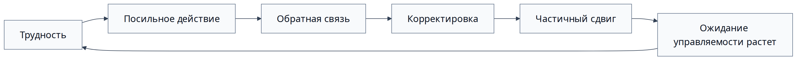{.diagram}


Эта петля важна для будущей главы 19 об опыте преодоления. Здесь мы берем только ее мотивационный смысл.

Если человек регулярно проходит через такие петли, трудность может постепенно переставать означать:

```text
надо уйти
```

и начинает означать:

```text
надо найти следующий управляемый шаг
```

## Обратная связь как источник рычага

Обратная связь часто понимают слишком узко.

```text
обратная связь = похвала или критика
```

Для управляемости это неверно.

Обратная связь — это сигнал, который показывает, что изменилось после действия.

Она может быть:

- технической: тест прошел или упал;
- поведенческой: человек ответил, уточнил, изменил действие;
- учебной: стало понятно, где ошибка;
- телесной: после отдыха внимание стало устойчивее;
- социальной: формат разговора снизил напряжение;
- процессной: новый порядок работы уменьшил задержки.

Хорошая обратная связь не обязана быть приятной. Она должна быть пригодной для корректировки.

Если сигнал не показывает связь между действием и исходом, управляемость не растет.

Например:

```text
плохо
```

Это не обратная связь. Это оценка без рычага.

```text
в тексте сильная структура, но во втором разделе смешаны причина и следствие
```

Это уже материал действия.

В рабочей среде управляемость часто рушится не потому, что задача невозможна, а потому что обратная связь слишком поздняя, слишком общая или слишком социально опасная.

## Выученная беспомощность

Теперь можно аккуратно ввести беспомощность.

Беспомощность — это не слабый характер.

Это состояние, в котором система не ожидает, что действие изменит исход.

Историческая линия выученной беспомощности возникла из экспериментов с неконтролируемым неприятным воздействием. Современное понимание стало тоньше: важно не только то, что беспомощность "выучивается", но и то, что опыт контроля может менять реакцию на будущие стрессоры.

Для учебника важен не прямой перенос лабораторной модели на жизнь. В человеческой жизни гораздо больше уровней: смысл, отношения, социальная власть, тело, прошлый опыт, язык, культура.

Но общий принцип полезен:

```text
если система многократно встречает ситуацию, где действие не меняет исход,
она начинает экономить попытки
```

Снаружи это может выглядеть как:

- лень;
- апатия;
- цинизм;
- пассивная агрессия;
- уход в безопасные задачи;
- отказ предлагать;
- "все равно ничего не изменится";
- формальное участие без авторства.

Но внутри часто работает другое:

```text
усилие не окупается
```

Если это так, давление на волю обычно не решает проблему. Нужна проверка связи между действием и исходом.

## Выученная управляемость

Нам важно говорить не только о беспомощности, но и о выученной управляемости.

Это не официальный ярлык для всех случаев, а удобное рабочее название для повторяющегося опыта:

```text
трудно -> я действую -> получаю сигнал -> корректирую -> что-то меняется
```

Такой опыт меняет будущий вход в трудность.

Человек начинает ожидать:

```text
я не обязан сразу победить,
но, вероятно, смогу найти действие, которое даст данные
```

Это и есть сильная альтернатива избеганию.

Глава 9 показала цикл избегания:

```text
угроза -> уход -> облегчение -> повторный уход
```

Глава 10 добавляет другой цикл:

```text
трудность -> действие -> обратная связь -> сдвиг -> рост управляемости
```

Сравним:

| Петля | Краткосрочный эффект | Долгосрочный эффект |
| --- | --- | --- |
| Избегание | Снижает напряжение сейчас. | Уменьшает опыт управляемого контакта с задачей. |
| Управляемость | Требует входа в трудность. | Увеличивает ожидание, что действие может менять исход. |

Это не значит, что всегда нужно выбирать вторую петлю.

Если угроза реальна и цена слишком высока, сначала нужна защита или восстановление.

Но если задача важна и хотя бы частично управляема, маленькая петля управляемости часто полезнее, чем большой рывок героизма.

## Социальная управляемость

В индивидуальных примерах управляемость часто выглядит просто:

```text
я сделал действие -> получил результат
```

В работе и лидерстве все сложнее.

Там исход зависит от людей, ролей, полномочий, договоренностей, сроков, приоритетов, доверия и права на ошибку.

Поэтому нужна социальная управляемость.

Социальная управляемость — это ожидание, что я могу влиять на социальную ситуацию через доступные действия.

Например:

- могу задать вопрос и получить ответ;
- могу обозначить риск, и меня услышат;
- могу попросить ресурс;
- могу изменить приоритет;
- могу договориться о критерии;
- могу эскалировать проблему;
- могу сказать "нет" без разрушения отношений;
- могу предложить решение и увидеть реакцию.

Если социальная управляемость низкая, мотивация может проседать даже у сильных людей.

Типичный пример:

```text
ответственность есть, полномочий нет
```

Это одна из самых разрушительных для включенности конфигураций.

Человека оценивают по исходу, но не дают рычагов влияния. В такой среде растут цинизм, защитный контроль, избегание инициативы и выгорание.

Инженерное лидерство здесь начинается не с вдохновляющей речи, а с вопроса:

```text
какой рычаг действия есть у человека?
```

Если рычага нет, первый инженерный ход — менять рамку:

- уточнять полномочия;
- давать доступ к информации;
- сокращать зависимость от чужих решений;
- ускорять обратную связь;
- признавать границы ответственности;
- создавать право на вопрос;
- согласовывать критерий результата.

## Когда управляемость низкая

Низкая управляемость может выглядеть по-разному.

### Пассивное ожидание

Человек ждет решения, письма, реакции, согласования, внешнего сигнала.

Он может быть не против задачи. Но действие не запускается, потому что следующий ход не его.

Инженерный вопрос:

```text
есть ли маленькое действие, которое уменьшит неопределенность?
```

Например:

- отправить уточнение;
- поставить срок ответа;
- подготовить два варианта;
- выписать, что можно сделать без внешнего решения;
- перевести ожидание в явный dependency.

### Замирание

Человек видит угрозу, но не видит хода.

Система не выбирает ни приближение, ни уход. Она зависает.

Инженерный вопрос:

```text
какой самый маленький наблюдаемый шаг не требует решения всей задачи?
```

### Цинизм

Цинизм иногда является не мировоззрением, а защитой от повторного опыта бесполезного усилия.

```text
зачем предлагать, если все равно не услышат?
```

Здесь обычно бесполезно требовать вовлеченности без изменения среды. Сначала нужно дать человеку опыт, что хотя бы небольшой вклад имеет последствия.

### Гиперконтроль

Низкая управляемость не всегда ведет к пассивности. Иногда она ведет к попытке контролировать больше, чем реально доступно.

Человек не выдерживает неопределенность и пытается компенсировать ее микроменеджментом, избыточными проверками, жесткими правилами, запретом вариантов.

Инженерный вопрос:

```text
какой риск я пытаюсь снизить контролем,
и есть ли более точный рычаг?
```

## Иллюзия контроля

До этого момента может показаться, что нужно просто повышать управляемость.

Но есть граница:

```text
переживание контроля может быть иллюзорным
```

Человек может чувствовать влияние там, где его нет. Может видеть закономерность в случайности. Может переоценивать силу личного действия. Может считать, что правильный ритуал, настроение или подготовка гарантируют исход.

Для когнитивного инженерства это опасно.

Нам нужна не приятная иллюзия, а рабочая управляемость.

Различие:

| Вопрос | Рабочая управляемость | Иллюзия контроля |
| --- | --- | --- |
| Есть ли действие? | Да, конкретное. | Часто общее или символическое. |
| Есть ли наблюдаемый исход? | Да, хотя бы промежуточный. | Исход размытый или подгоняется задним числом. |
| Есть ли обратная связь? | Да, она может опровергнуть гипотезу. | Обратная связь игнорируется или переобъясняется. |
| Можно ли скорректировать способ? | Да. | Обычно способ защищается от проверки. |
| Признаются ли границы влияния? | Да. | Нет, контроль переживается шире фактов. |

Управляемость требует честности.

Иногда лучший вывод:

```text
здесь у меня нет прямого рычага
```

Это не поражение. Это экономия сил и точная карта реальности.

После такого вывода можно искать другой уровень влияния:

- не изменить решение, но подготовить позицию;
- не контролировать реакцию человека, но изменить форму разговора;
- не гарантировать результат, но улучшить качество попытки;
- не убрать риск, но ограничить ущерб;
- не ускорить внешний процесс, но явно зафиксировать dependency.

## Практическая диагностика управляемости

Когда задача не двигается, полезно пройти короткую диагностику.

| Вопрос | Что проверяет |
| --- | --- |
| На какой исход я пытаюсь повлиять? | Не размыт ли результат. |
| Какое мое действие может изменить этот исход? | Есть ли рычаг. |
| Какой сигнал покажет, что действие сработало или не сработало? | Есть ли обратная связь. |
| Что зависит от меня, а что нет? | Не смешаны ли зоны ответственности. |
| Где нужна информация, полномочие или поддержка? | Не подменяется ли отсутствие рычага "низкой мотивацией". |
| Какой самый маленький управляемый шаг можно сделать сейчас? | Есть ли вход без героизма. |

Эта диагностика особенно полезна после главы 9.

Если человек избегает задачу, мы уже умеем спросить:

```text
от какой угрозы меня защищает незапуск?
```

Теперь добавляем:

```text
какой рычаг сделает встречу с этой угрозой управляемой?
```

## Инженерные способы восстановить рычаг

| Сбой управляемости | Как выглядит | Что можно сделать |
| --- | --- | --- |
| Размытый исход | Непонятно, что должно измениться. | Назвать наблюдаемый результат или промежуточный сигнал. |
| Нет первого действия | Цель есть, входа нет. | Сформулировать действие на 10-25 минут. |
| Нет обратной связи | Непонятно, помогло ли действие. | Договориться о сигнале: тест, ревью, ответ, метрика, проверка. |
| Нет полномочий | Ответственность есть, рычага нет. | Запросить полномочие, ресурс или изменить рамку ответственности. |
| Зависимость от другого человека | Работа стоит в ожидании. | Сделать dependency явным, поставить срок, подготовить альтернативу. |
| Слишком большая ставка | Ошибка кажется непереносимой. | Снизить размер попытки, сделать обратимый эксперимент. |
| История неудач | Система ждет бесполезности усилия. | Начать с маленького действия, где связь действие-результат быстро видна. |
| Иллюзия контроля | Человек держится за ритуалы вместо проверки. | Назвать проверяемый исход и допустить опровержение. |

Здесь снова важен принцип всего учебника:

```text
не давить сильнее, а проектировать условия действия точнее
```

## Подробный пример: две одинаково сложные задачи

Представим две рабочие задачи.

### Задача A

Есть сложный дефект в системе.

Пока непонятно, где причина. Но можно:

- воспроизвести ошибку;
- посмотреть логи;
- проверить одну гипотезу;
- сузить область поиска;
- получить результат за 30 минут;
- зафиксировать, что стало известно.

Вероятность сразу найти причину невысока.

Но управляемость высокая.

Человек понимает:

```text
каждая проверка уменьшит туман
```

Это исследовательская зона. Она может быть трудной, но действие имеет смысл.

### Задача B

Нужно подготовить важное решение.

Но:

- критерий результата меняется;
- несколько людей дают противоречивые ожидания;
- финальное решение принимает другой человек;
- обратная связь приходит поздно;
- ответственность за провал останется на исполнителе;
- непонятно, какой первый шаг будет признан полезным.

Формально задача может быть даже важнее задачи A.

Но управляемость ниже.

Человек может откладывать не потому, что не понимает значимости, а потому что система видит:

```text
я заплачу усилием,
но не знаю, изменит ли оно исход
```

Рабочий вход здесь должен быть другим.

Не:

```text
соберись и сделай решение
```

А:

```text
1. явно выписать критерии, которые конфликтуют;
2. запросить подтверждение критерия у владельца решения;
3. предложить два варианта с последствиями;
4. зафиксировать dependency и границу ответственности.
```

Мы не повысили "желание". Мы восстановили рычаг.

## Как это связано с преодолением

Преодоление часто понимают как способность терпеть трудное.

Это слишком грубо.

Полезное преодоление опирается на управляемость.

Если человек просто терпит неконтролируемую трудность, он может тренировать не силу, а беспомощность.

Опыт преодоления строится иначе:

```text
трудно
но я могу сделать шаг
шаг дает сигнал
сигнал позволяет скорректироваться
корректировка дает сдвиг
значит, будущая трудность чуть более управляема
```

Поэтому хорошая тренировка трудного старается не бросать человека в хаос.

Она дозирует сопротивление и сохраняет причинную связь между действием и обратной связью.

Это пригодится в главе 19, где мы отдельно разберем опыт преодоления. Сейчас важно запомнить основу:

```text
трудность полезна не сама по себе,
а когда она остается обучающе управляемой
```

## Границы

Управляемость — сильное понятие, но оно не объясняет все.

Есть ситуации, где проблема не в управляемости:

- человеку физически нужен сон или лечение;
- задача потеряла ценность;
- среда действительно небезопасна;
- человек находится в клиническом состоянии;
- конфликт ценностей не решается маленьким рычагом;
- требуется внешнее решение, ресурс или защита;
- система вознаграждает не результат, а политическую игру.

В таких случаях нельзя говорить:

```text
просто найди управляемый шаг
```

Иногда нужно восстановление. Иногда отказ. Иногда переговоры. Иногда изменение среды. Иногда профессиональная помощь.

Когнитивное инженерство не должно подменять реальность техникой.

Оно должно помогать видеть:

```text
где есть мой рычаг
где нужен чужой рычаг
где рычага нет
и где я выдаю отсутствие рычага за отсутствие мотивации
```

## Мини-словарь главы

| Понятие | Рабочее определение |
| --- | --- |
| Управляемость | Ожидание, что конкретное действие может повлиять на конкретный исход. |
| Вероятность успеха | Оценка шанса, что желаемый исход случится. |
| Рычаг действия | Доступное действие, которое способно изменить исход, вероятность, ясность или следующий шаг. |
| Самоэффективность | Ожидание, что я способен выполнить действие, необходимое для результата. |
| Mastery experience | Опыт, где действие, обратная связь и корректировка дают переживание способности справляться. |
| Обратная связь | Сигнал о том, что изменилось после действия и как можно корректироваться. |
| Беспомощность | Состояние, где действие не ожидается как влияющее на исход. |
| Выученная управляемость | Накопленный опыт, что трудность можно проходить через посильное действие и обратную связь. |
| Социальная управляемость | Ожидание, что можно влиять на социальную ситуацию через вопросы, договоренности, полномочия, обратную связь и рамки ответственности. |
| Иллюзия контроля | Переживание влияния там, где проверяемого рычага нет или обратная связь игнорируется. |

## Вопросы для самопроверки

1. Почему управляемость не равна вероятности успеха?
2. Чем самоэффективность отличается от самооценки?
3. Почему низкая вероятность успеха при высокой управляемости может быть хорошей зоной обучения?
4. Почему высокая вероятность успеха при низкой управляемости может снижать включенность?
5. Почему давление на усилие может ухудшить состояние при низкой управляемости?
6. Чем рабочая управляемость отличается от иллюзии контроля?
7. Какие элементы среды создают социальную управляемость?
8. Какой маленький рычаг можно восстановить в задаче, которую вы сейчас откладываете?

## Мини-практика

Возьмите одну задачу, которую вы избегаете или откладываете.

Заполните таблицу:

| Вопрос | Ответ |
| --- | --- |
| Какой исход я хочу изменить? |  |
| Какова примерная вероятность успеха сейчас? |  |
| Насколько исход зависит от моих действий? |  |
| Какое действие реально может изменить исход или дать данные? |  |
| Какой сигнал покажет эффект действия? |  |
| Что не зависит от меня? |  |
| Какой ресурс, доступ, полномочие или поддержка нужны? |  |
| Какой первый управляемый шаг можно сделать за 10-25 минут? |  |

После этого сформулируйте рабочий вход:

```text
Я не пытаюсь контролировать весь исход.
Я делаю действие:
<конкретный шаг>
чтобы получить сигнал:
<какая обратная связь>
и после этого решить:
<следующая развилка>.
```

Пример:

```text
Я не пытаюсь сразу закрыть весь архитектурный спор.
Я выписываю два варианта решения и три последствия каждого,
чтобы получить от владельца продукта подтверждение критерия выбора,
и после этого решить, какой вариант детализировать.
```

## Короткое резюме

1. Управляемость — это ожидаемая связь между действием и исходом.
2. Вероятность успеха и управляемость — разные параметры.
3. Низкий шанс успеха не обязательно разрушает действие, если есть исследовательский рычаг.
4. Высокий шанс успеха не дает авторства, если исход не зависит от человека.
5. Самоэффективность — это не самооценка, а ожидание способности выполнить конкретное действие.
6. Управляемость растет через петлю: действие -> обратная связь -> корректировка -> сдвиг.
7. Беспомощность — не моральная слабость, а режим, где усилие не ожидается как влияющее.
8. Социальная управляемость зависит от полномочий, информации, обратной связи, доверия и права на вопрос.
9. Переживание контроля нужно проверять: иногда оно иллюзорно.
10. Восстановление мотивации часто начинается не с желания, а с возвращения рычага.

## Переход к следующей главе

Теперь у нас есть три крупных параметра мотивационного действия:

```text
ценность
угроза
управляемость
```

Но даже если задача ценна, угроза снижена, а рычаг найден, действие может оставаться недоступным.

Почему?

Потому что у действия есть цена.

Эта цена не сводится к физической усталости. Она может быть когнитивной, эмоциональной, социальной, идентичностной и телесно-регуляторной.

Дальше нужно разобрать:

```text
цена усилия, усталость и ощущаемая энергия
```

---

# Глава 11. Цена усилия, усталость и ощущаемая энергия

## Почему "могу повлиять" еще не значит "могу сейчас"

В главе 10 мы разобрали управляемость:

```text
если я сделаю X, изменится ли Y?
```

Это был важный шаг. Пока человек не видит рычага, усилие легко превращается в расход в пустоту. Но управляемость не закрывает всю мотивационную модель.

Даже если рычаг есть, действие может оставаться недоступным.

Человек может понимать задачу, видеть ценность, не считать ее смертельно опасной и все равно не входить в работу. Не потому, что он "на самом деле не хочет". Не потому, что слабый. И не потому, что в нем закончился один общий бак энергии.

У действия есть цена.

Эта цена может быть физической: нужно встать, ехать, двигаться, терпеть дискомфорт, выдерживать нагрузку.

Она может быть когнитивной: нужно держать много условий, читать сложный код, сравнивать гипотезы, не потерять ход мысли.

Она может быть социально-эмоциональной: нужно написать неприятное сообщение, встретиться с реакцией другого человека, признать ошибку, выдержать конфликт.

Она может быть идентичностной: нужно увидеть, что я пока не умею, что мой уровень ниже желаемого, что образ "я справляюсь" не совпадает с фактом.

Она может быть восстановительной: после действия придется долго приходить в себя, возвращать фокус, разгружать тело, закрывать последствия.

Поэтому фраза:

```text
у меня нет энергии
```

слишком грубая. Иногда она говорит о настоящей усталости. Иногда - о высокой цене входа. Иногда - о социальном риске. Иногда - о низком восстановлении. Иногда - о тревоге, которая маскируется под усталость. Иногда - о задаче, которая стала слишком дорогой для текущего состояния системы.

Здесь нужно научиться раскладывать "нет энергии" на составные части.

## Рабочее определение цены усилия

Цена усилия - это субъективная стоимость действия в текущем состоянии системы.

В этом определении важны три слова.

Первое: `субъективная`.

Субъективная не значит выдуманная. Цена действия не обязана совпадать с тем, как оно выглядит со стороны. Письмо на пять строк может быть дороже двух часов кода, если в письме есть стыд, риск конфликта и неопределенная реакция. Созвон на полчаса может быть тяжелее спокойного рабочего блока, если после него придется восстанавливать внимание и эмоциональное равновесие.

Второе: `стоимость`.

Усилие не только неприятно. Иногда оно ценно само по себе: трудное упражнение дает гордость, сложная глава дает чувство роста, тяжелая тренировка подтверждает способность выдерживать нагрузку. Но даже ценное усилие остается затратой. Его нужно оплатить вниманием, телом, временем, регуляцией эмоций и восстановлением.

Третье: `в текущем состоянии`.

Одна и та же задача в разные дни стоит по-разному. После сна, ясного утра и понятного плана цена входа ниже. После ночи без восстановления, конфликтного дня и трех прерываний цена той же задачи выше. Это не каприз. Система оценивает не абстрактную задачу, а задачу здесь и сейчас.

Минимальная формула главы:

```text
доступность действия =
ценность результата
+ управляемость
- угроза
- цена усилия
- цена восстановления
с поправкой на состояние тела, памяти, среды и отношений
```

Это не математическая формула. Это способ не потерять важные переменные.

## Схема цены действия

Вопрос схемы: что делает важное действие доступным или слишком дорогим в текущем состоянии.


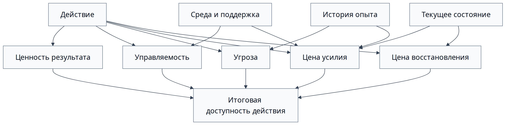{.diagram}


Схему нужно читать так.

Ценность тянет к действию. Управляемость может делать усилие осмысленным. Угроза может повышать осторожность или избегание. Цена усилия показывает, сколько придется заплатить сейчас. Цена восстановления показывает, чем действие отзовется потом.

Если смотреть только на ценность, мы получим моральный вопрос:

```text
почему я не делаю то, что важно?
```

Если добавить цену, вопрос становится инженерным:

```text
что именно делает важное действие слишком дорогим сейчас?
```

Эта схема не изображает человека как бак энергии. Она показывает несколько источников цены: усилие сейчас, угрозу, восстановление после действия, состояние тела, прошлый опыт и среду. Поэтому ответом может быть не только "отдохнуть", но и "снизить первый шаг", "вернуть рычаг", "убрать лишнюю угрозу" или "вынести контекст наружу".

## Виды цены усилия

Цена усилия не одна. Ее полезно разложить на несколько видов.

| Вид цены | Что дорого | Как это ощущается | Как снижать |
| --- | --- | --- | --- |
| Физическая | Движение, поза, боль, нагрузка, недосып, болезнь, дорога. | "телу тяжело", "не вывожу", "хочу лечь". | Сон, пауза, еда, вода, разминка, смена позы, перенос тяжелого действия на более подходящее время. |
| Когнитивная | Рабочая память, внимание, неопределенность, сложность, поиск решения. | "не держу все в голове", "не понимаю, с чего начать". | Внешняя карта контекста, маленький первый шаг, схема, разбиение, рабочий журнал. |
| Социально-эмоциональная | Реакция людей, конфликт, просьба, отказ, публичность, чужая оценка. | "не хочу писать", "будет неприятно", "меня сейчас разнесет". | Подготовить текст, снизить публичность, попросить поддержку, уточнить рамку разговора, сделать шаг обратимым. |
| Идентичностная | Угроза образу себя: компетентный, сильный, хороший, нужный, взрослый. | "если не получится, это скажет обо мне что-то плохое". | Отделить результат от личности, разрешить черновик, задать критерий обучения, искать данные вместо приговора. |
| Временная | Длительность, разгон, длинный горизонт, невозможность быстро закрыть. | "это поглотит весь день", "я застряну". | Ограничить блок, определить критерий продвижения, оставить контрольную точку. |
| Восстановительная | Цена последствий: сколько придется возвращать фокус, контакт, силы. | "после этого я уже ни на что не годен". | Планировать восстановление, не ставить тяжелые действия подряд, закрывать контекст перед выходом. |

Эта таблица нужна не для самокопания. Она нужна для проектирования.

Если дорого внимание, часто помогает внешний контур мышления.

Если дорого тело, часто помогает восстановление и выбор времени.

Если дорог социальный риск, часто помогает подготовка контакта.

Если дорог самообраз, часто помогает черновой режим и безопасная обратная связь.

Если дорога неопределенность, часто помогает первый проверяемый шаг.

Разные виды цены требуют разных решений. Поэтому фраза "надо просто собраться" почти бесполезна: она не говорит, какой именно параметр менять.

## Усилие не только вредно

Есть соблазн сделать из этой главы простой вывод:

```text
если усилие дорогое, надо всегда снижать усилие
```

Это неверно.

Усилие бывает вредным, когда оно расходуется без управляемости, без восстановления, без смысла, без обратной связи или только ради защиты от стыда.

Но усилие бывает развивающим. Человек может ценить задачу именно потому, что она трудная. Трудность может давать ощущение мастерства, авторства и роста. Тренировка обычно требует некоторого усилия. Сложное обучение без напряжения часто остается поверхностным. Хороший инженерный разговор не всегда комфортен, но может быть необходим, чтобы команда стала честнее и сильнее.

Поэтому когнитивное инженерство не должно превращаться в культ комфорта.

Задача не в том, чтобы убрать всякое усилие. Задача в том, чтобы отличать:

```text
полезную цену роста
```

от

```text
бессмысленной цены трения, угрозы, хаоса и отсутствия восстановления
```

Полезное усилие обычно имеет признаки:

- понятно, ради чего оно;
- есть хотя бы частичная управляемость;
- есть обратная связь;
- есть шанс научиться;
- цена не разрушает восстановление;
- после действия остается не только облегчение, но и след роста.

Разрушительное усилие часто выглядит иначе:

- цель мутная;
- рычага нет;
- обратная связь запаздывает или противоречива;
- цена ошибки чрезмерна;
- восстановление не предусмотрено;
- действие повторяется только потому, что иначе страшно.

Обе ситуации могут быть "трудными". Но это разная трудность.

## Усталость как изменение готовности платить цену

Усталость часто описывают так, будто внутри человека стоит батарейка.

```text
заряд есть -> работаю
заряда нет -> не работаю
```

Эта метафора удобна, но слишком груба.

Усталость лучше понимать как состояние, в котором возрастает субъективная цена продолжения или нового входа в действие. Система не обязательно полностью потеряла способность. Она меняет оценку:

```text
сколько будет стоить следующий шаг?
```

Иногда усталость действительно связана с физическими ограничениями: недосып, болезнь, нагрузка, боль, длительное напряжение. Тогда требовать прежнего темпа бессмысленно.

Иногда усталость связана с когнитивной работой: долгое удержание сложного контекста, множественные переключения, принятие решений, конфликтующие требования.

Иногда усталость социальная: человек весь день удерживал реакции других людей, сглаживал напряжение, отвечал, договаривался, был доступен.

Иногда усталость мотивационная: слишком долгое действие без видимого сдвига, без обратной связи и без ощущения влияния.

Важная мысль:

```text
усталость не всегда говорит "ты не можешь".
Иногда она говорит "дальше будет слишком дорого".
```

Это не делает усталость слабостью. Но и не делает ее абсолютным запретом. Ее нужно читать точнее.

## Восстанавливаемая и медленно восстанавливаемая усталость

Для практики полезно различать два темпа усталости.

### Восстанавливаемая усталость

Это усталость, которая заметно снижается коротким восстановлением или сменой режима.

Примеры:

- после 90 минут сложного чтения помогает пройтись;
- после напряженного созвона помогает 15 минут тишины;
- после долгого сидения помогает разминка;
- после серии микрозадач помогает один блок без сообщений;
- после застревания помогает выписать контекст и начать с меньшего шага.

Здесь не нужен большой жизненный пересмотр. Нужно не ломать себя через стену, а восстановить доступность действия.

### Медленно восстанавливаемая усталость

Это накопленная цена, которая не исчезает за один перерыв.

Примеры:

- неделями не хватает сна;
- каждый день заполнен прерываниями и реактивной работой;
- ответственность есть, полномочий мало;
- задачи требуют постоянной социальной осторожности;
- ошибки стоят слишком дорого;
- работа не дает восстановления управляемости;
- человек долго живет в режиме "еще немного потерпеть".

Здесь короткий отдых может помочь на час, но не решает систему. Нужно менять режим нагрузки, восстановление, границы, объем параллельной работы, поддержку, ожидания и иногда саму организацию работы.

Это различение важно для будущих глав про выгорание. Выгорание нельзя честно объяснить как "сильно устал". Но и игнорировать накопленную усталость нельзя: она меняет мотивационную экономику.

## Высокая цена входа не равна усталости

Есть еще одно различение.

Человек может говорить:

```text
я устал
```

но фактически быть не столько уставшим, сколько не вошедшим.

Высокая цена входа часто возникает, когда задача требует сразу поднять слишком много контекста:

- вспомнить, где остановился;
- понять текущую цель;
- открыть файлы;
- восстановить гипотезы;
- вспомнить ограничения;
- снова встретиться с неприятным местом;
- решить, какой шаг первый;
- выдержать риск, что шаг окажется неправильным.

Снаружи это похоже на отсутствие энергии. Внутри это может быть перегрузка запуска.

Пример из разработки.

Задача не огромная. Нужно вернуться к сложному багу. Но после двух дней перерыва неясно:

- какие гипотезы уже проверены;
- какой лог был важен;
- где был последний подозрительный участок;
- что обещано другим людям;
- какой критерий "починили" будет достаточным.

В такой ситуации человек может не входить в задачу не потому, что физически не способен работать. Цена восстановления контекста стала слишком высокой.

Инженерное решение здесь не кофе и не самоуговор. Решение:

```text
восстановить внешний контур задачи
```

Именно поэтому главы 4-6 шли раньше мотивации. Рабочий журнал, карта контекста и контрольная точка могут снижать цену входа. Они не добавляют "силу воли". Они могут уменьшать стоимость запуска.

## Аллостатический бюджет

Теперь можно осторожно ввести телесный слой.

Аллостаз - это регуляция организма через предвосхищение потребностей. Организм не просто возвращается к одной фиксированной норме. Он постоянно готовится к тому, что, по прогнозу, понадобится дальше: энергия, внимание, иммунная реакция, мобилизация, сон, восстановление, осторожность, социальная готовность.

Аллостатический бюджет в этом учебнике - рабочее обозначение цены и емкости такого регулирования.

Это не буквальный бак.

Не существует простого внутреннего счетчика:

```text
сегодня у меня 43 процента аллостатического бюджета
```

Но как модельный язык это полезно. Он позволяет сказать:

```text
действие оценивается не только по смыслу и плану,
но и по текущей регуляторной цене для организма
```

На этот бюджет влияют:

- сон;
- длительность стресса;
- болезнь и воспаление;
- боль;
- питание и метаболическое состояние;
- физическая нагрузка;
- тревожное ожидание;
- социальная напряженность;
- непрерывные прерывания;
- отсутствие восстановления;
- неопределенность будущей нагрузки.

Когда аллостатическая нагрузка высока, система может делать разумную с ее точки зрения вещь: повышать цену новых действий. Не потому, что цель не важна, а потому что организм прогнозирует слишком дорогую адаптацию.

## Интероцептивная оценка и ощущаемая энергия

Интероцепция - это обработка сигналов о внутреннем состоянии тела: дыхание, сердечный ритм, напряжение, голод, насыщение, боль, тошнота, температура, висцеральные ощущения, усталость, возбуждение.

Мозг не просто пассивно читает эти сигналы. Он предсказывает состояние тела и сверяет прогноз с сигналами. Поэтому субъективное "мне тяжело", "меня мутит", "я не вывожу", "я собран", "у меня есть силы" можно рассматривать как результат интероцептивной и аллостатической оценки.

В этой рамке ощущаемая энергия - не вещество и не измеряемый напрямую запас.

Это феноменологический итог вопроса:

```text
допустима ли цена этого действия для моей системы сейчас?
```

Отсюда следует важная практическая осторожность.

Если человек говорит "нет энергии", не нужно сразу спорить:

```text
энергия появится, когда начнешь
```

Иногда действительно начало может снижать цену: контекст поднимается, неопределенность падает, действие становится управляемым.

Но иногда начало только подтверждает, что цена слишком высока: тело перегружено, восстановление провалено, угроза сильна, задача социально опасна, а рычага мало.

Правильный вопрос не:

```text
энергия настоящая или ненастоящая?
```

Правильный вопрос:

```text
какой тип цены сейчас закодирован как "нет энергии"?
```

## Как цена усилия взаимодействует с управляемостью

Управляемость меняет цену усилия.

Один и тот же труд в управляемой задаче и неуправляемой задаче ощущается по-разному.

Если действие влияет на исход, усилие чаще ощущается как инвестиция.

Если действие не влияет на исход, усилие может ощущаться как потеря.

Но обратное тоже верно: цена усилия меняет переживание управляемости.

Когда человек очень устал, ему труднее видеть рычаги. Рабочая память уже, терпимость к неопределенности ниже, угроза ошибки выше. Даже управляемая задача может выглядеть как неуправляемая.

Получается петля:


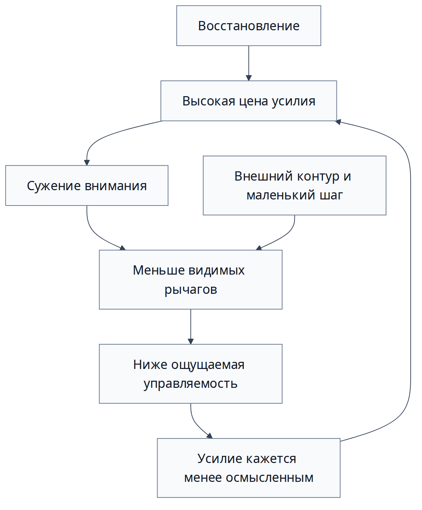{.diagram}


Эта петля объясняет, почему в плохом состоянии полезно не спорить с собой, а делать две вещи:

- снижать цену;
- восстанавливать видимость рычага.

Например:

```text
не "сейчас закрою всю задачу",
а "за 15 минут восстановлю, где остановился, и выберу один проверяемый шаг"
```

Такой шаг может одновременно снижать когнитивную цену и повышать управляемость.

## Отдых и избегание

В главе 9 мы уже различали отдых и избегание. Здесь нужно закрепить это различие через цену усилия.

Отдых - это действие или пауза, после которых доступность ценного действия растет.

Избегание - это уход, после которого встреча с задачей становится менее вероятной или более дорогой, даже если прямо сейчас стало легче.

Они могут выглядеть одинаково.

Человек закрывает ноутбук.

В одном случае он делает это после рабочего блока, оставляет контрольную точку, идет гулять и возвращается с более низкой ценой входа.

В другом случае он закрывает ноутбук на месте неопределенности, ничего не фиксирует, получает облегчение, а завтра цена входа становится еще выше.

Снаружи: "отдохнул".

По функции: разные процессы.

Проверка простая:

| Вопрос | Больше похоже на отдых | Больше похоже на избегание |
| --- | --- | --- |
| После паузы проще вернуться? | Да | Нет |
| Осталась контрольная точка? | Да | Нет |
| Цена входа снизилась? | Да | Нет, выросла |
| Задача стала яснее? | Да или нейтрально | Нет, стала туманнее |
| Что было главным эффектом? | Восстановление | Облегчение от ухода |
| Есть ли следующий шаг? | Да | Нет |

Когнитивное инженерство не должно стыдить отдых. Наоборот: хороший отдых является частью системы действия. Но оно должно честно видеть, когда пауза используется как способ не встретиться с угрозой.

## Как снижать цену, не обесценивая задачу

Снизить цену не значит сделать задачу мелкой, пустой или приятной.

Снизить цену - значит убрать лишнее трение, которое не нужно для смысла работы.

### 1. Уменьшить первый шаг

Плохая формулировка:

```text
написать главу
```

Лучше:

```text
выписать 7 тезисов главы
```

Еще лучше:

```text
выписать, что в этой главе нельзя забыть объяснить
```

Полезно, чтобы первый шаг был достаточно маленьким, чтобы система не считала вход опасным, и достаточно содержательным, чтобы он реально двигал задачу.

### 2. Сделать действие обратимым

Многие задачи становятся дорогими из-за ощущения необратимости.

```text
написать финальный текст
```

дороже, чем:

```text
собрать рабочий черновик, который потом можно выкинуть
```

```text
сказать окончательную позицию
```

дороже, чем:

```text
отправить черновик мысли и попросить проверить критерий
```

Обратимость часто снижает угрозу и идентичностную цену.

### 3. Вынести контекст наружу

Если дорого держать все в голове, задача просит внешний контур.

Минимальный шаблон:

```text
Цель:
Факты:
Туман:
Гипотезы:
Проверенные тупики:
Ограничения:
Следующий шаг:
Где остановился:
```

Это может снижать когнитивную цену и цену повторного входа.

### 4. Снизить социальный риск

Если дорого не действие, а контакт, нужно проектировать контакт.

Примеры:

- сначала написать черновик сообщения;
- отделить факты от интерпретаций;
- попросить короткий синхрон вместо длинного спора;
- начать с вопроса о критерии;
- заранее обозначить границы ответственности;
- перевести конфликт из "кто виноват" в "что меняем в системе".

Социальная цена часто падает, когда появляется рамка разговора.

### 5. Защитить восстановление

Иногда действие дорого не само по себе, а тем, что после него не будет места восстановиться.

Тогда решение:

- не ставить два тяжелых созвона подряд;
- не входить в сложный конфликт перед сном;
- оставить время после публичной защиты;
- закрывать рабочий блок контрольной точкой;
- не планировать deep work сразу после социально тяжелого эпизода.

Если восстановление не защищено, система может разумно повышать цену входа.

### 6. Выбрать правильный слой вмешательства

Главный диагностический вопрос:

```text
что именно здесь дорого?
```

Если дорого тело - нужен отдых, сон, еда, движение, медицинская осторожность.

Если дорого внимание - нужен внешний контур, разбиение и защита от прерываний.

Если дорога неопределенность - нужен первый проверяемый шаг.

Если дорог риск ошибки - нужен черновой режим и обратимость.

Если дорог контакт - нужна рамка разговора.

Если дорог самообраз - нужно отделить обучение от приговора личности.

Если дорога вся жизнь вокруг задачи - нужно смотреть не на задачу, а на режим.

## Главный пример: две задачи по часу

Представим две задачи.

Первая:

```text
дописать технический раздел, где структура уже понятна
```

Вторая:

```text
написать человеку, что в прошлой договоренности была ошибка,
и предложить исправление
```

Обе могут занять один час.

Но их цена разная.

В первой задаче основная цена когнитивная:

- удержать структуру;
- подобрать формулировки;
- проверить факты;
- не расползтись по деталям.

Если человек устал, цена может быть высокой, но ее можно снизить рабочим контуром:

- открыть план;
- выписать тезисы;
- ограничить блок;
- оставить контрольную точку.

Во второй задаче цена многослойная:

- когнитивная: нужно точно описать ситуацию;
- социальная: человек может отреагировать плохо;
- эмоциональная: придется выдержать напряжение;
- идентичностная: придется признать ошибку;
- восстановительная: после ответа может быть трудно вернуться к другой работе.

Если считать только время, задачи равны.

Если считать цену усилия, они разные.

Именно поэтому одна задача может запускаться легко, а другая откладываться днями.

Инженерный ход для второй задачи не такой:

```text
просто напиши уже
```

Лучше так:

```text
1. Выписать факты без обвинений.
2. Отдельно выписать, что я хочу изменить.
3. Написать черновик сообщения.
4. Проверить, где есть лишняя защита или нападение.
5. Отправить короткую версию.
6. После отправки поставить восстановительный буфер 15 минут.
```

Так задача не становится приятной. Но ее цена становится видимой и частично управляемой.

## Диагностика "нет энергии"

Когда возникает "нет энергии", полезно не спорить с этим состоянием, а расшифровать его.

| Вопрос | Если ответ "да" | Первый инженерный ход |
| --- | --- | --- |
| Я физически недовосстановлен? | Сон, боль, болезнь, голод, перегрузка. | Снизить нагрузку, восстановиться, не путать тело с дисциплиной. |
| Я потерял контекст? | Не помню, где остановился и что важно. | Восстановить карту задачи, открыть контрольную точку. |
| Я не вижу первого шага? | Задача большая и туманная. | Сформулировать проверяемый шаг на 10-25 минут. |
| Я боюсь реакции людей? | Дорого писать, просить, спорить, признавать. | Подготовить рамку контакта и черновик сообщения. |
| Я боюсь, что результат скажет обо мне плохое? | Включена идентичностная цена. | Перевести в режим обучения и черновика. |
| Я не верю, что действие повлияет? | Низкая управляемость. | Найти рычаг, данные или обратную связь. |
| Я просто хочу облегчения? | Тянет уйти, закрыть, отвлечься. | Проверить: пауза восстановит вход или закрепит уход? |
| Я давно живу без восстановления? | Цена не уходит после перерывов. | Смотреть режим, объем параллельной работы, границы, нагрузку, поддержку. |

Эта таблица не ставит диагноз. Она помогает выбрать слой вмешательства.

## Мини-словарь главы

| Понятие | Рабочее определение |
| --- | --- |
| Цена усилия | Субъективная стоимость действия в текущем состоянии системы. |
| Физическая цена | Стоимость действия для тела: движение, боль, недосып, болезнь, физическая нагрузка. |
| Когнитивная цена | Стоимость действия для внимания, рабочей памяти, понимания и удержания контекста. |
| Социально-эмоциональная цена | Стоимость контакта, конфликта, оценки, просьбы, отказа или публичности. |
| Идентичностная цена | Стоимость угрозы образу себя: компетентности, силы, взрослости, надежности, нужности. |
| Цена восстановления | То, сколько придется возвращать после действия: внимание, тело, контакт, эмоциональное равновесие. |
| Усталость | Состояние, в котором возрастает цена продолжения или нового входа в действие. |
| Восстанавливаемая усталость | Усталость, которая заметно снижается коротким отдыхом, сменой режима или разгрузкой контекста. |
| Медленно восстанавливаемая усталость | Накопленная цена, которая не исчезает за один перерыв и требует изменения режима. |
| Аллостатический бюджет | Рабочее обозначение текущей и прогнозируемой регуляторной цены состояния организма. |
| Интероцептивная оценка | Оценка внутреннего состояния тела, которая участвует в ощущении доступности действия. |
| Ощущаемая энергия | Субъективный итог оценки допустимости действия по цене, риску, управляемости и восстановлению. |

## Вопросы для самопроверки

1. Почему важная и управляемая задача все равно может не запускаться?
2. Чем цена усилия отличается от ценности результата?
3. Почему "субъективная цена" не означает "выдуманная цена"?
4. Какие виды цены могут скрываться за фразой "нет энергии"?
5. Почему час неприятного разговора может быть дороже часа технической работы?
6. Чем усталость отличается от высокой цены входа?
7. Как отличить отдых от избегания?
8. Почему аллостатический бюджет нельзя понимать как буквальный бак?
9. Как внешний контур мышления снижает цену входа?
10. Какой вид цены чаще всего делает дорогой вашу текущую сложную задачу?

## Мини-практика

Возьмите одну задачу, которую вы не начинаете, хотя она важна.

Заполните таблицу:

| Вопрос | Ответ |
| --- | --- |
| Что в задаче ценно? |  |
| Какой рычаг у меня есть? |  |
| Какая угроза делает вход дорогим? |  |
| Какая цена здесь главная: физическая, когнитивная, социальная, идентичностная, восстановительная? |  |
| Что я называю "нет энергии" в этой задаче? |  |
| Это больше похоже на усталость или высокую цену входа? |  |
| Что снизит цену без обесценивания задачи? |  |
| Какой первый шаг займет 10-25 минут? |  |
| Как я оставлю контрольную точку, чтобы не поднять цену будущего входа? |  |

После этого сформулируйте вход:

```text
Я не обязан сейчас закрыть всю задачу.
Главная цена здесь:
<вид цены>.

Я снижаю ее так:
<конкретное инженерное действие>.

Первый шаг:
<10-25 минут>.

После шага я оставлю контрольную точку:
<что зафиксирую>.
```

Пример:

```text
Я не обязан сейчас закрыть весь конфликт.
Главная цена здесь: социально-эмоциональная и идентичностная.

Я снижаю ее так: сначала пишу черновик фактов без отправки.

Первый шаг: 20 минут выписываю, что произошло, что нужно исправить и какой вопрос задать.

После шага я оставлю контрольную точку: финальный черновик сообщения и пометку, что нужно проверить перед отправкой.
```

## Короткое резюме

1. Мотивация зависит не только от ценности, угрозы и управляемости, но и от цены усилия.
2. "Нет энергии" - слишком грубый сигнал. Его нужно раскладывать на виды цены и состояния.
3. Субъективная цена не является выдумкой: она зависит от тела, памяти, среды, отношений, опыта и восстановления.
4. Усилие не всегда плохо. Оно может быть источником роста, смысла и мастерства, если остается управляемым и восстановимым.
5. Усталость лучше понимать как рост цены продолжения или входа в действие, а не как один пустой бак.
6. Высокая цена входа может маскироваться под усталость, особенно когда потерян контекст задачи.
7. Аллостатический бюджет - рабочая модель регуляторной цены состояния, а не буквальная емкость силы воли.
8. Отдых восстанавливает доступность действия; избегание снижает встречу с угрозой и часто повышает будущую цену входа.
9. Снижение цены усилия - не поблажка, а инженерное проектирование условий действия.
10. После этой главы мотивационный блок можно собрать в формулу: ценность, угроза, управляемость, цена усилия.

## Переход к следующей главе

Теперь мотивационный блок собран.

Мы ввели:

```text
ценность - зачем действовать
угрозу - от чего система защищается
управляемость - есть ли рычаг
цену усилия - сколько стоит действие сейчас
```

Этого достаточно, чтобы разбирать многие человеческие состояния без грубых ярлыков:

```text
ленится
слабая воля
нет мотивации
просто устал
```

Но дальше появляется новый риск. Мы начали говорить о теле, аллостазе, интероцепции, усталости и нейрофизиологии. Если теперь не развести уровни объяснения, учебник легко уйдет в нейромифы.

Дальше нужна дисциплина уровней:

```text
психологическое описание
вычислительный параметр
нейронный контур
биохимический механизм
практическое вмешательство
```

Это нужно, чтобы не путать "мне дорого входить в задачу" с "у меня низкий дофамин", а "усталость" - с одним универсальным биомаркером.

---

# Глава 12. Уровни объяснения

## Почему перед мозгом нужна пауза

Мы подошли к части учебника, где появятся мозг, тело, нейромедиаторы, гормоны, стрессовые системы и биохимия.

Это важный слой. Без него разговор о мотивации, усталости, внимании и выгорании быстро становится слишком психологическим: будто человек существует только как набор мыслей, решений и привычек.

Но есть и обратная опасность.

Как только появляются слова:

```text
дофамин
миндалина
префронтальная кора
кортизол
серотонин
интероцепция
```

возникает соблазн объяснять слишком быстро.

```text
Нет мотивации - значит, низкий дофамин.
Страшно - значит, активировалась миндалина.
Не могу собраться - значит, слабая префронтальная кора.
Выгорание - значит, сломалась стрессовая система.
```

Такие фразы звучат научно. Но чаще всего они не объясняют, а закрывают объяснение раньше времени.

В предыдущих главах мы строили мотивационную модель по слоям:

```text
ценность
угроза
приближение и избегание
управляемость
цена усилия
усталость и состояние системы
```

Теперь нужно научиться связывать эти слои с мозгом и биохимией так, чтобы не потерять смысл. Для этого нужна дисциплина уровней объяснения.

## Что такое уровень объяснения

Уровень объяснения - это слой вопроса, на котором мы описываем явление.

Один и тот же эпизод можно рассматривать по-разному:

- как человек это переживает;
- что он делает или не делает;
- какие параметры выбора изменились;
- какие когнитивные процессы задействованы;
- какие нейронные контуры могут участвовать;
- какие медиаторы и гормоны меняют режим;
- какая среда поддерживает или ломает действие;
- где можно вмешаться.

Это не восемь конкурирующих объяснений, из которых нужно выбрать одно "настоящее". Это разные вопросы к одному явлению.

Пример:

```text
человек не открывает важную задачу и говорит: "нет энергии"
```

Можно спросить:

```text
что он чувствует?
что он делает?
что в задаче дорого?
какой первый шаг потерян?
какие системы контроля, угрозы и интероцепции могут участвовать?
какие медиаторы меняют режим готовности?
как устроены сон, нагрузка, прерывания и восстановление?
что можно изменить сейчас?
```

Все эти вопросы полезны. Но они не одинаковы.

Ошибка начинается тогда, когда ответ на один вопрос выдают за ответ на все остальные.

## Лестница уровней

Вопрос схемы:

```text
как разложить один эпизод по уровням,
чтобы не перескочить от переживания сразу к нейромифу
и не потерять уровень вмешательства?
```


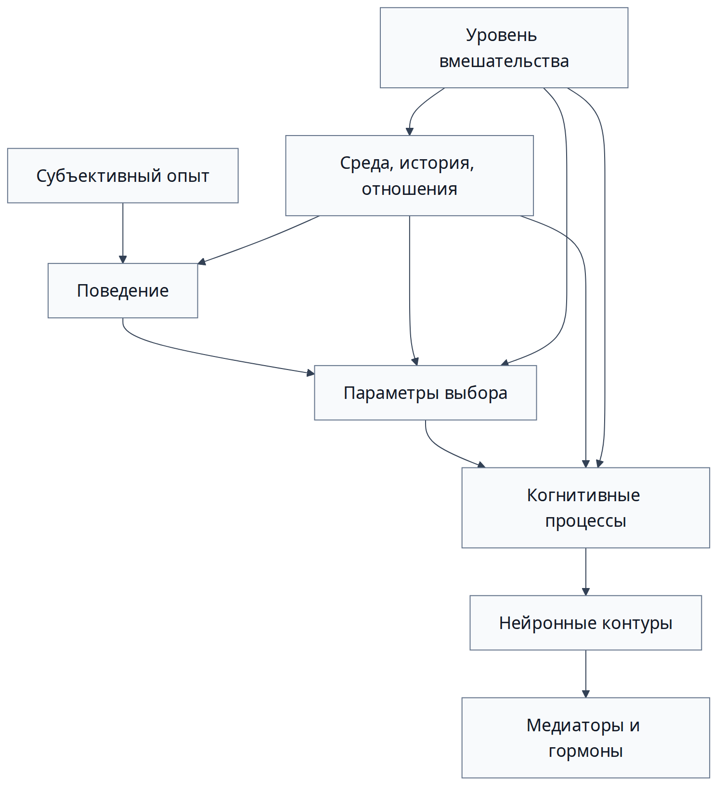{.diagram}


Эта схема не говорит, что верхние уровни "поверхностные", а нижние "настоящие".

Как читать схему:

- сверху вниз мы уточняем, каким вопросом сейчас занимаемся;
- боковая среда показывает, что действие не рождается в пустоте;
- уровень вмешательства не обязан совпадать с самым "глубоким" уровнем реализации;
- хороший разбор не ищет один главный уровень, а удерживает связку между переживанием, поведением, механизмом и доступным ходом.

Субъективный опыт реален. Поведение реально. Параметры выбора реальны как рабочая модель. Нейронные контуры реальны. Медиаторы и гормоны реальны. Среда реальна.

Разница в том, какой вопрос мы задаем.

Если человек говорит "мне страшно", субъективный уровень сообщает, как ситуация дана человеку изнутри.

Если он не отправляет письмо, поведенческий уровень описывает, что происходит во внешнем действии.

Если угроза ошибки выше управляемости, уровень параметров объясняет, почему действие не выбирается.

Если внимание сужается, рабочая память перегружена и первый шаг не удерживается, когнитивный уровень объясняет, как распадается вход.

Если участвуют сети угрозы, контроля и интероцепции, контурный уровень говорит, через какие системы это может реализоваться.

Если норадреналин, дофамин, кортизол или другие регуляторы меняют режим готовности, нейрохимический уровень уточняет физическую настройку системы.

Если человек живет в среде постоянных прерываний, низкого сна, неясных полномочий и высокой социальной цены ошибки, средовой уровень объясняет, почему система снова и снова приходит к тому же состоянию.

Ни один уровень не отменяет другие.

## Пример: "нет энергии"

Разберем один эпизод, чтобы уровни не остались абстракцией.

Ситуация:

```text
человек должен вернуться к важной задаче,
но не открывает ее и говорит: "нет энергии"
```

### Субъективный уровень

На субъективном уровне есть переживание:

```text
мне недоступно действие
```

Человек может ощущать тяжесть, сопротивление, мутность, сонливость, тревогу, отвращение, скуку или пустоту.

На этом уровне важно не спорить сразу.

```text
Да ладно, энергия появится, когда начнешь
```

Иногда это правда. Иногда нет.

Субъективный уровень дает данные о состоянии системы. Но он не говорит автоматически, каков механизм.

### Поведенческий уровень

На поведенческом уровне важно описать не настроение, а действие.

Что человек делает?

- не открывает задачу;
- открывает, но сразу уходит;
- читает одно и то же место;
- переключается на мелкие задачи;
- ищет "подготовительные" материалы;
- ждет подходящего состояния;
- отвечает в чатах вместо входа в сложное место.

Поведение точнее, чем общий ярлык.

Фраза "нет энергии" может сопровождать разные поведения: отдых, избегание, замирание, рассеянный поиск, защитный контроль, микропродуктивность.

Если не описать поведение, трудно понять, что именно менять.

### Уровень параметров выбора

На уровне параметров мы спрашиваем:

```text
какая конфигурация делает действие маловероятным?
```

В терминах предыдущих глав:

- ценность есть;
- угроза ошибки или оценки высока;
- цена входа высока;
- управляемость низкая или не видна;
- первый шаг не выделен;
- облегчение от ухода доступно сразу;
- восстановление после действия не защищено.

Здесь "нет энергии" перестает быть одним состоянием. Оно превращается в итоговую метку нескольких параметров.

Если главная проблема - низкая управляемость, обычно нужен рычаг.

Если главная проблема - высокая цена входа, часто помогают внешний контур и маленький шаг.

Если главная проблема - социальная угроза, часто нужна рамка разговора.

Если главная проблема - физическая усталость, чаще всего нужны разгрузка и восстановление.

Уровень параметров нужен потому, что он ближе всего к инженерному вмешательству.

### Когнитивный уровень

На когнитивном уровне мы спрашиваем:

```text
какие процессы должны работать, чтобы действие началось?
```

В сложной задаче нужны:

- внимание;
- рабочая память;
- восстановление контекста;
- выбор релевантного;
- торможение отвлечений;
- прогноз следующего шага;
- обновление плана после обратной связи.

Если задача туманная, рабочая память перегружена еще до начала. Человек не просто "не хочет". Ему нужно поднять в голове слишком много элементов.

Здесь становится понятно, почему рабочий журнал из глав 4-6 может снижать цену действия. Он вмешивается не в "дофамин", а в когнитивную архитектуру задачи:

```text
меньше держать в голове
легче восстановить контекст
яснее следующий шаг
меньше неопределенность входа
```

### Контурный уровень

На контурном уровне мы спрашиваем:

```text
какие мозговые сети могут участвовать в таком состоянии?
```

Дальше в учебнике появятся префронтальная кора, передняя и средняя поясная кора (ACC/aMCC), стриатум, миндалина, островок, гиппокамп, голубое пятно (LC) и другие системы.

Но здесь важна осторожность.

Нельзя сказать:

```text
человек не начал, потому что у него миндалина
```

Или:

```text
он прокрастинирует, потому что префронтальная кора проиграла лимбической системе
```

Это слишком грубо.

Контуры не являются персонажами. Они не "хотят", не "ленятся", не "саботируют". Они реализуют процессы: оценку угрозы, удержание правила, выбор действия, обучение, интероцепцию, переключение режима готовности.

Правильнее говорить так:

```text
в таком состоянии могут участвовать системы контроля, угрозы, оценки усилия, памяти и интероцепции
```

А затем уточнять, какой именно механизм подтвержден, каким методом и в какой задаче.

### Нейрохимический уровень

На нейрохимическом уровне мы спрашиваем:

```text
какие медиаторы, гормоны и регуляторные системы меняют режим работы контуров?
```

Дофамин, норадреналин, серотонин, кортизол, ацетилхолин, ГАМК, глутамат, опиоидные и окситоциновые системы действительно важны.

Но они не являются простыми кнопками.

Дофамин не равен мотивации. Норадреналин не равен вниманию. Серотонин не равен счастью. Кортизол не равен стрессу. Окситоцин не равен любви.

Один медиатор может участвовать в разных процессах в зависимости от контура, рецептора, временного масштаба, состояния организма, задачи и среды.

Поэтому фраза:

```text
нет энергии = низкий дофамин
```

плоха не потому, что дофамин не важен. Она плоха потому, что прыгает через уровни и делает вид, будто один нейрохимический ярлык объяснил всю ситуацию.

### Средовой и исторический уровень

На средовом уровне мы спрашиваем:

```text
какие условия делают такое состояние вероятным снова и снова?
```

Например:

- задача каждый раз начинается без контрольной точки;
- день разорван сообщениями;
- ожидания неясны;
- ошибки публично наказываются;
- полномочий меньше, чем ответственности;
- сон хронически короткий;
- нет восстановления после сложных контактов;
- опыт прошлых попыток закрепил беспомощность или избегание.

Если среда постоянно повышает цену входа, бессмысленно объяснять все только внутренней слабостью или биохимией.

Мозг работает не в пустоте. Он постоянно адаптируется к среде.

## Уровень реализации не всегда уровень вмешательства

Это одно из самых важных различений главы.

Да, всякое человеческое состояние реализуется через тело и мозг. Без мозга нет страха, внимания, желания, усталости, смысла, речи и действия.

Но из этого не следует, что лучшее вмешательство всегда должно быть на биохимическом или нейронном уровне.

Пример.

Человек не может войти в задачу, потому что каждый раз теряет контекст. Физически это состояние, конечно, реализуется через мозг. Но лучшее вмешательство может быть таким:

```text
оставлять контрольную точку
фиксировать гипотезы
выносить туман наружу
ограничивать первый шаг
```

То есть вмешательство лежит на уровне среды и когнитивной организации задачи.

Другой пример.

Человек боится неприятного разговора. Это тоже реализуется через мозг и тело. Но вмешательство может быть социальным:

```text
снизить публичность
уточнить рамку
отделить факты от обвинений
получить поддержку
согласовать формат обратной связи
```

Третий пример.

Человек хронически не восстанавливается. Здесь вмешательство может быть режимным:

```text
сон
параллельная незавершенная работа
границы доступности
перерывы
снижение реактивной нагрузки
перераспределение ответственности
```

Нейробиологический уровень объясняет, почему это влияет на систему. Но он не всегда указывает, где именно надо менять ситуацию.

## Три частые ошибки

### Ошибка 1. Скачок к мозгу

Скачок к мозгу выглядит так:

```text
человек боится -> значит, миндалина
человек не начал -> значит, префронтальная кора не справилась
человек хочет награду -> значит, дофамин
```

Проблема не в том, что эти слова совсем не связаны с реальностью. Проблема в том, что между переживанием и мозговой структурой пропущено слишком много.

Нужно спросить:

- какое поведение мы видим;
- какая задача;
- какая угроза;
- какая управляемость;
- какая цена усилия;
- какая история опыта;
- какие данные реально подтверждают участие конкретного контура.

Только после этого разговор о мозге становится точнее.

### Ошибка 2. Обратный вывод

Обратный вывод - это попытка вывести психологическое состояние по активности мозга.

В слабой форме:

```text
активировалась область X, значит, человек испытывал процесс Y
```

Проблема в том, что одна и та же область мозга может участвовать в разных процессах. Например, зона может активироваться при боли, конфликте, усилии, ошибке, значимости или внимании. Если мы знаем только, что область активна, этого часто недостаточно, чтобы уверенно назвать психологическое состояние.

Это не значит, что нейровизуализация бесполезна. Это значит, что вывод должен опираться на задачу, дизайн исследования, селективность активации, поведение, модель и другие данные.

В учебнике это правило будет простым:

```text
активация области - не диагноз процесса
```

### Ошибка 3. Один медиатор вместо системы

Популярные объяснения любят один медиатор:

```text
дофамин - мотивация
серотонин - настроение
окситоцин - любовь
кортизол - стресс
```

Такие формулы удобны для запоминания, но плохи для понимания.

Медиатор работает в контурах, на рецепторах, в конкретном временном масштабе и в конкретном состоянии организма. Он может менять обучение, значимость, порог действия, торможение, терпимость к ожиданию, телесную мобилизацию или социальную чувствительность. Но он не заменяет собой всю систему.

Медиаторы и гормоны будут разобраны отдельно. Сейчас достаточно правила:

```text
медиатор - регулятор режима, а не самостоятельное объяснение поведения
```

## Как выбирать уровень вмешательства

Когнитивное инженерство интересуется не только тем, почему состояние возникло. Ему важно, где можно изменить систему.

Практическая процедура:

```text
1. Назвать переживание.
2. Описать поведение.
3. Выделить параметры выбора.
4. Проверить когнитивную организацию задачи.
5. Проверить среду и историю.
6. Только потом уточнять возможные контуры и медиаторы.
7. Выбрать самый доступный уровень вмешательства.
```

Разберем на примере.

```text
Переживание: "нет энергии".
Поведение: не открываю задачу, ухожу в мелкие дела.
Параметры: ценность есть, цена входа высокая, управляемость не видна.
Когнитивная организация: нет контрольной точки, не помню последнюю гипотезу.
Среда: день разорван сообщениями, нет защищенного блока.
Контуры и медиаторы: вероятно вовлечены контроль, угроза, интероцепция и системы готовности, но это не главный уровень первого вмешательства.
Вмешательство: восстановить контекст, выделить первый шаг, закрыть уведомления на 25 минут.
```

Здесь мозг важен. Но менять начинаем не мозг напрямую, а условия, которые мозгу придется обрабатывать.

## Матрица уровней и вопросов

| Уровень | Вопрос | Что можно увидеть | Тип вмешательства |
| --- | --- | --- | --- |
| Субъективный | Как это переживается? | Страх, тяжесть, желание, пустота, напряжение. | Назвать состояние, снизить путаницу, отделить стыд от фактов. |
| Поведенческий | Что человек делает? | Начинает, уходит, замирает, контролирует, отвлекается. | Изменить действие, сделать шаг меньше, оставить контрольную точку. |
| Параметры выбора | Что делает действие вероятным или дорогим? | Ценность, угроза, усилие, управляемость, неопределенность. | Снизить угрозу, вернуть рычаг, уменьшить цену входа. |
| Когнитивный | Как обрабатывается задача? | Внимание, рабочая память, прогноз, торможение, переключение. | Внешний контур, схема, разбиение, защита от прерываний. |
| Контурный | Какие системы мозга участвуют? | Контроль, угроза, обучение, интероцепция, выбор действия. | Понимать ограничения и не ждать невозможного от одной техники. |
| Нейрохимический | Какие регуляторы меняют режим? | Готовность, бодрствование, обучение, стрессовая мобилизация. | Сон, нагрузка, медицинская осторожность, отказ от мифов. |
| Средовой | Какие условия поддерживают состояние? | Параллельная незавершенная работа, прерывания, отношения, полномочия, обратная связь, режим. | Менять среду, договоренности, ритуалы, границы. |

Эта матрица не заменяет будущие главы. Она дает карту, по которой их читать.

## Как это защищает от нейромифов

Нейромиф появляется не только из-за фактической ошибки. Часто он появляется из-за слишком короткого объяснительного пути.

Было:

```text
мне тяжело начать
```

Стало:

```text
у меня низкий дофамин
```

Между ними пропущено:

- какая задача;
- какая цена входа;
- какой первый шаг;
- какая угроза;
- какая управляемость;
- какая усталость;
- какая история опыта;
- какая среда;
- какие данные вообще указывают на дофаминовый механизм.

Глава 12 учит не запрещать биологические объяснения, а удлинять путь до них.

Хорошее объяснение не обязано быть длинным. Но оно должно быть честным по уровням.

Можно сказать:

```text
в этой задаче высокая цена входа: потерян контекст, не виден первый шаг, есть социальная угроза; на биологическом уровне такое состояние, вероятно, связано с системами контроля, угрозы, интероцепции и нейромодуляции, но первый рабочий ход - восстановить контекст и снизить цену первого шага
```

Это менее ярко, чем "низкий дофамин". Зато полезнее.

## Что делать с мозгом дальше

После этой главы мы можем идти в нейрофизиологию.

Но будем соблюдать правило:

```text
контур не заменяет функцию
медиатор не заменяет контур
коррелят не заменяет причину
реализация не заменяет вмешательство
```

Дальше можно будет говорить о контурах действия: префронтальной коре (PFC), передней поясной коре (ACC), стриатуме, миндалине, островке и связанных системах.

В главе 14 - о нейромедиаторах и гормонах.

В главе 15 - о стрессе, аллостазе и окне полезной нагрузки.

Эти темы нужны. Но теперь у нас есть защита от простых, слишком уверенных фраз.

## Мини-словарь главы

| Понятие | Рабочее определение |
| --- | --- |
| Уровень объяснения | Слой вопроса, на котором мы описываем явление: переживание, поведение, параметры, процессы, контуры, биохимия, среда. |
| Субъективный уровень | То, как состояние переживается человеком изнутри. |
| Поведенческий уровень | То, что человек делает, не делает или повторяет во внешнем действии. |
| Уровень параметров выбора | Оценки, которые меняют вероятность действия: ценность, угроза, усилие, управляемость, неопределенность. |
| Когнитивный уровень | Процессы внимания, памяти, прогноза, контроля, торможения и переключения. |
| Контурный уровень | Нейронные системы, через которые реализуются функции. |
| Нейрохимический уровень | Медиаторы, гормоны и регуляторные системы, меняющие режим контуров. |
| Средовой уровень | Условия задачи, отношений, истории опыта и рабочего режима. |
| Обратный вывод | Вывод от активации мозга к психологическому процессу; требует осторожности. |
| Редукционизм | Сведение сложного явления к одному "настоящему" уровню объяснения. |
| Объяснительный плюрализм | Подход, в котором несколько уровней объяснения могут быть одновременно необходимы. |
| Уровень вмешательства | Слой, на котором практически лучше менять ситуацию. |

## Вопросы для самопроверки

1. Почему "нет энергии = низкий дофамин" является слишком коротким объяснением?
2. Чем субъективный уровень отличается от поведенческого?
3. Почему нейронная реализация не всегда указывает лучший уровень вмешательства?
4. Что такое обратный вывод и почему он опасен в популярных объяснениях?
5. Почему поведение не нужно считать менее настоящим уровнем, чем мозг?
6. Как среда может поддерживать состояние, которое субъективно переживается как "я не могу"?
7. Какие уровни нужно проверить перед тем, как объяснять сложное состояние медиатором?

## Мини-практика

Возьмите одно состояние, которое вы обычно объясняете одним словом:

```text
нет энергии
страшно
не могу начать
прокрастинирую
раздражен
не хочу
```

Заполните таблицу:

| Уровень | Что здесь происходит? |
| --- | --- |
| Субъективный опыт |  |
| Поведение |  |
| Параметры выбора |  |
| Когнитивная организация задачи |  |
| Среда и история |  |
| Возможные контуры |  |
| Возможные медиаторы/гормоны |  |
| Лучший первый уровень вмешательства |  |

После этого сформулируйте аккуратное объяснение:

```text
Я пока не знаю единственной причины.
На уровне переживания это выглядит как <...>.
На уровне поведения я делаю <...>.
На уровне параметров главным кажется <...>.
Первое вмешательство стоит делать на уровне <...>,
потому что оно ближе всего к доступному изменению.
```

## Короткое резюме

1. Уровень объяснения - это слой вопроса, а не степень "настоящести".
2. Мозг не отменяет психологию, поведение и среду; он реализует их в живой системе.
3. Субъективное состояние не является выдумкой, но оно не раскрывает механизм автоматически.
4. Поведение нужно описывать точно: без поведения трудно понять, что менять.
5. Параметры выбора связывают психологию с инженерным вмешательством.
6. Нейронные контуры не являются персонажами, которые "хотят" или "саботируют".
7. Медиаторы и гормоны регулируют режимы, но не являются кнопками поведения.
8. Обратный вывод требует осторожности: активация области не равна доказательству психологического процесса.
9. Лучший уровень вмешательства не всегда совпадает с уровнем физической реализации.
10. Следующие главы нужно читать через эту дисциплину: контуры и биохимия важны, но только внутри многоуровневой модели.

## Переход к следующей главе

Теперь можно вводить контуры действия.

Дальше появятся префронтальная кора (PFC), передняя поясная кора (ACC), стриатум, миндалина, островок и другие системы. После дисциплины уровней их уже можно читать не как список "центров" поведения, а как уровни реализации функций:

```text
удержание цели
оценка конфликта
выбор действия
обучение
угроза
интероцепция
память и контекст
```

Так мозг становится не набором мифических кнопок, а частью объяснительной лестницы.

---

# Глава 13. Контуры действия

## Не "центры", а контуры

Предыдущая глава ввела важную дисциплину: не прыгать от переживания сразу к одной зоне мозга.

Теперь можно говорить о мозге.

Но говорить о нем нужно аккуратно.

Плохой способ выглядит так:

```text
Префронтальная кора отвечает за волю.
Передняя поясная кора отвечает за ошибки.
Стриатум отвечает за привычки.
Миндалина отвечает за страх.
Островок отвечает за ощущения тела.
Гиппокамп отвечает за память.
```

В таких фразах есть зерно правды, но как объяснение они опасны. Они создают ощущение, будто в голове сидит набор отделов: один планирует, другой пугается, третий ленится, четвертый включает автопилот. Это удобно для запоминания, но плохо для понимания.

Мозговая структура не является психологической функцией.

Структура участвует в функции. Часто — в нескольких функциях. И почти всегда — в сети с другими структурами.

Поэтому здесь речь пойдет не о "центрах", а о контурах действия.

Контур действия — это связанная сеть мозговых областей, через которую система удерживает цель, оценивает значимость и угрозу, сравнивает цену усилия с ценностью, выбирает политику действия, запускает движение или тормозит его, обновляет опыт по обратной связи.

Для когнитивного инженерства это важно по простой причине. Если мы понимаем контуры слишком грубо, мы начинаем придумывать грубые вмешательства:

```text
надо прокачать силу воли
надо успокоить миндалину
надо поднять дофамин
надо сломать автопилот
```

Но реальная работа обычно тоньше:

```text
надо восстановить модель задачи
надо снизить угрозу первой попытки
надо уменьшить цену входа
надо убрать легкие конкурирующие действия
надо вернуть телу переносимый режим
надо создать новый опыт управляемости
```

Контурная карта помогает понять, почему такие вмешательства могут работать не магически, а системно.

## Общая карта

Начнем с карты. Она не является анатомическим атласом. Это учебная схема: какие функциональные узлы участвуют в переходе от ситуации к действию.

Вопрос схемы:

```text
через какие функциональные узлы ситуация становится политикой действия,
если не сводить поведение к одному "центру"?
```


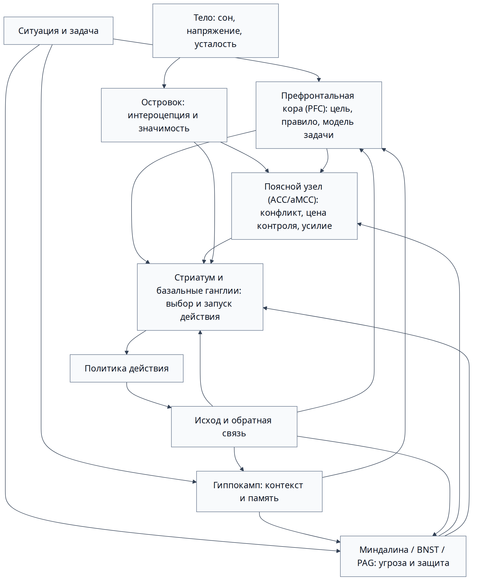{.diagram}


Как читать эту схему:

- ситуация не попадает в "центр решения";
- она одновременно имеет цель, угрозу, телесную цену, память и возможные действия;
- разные контуры конкурируют и согласуются;
- действие — это не просто приказ сверху, а выбранная политика системы;
- обратная связь меняет будущие ожидания.

Граница схемы: она не утверждает, что каждый узел всегда одинаково включен или что стрелка означает простой механический приказ. Это рабочая карта функций, а не анатомическая инструкция и не диагностический прибор.

Если человек открыл задачу и начал работать, это не значит, что "победила воля". Это значит, что на данный момент рабочая модель, ценность, управляемость, цена усилия, угрозы и пороги запуска сложились в пользу действия.

Если человек ушел в легкое действие, это тоже не обязательно "лень". Возможно, важная задача имеет высокую цену входа, слабый контекст, угрозу ошибки и высокий порог запуска, а легкое действие лежит рядом, понятно и быстро подкрепляется.

Теперь разберем основные узлы.

## Префронтальная кора (PFC): удержать задачу, когда мир тянет в сторону

PFC — префронтальная кора. Это большой и неоднородный участок коры, который участвует в планировании, контроле, рабочей модели задачи, правилах, целях, оценке вариантов и социальном поведении.

Но если сказать:

```text
PFC отвечает за волю
```

мы сразу потеряем точность.

В учебной модели лучше говорить так:

```text
PFC помогает удерживать задачу в такой форме, в которой действие может оставаться связанным с целью, а не только с ближайшим стимулом.
```

Представьте, что вы открываете сложный технический тикет. На экране много деталей: логи, гипотезы, сообщения, старые решения, сомнительные симптомы. Если задача не собрана в рабочую модель, внимание прыгает между фрагментами. Вы видите куски, но не держите ход.

PFC нужен не для героического нажима. Он нужен, чтобы поддерживать:

- что сейчас является задачей;
- какое правило работы действует;
- какой шаг проверяется;
- что относится к делу;
- что нужно временно игнорировать;
- какой результат будет считаться продвижением.

Это близко к тому, что мы делали во второй части учебника, когда говорили о контексте задачи и рабочем журнале. Внешний контур мышления помогает PFC не держать все внутри. Хорошая запись задачи снижает цену удержания рабочей модели.

Внутри PFC можно выделять разные зоны, но для этой главы достаточно крупного различения.

dlPFC, или дорсолатеральная префронтальная кора, часто связывается с рабочей памятью, правилами, абстрактной задачей и произвольным контролем.

OFC и vmPFC, орбитофронтальные и вентромедиальные области, сильнее связаны с оценкой ценности, сравнением вариантов, социальными и эмоциональными признаками выбора.

Это не два отдельных начальника. Это части сети, которая помогает системе удерживать цель, оценивать варианты и не растворяться в ближайшем раздражителе.

Инженерный вывод простой:

```text
если "воли нет", сначала проверьте, есть ли удерживаемая модель задачи
```

Если человек не видит первый шаг, не понимает текущую гипотезу, не помнит, что уже проверял, и не знает критерия продвижения, ему не нужно читать лекцию о дисциплине. Ему нужен внешний контекст.

## Поясной узел (ACC/aMCC): конфликт, усилие и цена контроля

Следующий узел - ACC, передняя поясная кора. В современных текстах о контроле часто отдельно обсуждают dACC и aMCC: дорсальную переднюю поясную кору и переднюю среднюю поясную кору. Для учебника сейчас достаточно понимать этот блок как медиальный поясной узел, где сходятся конфликт, усилие, ошибка, неприятность и потребность в контроле.

Опять начнем с плохой формулы:

```text
ACC отвечает за ошибки
```

Это слишком узко.

Лучше:

```text
ACC/aMCC участвует в оценке того, стоит ли включать контроль, сколько он будет стоить, есть ли конфликт, ошибка, боль, напряжение или необходимость усилия.
```

Почему это важно?

Потому что трудная задача неприятна не только психологически. Она может быть неприятна как режим контроля.

Когда нужно удерживать несколько условий, не сорваться в привычный ответ, следить за ошибками, переносить неопределенность и продолжать, система платит цену контроля. ACC/aMCC — один из узлов, через которые эта цена оценивается.

Поэтому конфликт "важно, но не открывается" можно прочитать иначе:

```text
ценность задачи есть
но ожидаемая цена контроля слишком велика
```

Не надо сразу говорить "нет мотивации". Иногда мотивация есть, но контроль кажется слишком дорогим. Особенно если:

- задача плохо сформулирована;
- ошибка будет публичной;
- прошлые попытки были болезненными;
- человек устал;
- первый шаг не дает быстрой обратной связи;
- вокруг много более легких действий.

ACC/aMCC важен еще и потому, что контроль, боль и негативный аффект не полностью разделены. Трудное усилие может переживаться телесно и эмоционально: как напряжение, отвращение, тревожность, раздражение, "не хочу туда смотреть".

Это не делает усилие плохим. Но объясняет, почему одно и то же действие в разные дни ощущается по-разному.

Инженерный вывод:

```text
если задача вызывает высокий конфликт, снижайте цену первого контролируемого шага
```

Например:

- не "разобраться с архитектурой", а "выписать три неизвестных";
- не "написать документ", а "собрать факты без формулировки выводов";
- не "исправить баг", а "воспроизвести один симптом";
- не "принять решение", а "выписать, какие данные нужны для решения".

Так мы не "обманываем мозг". Мы меняем стоимость контроля.

## Стриатум и базальные ганглии: выбор, запуск, привычка

Стриатум и базальные ганглии часто появляются в разговорах о привычках, награде, движении и дофамине. В популярном изложении легко сказать:

```text
стриатум - это автопилот
```

Но это снова слишком грубо.

В нашей модели лучше так:

```text
стриатум и базальные ганглии участвуют в выборе, запуске и закреплении действий; они помогают системе перейти от возможного действия к выполняемому действию
```

У человека почти всегда есть несколько возможных действий:

- открыть сложную задачу;
- проверить мессенджер;
- прочитать документацию;
- начать с легкого подпункта;
- отложить;
- попросить помощи;
- сделать вид, что "собираешься";
- уйти в подготовку;
- закрыть ноутбук и восстановиться.

Действие не выбирается в пустоте. У каждого варианта есть ценность, цена, привычность, доступность, угроза, телесная переносимость и ожидаемая обратная связь.

Стриатальные и базально-ганглионарные контуры важны там, где возможные действия конкурируют за запуск.

С этой точки зрения прокрастинация часто выглядит не как пустота, а как победа более дешевой политики:

```text
важная задача проиграла действию с меньшей ценой входа и более быстрым подкреплением
```

Например, открыть логи и восстановить контекст дорого. Проверить уведомление дешево. Написать одну фразу в черновик неприятно. Переставить карточку в планировщике приятно и безопасно. Сложный разговор рискован. Подготовить еще один аргумент безопаснее.

Важно и другое: базальные ганглии участвуют не только в "плохих привычках". Они нужны для того, чтобы полезное действие становилось легче.

Если каждый вход в задачу требует полного сознательного разворачивания, система быстро устает. Хорошие ритуалы входа и выхода, рабочий журнал, стабильные сигналы начала, понятный первый шаг — все это может снижать порог запуска нужного действия.

Инженерный вывод:

```text
работайте не только с желанием, но и с порогами запуска
```

Спросите:

- какое действие сейчас ближе всего физически и интерфейсно;
- какое действие дает быстрое облегчение;
- какое действие требует восстановления контекста;
- где можно уменьшить первый шаг;
- какие дешевые конкуренты стоит убрать на время входа;
- какой сигнал будет означать "начинаем именно это".

Мы уже делали это в главах о рабочем журнале и ритуалах. Теперь видно, почему это не просто "организация", а работа с системой выбора действия.

## Угроза: миндалина, BNST и PAG

Теперь к самому популярному нейромифу.

```text
Миндалина отвечает за страх.
```

Это фраза, которую лучше забыть в таком виде.

Миндалина действительно важна для обработки угрозы, эмоционального обучения, значимости, ассоциаций между сигналами и исходами. Но она не является маленьким комком страха внутри головы.

Во-первых, субъективный страх и защитные реакции — не одно и то же. Организм может запускать защитную готовность до того, как человек осознал "мне страшно". И наоборот, человек может переживать страх без простой прямой связи с одной областью.

Во-вторых, миндалина участвует не только в негативном. Она работает со значимостью, валентностью, обучением, неопределенностью, социальными сигналами, предсказанием последствий.

В-третьих, защитное поведение опирается не только на миндалину. Важны BNST, PAG, гипоталамус, островок, префронтальные области, память, автономная нервная система и контекст.

BNST, bed nucleus of the stria terminalis, часто связывают с длительной, неопределенной, размытой угрозой. Если миндалина хорошо ложится на быстрые сигналы значимости и угрозы, BNST полезен для понимания тревожного ожидания:

```text
что-то может пойти плохо, но непонятно что именно и когда
```

Для сложной работы это очень узнаваемое состояние. Туманная задача может быть не просто трудной. Она может быть неопределенно угрожающей:

- непонятно, где ошибка;
- непонятно, кто будет оценивать;
- непонятно, сколько времени уйдет;
- непонятно, можно ли справиться;
- непонятно, какие последствия у провала.

PAG, periaqueductal gray, околоводопроводное серое вещество, важен для оборонительных паттернов: замирания, бегства, борьбы, реакции на боль, телесной координации угрозы. Когда угроза кажется близкой, система может смещаться от размышления к более древним защитным режимам.

Для учебника важна не анатомическая подробность, а различение политик:

```text
страх как переживание
угроза как оценка значимости
защитная реакция как телесно-поведенческий режим
избегание как политика действия
```

Это разные уровни.

Инженерный вывод:

```text
если задача переживается как угроза, не начинайте с требования "просто соберись"
```

Сначала нужно вернуть управляемость:

- снизить ставку первой попытки;
- отделить черновик от оценки;
- создать безопасный вход;
- сделать маленькое действие без публичного результата;
- вернуть право на ошибку как часть проверки;
- уточнить, что именно угрожает.

Если угроза расплывчатая, часто помогает не "успокаивать миндалину", а конкретизировать:

```text
чего именно я боюсь?
какое событие должно произойти?
насколько оно вероятно?
что я смогу сделать, если оно произойдет?
какой маленький шаг не увеличивает ставку?
```

Так защитная система может получить не лозунг, а новую информацию о контролируемости.

## Островок: тело входит в решение

Островковая кора (insula) важна для интероцепции - восприятия и интеграции сигналов из тела. Но и здесь не надо говорить:

```text
островок отвечает за телесные ощущения
```

Слишком просто.

Островок участвует в том, как внутреннее состояние становится значимым для поведения: усталость, напряжение, боль, голод, тошнота, сердцебиение, дыхание, тревожная мобилизация, телесная цена действия.

В главах 11-12 мы говорили, что "нет энергии" не всегда означает отсутствие ценности. Иногда это ощущение высокой цены входа. Островок — один из узлов, через которые телесный уровень входит в карту действия.

Это особенно важно для интеллектуальной работы. Мы привыкли думать о ней как о чистом мышлении:

```text
сел
подумал
решил
сделал
```

Но сложная задача может ощущаться телесно:

- тяжелая голова;
- сжатая грудь;
- напряжение в животе;
- усталость глаз;
- общее "не могу войти";
- раздражение от одной мысли о задаче;
- желание отодвинуть ноутбук.

Это не обязательно знак, что задача плохая. Но это сигнал цены состояния. Если тело уже в перегрузе, вход в сложный контроль действительно может быть дороже.

Островок также связан с сетью значимости, где важны связи с передней поясной корой и другими областями. Эта сеть помогает системе выделять, что сейчас требует внимания, переключения и контроля.

Инженерный вывод:

```text
телесную цену нельзя отменить приказом, но ее можно учитывать в дизайне действия
```

Иногда правильный ход:

- уменьшить рабочий блок;
- начать с низкоставочного входа;
- убрать лишние стимулы;
- восстановить сон;
- пройтись;
- закрыть незавершенный конфликт;
- сделать телесную контрольную точку перед задачей.

Это не просто "мягкие советы". Это работа с состоянием системы, в которой контроль должен выполняться.

## Гиппокамп: контекст, память и будущее

Гиппокамп часто описывают как структуру памяти. Это верно, но для нашей темы важнее уточнение:

```text
гиппокамп помогает связывать текущую ситуацию с контекстом, прошлым опытом и возможными будущими сценариями
```

Когда человек смотрит на задачу, он видит не только текущие слова на экране. Он приносит историю:

- похожая задача уже проваливалась;
- похожий разговор заканчивался конфликтом;
- похожая неопределенность однажды заняла три дня;
- похожая проверка раньше дала быстрый прогресс;
- похожий баг оказался простым;
- похожий текст удалось написать после плохого первого черновика.

Эта история меняет прогноз.

Если прошлый опыт говорит:

```text
трудно -> я справился
```

вход может быть дорогим, но управляемым.

Если прошлый опыт говорит:

```text
трудно -> меня оценили, я провалился, я потерял лицо
```

та же задача может стать угрозой.

Гиппокамп важен и для моделирования будущего. Мы не просто вспоминаем. Мы строим возможные сценарии: что будет, если я начну; что будет, если я ошибусь; что будет, если задам вопрос; что будет, если сейчас не сделаю.

Отсюда практический вывод:

```text
новый опыт управляемости меняет будущий вход
```

Если человек сделал маленький шаг, получил обратную связь и увидел сдвиг, это не просто "галочка". Это новый след:

```text
трудно -> я могу повлиять
```

Именно поэтому в главе 10 мы так много говорили о mastery experience. Мозг учится не от лозунга "я справлюсь", а от связки:

```text
действие -> обратная связь -> сдвиг -> обновление ожидания
```

## Один пример: сложная задача не открывается

Теперь соберем контуры на одном примере.

Ситуация:

```text
разработчик должен открыть большую туманную задачу,
но вместо этого читает мелкие уведомления,
переставляет карточки и "готовится"
```

На бытовом уровне можно сказать:

```text
он прокрастинирует
```

Это не неверно. Но этого мало.

Разложим по функциональным узлам.

| Узел | Что может происходить | Как это выглядит |
| --- | --- | --- |
| PFC | Рабочая модель задачи не восстановлена. | "Я не понимаю, с чего начать". |
| ACC/aMCC | Цена контроля и конфликт высоки. | "Надо, но тяжело даже смотреть". |
| Стриатум / базальные ганглии | Легкие действия имеют низкий порог запуска. | Уведомления и мелкие правки начинаются сами. |
| Миндалина / BNST / PAG | Задача несет угрозу ошибки, оценки или бессилия. | Хочется отодвинуть, отложить, подготовиться еще. |
| Островок | Тело сообщает высокую цену входа. | "Нет сил", напряжение, усталость, неприятие. |
| Гиппокамп | Прошлый опыт окрашивает прогноз. | "Такие задачи всегда превращаются в болото". |
| Среда | Дешевые конкуренты ближе, чем рабочий контекст. | Мессенджер открыт, журнал задачи пустой. |

Теперь видно, почему совет "просто начни" часто не работает. Он не меняет карту.

Лучший первый ход зависит от того, где самый доступный рычаг.

Если проблема в PFC и контексте:

```text
открыть рабочий журнал
выписать цель
выписать известное
выписать неизвестное
выбрать один проверяемый вопрос
```

Если проблема в угрозе:

```text
сделать черновой вход без обязательства на результат
снизить публичность
отделить проверку от оценки
задать вопрос "какой шаг безопасен?"
```

Если проблема в пороге запуска:

```text
закрыть уведомления
открыть только нужные файлы
поставить таймер на короткий вход
начать с действия меньше двух минут
```

Если проблема в телесной цене:

```text
сократить рабочий блок
восстановиться перед входом
перенести тяжелую часть на лучшее состояние
начать с низкой ставки
```

Если проблема в памяти прошлых провалов:

```text
создать новый маленький опыт влияния
зафиксировать сдвиг
не требовать от первого шага полного успеха
```

Это и есть когнитивное инженерство на контурном уровне: не управлять мозгом напрямую, а проектировать такие условия, в которых нужная политика действия становится вероятнее.

## Таблица инженерного перевода

Контурная карта полезна только тогда, когда она переводится в вопросы и действия.

| Если заметно | Возможная функциональная проблема | Первый инженерный вопрос | Первый ход |
| --- | --- | --- | --- |
| Не удерживается задача | Слабая рабочая модель, перегруз PFC | Что должно быть видно снаружи, чтобы не держать это в голове? | Собрать карту контекста задачи. |
| Много "надо", но входа нет | Высокая цена контроля, конфликт, неопределенность | Что делает первый шаг слишком дорогим? | Снизить шаг до одной проверки. |
| Легкие действия побеждают | Низкий порог запуска конкурентов | Что сейчас запускается дешевле нужной задачи? | Убрать ближайшие приманки, открыть нужный контекст. |
| Есть тревога ошибки | Угроза выше управляемости | Какая ставка делает вход опасным? | Сделать черновой, непубличный или обратимый шаг. |
| Есть расплывчатая тревога | Длительная неопределенная угроза | Чего именно я ожидаю и чего не знаю? | Конкретизировать риск и план ответа. |
| "Нет сил" ощущается телесно | Высокая интероцептивная цена | Это усталость, напряжение, недосып, перегруз или отвращение? | Уменьшить блок, восстановить состояние или снизить ставку. |
| Задача похожа на прежний провал | Память окрашивает прогноз | Какой новый малый опыт контроля можно получить? | Сделать шаг, который даст сдвиг и обратную связь. |

Эта таблица не ставит диагноз. Она помогает не останавливаться на туманном слове "прокрастинация".

## Практический поворот

После контурной карты мы иначе читаем многие рабочие состояния.

### "Я не могу собраться"

Это может означать:

- задача не собрана в рабочую модель;
- слишком много конкурирующих действий;
- высокий фон угрозы;
- плохое состояние тела;
- нет ясного первого шага;
- прошлый опыт делает прогноз тяжелым.

Вмешательство:

```text
не искать "собранность", а собрать внешний контекст и снизить цену первого шага
```

### "Я все понимаю, но не делаю"

Это может означать:

- понимание есть на уровне декларации, но нет запуска действия;
- легкие конкуренты имеют меньший порог;
- риск оценки слишком высок;
- действие не имеет быстрой обратной связи;
- цена усилия выше ожидаемого результата.

Вмешательство:

```text
перевести понимание в проверяемое действие, уменьшить порог запуска и дать обратную связь
```

### "Я боюсь задачи"

Это может означать:

- угроза ошибки или оценки высока;
- неопределенность длительная и плохо локализована;
- прошлый опыт напоминает провал;
- первый шаг кажется необратимым;
- нет безопасного способа попробовать.

Вмешательство:

```text
локализовать угрозу, сделать первый шаг обратимым и вернуть управляемость
```

### "Я вымотан от одного вида задачи"

Это может означать:

- задача ассоциирована с высокой ценой контроля;
- тело уже в перегрузе;
- прошлые циклы были слишком дорогими;
- нет признаков восстановления;
- задача требует не только усилия, но и эмоциональной защиты.

Вмешательство:

```text
отделить восстановление от избегания, снизить цену входа и не требовать полной производительности от перегруженной системы
```

## Где здесь среда

Может показаться, что глава о мозге уводит нас внутрь головы. На самом деле она возвращает нас к среде.

Контуры работают не в вакууме.

PFC обычно легче удерживает задачу, если есть рабочий журнал.

ACC/aMCC может получать меньший конфликт, если первый шаг ясен и ставка не раздута.

Стриатальным и базально-ганглионарным контурам легче поддержать нужное действие, если оно лежит ближе, чем дешевые отвлечения.

Система угрозы чаще спокойнее, если ошибка не превращается в социальную катастрофу.

Телесная цена обычно ниже, если тело не загнано недосыпом и перегрузом.

Системы памяти дают другой прогноз, если в истории есть опыт маленьких успешных входов.

Это ключевой мост к когнитивному инженерству:

```text
мы не управляем мозгом напрямую
мы проектируем условия, в которых контуры получают другие сигналы, другую цену и другую обратную связь
```

Поэтому внешняя память, ритуалы, постановка задачи, безопасность первой попытки, ограничения параллельной незавершенной работы, обратная связь и восстановление — не "софт". Это способы менять входные условия системы действия.

## Границы главы

Это не медицинская инструкция.

По ней нельзя делать вывод:

```text
у меня проблема с ACC
у меня сломан стриатум
у меня гиперактивная миндалина
```

Такие выводы требуют других методов, другого контекста и часто клинической экспертизы.

Здесь нужна рабочая учебная карта. Она помогает читателю:

- не сводить поведение к одному "центру";
- видеть связь между функцией, контуром и средой;
- выбирать более точные инженерные вмешательства;
- подготовиться к главе 14 о нейромедиаторах и гормонах.

Еще одно ограничение: контуры не объясняют всю жизнь человека. Они не заменяют смысл, отношения, культуру, профессию, биографию, экономические условия и социальный контекст. Они показывают, как часть этого реализуется в живой системе действия.

## Мини-словарь главы

| Термин | Как понимать здесь |
| --- | --- |
| PFC | Не "воля", а поддержка цели, правила и рабочей модели задачи. |
| dlPFC | Участок PFC, важный для рабочей памяти, правил, абстрактной задачи и произвольного контроля. |
| OFC / vmPFC | Области PFC, сильнее связанные с оценкой ценности, вариантов, социальных и эмоциональных признаков выбора. |
| ACC / aMCC | Медиальный поясной узел, где сходятся конфликт, цена контроля, усилие, ошибка, боль и неприятность. |
| Стриатум / базальные ганглии | Контуры выбора, запуска, обучения и автоматизации действий. |
| Миндалина | Узел значимости, угрозы и эмоционального обучения, а не отдельный "центр страха". |
| BNST | Узел длительной, неопределенной, размытой угрозы и тревожного ожидания. |
| PAG | Узел оборонительных паттернов: замирания, бегства, борьбы, боли и телесной координации угрозы. |
| Островок | Узел, через который телесное состояние входит в значимость, цену действия и переключение внимания. |
| Гиппокамп | Контекст, память прошлого и моделирование будущих сценариев. |

## Короткое резюме

1. Мозговая структура не равна психологической функции.
2. Контур — это сеть, через которую функция реализуется в задаче.
3. PFC помогает удерживать цель, правило и рабочую модель задачи.
4. ACC/aMCC участвует в оценке конфликта, цены контроля, усилия, ошибок и неприятности.
5. Стриатум и базальные ганглии участвуют в выборе, запуске и автоматизации действий.
6. Миндалина, BNST и PAG входят в сеть угрозы и защитных политик, но не являются "центром страха".
7. Островок помогает телесному состоянию войти в оценку значимости и цены действия.
8. Гиппокамп связывает текущую ситуацию с контекстом, прошлым опытом и будущими сценариями.
9. Среда меняет работу контуров через сигналы, пороги, угрозу, телесную цену и обратную связь.
10. Инженерный вопрос звучит не "какая зона виновата?", а "какой функциональный узел сейчас перегружен и какой доступный уровень вмешательства можно изменить?".

## Вопросы для самопроверки

1. Почему нельзя говорить "PFC = воля" или "миндалина = страх"?
2. Чем психологическая функция отличается от мозговой структуры?
3. Как ACC/aMCC связан с конфликтом, ценой контроля и усилием?
4. Почему стриатум важен не только для награды, но и для выбора и запуска действий?
5. Как островок связывает телесное состояние с ценой входа в задачу?
6. Почему инженерное вмешательство чаще меняет среду, шаг, угрозу или обратную связь, а не "контур напрямую"?

## Мини-практика

Возьмите одну задачу, к которой трудно подойти.

Заполните таблицу:

| Вопрос | Ответ |
| --- | --- |
| Какая цель или рабочая модель задачи должна быть удержана? |  |
| Где возникает конфликт или высокая цена контроля? |  |
| Какие легкие действия конкурируют за запуск? |  |
| Что в задаче воспринимается как угроза? |  |
| Как тело сообщает цену входа? |  |
| Какой прошлый опыт влияет на прогноз? |  |
| Что в среде усиливает нужную политику действия? |  |
| Что в среде усиливает уход? |  |
| Какой самый дешевый корректный первый шаг? |  |

После этого сформулируйте не диагноз, а инженерный ход:

```text
Сейчас трудность больше похожа на <контекст / конфликт / порог запуска / угрозу / телесную цену / прошлый опыт>.
Я не буду объяснять это одной зоной мозга.
Первое вмешательство сделаю на уровне <...>:
<конкретное изменение среды, шага, ставки, восстановления или обратной связи>.
```

## Переход к следующей главе

Мы ввели контуры действия как функциональную карту.

Следующий шаг — нейромедиаторы и гормоны. Но теперь мы не будем говорить:

```text
дофамин = мотивация
норадреналин = внимание
серотонин = настроение
кортизол = стресс
```

Мы будем говорить иначе:

```text
медиаторы и гормоны меняют режимы контуров:
порог запуска,
чувствительность к награде,
готовность к усилию,
уровень бодрствования,
торможение,
обучение,
мобилизацию,
восстановление.
```

То есть глава 14 будет не таблицей "вещество -> чувство", а картой регуляторов режима.

---

# Глава 14. Нейромедиаторы и гормоны

## После контуров

В прошлой главе мы ввели карту контуров действия.

Мы говорили не так:

```text
PFC отвечает за волю.
Миндалина отвечает за страх.
Стриатум отвечает за привычки.
```

а так:

```text
PFC участвует в удержании цели, правила и рабочей модели задачи.
ACC/aMCC участвует в оценке конфликта, усилия и цены контроля.
Стриатум и базальные ганглии участвуют в выборе, запуске и закреплении действий.
Сеть угрозы участвует в защитной готовности.
Островок связывает интероцепцию, значимость и телесную цену.
Гиппокамп связывает ситуацию с памятью, контекстом и будущими сценариями.
```

Теперь можно говорить о нейромедиаторах и гормонах.

Но здесь есть тот же риск. Очень легко заменить одну плохую таблицу другой.

Было:

```text
мозговая область -> поведение
```

стало:

```text
вещество -> состояние
```

И получаются знакомые формулы:

```text
дофамин = мотивация
норадреналин = внимание
серотонин = настроение
ГАМК = спокойствие
кортизол = стресс
окситоцин = любовь
эндорфины = счастье
```

Эти формулы удобны. Они быстро запоминаются. Они хорошо выглядят в коротких постах и презентациях. Но для учебника они слишком грубые.

Нейромедиатор не является человеческим состоянием.

Гормон не является поступком.

Рецептор не является чертой характера.

Биохимия важна не потому, что она дает короткие ярлыки, а потому, что она меняет режим работы контуров. Она может влиять на чувствительность к сигналам, пороги запуска, обучение по обратной связи, готовность платить усилием, бодрствование, торможение, мобилизацию тела, социальную значимость и восстановление.

Поэтому вопрос здесь не такой:

```text
какое вещество за что отвечает?
```

а:

```text
какой режим системы меняется?
какие контуры становятся более или менее доступными?
какое поведение становится вероятнее?
где разумнее вмешиваться практически?
```

Это менее эффектно, зато намного полезнее.

## Четыре слова, которые нельзя путать

Перед разбором отдельных систем нужно развести четыре понятия: нейромедиатор, нейромодулятор, гормон и рецептор.

Нейромедиатор - это вещество, которое участвует в передаче сигнала между нервными клетками. Один нейрон выделяет сигнал, другой его принимает. На таком уровне работают, например, глутамат и ГАМК, но и дофамин, норадреналин, серотонин, ацетилхолин тоже могут выступать как медиаторы.

Нейромодулятор - это не просто "передал сигнал и ушел". Это система, которая меняет режим обработки в сети: усиливает или ослабляет чувствительность, меняет соотношение шума и сигнала, влияет на обучение, готовность к действию, устойчивость, переключение между режимами. Дофамин, норадреналин, серотонин и ацетилхолин особенно часто обсуждаются именно в таком ключе.

Гормон - это сигнальная молекула эндокринной системы. Гормоны действуют через тело, кровь, органы, оси регуляции. Кортизол, тестостерон, прогестерон и окситоцин часто обсуждают как гормоны, хотя некоторые вещества могут иметь и нейронные, и периферические роли.

Рецептор - это молекулярная "точка чтения" сигнала. Один и тот же медиатор через разные рецепторы и в разных областях может давать разные эффекты. Поэтому нельзя просто сказать: "много дофамина хорошо" или "мало серотонина плохо". Нужно спрашивать: где, через какие рецепторы, в каком состоянии, для какой задачи, на каком фоне?

Вот минимальная таблица:

| Понятие | Что это | Ошибка, которую оно предотвращает |
| --- | --- | --- |
| Нейромедиатор | Участвует в передаче сигнала между нейронами. | Не равен чувству или черте личности. |
| Нейромодулятор | Меняет режим работы сети. | Нельзя читать как простую кнопку поведения. |
| Гормон | Сигнал эндокринной системы, связывающий мозг и тело. | Нельзя объяснять поступок одним уровнем гормона. |
| Рецептор | Механизм приема сигнала. | Один медиатор может иметь разные эффекты. |

Для когнитивного инженерства это различение нужно не из академической аккуратности. Оно защищает от ложных практических выводов.

Если сказать "мне не хватает дофамина", легко начать искать способ "поднять дофамин". Если сказать точнее, вопрос меняется:

```text
в этой задаче слабая обратная связь?
слишком высокая цена первого шага?
нет прогноза продвижения?
легкие награды лежат ближе важной работы?
```

Это уже не химический ярлык, а инженерная диагностика.

## Медиаторы как настройка режима контуров

Вернемся к карте действия.

Вопрос схемы:

```text
как говорить о медиаторах и гормонах,
не превращая их в таблицу "вещество -> чувство"?
```


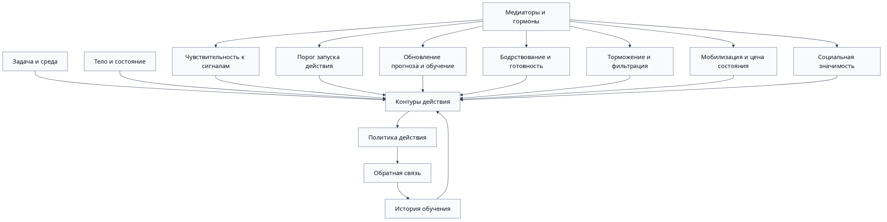{.diagram}


Схему нужно читать так:

- задача и среда задают входные условия;
- тело и история обучения меняют доступность действий;
- контуры действия выбирают политику: приблизиться, избегать, искать, отложить, восстановиться, попросить помощи;
- медиаторы и гормоны не выбирают действие вместо системы, но меняют ее режим;
- обратная связь меняет будущие ожидания.

Граница схемы: она показывает не прямое управление поведением, а изменение режима обработки. В реальности эффект зависит от области, рецепторов, времени, исходного состояния, задачи и истории обучения.

Например, норадреналиновая система может сделать сигналы более "громкими" и подготовить систему к быстрому реагированию. Это может помочь при простой срочной задаче. Но при сложной аналитической работе слишком высокий уровень готовности может ухудшить гибкое мышление: внимание начинает цепляться за угрозы, ошибки и отвлекающие сигналы.

Дофаминовая система может поддерживать обучение по ошибке прогноза и готовность тратить усилие на значимый результат. Но это не означает, что всякая мотивация является "дофамином". Если задача важна, но неуправляема, туманна, социально опасна и слишком дорогая по усилию, один разговор о дофамине ничего не объяснит.

Кортизол и стрессовые медиаторы могут поддерживать мобилизацию. Но если мобилизация длится долго, цена состояния растет, PFC может становиться уязвимее, а сложное управление действием - менее доступным.

Главная мысль:

```text
нейрохимия меняет вероятности и режимы,
но не отменяет задачу, среду, историю, тело и контуры
```

## Почему "больше" не значит "лучше"

В популярном языке часто звучит скрытая модель:

```text
мало вещества - плохо
много вещества - хорошо
```

Для мозга эта модель часто приводит к ошибке.

У многих нейромодуляторных систем есть рабочий диапазон. Недостаточная активация может давать вялость, слабое удержание сигнала или низкую готовность к действию. Чрезмерная активация может давать шум, тревожную мобилизацию, импульсивность, туннель внимания или перегруз.

Для когнитивного контроля это часто описывают как перевернутую U-кривую:

```text
слишком мало -> слабый режим
оптимальный диапазон -> хорошая работа
слишком много -> распад точности
```

Такой принцип особенно важен для дофамина и норадреналина в префронтальной коре. PFC нужна точная настройка. Сложная работа требует не максимального возбуждения, а режима, в котором цель удерживается, лишний шум фильтруется, а ошибки замечаются без паники.

Есть еще одно различение: тонический и фазический режимы.

Фазический режим - короткие, событийные изменения, связанные с конкретным сигналом, неожиданностью, наградой, угрозой, ошибкой или важным стимулом.

Тонический режим - более общий фон активности системы, который задает режим готовности, напряжения, поиска или бодрствования.

Это различение помогает понять, почему одно и то же слово может значить разные вещи. Например, "высокая готовность" может быть кратким полезным всплеском перед действием, а может быть долгим напряженным фоном, где человек не работает глубже, а постоянно сканирует угрозы.

Поэтому инженерный вывод:

```text
не ищите максимум,
ищите подходящий режим для текущей задачи
```

Сложный текст, архитектурное решение, обучение и трудный разговор требуют разных режимов. Система, идеально настроенная для реакции на аварию, может быть плохо настроена для спокойного чтения, долгого письма или тонкой социальной обратной связи.

## Дофамин: не удовольствие, а обучение, значимость и готовность к усилию

Дофамин чаще всего страдает от популяризации.

Его называют "гормоном удовольствия", "гормоном мотивации", "гормоном награды", "топливом воли". Во всех этих формулировках есть фрагменты правды, но как учебная модель они недостаточны.

Начнем с классической идеи ошибки предсказания награды.

Если система ожидала одно, а получила лучше ожидаемого, прогноз нужно обновить. Если ожидала награду, а награды нет, прогноз тоже нужно обновить. Дофаминовые сигналы важны для такого обучения: они помогают системе менять ожидания и будущий выбор.

Но это не значит, что дофамин просто "выделяется от удовольствия".

Удовольствие, желание, обучение и усилие - разные процессы.

В литературе часто различают:

| Процесс | Смысл |
| --- | --- |
| Удовольствие | Переживание удовольствия или приятности. |
| Мотивационное хотение / стимульная значимость | Притягательность стимула, "тянет туда". |
| Обучение | Обновление ожиданий по опыту. |
| Распределение усилия | Готовность платить усилием ради результата. |
| Выбор действия | Сдвиг вероятности запуска одного действия среди других. |

Дофамин особенно важен для мотивационного хотения, обучения, распределения усилия и выбора действия. Но удовольствие как переживание приятности не сводится к дофамину; здесь важны и опиоидные системы, и другие контуры.

Это различение объясняет распространенный опыт:

```text
меня тянет открыть легкое приложение,
но настоящего удовольствия там уже почти нет
```

Система может хотеть стимул, который уже не дает глубокого удовлетворения. Мотивационное хотение и удовольствие разошлись. Поэтому "легкий дофамин" - удобная, но грубая метафора. Точнее говорить так:

```text
есть легкие стимулы с низкой ценой входа,
быстрой обратной связью,
частым обновлением ожиданий
и сильной конкуренцией за запуск действия
```

Для учебника важно еще одно: дофамин связан с решениями на основе цены усилия. Иногда проблема не в том, что человеку не важен результат. Результат может быть важен, но ожидаемая цена движения к нему слишком высока. Тогда более дешевое действие выигрывает.

Инженерный вопрос к дофаминовому уровню не такой:

```text
как поднять дофамин?
```

а такой:

```text
есть ли понятный прогноз продвижения?
есть ли обратная связь?
переносима ли цена первого шага?
не лежит ли рядом слишком дешевое конкурирующее действие?
есть ли опыт, что усилие действительно меняет результат?
```

Так мы возвращаемся к уже введенным главам:

- контекст задачи может снижать цену удержания;
- рабочий журнал может возвращать прогноз;
- ритуал входа может снижать порог запуска;
- управляемость часто делает усилие осмысленнее;
- малая обратная связь помогает системе учиться.

То есть практическое вмешательство обычно не "в дофамин", а в структуру задачи и обратной связи.

## Норадреналин: готовность, усиление сигнала и цена мобилизации

Норадреналин часто описывают как медиатор бодрости, внимания и реакции "бей или беги". Это хороший первый вход, но он быстро становится слишком узким.

Важная часть норадреналиновой системы связана с голубым пятном. Эта система широко проецируется в мозг и может менять общий режим обработки.

Один из полезных языков - адаптивное усиление.

Усиление можно понимать как повышение различимости сигналов. Когда оно настроено удачно, важный сигнал легче выделяется из фона. Система готова действовать, внимание собрано, реакция быстрее.

Но слишком высокий уровень готовности может сделать систему не точной, а тревожно-реактивной. Сигналы становятся громкими, но не обязательно полезными. Человек замечает больше угроз, отвлечений, ошибок, сообщений, чужих интонаций. Это может помочь в аварии, но плохо подходит для спокойной сложной работы.

Норадреналин также удобно связывать с неожиданной неопределенностью. Если мир перестал соответствовать ожиданиям, система должна перестроиться. Это может быть полезным сигналом:

```text
старый план больше не работает,
нужно обновить модель
```

Но если неопределенность постоянная и неконтролируемая, система может застрять в режиме сканирования. Тогда внимание вроде бы активно, но глубокая работа не идет.

Инженерный перевод:

| Состояние | Возможный режим | Что проверить |
| --- | --- | --- |
| Собранная бодрость | Полезный фазический режим готовности. | Есть ли ясный первый шаг и ограниченный горизонт? |
| Тревожная настороженность | Слишком высокий уровень активации и сканирование угроз. | Не слишком ли много неопределенности и социальных рисков? |
| Рассеянный поиск | Система не удерживает использование найденного решения и переключается в поиск. | Есть ли критерий, когда поиск должен остановиться? |
| Усталое безразличие | Низкая готовность реагировать на задачу. | Это недосып, перегруз, скука, отсутствие обратной связи или низкая ценность? |

Практический вывод:

```text
для сложной работы нужна не максимальная бодрость,
а переносимая готовность с ограниченной неопределенностью
```

Иногда помочь может не "взбодриться", а сузить задачу, снять лишние каналы, определить первый проверяемый шаг и убрать постоянные микросигналы угрозы.

## Серотонин: настроение - слишком короткое слово

Серотонин часто превращают в "вещество хорошего настроения". Это один из самых живучих нейромифов.

Серотониновая система действительно связана с аффективной регуляцией, импульсивностью, обработкой неприятных и потенциально наказующих сигналов, задержкой, торможением, социальным поведением и клиническими темами. Но именно поэтому ее нельзя свести к одной бытовой формуле.

Для когнитивного инженерства особенно полезны три идеи.

Первая: серотонин связан с торможением поведения в контексте наказания и неприятных последствий. Когда действие может привести к потере, ошибке, стыду, конфликту или социальной цене, система может не просто "не хотеть", а тормозить вход.

Вторая: серотонин часто обсуждают в связи с задержкой, терпением и временной динамикой. Иногда нужно выдержать отсутствие быстрой награды, не сорваться в немедленное действие, пережить паузу между усилием и результатом.

Третья: социально-аффективная регуляция не сводится к настроению. Человек может избегать не потому, что "плохое настроение", а потому, что система предсказывает наказание, отвержение, потерю статуса или долгий неприятный период без подтверждения.

Практический перевод:

```text
если задача тормозится,
не называйте это сразу "нет мотивации"
спросите, какое наказание или неприятное последствие система ожидает
```

Примеры:

- "Если я открою документ, станет видно, что я отстал".
- "Если я напишу, мне могут отказать".
- "Если я начну, придется долго терпеть отсутствие результата".
- "Если я покажу черновик, меня оценят".

Серотониновый уровень здесь не дает готового решения. Он помогает не путать торможение с пустотой. Иногда действие не запускается не потому, что нет желания, а потому, что система слишком сильно учитывает наказание, задержку или социальную цену.

Инженерный вопрос:

```text
что именно система пытается предотвратить?
```

После этого можно проектировать вмешательство:

- снизить ставку первой попытки;
- сделать черновик приватным;
- разделить работу и оценку;
- сократить период без обратной связи;
- добавить безопасную промежуточную проверку.

## Ацетилхолин: внимание как точность обработки

Ацетилхолин часто связывают с вниманием, обучением и памятью. Это верно как направление, но опять требует уточнения.

В учебной модели ацетилхолин полезно читать как один из регуляторов режима обработки сигнала.

Он связан с обнаружением значимых сигналов, кодированием, вниманием к релевантным признакам и ожидаемой неопределенностью. Когда система знает, что сигналы могут быть неполными или шумными, ей нужно лучше настраивать обработку входа.

Например, вы читаете сложный лог. Там много строк, но важными являются только некоторые паттерны. Или разбираете код: значимыми могут быть имена, типы, порядок вызовов, условия гонки, старая договоренность в архитектуре. В такой задаче мало просто "быть бодрым". Нужно точнее выделять сигнал.

Отсюда различие:

```text
норадреналин помогает режиму готовности и реакции на неожиданность
ацетилхолин помогает режиму точного считывания и кодирования релевантного сигнала
```

Это не железное разделение, а учебная опора.

Инженерный вопрос:

```text
какой сигнал в этой задаче должен быть выделен?
```

Если сигнал не выделен, человек может сидеть над задачей долго, но не продвигаться. Он как будто "работает", но не знает, что именно считать признаком успеха, ошибки или следующего шага.

Практические вмешательства здесь снова лежат не в биохакинге:

- выписать, какие признаки важны;
- отделить факты от гипотез;
- уменьшить визуальный и информационный шум;
- читать с вопросом;
- фиксировать найденные сигналы в рабочем журнале;
- не держать весь контекст в голове.

## Глутамат и ГАМК: не газ и тормоз, а архитектура сигнала

Глутамат часто называют главным возбуждающим медиатором мозга. ГАМК - главным тормозным.

Метафора "газ и тормоз" полезна для первого входа. Но если остановиться на ней, можно ошибиться.

Возбуждение - это не "хорошо", а торможение - не "плохо". И наоборот.

Для устойчивого мышления нужны оба процесса. Сигнал должен передаваться, но лишний шум должен ограничиваться. Активность должна распространяться, но не распадаться в хаос. Нужны согласование во времени, фильтрация, локальная настройка, подавление лишних конкурентов, удержание полезного паттерна.

ГАМК-ергическое торможение не просто "успокаивает". Оно формирует активность: помогает отделять сигнал от шума, задавать временные окна, ограничивать саморазгоняющееся возбуждение, делать работу сети устойчивее.

Глутаматная передача не просто "ускоряет". Она лежит в основе возбуждающей коммуникации и пластичности, но при патологических режимах чрезмерное возбуждение может быть вредным. Для учебника достаточно понимать: это базовая архитектура передачи и изменения сигналов, а не бытовой регулятор настроения.

Инженерный перевод:

```text
устойчивое внимание - не максимальное возбуждение,
а правильное соотношение сигнала, шума, торможения и цели
```

Если человек пытается работать на перегрузе, у него может быть много "энергии", но мало точности. Если вокруг слишком много сигналов, важная задача проигрывает. Если нет внешнего фильтра, система сама платит цену фильтрации.

Поэтому практический уровень снова прост:

- убрать лишние сигналы;
- снизить плотность входа;
- вынести контекст наружу;
- работать коротким проверяемым блоком;
- ограничить конкурирующие каналы;
- не требовать от нервной системы одновременно читать, помнить, выбирать, отвечать, терпеть тревогу и не ошибаться.

## Кортизол и HPA-ось: мобилизация с ценой

Кортизол часто называют "гормоном стресса". Эта фраза не совсем ложная, но слишком короткая.

Кортизол связан с HPA-осью: гипоталамус, гипофиз, надпочечники. Эта система участвует в мобилизации организма. В краткосрочной перспективе мобилизация может быть полезной. Если нужно реагировать на угрозу, выдержать нагрузку, поднять доступность энергии, перестроить режим тела, стрессовые медиаторы нужны.

Проблема начинается, когда мобилизация становится хронической, неконтролируемой или несоразмерной задаче.

В главе 11 мы говорили об аллостатическом бюджете. Организм не просто возвращается к одной "норме". Он предвосхищает потребности и перестраивается под ожидаемую нагрузку. У такой адаптации есть цена. Если система долго живет в режиме "надо справиться, но непонятно как", цена накапливается.

Для PFC это особенно важно. Сложная работа требует удержания цели, рабочей модели, торможения импульсов, гибкости, оценки вариантов. Под неконтролируемым стрессом эти функции могут становиться менее доступными. Система может уходить в более быстрые, привычные или защитные режимы.

Инженерный вопрос:

```text
это краткая мобилизация под понятную задачу
или длительная мобилизация без управляемого выхода?
```

Примеры:

| Ситуация | Вероятный смысл |
| --- | --- |
| Срочная понятная задача на коротком горизонте | Мобилизация может помочь. |
| Долгая неопределенность без критерия завершения | Мобилизация начинает дорого стоить. |
| Постоянные прерывания и ожидание оценки | Система может держать тревожную готовность. |
| Высокая ответственность без рычага влияния | Растет риск беспомощности и истощения. |
| Нагрузки много, восстановления мало | Аллостатическая цена накапливается. |

Практический вывод:

```text
снижать стресс - не всегда значит "расслабиться"
иногда значит вернуть управляемость, критерий завершения и безопасный первый шаг
```

Стресс, аллостаз и окно полезной нагрузки требуют отдельного разбора. Здесь достаточно подготовить мост: кортизол не объясняет весь стресс, но стрессовые медиаторы помогают понять, почему режим нагрузки меняет доступность сложного действия.

## Окситоцин, опиоидные системы и социальные гормональные контексты

Окситоцин часто называют "гормоном любви". Это тоже слишком короткая формула.

Более осторожная модель - социальная значимость. Окситоцин может усиливать значимость социальных сигналов. Но социальный сигнал не всегда приятен. Это может быть близость, поддержка, доверие, но также оценка, угроза, чужая группа, стыд, ревность, исключение, конкуренция.

Поэтому нельзя сказать:

```text
больше окситоцина -> больше доброты
```

Нужно спрашивать:

```text
какой социальный сигнал в этом контексте стал более значимым?
```

Для когнитивного инженерства это особенно важно в лидерстве, обучении и командной работе. Задача может быть технической, но ее мотивационная цена часто социальна:

- кто увидит ошибку;
- кто оценит результат;
- можно ли показать черновик;
- есть ли безопасная обратная связь;
- есть ли право на вопрос;
- означает ли трудность рост или угрозу статусу.

Опиоидные системы важны для удовольствия, облегчения, телесного и социального "тепла", переживания приятности. Это помогает удержать различение с дофамином: нас может тянуть к стимулу без глубокого удовольствия, и мы можем получать удовольствие от чего-то, что не обязательно усиливает долгосрочное действие.

Пример:

```text
короткое легкое действие дает облегчение,
но не строит движение к важной задаче
```

Такой уход может быть подкреплен не только "дофаминовой наградой", но и облегчением, снижением напряжения, приятным контактом, чувством завершенности. Поэтому избегание часто закрепляется: оно не дает ценного результата, зато дает немедленное облегчение.

Тестостерон, прогестерон и другие гормональные системы нужно обсуждать особенно осторожно. В исследованиях мотивации есть данные о гормональных реакциях в контекстах власти, статуса, соревнования, принадлежности, близости и отвержения. Но это не дает права строить биологическую типологию людей:

```text
этот человек такой, потому что у него такой гормон
```

Правильнее:

```text
социальный контекст, мотив и телесная регуляция могут быть связаны,
но поведение не выводится из одного гормона
```

## Сквозной пример: важная задача вечером

Разберем один эпизод.

Человек вечером открывает важную туманную задачу. Она ценная. Ее надо сделать. Но вход не запускается.

Он ощущает напряжение. Контекст распался. В голове крутится: "надо бы". Рядом уведомления. Можно быстро ответить на пару сообщений, поправить план, почитать что-то полезное, подготовиться еще немного. Задача остается не открытой.

Плохое объяснение:

```text
нет дофамина
много кортизола
слабая воля
```

Разберем точнее.

### Дофаминовый уровень

Возможно, у задачи слабый прогноз продвижения. Непонятно, какой шаг даст результат. Обратная связь далеко. Цена усилия высокая. Рядом есть действия с быстрым микроподкреплением: уведомления, планировщик, легкие письма, чтение.

Инженерный ход:

```text
сделать первый шаг меньше,
сделать обратную связь ближе,
убрать дешевые конкуренты на время входа
```

### Норадреналиновый уровень

Система может быть бодрой, но не сфокусированной. Если задача несет неопределенность и риск ошибки, готовность превращается в сканирование угроз. Человек замечает все вокруг, но не входит глубоко.

Инженерный ход:

```text
ограничить горизонт,
закрыть лишние каналы,
выписать один проверяемый вопрос
```

### Серотониновый уровень

Задача может тормозиться не пустотой, а ожидаемым наказанием: увидеть реальное отставание, получить критику, обнаружить ошибку, потерять лицо перед собой или другим человеком.

Инженерный ход:

```text
разделить черновик и оценку,
сделать первую попытку приватной,
снизить социальную ставку
```

### Ацетилхолиновый уровень

Сигнал задачи может быть не выделен. Что именно искать? Какие признаки важны? Какие факты отделены от гипотез? Если все одинаково шумно, внимание не знает, за что зацепиться.

Инженерный ход:

```text
записать признаки,
выделить неизвестные места,
читать задачу с одним вопросом
```

### ГАМК/глутаматный уровень

Система может быть перегружена сигналами. Много возбуждения не равно много точного мышления. Нужна фильтрация, ограничение лишних импульсов, устойчивое окно работы.

Инженерный ход:

```text
убрать лишние стимулы,
сократить рабочий блок,
уменьшить плотность входа
```

### Кортизол и HPA-ось

Если день был длинным, с постоянными прерываниями и ответственностью без завершения, задача вечером приходит не в пустую систему. Она приходит в систему с накопленной ценой мобилизации.

Инженерный ход:

```text
не требовать полного героического входа,
сделать контрольную точку,
сохранить контекст,
перенести глубокую часть на восстановленный слот
```

### Социальные системы

Если задача связана с оценкой, статусом, принадлежностью или конфликтом, она не просто "техническая". Социальная значимость повышает цену входа.

Инженерный ход:

```text
создать безопасный формат черновика,
попросить раннюю обратную связь,
отделить исследование от демонстрации результата
```

Теперь видно главное: биохимия не заменила анализ задачи. Она помогла точнее увидеть режимы, в которых задача становится дорогой, шумной, угрожающей или слабо подкрепленной.

## Практический перевод

Эта таблица - не диагностический инструмент. Это переводчик из популярных формул в рабочие вопросы.

| Если хочется сказать | Точнее спросить | Возможный инженерный ход |
| --- | --- | --- |
| "Мне не хватает дофамина" | Где слабый прогноз, обратная связь, управляемость или слишком высокая цена усилия? | Уменьшить первый шаг, приблизить обратную связь, убрать быстрые конкуренты. |
| "Мне нужен норадреналин" | Нужна бодрость или точная готовность без тревожного сканирования? | Ограничить горизонт, убрать лишние каналы, задать один вопрос. |
| "У меня мало серотонина" | Что система тормозит и какого наказания ожидает? | Снизить ставку попытки, разделить черновик и оценку. |
| "Нужно успокоить ГАМК" | Где избыток шума, возбуждения или конкурирующих сигналов? | Снизить плотность входа, ограничить стимулы, сократить блок. |
| "Кортизол мешает" | Это краткая мобилизация или хроническая цена неконтролируемой нагрузки? | Вернуть управляемость, критерий завершения, восстановление. |
| "Нужен окситоцин" | Какой социальный сигнал слишком значим: поддержка, оценка, близость, угроза? | Создать безопасную обратную связь и право на черновик. |
| "Хочу эндорфинов" | Нужна радость, облегчение, восстановление или уход от неприятного? | Отличить восстановление от избегания, дать телу реальное восстановление. |

Главное правило:

```text
не переводите каждое состояние в вещество
переводите состояние в режим системы и уровень вмешательства
```

## Где вмешиваться

Если нейрохимический уровень реален, возникает соблазн: значит, надо вмешиваться именно в него.

Но это не следует автоматически.

Уровень реализации не равен лучшему уровню вмешательства.

Если у человека поднимается тревожная мобилизация перед публичной оценкой, можно бесконечно говорить о кортизоле, норадреналине и PFC. Но практический ход может быть проще:

- разделить черновик и публичный результат;
- дать критерии хорошей первой версии;
- договориться о безопасной обратной связи;
- уменьшить неопределенность;
- убрать лишние прерывания;
- восстановить сон;
- сократить число параллельных незавершенных задач.

Это не "менее научно". Это правильный выбор уровня вмешательства.

Нейрохимия объясняет, почему такие изменения могут работать. Но не всегда сама является местом прямой работы.

## Границы главы

Это не медицинские рекомендации.

Она не говорит:

- какие препараты принимать;
- какие добавки использовать;
- какие анализы сдавать;
- как интерпретировать уровень гормона;
- как "поднять" или "снизить" конкретный медиатор;
- как диагностировать депрессию, тревожное расстройство, СДВГ, эндокринные нарушения или хроническую усталость.

Если состояние длительное, тяжелое, нарушает жизнь, связано с резкими изменениями сна, аппетита, настроения, тревоги, энергии, боли или работоспособности, это уже не задача учебника. Это зона медицины, клинической диагностики и профессиональной помощи.

Задача учебника другая: дать язык, который помогает не делать грубых выводов и проектировать условия работы точнее.

## Переход к следующей главе

Теперь у нас есть три слоя части IV:

```text
глава 12: уровни объяснения
глава 13: контуры действия
глава 14: медиаторы и гормоны как регуляторы режима
```

Следующий шаг - стресс, аллостаз и окно полезной нагрузки.

Теперь мы не будем говорить:

```text
стресс = кортизол
```

Мы будем говорить:

```text
стресс - это режим мобилизации и адаптации,
который может помогать,
но имеет цену,
зависит от управляемости,
длительности,
восстановления,
сложности задачи
и социального контекста
```

Это важный переход. Потому что продуктивность ломается не от самого факта напряжения, а от несоответствия между нагрузкой, управляемостью, восстановлением и режимом системы.

## Короткое резюме

1. Нейромедиаторы и гормоны не являются готовыми психологическими состояниями.
2. Их лучше читать как регуляторы режима контуров.
3. Один медиатор может иметь разные эффекты в разных областях, рецепторах, дозах и задачах.
4. Дофамин не равен удовольствию или мотивации; он важен для обучения, значимости, усилия и выбора действия.
5. Норадреналин не равен вниманию; он меняет готовность, усиление сигнала и реакцию на неопределенность.
6. Серотонин не равен настроению; он участвует в аффективном контроле, торможении, наказании и задержке.
7. Ацетилхолин важен для режима обработки сигнала, внимания и кодирования.
8. Глутамат и ГАМК задают архитектуру возбуждения, торможения, фильтрации и устойчивости.
9. Кортизол и HPA-ось связаны с мобилизацией и аллостатической ценой.
10. Окситоцин, опиоидные системы и половые гормоны работают контекстно и не дают простых ярлыков личности.
11. Лучший уровень вмешательства часто лежит не в "биохимии", а в задаче, среде, обратной связи, восстановлении, управляемости и социальной безопасности.

## Вопросы для самопроверки

1. Почему формула "дофамин = мотивация" вредна для когнитивного инженерства?
2. Чем нейромодулятор отличается от нейромедиатора в учебной модели этой главы?
3. Почему "больше" не обязательно значит "лучше" для дофамина и норадреналина?
4. Как можно объяснить вечерний уход в уведомления без фразы "нет дофамина"?
5. Чем отличается удовольствие от мотивационного хотения?
6. Почему норадреналиновая готовность может мешать сложной работе?
7. Почему "серотонин = настроение" слишком короткая модель?
8. Как ацетилхолин связан с выделением релевантного сигнала?
9. Почему ГАМК нельзя свести к "спокойствию"?
10. Чем краткая мобилизация отличается от хронической аллостатической цены?
11. Почему окситоцин лучше понимать через социальную значимость, а не через "любовь"?
12. Почему лучший уровень вмешательства часто не совпадает с уровнем биохимической реализации?

## Мини-практика

Возьмите задачу, к которой трудно войти, и заполните таблицу.

| Уровень | Вопрос | Ответ |
| --- | --- | --- |
| Дофамин / обучение / усилие | Есть ли ясный прогноз продвижения и близкая обратная связь? |  |
| Норадреналин / уровень активации | Я в фокусе или тревожно сканирую угрозы и альтернативы? |  |
| Серотонин / торможение | Какого наказания, задержки или социальной цены я избегаю? |  |
| Ацетилхолин / сигнал | Какой признак задачи сейчас нужно выделить из шума? |  |
| ГАМК/глутамат / фильтрация | Какие лишние сигналы перегружают систему? |  |
| Кортизол / мобилизация | Это краткое напряжение или накопленная цена дня? |  |
| Социальные системы | Кто или что делает задачу социально значимой? |  |
| Уровень вмешательства | Что проще изменить: задачу, среду, первый шаг, обратную связь, восстановление, социальную рамку? |  |

Цель мини-практики - не поставить себе химический диагноз. Цель - перевести туманное "не могу" в более точные вопросы к режиму системы.

---

# Глава 15. Стресс, аллостаз и окно полезной нагрузки

## После нейромедиаторов и гормонов

В прошлой главе мы специально не свели поведение к веществам.

Мы не писали:

```text
дофамин = мотивация
норадреналин = внимание
серотонин = настроение
кортизол = стресс
```

Мы говорили точнее: медиаторы и гормоны меняют режим работы контуров. Они могут влиять на чувствительность к сигналам, обучение, пороги запуска, торможение, бодрствование, мобилизацию тела и социальную значимость.

Теперь можно говорить о стрессе.

Здесь есть тот же риск. Очень легко сказать:

```text
стресс - это кортизол
```

или:

```text
стресс всегда вреден
```

или наоборот:

```text
стресс полезен, если правильно себя настроить
```

Все три формулы слишком короткие.

Стресс не является одним гормоном. Он не является одним чувством. И он не является ни чистым врагом, ни чистым топливом. Для когнитивного инженерства стресс лучше понимать как режим мобилизации и адаптации: система встречает требование, меняет настройки тела, внимания и поведения, пытается ответить на вызов и потом должна восстановиться.

Краткая мобилизация может помочь. Она собирает внимание, повышает готовность, отсекает лишние варианты, ускоряет простое действие.

Но если мобилизация слишком сильная, слишком долгая, плохо управляемая или не закрывается восстановлением, она перестает помогать. Тогда стресс может стать не рабочим режимом, а дорогим фоном, который сужает мышление, повышает угрозу, ухудшает гибкость и копит долг восстановления.

Поэтому главный вопрос этой главы не такой:

```text
как убрать стресс?
```

и не такой:

```text
как использовать стресс на максимум?
```

А такой:

```text
какая нагрузка сейчас полезна для этой задачи,
где проходит рабочее окно,
и что происходит с системой после нагрузки?
```

## Три разных уровня: стрессор, реакция и переживание

Начнем с различения, без которого разговор о стрессе быстро путается.

Стрессор - это требование адаптации. Это может быть дедлайн, конфликт, экзамен, риск ошибки, неопределенная задача, шумная среда, болезнь, недосып, финансовая угроза или просто слишком большой объем одновременных обязательств.

Стрессовая реакция - это ответ системы на требование. Тело и мозг меняют режим: может повышаться готовность, внимание может сужаться на значимом, растет чувствительность к угрозам, меняется работа PFC, норадреналиновой системы, HPA-оси и других контуров.

Субъективное переживание - это то, как человек чувствует этот режим: тревога, собранность, давление, азарт, злость, усталость, оцепенение, срочность, раздражение или пустота.

Эти уровни связаны, но не совпадают.

Один и тот же дедлайн у одного человека может включить рабочую собранность, а у другого - паническую прокрастинацию. Одна и та же презентация для подготовленного специалиста может быть вызовом, а для новичка - угрозой. Один и тот же рабочий день после хорошего сна и после недели недосыпа будет совсем разной нагрузкой.

Поэтому нельзя оценивать стресс только по внешнему событию:

```text
дедлайн есть -> значит стресс высокий
```

и нельзя оценивать только по внутреннему ощущению:

```text
мне неприятно -> значит нагрузка вредна
```

Нужно смотреть на систему целиком:

| Уровень | Вопрос |
| --- | --- |
| Стрессор | Что требует адаптации? |
| Реакция | Как система мобилизуется? |
| Управляемость | Могу ли я влиять на ход ситуации? |
| Сложность задачи | Какой режим нужен для качественного действия? |
| Длительность | Сколько времени система держит мобилизацию? |
| Восстановление | Возвращается ли доступность действия после нагрузки? |

Такой разбор особенно важен для сложной интеллектуальной работы. Разработчик, инженерный лидер, исследователь, автор или студент часто страдают не от одного сильного стрессора, а от постоянного требования удерживать много контекстов, принимать решения, отвечать за последствия, возвращаться после прерываний и при этом сохранять качество мышления.

## Зачем стресс вообще нужен

Если убрать из слова "стресс" моральную окраску, останется полезная функция: мобилизация под адаптацию.

Система встречает вызов и делает несколько вещей.

Во-первых, выделяет важное. Когда появляется угроза или срочность, внимание часто перестает равномерно плавать по миру и начинает искать значимый сигнал.

Во-вторых, готовит тело к действию. Дыхание, сердечный ритм, мышечный тонус, бодрствование и гормональные оси перестраиваются под ответ.

В-третьих, ускоряет выбор в простых ситуациях. Когда нужно быстро отреагировать, слишком много размышления мешает. Мобилизация может помочь сделать шаг, позвонить, остановить ошибку, закрыть аварийный риск.

В-четвертых, может повышать значимость обратной связи. Под нагрузкой система иногда быстрее учится на том, что оказалось опасным, важным или неожиданным.

Это объясняет, почему короткое напряжение иногда помогает:

```text
задача стала важной -> внимание собралось -> первый шаг начался -> обратная связь появилась
```

Но та же логика объясняет, почему стресс легко становится вредным.

Мобилизация хороша для ответа на вызов. Она плоха как постоянный стиль жизни. Если система слишком долго живет в режиме "сейчас важно, сейчас угроза, сейчас нужно срочно", она перестает получать цену обратно. Действие еще совершается, но восстановление отстает. Человек вроде бы держится, но это держание уже оплачивается будущим.

## Окно полезной нагрузки

Для учебника нам нужна простая, но аккуратная модель. Назовем ее окном полезной нагрузки.

Вопрос схемы:

```text
когда нагрузка помогает действию,
а когда она уводит систему ниже или выше рабочего режима?
```


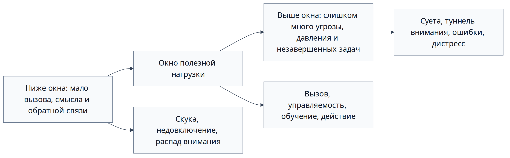{.diagram}


Схема намеренно грубая. Она не измеряет стресс в баллах и не задает универсальную норму для всех людей. Она помогает спросить, в какую сторону сейчас смещена система: не хватает включающего вызова, нагрузка держится в рабочем диапазоне или давление уже разрушает качество действия.

Ниже окна задача не включает систему. Вызов слишком слабый, смысл не чувствуется, обратная связь не важна, действия выглядят бессмысленными. Человек может выглядеть "немотивированным", но дело не обязательно в слабой воле. Иногда задача просто не дает достаточно содержательной нагрузки, ответственности, роста или вклада.

Внутри окна задача достаточно трудна, чтобы собрать внимание, но не настолько угрожает, чтобы разрушить мышление. Есть вызов, управляемость, обратная связь и возможность восстановиться после усилия.

Выше окна задача или ситуация перегружает систему. Слишком много требований, ставок, неопределенности, прерываний, социального риска, параллельной незавершенной работы или длительности. Внимание часто сужается, рабочая память хуже удерживает модель, гибкость падает, угрозы становятся громче, а действие всё чаще превращается в избегание, суету или принуждение.

Это окно не одинаково для всех людей и всех дней. Оно зависит от задачи, состояния, опыта, сна, безопасности, социальной рамки и истории предыдущих нагрузок.

Особенно важна сложность задачи.

Простая задача часто терпит более высокий уровень активации. Если нужно быстро разобрать коробки, ответить на короткие письма, закрыть рутинный чек-лист или сделать физически понятный шаг, дополнительный драйв может ускорять.

Сложная задача требует другого режима. Архитектурное решение, сложный текст, исследование, обучение, трудный разговор, проектирование системы или анализ причины инцидента требуют удержания контекста, гибкости, спокойной проверки гипотез и терпимости к неопределенности. Слишком сильная мобилизация здесь часто мешает: внимание начинает хвататься за угрозы, ошибка кажется опаснее, чем есть, а мысль теряет ширину.

Короткая формула:

```text
простая задача переносит больше нажима
сложная задача требует более спокойной собранности
```

## Закон Йеркса-Додсона как эвристика, а не точная шкала

Закон Йеркса-Додсона обычно пересказывают так: производительность растет с уровнем возбуждения до некоторого оптимума, а затем падает. Для сложных задач оптимум ниже, для простых - выше.

Это полезная идея, но ее нельзя превращать в точный прибор.

Во-первых, "возбуждение" не является одной простой величиной. В него входят бодрствование, тревожность, мышечная готовность, норадреналиновая настройка, субъективная срочность, социальная оценка, угроза, интерес и многое другое.

Во-вторых, "производительность" тоже разная. Скорость, точность, креативность, качество решения, глубина понимания, устойчивость после работы и долгосрочное обучение могут расходиться. Можно быстро сделать больше и хуже понять. Можно сдать дедлайн и накопить восстановительный долг.

В-третьих, форма окна зависит от контекста. Контролируемая нагрузка, поддержка, ясная обратная связь и опыт похожих задач расширяют окно. Неконтролируемость, неопределенность, публичная угроза, недосып и хроническая параллельная незавершенная работа его сужают.

Поэтому закон полезнее читать не как график "сколько возбуждения нужно", а как предупреждение:

```text
давление помогает не бесконечно
и для сложной работы максимум давления часто хуже умеренной собранности
```

Для когнитивного инженерства это сразу меняет практику. Перед тем как добавить дедлайн, соревнование, внешнее обещание или внутренний нажим, нужно спросить:

```text
эта задача простая или сложная?
ей не хватает включения или она уже перегружена угрозой?
новый стимул расширит действие или вытолкнет систему выше окна?
```

## Эустресс и дистресс

Слова "эустресс" и "дистресс" часто объясняют слишком просто:

```text
эустресс - хороший стресс
дистресс - плохой стресс
```

Так запомнить легко, но для работы этого мало.

Эустресс лучше определять не по приятности, а по эффекту. Это напряжение, которое помогает адаптации: человек собирается, делает шаг, учится, корректирует действие, после нагрузки получает опыт и может восстановиться.

Эустресс не обязан быть приятным. Важный экзамен, сложный разговор или первый доклад могут быть неприятными, но полезными, если нагрузка остается управляемой и после нее система не разваливается.

Дистресс начинается там, где тот же режим перестает помогать. Мобилизация остается, но адаптация не закрепляется. Тревога шумит, давление растет, восстановление дорожает, а действие становится хуже.

| Признак | Эустресс | Дистресс |
| --- | --- | --- |
| Роль напряжения | Помогает собраться и ответить на вызов. | Мешает действию и восстановлению. |
| Управляемость | Есть ощущение, что следующий шаг возможен. | Ситуация переживается как слишком большая или неконтролируемая. |
| Ошибка | Дает обратную связь. | Переживается как угроза или доказательство несостоятельности. |
| После нагрузки | Остается опыт, усталость восстанавливается. | Остается долг, тревожный фон и сужение окна. |
| Практический ход | Держать ритм, ясность и восстановление. | Снижать давление, угрозу, число параллельных незавершенных задач и неопределенность. |

Главная граница:

```text
эустресс помогает адаптации
дистресс начинает оплачивать действие восстановлением, которого уже не хватает
```

## Аллостаз: устойчивость через изменение

Чтобы понять хроническую цену стресса, нужен термин "аллостаз".

Гомеостаз обычно описывают как поддержание важных параметров в допустимых пределах. Температура, уровень глюкозы, давление и другие параметры не должны свободно уходить куда угодно.

Аллостаз добавляет важную мысль: устойчивость часто поддерживается не через неподвижность, а через изменение. Организм меняет режим под требования среды. Он может заранее мобилизоваться, перераспределить энергию, изменить внимание, сон, аппетит, иммунные и эндокринные процессы.

Это нормально. Живая система не обязана быть всегда спокойной. Она должна уметь перестраиваться.

Проблема начинается не в самом изменении режима, а в цене.

Если система часто мобилизуется, долго остается в повышенной готовности, не получает восстановления или вынуждена адаптироваться к неконтролируемым требованиям, возникает аллостатическая нагрузка. Это не буквальный бак энергии. Это способ говорить о накопленной цене повторной и хронической адаптации.

Здесь важен еще один слой: мозг не просто пассивно "считывает" тело. Он постоянно предсказывает, какое состояние тела потребуется для действия, угрозы, отдыха, контакта с людьми или решения задачи. Интероцепция в этом смысле - не только ощущение сердцебиения или напряжения, а часть системы, которая помогает мозгу оценивать телесную цену будущего шага.

Поэтому человек иногда чувствует задачу дорогой еще до ясного рассуждения о ней. В теле уже есть прогноз: сколько напряжения понадобится, насколько это управляемо, хватит ли восстановления, не повторится ли прошлый перегруз. Это не означает, что тело всегда "знает правду". Телесный сигнал может быть полезным предупреждением, следом хронической нагрузки, ошибочным прогнозом, реакцией на неопределенность или симптомом состояния, которое требует другого уровня помощи. В учебнике этот слой нужен не для самодиагностики, а для более честной модели цены действия.

Можно представить цикл:

Вопрос второй схемы:

```text
что происходит, если мобилизация повторяется чаще,
чем система успевает закрывать ее цену восстановлением?
```


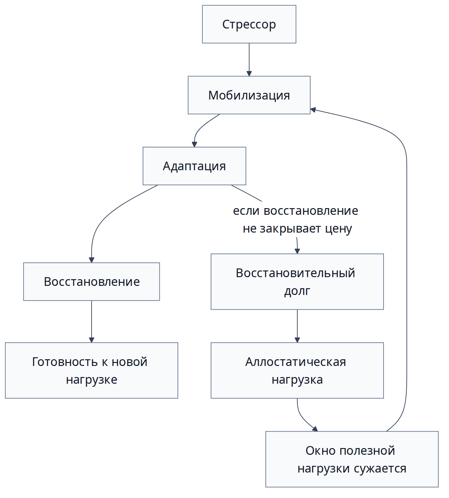{.diagram}


Эту схему нужно читать как динамику, а не как диагноз. Один дорогой день не равен аллостатической нагрузке. Риск появляется, когда режим мобилизации становится нормой, а восстановление систематически не возвращает доступность действия.

Если после нагрузки есть восстановление, цикл может быть здоровым: система ответила, научилась, вернулась в доступный режим.

Если восстановление не закрывает цену, окно может сужаться. То, что раньше было посильным вызовом, теперь ощущается перегрузом. То, что раньше собирало, теперь раздражает. То, что раньше требовало часа, теперь требует полдня разгона. И тогда человек может неправильно объяснить себе происходящее:

```text
я стал слабее
мне не хватает дисциплины
надо сильнее давить
```

Иногда правильнее сказать:

```text
система слишком долго адаптировалась без достаточного восстановления
и теперь цена входа стала выше
```

## HRV: полезный сигнал, но не прибор воли

В разговоре о стрессе и восстановлении часто появляется HRV: вариабельность сердечного ритма.

В грубом виде идея такая: здоровая регуляция не держит сердце как метроном. Сердечный ритм меняется от вдоха к выдоху, от покоя к действию, от безопасности к угрозе, от восстановления к мобилизации. Эти колебания связаны с автономной нервной системой, вагусной регуляцией и более широким контуром "мозг - тело".

Поэтому HRV действительно может быть полезным сигналом. В модели нейровисцеральной интеграции его рассматривают как один из индикаторов связи между автономной регуляцией, эмоциональной регуляцией и PFC-зависимым контролем. В прикладном языке это звучит привлекательно:

```text
HRV показывает ресурсность
```

Но так писать нельзя.

HRV зависит от того, как именно его измеряли: длительность записи, положение тела, дыхание, время суток, артефакты, болезнь, физическая нагрузка, алкоголь, лекарства, индивидуальная база, тип метрики и качество устройства. Один показатель из носимого устройства не равен "сегодня можно/нельзя делать трудное".

Более аккуратная формула:

```text
HRV может быть одним из контекстных сигналов автономной регуляции,
но не является прямой мерой силы, воли, мотивации
или готовности к конкретной задаче
```

Для когнитивного инженерства это значит:

| Что HRV может дать | Чего HRV не должен делать |
| --- | --- |
| Подсказать, что состояние стоит проверить. | Единолично отменять или запускать трудную работу. |
| Показать долгосрочный тренд восстановления в похожих условиях. | Служить диагнозом выгорания, тревоги или "ресурсности". |
| Быть дополнительным сигналом рядом со сном, нагрузкой и поведением. | Заменять вопрос о параллельной незавершенной работе, угрозе, управляемости и восстановлении. |
| Помочь в личном наблюдении при низкой цене ошибки. | Подменять медицинскую или психотерапевтическую оценку. |

Если HRV низкий, правильный инженерный вопрос не:

```text
мне запрещено работать?
```

А:

```text
что еще говорит о состоянии:
сон, болезнь, нагрузка, внимание, ошибки,
эмоции, контекст задачи и цена следующего входа?
```

Иногда ответом будет снижение сложности и числа параллельных незавершенных задач. Иногда - короткая восстановительная пауза. Иногда - обычный вход в задачу, но через более мягкий первый шаг. Иногда - медицинская или организационная граница. Метрика помогает только тогда, когда остается частью более широкой картины.

## Почему под сильным стрессом хуже думается

Теперь вернемся к главам 13 и 14.

PFC нужна для удержания цели, рабочей модели, правил, контекста и гибкого выбора. Она особенно важна там, где нельзя просто реагировать: нужно подумать, сравнить гипотезы, удержать несколько условий, не сорваться в первый импульс, заметить ошибку без паники.

При сильном, неконтролируемом или длительном стрессе система смещается к другому режиму. Быстрые защитные реакции, угроза, привычные ответы и узкое внимание становятся доступнее. Это может быть полезно в опасной ситуации, где нужно действовать быстро. Но для сложной интеллектуальной работы такой режим часто вреден.

Что происходит на уровне поведения:

- рабочая память хуже держит контекст;
- внимание чаще цепляется за угрозы, ошибки и срочные сигналы;
- человек хуже различает важное и шумное;
- растет желание закрыть неприятное состояние быстрым действием;
- сложная задача начинает казаться не просто трудной, а опасной;
- после прерывания сложнее вернуться в исходную модель задачи.

Именно поэтому совет "просто поднажми" может ломать сложную работу.

Поднажать можно на рутину. Иногда можно поднажать на короткий последний метр. Но если задача требует PFC-зависимого мышления, анализа, обучения, письма или тонкого разговора, избыточный нажим может ухудшать сам инструмент, которым эту задачу нужно решать.

Пример.

Разработчик вечером открывает сложный архитектурный кусок. У него есть мотивация: задача важная. Есть знание: он примерно понимает область. Но день уже был полон встреч, сообщений, срочных решений и социальной оценки. Система находится выше окна.

Если добавить еще один внутренний приказ "соберись", может стать хуже. Внимание будет не глубже, а уже. Он начнет перескакивать между файлами, проверять мессенджеры, бояться ошибиться, начинать заново. Снаружи это похоже на прокрастинацию. Внутри это может быть стрессовый режим, в котором сложная модель задачи больше не удерживается.

Инженерный вопрос здесь:

```text
как вернуть задачу в рабочее окно?
```

Иногда ответом будет не героический рывок, а другое действие:

- сделать контрольную точку;
- сузить задачу до диагностического шага;
- убрать уведомления;
- перенести сложное решение на утро;
- закрыть день восстановлением;
- заранее подготовить вход в следующий блок.

## Верхний перекос: выгорание стресса

Верхний выход из окна хорошо описывает маршрут выгорания стресса.

Сначала высокая значимость и срочность могут помогать. Человек включен, много делает, быстро реагирует, держит несколько треков, получает признание или сам чувствует, что "наконец живет в полную силу".

Проблема в том, что полезная мобилизация и тревожная мобилизация могут выглядеть похоже.

На раннем участке человек еще справляется. Но цена восстановления уже растет. Работа держится не на спокойном ресурсе, а на внутреннем нажиме:

```text
еще немного
сейчас нельзя сбавлять
если отпущу, все развалится
после этого точно отдохну
```

Если такой режим становится нормой, система живет выше окна. Нагрузка не возвращается опытом и устойчивостью, а превращается в долг. Тревога уже не помогает выбрать действие, но продолжает шуметь. Срочность уже не ускоряет сложное мышление, но продолжает сужать внимание. Результаты появляются, но не авторизуются как опора: за ними сразу приходит новая угроза.

Так появляется опасная путаница:

```text
человек работает много -> значит он продуктивен
человек держится -> значит режим устойчив
человек устал -> значит надо сильнее организоваться
```

В реальности может быть иначе:

```text
человек работает много, потому что система не может выйти из мобилизации
он держится ценой будущего восстановления
а новый порядок нужен не для нажима, а для снижения перегруза
```

## Нижний перекос: выгорание скуки

Ниже окна тоже плохо.

Иногда человек устает не потому, что требований слишком много, а потому что их слишком мало в правильном смысле. Нет вызова, нет роста, нет ответственности, нет видимого вклада, нет обратной связи, нет ощущения, что усилие вообще что-то меняет.

Такой недогруз легко принять за лень:

```text
мне скучно
я не включаюсь
я не могу себя заставить
наверное, я потерял мотивацию
```

Но мотивация может не запускаться потому, что задаче не хватает содержательного напряжения. Система не видит, куда приложить усилие. Внимание не собирается, потому что нечему собирать. Работа не возвращает чувство результата, потому что вклад размытый или слишком малый.

Это не противоположность стресса в бытовом смысле. Это другой выход из окна.

При перегрузе слишком много угрозы, давления и требований.

При недогрузе слишком мало вызова, смысла и обратной связи.

Оба состояния могут выглядеть как "нет энергии". Но вмешательства разные.

| Состояние | Что проверять | Что обычно помогает |
| --- | --- | --- |
| Перегруз | Слишком много требований, параллельной незавершенной работы, угрозы, неопределенности, социальной цены. | Снизить давление, сузить шаг, вернуть управляемость, восстановление и безопасность. |
| Недогруз | Слишком мало вызова, смысла, ответственности, обратной связи, роста. | Добавить содержательную задачу, видимый вклад, критерий качества, автономию и обучение. |

Это различение важно для будущих глав о продуктивности и выгорании. Профессиональную скуку опасно закрывать теми же средствами, что выгорание от перегруза. И перегруз не стоит закрывать добавлением "более вдохновляющей цели", если система уже не вывозит цену.

## От чего зависит ширина окна

Окно полезной нагрузки не дано раз и навсегда.

Оно расширяется или сужается.

### Сложность задачи

Чем больше рабочей памяти, гибкости и неопределенности требует задача, тем меньше она терпит грубую мобилизацию. Сложный код, архитектура, обучение и письмо требуют более спокойного режима, чем рутинный чек-лист.

### Управляемость

Контролируемая нагрузка легче переносится. Если человек понимает следующий шаг, может влиять на ход работы, видит обратную связь и имеет право корректировать план, стрессор чаще становится вызовом.

Неконтролируемая нагрузка дороже. Когда требования приходят без возможности влиять на сроки, объем, критерии и приоритеты, система быстрее переходит в угрозу.

### Длительность

Короткая мобилизация и хроническая мобилизация - разные вещи. Даже полезный режим становится дорогим, если он не завершается.

### Параллельная незавершенная работа

Одна сложная задача может быть посильной. Пять параллельных сложных задач могут создавать постоянный стрессор переключения. Система все время держит не только работу, но и страх забыть, потерять нить, опоздать, не заметить риск.

### Социальная безопасность

Если ошибка воспринимается как информация, окно обычно шире. Если ошибка воспринимается как стыд, угроза статусу или риск отвержения, окно может сужаться. Сложная работа становится не просто задачей, а социальным экзаменом.

### Обратная связь

Полезная обратная связь помогает корректировать действие. Слишком редкая, туманная или карательная обратная связь повышает угрозу и снижает управляемость.

### Восстановление

Сон, паузы, телесная база, смена режима, психологическое отделение от работы и завершение циклов результата помогают возвращать системе способность снова адаптироваться. Без восстановления окно может сужаться даже при тех же задачах.

## Инженерная диагностика нагрузки

Теперь переведем главу в практическую развилку.

Если человек не входит в задачу, не нужно сразу выбирать между "я ленюсь" и "я выгорел". Сначала полезно определить режим.

| Наблюдение | Возможный режим | Первый инженерный вопрос |
| --- | --- | --- |
| Скучно, задача не цепляет, вклад не виден. | Ниже окна. | Как добавить смысл, вызов, ответственность или обратную связь? |
| Напряжение есть, но шаг понятен, после работы остается опыт. | Внутри окна. | Как удержать ритм и не разрушить восстановление? |
| Срочность шумит, ошибки пугают, мысль сужается. | Выше окна. | Что снизит давление, число параллельных незавершенных задач, угрозу или неопределенность? |
| Я долго "держусь", но каждый новый шаг дороже. | Аллостатический долг. | Какая нагрузка стала нормой, хотя должна быть исключением? |
| Задача важная, но первый шаг кажется опасным. | Угроза + низкая управляемость. | Как сделать шаг меньше, безопаснее и проверяемее? |
| После результата нет опоры, только новая задача. | Нарушен цикл восстановления и авторизации результата. | Как зафиксировать вклад и закрыть рабочий блок? |

Из этой таблицы видно: когнитивное инженерство не сводится к успокоению.

Иногда нужно снизить нагрузку.

Иногда нужно добавить вызов.

Иногда нужно вернуть управляемость.

Иногда нужно убрать лишнюю параллельную незавершенную работу.

Иногда нужно закрыть восстановительный долг.

Иногда нужно изменить социальную рамку, потому что задача стала не интеллектуальной, а угрожающей.

## Почему восстановление не награда, а часть системы

В культуре продуктивности восстановление часто ставят после работы:

```text
сначала сделаю все важное
потом восстановлюсь
```

Для короткого рывка это иногда работает. Для долгой системы - нет.

Восстановление не просто приятный бонус. Оно возвращает системе способность снова адаптироваться. Если после мобилизации нет восстановления, следующая нагрузка начинается не с нуля, а с долга.

Важно различать отдых как восстановление и избегание как уход.

Качественный отдых может снижать цену будущего действия и возвращать доступ к вниманию, телу, управляемости и смыслу.

Избегание снижает неприятное состояние прямо сейчас, но часто оставляет задачу более угрожающей на следующий вход.

Внешне оба могут выглядеть одинаково: человек не работает. Но системно это разные процессы.

Инженерный вопрос:

```text
после этой паузы задача станет доступнее или страшнее?
```

Если пауза возвращает ясность, сон, тело, спокойную рамку и следующий шаг, это восстановление.

Если пауза только откладывает угрозу без изменения условий входа, это может быть избегание.

## Как это связывает предыдущие главы

Теперь у нас появляется более полная модель действия.

Глава 7 сказала: мотивация не равна желанию.

Главы 8-9 показали области ценности и режимы приближения/избегания.

Глава 10 ввела управляемость.

Глава 11 добавила цену усилия и ощущаемую энергию.

Главы 12-14 дали уровни объяснения, контуры действия и медиаторы как регуляторы режима.

Глава 15 собирает это в динамику нагрузки:

```text
ценность без управляемости повышает угрозу
угроза повышает цену усилия
высокая цена усилия сужает доступность действия
стрессовая мобилизация может помочь коротко
хроническая мобилизация копит аллостатическую нагрузку
восстановление помогает возвращать окно полезной работы
```

На этом держится следующий блок учебника.

Обучение требует полезной трудности, но не парализующей угрозы.

Преодоление требует напряжения, но управляемого и дозированного.

Продуктивность требует ритма, а не постоянного аварийного режима.

Выгорание нужно понимать не как "устал от работы", а как нарушение контура нагрузки, восстановления, смысла, управляемости и результата.

## Короткое резюме

1. Стресс нельзя сводить к кортизолу, чувству тревоги или внешнему событию.
2. Стрессор, стрессовая реакция и субъективное переживание - разные уровни.
3. Мобилизация может помогать, если она поддерживает действие и закрывается восстановлением.
4. Закон Йеркса-Додсона полезен как эвристика: давление помогает не бесконечно, а сложная работа требует более спокойной собранности.
5. Эустресс и дистресс различаются не приятностью, а эффектом на адаптацию и восстановление.
6. Аллостаз - поддержание устойчивости через изменение режима.
7. Аллостатическая нагрузка - накопленная цена повторной или хронической адаптации.
8. HRV может быть полезным контекстным сигналом автономной регуляции, но не прямым прибором воли, ресурсности или готовности к работе.
9. При высоком, неконтролируемом или длительном стрессе сложное PFC-зависимое мышление становится менее доступным.
10. Выход из окна бывает верхним: перегруз, давление, угроза.
11. Выход из окна бывает нижним: недогруз, скука, отсутствие смысла и вызова.
12. Восстановление - не награда после работы, а часть контура, возвращающая способность снова адаптироваться.
13. Инженерное вмешательство зависит от режима: добавить вызов, снизить давление, вернуть управляемость, сузить параллельную незавершенную работу или закрыть восстановительный долг.

## Вопросы для самопроверки

1. Почему формула "стресс = кортизол" слишком груба?
2. Чем стрессор отличается от стрессовой реакции и субъективного переживания?
3. В чем практическая польза модели окна полезной нагрузки?
4. Почему сложная интеллектуальная работа хуже переносит высокий нажим, чем простая рутина?
5. Почему эустресс нельзя определять только как "приятный стресс"?
6. Где проходит граница между эустрессом и дистрессом?
7. Чем аллостаз отличается от простого представления о покое?
8. Почему человек может "держаться" и одновременно копить восстановительный долг?
9. Почему HRV нельзя использовать как единоличную команду "работать / не работать"?
10. Как перегруз и недогруз могут выглядеть одинаково как "нет мотивации"?
11. Почему восстановление нельзя откладывать на бесконечное "после всех дел"?
12. Как проверить, пауза является восстановлением или избеганием?
13. Какой параметр вашей текущей работы сильнее всего сужает окно: сложность, параллельная незавершенная работа, угроза, неопределенность, социальная цена или нехватка восстановления?

## Мини-практика

Возьмите одну задачу, в которую трудно войти, и заполните таблицу.

| Вопрос | Ответ |
| --- | --- |
| Что здесь является стрессором? |  |
| Задача ниже окна, внутри окна или выше окна? |  |
| Чего не хватает, если задача ниже окна: смысла, вызова, ответственности, обратной связи? |  |
| Что перегружает, если задача выше окна: давление, параллельная незавершенная работа, угроза, неопределенность, социальная оценка? |  |
| Какой ближайший шаг вернет управляемость? |  |
| Что нужно убрать, чтобы снизить аллостатическую цену? |  |
| Как после блока будет закрыто восстановление? |  |
| Какой результат нужно авторизовать, чтобы усилие не растворилось? |  |

Цель мини-практики - не поставить себе диагноз и не найти "правильный уровень стресса". Цель - понять, почему действие сейчас доступно или недоступно, и изменить условия так, чтобы задача вернулась в рабочее окно.

---

# Глава 16. Как строится понимание

## После стресса и окна полезной нагрузки

Предыдущая глава ввела окно полезной нагрузки.

Смысл был не в том, что нагрузка всегда вредна или всегда полезна. Смысл был точнее:

```text
слишком мало вызова не собирает систему
слишком много угрозы и давления ломает сложное мышление
полезная нагрузка находится между этими краями
```

Теперь можно говорить об обучении.

Обучение тоже требует нагрузки. Нельзя понять сложную тему, если только скользить по ней глазами, узнавать знакомые слова и каждый раз останавливаться на приятном ощущении "вроде понятно". Чтобы знание стало рабочим, его нужно восстановить без источника, связать с соседними знаниями, применить, ошибиться, поправить и снова вернуть.

Но обучение ломается, если нагрузка становится слишком большой. Когда задача перегружает рабочую память, когда ошибка кажется угрозой, когда слишком много новых терминов одновременно, когда нет следующего шага и обратной связи, человек не "тренируется глубже". Он часто просто шумит внутри, устает, избегает или запоминает оболочку без понимания.

Поэтому главная тема этой главы — не "как учиться эффективнее" в общем смысле.

Главная тема такая:

```text
как фрагмент знания становится рабочим пониманием,
затем чанком,
а затем переносимой единицей действия
```

Отсюда первое различение:

```text
понять при чтении
и уметь восстановить, связать и применить
— не одно и то же
```

## Понимание не равно знакомости

Начнем с обычной ситуации.

Человек читает понятный текст. Каждое предложение выглядит логичным. Термины знакомы. Пример убедительный. Внутри возникает спокойное чувство: "Да, понял".

Потом источник закрывается.

И вдруг оказывается, что пересказать главную мысль трудно. Можно вспомнить отдельные слова, но не ход рассуждения. Можно узнать термин, но не объяснить его без исходной формулировки. Можно согласиться с выводом, но не восстановить, почему он следует из предыдущих шагов.

Это не обязательно плохое чтение. Это нормальный ранний этап. Но его опасно принимать за готовое знание.

Знакомость возникает при встрече с материалом. Она отвечает на вопрос:

```text
я это уже видел?
```

Понимание начинается там, где можно ответить на другой вопрос:

```text
я могу это восстановить без источника,
объяснить своими словами,
связать с соседними знаниями
и применить в подходящей ситуации?
```

Между этими состояниями есть несколько ступеней.

| Состояние | Как выглядит | Что оно доказывает | Чего еще не доказывает |
| --- | --- | --- | --- |
| Знакомость | Термин, картинка или фраза узнаются. | Материал уже встречался. | Что смысл можно восстановить без подсказки. |
| Понимание при источнике | Текст кажется логичным, пока он перед глазами. | Человек может следовать чужому объяснению. | Что объяснение стало собственным. |
| Первичное рабочее понимание | Можно закрыть источник и пересказать мысль своими словами. | Смысл начал держаться без внешней опоры. | Что знание применится в другой задаче. |
| Чанк | Несколько элементов возвращаются как один блок. | Знание стало рабочей единицей. | Что оно не привязано к одному примеру. |
| Перенос | Принцип узнается и применяется в новой ситуации. | Знание вышло за пределы исходной оболочки. | Что перенос будет работать в любых далеких областях. |

Эта лестница важна для когнитивного инженерства. Если перепутать первую ступень с последней, человек начнет проектировать учебу неправильно. Он будет добавлять чтение там, где нужна проверка без источника. Будет делать красивые схемы там, где сначала нужно найти разрыв в объяснении. Будет собирать карточки из чужих фраз там, где мысль еще не стала своей.

## Рабочая память: почему фрагменты рассыпаются

Новое знание редко приходит в голову готовым блоком.

Обычно оно приходит как россыпь фрагментов:

- термин;
- определение;
- пример;
- исключение;
- причинная связь;
- шаг процедуры;
- образ;
- формула;
- связь с прошлой темой;
- вопрос, который пока не закрыт.

Проблема в том, что рабочая память не может спокойно удерживать большую россыпь отдельных элементов. Она похожа не на склад, а на маленькую рабочую поверхность. На ней можно держать несколько активных вещей и что-то с ними делать: сравнивать, связывать, проверять, менять порядок, примерять к задаче.

Если элементов слишком много, они начинают конкурировать. Человек держит термин и теряет пример. Держит пример и забывает условие. Держит условие и упускает, зачем вообще эта мысль была нужна.

Поэтому новое знание часто ощущается так:

```text
пока читаю — понимаю
как только закрываю — все распадается
```

Это не значит, что человек "глупый" или "не способен". Часто это значит, что материал пока остается набором отдельных фрагментов. Рабочая память платит за каждый фрагмент отдельно.

Классическая формула `7 +/- 2` хорошо известна, но ее нельзя использовать как точный закон для любой учебной ситуации. Современная картина осторожнее: емкость рабочего удержания мала, зависит от материала, задачи, опыта и того, считаем ли мы сырые элементы или уже собранные блоки. Для практики важна не точная цифра, а вывод:

```text
рабочая память терпит мало отдельных объектов
и гораздо лучше работает с осмысленными блоками
```

Вот почему опытный человек в своей области видит больше, чем новичок.

Новичок смотрит на ситуацию и видит много отдельных деталей. Специалист видит знакомые конфигурации: тип задачи, класс ошибки, паттерн поведения системы, место риска, обычную развилку решения. Он не держит каждую деталь отдельно. Часть деталей уже сжата в рабочие единицы.

Так появляется чанк.

## Что такое чанк

Чанк — это не просто группа элементов.

Это блок знания, который можно вернуть в голову почти целиком и использовать как одну рабочую единицу.

Коротко:

```text
чанк = смысловой или деятельностный блок,
который извлекается как одно целое
```

Важно не спутать чанк с папкой, списком, тегом или темой.

Папка хранит материалы рядом. Чанк снижает число отдельных удержаний.

Список перечисляет пункты. Чанк связывает их так, что они начинают работать вместе.

Тема может быть огромной и расплывчатой. Чанк имеет рабочие границы: понятно, что в него входит, зачем он нужен и когда его доставать.

Например, выражение на иностранном языке может быть чанком. Человек не переводит каждое слово отдельно, а узнает устойчивый смысл целого.

Алгоритм решения типовой задачи может быть чанком. Специалист не вспоминает каждый раз все правила с нуля, а видит знакомую структуру действия.

Понятие из этого учебника тоже может стать чанком. Например, "окно полезной нагрузки" становится рабочим блоком не тогда, когда читатель узнает название, а когда он может использовать его для диагностики:

```text
эта задача ниже окна, внутри окна или выше окна?
здесь не хватает вызова или уже слишком много угрозы?
что менять: смысл, объем параллельной работы, управляемость, обратную связь или восстановление?
```

Если понятие можно так достать и применить, оно стало ближе к чанку.

Если оно вспоминается только как знакомая фраза из главы, чанк еще не собран.

## Как фрагменты становятся чанком

В локальных заметках курса "Умение учиться" есть хорошая рабочая формула: чанк собирается через внимание, понимание и контекст.

Эти три слоя нельзя заменить друг другом.

### Внимание

Сначала материал должен действительно попасть в фокус.

Не "мелькнуть рядом". Не быть просмотренным между уведомлениями. Не быть пройденным на скорости, когда глаза уже в следующем абзаце, а мысль еще не удержала предыдущий.

Внимание здесь означает простой минимум:

```text
я могу удержать фрагмент достаточно долго,
чтобы понять, что он утверждает
```

Если этот слой не случился, дальше собирать нечего. Остается только смутное узнавание: "где-то видел".

### Понимание

Второй слой — собственная сборка смысла.

Пока мысль держится только в чужой формулировке, она еще хрупкая. Человек может повторить красивую фразу, но не обязательно понимает, какие отношения между частями она держит.

Понимание начинается, когда можно сказать своими словами:

```text
что здесь утверждается?
почему это важно?
с чем это связано?
какой пример показывает смысл?
где граница этого утверждения?
```

Своими словами — не значит "простыми" или "искаженными". Это значит, что мысль прошла через собственную сборку, а не только через копирование.

### Контекст

Третий слой — контекст применения.

Можно понять мысль и все равно не доставать ее в нужный момент. Такое часто случается с хорошими учебными текстами: пока человек читает главу, все ясно; через неделю в реальной задаче нужная идея не всплывает.

Проблема не всегда в памяти. Иногда у чанка нет контекста вызова.

Контекст отвечает на вопросы:

```text
где это знание нужно?
по каким признакам я пойму, что его пора достать?
какие соседние знания с ним конкурируют?
где оно не подходит?
что должно измениться в моем действии, если я его применил?
```

Без контекста знание может быть понятным, но плохо переносимым. Оно живет рядом с исходным примером, а не в рабочем мире человека.

## Центральный цикл понимания

Соберем это в одну схему.

Вопрос схемы:

```text
какой путь проходит фрагмент,
чтобы стать не знакомой строкой,
а рабочим знанием, которое можно восстановить и применить?
```


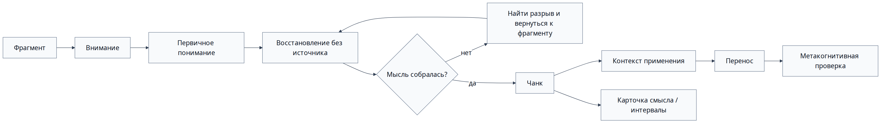{.diagram}


Схему нужно читать слева направо.

Граница схемы: она не обещает, что понимание всегда идет гладко и линейно. Узел ремонта здесь такой же важный, как узел успеха: разрыв восстановления без источника не означает провал, он показывает, что именно нужно чинить.

Сначала есть фрагмент. Он может быть новым термином, идеей, процедурой, примером или принципом.

Внимание удерживает его достаточно долго, чтобы началась первичная сборка.

Первичное понимание дает ощущение смысла, но еще не доказывает, что знание стало рабочим.

Проверка начинается на восстановлении без источника: источник убран, человек пытается восстановить мысль сам.

Если мысль не собирается, это не провал. Это точка диагностики. Нужно не перечитывать все подряд, а найти место разрыва:

- термин не понят;
- пропущена причинная связь;
- пример запомнился, а принцип нет;
- связь с соседним знанием не собрана;
- непонятно, где применять.

После ремонта разрыва восстановление без источника повторяется.

Когда мысль начинает возвращаться без источника, появляется кандидат в чанк. Но и это еще не конец. Нужно дать ему контекст применения и проверить перенос: узнается ли этот блок в другой задаче.

Карточки смысла и интервальное повторение стоят не в начале схемы, а после первичной сборки. Они возвращают мысль в память. Но если возвращать нечего, карточка станет карточкой узнавания чужой формулировки.

Метакогнитивная проверка смотрит на весь процесс сверху:

```text
что именно я сейчас строю?
где оно ломается?
какой следующий учебный ход нужен:
восстановление без источника, пример, карточка, практика, синопсис или отдых?
```

## Восстановление без источника: знание проверяется отсутствием подсказки

Восстановление без источника - это попытка восстановить мысль без подсказки исходного текста, схемы или готовой формулировки.

Не после полного курса. Не перед экзаменом. Сразу после первого осмысленного контакта.

Минимальный цикл такой:

1. Прочитать или разобрать небольшой фрагмент.
2. Убрать источник.
3. Восстановить главную мысль своими словами.
4. Заметить, где восстановление рвется.
5. Вернуться только к месту разрыва.
6. Снова закрыть источник и восстановить.

Почему это работает?

Потому что восстановление без источника проверяет не узнавание, а доступность знания изнутри. Пока текст перед глазами, он подставляет порядок, формулировку, пример и переходы. Когда текст убран, остается то, что действительно начало держаться.

Важный момент: восстановление без источника не только проверяет память. Оно участвует в обучении.

Когда человек пытается достать мысль, он перестраивает след. Он ищет связи, замечает пустые места, усиливает путь извлечения, отделяет принцип от оболочки. Поэтому хороший учебный цикл не выглядит как:

```text
читать -> читать -> читать -> надеяться, что запомнилось
```

Он выглядит так:

```text
понять малый фрагмент -> извлечь -> найти разрыв -> поправить -> извлечь снова
```

Такой цикл иногда неприятнее перечитывания. Он быстрее показывает, что знание еще не готово. Но именно поэтому он честнее.

## Иллюзия компетентности

Иллюзия компетентности появляется там, где знакомость кажется знанием.

Человек перечитывает материал. Второй проход идет легче. Третий еще легче. Фразы знакомы, порядок знаком, пример знаком, схема знакома. Из этой легкости рождается вывод:

```text
если стало легко читать,
значит я стал лучше знать
```

Иногда это правда. Но часто стало легче не потому, что мысль стала своей, а потому что оболочка стала привычной.

Оболочка — это:

- тот же порядок пунктов;
- та же страница;
- тот же пример;
- та же формулировка;
- та же схема;
- та же интонация объяснения.

При повторном чтении оболочка помогает узнавать маршрут. Но в реальной задаче этой оболочки может не быть. Там не будет знакомого заголовка, знакомой схемы и первого слова ответа. Нужно будет самому понять, какой чанк доставать.

Поэтому есть простая проверка:

```text
если знание возвращается только при виде источника,
это еще не рабочее знание
```

Выделения, подчеркивания, красивые конспекты и карты понятий не плохи сами по себе. Они могут помогать. Но они не заменяют восстановление без источника. Если сначала не было самостоятельного восстановления, внешняя схема может стать еще одной знакомой оболочкой.

Сильная карта понятий строится после того, как человек уже пытался восстановить смысл. Тогда карта помогает увидеть связи.

Слабая карта понятий строится вместо восстановления. Тогда она может красиво раскладывать чужие формулировки, не показывая, что именно человек способен достать сам.

## Чанк не появляется от одного повторения

Чанк собирается постепенно.

Сначала человек узнает элементы. Потом понимает связь между ними. Потом восстанавливает без источника. Потом применяет. Потом встречает похожую задачу в другой форме и понимает: "это тот же принцип".

Только после этого блок начинает возвращаться быстро.

Выглядит это так:

| Этап | Что происходит | Риск |
| --- | --- | --- |
| Первый контакт | Человек видит материал и пример. | Принять понятность источника за свое понимание. |
| Восстановление без источника | Источник убран, мысль восстанавливается или рвется. | Испугаться разрыва и уйти в пассивное перечитывание. |
| Ремонт | Человек чинит конкретный термин, переход или пример. | Перечитывать все подряд вместо точного ремонта. |
| Сборка чанка | Несколько элементов начинают возвращаться как один блок. | Назвать чанком то, что пока является списком. |
| Контекст | Понятно, где и зачем блок применять. | Оставить знание привязанным к исходной странице. |
| Перенос | Блок узнается в новой задаче. | Ожидать дальний перенос без вариативной практики. |

Такой путь опасно сильно сокращать: можно сделать его экономным, но нельзя заменить одним красивым конспектом.

## Карточки смысла

Карточка смысла нужна не для того, чтобы хранить еще одну формулировку.

Она нужна как маленький тест на восстановление чанка.

Плохая карточка спрашивает узнавание:

```text
Вопрос: Что такое аллостаз?
Ответ: Аллостаз — это...
```

Такая карточка может быть полезной на самом раннем уровне, но быстро превращается в проверку знакомой строки.

Более сильная карточка спрашивает смысл, связь или применение:

```text
Вопрос: Чем аллостаз отличается от простого представления о покое?
Ответ: Устойчивость поддерживается не неподвижностью, а изменением режима под требования среды.
```

Или:

```text
Вопрос: Как понять, что задача вышла выше окна полезной нагрузки?
Ответ: Появляются признаки перегруза: угроза, шум срочности, распад рабочей модели, высокая цена ошибки, много параллельной незавершенной работы и отсутствие восстановления.
```

Или:

```text
Вопрос: Когда "еще одно повторение" может поддерживать иллюзию компетентности?
Ответ: Когда человек повторяет знакомую оболочку без попытки восстановить мысль без источника и применить ее в другом контексте.
```

Хорошая карточка смысла делает три вещи:

1. Заставляет достать мысль из памяти.
2. Проверяет связь с соседними знаниями.
3. Уточняет, где эта мысль нужна.

Если ответ собирается только чужими словами, карточка показывает не провал, а незавершенную сборку. Нужно переписать обратную сторону своими словами, сузить вопрос или вернуться к разрыву.

Если ответ восстанавливается легко и переносится, карточку нужно разредить или убрать из активной колоды. Иначе повторение начнет обслуживать не обучение, а комфорт знакомости.

## Интервальное повторение: вернуть знание, а не заменить практику

Интервальное повторение полезно потому, что разводит возвраты во времени.

Когда между попытками есть интервал, знание приходится действительно доставать, а не просто держать в свежем следе. Это делает повторение ближе к извлечению из памяти, а не к продолжению чтения.

Но интервальное повторение не является универсальным решением.

Оно хорошо возвращает:

- термин;
- определение;
- различение;
- порядок шагов;
- принцип;
- связь между понятиями;
- вопрос, который нужно держать активным.

Но оно не заменяет:

- практику действия;
- применение в реальной задаче;
- работу с ошибкой;
- вариативность примеров;
- перенос в новый контекст;
- телесный или моторный навык;
- сложный разговор;
- проектирование решения.

Если человек учится писать архитектурные решения, карточки могут вернуть понятия: ограничение, компромисс, контекст, риск, критерий выбора. Но сами карточки не научат писать решения. Нужна практика: разобрать ситуацию, выбрать вариант, получить обратную связь, сравнить с альтернативой.

Поэтому точная формула такая:

```text
интервальное повторение возвращает знание в доступ
практика учит использовать его в действии
```

## Синопсис: поздняя проверка крупного смысла

Синопсис — это не краткое содержание ради красоты.

Это поздняя проверка: пережила ли тема первое понимание и стала ли она собственным каркасом.

Восстановление без источника обычно работает близко к первому контакту. Оно проверяет локальную мысль:

```text
могу ли я восстановить это сейчас?
```

Синопсис появляется позже. Он проверяет более крупный маршрут:

```text
что в этой теме главное,
как связаны опорные идеи,
что останется, если убрать детали?
```

Хороший синопсис не обязан быть длинным. Он должен быть плотным.

Например, после этой главы синопсис мог бы звучать так:

```text
Понимание строится не через знакомость, а через активную сборку: фрагмент должен попасть во внимание, быть объяснен своими словами, восстановлен без источника, собран в чанк, привязан к контексту применения и проверен переносом. Повторение полезно, когда оно запускает извлечение, а не просто продлевает знакомую оболочку.
```

Это не заменяет главу. Но показывает, что каркас главы собран.

Если синопсис получается только как переписанная чужая формулировка, значит тема еще не стала своей. Нужно вернуться к восстановлению без источника и найти, где именно маршрут не держится.

## Контекст применения: когда доставать этот чанк

Знание может быть понятным, но не приходить в нужный момент.

Это особенно неприятный тип сбоя. Человек после факта говорит:

```text
я ведь это знал
почему я не вспомнил?
```

Часто причина в том, что знание было сохранено без контекста применения.

Контекст чанка — это набор признаков, по которым система понимает, что этот блок сейчас нужен.

Например, чанк "иллюзия компетентности" должен всплывать не только при чтении этой главы. Он нужен в ситуациях:

- я уже третий раз перечитываю один и тот же материал;
- текст кажется понятным, но я не пробовал закрыть источник;
- я делаю карточки из чужих фраз;
- я строю красивую схему, но не могу объяснить ее без опоры;
- упражнение получается только в том же порядке, что в уроке.

Если эти признаки названы, чанк получил контекст вызова.

Тогда в реальной учебной ситуации появляется шанс остановиться и сказать:

```text
сейчас я, возможно, укрепляю знакомость,
а не знание
```

Без такого контекста мысль остается учебной. С контекстом она становится рабочей.

## Перенос: знание должно пережить смену оболочки

Перенос — это применение знания в новой ситуации.

Нужно писать об этом осторожно. Перенос не возникает автоматически от того, что человек хорошо понял исходный пример. Чем дальше новая ситуация от исходной, тем больше различий нужно преодолеть:

- другой предмет;
- другая форма задачи;
- другой язык описания;
- другое время после обучения;
- другой уровень подсказок;
- другая социальная рамка;
- другая цена ошибки;
- другой способ ответа.

Близкий перенос легче. Например, человек научился отличать перегруз от недогруза на учебной задаче и применил это к похожей рабочей задаче.

Дальний перенос труднее. Например, человек взял ту же модель и применил ее к воспитанию ребенка, командной политике ограничения параллельной работы или проектированию интерфейса обучения. Это возможно, но требует не только запоминания, а выделения более абстрактного принципа и практики в разных контекстах.

Перемежение помогает проверить перенос.

Если все задачи идут в одном порядке, легко угадать, какой метод применять. Когда примеры перемешаны, приходится выбирать:

```text
что это за ситуация?
какой чанк здесь нужен?
какой похожий чанк не подходит?
по каким признакам я различаю?
```

Перемежение полезно не с самого первого контакта. Если отдельные чанки еще не собраны, хаотическое смешивание только увеличит шум. Но после первичной сборки оно показывает, действительно ли знание работает вне привычной оболочки.

## Полезная трудность и бесполезная трудность

Теперь вернемся к окну полезной нагрузки.

В обучении трудность нужна. Слишком легкое чтение часто оставляет знакомость без проверки. Человек идет по тексту гладко, не вытаскивает мысль из памяти, не сравнивает, не ошибается и не чинит.

Но трудность полезна только при определенных условиях.

| Вид трудности | Что происходит | Пример | Инженерный ход |
| --- | --- | --- | --- |
| Полезная трудность | Запускает извлечение, различение, обратную связь и перенос. | Закрыть источник и объяснить мысль своими словами. | Держать, но дозировать. |
| Трудность разрыва | Показывает конкретное место, где мысль не собрана. | Не получается объяснить переход между причиной и выводом. | Вернуться к точному разрыву. |
| Трудность контекста | Нужно понять, когда применять знание. | В перемешанных задачах непонятно, какой метод выбрать. | Назвать признаки ситуации и конкурирующие чанки. |
| Бесполезная трудность | Увеличивает шум, но не дает обратной связи. | Слишком много новых терминов без примера и цели. | Упростить вход и разделить материал. |
| Угрожающая трудность | Ошибка воспринимается как стыд или провал. | Учебная проверка превращается в социальный экзамен. | Снизить угрозу и вернуть безопасную обратную связь. |
| Перегрузочная трудность | Рабочая память забита до того, как появилась структура. | Одновременно новая терминология, новый инструмент, новая задача и дедлайн. | Сузить объем параллельной работы и собрать первый чанк. |

Это важная граница.

Не всякая трудность развивает.

Развивает та трудность, которая оставляет возможность действовать, различать и исправлять. Если трудность только повышает угрозу, перегружает рабочую память или делает ошибку непонятной, она не тренирует понимание. Она выводит систему выше окна.

## Как проектировать учебный цикл

Теперь можно собрать практический цикл.

### 1. Выбрать малый фрагмент

Не нужно пытаться сразу "понять тему". Тема слишком велика. Начинать лучше с фрагмента:

- одно понятие;
- одно различение;
- один механизм;
- один пример;
- одна процедура;
- один вопрос.

Фрагмент должен быть достаточно малым, чтобы его можно было удержать и восстановить.

### 2. Понять, зачем он нужен

Перед чтением полезно спросить:

```text
какую проблему этот фрагмент решает?
какой вопрос он должен закрыть?
в какой будущей задаче он может пригодиться?
```

Это не мотивационная подводка. Это контекст для памяти и внимания.

### 3. Сделать первый контакт

Прочитать, посмотреть пример, разобрать объяснение.

На этом этапе не нужно сразу строить идеальную карточку или конспект. Нужно понять, что утверждается.

### 4. Закрыть источник и восстановить мысль

Сразу после первого контакта:

```text
что я понял?
как бы я объяснил это человеку без источника?
какой пример показывает смысл?
где у меня рвется объяснение?
```

Если мысль не собирается, это нормальный результат. Найдено место работы.

### 5. Починить конкретный разрыв

Вернуться не ко всему материалу, а к месту сбоя:

- уточнить термин;
- разобрать пример;
- восстановить причинную связь;
- найти недостающий шаг;
- спросить, с каким соседним знанием это связано.

После этого снова закрыть источник.

### 6. Назвать кандидат в чанк

Когда мысль начала возвращаться, нужно назвать блок:

```text
что здесь является чанком?
какие элементы он стягивает?
это блок смысла или блок действия?
какую нагрузку на рабочую память он снижает?
```

Название важно не как красивый ярлык, а как точка доступа.

### 7. Добавить контекст применения

У чанка должны быть условия вызова:

```text
когда я должен его вспомнить?
какие признаки ситуации его вызывают?
где он не подходит?
какой соседний чанк можно перепутать с ним?
```

### 8. Сделать карточку смысла или короткую запись

Если блок важен, его можно превратить в карточку смысла.

Вопрос должен запускать восстановление:

```text
не "дай определение",
а "как отличить", "почему", "когда применять", "где граница"
```

Иногда вместо карточки лучше короткая рабочая запись. Например, если это не факт, а схема действия.

### 9. Проверить перенос

Найти второй пример.

Он должен быть достаточно похожим, чтобы принцип применился, но достаточно отличным, чтобы нельзя было просто повторить исходный порядок.

Вопрос:

```text
я узнаю тот же принцип
или просто помню исходный пример?
```

### 10. Вернуться позже

Через интервал можно сделать:

- карточку;
- короткое восстановление без источника;
- синопсис;
- применение в задаче;
- перемежение с похожими темами.

Не все нужно делать для каждого фрагмента. Инженерный вопрос всегда один:

```text
какой следующий контакт лучше всего укрепит именно этот блок?
```

## Пример: как учить понятие "управляемость"

Возьмем понятие из главы 10.

Плохой учебный путь:

1. Прочитать главу.
2. Подчеркнуть определение.
3. Согласиться, что управляемость важна.
4. Перейти дальше.

Проблема: это может оставить только знакомость.

Рабочий путь:

1. Малый фрагмент: управляемость — ожидаемая способность действия повлиять на исход.
2. Восстановление без источника: закрыть текст и объяснить отличие управляемости от вероятности успеха.
3. Разрыв: если отличие не держится, вернуться к примеру.
4. Чанк: "ценность без управляемости повышает цену усилия и угрозу".
5. Контекст: вспоминать это, когда задача важная, но человек не входит в действие.
6. Карточка смысла: "Почему высокая ценность задачи может снижать действие, если управляемость низкая?"
7. Перенос: применить к учебе, рабочему проекту и сложному разговору.

После такого цикла понятие начинает работать. Оно уже не просто хранится в главе. Оно становится диагностическим инструментом.

## Практический смысл для когнитивного инженерства

Когнитивное инженерство не может ограничиться хорошими объяснениями.

Если человек только читает модель, но не превращает ее в рабочие блоки, модель останется красивой внешней системой. Она будет узнаваемой, но не управляющей.

Чтобы модель стала инструментом, ее элементы должны стать чанками:

- контекст задачи;
- рабочий журнал;
- ритуал входа;
- ценность;
- угроза;
- избегание;
- управляемость;
- цена усилия;
- аллостатическая нагрузка;
- окно полезной нагрузки;
- иллюзия компетентности;
- перенос.

Каждый такой блок должен не просто "быть прочитан". Он должен получить:

- собственную формулировку;
- вопрос для восстановления без источника;
- пример;
- контекст применения;
- границу;
- связь с соседними блоками.

Тогда учебник перестает быть текстом и становится набором рабочих инструментов.

## Короткое резюме

1. Понимание не равно знакомости.
2. Знакомость отвечает на вопрос "я это видел?", а рабочее понимание — "я могу восстановить, связать и применить?".
3. Рабочая память плохо держит много сырых фрагментов.
4. Чанк сжимает несколько элементов в одну рабочую единицу через смысл или действие.
5. Чанкинг требует внимания, понимания и контекста применения.
6. Восстановление без источника - первая честная проверка знания.
7. Провал восстановления без источника показывает место разрыва, а не плохую память.
8. Повторное чтение может укреплять знакомость, а не понимание.
9. Хорошая карточка смысла запускает извлечение и связь, а не узнавание чужой фразы.
10. Интервальное повторение возвращает знание в доступ, но не заменяет практику.
11. Синопсис — поздняя проверка крупного смысла, а не украшение конспекта.
12. Перенос требует контекста применения и вариативных примеров.
13. Полезная трудность запускает извлечение, различение и обратную связь.
14. Бесполезная трудность перегружает рабочую память, повышает угрозу и не показывает, что чинить.

## Вопросы для самопроверки

1. Чем знакомость отличается от рабочего понимания?
2. Почему понятный текст не доказывает, что знание уже стало вашим?
3. Почему рабочая память перегружается сырыми фрагментами?
4. Чем чанк отличается от папки, списка или темы?
5. Какие три слоя нужны для сборки чанка?
6. Почему восстановление без источника лучше обнаруживает разрывы, чем очередное перечитывание?
7. Как понять, что карточка смысла проверяет узнавание, а не восстановление?
8. Почему интервальное повторение не заменяет практику?
9. Чем синопсис отличается от краткого пересказа сразу после чтения?
10. Что такое контекст применения чанка?
11. Почему перенос не возникает автоматически после хорошего понимания исходного примера?
12. Как отличить полезную трудность от перегруза?

## Мини-практика

Возьмите один небольшой фрагмент из любой предыдущей главы учебника и проведите его через цикл.

| Шаг | Ответ |
| --- | --- |
| Какой фрагмент я выбираю? |  |
| Что он утверждает? |  |
| Зачем он нужен? |  |
| Как я объясню его без источника? |  |
| Где объяснение рвется? |  |
| Какой точный разрыв нужно починить? |  |
| Какой чанк здесь собирается? |  |
| В какой ситуации его нужно достать? |  |
| С каким похожим чанком его можно перепутать? |  |
| Какой вопрос для карточки смысла проверит не узнавание, а восстановление? |  |
| На каком новом примере я проверю перенос? |  |
| Какой следующий контакт нужен: карточка, синопсис, практика, перемежение или пауза? |  |

Цель мини-практики — не сделать идеальную карточку. Цель — увидеть, на каком этапе фрагмент перестает быть знакомым текстом и начинает становиться рабочим знанием.

---

# Глава 17. Сон, восстановление и консолидация

## После главы о понимании

Предыдущая глава разобрала, как фрагмент знания становится рабочим пониманием.

Коротко этот путь выглядел так:

```text
фрагмент -> внимание -> первичное понимание -> восстановление без источника -> чанк -> контекст применения -> перенос
```

Это уже гораздо честнее, чем обычная формула "прочитал — понял — запомнил". Но даже эта схема еще неполная.

В ней не хватает времени.

Понимание не становится устойчивым только потому, что один раз хорошо собралось в голове. После первого фокусного контакта знание еще зависит от свежего следа, текущего состояния, недавнего примера, порядка объяснения и той оболочки, в которой оно появилось.

Человек может вечером закрыть источник и довольно хорошо пересказать мысль. Это важный порог. Но на следующее утро мысль может оказаться менее четкой. Какие-то связи исчезли. Пример помнится, а принцип нет. Формулировка узнается, но не восстанавливается. Или наоборот: за ночь мысль стала проще, плотнее, появились новые связи.

Это не случайность и не странность памяти. Обучение продолжается после первого контакта.

Главная тема этой главы:

```text
как первичный след знания проходит через паузу, сон,
повторное извлечение и уточнение,
чтобы стать более устойчивым чанком
```

Сон, паузы и интервалы здесь не будут описываться как бытовые советы вроде "надо отдыхать". Это слишком слабо для учебника по когнитивному инженерству.

Точнее так:

```text
восстановление — часть контура обучения,
а не награда после обучения
```

Если убрать восстановление, система может продолжать потреблять материал, но хуже удерживать, связывать и возвращать его. Если убрать фокусный контакт, восстановление без источника и повторное применение, сон тоже не сделает магии: ему нечего будет перерабатывать как осмысленный учебный след.

## Первый контакт еще не делает знание долговременным

Начнем с простой ситуации.

Человек вечером изучает новую тему. Он читает внимательно, разбирает пример, закрывает источник и пересказывает главную мысль своими словами. Восстановление без источника получается не идеально, но достаточно хорошо. Он чувствует: "Да, теперь понял".

Что произошло?

Произошел важный учебный контакт:

- материал попал во внимание;
- часть связей была собрана;
- рабочая память удержала основные элементы;
- восстановление без источника показало, что мысль уже не полностью зависит от источника;
- появился кандидат в чанк.

Но этот кандидат еще хрупкий.

Его можно назвать первичным следом.

Первичный след — это не готовая долговременная компетентность. Это след недавнего опыта, который может быть стабилизирован, связан с прежними знаниями, частично изменен, усилен через повторное извлечение или потерян, если больше не будет возвращений.

В локальных заметках по обучению есть слово "энграмма" — первичный отпечаток опыта. В научной литературе энграмму лучше понимать осторожно: не как одну точку памяти и не как готовый файл, а как распределенный след, связанный с изменениями в нейронных сетях. Для учебника нам достаточно рабочей идеи:

```text
после фокусного контакта остается не готовое знание,
а след, которому нужны условия стабилизации и возврата
```

Это различение защищает от двух ошибок.

Первая ошибка:

```text
если я понял сейчас, значит уже выучил
```

Вторая ошибка:

```text
если завтра мысль распалась, значит вчерашнее понимание было фальшивым
```

Обе слишком грубые.

Вчерашнее понимание могло быть настоящим, но ранним. Завтрашний распад может быть не провалом, а нормальной диагностикой: какие связи не закрепились, какой контекст не собран, какой вопрос нужно вернуть в восстановление без источника.

## Центральный цикл главы

Соберем основной маршрут сразу.

Вопрос схемы:

```text
как фокусный контакт, пауза, сон и повторное извлечение
становятся одним учебным контуром,
а не набором отдельных советов?
```


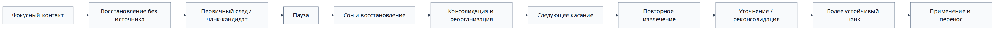{.diagram}


Эта схема важна именно как контур.

Граница схемы: она не превращает сон в лайфхак и не обещает, что восстановление само создаст знание. Без фокусного контакта, восстановления без источника и следующего касания сну нечего превращать в рабочий чанк.

Если убрать фокусный контакт, пауза превращается в ожидание вдохновения.

Если убрать восстановление без источника, человек может укреплять знакомость, а не знание.

Если убрать сон и восстановление, система хуже удерживает внимание, хуже регулирует состояние и хуже перерабатывает следы.

Если убрать следующее касание, консолидация остается без проверки: мы не знаем, что действительно стало доступным.

Если убрать применение, знание может остаться возвращаемым, но не рабочим.

Поэтому правильный вопрос не "что важнее: сон или повторение?". Правильный вопрос:

```text
как построить цикл,
в котором фокус, пауза, сон, восстановление без источника и применение поддерживают друг друга?
```

## Пауза — не пустота

В учебе есть соблазн считать продуктивным только тот момент, когда человек сидит над материалом.

Он читает — значит учится.

Решает — значит учится.

Пишет конспект — значит учится.

Отошел от материала — значит перестал учиться.

Это слишком узкий взгляд.

Пауза может быть рабочей частью обучения, если перед ней был фокусный контакт, а после нее есть точка возврата. В паузе материал перестает держаться только свежей оболочкой источника. Часть деталей уходит, часть связей остается, часть противоречий всплывает позже. Следующее обращение к материалу становится не продолжением чтения, а проверкой: что система действительно может вернуть?

Пауза нужна не потому, что мозг "отдыхает от мышления" в буквальном смысле. Мозг не выключается. Пауза нужна потому, что непрерывный поток нового материала часто мешает предыдущему материалу стать отдельной возвращаемой единицей.

В локальной заметке о рефлексии информации это сформулировано хорошо: после первого контакта начинается внутренняя доработка значимого, но еще невстроенного фрагмента. Новое сопоставляется с известным, снимает противоречия, ищет грубый прогноз применения.

Можно сказать так:

```text
во время фокусного контакта материал входит в систему;
между контактами он получает шанс стать частью системы
```

Но пауза бывает разной.

| Признак | Восстановительная пауза | Избегание |
| --- | --- | --- |
| Перед паузой | Был фокусный контакт или честная фиксация состояния. | Задача не получила входа или была оборвана на угрозе. |
| Точка возврата | Есть вопрос, следующий шаг, карточка, место разрыва или критерий входа. | Возврат не определен. |
| Внутренний эффект | Задача становится чуть доступнее или яснее. | Задача становится туманнее, страшнее или дороже. |
| После паузы | Можно проверить, что осталось, через восстановление без источника или действие. | Нужно заново преодолевать вход. |
| Роль в системе | Возвращает внимание и управляемость. | Снимает неприятное чувство сейчас, но ухудшает следующий вход. |

Внешне оба состояния похожи: человек не работает над задачей.

Системно они противоположны.

Восстановительная пауза поддерживает следующий контакт. Избегание крадет следующий контакт.

## Сон не выключает мозг

Сон часто описывают слишком просто.

Один вариант: сон — это пассивный отдых, время, когда мозг "ничего не делает".

Другой вариант: сон — магическая мастерская, которая сама решает задачи, записывает знания и очищает голову.

Оба варианта мешают.

Сон — активное состояние организма и мозга. Он связан с восстановлением, регуляцией, метаболическими процессами, эмоциями, вниманием и памятью. Но это не одна функция и не одна кнопка.

Для этой главы важны три слоя.

Первый слой — состояние системы.

Если человек систематически недосыпает, у него хуже работает устойчивое внимание, растет вариативность реакции, страдает рабочая память, сложнее тормозить импульсы, хуже регулируются эмоции и риск. Это не морализаторство, а проблема состояния: система входит в задачу в другом режиме.

Второй слой — память.

Сон участвует в консолидации: стабилизации, реорганизации и интеграции следов памяти. Не все виды памяти зависят от сна одинаково, не любое обучение одинаково выигрывает от одной ночи, и нельзя обещать простую формулу "прочитал перед сном — гарантированно запомнил". Но сон является важной частью того, как недавний опыт становится более устойчивым.

Третий слой — отбор и перенастройка.

Память — это не просто склад, куда мозг складывает все подряд. После дня активности система должна не только укреплять, но и перенастраивать связи: что сохранить, что ослабить, как интегрировать новое с уже имеющимся, как не оставить сеть в состоянии бесконечного усиления всего подряд. Поэтому современные модели сна говорят не только об укреплении следов, но и о реорганизации, интеграции и гомеостазе.

Практический вывод дает различение:

```text
сон не заменяет учебную работу,
но без сна учебная работа хуже становится устойчивым знанием
```

## Что такое консолидация

Консолидация памяти — это процесс, в котором первичный след становится более стабильным и связанным с долговременной памятью.

В учебном языке можно сказать так:

```text
консолидация = стабилизация + реорганизация + интеграция
```

Стабилизация означает, что след становится менее хрупким. Он уже не полностью зависит от свежего контекста.

Реорганизация означает, что память не хранится как фотография первого контакта. Связи меняются. Что-то становится центральным, что-то уходит на периферию, что-то связывается с прежними знаниями.

Интеграция означает, что новое знание начинает жить рядом с уже существующими схемами, примерами, понятиями и действиями.

В нейробиологическом слое часто говорят о гиппокампе и коре. Для учебника достаточно осторожной модели.

Гиппокамп важен для связывания новых эпизодов и отношений: что с чем встретилось, в каком контексте, в каком порядке, с каким значением. Кора хранит более распределенные, постепенно стабилизирующиеся знания и навыковые структуры. В системной консолидации сон связывают с повторной реактивацией следов и постепенным изменением роли гиппокампально-кортикальных связей.

Но это не значит, что за одну ночь знание "переписывается из гиппокампа в кору" как файл с диска на диск. Это популярная, но грубая картинка. Процесс зависит от типа материала, значимости, повторений, связи с прежними знаниями, эмоционального состояния, практики и времени. Некоторые изменения могут происходить быстро, другие продолжаются долго.

Для когнитивного инженерства важнее практическая форма:

```text
после первого контакта знанию нужно время,
повторные обращения
и условия восстановления,
чтобы стать менее зависимым от исходной оболочки
```

## Реактивация: память поднимается снова

Реактивация — это повторное поднятие следа памяти.

Она может происходить во сне, когда недавние следы повторно активируются в связке с ритмами сна. Она может происходить и во время бодрствования, когда человек возвращается к материалу через восстановление без источника, задачу, карточку, разговор или применение.

Для учебника важно не превращать реактивацию в мистику. Это не "мозг сам повторяет уроки" в удобном для нас формате. Это скорее общий принцип:

```text
след, который снова активируется,
получает шанс быть укрепленным, измененным и связанным
```

Отсюда следует практический вывод.

Если после первого контакта нет следующего касания, мы не используем этот шанс. Человек может надеяться, что "оно как-то само уляжется", но без повторного обращения трудно понять, что именно улеглось, что распалось, а что исказилось.

Следующее касание должно быть активным.

Не обязательно длинным. Иногда достаточно пяти минут:

```text
закрыть источник,
восстановить главную мысль,
заметить разрыв,
поправить одну связь,
оставить новый вопрос
```

Но это должно быть касание к памяти, а не только к странице.

## Реконсолидация: память не просто достается, а меняется

Когда человек возвращается к знанию, он не достает его как неизменный файл.

Память может становиться более устойчивой, но может и меняться. Повторное обращение к следу открывает возможность уточнения, перестройки и иногда искажения. Поэтому в локальной заметке справедливо отмечено: при повторном обращении воспоминания укрепляются и изменяются.

В учебе это видно постоянно.

Человек прочитал идею и понял ее грубо.

На следующий день пересказал своими словами и заметил, что перепутал причину и следствие.

После примера переписал формулировку.

После задачи понял границу применимости.

После разговора с другим человеком увидел, где его объяснение слишком широко.

Это и есть нормальная учебная переработка:

```text
первый след -> повторное извлечение -> ошибка -> уточнение -> новый след
```

Но есть и обратная сторона.

Если человек повторяет неверную формулировку, пересказывает слишком уверенное упрощение или строит карточку на ошибочном различении, он тоже может закреплять след. Повторение само по себе не гарантирует качество. Оно усиливает то, что поднимается.

Поэтому внешние записи важны не только как память.

Рабочий журнал, карточка смысла, синопсис и заметка помогают сравнить:

```text
что я думал вчера?
что я восстановил сегодня?
что изменилось?
это уточнение или искажение?
какой источник или пример проверяет границу?
```

Так внешний контур мышления из глав 4-6 возвращается в тему обучения. Он нужен не только для задач разработчика. Он нужен для аккуратной реконсолидации собственных знаний.

## Недосып как проблема состояния

Самая грубая ошибка — считать сон просто временем, которое можно обменять на дополнительные часы учебы или работы.

Иногда такой обмен выглядит выгодным.

Сегодня дедлайн. Сегодня экзамен. Сегодня нужно дописать главу, закрыть задачу, закончить разбор. Человек забирает у сна два часа и получает два часа бодрствования.

В бухгалтерии календаря это плюс.

В когнитивной системе это не обязательно плюс.

Недосып меняет качество состояния, в котором потом нужно думать, учиться, регулировать эмоции и принимать решения.

| Функция | Как может страдать при недосыпе | Почему это важно для учебника |
| --- | --- | --- |
| Устойчивое внимание | Сложнее держать задачу, больше провалов и микросбоев. | Восстановление без источника и работа с разрывами требуют удержания. |
| Рабочая память | Труднее держать несколько элементов и связи между ними. | Чанки собираются хуже, если элементы рассыпаются. |
| Торможение | Сложнее не уходить в быстрые отвлечения и импульсы. | Прокрастинация и переключения становятся доступнее. |
| Когнитивная гибкость | Труднее менять стратегию, если текущий ход не работает. | Разрыв чинится хуже, человек застревает или бросает. |
| Эмоциональная регуляция | Ошибка легче переживается как угроза. | Полезная трудность быстрее становится перегрузом. |
| Оценка риска и награды | Сдвигается баланс импульсивности, срочности и осторожности. | Человек хуже выбирает между отдыхом, продолжением и остановкой. |

Важно: данные по разным исполнительным функциям высокого уровня неоднородны. Не нужно писать, что недосып одинаково разрушает все когнитивные функции у всех людей в любой ситуации. Надежнее говорить так:

```text
недосып повышает цену сложного управления состоянием,
особенно там, где нужны внимание, рабочая память,
эмоциональная регуляция и устойчивое возвращение к задаче
```

Есть важное уточнение по силе этого вывода.

Короткое ограничение сна на одну ночь надежнее всего видно в росте сонливости и ухудшении sustained attention: больше провалов внимания, больше задержек реакции, ниже стабильность удержания. Это уже достаточно серьезно для учебы, вождения, сложной работы и задач, где нельзя терять нить.

Более широкие выводы про рабочую память, торможение и когнитивную гибкость лучше опирать не на одну плохую ночь, а на более общий корпус исследований недосыпа, где вместе рассматриваются полное лишение сна, частичное ограничение сна, разные задачи и разные метрики. Там картина тяжелее, но и сложнее: где-то страдает скорость, где-то точность, где-то появляется компромисс между скоростью и аккуратностью.

Поэтому точная формула такая:

```text
сон поддерживает не одну абстрактную "энергию",
а несколько компонентов режима:
бдительность, устойчивое внимание, рабочую память,
торможение, гибкость и эмоциональную регуляцию,
причем разные компоненты проседают по-разному
```

Для когнитивного инженерства это меняет язык.

Фраза "я не могу собраться" не всегда означает недостаток мотивации.

Иногда это:

```text
система пытается выполнить сложное действие
в состоянии, где внимание, контроль и восстановление уже просели
```

В таком состоянии добавлять еще больше давления часто бессмысленно. Нужно либо снизить сложность входа, либо уменьшить объем параллельной работы, либо вернуть базовое состояние, либо честно перенести сложную часть после восстановления.

## Циркадность: состояние зависит не только от количества сна

Есть еще один слой, который легко потерять, если говорить только "выспался / не выспался".

Когнитивная эффективность зависит не только от количества сна, но и от времени бодрствования, накопленного дефицита сна, внутреннего биологического времени и типа задачи. У организма есть циркадная организация: примерно суточные ритмы, которые помогают согласовывать сон, бодрствование, бдительность, температуру тела, гормональные и нейронные процессы с циклом дня и ночи.

Это не значит, что учебник должен учить читателя вычислять идеальное расписание по хронотипу. Такая версия быстро превращается в хрупкий лайфхак.

Для когнитивного инженерства важнее другое:

```text
одна и та же задача может иметь разную цену
в разное время суток и при разном накопленном дефиците сна
```

Если человек пытается выполнять работу, требующую торможения, переключения правил, точного восстановления без источника или удержания сложной схемы, в момент, когда система уже живет в неподходящей фазе и с накопленным недосыпом, задача становится не просто "неприятнее". Она становится дороже как когнитивное действие.

Отсюда практический вывод:

| Если состояние ниже ожидаемого | Что проверить |
| --- | --- |
| Задача внезапно стала туманной | Это сложность задачи или неподходящее состояние? |
| Восстановление без источника не получается | Материал не закрепился или сейчас плохое окно внимания? |
| Ошибки стали грубее | Не пора ли перейти с творческого решения на подготовку, проверку или контрольную точку? |
| Вечером хочется "дожать" | Не покупается ли текущий прогресс завтрашним падением входа? |
| Утром нет доступа к сложной части | Нужно ли сначала восстановить режим, а не добавлять давление? |

Циркадность в этой книге нужна не как культ режима дня, а как защита от неправильной интерпретации:

```text
иногда проблема не в слабой воле,
а в том, что сложное действие запланировано
в плохом биологическом и когнитивном окне
```

## Рассеянный режим: после фокуса, а не вместо него

В локальных учебных заметках есть различение фокусного и рассеянного режимов.

Фокусный режим нужен, чтобы удержать понятие, разобрать пример, выполнить задачу, восстановить мысль без источника, найти разрыв.

Рассеянный режим нужен, чтобы связи могли доработаться без прямого удержания каждого элемента. Во время прогулки, душа, легкой бытовой активности, отдыха или сна мысль иногда продолжает собираться. Появляется новый пример, более простая формулировка, неожиданный мост к другой теме.

Но здесь легко попасть в красивую ошибку.

Ошибка:

```text
если рассеянный режим полезен,
можно не входить в фокус
```

Нет.

Если не было фокусного контакта, рассеянному режиму нечего перерабатывать как учебный материал. Он может породить ассоциации, но не обязан собрать знание, с которым система не работала.

Более точная формула:

```text
фокусный режим дает материал;
рассеянный режим дает шанс связям дозреть;
следующее касание проверяет, что действительно дозрело
```

Поэтому учебную паузу лучше начинать не с бегства от задачи, а с маленького контакта.

Даже если сил мало, можно сделать минимальный вход:

```text
что я пытаюсь понять?
какой один фрагмент беру?
что уже ясно?
где рвется объяснение?
с каким вопросом я ухожу на паузу?
```

После такой фиксации пауза получает материал и точку возврата.

## Интервалы: знанию нужно немного уйти, чтобы его можно было вернуть

Интервальное повторение часто объясняют через кривую забывания: если возвращаться к материалу с интервалами, он лучше удерживается.

Это полезная картинка, но ее нужно понимать не механически.

Смысл интервала не в том, чтобы просто подождать указанное число часов. Смысл в том, что между касаниями знание перестает держаться только свежим следом. Часть знакомости уходит. При следующем обращении приходится действительно извлекать.

Именно это делает повторение учебной работой.

```text
массовое повторение часто продлевает знакомость;
интервальное извлечение проверяет возвращаемость
```

Но интервалы не являются универсальной таблицей, которую можно применить ко всему.

Оптимальный интервал зависит от:

- типа материала;
- глубины первичного понимания;
- желаемого срока удержания;
- сложности восстановления без источника;
- наличия применения;
- того, насколько знание уже связано с прежними чанками;
- риска забыть слишком много и потерять возможность ремонта.

Поэтому осторожная практическая формула такая:

```text
чем дальше срок нужного удержания,
тем важнее разносить касания;
чем слабее первичный чанк,
тем раньше нужен первый возврат
```

В учебнике это удобно связать с локальной "теорией трех касаний". Число три здесь не закон памяти, а минимальный рабочий протокол против иллюзии одного знакомства.

Первое касание дает карту темы.

Второе касание проверяет восстановление без источника и чинит разрыв.

Третье касание применяет, связывает или собирает синопсис.

Поздние касания удерживают, перемежают и переносят.


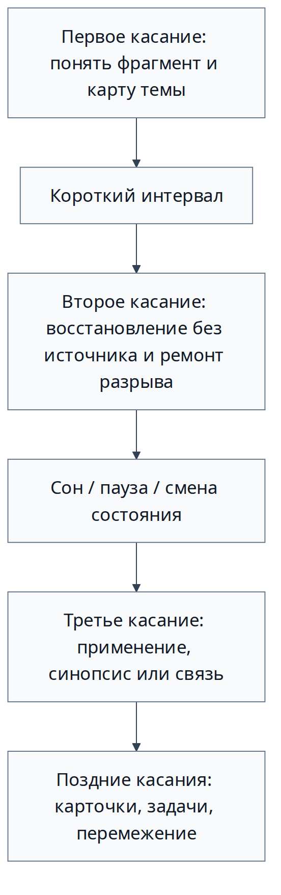{.diagram}


Эта схема не делает число три законом памяти. Она показывает минимальный анти-иллюзорный маршрут: первый контакт, проверка возвращаемости и применение или связь.

Главное: новое касание — это не обязательно еще одно чтение.

| Формат касания | Что проверяет |
| --- | --- |
| Восстановление без источника | Возвращается ли главная мысль? |
| Карточка смысла | Держится ли различение, связь или применение? |
| Синопсис | Собрался ли крупный маршрут темы? |
| Практическая задача | Работает ли знание в действии? |
| Связь с другой заметкой | Видно ли место знания в графе? |
| Объяснение другому человеку | Выдерживает ли мысль смену формулировки? |
| Перемежение примеров | Можно ли выбрать нужный чанк среди похожих? |

Если человек трижды перечитал один и тот же абзац тем же усталым взглядом, это не три касания. Это один контакт, растянутый во времени.

## Двигательная пауза и прогулка

Физическая активность и прогулки в учебном контуре нужно описывать аккуратно.

Плохая версия:

```text
прогулка прокачивает мозг и автоматически улучшает обучение
```

Так писать нельзя.

Более точная версия:

```text
движение может менять состояние системы,
поддерживать настроение, внимание и восстановление,
а прогулка иногда помогает генерации идей,
но не заменяет фокус, восстановление без источника и практику
```

Есть данные, что физическая активность связана с когнитивным здоровьем, а короткая активность может влиять на настроение, внимание и некоторые когнитивные показатели. Есть экспериментальные данные, что ходьба может поддерживать творческую генерацию идей. Но это не означает, что любая прогулка улучшает любую задачу.

В когнитивном инженерстве двигательная пауза полезна как переключение режима.

Например:

- внимание просело, но задача еще важна;
- человек крутится в одном и том же объяснении;
- рабочая память забита деталями;
- ошибка начинает ощущаться как угроза;
- нужно оставить материалу короткий интервал;
- тело уже устало от неподвижности.

Тогда короткое движение может снизить внутренний шум и вернуть доступность следующего входа.

Но у паузы должен быть якорь:

```text
с каким вопросом я ухожу?
куда я вернусь?
что проверю после паузы?
```

Без якоря прогулка легко становится красивой формой избегания. Человек возвращается не к вопросу, а к еще более туманной задаче.

## Учебный вечер и учебное утро

Теперь соберем практический пример.

Человек вечером изучает различие из главы 16:

```text
знакомость не равна пониманию
```

Плохой ход:

```text
прочитать главу,
почувствовать понятность,
сразу открыть следующую,
потом еще одну,
лечь поздно,
утром помнить, что "вчера было продуктивно"
```

Почему это плохо?

Не потому, что нельзя вечером читать несколько глав. Иногда можно.

Проблема в другом: человек не оставил первому фрагменту точку возврата. Он получил ощущение продвижения, но не проверил, что станет доступным завтра без источника.

Рабочий ход:

1. Вечером прочитать небольшой фрагмент.
2. Закрыть источник.
3. Восстановить главную мысль своими словами.
4. Записать вопрос на завтра:

```text
чем понимание отличается от знакомости,
если источник уже закрыт?
```

5. Отметить ожидаемый разрыв:

```text
я могу перепутать легкость чтения с умением применить
```

6. Остановиться, а не добивать себя дополнительным потоком.
7. После сна утром ответить без источника.
8. Если ответ держится, применить к своей учебной или рабочей ситуации.
9. Если ответ рвется, починить точный разрыв.

Тогда сон и пауза оказываются встроены в учебный цикл. Они не "отняли время" у учебы. Они создали условие, в котором утреннее восстановление без источника стало настоящей проверкой.

## Пример из разработки: задача, которая не решилась вечером

Возьмем не учебную, а инженерную ситуацию.

Разработчик вечером разбирает сложный баг. Он прочитал логи, посмотрел код, выдвинул две гипотезы, одну отбросил, вторую не успел проверить. В голове остается напряженное чувство: "еще чуть-чуть, и я дожму".

Можно продолжить до ночи.

Иногда это оправдано. Но часто после определенного порога человек перестает думать лучше. Он просто дольше смотрит на те же куски, чаще ошибается, хуже держит контекст и хуже замечает альтернативы.

Когнитивно-инженерный выход:

```text
не бросить задачу,
а правильно остановить ее
```

Перед сном он записывает:

```text
Цель: понять, почему обработчик получает пустой payload.
Факты: в логах событие приходит; после transform поле payload пустое; ошибка не воспроизводится на старом fixture.
Проверено: гипотеза про consumer offset не подтвердилась.
Осталось проверить: transform v2 на новом schema variant.
Следующий вход: открыть тест TransformPayloadV2, добавить fixture с missing optional field.
Вопрос на утро: где payload теряется — до transform, внутри transform или после сериализации?
```

Такая контрольная точка делает две вещи.

Во-первых, она разгружает рабочую память. Не нужно держать весь вечерний контекст в голове.

Во-вторых, она дает паузе и сну материал. Утром человек не начинает с пустого тревожного поля "там была какая-то сложная проблема". Он возвращается к точке продолжения.

Иногда утром решение действительно всплывает. Но не потому, что сон магически написал код. Скорее потому, что вечерний фокусный контакт создал след, внешняя контрольная точка удержала контекст, а восстановление вернуло систему в состояние, где можно снова увидеть структуру.

## Как проектировать учебный цикл с учетом сна

Теперь можно дать практический протокол.

### 1. Не заканчивать учебный блок на потоке

Плохое завершение:

```text
я устал, просто закрываю все
```

Или:

```text
я прочитал много, надеюсь, что что-то осталось
```

Лучшее завершение:

```text
что именно я беру с собой в следующий контакт?
```

Перед остановкой нужно оставить короткий след:

- главный тезис;
- вопрос для восстановления без источника;
- место разрыва;
- следующий формат касания;
- пример, на котором проверить;
- связь с предыдущей главой или задачей.

### 2. Делать вечернее восстановление маленьким

Вечером не нужно устраивать экзамен всему материалу.

Достаточно одного честного восстановления:

```text
какая одна мысль сегодня должна вернуться завтра?
```

Если таких мыслей десять, вероятно, блок был слишком большим.

### 3. Утром проверять не настроение, а возвращаемость

Утренний вопрос:

```text
что я могу восстановить без источника?
```

Не "помню ли я, что учился". Не "кажется ли тема знакомой". А именно: что возвращается как мысль, различение, пример или действие?

### 4. Разделять ремонт и новое потребление

Если утром мысль не вернулась, не нужно сразу читать дальше.

Сначала нужно понять:

- термин не держится?
- связь не держится?
- пример вытеснил принцип?
- вопрос был слишком широкий?
- вчера не было настоящего восстановления без источника?
- состояние сейчас слишком плохое для сложного входа?

Только после ремонта имеет смысл добавлять новый материал.

### 5. Планировать разные касания

Для одного и того же знания полезны разные формы возврата:

| Касание | Формат |
| --- | --- |
| Первое | Понять фрагмент и сделать короткое восстановление без источника. |
| Второе | Починить разрыв и сделать карточку смысла. |
| Третье | Применить к задаче или написать синопсис. |
| Позднее | Вернуть через интервал, перемешать с похожими случаями, проверить перенос. |

### 6. Ставить паузу там, где она помогает следующему действию

Пауза полезна не по факту отсутствия работы.

Пауза полезна, если после нее:

- легче войти;
- яснее следующий шаг;
- ниже угроза;
- виднее разрыв;
- возвращается способность удержать задачу;
- есть энергия на точную проверку.

Если после паузы задача только распухла и стала страшнее, это была не восстановительная пауза или она была плохо спроектирована.

## Где проходит граница между восстановлением и прокрастинацией

Эта глава специально стоит перед главой о прокрастинации.

Потому что внешне восстановление и прокрастинация иногда выглядят одинаково:

```text
человек не делает задачу
```

Но внутри системы это разные процессы.

Восстановление возвращает доступ к действию.

Прокрастинация часто дает краткое облегчение и ухудшает следующий вход.

| Вопрос | Восстановление | Прокрастинация |
| --- | --- | --- |
| Был ли контакт с задачей? | Да, хотя бы минимальный. | Часто нет или контакт оборвался на угрозе. |
| Есть ли точка возврата? | Да. | Нет или она расплывчата. |
| Что происходит с угрозой? | Она снижается через ясность и состояние. | Она временно глушится, но часто растет. |
| Что происходит с контекстом? | Он сохраняется или упрощается. | Он распадается. |
| Что происходит с управляемостью? | Она возвращается. | Она падает. |
| Что покажет следующий вход? | Задача чуть доступнее. | Задача дальше, дороже и мутнее. |

Эта развилка подводит к прокрастинации.

Прокрастинация часто маскируется под отдых:

```text
мне нужно восстановиться
```

Иногда это правда.

Но когнитивное инженерство спрашивает точнее:

```text
что именно должно восстановиться?
какой следующий шаг станет доступнее?
где точка возврата?
какой минимальный контакт с задачей уже был?
```

Если ответов нет, возможно, это не восстановление, а избегание неприятного состояния.

## Что делать, если сна мало прямо сейчас

Эта глава не медицинская инструкция и не руководство по лечению бессонницы. Но в реальной жизни идеального сна часто нет.

Поэтому нужен не только принцип "сон важен", но и рабочее поведение в плохом состоянии.

Если сна мало, не стоит требовать от себя такого же сложного когнитивного режима, как после нормального восстановления. Это не капитуляция, а трезвая настройка задачи под состояние.

Возможные ходы:

| Состояние | Плохой ход | Рабочий ход |
| --- | --- | --- |
| Мало сна, сложная новая тема | Давить на себя и читать большой блок. | Сузить фрагмент, сделать одно восстановление без источника, не расширять параллельную работу. |
| Мало сна, много ошибок | Считать ошибки доказательством неспособности. | Снизить сложность, перейти к проверкам, спискам, подготовке среды. |
| Мало сна, высокая угроза | Пытаться "мотивировать себя" страхом. | Уменьшить цену входа и вернуть управляемость. |
| Мало сна, нужно продолжать работу | Начать самую туманную часть. | Сделать механическую подготовку, собрать контекст, записать гипотезы. |
| Мало сна, мысль не держится | Перечитывать все подряд. | Остановиться на одном разрыве и оставить точку возврата. |

Иногда лучший когнитивный ход — не продолжать сложную часть, а подготовить следующий нормальный вход.

Например:

```text
не писать сейчас сложный раздел,
а собрать источники, выписать вопросы,
нарисовать схему,
оставить план первого абзаца
```

Это не "меньше работать". Это работать с учетом состояния системы.

## Почему нельзя писать эту главу как набор лайфхаков сна

У этой темы есть опасный жанр: список советов.

Ложиться вовремя.

Не смотреть экран.

Гулять.

Повторять с интервалами.

Делать перерывы.

Все это может быть полезно, но в учебнике такой список не решает главную задачу. Он не объясняет механизм.

Нам нужно другое:

```text
показать место сна и восстановления
в системе внимания, памяти, восстановления без источника, консолидации,
состояния и возвращения к действию
```

Поэтому практические выводы главы не являются универсальным режимом дня. Они являются инженерными принципами:

1. Не планировать обучение как непрерывное потребление.
2. После первого контакта оставлять вопрос для следующего восстановления без источника.
3. Делать паузы с точкой возврата.
4. Использовать сон как часть цикла закрепления, а не как остаток после всех дел.
5. После сна проверять возвращаемость, а не узнавание.
6. Разносить касания во времени и менять формат касания.
7. При недосыпе снижать сложность входа и объем параллельной работы.
8. Отличать восстановление от избегания по следующему входу в задачу.

## Короткое резюме

1. Первое хорошее восстановление без источника создает кандидата в чанк, но не завершает обучение.
2. Первичный след знания нуждается в стабилизации, реорганизации, повторном извлечении и применении.
3. Пауза может быть частью учебного цикла, если перед ней был фокусный контакт, а после нее есть точка возврата.
4. Сон — активное состояние, связанное с восстановлением, регуляцией и памятью, а не выключение мозга.
5. Консолидация — это стабилизация, реорганизация и интеграция следов, а не мгновенная запись знания.
6. Реактивация поднимает след снова и может поддерживать его укрепление и связывание.
7. Реконсолидация означает, что память при повторном обращении может уточняться и искажаться.
8. Недосып — проблема состояния: внимание, рабочая память, контроль и эмоциональная регуляция становятся дороже.
9. Циркадность и накопленный дефицит сна меняют цену сложной когнитивной работы, поэтому плохое окно состояния нельзя автоматически трактовать как слабую волю.
10. Рассеянный режим помогает после фокусного контакта, но не заменяет его.
11. Интервалы полезны потому, что делают следующее касание настоящим извлечением.
12. Три касания — рабочий минимум против иллюзии одного знакомства, а не закон памяти.
13. Двигательная пауза и прогулка полезны как смена состояния, если есть вопрос возврата.
14. Восстановление отличается от прокрастинации тем, что улучшает следующий вход в задачу.
15. При плохом состоянии нужно не героически давить сложность, а проектировать более узкий и управляемый вход.

## Вопросы для самопроверки

1. Почему хорошее восстановление без источника сразу после чтения еще не означает устойчивое знание?
2. Чем первичный след отличается от долговременного рабочего чанка?
3. Какие условия делают паузу частью обучения, а не избеганием?
4. Почему сон нельзя описывать только как пассивный отдых?
5. Что входит в понятие консолидации памяти?
6. Чем реактивация отличается от реконсолидации?
7. Почему повторное обращение к памяти может не только укреплять, но и менять след?
8. Какие когнитивные функции особенно важны при обсуждении недосыпа?
9. Почему циркадность нельзя сводить к простому совету "работай утром" или "работай вечером"?
10. Почему рассеянный режим не заменяет фокусный контакт?
11. Почему интервальное повторение работает лучше, когда оно является извлечением, а не перечитыванием?
12. Почему не существует одного универсального расписания интервалов для всех знаний?
13. Как отличить восстановительную прогулку от прогулки-избегания?
14. Что нужно оставить перед сном, чтобы утром был хороший вход в тему?
15. Как недосып меняет инженерный выбор следующего шага?

## Мини-практика

Выберите один фрагмент из любой предыдущей главы и проведите его через восстановительный учебный цикл.

| Шаг | Ответ |
| --- | --- |
| Какой фрагмент я беру? |  |
| Что я могу восстановить без источника сейчас? |  |
| Где мысль рвется? |  |
| Какой вопрос я оставляю на следующее касание? |  |
| Какой формат следующего касания нужен: восстановление без источника, карточка, синопсис, задача, связь с другой заметкой? |  |
| Когда я вернусь к этому фрагменту? |  |
| Что будет признаком, что пауза помогла? |  |
| Что будет признаком, что пауза стала избеганием? |  |
| Что я проверю после сна или более длинного интервала? |  |
| Какой один разрыв я починю перед тем, как читать дальше? |  |

Цель мини-практики — не построить идеальное расписание повторений. Цель — увидеть, как знание переживает время: что возвращается само, что требует ремонта, что стало более простым, а что оказалось только знакомой оболочкой.

---

# Глава 18. Прокрастинация как конфликт систем

## После сна и восстановления

Предыдущая глава провела границу между восстановлением и избеганием.

Внешне они могут быть похожи:

```text
человек не сидит над задачей
```

Но системно это разные процессы.

Восстановление улучшает следующий вход. После него у человека больше внимания, ясности, терпимости к трудному месту, доступа к рабочей памяти и готовности снова встретиться с задачей.

Прокрастинация часто делает обратное. Она снижает неприятное состояние сейчас, но следующий вход становится дороже: меньше времени, больше тумана, выше ставка, сильнее стыд, хуже контекст, крепче привычка уходить.

Поэтому разговор о прокрастинации нельзя строить как список приемов против лени.

Нам нужна более точная задача:

```text
понять, почему система выбирает отсрочку,
если задача действительно важна
```

Прокрастинация интересна именно этим. Человек часто откладывает не случайные мелочи, а важные, смысловые и потенциально полезные дела: учебу, тяжелый разговор, письмо, медицинскую запись, сложный баг, раздел книги, финансовый разбор, решение по проекту.

Если задача важная, простая бытовая модель ломается.

```text
важно -> значит должен хотеть -> значит должен делать
```

В реальности бывает иначе:

```text
важно -> высока ставка -> дороже вход -> сильнее угроза -> легче уйти
```

Прокрастинация - это не отсутствие мотивации вообще. Часто это конфликт мотивационных, когнитивных, телесных и средовых систем.

## Что такое прокрастинация

Не всякое откладывание является прокрастинацией.

Иногда откладывание разумно.

Не хватает данных.

Нужно дождаться ответа.

Система устала и действительно требует восстановления.

Задача перестала быть актуальной.

Приоритет изменился.

Контекст еще не созрел.

Есть более важная работа.

Если каждую задержку называть прокрастинацией, понятие становится бесполезным и начинает служить только самоупреку.

Здесь используется рабочее определение:

```text
прокрастинация - это отсрочка важного или ожидаемо нужного действия,
при которой человек получает краткое облегчение сейчас,
но повышает будущую цену входа, результата или состояния
```

Это определение держит три признака.

Первый признак - действие важно или ожидаемо нужно. Не обязательно приятно, не обязательно вдохновляет, но имеет значение.

Второй признак - отсрочка приносит краткое облегчение. Человек уходит от неприятного состояния: тревоги, тумана, скуки, риска ошибки, неопределенности, перегруза, стыда, бессилия.

Третий признак - будущая цена растет. Задача не становится яснее, доступнее или безопаснее. Она становится тяжелее.

Именно третий признак отличает прокрастинацию от восстановительной паузы.

## Центральный цикл

Соберем основную схему.

Вопрос схемы:

```text
как важная задача превращается не в действие,
а в краткое облегчение, которое делает следующий вход дороже?
```


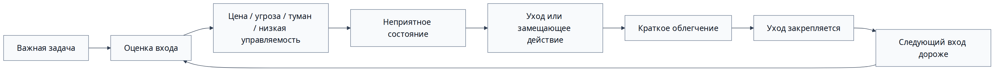{.diagram}


В этой схеме важно каждое звено.

Граница схемы: она не говорит, что человек ленив или безволен. Она показывает петлю обучения, где уход подкрепляется облегчением, а задача возвращается с большей ценой входа.

Прокрастинация начинается не с пустоты. Обычно перед ней есть задача, цель, ожидание или обязательство.

Затем система оценивает вход:

- насколько понятно, с чего начать;
- сколько усилия потребуется;
- что будет, если я ошибусь;
- смогу ли я повлиять на исход;
- какой результат виден близко;
- в каком состоянии я сейчас;
- есть ли рядом более легкое действие.

Если оценка входа неблагоприятная, появляется неприятное состояние. Это может быть явная тревога, но часто оно выглядит мягче:

- мутность;
- сопротивление;
- тяжесть;
- сонливость;
- раздражение;
- скука;
- внезапная "необходимость" заняться чем-то другим;
- желание еще чуть-чуть подготовиться;
- ощущение, что сейчас не тот момент.

Затем появляется уход или замещающее действие.

Уход не всегда выглядит как безделье. Человек может быть очень занят:

- отвечает на сообщения;
- проверяет почту;
- наводит порядок;
- обновляет инструменты;
- читает еще один источник;
- шлифует план;
- делает легкие задачи;
- открывает несколько вкладок;
- ищет "идеальный" способ начать.

Ключевой вопрос не в том, занято ли тело.

Ключевой вопрос:

```text
это действие приближает меня к проверяемому контакту с главной задачей
или уводит от неприятного места?
```

Если уводит, возникает краткое облегчение.

Именно облегчение делает прокрастинацию устойчивой. Система получает быстрый опыт:

```text
я ушел - стало легче
```

Даже если рационально человек понимает, что потом будет хуже, ближайшее облегчение уже сработало как подкрепление.

## Почему человек откладывает важное

Самое неприятное в прокрастинации - она часто нападает на то, что человеку не безразлично.

Если дело совсем не нужно, его можно спокойно отменить.

Если задача не имеет ценности, ее можно пересмотреть.

Но прокрастинация часто появляется там, где есть ценность и угроза одновременно.

Например:

| Задача | Ценность | Угроза |
| --- | --- | --- |
| Написать главу | Сделать важный проект реальным. | Увидеть, что мысль слабее, чем казалась. |
| Разобрать сложный баг | Вернуть управляемость системе. | Обнаружить, что гипотеза неверна. |
| Начать обучение | Получить новую компетентность. | Столкнуться с собственной неумелостью. |
| Поговорить с человеком | Восстановить контакт. | Получить отказ, конфликт или стыд. |
| Проверить финансы | Вернуть ясность. | Увидеть неприятную правду. |
| Пойти к врачу | Позаботиться о здоровье. | Услышать диагноз или необходимость изменений. |

Чем важнее область, тем больше может быть ставка. Чем больше ставка, тем сильнее не только притяжение, но и защита.

Поэтому фраза "если бы тебе было важно, ты бы сделал" часто неверна.

Точнее так:

```text
если тебе важно,
задача может стать настолько значимой,
что вход начнет восприниматься как угроза
```

Прокрастинация в таком случае не означает "мне все равно". Иногда она означает "мне слишком не все равно, и я не вижу безопасного входа".

## Краткосрочная регуляция состояния

Одна из сильных идей современной литературы о прокрастинации: человек часто откладывает задачу не ради удовольствия как такового, а ради быстрого изменения состояния.

Не начать неприятную задачу - значит прямо сейчас не чувствовать ее цену.

Не открыть письмо - значит прямо сейчас не встретиться с возможной оценкой.

Не писать черновик - значит прямо сейчас не увидеть слабость формулировки.

Не проверять гипотезу - значит прямо сейчас сохранить ощущение, что она может быть верной.

Не идти в сложную задачу - значит прямо сейчас остаться в зоне легкой управляемости.

Прокрастинация продает не отдых.

Она продает облегчение.

Это важное различение.

Отдых возвращает ресурс.

Облегчение снижает напряжение.

Иногда они совпадают. Но в прокрастинации часто происходит другое: напряжение снижается потому, что человек отодвинул встречу с задачей. Сама задача не стала проще. Контекст не стал яснее. Риск не обработан. Следующий вход не подготовлен.

Сравним:

| Ситуация | Что происходит сейчас | Что будет со следующим входом |
| --- | --- | --- |
| Восстановительная пауза | Я устал, фиксирую место остановки и восстанавливаю состояние. | Вход станет доступнее. |
| Стратегическая отсрочка | Не хватает данных, фиксирую критерий возврата. | Вход станет яснее после события. |
| Прокрастинация | Мне неприятно входить, я ухожу в другое. | Вход станет дороже. |

Снаружи это может выглядеть одинаково: человек не делает задачу.

Изнутри это разные контуры.

## Будущий я и временная ловушка

У прокрастинации есть временная асимметрия.

Текущий я получает облегчение.

Будущий я получает усложненную задачу.

Сегодняшний человек говорит:

```text
я начну завтра,
когда будет больше сил,
ясности и настроения
```

Но завтра он часто получает не больше сил и ясности, а более дорогой вход:

- дедлайн ближе;
- контекст слабее;
- стыда больше;
- выбора меньше;
- вероятность ошибки выше;
- задача стала еще неприятнее;
- желание уйти запускается быстрее.

Это не значит, что любой перенос плох. Иногда завтра действительно лучше сегодня.

Но у прокрастинации есть характерный след:

```text
перенос обещал облегчить задачу,
а фактически сделал ее тяжелее
```

Поэтому при диагностике полезно спрашивать не "имею ли я право отложить", а:

```text
что именно станет лучше к моменту следующего входа?
```

Если ответ конкретен - придут данные, восстановится сон, появится окно времени, будет обратная связь, снизится внешний шум - это может быть стратегическая отсрочка.

Если ответ туманный - "ну потом как-нибудь будет легче" - скорее всего, система просто покупает ближайшее облегчение.

## Цена входа

Во многих случаях человек прокрастинирует не всю задачу, а вход.

Сама работа после старта может оказаться терпимой. Но момент перед началом выглядит слишком дорогим.

В локальных заметках это названо ловушкой старта: пока задача еще не начата, она переживается как большой, тяжелый и неприятный блок.

```text
написать статью
разобраться с багом
подготовиться к собеседованию
навести порядок в финансах
поговорить с человеком
```

Каждая такая формулировка слишком велика для входа.

Она не говорит, что именно нужно сделать телом, глазами, руками и вниманием в первые минуты. Она только показывает массу будущего дела.

Мозг получает не инструкцию, а угрозу.

С инженерной точки зрения вход должен быть не правильным, а исполнимым.

Плохой вход:

```text
сесть и нормально поработать над проектом
```

Лучший вход:

```text
открыть файл,
найти место последнего изменения,
выписать одну неизвестную переменную
```

Плохой вход:

```text
написать сильную главу
```

Лучший вход:

```text
за 12 минут написать плохой первый абзац
и список вопросов, которые глава должна закрыть
```

Плохой вход:

```text
разобраться в финансах
```

Лучший вход:

```text
открыть таблицу и выписать три последних обязательных платежа
```

Малый шаг не нужен для того, чтобы обмануть себя.

Он нужен для того, чтобы заменить абстрактную угрозу конкретным контактом с реальностью задачи.

## Прокрастинация и управляемость

В главе 10 мы говорили:

```text
управляемость - это ожидаемая связь между действием и исходом
```

Если человек не видит, как его действие изменит ситуацию, усилие начинает казаться бессмысленным. Тогда прокрастинация может быть не уходом от работы как таковой, а уходом от беспомощного усилия.

Примеры:

- "Я могу написать текст, но его все равно никто не примет".
- "Я могу начать разбор, но система такая сложная, что я ничего не пойму".
- "Я могу готовиться, но на собеседовании все равно спросят то, чего я не знаю".
- "Я могу поговорить, но человек все равно не услышит".
- "Я могу заняться здоровьем, но уже слишком поздно".

В таких ситуациях совет "просто начни" попадает мимо. Проблема не только в старте. Проблема в ожидаемой бесполезности действия.

Инженерный вопрос:

```text
какой маленький рычаг реально может изменить состояние задачи?
```

Не "решить все".

Именно изменить состояние.

Для сложного бага рычагом может быть не исправление, а один проверенный факт.

Для текста - не готовая глава, а рабочая структура.

Для разговора - не идеальное примирение, а честно заданный вопрос.

Для обучения - не владение темой, а первое восстановление без источника.

Прокрастинация снижается не только тогда, когда задача становится легче, но и тогда, когда действие снова начинает казаться причинным.

## Прокрастинация и цена усилия

В главе 11 мы развели несколько видов цены усилия:

- физическую;
- когнитивную;
- социально-эмоциональную;
- идентичностную;
- восстановительную.

Прокрастинация часто начинается там, где цена входа не названа.

Человек говорит:

```text
я не могу заставить себя
```

Но внутри может быть разная цена.

| Цена | Как проявляется в прокрастинации | Что нужно менять |
| --- | --- | --- |
| Когнитивная | Слишком много переменных, задача не удерживается. | Вынести контекст наружу, ограничить первый вопрос. |
| Эмоциональная | Страшно ошибиться, получить оценку, увидеть неприятное. | Сделать черновой и обратимый вход. |
| Социальная | Нужен контакт с человеком, есть риск конфликта. | Подготовить безопасную формулировку и цель разговора. |
| Идентичностная | Результат угрожает образу себя. | Отделить проверку навыка от оценки личности. |
| Восстановительная | После действия будет провал состояния. | Снизить объем, добавить восстановление, проверить нагрузку. |
| Физическая | Не держится бодрствование, тело перегружено. | Сон, еда, движение, медицинские границы при необходимости. |

Без такой диагностики человек пытается лечить все одним приемом.

Если проблема в тумане, таймер может помочь только частично.

Если проблема в угрозе, жесткий дедлайн может усилить уход.

Если проблема в перегрузе, новый план может стать еще одной нагрузкой.

Если проблема в низкой управляемости, мотивационные фразы вызывают раздражение.

Если проблема в привычном сигнале ухода, одного понимания недостаточно: среда снова поведет по старой дороге.

## Туман как двигатель отсрочки

Туман - один из самых частых источников прокрастинации.

Туманная задача не дает системе хорошего первого шага. Она не дробится сама. Она висит как облако.

Примеры туманных формулировок:

```text
разобраться с архитектурой
подготовить стратегию
улучшить здоровье
заняться английским
сделать нормальный режим
написать учебник
```

В таких формулировках нет входного действия. Есть только область.

Туман создает две проблемы.

Первая - рабочая память не знает, что удерживать. Слишком много возможных веток.

Вторая - система не может заранее оценить цену действия. Неизвестность превращает задачу в потенциально бесконечную.

Инженерный ход против тумана:

```text
сначала не делать задачу,
а сделать карту входа
```

Минимальная карта:

| Поле | Вопрос |
| --- | --- |
| Факт | Что уже известно? |
| Туман | Что непонятно? |
| Гипотеза | Что я предполагаю? |
| Проверка | Какой один факт может это подтвердить или сломать? |
| Следующий шаг | Что я сделаю в первые 10 минут? |

Это не бюрократия. Это снижение цены входа.

## Угроза проверки

Прокрастинация часто защищает от проверки реальности.

Пока человек не начал, он еще может сохранять приятную неопределенность:

```text
возможно, я хорошо напишу
возможно, я быстро разберусь
возможно, я в форме
возможно, проблема простая
возможно, отношения можно легко починить
```

Первый контакт с задачей может разрушить эту неопределенность.

Черновик окажется слабым.

Гипотеза окажется неверной.

Код окажется запутаннее.

Тело окажется не в той форме.

Собеседник окажется обиженным.

Именно поэтому подготовка иногда становится бесконечной. Подготовка дает ощущение приближения, но откладывает момент проверки.

Критерий:

```text
подготовка полезна,
если после нее я быстрее встречаюсь с проверяемым фактом
```

Если подготовка снова и снова отодвигает проверку, она стала частью прокрастинации.

Примеры:

| Полезная подготовка | Избегание проверки |
| --- | --- |
| Выписать три вопроса перед разговором. | Неделю читать о коммуникации и не назначать разговор. |
| Собрать минимальный набор логов. | Бесконечно настраивать окружение, не проверяя гипотезу. |
| Сделать план первого раздела. | Шлифовать оглавление, не написав ни одного абзаца. |
| Посмотреть один пример задачи. | Смотреть десять курсов до первой самостоятельной попытки. |

Проверка часто неприятна, но без нее нет обучения.

Прокрастинация пытается сохранить самоощущение, не подвергая его контакту с реальностью.

Преодоление начинается там, где контакт становится достаточно маленьким, чтобы его выдержать.

## Легкие награды и близкая обратная связь

Будущая награда сложной задачи обычно отложена.

Результат будет потом.

Понимание придет потом.

Деньги, признание, здоровье, компетентность, завершение проекта - все это далеко.

А рядом лежат близкие награды:

- новое сообщение;
- короткая задача;
- видео;
- покупка;
- сладкая еда;
- еще одна вкладка;
- маленькое исправление;
- приятное планирование;
- проверка статистики;
- ощущение занятости.

Близкая награда не обязательно "плохая". Проблема в том, что она может выигрывать у далекой ценности только потому, что ближе.

Система выбирает не философски лучшее, а доступное сейчас.

Инженерный вывод:

```text
у большой задачи должна появиться близкая обратная связь
```

Не "когда-нибудь я напишу книгу".

А:

```text
через 20 минут у меня будет черновая схема раздела
```

Не "когда-нибудь я стану сильнее в алгоритмах".

А:

```text
через 15 минут я узнаю, какой шаг в этой задаче у меня рвется
```

Не "когда-нибудь мы исправим процесс".

А:

```text
после встречи у нас будет один явный критерий готовности
```

Близкая обратная связь нужна не для примитивного поощрения. Она делает действие видимым и возвращает управляемость.

## Прокрастинация при перегрузе

Иногда человек откладывает не потому, что вход слишком страшный, а потому что система уже перегружена.

В таком состоянии даже маленький шаг может не держаться:

- внимание распадается;
- чтение идет без понимания;
- ошибки множатся;
- раздражение растет;
- тело просит выключиться;
- любое требование воспринимается как нападение;
- простая задача занимает непропорционально много времени.

Здесь важно не ошибиться.

Если человек в перегрузе, попытка лечить прокрастинацию давлением может ухудшить состояние.

Вопрос:

```text
после маленького входа сопротивление падает
или система продолжает распадаться?
```

Если сопротивление падает, главной проблемой была цена старта.

Если не падает, возможно, проблема в состоянии: недосып, накопленная усталость, перегруз параллельной незавершенной работой, длительный стресс, болезнь, эмоциональное истощение.

В этом случае рабочий ход не "еще сильнее собраться", а:

- снизить сложность входа;
- ограничить параллельную незавершенную работу;
- сделать восстановительную паузу с точкой возврата;
- вернуть сон;
- убрать лишние требования;
- запросить поддержку;
- проверить границы выгорания или клинического состояния, если это длится устойчиво.

Прокрастинация при перегрузе часто похожа на избегание, но корень может быть в том, что система реально не выдерживает текущую цену.

## Прокрастинация при недогрузе и скуке

Есть и другой край.

Задача может быть не страшной, а мертвой.

Слишком легкой.

Слишком бессмысленной.

Слишком оторванной от результата.

Слишком повторяющейся.

Без обратной связи.

Без права на решение.

Тогда прокрастинация может быть способом уйти не от угрозы, а от пустоты.

Человек не хочет входить в задачу, потому что она не дает ощущения действия:

```text
я делаю, но ничего не меняется
```

Позже учебник отдельно разведет профессиональную скуку и нижний перекос нагрузки. Здесь достаточно зафиксировать: не всякая прокрастинация родом из тревоги. Иногда вход дорог, потому что задача слишком бедна смыслом, управляемостью и обратной связью.

Инженерный вопрос:

```text
как вернуть задаче форму действия?
```

Варианты:

- связать задачу с реальным исходом;
- сделать критерий результата видимым;
- добавить ограничение или полезную трудность;
- объединить скучную задачу с более крупным контекстом;
- автоматизировать или убрать задачу, если она действительно не нужна;
- договориться о новом уровне ответственности.

Давить себя за скуку бессмысленно. Нужно понять, пустота это или избегание трудного.

## Привычный уход

Если прокрастинационный цикл повторялся много раз, уход может стать привычным.

Тогда система уже не каждый раз заново решает:

```text
входить или не входить?
```

Она распознает сигнал и запускает старый ответ.

Сигнал может быть разным:

- открытая сложная задача;
- пустой лист;
- уведомление;
- непонятное письмо;
- слово "надо";
- длинный список дел;
- ощущение ошибки;
- чужой запрос;
- конец рабочего дня;
- утро после плохого сна.

Привычный ответ:

- открыть чат;
- проверить новости;
- почистить почту;
- сделать легкую задачу;
- перечитать план;
- отложить до "нормального времени";
- начать спорить с собой;
- искать еще один источник.

В таком случае одного понимания мало. Человек может прекрасно понимать свой цикл и все равно попадать в него.

Привычка живет в связке:

```text
сигнал -> действие -> краткий эффект
```

Поэтому нужно проектировать не только намерение, но и момент срабатывания.

## Планирование по схеме "если - то"

Намерение реализации, или планирование по схеме "если - то", переводит общее намерение в связку ситуации и действия.

Не так:

```text
завтра не буду прокрастинировать
```

А так:

```text
если я открыл задачу и хочу уйти в чат,
то я сначала пишу одну строку:
"что сейчас туманно или страшно?"
```

Не так:

```text
буду работать над книгой
```

А так:

```text
если после завтрака я сел за компьютер,
то открываю файл главы и 10 минут пишу плохой черновик без редактуры
```

Не так:

```text
перестану откладывать спорт
```

А так:

```text
если я закрыл рабочий ноутбук,
то сразу кладу форму на кровать и выхожу на 10 минут
```

Смысл планирования по схеме "если - то" не в магии формулы.

Смысл в том, что решение частично принимается заранее. В момент угрозы человеку уже не нужно придумывать весь путь. Ему нужно распознать ситуацию и выполнить заранее выбранный маленький ответ.

Но есть ограничения.

План "если - то" плохо работает, если:

- ситуация неузнаваема;
- действие слишком большое;
- среда постоянно перебивает;
- состояние в сильном перегрузе;
- задача не имеет управляемого шага;
- человек использует план как очередную имитацию контроля;
- последствия задачи реально опасны и требуют не техники, а изменения условий.

Поэтому планирование по схеме "если - то" - не лечение прокрастинации, а один инженерный переключатель внутри более широкой модели.

## Диагностика: что делает вход дорогим

Перед выбором техники нужно понять источник дорогого входа.

Вопрос схемы:

```text
это разумная отсрочка, восстановление
или прокрастинационный цикл с дорогим входом?
```


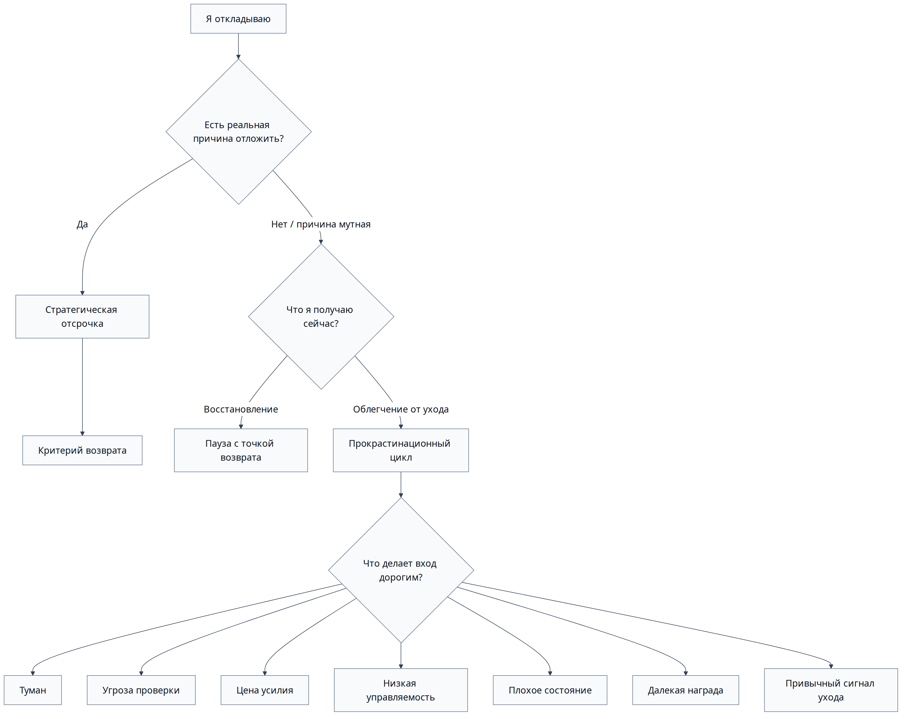{.diagram}


Практическая таблица:

| Причина | Внутренний сигнал | Инженерный ход |
| --- | --- | --- |
| Туман | "Не понимаю, с чего начать". | Карта контекста: факты, неизвестные, первая проверка. |
| Угроза проверки | "Сейчас станет ясно, что я не справляюсь". | Черновой контакт, обратимость, отделение результата от самооценки. |
| Цена усилия | "Слишком тяжело держать это". | Контейнер 5-15 минут, внешний след, один наблюдаемый результат. |
| Низкая управляемость | "Мои действия ничего не изменят". | Найти рычаг, критерий продвижения, внешнюю поддержку или границу ответственности. |
| Состояние | "Даже малый шаг распадается". | Восстановление, сон, снижение параллельной незавершенной работы, пауза с точкой возврата. |
| Далекая награда | "Польза потом, облегчение сейчас". | Близкая обратная связь, промежуточная контрольная точка. |
| Привычный уход | "Я уже открыл чат, не заметив". | Изменить сигнал, убрать легкий путь, задать ответ по схеме "если - то". |

Эта таблица важнее любой отдельной техники.

Без диагностики техника легко становится новым способом избегать.

Человек может делать таблицы вместо действия.

Ставить таймеры вместо входа.

Читать про прокрастинацию вместо проверки.

Настраивать систему задач вместо одного контакта с реальностью.

## Первый наблюдаемый шаг

Первый шаг лучше делать не красивым, а наблюдаемым.

Наблюдаемый шаг отвечает на вопрос:

```text
что будет видно через несколько минут,
если я действительно вошел в задачу?
```

Не чувство.

Не обещание.

Не настрой.

А след.

Примеры:

| Туманная задача | Первый наблюдаемый шаг |
| --- | --- |
| Написать главу | Написан плохой абзац с главным вопросом главы. |
| Разобрать баг | Выписаны три факта и одна сломанная гипотеза. |
| Учить тему | Сделано восстановление пяти пунктов без источника. |
| Подготовить разговор | Записаны цель разговора и один честный вопрос. |
| Навести порядок в делах | Выписаны все открытые петли без сортировки. |
| Начать спорт | Надета форма и сделана 10-минутная прогулка. |
| Проверить финансы | Открыта таблица и внесены три последних платежа. |

Хороший первый шаг имеет свойства:

- короткий;
- конкретный;
- связан с задачей, а не с обходом;
- не требует финального качества;
- дает след;
- делает следующий шаг яснее;
- снижает цену повторного входа.

Если шаг не делает следующий шаг яснее, он может быть маленьким, но бесполезным.

Например, "открыть ноутбук" иногда полезно как физический старт. Но если после открытия ноутбука задача остается такой же туманной, нужен следующий уровень: открыть конкретный файл, найти место разрыва, выписать вопрос.

## Стыд плохо лечит прокрастинацию

Стыд кажется естественным лекарством:

```text
если я достаточно разозлюсь на себя,
то соберусь
```

Иногда краткий всплеск стыда действительно может толкнуть человека в действие. Но как устойчивый метод он плох.

Почему?

Потому что стыд добавляет угрозу к уже дорогому входу.

Если человек откладывал задачу из-за угрозы проверки, стыд делает проверку еще опаснее.

Если он откладывал из-за низкой управляемости, стыд подтверждает: "со мной что-то не так".

Если он был в перегрузе, стыд добавляет эмоциональную цену.

Если он уходил в краткое облегчение, стыд создает новый неприятный фон, от которого снова хочется уйти.

Получается цикл:


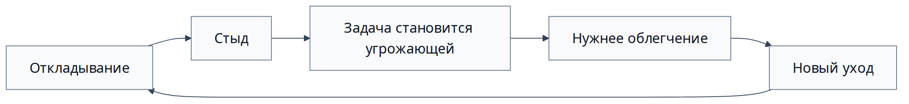{.diagram}


Ответственность отличается от стыда.

Стыд говорит:

```text
со мной что-то не так
```

Ответственность спрашивает:

```text
что я могу изменить в следующем входе?
```

Стыд сужает действие.

Ответственность возвращает рычаг.

## Рабочий протокол возвращения к задаче

Теперь можно собрать практический протокол.

Он нужен не для идеального самоконтроля. Он нужен для момента, когда человек уже заметил откладывание и хочет вернуться к задаче без самонаказания.

### Шаг 1. Назвать отсрочку без морали

```text
я откладываю вход в задачу
```

Не:

```text
я опять слабый
```

Полезная формулировка описывает процесс, а не личность.

### Шаг 2. Проверить: это отдых, стратегическая отсрочка или прокрастинация?

Вопрос:

```text
что будет со следующим входом после этой паузы?
```

Если он станет яснее, доступнее или восстановленнее - возможно, это не прокрастинация.

Если он станет дороже, туманнее или страшнее - это прокрастинационный цикл.

### Шаг 3. Найти источник дорогого входа

Выбрать одно главное:

- туман;
- угроза;
- цена;
- низкая управляемость;
- плохое состояние;
- далекая награда;
- привычный уход.

Не нужно искать все сразу. Для первого входа достаточно одного.

### Шаг 4. Сделать первый наблюдаемый шаг

Шаг лучше делать коротким, примерно на 5-15 минут, и оставлять след:

```text
строка
список
факт
гипотеза
вопрос
черновик
скрин
команда
сообщение
```

### Шаг 5. Остановиться не на истощении, а на точке возврата

После короткого входа нужно оставить следующий вход:

```text
что теперь известно?
что остается туманным?
какой следующий физический шаг?
что может меня увести?
если это случится, что я сделаю?
```

### Шаг 6. Изменить среду

Если рядом есть легкая награда, система снова выберет ее.

Среду лучше настроить так, чтобы она помогала входу:

- закрыть чат на первые 10 минут;
- открыть нужный файл заранее;
- оставить заметку с первым вопросом;
- убрать лишние вкладки;
- поставить таймер не на продуктивность, а на безопасный контейнер;
- сделать заметным следующий шаг;
- договориться о внешней контрольной точке.

### Шаг 7. Если шаг не держится, проверить состояние

Если даже 5-10 минут не держатся, это не повод усиливать стыд.

Это повод спросить:

```text
это прокрастинация старта
или система уже не держит нагрузку?
```

Иногда правильный следующий шаг - не еще один прием саморегуляции, а восстановление, сон, уменьшение параллельной незавершенной работы или разговор о нагрузке.

## Разбор примера: сложная глава учебника

Представим задачу:

```text
написать главу о прокрастинации
```

Задача важная. В ней много источников, много нюансов, риск скатиться в банальные советы, риск не раскрыть тему полно.

Прокрастинационный вход может выглядеть очень солидно:

- перечитать еще один обзор;
- проверить еще один DOI;
- шлифовать оглавление;
- открыть старые заметки;
- спорить с названием;
- писать план практик;
- сравнивать с предыдущими главами;
- искать более точную центральную схему.

Все это может быть полезным.

Но только если оно ведет к первому фрагменту текста.

Диагностика:

| Вопрос | Ответ |
| --- | --- |
| Что ценно? | Глава должна стать мостом от восстановления к преодолению. |
| Что угрожает? | Можно написать поверхностно, морализаторски или слишком упрощенно. |
| Что туманно? | Где граница между прокрастинацией, отдыхом, перегрузом и стратегической отсрочкой. |
| Какая цена входа? | Нужно удержать много уже введенных понятий. |
| Что будет легкой наградой? | Еще читать источники и чувствовать подготовку. |
| Первый наблюдаемый шаг | Написать черновой раздел о переходе от восстановления к прокрастинации. |

После такого шага задача уже не та же самая. Она получила вход. Дальше можно улучшать.

## Разбор примера: разработчик и сложный баг

Разработчик видит задачу:

```text
разобраться, почему сервис иногда теряет событие
```

Важность высокая. Туман высокий. Риск ошибки высокий. Прямой награды мало. Вход дорогой.

Прокрастинация может выглядеть так:

- почитать соседние MR;
- обновить локальное окружение без проверки гипотезы;
- ответить на мелкие сообщения;
- открыть мониторинг и закрыть;
- еще раз перечитать описание задачи;
- ждать "окна поглубже".

Рабочий вход:

```text
за 15 минут выписать:
1. где событие точно было;
2. где оно точно исчезло;
3. какой лог может сузить границу;
4. какая гипотеза сейчас самая слабая
```

Это не решает баг.

Но превращает "разобраться" в первый рычаг.

## Разбор примера: учеба и иллюзия подготовки

Человек хочет освоить новую тему.

Он смотрит курсы, сохраняет статьи, выбирает книги, делает красивые заметки. Но не решает задач и не делает восстановление без источника.

Внешне он учится.

Системно он может избегать проверки:

```text
что я могу восстановить без источника?
что я могу применить сам?
какую ошибку я сейчас делаю?
```

Рабочий вход:

```text
после 20 минут изучения закрыть источник
и написать пять пунктов своими словами
```

Если пункты не собираются, это не провал. Это точный сигнал, где начинается обучение.

Прокрастинация здесь может прятаться не в безделье, а в бесконечном потреблении материала без извлечения.

## Когда самостоятельные техники недостаточны

Эта глава описывает прокрастинацию как нормальный режим саморегуляции, который можно частично менять через среду, вход, обратную связь, управляемость и восстановление.

Но есть границы.

Если откладывание связано с тяжелым устойчивым снижением настроения, выраженной тревогой, паникой, СДВГ, зависимым поведением, хроническим недосыпом, выгоранием, соматическими симптомами или лекарственными вопросами, учебник не должен изображать это как обычную проблему дисциплины.

В таких случаях практики входа могут помогать как поддержка, но не заменяют профессиональную диагностику и помощь.

Когнитивное инженерство не должно становиться красивым способом обвинить человека в том, что его система работает в условиях, которые она уже не выдерживает.

## Почему нельзя писать эту главу как набор приемов

Есть популярный жанр:

```text
10 способов победить прокрастинацию
```

Разбейте задачу.

Поставьте таймер.

Уберите телефон.

Наградите себя.

Начните с малого.

Все это иногда полезно. Но без механизма такие советы быстро превращаются в шум.

Человек пробует таймер, но проблема была в низкой управляемости.

Пробует награду, но проблема была в угрозе проверки.

Пробует план, но план стал новым избеганием.

Пробует маленький шаг, но система была в перегрузе.

Пробует публичное обещание, но получает больше стыда и угрозы.

Поэтому глава должна дать не список приемов, а карту выбора:

```text
что делает вход дорогим
и какое вмешательство меняет именно этот параметр
```

## Короткое резюме

1. Прокрастинация - не всякая задержка, а отсрочка важного действия с кратким облегчением и будущей ценой.
2. Восстановление улучшает следующий вход; прокрастинация часто ухудшает его.
3. Важная задача может быть одновременно ценной и угрожающей.
4. Часто человек избегает не результата, а неприятного состояния перед входом.
5. Краткое облегчение закрепляет уход.
6. Будущий я получает более дорогую задачу: меньше времени, больше стыда, слабее контекст.
7. Прокрастинация часто начинается с цены входа, а не с отсутствия желания.
8. Туманная формулировка задачи сама повышает вероятность отсрочки.
9. Подготовка полезна только тогда, когда приближает проверяемый контакт с задачей.
10. Низкая управляемость делает усилие бессмысленным и поддерживает уход.
11. Разные виды цены усилия требуют разных вмешательств.
12. Перегруз и недогруз могут выглядеть как прокрастинация, но требуют разных решений.
13. Привычный уход нужно менять через сигнал, среду и переключатели по схеме "если - то".
14. Стыд часто усиливает прокрастинацию, потому что делает вход еще более угрожающим.
15. Первый наблюдаемый шаг нужен для контакта с реальностью задачи, а не для самообмана.
16. Хорошая практика начинается с диагностики: что именно делает вход дорогим сейчас?

## Вопросы для самопроверки

1. Чем прокрастинация отличается от стратегической отсрочки?
2. Почему восстановительная пауза и прокрастинация могут выглядеть одинаково снаружи?
3. Почему важная задача может вызывать избегание?
4. Что означает краткосрочная регуляция настроения в контексте прокрастинации?
5. Как краткое облегчение закрепляет уход?
6. Почему будущий вход после прокрастинации часто становится дороже?
7. Что такое цена входа?
8. Почему туманная задача запускает отсрочку?
9. Как отличить подготовку от избегания проверки?
10. Как низкая управляемость поддерживает прокрастинацию?
11. Какие виды цены усилия могут скрываться за фразой "не могу заставить себя"?
12. Когда прокрастинация может быть сигналом перегруза?
13. Как скука и недогруз могут приводить к откладыванию?
14. Почему планирование по схеме "если - то" не является универсальным решением?
15. Чем ответственность отличается от стыда?
16. Какие свойства должен иметь первый наблюдаемый шаг?

## Мини-практика

Выберите одну задачу, которую вы откладываете.

Заполните карту входа.

| Вопрос | Ответ |
| --- | --- |
| Какую задачу я откладываю? |  |
| Почему она важна? |  |
| Что именно неприятно во входе? |  |
| Что я делаю вместо входа? |  |
| Какое краткое облегчение я получаю? |  |
| Что станет дороже, если я отложу еще раз? |  |
| Это больше похоже на отдых, стратегическую отсрочку или прокрастинацию? |  |
| Главная причина дорогого входа: туман, угроза, цена, управляемость, состояние, далекая награда или привычный уход? |  |
| Какой первый наблюдаемый шаг займет 5-15 минут? |  |
| Какой след останется после этого шага? |  |
| Какой переключатель по схеме "если - то" я задам? |  |
| Что я оставлю как точку возврата? |  |

Цель мини-практики - не победить прокрастинацию навсегда. Цель - увидеть конкретный цикл и изменить следующий вход.

---

# Глава 19. Опыт преодоления

## После прокрастинации

Предыдущая глава разобрала прокрастинацию как цикл, который часто выглядит странно только снаружи.

Человек не делает важное не потому, что задача ничего не значит. Иногда как раз наоборот: задача слишком значима, слишком туманна, слишком оценочна или слишком плохо управляется. Вход в нее становится дорогим. Тогда система выбирает короткое облегчение:

```text
не входить сейчас
```

Проблема в том, что облегчение покупается за счет будущего входа. Задача не исчезает. Контекст распадается. Срок приближается. Стыд растет. Привычка уходить получает еще один удачный эпизод.

Теперь нам нужна противоположная петля.

Не "как заставить себя терпеть".

Не "как стать человеком без сопротивления".

А вот что:

```text
как сделать первый управляемый контакт с трудностью
и получить опыт, что в трудном можно действовать
```

Эта глава о преодолении. Но слово опасное. Его легко испортить.

Преодоление часто понимают как жесткость: стиснул зубы, вытерпел, подавил слабость, заставил себя. Такой язык плохо подходит для учебника по когнитивному инженерству. Он смешивает разные явления: усилие, стыд, перегруз, дисциплину, страх, привычку, восстановление, самонасилие и реальное обучение.

Нам нужно более точное определение.

Опыт преодоления - это не страдание и не героическая победа. Это повторяющаяся связка:

```text
сопротивление
-> удержание контакта
-> посильное действие
-> обратная связь
-> корректировка
-> след роста
```

Когда эта связка повторяется, будущая трудность начинает восприниматься иначе. Она все еще может быть неприятной. Но она перестает быть чистым сигналом к бегству.

Она становится ситуацией, в которой можно действовать.

## Что не является преодолением

Сначала уберем несколько ложных вариантов.

Преодоление - это не любое страдание. Человек может долго сидеть над задачей, злиться, стыдиться, уставать, но не получать нового способа действия. Если нет обратной связи и корректировки, трудность может закреплять беспомощность, а не способность.

Преодоление - это не любая занятость. Можно весь день делать полезные мелочи и ни разу не встретиться с настоящим трудным местом. Внешне человек активен. Внутренне он может обходить главную задачу.

Преодоление - это не моральная обязанность быть сильным. Иногда правильное действие - остановиться, восстановиться, попросить помощи, сменить условия, отказаться от задачи или признать, что текущая нагрузка разрушительна.

Преодоление - это не отказ от помощи. Наоборот, хорошая помощь часто нужна. Но она должна усиливать способность человека действовать, а не забирать действие до первой попытки.

Преодоление - это не гарантированная победа. Иногда человек делает все честно и не получает желаемый результат. Но даже достойная неудача может дать рост, если после нее остается понимание:

```text
что я сделал
что произошло
что теперь знаю
что можно изменить
```

Здесь преодоление означает другое:

```text
человек встречает сопротивление,
остается рядом с задачей,
делает посильный шаг,
получает сигнал о реальности,
меняет способ
и присваивает след роста
```

## Минимальная единица преодоления

Чтобы не говорить общими словами, разберем единицу преодоления по частям.

Вопрос схемы:

```text
какая минимальная петля превращает сопротивление
не в страдание и не в уход,
а в опыт управляемого действия?
```


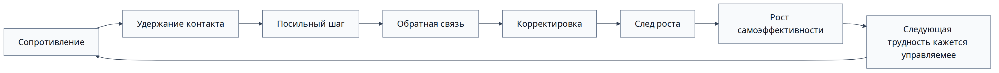{.diagram}


Граница схемы: она работает только там, где шаг остается посильным, есть обратная связь и возможна корректировка. Если есть только давление без рычага, схема описывает уже не преодоление, а риск закрепить беспомощность.

Сопротивление - момент, где хочется уйти. Оно может выглядеть как тревога, скука, тяжесть, раздражение, сонливость, желание "еще подготовиться", стремление открыть готовое решение или попросить ИИ сразу написать за нас.

Удержание контакта - короткий промежуток, где человек не обязан чувствовать уверенность, но остается рядом с задачей. Это не спокойствие. Это не вдохновение. Это просто отказ исчезнуть сразу.

Посильное действие - наблюдаемое изменение. Не размышление "надо бы", а шаг: написать плохой первый абзац, выписать неизвестное, собрать минимальный пример, спросить точный вопрос, показать черновик, сделать один подход, проверить одну гипотезу.

Обратная связь - сигнал о том, что произошло. Текст оказался мутным. Тест упал. Гипотеза не подтвердилась. Наставник указал на слабое место. Тело стало спокойнее после движения. Важно, что обратная связь превращает трудность из тумана в информацию.

Корректировка - изменение способа. Если человек просто давит тем же способом, он может тренировать не преодоление, а застревание. Преодоление требует не только усилия, но и обучения.

След роста - присвоенный результат. Стало понятнее. Стало точнее. Стало менее страшно. Появился следующий шаг. Человек быстрее вернулся после ошибки. Нужна была меньшая подсказка. Получился первый внешний артефакт.

Без следа роста опыт быстро растворяется. Поэтому его нужно фиксировать:

```text
что изменилось после моего действия
```

Не обязательно большое. Иногда след роста выглядит скромно:

```text
теперь я знаю, что непонятен не весь проект, а только критерий качества
```

Это уже сдвиг. Туман стал меньше. Управляемость выросла.

## Две ложные имитации

Есть две частые имитации преодоления.

Первая:

```text
терплю, но не учусь
```

Человек долго находится рядом с задачей, но не формулирует затруднение, не меняет способ, не получает обратную связь и не видит сдвига. Это может выглядеть как дисциплина, но внутри похоже на вязкое страдание.

Пример: студент пять часов смотрит в доказательство и повторяет "я тупой", но не выписывает, на каком переходе потерял смысл. Разработчик весь вечер смотрит на баг, но не изолирует минимальный воспроизводимый случай. Автор "пишет книгу", но каждый раз перечитывает уже написанное и не создает нового чернового фрагмента.

Вторая имитация:

```text
делаю, но не встречаю трудность
```

Человек активен, занят и даже получает маленькие победы, но выбирает только то, где уже умеет. Он отвечает на письма вместо сложного решения, улучшает оформление вместо проверки тезиса, смотрит еще один курс вместо первого проекта, настраивает инструменты вместо входа в задачу.

В первой имитации есть трудность без обучения.

Во второй есть активность без роста.

Опыт преодоления находится между ними:

```text
трудность реальна,
но действие остается управляемым
```

## Три зоны трудности

Не всякая трудность полезна. Это один из главных предохранителей главы.

Удобно различать три зоны.

| Зона | Что происходит | Что делать |
| --- | --- | --- |
| Легко | Человек уже умеет. Есть вход, удовольствие, скорость, уверенность. Рост небольшой. | Использовать для разогрева, закрепления, восстановления уверенности и завершения. |
| Посильно трудно | Задача выше текущего уровня, но есть первый шаг, обратная связь и возможность корректировки. | Это главная зона преодоления. Дробить, пробовать, получать сигнал, менять способ. |
| Разрушительно | Нет рычага, много хаоса, стыда, угрозы, перегруза или истощения. После отдыха не хочется возвращаться. | Снижать масштаб, добавлять опоры, восстанавливать состояние, менять условия, привлекать помощь. |

Зона легкости не плохая. Без нее человек не входит в действие, не получает радость владения навыком, не восстанавливает уверенность. Но если вся работа остается только в зоне легкости, способность делать трудное не растет.

Зона разрушения не благородная. Она может выглядеть как "настоящая взрослая жизнь" или "серьезная тренировка", но если человек там теряет управляемость, она учит защите:

```text
замирать
убегать
скрывать ошибки
делать вид
ненавидеть задачу
```

Рабочая зона преодоления - посильно трудно.

Там есть сопротивление. Но есть и первый шаг.

Там ошибка неприятна. Но она не уничтожает достоинство.

Там нужно усилие. Но после усилия появляется сигнал.

Там человеку может понадобиться помощь. Но помощь не забирает действие целиком.

## Почему "просто потерпи" - плохой совет

Терпение может быть частью преодоления. Оно удерживает человека рядом с трудностью достаточно долго, чтобы случилось действие.

Но терпение само по себе не учит.

Если человек терпит без способа, он получает опыт:

```text
я долго мучился, и ничего не изменилось
```

Для системы действия это плохой урок. Он снижает будущую готовность входить в похожие задачи.

Более точные вопросы:

- где именно стало трудно;
- что уже пробовал;
- какой самый маленький шаг виден;
- какой сигнал покажет, что шаг сделан;
- какую помощь можно дать, не делая вместо тебя;
- что изменилось после попытки.

Эти вопросы переводят человека из состояния "я страдаю" в состояние "я исследую".

Разница огромная.

```text
страдание без способа -> беспомощность
трудность + способ + сигнал -> обучение
```

## Самоэффективность: рабочая уверенность, а не самооценка

В главе 10 мы уже вводили самоэффективность. Здесь она становится центральной.

Самоэффективность - это не общая самооценка и не фраза "я хороший". Это ожидание:

```text
я могу выполнить действия,
которые повлияют на ход этой ситуации
```

Человек может иметь хорошую самооценку и низкую самоэффективность в конкретной области. Например, считать себя умным, но бояться писать код. Быть уверенным в общении, но избегать математики. Быть сильным специалистом, но теряться в публичном выступлении.

И наоборот, человек может не думать о себе высоко вообще, но иметь рабочую самоэффективность в конкретном ремесле:

```text
я знаю, как подступиться,
где проверить,
у кого спросить,
как исправить,
как довести до результата
```

Для преодоления важна именно эта конкретная уверенность.

Бандура связывал самоэффективность с тем, начнет ли человек действие, сколько усилия вложит и как долго сохранит попытки при препятствиях. Самый важный источник такой уверенности - опыт успешного овладения: опыт, где человек сделал действие, получил результат или сдвиг и увидел связь между усилием, способом и исходом.

Обычно это нельзя заменить одними словами.

"Ты справишься" может поддержать. Но если за ним нет прожитого опыта, фраза остается внешней.

"Я уже делал трудное и продвигался" работает иначе. Это память системы действия.

## Две петли обучения

У человека постепенно складывается одна из двух петель.

Петля управляемости:

```text
трудность
-> посильный шаг
-> обратная связь
-> корректировка
-> частичный успех или ясная неудача
-> рост самоэффективности
-> будущая трудность кажется более управляемой
```

Петля избегания:

```text
трудность
-> неприятное состояние
-> уход
-> краткое облегчение
-> отсутствие роста навыка
-> снижение самоэффективности
-> будущая трудность кажется опаснее
```

Петля избегания вознаграждает быстро. Ушел - стало легче. Не показал черновик - не получил критику. Не открыл задачу - не увидел свой реальный уровень. Не проверил гипотезу - сохранил надежду, что она верна.

Петля управляемости вознаграждает позже. Сначала неприятно. Потом появляется сигнал. Потом сдвиг. Потом память:

```text
я могу что-то делать в таком состоянии
```

Поэтому преодоление нужно проектировать. Нельзя просто ждать, что человек выберет более дальнюю награду против ближайшего облегчения.

Нужно сделать первый шаг меньше, обратную связь ближе, ошибку безопаснее, критерий яснее, поддержку точнее, а след роста видимым.

## Полезная трудность и обучение

Глава 16 уже показала различие между текущей гладкостью и долговременным обучением.

То, что легко выполняется сейчас, не всегда лучше учит. Иногда условия, которые делают выполнение менее гладким, дают более прочное знание: активное извлечение из памяти, вариативная практика, необходимость объяснить своими словами, исправление ошибки, перенос в новый контекст.

Но из этого нельзя делать обратный грубый вывод:

```text
чем труднее, тем лучше
```

Нет.

Трудность полезна только если она запускает нужный механизм.

| Трудность | Что запускает | Когда полезна |
| --- | --- | --- |
| Вспомнить без подсказки | практика извлечения из памяти | Когда материал уже первично собран и есть возможность проверить себя. |
| Написать черновик | внешнее оформление мысли | Когда есть хотя бы грубый критерий, что должно появиться на странице. |
| Показать неидеальную работу | обратная связь и перенос оценки наружу | Когда ошибка не превращается в унижение. |
| Решить чуть новую задачу | перенос и различение условий | Когда есть базовый чанк и шанс сравнить способы. |
| Сделать первый маленький шаг | снижение цены входа | Когда большая задача слишком туманна или угрожает. |

Если трудность забивает рабочую память, делает первый шаг невидимым, лишает обратной связи и добавляет стыд, она перестает быть полезной. Она становится шумом и угрозой.

Когнитивное инженерство здесь не ищет максимальную нагрузку.

Оно ищет правильное трение.

## Помощь, которая не заменяет действие

Хорошая помощь не обязана быть минимальной. Иногда человеку нужна сильная опора.

Но критерий такой:

```text
после помощи у человека остается больше способности действовать самому
```

Плохая помощь дает готовый результат и оставляет человека таким же зависимым.

Хорошая помощь возвращает действие.

Лестница помощи:

```text
вопрос -> подсказка -> совместное действие -> самостоятельная повторная попытка
```

Вопрос сохраняет максимум самостоятельности:

- что ты уже пробовал;
- где именно застрял;
- какой кусок можно сделать первым;
- какой сигнал покажет, что шаг сработал.

Подсказка направляет:

- начни с меньшего фрагмента;
- сравни с этим примером;
- проверь допущение;
- выпиши факты отдельно от гипотез.

Совместное действие нужно, когда вопроса и подсказки мало. Но после него полезно оставить самостоятельную повторную попытку. Иначе человек легко запоминает:

```text
когда трудно, другой делает за меня
```

Рабочее правило:

```text
помогать после первого контакта,
а не вместо первого контакта
```

Это правило не жестокое. Оно не означает бросить человека одного. Оно означает: дать ему прожить собственный минимальный ход.

Формулы:

- "Я помогу. Сначала покажи, что уже понял".
- "Давай найдем место, где застряло".
- "Я дам подсказку, но первый маленький шаг будет твой".
- "Сделаем один пример вместе, потом ты повторишь похожий сам".

Так строится не зависимость от спасателя, а опыт управляемости.

## ИИ: тренажер или обход

ИИ делает эту тему особенно острой.

Он может быть отличным помощником в преодолении. Может быть рецензентом, тренером, оппонентом, источником вариантов, проверкой слепых зон, генератором упражнений, инструментом снятия рутины.

Но он же может забрать именно тот слой трудности, который мог вырастить способность.

Опасный режим:

```text
я еще не сформулировал задачу -> ИИ формулирует
я еще не сделал черновик -> ИИ пишет
я еще не понял критерий -> ИИ выбирает
я еще не проверил вывод -> ИИ уверенно объясняет
```

Результат может стать гладким. Но способность может не вырасти.

Для главы 19 достаточно простого регламента:

```text
сначала мой первый слой мышления
потом ИИ как усилитель
после ИИ - обратный проход присвоения
```

До ИИ:

- что я пытаюсь сделать;
- что мне уже известно;
- что непонятно;
- какой мой первый план;
- какая моя первая попытка;
- какой критерий качества я вижу.

Запрос к ИИ:

- проверь слабые места;
- предложи альтернативы;
- задай вопросы;
- найди риск;
- объясни, где мой план распадается;
- дай упражнение на недостающий навык.

После ИИ:

- что я принял и почему;
- что отверг;
- что теперь могу объяснить без ИИ;
- какой следующий шаг сделаю сам;
- выросла ли моя способность или только результат стал глаже.

В тренировочном режиме ИИ лучше не отдавать первый слой мышления и последний слой ответственности.

Первый слой нужен для формирования способности.

Последний слой нужен для субъектности.

## Протокол управляемой трудности

Теперь соберем практический протокол.

Он подходит для учебы, письма, программирования, рабочих задач, освоения навыка, сложного разговора и многих бытовых ситуаций. Но это не медицинский или терапевтический протокол. Если человек в тяжелом истощении, депрессии, травматическом состоянии или клинической тревоге, сначала нужны безопасность, восстановление и профессиональная поддержка.

Базовая версия:

1. Назвать ценность.
2. Назвать сопротивление.
3. Уменьшить шаг.
4. Сделать шаг без требования идеальности.
5. Получить обратную связь.
6. Изменить способ.
7. Зафиксировать след роста.
8. Назвать следующий вход.

Пример: техническая статья.

| Шаг | Вопрос | Возможный ответ |
| --- | --- | --- |
| Ценность | Зачем это нужно? | Хочу сделать мысль проверяемой и полезной для других. |
| Сопротивление | Что неприятно? | Тема слишком широкая, страшно написать банально. |
| Малый шаг | Что можно сделать за 15 минут? | Выписать 10 вопросов, на которые статья должна ответить. |
| Действие | Что появилось во внешнем мире? | Список вопросов. |
| Обратная связь | Что стало видно? | Есть три блока, один лишний, два требуют источников. |
| Корректировка | Что меняю? | Начну не с введения, а с блока, где есть ясный пример. |
| След роста | Что теперь умею или знаю? | Туман уменьшился: задача стала структурой. |
| Следующий вход | Где продолжить? | Собрать источники под первый блок и написать плохой черновик. |

Пример: сложный баг.

| Шаг | Вопрос | Возможный ответ |
| --- | --- | --- |
| Ценность | Зачем это нужно? | Вернуть управляемость системе и перестать гадать. |
| Сопротивление | Что неприятно? | Боюсь, что причина глубже, чем кажется. |
| Малый шаг | Что можно сделать первым? | Собрать минимальный воспроизводимый сценарий. |
| Действие | Что появилось? | Скрипт, который падает в одном условии. |
| Обратная связь | Что стало видно? | Ошибка связана не со всей подсистемой, а с одним переходом состояния. |
| Корректировка | Что меняю? | Проверю гипотезу на этом переходе. |
| След роста | Что теперь есть? | Баг стал меньше и конкретнее. |
| Следующий вход | Как вернуться? | Запустить сценарий после изменения условия. |

В обоих случаях важен не пафос. Важен внешний след.

Преодоление полезно оставлять как артефакт:

- список вопросов;
- черновик;
- тест;
- схема;
- запись о попытке;
- исправленный пример;
- формулировка затруднения;
- критерий следующего шага.

Артефакт делает рост видимым. Без него человеку легко кажется, что он просто помучился.

## Как измерять прогресс

Привычка преодоления не означает, что сопротивление исчезло.

Лучший показатель - не отсутствие трудности, а изменение поведения вокруг трудности.

### Скорость возвращения

Раньше человек уходил на неделю. Потом на день. Потом на час. Потом замечает уход почти сразу и делает маленький входной шаг.

Прогресс:

```text
сокращается расстояние между уходом и возвращением
```

### Способность назвать затруднение

Фраза "ничего не понимаю" превращается в более точную:

- "не понимаю критерий качества";
- "не вижу первого шага";
- "не знаю, какой источник авторитетен";
- "боюсь показать черновик";
- "не хватает примера";
- "у меня слишком много параллельной работы, и контекст рвется".

Чем точнее названо затруднение, тем выше управляемость.

### Рост внешних артефактов

После трудности остается след:

- черновик;
- проверка;
- карта неизвестного;
- решение;
- список вопросов;
- заметка о том, что не сработало;
- план следующего входа.

Это значит, что трудность перестала быть чистым внутренним напряжением и стала частью рабочей системы.

### Снижение страха черновика

Человек быстрее делает первую плохую версию. Не потому, что стал безразличен к качеству, а потому что понял:

```text
черновик - это не проверка личности,
а материал для корректировки
```

### Меньше мгновенного спасения

Человек не сразу открывает готовое решение, наставника или ИИ. Сначала делает первый слой:

- формулирует задачу;
- записывает гипотезу;
- пробует шаг;
- собирает вопрос.

Помощь остается. Но она приходит после контакта, а не вместо него.

## Красные флаги

Есть ситуации, где язык преодоления лучше отложить или сильно изменить.

Красные флаги:

- после отдыха человек не может вернуться к задаче;
- ошибка каждый раз превращается в унижение;
- критерии успеха меняются задним числом;
- нет реального рычага влияния;
- помощь недоступна или приходит только как обвинение;
- нарушаются сон, здоровье, отношения, безопасность;
- растет отвращение, а не управляемость;
- человек уже находится в выгорании или сильном истощении;
- трудность используется, чтобы не встречаться с другой, более важной проблемой.

Последний пункт особенно важен.

Преодоление тоже может стать избеганием. Человек выбирает "трудную" задачу, чтобы не делать страшную. Работает много, чтобы не говорить. Тренируется до изнеможения, чтобы не чувствовать. Берет сверхнагрузку, чтобы не признать пустоту или конфликт.

Внешне это похоже на силу.

Системно это может быть активное избегание.

Критерий здорового преодоления:

```text
после цикла растет управляемость,
а не только усталость или облегчение "пронесло"
```

## Возрастная карта без отдельной книги

Исходный материал по опыту преодоления большой и возрастной. Для учебника нам не нужно превращать эту главу в отдельный том по развитию. Но короткая карта полезна.

| Возраст или роль | Главная задача преодоления | Поддержка | Риск |
| --- | --- | --- | --- |
| Маленький ребенок | Попробовать самому рядом со взрослым. | Присутствие, игра, маленькие телесные задачи. | Взрослый забирает действие слишком рано. |
| Младший школьник | Завершать небольшие задачи и называть место затруднения. | Вопросы, короткие циклы обратной связи. | Стыд за ошибку и ярлык "не способен". |
| Подросток | Выдерживать неидеальность и социальную оценку. | Наставник, безопасная публичность, право на черновик. | Маска равнодушия вместо встречи со страхом. |
| Старший подросток | Связывать цель с ценой и временем. | Длинный проект, критерии, первый внешний результат. | Имитация подготовки. |
| Молодой взрослый | Строить ремесло, а не гладкий результат. | Реальные задачи, ревью, ручной первый слой перед ИИ. | Готовые решения без понимания. |
| Взрослый специалист | Возвращать авторство в сложных системах. | Рабочий журнал, ограничения параллельной незавершенной работы, точная помощь, восстановление. | Взрослое избегание под видом занятости. |

Общая логика везде одна:

```text
не спасать до первого контакта
не оставлять без опоры
не стыдить за ошибку
фиксировать рост
возвращать действие человеку
```

Меняется только форма.

## Что это добавляет к учебнику

До этого места учебник строил несколько линий.

Главы 4-6 вынесли состояние задачи из головы во внешний контур.

Главы 7-11 разобрали мотивацию как систему ценности, угрозы, управляемости, цены усилия и состояния.

Главы 12-15 добавили язык уровней объяснения, контуров, медиаторов, стресса и аллостаза.

Главы 16-18 показали, как строится понимание, почему восстановление важно для обучения и почему прокрастинация может закрепляться через краткое облегчение.

Глава 19 соединяет это в один учебный принцип:

```text
человек становится способным делать трудное,
когда трудность проектируется как управляемая петля обучения
```

Не всякая трудность развивает.

Не всякая помощь помогает.

Не всякое использование ИИ ослабляет.

Не всякое усилие здорово.

Но без опыта управляемого сопротивления способность делать трудное растет хуже. Человек может получать готовые ответы, избегать ошибок, сохранять гладкий образ себя и жить в зоне легких побед. Такая среда приятна. Но она плохо готовит к реальности, где ценные задачи почти всегда требуют тумана, черновика, ошибки, обратной связи и возвращения.

Опыт преодоления учит простой, но очень глубокий связке:

```text
мне трудно
но я могу сделать маленький шаг
и этот шаг может изменить ситуацию
```

Это не лозунг. Это инженерный объект. Его можно поддерживать средой, ритмом, вопросами, внешними артефактами, восстановлением, наставничеством и аккуратным использованием ИИ.

После этого различения можно переходить к продуктивности и выгоранию. Если не понимать преодоление, продуктивность легко превращается в выжимание ресурса. Если понимать, становится видно другое: продуктивность начинается не с максимального давления, а с проектирования условий, в которых человек может регулярно возвращаться к ценному трудному действию и не разрушаться.

## Короткое резюме

1. Преодоление - это не культ страдания и не героическое терпение.
2. Минимальная единица преодоления: сопротивление, контакт, посильный шаг, обратная связь, корректировка и след роста.
3. Полезная трудность находится между легкостью без роста и разрушительным перегрузом.
4. Терпение без действия и корректировки не строит способность.
5. Самоэффективность - не самооценка, а ожидание способности выполнить конкретное действие.
6. Опыт успешного овладения сильнее лозунгов, похвалы и абстрактного "поверь в себя".
7. Помощь полезна, когда сохраняет действие человека, а не забирает его до первого контакта.
8. ИИ может быть тренажером, рецензентом и оппонентом, но может стать обходом первого слоя мышления.
9. Прогресс измеряется не исчезновением сопротивления, а скоростью возвращения, ясностью затруднения, ростом артефактов и снижением страха черновика.
10. Красные флаги важнее героизма: если растет отвращение, разрушение или беспомощность, модель преодоления нужно менять.
11. Возрастная и ролевая карта нужна не для отдельной педагогической книги, а чтобы показать: форма поддержки меняется, принцип управляемого контакта остается.
12. Переход к продуктивности возможен только после этого различения: продуктивность не должна становиться самоизносом.

## Вопросы для самопроверки

1. Чем преодоление отличается от терпения?
2. Почему "просто потерпи" - плохой совет?
3. Что входит в минимальную единицу преодоления?
4. Чем полезная трудность отличается от разрушительной?
5. Почему самоэффективность нельзя сводить к общей самооценке?
6. Почему опыт успешного овладения важнее абстрактной уверенности?
7. Как помощь может поддержать действие, а как может заменить его?
8. В каком режиме ИИ помогает преодолению, а в каком обходит рост способности?
9. Какие признаки показывают, что опыт преодоления действительно накапливается?
10. Какие красные флаги требуют не усиливать давление, а менять условия или искать поддержку?
11. Почему преодоление тоже может стать формой избегания?
12. Как глава 19 готовит переход к продуктивности без самоизноса?

## Мини-практика

Выберите одну трудную задачу, к которой вы регулярно не возвращаетесь.

Заполните протокол управляемой трудности.

| Вопрос | Ответ |
| --- | --- |
| В чем сопротивление: туман, страх ошибки, скука, телесная цена, стыд, перегруз, недогруз? |  |
| Какой посильный контакт с задачей возможен без героизма? |  |
| Какой первый шаг даст наблюдаемую обратную связь? |  |
| Что будет считаться малым сдвигом? |  |
| Какая помощь сохранит мое действие, а не заменит его? |  |
| Где ИИ можно использовать как рецензента, тренера или оппонента после моей первой попытки? |  |
| Какой след роста я зафиксирую после шага? |  |
| Что будет точкой следующего входа? |  |
| Какой красный флаг покажет, что нужно не давить, а менять условия? |  |

Цель мини-практики - не доказать силу характера. Цель - создать маленький эпизод "трудно -> действую -> вижу сдвиг", который может стать будущей опорой.

---

# Глава 20. Продуктивность без самоизноса

## После опыта преодоления

Предыдущая глава разобрала, как растет способность делать трудное.

Не через героизм. Не через "просто потерпи". Не через постоянное давление. А через повторяющийся цикл:

```text
сопротивление
-> удержание контакта
-> посильное действие
-> обратная связь
-> корректировка
-> след роста
```

Этот вывод легко испортить.

Если человек понял только первую половину, он может решить:

```text
раз трудность развивает,
надо чаще давить на себя
```

Но полезная трудность не равна бесконечной нагрузке. Трудность развивает, пока в ней остается управляемость, обратная связь, корректировка и восстановление. Если восстановление исчезает, трудность постепенно перестает учить и начинает накапливать долг.

Внешне это может выглядеть как продуктивность.

Человек много работает. Быстро отвечает. Постоянно держит несколько задач. Поздно заканчивает. Режет паузы. Компенсирует туман усилием. В календаре все занято. В чате он доступен. В трекере есть движение.

Но внутри может происходить другое:

```text
вход в важные задачи дорожает
контекст рвется
качество становится нестабильным
отдых не восстанавливает
следующий день начинается с долга
```

Эта глава нужна, чтобы отделить продуктивность от самоизноса.

Продуктивность в когнитивном инженерстве - это не способность долго игнорировать усталость. Это способность регулярно создавать ценный сдвиг в задачах, сохраняя будущую способность возвращаться к ним.

Коротко:

```text
продуктивность = ценный сдвиг + сохраненный следующий вход
```

Если результат есть, но следующий вход разрушен, это может быть рывок. Иногда рывки нужны. Но если так устроен обычный режим, он постепенно съедает сам себя.

## Что обычно путают с продуктивностью

Прежде чем строить модель, уберем несколько подмен.

Продуктивность - это не занятость. День может быть заполнен письмами, чатами, созвонами, короткими задачами и быстрыми реакциями, но не дать сдвига по тому, что действительно меняет положение дел.

Продуктивность - это не количество закрытых мелочей. Мелкие задачи бывают нужны: они чистят контур, снимают шум, открывают путь к большому. Но если человек закрывает мелочи, чтобы не входить в трудный кусок, это уже не продуктивность, а обход.

Продуктивность - это не максимальное число часов. Иногда длинный день дает результат. Но час, который разрушает завтрашний вход, стоит дороже, чем кажется в моменте.

Продуктивность - это не постоянное ощущение потока. Хорошая работа часто содержит скуку, сопротивление, ошибки, ожидание, чтение непонятного текста, проверку тупиков и неприятную обратную связь. Если считать продуктивным только приятный поток, сложная работа начнет казаться неправильной.

Продуктивность - это не идеальный контроль дня. В живой работе есть срочность, люди, зависшие решения, внешние ожидания, неожиданные проблемы. Задача не в том, чтобы день стал стерильным. Задача в том, чтобы режим оставался объяснимым и ремонтируемым.

Рабочее определение будет таким:

```text
продуктивность - это режим,
в котором человек регулярно создает ценный сдвиг,
понимает цену этого сдвига
и сохраняет возможность продолжать
```

В этом определении важны все три части.

Без ценного сдвига продуктивность превращается в занятость.

Без понимания цены она превращается в самообман.

Без возможности продолжать она превращается в самоизнос.

## Две петли рабочего режима

Посмотрим на две разные петли.

Вопрос схем:

```text
как отличить рабочий режим,
который сохраняет следующий вход,
от режима, который покупает сегодняшний результат завтрашним долгом?
```

Первая - петля устойчивой продуктивности.


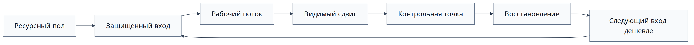{.diagram}


Вторая - петля самоизноса.


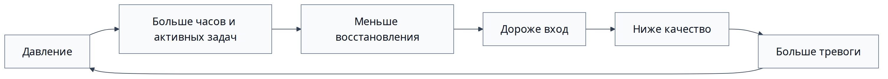{.diagram}


Граница схем: они не делят людей на "здорово продуктивных" и "самоизнашивающихся". Они показывают повторяемый режим. Один рывок может быть оправдан; риск начинается, когда петля самоизноса становится нормальным способом работать.

Обе петли могут начинаться с одного и того же желания:

```text
сделать важную работу
```

Разница не в том, что первая петля "легкая", а вторая "трудная". В первой тоже есть трудность. Но трудность встроена в режим, который поддерживает следующий вход. Во второй трудность превращается в нарастающий долг.

Петля устойчивой продуктивности отвечает на вопрос:

```text
как сделать так,
чтобы завтра было легче продолжить важное
```

Петля самоизноса отвечает на другой вопрос:

```text
как вытянуть сегодня,
даже если завтра станет дороже
```

Иногда второй вопрос неизбежен. Дедлайн, инцидент, кризис, острое обязательство - жизнь не всегда дает идеальный ритм. Но когнитивное инженерство смотрит не только на отдельный рывок, а на повторяемую систему.

Если исключение становится нормой, система перестает восстанавливаться.

## Ресурсный пол

Начнем с первого узла петли: ресурсный пол.

Слово "ресурс" легко звучит слишком расплывчато. Поэтому уточним.

Ресурсный пол - это не хорошее настроение, не вдохновение и не полный бак энергии. Это минимальное состояние системы, при котором рабочее действие остается доступным.

У человека может быть ресурсный пол, даже если он не в восторге от задачи. Он может быть немного сонным, сомневаться, раздражаться, не чувствовать особой мотивации, но все еще быть способен:

- открыть задачу;
- восстановить контекст;
- удержать внимание на первом шаге;
- выдержать небольшую ошибку;
- получить обратную связь;
- вернуться после короткой паузы;
- не разрушить следующий день.

Если ресурсный пол провален, простая задача становится дорогой, а трудная - почти недоступной. Тогда человек начинает объяснять происходящее морально:

```text
я ленюсь
я слабый
я потерял мотивацию
мне нужно просто собраться
```

Иногда это правда частично. Но часто проблема ниже:

```text
система не держит минимальные условия действия
```

Недосып, хроническое напряжение, постоянные переключения, шум, нерешенные конфликты, плохая еда, отсутствие пауз, избыток неопределенности и слишком много открытых контуров могут поднять цену входа так, что человек начинает избегать не потому, что задача не важна, а потому что вход стал слишком дорогим.

Ресурсный пол не гарантирует продуктивность. Он только делает ее возможной.

Это как сухая поверхность под ногами. Она не несет тебя к цели сама. Но без нее каждый шаг становится борьбой с проскальзыванием.

В практическом виде ресурсный пол задается не одной привычкой, а набором нижних ограничений:

| Слой | Минимальный вопрос |
| --- | --- |
| Сон | Не построен ли день на системном недосыпе? |
| Тело | Есть ли еда, вода, движение, базовая телесная устойчивость? |
| Нагрузка | Не превышает ли текущий объем параллельной работы способность удерживать контекст? |
| Среда | Есть ли хотя бы один защищенный блок для важной работы? |
| Эмоциональная безопасность | Не превращается ли ошибка в угрозу личности или статусу? |
| Восстановление | Есть ли способ выйти из работы, а не только обрушиться после нее? |

Ресурсный пол нужен не для комфорта. Он нужен для управляемости.

Когда пол есть, трудность можно дозировать. Когда пола нет, даже полезная трудность превращается в разрушительную.

## Защищенный вход

Следующий узел - защищенный вход.

Мы уже говорили в главах 4-6, что сложная задача требует не просто действия, а восстановления состояния задачи. Нужно вспомнить цель, факты, ограничения, гипотезы, тупики, критерий продвижения и следующий шаг.

Это не бесплатно.

Вход в задачу сам является когнитивной работой. Поэтому первый кусок внимания особенно хрупок. Если он уходит на новости, чаты, быстрые ответы, случайные правки, чужую срочность и подготовительные мелочи, день может быть потерян еще до того, как человек начал "настоящую" работу.

Защищенный вход - это короткий участок дня, где задача получает шанс стать рабочим объектом.

Минимально он должен дать три вещи:

```text
контекст
первый наблюдаемый шаг
непрерывность до первого сдвига
```

Контекст отвечает на вопрос:

```text
что это за задача и где я в ней нахожусь
```

Первый наблюдаемый шаг отвечает:

```text
что изменится в мире после ближайшего действия
```

Непрерывность отвечает:

```text
успею ли я дойти до сдвига,
пока контекст снова не разорвали
```

Защищенный вход не обязан занимать половину дня. Иногда достаточно 25-40 минут, если вход хорошо подготовлен. Но если работа сложная, десять раз по пять минут обычно не заменяют один непрерывный блок. Каждый вход будет снова платить цену восстановления контекста.

Здесь полезно различить две формы защиты.

Первая - внешняя:

- не открывать чаты до первого рабочего блока;
- не начинать день с новостей;
- убрать лишние уведомления;
- поставить короткий явный слот фокуса;
- договориться о времени недоступности;
- держать рядом рабочий журнал или контрольную точку.

Вторая - внутренняя:

- не начинать с украшения системы;
- не уходить в подготовку вместо первого шага;
- не требовать идеального состояния;
- не подменять сложную задачу более легкой активностью;
- не искать уверенность до контакта с материалом.

Защищенный вход не создает дисциплину из воздуха. Он снижает цену запуска. Это разные вещи.

## Рабочий поток и видимый сдвиг

После входа нужен рабочий поток.

Здесь важно не путать поток с приятным состоянием полной погруженности. Рабочий поток означает более простую вещь:

```text
контекст задачи удерживается достаточно долго,
чтобы произошел видимый сдвиг
```

Сдвиг может быть большим:

- написан раздел;
- закрыт тикет;
- решена архитектурная развилка;
- подготовлен документ;
- найден корень бага.

Но часто сдвиг меньше:

- стало ясно, что именно непонятно;
- собран минимальный воспроизводимый пример;
- исключена одна гипотеза;
- сформулирован точный вопрос;
- создан плохой первый черновик;
- найден критерий качества;
- зафиксирован следующий вход.

Это все продуктивные сдвиги, если они меняют состояние задачи.

В сложной работе опасно считать результатом только готовый финал. Тогда долгие участки исследования, чтения, проверки, отбраковки и формулирования начинают выглядеть как "ничего не сделал". Человек усиливает давление, хотя система на самом деле двигалась.

Поэтому рабочий поток должен оставлять след.

Не обязательно большой отчет. Иногда достаточно:

```text
сделал:
узнал:
исключил:
следующий шаг:
```

Такой след превращает внутреннее усилие во внешний объект. День становится объяснимым. Следующий вход становится дешевле. Человек видит связь между усилием и сдвигом.

Без видимого сдвига рабочий поток легко превращается в переживание:

```text
я весь день напрягался, но не понимаю, что изменилось
```

Это один из путей к самоизносу. Система платит цену усилия, но не получает сигнала управляемости.

## Контрольная точка вместо обрыва

Рабочий блок нужно не только начать, но и закончить.

Плохой выход выглядит так:

```text
устал
закрыл ноутбук
потом вспомню
```

Иногда вспомнишь. Но часто нет.

Контекст сложной задачи не лежит в голове в неизменном виде. Он распадается. Поэтому выход должен защищать будущий вход.

Контрольная точка - это короткая фиксация состояния перед выходом:

```text
где остановился
что сейчас понял
что не сработало
какой следующий шаг
что важно не забыть
```

Контрольная точка не нужна для бюрократии. Она нужна, чтобы не покупать каждый следующий вход заново.

Хорошая контрольная точка особенно важна, когда:

- задача туманная;
- работа прерывается вынужденно;
- есть несколько параллельных треков;
- результат пока не финальный;
- была сложная отладка;
- завтра продолжать будет другой человек или будущий ты в другом состоянии.

В устойчивой продуктивности выход - часть работы.

Если выход не сделан, следующий вход дорожает. Если следующий вход дорожает, растет вероятность прокрастинации. Если растет прокрастинация, давление возвращается. Так петля самоизноса снова получает топливо.

## Объяснимость времени

В культуре продуктивности время часто пытаются превратить в таблицу.

Сколько минут на задачу. Сколько часов фокуса. Сколько дел закрыто. Сколько процентов дня полезно.

Учет может быть полезен. Но для когнитивного инженерства важнее другое: объяснимость времени.

Объяснимость времени - это способность в конце дня восстановить, как работал режим:

```text
где был фокус
где были переключения
где был реальный сдвиг
где были паузы
где день распался
что сделало следующий вход легче или дороже
```

Это не бухгалтерия минут. Это диагностика рабочего контура.

Если человек не может объяснить день, возможны разные причины:

- слишком много мелких переключений;
- первый вход был отдан шуму;
- важная задача не получила непрерывного блока;
- паузы уводили в другой контекст;
- день держался на реакциях, а не на выбранном сдвиге;
- было слишком много параллельной работы;
- состояние было ниже ресурсного пола;
- задача была туманной, но туман не был вынесен наружу.

Каждая причина требует разного ремонта. Поэтому просто сказать "надо лучше планировать" недостаточно.

Объяснимость времени задает правильный вопрос:

```text
какой именно механизм съел рабочий режим
```

Иногда ответ будет:

```text
я недостаточно защищал вход
```

Иногда:

```text
задач было слишком много
```

Иногда:

```text
паузы стали новым контекстом
```

Иногда:

```text
я пытаюсь продуктивно работать в состоянии,
где сначала нужно восстановление
```

Объяснимость времени не должна становиться способом бить себя по голове. Если человек использует ее для самонаказания, она ломает задачу. Ее задача - вернуть управление.

## Критерий завершенности рабочего дня

В инженерной работе критерий готовности помогает понять, что задача действительно завершена. Для рабочего режима тоже нужен критерий завершенности, но особый.

Если оценивать день только по внешним результатам, человек попадает в ловушку.

Внешние результаты часто запаздывают:

- фидбек придет позже;
- большой проект не закрывается за день;
- правильное архитектурное решение долго не видно;
- исследование требует тупиков;
- команда оценивает результат не сразу;
- метрики меняются медленно.

Если ориентироваться только на такие сигналы, день кажется плохим даже тогда, когда режим был правильным.

Поэтому критерий завершенности рабочего дня лучше держать в двух слоях.

| Слой | Примеры | Как использовать |
| --- | --- | --- |
| Управляемые признаки | объяснимость времени, защищенный вход, меньше распада на переключения, видимый сдвиг, контрольная точка, граница работы и отдыха | Проверять в конце дня. По ним можно ремонтировать завтрашний режим. |
| Запаздывающие сигналы | внешняя оценка, завершенные задачи, качество результата, стабильные метрики, доверие команды | Смотреть как подтверждение траектории. Не пытаться управлять ими напрямую в текущем блоке. |

Управляемые признаки не гарантируют внешний успех. Но без них успех становится случайным и дорогим.

Пример рабочего критерия завершенности:

```text
1. Я могу объяснить, куда ушло рабочее время.
2. Хотя бы один важный кусок получил видимый сдвиг.
3. День не распался полностью на переключения.
4. Паузы не разрушили рабочий контекст.
5. На выходе оставлена контрольная точка.
6. Завтрашний вход не стал заметно дороже без причины.
```

Это не список для идеального дня. Это диагностическая рамка.

Если выполнены четыре пункта из шести, день может быть хорошим даже без большого финального результата.

Если выполнен только пункт "я был занят", день может быть шумным даже при большом количестве действий.

## Рабочая пауза, личный отдых и прокрастинационное облегчение

Одна из самых тонких тем - паузы.

Снаружи три состояния похожи:

```text
человек не работает
```

Но системно они разные.

| Состояние | Что происходит | Что будет со следующим входом |
| --- | --- | --- |
| Рабочая пауза | Система снимает часть нагрузки, не открывая новый тяжелый контекст. | Вход обычно становится доступнее. |
| Личный отдых | Человек выходит из рабочего режима в другой жизненный режим. | Нужен, но после него требуется новый вход. |
| Прокрастинационное облегчение | Человек снижает неприятное состояние, избегая встречи с задачей. | Вход часто становится дороже. |

Рабочая пауза может быть простой:

- встать;
- пройтись;
- посмотреть в окно;
- подышать;
- сделать короткое движение;
- выпить воды;
- записать следующий шаг и отойти на несколько минут.

Ее смысл - не развлечься любой ценой. Ее смысл - восстановить способность продолжать тот же рабочий контур.

Личный отдых тоже нужен. Но если он входит внутрь рабочего блока, он может открыть другой контекст: переписку, хобби, видео, игру, новости, бытовые дела. После этого человек возвращается не из паузы, а из другой жизни. Ему снова нужно поднимать рабочий контекст.

Прокрастинационное облегчение еще тоньше. Оно может выглядеть как отдых, но его главная функция - не восстановить систему, а уйти от неприятного входа.

Практический вопрос:

```text
после этой паузы следующий вход стал доступнее или дороже
```

Ответ не всегда очевиден сразу. Поэтому полезно смотреть не на моральную оценку занятия, а на функцию.

Одна и та же прогулка может быть восстановлением или избеганием.

Один и тот же короткий чат может поддержать состояние или разорвать вход.

Один и тот же перерыв на видео может быть нормальным вечерним отдыхом или способом не встретиться с задачей, которую надо было хотя бы открыть.

В когнитивном инженерстве пауза оценивается по месту в контуре.

## Хороший ритм и режим нажима

Теперь можно развести два режима.

Хороший ритм:

```text
вход -> фокус -> сдвиг -> контрольная точка -> восстановление -> следующий вход
```

Режим нажима:

```text
давление -> больше часов -> больше активных задач -> меньше восстановления -> дороже вход -> еще больше давления
```

Хороший ритм не означает легкую жизнь. В нем есть трудные задачи, серьезные обязательства, дедлайны и неприятные куски. Но он ремонтируем. После нагрузки остается путь назад к нормальному входу.

Режим нажима часто начинается благородно:

- надо помочь команде;
- надо закрыть важный проект;
- надо доказать компетентность;
- нельзя подвести людей;
- сейчас особый период;
- потом отдохну.

Проблема не в одном особом периоде. Проблема в том, что система привыкает считать особый период нормой.

Признаки режима нажима:

- календарь заполнен, но важные задачи все равно откладываются;
- день начинается с реактивных входов;
- паузы не восстанавливают;
- вечером остается только тупое потребление или срыв;
- сон становится резервом для работы;
- качество держится на последней проверке и тревоге;
- человек все чаще говорит "надо просто дожать";
- после завершения задачи нет восстановления, потому что сразу открывается следующая.

В таком режиме продуктивность начинает жить в долг.

Сначала долг незаметен. Потом он проявляется как цена входа. Потом как прокрастинация. Потом как раздражение, цинизм, отвращение, потеря смысла, снижение качества и ощущение, что даже важные задачи больше не дают энергии.

Подробно выгорание и профессиональная скука будут дальше. Здесь достаточно зафиксировать границу:

```text
если режим регулярно разрушает восстановление,
это уже не проблема продуктивности одного дня
```

## Как проектировать день без самоизноса

Теперь соберем практический протокол.

Это не идеальное расписание. Это способ думать о рабочем дне.

### 1. Проверить ресурсный пол

Перед тем как требовать от себя высокой продуктивности, стоит спросить:

- сколько сна реально было;
- есть ли сильное телесное истощение;
- не держится ли день на тревоге;
- не слишком ли много открытых контуров;
- есть ли шанс на первый защищенный блок;
- не нужно ли сначала снизить нагрузку или неопределенность.

Если ресурсный пол провален, задача дня меняется.

Вместо:

```text
выдать максимальный результат
```

становится:

```text
сохранить систему,
сделать минимальный ценный сдвиг
и не разрушить следующий вход
```

### 2. Защитить первый вход

В начале дня нужно дать важной задаче шанс.

Не обязательно сразу брать самую страшную часть. Но полезно выбрать кусок, который двигает реальную линию:

```text
открыть контекст
назвать туман
выбрать первый шаг
дойти до первого сдвига
```

Если день начинается с чужого шума, потом трудно требовать от себя глубокого фокуса.

### 3. Выбрать один ценный сдвиг

Не "сегодня поработать над проектом", а:

```text
после блока должно измениться вот это
```

Например:

- будет черновик раздела;
- будет список неизвестных;
- будет минимальный воспроизводимый пример;
- будет решение по развилке;
- будет письмо с ясным вопросом;
- будет проверка гипотезы;
- будет удален один источник тумана.

Один ценный сдвиг лучше, чем десять размытых намерений.

### 4. Работать через внешний контекст

Если задача сложная, держать ее только в голове дорого.

Нужен внешний след:

```text
цель
текущее понимание
что проверяю
что уже исключил
что изменилось
следующий шаг
```

Это связывает главу 20 с главами 4-6. Продуктивность без внешнего контура быстро становится зависимой от состояния памяти и настроения.

### 5. Делать паузы, которые поддерживают режим

Паузу внутри рабочего блока полезно проверять вопросом:

```text
поможет ли это вернуться в тот же контекст
```

Если да, это рабочая пауза.

Если нет, возможно, это личный отдых. Он тоже нужен, но лучше вынести его за границу рабочего блока.

Если пауза просто снимает неприятное состояние и делает вход дороже, это прокрастинационное облегчение.

### 6. Закрыть блок контрольной точкой

Перед выходом:

```text
что сделал
что понял
что не сработало
где остановился
с чего начать дальше
```

Контрольная точка особенно важна, если работа была трудной, неполной или прерванной. Она защищает будущего человека, который будет входить в задачу в другом состоянии.

### 7. Вечером восстановить объяснимость дня

Не надо судить день только по чувству "я молодец" или "я провалился".

Лучше восстановить карту:

- где был защищенный вход;
- что стало видимым сдвигом;
- где были разрывы;
- какие паузы помогли;
- какие паузы открыли другой контекст;
- что сделало завтрашний вход легче;
- что сделало его дороже.

После этого можно выбрать один ремонт на завтра.

Не десять.

Один.

Например:

```text
не открывать чаты до первого блока
```

или:

```text
оставлять контрольную точку перед обедом
```

или:

```text
не начинать паузу с личного видео
```

или:

```text
сократить число параллельных задач до двух активных
```

Так продуктивность становится инженерной: наблюдение, гипотеза, изменение, проверка.

## Когда подход продуктивности уже не подходит

Есть состояния, где этот слой работы должен остановиться.

Если человек уже в тяжелом истощении, новый режим продуктивности может стать еще одним источником давления. Тогда проблема не в том, что не хватает правильной техники. Проблема в том, что система уже не восстанавливается.

Красные флаги:

- после отдыха вход не возвращается;
- сон системно нарушен;
- тело постоянно в напряжении или провале;
- работа вызывает отвращение, а не только сопротивление;
- качество падает, но часов становится больше;
- человек держится только на тревоге и обязательстве;
- любые паузы превращаются в обрушение;
- ошибка переживается как угроза достоинству или безопасности;
- внешние требования явно выше доступных ресурсов;
- восстановление невозможно без изменения условий.

В таких случаях вопрос меняется.

Не:

```text
как стать продуктивнее
```

А:

```text
как вернуть безопасность, восстановление и управляемость
```

Это не слабость и не отказ от ответственности. Это правильный уровень вмешательства.

Ремонт системы продуктивности работает, когда система еще способна реагировать на малые изменения. Если человек уже находится ниже ресурсного пола длительное время, нужна не новая схема дня, а снижение нагрузки, помощь, пересборка условий и иногда профессиональная поддержка.

Дальше это будет разобрано через поломку мотивационного контура, выгорание, профессиональную скуку и восстановление управляемости.

## Что это добавляет к учебнику

До этого места учебник объяснил несколько важных вещей.

Сложная работа требует внешнего контура, потому что состояние задачи распадается.

Мотивация зависит не от одного желания, а от ценности, угрозы, управляемости, цены усилия и состояния.

Тело и стресс меняют доступность действия.

Сон, паузы и интервалы не украшают обучение, а поддерживают консолидацию и следующий вход.

Прокрастинация часто дает краткое облегчение ценой будущего входа.

Преодоление растет через управляемую трудность, обратную связь и след роста.

Глава 20 соединяет это в рабочую формулу:

```text
продуктивность поддерживает будущую доступность действия
```

Если режим делает следующий вход дешевле или хотя бы не разрушает его, он устойчив.

Если режим каждый раз покупает результат повышением будущей цены входа, он живет в долг.

Продуктивность без самоизноса - это не мягкость. Это не отказ от сложных задач. Это не культ отдыха. Это инженерная дисциплина:

```text
держать ресурсный пол
защищать вход
создавать видимый сдвиг
оставлять контрольную точку
восстанавливать систему
следить, чтобы следующий вход был возможен
```

После этого становится видно, почему дальше нужен разговор о фокусе, ограничении параллельной работы и переключениях. Если продуктивность зависит от сохранения входа и контекста, значит нужно отдельно разобраться, как параллельные задачи, срочность, чаты и переключения ломают рабочий поток.

## Короткое резюме

- Продуктивность в когнитивном инженерстве - это устойчивое продвижение по ценным задачам с сохранением будущего входа.
- Самоизнос начинается там, где результат покупается ухудшением восстановления, качества, объяснимости времени и управляемости.
- Восстановление не награда после работы, а часть рабочего контура.
- В этой рамке хороший рабочий день оставляет не только результат, но и понятный след: что двигалось, что стало яснее, где следующий вход.
- Если система уже не восстанавливается, приемы продуктивности должны уступать место снижению нагрузки, поддержке и изменению условий.

## Вопросы для самопроверки

1. Чем продуктивность отличается от занятости?
2. Почему восстановление нельзя оставлять "на потом" после всех задач?
3. Что показывает, что день был устойчивым, даже если большая задача не завершена?
4. Когда новый режим продуктивности становится дополнительным источником самоизноса?
5. Как понять, что проблема уже не в расписании, а в нагрузке, состоянии или среде?

## Мини-практика

Возьмите один прошедший рабочий день и опишите его не по часам, а по контуру:

```text
ресурсный пол:
первый защищенный вход:
главный видимый сдвиг:
что было вынесено во внешний контекст:
какая контрольная точка осталась:
какая пауза помогла вернуться:
какая пауза удорожила вход:
следующий вход стал дешевле или дороже:
```

Затем выберите один ремонт на завтра. Не три и не пять. Один: защитить первый вход, снизить число активных задач, закрыть блок контрольной точкой или заменить разрушающую паузу на рабочую.

---

# Глава 21. Фокус, WIP и переключения

## Почему после продуктивности нужна глава о фокусе

В предыдущей главе продуктивность была определена не как занятость и не как количество часов, а как устойчивый режим:

```text
ценный сдвиг + сохраненный следующий вход
```

Это определение сразу выводит нас к новой проблеме.

Даже если у человека есть ресурсный пол, понятная задача, рабочий журнал и желание продвинуться, день может распасться. Не потому, что человек ленивый. Не потому, что ему "не хватает дисциплины". А потому, что одновременно активных контекстов слишком много.

Одна задача требует глубокого анализа. Вторая формально тоже "в работе". Третья ждет ответа. Четвертая тревожно висит в фоне, потому что ее давно не трогали. Параллельно идут чаты, встречи, быстрые вопросы, ревью, поддержка и мелкие решения. Человек честно работает, но каждый вход оказывается слишком коротким, чтобы что-то изменить.

Вечером день можно описать так:

```text
я весь день был занят,
но ни одна тяжелая задача не стала существенно понятнее
```

Это не просто неприятное ощущение. Это системный сбой рабочего контура.

Если продуктивность зависит от сохранения следующего входа, то фокус, WIP и переключения отвечают на вопрос:

```text
что делает следующий вход дешевым или дорогим
```

Эта глава не про героическую концентрацию. Она про инженерное управление активными контекстами.

## Фокус - это контакт с контекстом

Фокус часто представляют как внутреннее состояние:

```text
я собран
я не отвлекаюсь
я могу сидеть над задачей
```

Для простых дел этого описания иногда хватает. Для сложной работы оно слишком бедное.

В когнитивном инженерстве фокус - это не просто отсутствие отвлечений. Это устойчивый контакт с рабочим контекстом задачи.

Контакт означает, что человек удерживает:

- цель;
- текущее состояние;
- ограничения;
- активный вопрос;
- гипотезу или линию рассуждения;
- материал, с которым он сейчас работает;
- критерий ближайшего продвижения.

Можно сидеть без телефона и все равно не быть в фокусе. Например, если человек открыл код, документ или заметку, но не понимает:

```text
что я сейчас проверяю
почему это важно
где я остановился
что будет считаться продвижением
```

И наоборот, фокус может начаться не с длинной тишины, а с точного восстановления состояния:

```text
я понимаю, где задача сейчас,
какой вопрос открыт,
какой шаг должен изменить состояние
```

Поэтому фокус нельзя проектировать только через запрет отвлечений. Нужно проектировать контекст, вход, размер рабочего блока, выход и правила переключения.

## WIP в задачах и WIP в голове

WIP - это work in progress, работа в процессе.

В инженерных командах WIP обычно виден на доске:

```text
сколько задач находится в статусе "в работе"
```

Это полезный уровень. Но для когнитивного инженерства важнее другой вопрос:

```text
сколько тяжелых контекстов человек пытается держать активными в голове
```

Это разные вещи.

Задача может быть в работе на доске, но не быть активной в голове. Например, она ждет внешнего ответа, имеет понятную контрольную точку и дату следующего контакта.

Другая задача может формально лежать в backlog, но занимать голову. Человек о ней тревожится, периодически проверяет, вспоминает, недодумывает и снова бросает.

Таблица:

| Состояние | Что видно снаружи | Что происходит в голове | Риск |
| --- | --- | --- | --- |
| Активная задача с реальным контактом | Задача в работе | Человек знает следующий кусок продвижения | Нормальный рабочий режим |
| Активная задача без контакта | Задача в работе | Контекст холодный, следующего куска нет | Старение задачи и тревога |
| Отложенная задача с контейнером | Задача не сейчас | Состояние вынесено наружу, есть точка возврата | Управляемое ожидание |
| Отложенная задача в тревожном фоне | Формально не сейчас | Мозг держит ее как незакрытую угрозу | Остаточное внимание и распыление |

Опасен не сам факт, что у человека несколько важных направлений. В реальной жизни их почти всегда несколько.

Опасна попытка держать несколько тяжелых контекстов как одновременно активные.

Рабочая память не является большим столом, на котором можно разложить пять сложных задач и свободно видеть их все. Она больше похожа на узкий рабочий участок. Если на нем лежит слишком много, система начинает не думать глубже, а перекладывать.

Для разработчика это особенно важно: сложность задачи не сводится к количеству строк или формальной цикломатической сложности. Иногда маленький участок кода требует большой модели зависимостей, истории решений, гипотез и исключенных путей. Иногда большой файл понятен, потому что человек видит его структуру и следующий ход. Исследования когнитивной нагрузки в разработке ПО помогают говорить об этом точнее, но не дают одной бытовой метрики "эта задача стоит X единиц внимания".

## "В работе" не значит "двигается"

Статус "в работе" часто успокаивает.

Кажется:

```text
задача начата,
значит она движется
```

Но между "задача начата" и "задача реально получает ежедневный содержательный контакт" есть разрыв.

Задача может числиться в работе, но несколько дней не получать ни одного среза продвижения. Человек может открывать ее, вспоминать, отвечать на связанные сообщения, немного смотреть материалы, но не менять состояние задачи.

Тогда возникает иллюзия работы:

```text
контакт был,
сдвига нет
```

Для тяжелой задачи полезен более строгий вопрос:

```text
какой ближайший кусок продвижения у этой задачи
и когда он получит глубокий контакт
```

Если на этот вопрос нельзя ответить, задача не столько "в работе", сколько "висит".

Висеть она может по уважительным причинам:

- ждет внешнего ответа;
- ждет решения;
- ждет окна времени;
- заблокирована;
- сознательно поставлена на паузу.

Но тогда это должно быть записано. Иначе задача начинает жить не во внешней системе, а в тревожном фоне.

## Что стоит при переключении

Переключение обычно измеряют временем:

```text
я отвлекся на 10 минут
```

Но реальная цена переключения не равна только этим 10 минутам.

При переходе с одной сложной задачи на другую нужно:

1. Приостановить прежнюю цель.
2. Убрать из активного режима прежние правила и ограничения.
3. Поднять новую цель.
4. Восстановить состояние новой задачи.
5. Понять, что уже было известно.
6. Отличить факты от гипотез.
7. Вспомнить, какой путь был закрыт.
8. Найти первый шаг.
9. Подавить остаточное внимание к прежней задаче.
10. Начать действовать достаточно долго, чтобы появился сдвиг.

Часть этой работы происходит быстро и незаметно. Но если задача сложная, цена становится видимой:

```text
я вроде открыл задачу,
но первые полчаса только вспоминаю,
что здесь вообще происходит
```

Это и есть повторная загрузка контекста.

Есть несколько разных компонентов этой цены.

| Компонент | Что происходит | Как выглядит в работе |
| --- | --- | --- |
| Цена переключения | Система перенастраивается с одного набора правил на другой. | После переключения первые действия медленнее и менее точны. |
| Восстановление цели | Нужно восстановить цель и намерение прежней или новой задачи. | "Что я собирался сделать дальше?" |
| Остаточное внимание | Часть внимания остается на предыдущей незавершенной задаче. | Тело уже в новом контексте, мысли еще возвращаются к старому. |
| Задержка возвращения | После прерывания нужно время, чтобы продолжить первичную задачу. | "Где я остановился?" |
| Эмоциональный хвост | Незавершенность, тревога или вина тянут внимание назад. | "Я не должен был это бросать" или "там сейчас что-то горит". |

Важно: переключение не всегда зло. Иногда оно нужно. Иногда оно является частью роли. Иногда оно дешевое, потому что задачи простые или хорошо подготовлены.

Проблема начинается, когда тяжелые задачи переключаются слишком часто и без нормального выхода.

## Прерывание отличается от запланированного переключения

Нужно развести два случая.

Запланированное переключение:

```text
я завершаю блок
оставляю контрольную точку
фиксирую следующий вход
перехожу к другому треку
```

Прерывание:

```text
текущий блок разрывается до нормального выхода
```

В обоих случаях человек меняет задачу. Но когнитивная цена разная.

Если перед переключением был нормальный выход, состояние задачи сохранено. Человек не обязан держать ее в голове. Он может вернуться по внешнему следу.

Если блок был разорван, задача остается в подвешенном состоянии:

- мысль не зафиксирована;
- проверка не закончена;
- гипотеза не обновлена;
- следующий шаг не назван;
- место остановки не отмечено.

В таком случае мозг часто продолжает держать задачу в фоне. Это выглядит как забота:

```text
я же помню, что надо вернуться
```

Но на деле это дорогой способ хранения. Тяжелая задача не должна храниться в тревоге. Она должна храниться во внешнем контейнере состояния.

## Петля распыления

Теперь можно описать типичную петлю распыления.

Вопрос схемы:

```text
как много ответственной активности превращается
в холодные контексты, стареющие задачи и потерю управляемости?
```


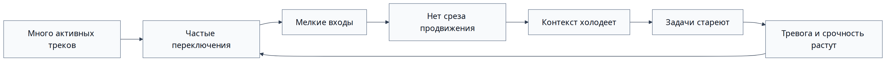{.diagram}


Граница схемы: она не запрещает переключения и не делает фокус моральным тестом. Она показывает цену тяжелых незавершенных контекстов, если они часто разрываются без контрольной точки и среза продвижения.

Разберем ее.

Сначала появляется много активных треков. Обычно не из глупости, а из ответственности. Все кажется важным. Ничего нельзя бросить. Хочется держать ситуацию под контролем.

Потом начинаются частые переключения. Человек пытается "хотя бы понемногу" касаться каждого трека.

Каждый вход становится мелким. Времени хватает на открытие задачи, чтение новых сообщений, поверхностную проверку, возможно один маленький шаг. Но не хватает на срез продвижения.

Без среза состояние задачи не улучшается. Контекст холодеет: при следующем входе придется снова поднимать, что было известно и зачем это делалось.

Задачи стареют. Чем дольше они висят, тем больше тревоги и больше кажущейся срочности.

Тревога заставляет чаще проверять и чаще переключаться.

Петля замыкается.

Внешне такой режим может выглядеть как высокая занятость. Внутри он переживается как потеря управляемости:

```text
я касаюсь всего,
но ничего не держу достаточно долго
```

## Минимальная полезная единица глубокого внимания

Не каждый контакт с задачей является полезной единицей фокуса.

Для простой задачи иногда достаточно короткого действия:

```text
ответить
проверить
переименовать
отправить
закрыть
```

Для сложной задачи контакт должен быть больше. Нужна минимальная полезная единица глубокого внимания.

Она состоит из пяти частей:

```text
вход
-> один вопрос или гипотеза
-> рабочий контакт
-> срез продвижения
-> контрольная точка
```

### Вход

Вход восстанавливает состояние:

- цель;
- текущее место;
- что уже известно;
- что неясно;
- первый шаг.

Если вход занимает весь блок, задача была плохо подготовлена или блок слишком короткий.

### Один вопрос или гипотеза

Глубокий блок не должен пытаться решить весь трек.

Формула:

```text
на один глубокий блок - один главный вопрос
или одна проверяемая гипотеза
```

Например:

```text
проверить, меняется ли состояние до внешнего вызова
```

лучше, чем:

```text
разобраться с интеграцией
```

### Рабочий контакт

Это основная часть блока: чтение, анализ, код, письмо, схема, эксперимент, решение.

Важно, чтобы этот контакт не дробился до первого сдвига. Если блок прервался до сдвига, следующий вход снова будет дорогим.

### Срез продвижения

Срез продвижения - это изменение состояния задачи.

Он не обязан быть завершением.

Срезом может быть:

- подтвержденный факт;
- закрытая гипотеза;
- найденная причина;
- уточненная зона тумана;
- принятое решение;
- отброшенный путь;
- сформулированный вопрос;
- подготовленная проверка;
- уменьшенная неопределенность;
- первый шаг на следующий блок.

Главное:

```text
после среза задача стала понятнее или управляемее
```

### Контрольная точка

Контрольная точка сохраняет срез во внешнем состоянии.

Минимальная форма:

```text
Сделал:
Узнал:
Остановился на:
Дальше:
```

Если контрольная точка не оставлена, часть среза снова уходит в голову. Тогда следующий вход будет опираться не на внешний след, а на надежду "я вспомню".

## Внешний контейнер состояния трека

В главах 4-6 уже был введен рабочий журнал. В этой главе он получает еще одну функцию: контейнер состояния для тяжелого трека.

Контейнер нужен не для красоты заметок. Он нужен, чтобы трек мог быть важным, но не жить постоянно в голове.

Шаблон:

```markdown
# Трек: ...

## Зачем это нужно
Что должно измениться, если трек продвинется?

## Текущее состояние
Где задача сейчас?

## Что известно
- ...

## Что непонятно
- ...

## Активная гипотеза или вопрос
- ...

## Принятые решения
- ...

## Отброшенные пути
- ...

## Последняя контрольная точка
Сделано:
Узнано:
Остановился:

## Следующий контакт
Когда вернуться и зачем?

## Первый шаг входа
Что открыть или сделать первым?

## Статус ожидания
Ждет чего? Кто owner? Когда проверить?
```

У хорошего контейнера есть две проверки.

Первая:

```text
можно ли по нему вернуться к задаче через день или неделю
```

Вторая:

```text
можно ли благодаря ему перестать держать задачу в голове сейчас
```

Если контейнер не помогает второму, он стал архивом. Он хранит историю, но не снижает WIP в голове.

## Срез продвижения против полного завершения

Одна из причин распыления - ложный выбор:

```text
или я завершу задачу,
или контакт был бесполезен
```

Для тяжелых задач это неверно.

Много важной работы движется через промежуточные срезы:

| Тип среза | Пример | Почему это продвижение |
| --- | --- | --- |
| Факт | "Событие до обработчика доходит". | Повторная проверка больше не нужна. |
| Закрытая гипотеза | "Проблема не в ретрае". | Сужается пространство поиска. |
| Уточненный туман | "Неясен именно порядок изменения состояния". | Общее сопротивление превращается в конкретный вопрос. |
| Решение | "Идем через вариант B, потому что A ломает обратную совместимость". | Снимается развилка. |
| Отброшенный путь | "Не используем ручную правку, слишком высокий риск". | Будущий вход не пойдет по кругу. |
| Подготовленный вопрос | "Нужно узнать у владельца системы X, идемпотентен ли вызов". | Появляется внешний следующий шаг. |
| Следующий вход | "Начать с файла N и проверить ветку ошибки". | Следующий блок дешевле. |

Срез продвижения особенно важен там, где полное завершение далеко.

Если ждать только завершения, задача долго выглядит неподвижной. Это повышает тревогу, а тревога подталкивает к новым переключениям.

Если фиксировать срезы, задача может быть незавершенной, но управляемой.

## Один глубокий трек сейчас не значит один важный трек в жизни

Важно не превратить эту главу в культ одного дела.

В жизни и работе почти всегда есть несколько важных направлений. У инженера может быть разработка, ревью, поддержка, документация и обучение. У лида - люди, процесс, архитектура, найм, операционные риски. У автора - исследование, текст, редактура, публикация.

Проблема не в множественности сама по себе.

Проблема в смешении двух уровней:

```text
портфель важных треков
```

и

```text
текущий глубокий контакт
```

Портфель может быть широким. Текущий глубокий контакт должен быть узким.

Рабочая формула:

```text
один тяжелый трек в глубоком внимании сейчас,
остальные тяжелые треки - во внешнем состоянии
с точкой следующего контакта
```

Это не отказ от ответственности за остальные треки. Наоборот, это более надежный способ их удерживать.

Когда трек живет в голове, он конкурирует за внимание каждую минуту.

Когда трек живет в контейнере состояния, он ждет своего контакта.

## Личный WIP-лимит

WIP-лимит не должен быть магическим числом.

Нет универсального правила:

```text
у всех должно быть не больше N задач
```

Разные роли, уровни сложности, периоды и состояния требуют разных лимитов.

Но полезно различить три слоя личного WIP.

| Слой | Что входит | Признак перегруза |
| --- | --- | --- |
| Глубокий WIP | Тяжелые треки, требующие анализа, проектирования, письма, решения. | Больше одного трека одновременно требует "держать в голове". |
| Оперативный WIP | Быстрые ответы, координация, ревью, мелкие блоки. | Оперативка съедает первый глубокий вход дня. |
| Фоновый WIP | Ожидания, отложенные решения, будущие темы. | Нет внешнего контейнера, все живет тревожным напоминанием. |

Личный WIP-лимит начинается не с запрета брать задачи. Он начинается с вопроса:

```text
что я пытаюсь держать активным прямо сейчас
```

Минимальная практика:

1. Выписать все треки, которые занимают голову.
2. Отметить, какие из них требуют глубокого внимания.
3. Выбрать один глубокий трек на ближайший блок.
4. Для остальных записать состояние и следующий контакт.
5. Отдельно выделить настоящие срочные сигналы.

Если после этого тревога не снижается, возможно, проблема не в заметках. Возможно, обязательств действительно больше, чем пропускная способность системы.

Тогда WIP-лимит должен стать разговором о нагрузке, сроках и приоритетах, а не личной техникой самоконтроля.

## Срочность и шум

Прерывания особенно разрушительны, когда человек не может заранее понять, что действительно требует переключения.

Если любой входящий сигнал может оказаться срочным, приходится проверять все:

```text
а вдруг там пожар
а вдруг от меня ждут решения
а вдруг нельзя откладывать
```

Проверка уже является переключением. Даже если сообщение оказалось неважным, часть фокуса потрачена.

Поэтому срочность должна быть вынесена в форму сигнала.

Минимальный формат срочного прерывания:

| Поле | Вопрос |
| --- | --- |
| Severity | Насколько это критично? |
| Impact | Что ломается или рискует, если ждать? |
| Deadline | До какого времени нужен ответ или действие? |
| Needed action | Что именно нужно от адресата? |
| Owner | Кто ведет ситуацию? |
| Context | Где минимальная ссылка на факты? |

Пример структуры:

```text
Severity: high
Impact: заблокирован релиз / падает важный сценарий / остановлена работа команды
Needed action: подтвердить решение A или B
Deadline: до 14:00
Owner: ...
Context: ссылка
```

Здесь не важны конкретные названия полей. Важна функция:

```text
человек должен понять цену ожидания
до того как он разрушит текущий фокус
```

Если срочность спрятана внутри длинного сообщения, канал заставляет всех читать все. Это превращает коммуникацию в генератор прерываний.

## Как прерываться, когда действительно нужно

Иногда прерывание необходимо.

Есть инциденты, срочные решения, поддержка, безопасность, помощь человеку, deadline, который нельзя перенести.

Цель когнитивного инженерства не в том, чтобы запретить такие события. Цель в том, чтобы снизить ущерб.

Если нужно прерваться, полезна мини-контрольная точка:

```text
Я сейчас:
Проверял:
Успел понять:
Следующий шаг после возврата:
```

Это может занять 30-90 секунд. Иногда даже меньше.

Если прерывание действительно критично, может не быть и этих 30 секунд. Тогда после срочного события нужно первым делом восстановить место разрыва:

```text
какую задачу я бросил
где была мысль
что нужно записать,
чтобы не держать это в голове
```

Прерывание становится особенно дорогим, когда оно не только разрывает текущий блок, но и не получает последующего закрытия.

Тогда остаются две незавершенности:

- старая задача не закрыта контрольной точкой;
- срочная задача не закрыта итогом.

Так накапливается внутренний шум.

## Командный фокус

Личный фокус не существует в вакууме.

Если среда постоянно требует немедленных ответов, личные техники быстро становятся косметикой. Человек может завести идеальный рабочий журнал, но если любое сообщение потенциально требует реакции сейчас, глубокий контакт все равно будет рваться.

Командный фокус проектируется через правила потока.

### 1. "В работе" должно означать следующий кусок

Для активной задачи полезно иметь ответ:

```text
какой следующий содержательный кусок продвижения
```

Если ответа нет, задача может быть:

- не готова к работе;
- заблокирована;
- требует разборки;
- слишком большая;
- взята слишком рано;
- висящая без реального владельца.

Тогда честнее не держать ее как активную, а изменить статус или записать причину ожидания.

### 2. Aging задач нужно смотреть без наказания

Стареющая активная задача - это сигнал, а не повод обвинять.

Она может стареть, потому что:

- размер слишком большой;
- фокус разорван;
- слишком много внешних ожиданий;
- неясен критерий продвижения;
- человек перегружен;
- задача неправильно подготовлена;
- есть скрытая неопределенность.

Разбор стареющих задач должен спрашивать:

```text
что мешает следующему срезу продвижения
```

а не:

```text
почему ты еще не закончил
```

### 3. Глубокую работу и оперативные ответы нужно разводить

Если роль требует и глубокой работы, и оперативной реакции, нужно проектировать режимы.

Например:

```text
окна глубокого фокуса
окна ответов
дежурный канал для настоящей срочности
асинхронные обновления по несрочным вопросам
```

Конкретная форма зависит от команды. Принцип один:

```text
если все каналы одинаковы,
все сообщения становятся потенциальным прерыванием
```

### 4. Срочное должно иметь отдельную форму

Команда не обязана запрещать срочность. Она должна сделать срочность узнаваемой.

Если срочно, сигнал должен нести:

- уровень важности;
- влияние;
- срок;
- что требуется от адресата;
- кто владелец;
- где контекст.

Тогда человек может принять решение:

```text
прерваться сейчас
оставить мини-контрольную точку
или отложить до ближайшего окна ответа
```

### 5. Тяжелые треки должны иметь контейнер состояния

Командный контейнер не обязан быть большим документом.

Но у тяжелого трека должны быть:

- цель;
- текущий статус;
- последние решения;
- открытые вопросы;
- блокеры;
- следующий кусок;
- владелец;
- дата следующего контакта.

Это снижает зависимость от памяти одного человека и уменьшает цену возвращения после встреч, переключений, отпусков, дежурств и инцидентов.

## Ширина и глубина

Иногда важные дела действительно требуют чередования.

Нельзя всегда выбрать одно направление и игнорировать остальные. Важная операционная задача может угрожать стратегической. Поддержка может быть частью ответственности. Люди, процессы и риски не ждут идеального фокусного окна.

Поэтому полезно различать два режима.

Ширина:

```text
несколько важных треков получают краткий управляемый контакт,
чтобы не потерять состояние и не пропустить риск
```

Глубина:

```text
один трек получает достаточно внимания,
чтобы появился срез продвижения
```

Ошибка - пытаться жить только в одном режиме.

Если есть только глубина, часть важных треков может выпасть из поля зрения.

Если есть только ширина, все треки будут понемногу касаться сознания, но ни один не станет существенно лучше.

Рабочая форма:

```text
ширина поддерживает карту,
глубина создает сдвиг
```

Ширина должна отвечать на вопросы:

- какие треки существуют;
- где риск;
- что ждет;
- где следующий контакт;
- что стало срочным.

Глубина должна отвечать на другой вопрос:

```text
какой один трек сейчас получит срез продвижения
```

## Практика: WIP-карта внимания

Простой способ применить главу - составить WIP-карту внимания.

Не карту задач вообще, а карту того, что занимает активное внимание.

Шаблон:

| Трек | Режим | Сейчас в голове? | Следующий срез | Контейнер есть? | Следующий контакт |
| --- | --- | --- | --- | --- | --- |
| ... | deep / operational / waiting / coordination | да / нет | ... | да / нет | ... |

Режимы:

| Режим | Что означает |
| --- | --- |
| deep | Требует глубокого блока и среза продвижения. |
| operational | Требует ответов, координации, коротких решений. |
| waiting | Ждет внешнего события, решения или ответа. |
| coordination | Требует синхронизации людей и договоренностей. |
| parked | Важно, но сознательно не сейчас. |

После заполнения карты нужно посмотреть не на количество строк, а на количество строк, которые:

```text
одновременно требуют глубокого внимания
и не имеют контейнера состояния
```

Это и есть опасный WIP в голове.

## Практика: правило одного среза

Для каждого глубокого блока можно ввести правило:

```text
не выходить из блока без одного среза продвижения
или честной контрольной точки о том, почему срез не получился
```

Это не означает "всегда заканчивать задачу".

Это означает:

```text
после блока состояние должно быть зафиксировано
```

Примеры хорошего результата блока:

```text
закрыл гипотезу
нашел место ошибки
уточнил вопрос
собрал факты
принял решение
подготовил запрос
оставил точный следующий шаг
```

Пример плохого результата:

```text
посмотрел немного там и там,
надо будет потом еще разобраться
```

Такой итог может быть честным, если задача оказалась туманнее, чем казалось. Но тогда нужно записать:

```text
что именно оказалось туманным
как разделить это на вопросы
с чего начать следующий вход
```

## Практика: личный протокол переключения

Перед запланированным переключением:

```text
1. Что я сейчас делал?
2. Что изменилось в состоянии задачи?
3. Какой следующий физический шаг?
4. Где лежит рабочий артефакт?
5. Когда я вернусь или что должно случиться для возврата?
```

Если времени мало, минимальная версия:

```text
Остановился:
Дальше:
```

После прерывания:

```text
1. Закрыть срочное событие коротким итогом.
2. Найти задачу, которую оно разорвало.
3. Восстановить состояние по контрольной точке.
4. Решить: возвращаюсь сейчас или ставлю следующий контакт.
```

Эта практика не делает прерывания приятными. Она делает их менее разрушительными.

## Когда фокус не чинится личными приемами

Есть ситуации, где проблема не в том, что человек плохо управляет WIP.

Например:

- реально слишком много обязательств;
- роль построена на постоянной реактивности;
- отсутствует право сказать "не сейчас";
- сроки противоречат доступной пропускной способности;
- команда не различает срочность и шум;
- любое ожидание воспринимается как провал;
- человек уже ниже ресурсного пола;
- восстановление не успевает;
- организационная среда постоянно поднимает угрозу.

В этих случаях личная техника может помочь немного, но не решит системную проблему.

Тогда вопрос меняется.

Не:

```text
как мне лучше сфокусироваться
```

А:

```text
какие обязательства, правила коммуникации и WIP нужно изменить,
чтобы глубокая работа вообще стала возможна
```

Это важный предохранитель. Когнитивное инженерство не должно превращаться в способ адаптировать человека к бесконечной перегрузке.

## Что это добавляет к учебнику

К этому месту учебник уже показал:

- сложная задача должна иметь внешнее состояние;
- вход и выход нужно делать частью рабочего цикла;
- мотивация зависит от цены усилия и управляемости;
- восстановление поддерживает будущую доступность действия;
- продуктивность в этой рамке оставляет ценный сдвиг и следующий вход.

Глава 21 добавляет слой управления активными контекстами.

Главная мысль:

```text
фокус - это не держать больше в голове,
а держать меньше в активном состоянии
и лучше сохранять все остальное снаружи
```

Устойчивый рабочий режим выглядит так:


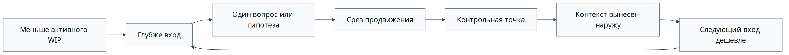{.diagram}


Эта финальная схема не обещает идеальный день без срочности. Она задает нормальный протокол хранения контекста: меньше активного WIP, глубже вход, срез продвижения, контрольная точка и дешевый возврат.

Это не делает работу простой. Оно делает сложность управляемой.

После этого становится видно, почему дальше нужны ресурсность, сила и ритуалы. WIP-лимиты, контрольные точки, глубокие блоки и правила прерываний работают только тогда, когда у системы есть состояние, в котором эти правила можно выполнять. Если ресурсный режим просел, даже хорошая схема фокуса начинает требовать слишком много силы.

## Короткое резюме

- Фокус - это контакт с одним рабочим контекстом, а не абстрактное напряжение внимания.
- WIP в голове опасен тем, что несколько незавершенных контекстов одновременно требуют памяти о цели, тревожного мониторинга и повторного входа.
- Переключение стоит не только времени, но и восстановления цели, правил, контекста и состояния задачи.
- Внешний контейнер состояния нужен не вместо работы, а чтобы отложенная задача не жила фоном в голове.
- Командный фокус создается правилами WIP, контрольных точек, срочности и ожиданий, а не лозунгом "не отвлекайтесь".

## Вопросы для самопроверки

1. Чем WIP в задачах отличается от WIP в голове?
2. Почему статус "в работе" не доказывает реального продвижения?
3. Что должно быть в контрольной точке, чтобы следующий вход стал дешевле?
4. Как отличить управляемое переключение от разрушительного прерывания?
5. Какие входящие сигналы в вашей среде являются настоящей срочностью, а какие только шумом?

## Мини-практика

Составьте WIP-карту внимания на один день:

```text
активные тяжелые треки:
что реально требует глубокого входа:
что можно вынести в контейнер состояния:
какой трек получает первый срез продвижения:
какие входящие считаются срочными:
какие входящие можно проверять по расписанию:
какая контрольная точка нужна перед выходом:
```

Если активных тяжелых треков больше трех, не начинайте с героического фокуса. Сначала выберите, какой один трек сегодня должен получить содержательный сдвиг.

---

# Глава 22. Ресурсность, сила и ритуалы

## Почему правил фокуса недостаточно

Предыдущая глава разобрала фокус, WIP и переключения.

Главный вывод был таким:

```text
фокус - это не держать больше в голове,
а держать меньше в активном состоянии
и лучше сохранять все остальное снаружи
```

Для этого нужны понятные правила:

- ограничивать активный WIP;
- выбирать один глубокий трек на ближайший блок;
- входить через внешний контейнер состояния;
- работать до среза продвижения;
- оставлять контрольную точку;
- отличать срочность от шума;
- не разрывать глубокий блок без причины.

Но у этих правил есть скрытое условие.

Их нужно выполнять в каком-то состоянии.

Если человек ниже ресурсного пола, даже простое правило начинает ощущаться как тяжелая работа. Открыть контейнер задачи трудно. Прочитать контрольную точку трудно. Не открыть новости трудно. Начать первый шаг трудно. Не сорваться в чат трудно. Оставить контрольную точку трудно.

Снаружи это может выглядеть как нехватка дисциплины.

Внутри это часто выглядит иначе:

```text
я понимаю, что надо делать,
но запуск стоит слишком дорого
```

Здесь нужно разобрать состояние, в котором правила фокуса становятся исполнимыми.

В учебнике это состояние называется ресурсностью.

## Ресурсность - не настроение

Слово "ресурсность" легко испортить.

Можно представить его как приятное состояние:

```text
я бодрый
я вдохновлен
мне хочется работать
я на подъеме
```

Иногда это действительно бывает. Хорошее настроение, интерес, энергия, ясность и телесный тонус помогают действовать.

Но для когнитивного инженерства такое определение слишком ненадежно.

Во-первых, настроение может быть хорошим, а режим плохим. Человек может быть возбужден, вдохновлен, наполнен планами, но плохо спать, хватать лишний WIP, не держать границы и покупать сегодняшний разгон завтрашним провалом.

Во-вторых, настроение может быть нейтральным, а режим рабочим. Не обязательно чувствовать эйфорию, чтобы начать важный блок, удержать внимание и оставить нормальную контрольную точку.

Поэтому ресурсность здесь определяется не переживанием, а функцией.

Ресурсность - это рабочий режим, в котором:

- следующий понятный шаг можно начать без чрезмерного внутреннего продавливания;
- внимание можно удержать достаточно долго для первого сдвига;
- вскрывшиеся промежуточные шаги не воспринимаются как катастрофа;
- пауза помогает вернуться, а не уводит в другой контекст;
- к концу дня можно объяснить, куда ушло внимание;
- восстановление реально снижает цену следующего входа.

Коротко:

```text
ресурсность = низкая цена входа, удержания и возврата
```

Это не означает, что работа становится легкой. Сложная задача все равно может быть неприятной, длинной и неопределенной.

Но ресурсный режим делает ее доступной.

## Ресурсный пол и ресурсность

В главе 20 мы уже ввели ресурсный пол.

Ресурсный пол - это минимум состояния, ниже которого действие становится слишком дорогим или разрушительным.

Примерно:

```text
я еще могу работать так,
чтобы не ломать следующий вход
```

Ресурсность - более широкий режим.

Она отвечает не только на вопрос "можно ли вообще работать", а на вопрос:

```text
насколько воспроизводимо я могу входить,
держать контакт,
получать сдвиг
и возвращаться после паузы
```

Различение:

| Слой | Вопрос | Признак |
| --- | --- | --- |
| Ресурсный пол | Не ниже ли система минимума доступности действия? | Работа не покупается разрушением сна, здоровья, качества и следующего входа. |
| Ресурсность | Есть ли рабочий режим с приемлемой ценой входа и возврата? | Начать понятный шаг можно без долгого самопродавливания. |
| Сила | Есть ли входной запас для первых минут сопротивления? | Легче пересечь стартовое трение и не сорваться в быстрый стимул. |

Ресурсный пол - это нижняя граница.

Ресурсность - это рабочий режим.

Сила - это входной запас внутри этого режима.

Эти три вещи нельзя смешивать.

Если человек ниже пола, ему не поможет героический ритуал.

Если пол есть, но ресурсный режим не собран, день будет начинаться каждый раз с тяжелого разгона.

Если режим в целом есть, но мало силы, может не хватать именно входной инициативы: первый шаг кажется слишком тяжелым, хотя после входа работа пошла бы.

## Сила как входной запас

Слово "сила" тоже легко увести в морализм.

В быту оно звучит так:

```text
сильный человек берет и делает
слабый человек не справляется
```

Для учебника такая рамка не годится.

В когнитивном инженерстве сила - это не оценка личности. Это входной запас энергии, инициативы и устойчивости к первому сопротивлению.

Сила нужна в начале блока.

Она помогает:

- не отложить понятный шаг;
- открыть рабочий контейнер, а не ленту;
- выдержать первые минуты тумана;
- не испугаться вскрывшегося промежуточного шага;
- выбрать действие вместо внутреннего торга;
- вернуться после короткой паузы;
- закрыть блок контрольной точкой, когда уже хочется просто уйти.

Сила особенно заметна в переходах.

Когда человек уже внутри задачи и контекст собран, работа может идти легче. Но чтобы попасть внутрь, нужно пересечь входное сопротивление.

Отсюда важное следствие:

```text
силу не нужно тратить на то,
что можно спроектировать средой, ритуалом или внешним контекстом
```

Если задача каждый раз требует героического входа, это плохой дизайн рабочего контура.

Сила должна помогать пройти начало, но не обязана нести весь день на себе.

## Что поднимает и что просаживает входной запас

Внутренние заметки о продуктивности перечисляют разные факторы: сон, вода, движение, медитация, чтение, общение, самоподдержка, ограничения, а также то, что просаживает режим: шум, бесконтрольные переключения, новости, игры, сладкая еда, кофе как краткий разгон ценой последующей просадки.

Здесь нельзя превращать этот список в универсальный рецепт.

Для разных людей и периодов конкретные факторы будут различаться. Кроме того, часть факторов требует медицинской, бытовой или контекстной проверки. Эта глава не должна давать протокол здоровья.

Но можно выделить общие классы.

| Класс | Как помогает | Где риск |
| --- | --- | --- |
| Сон и восстановление | Возвращают систему выше ресурсного пола. | Недосып нельзя надежно компенсировать ритуалом. |
| Движение | Может поднять тонус, внимание, настроение и телесную готовность. | Не должно становиться еще одной обязанностью сверх восстановления. |
| Вода, еда, телесная базовая забота | Снижает лишние телесные причины просадки. | Нельзя превращать в псевдомедицинские обещания. |
| Защита внимания | Сохраняет входной запас от шума и быстрых стимулов. | Слишком жесткая изоляция может ломать реальные обязанности. |
| Интерес и смысл | Поддерживают инициативу и переживание ценности времени. | Вдохновение не заменяет структуру действия. |
| Общение и поддержка | Возвращают связанность и нормализуют состояние. | Социальность может стать обходом трудного входа. |
| Осознанность / медитация | Может помогать некоторым людям снижать напряжение и замечать состояние до импульсивного действия. | Данные неоднородны; это не универсальная починка фокуса, мотивации или сна. |
| Кофеин | Может кратко поднять бдительность и устойчивость к монотонному наблюдению, особенно при усталости. | Не восстанавливает систему; может ухудшать сон, тревожность и будущий вход. |
| БАДы и омега-3 | Могут быть медицинским или пищевым вопросом в конкретном контексте. | Не должны входить в учебник как общий способ улучшить когнитивную работу. |
| Ограничения | Уменьшают импульсивное распыление. | Ограничение ради борьбы может добавить лишнюю цену. |

У сна здесь есть два разных слоя.

Первый — недосып. Если система недоспала, особенно страдают бдительность и устойчивое внимание, а при более выраженном недосыпе дорожают рабочая память, торможение и гибкость. Это значит, что утренний ритуал не должен маскировать плохое состояние красивой процедурой. Иногда правильный вход — не героический глубокий блок, а сужение задачи, подготовка среды, сбор контекста и перенос самой дорогой части.

Второй — циркадное окно. Одна и та же задача может иметь разную цену в разное время суток. Это не повод строить жесткую типологию "я сова, значит могу только ночью" или "правильные люди работают только утром". Это повод проектировать рабочий режим честнее:

```text
дорогие задачи ставить туда,
где у системы больше шансов удержать внимание,
а не туда, где календарь случайно оставил дырку
```

Отдельно нужно сказать про трекеры: HRV, оценку сна, оценку готовности и похожие метрики.

Они могут быть полезны как внешние сигналы. Иногда они помогают заметить, что последние дни были тяжелее, чем казалось: сон хуже, восстановление ниже, нагрузка выше, организм реагирует. Это ценно, потому что человек часто привыкает к просадке и считает ее нормой.

Но метрика не должна становиться маленьким начальником рабочего дня.

Плохая формула:

```text
низкий HRV -> нельзя делать сложное
высокая оценка готовности -> можно давить сильнее
```

Рабочая формула:

```text
метрика дала сигнал -> проверяю контекст ->
сравниваю с поведением -> выбираю формат входа
```

Если HRV или оценка готовности ниже обычного, можно спросить:

- что было со сном;
- есть ли болезнь или физическая нагрузка;
- не накопился ли WIP;
- не было ли алкоголя, поздней еды, смены режима, стресса;
- какая задача сегодня самая дорогая;
- можно ли начать ее меньшим шагом;
- что покажет реальное поведение в первые 10-20 минут.

Иногда ответом будет отдых. Иногда - облегченный вход. Иногда - обычная работа, но без расширения WIP. Иногда - перенос самого дорогого решения. Главное, чтобы число не заменяло наблюдение за системой.

Главный принцип:

```text
фактор полезен,
если снижает цену входа в нужный режим
и не повышает будущую цену восстановления
```

Если короткий стимул помогает начать, но затем увеличивает рассеянность, тревогу, недосып или вечерний откат, это не ресурсность. Это заем.

То же правило относится к более "мягким" практикам и добавкам. Практика осознанности может быть полезным наблюдением за состоянием, но она не заменяет сон, разгрузку WIP, восстановление и работу с угрозой. Кофеин может дать короткий подъем бдительности, но не доказывает, что система восстановлена. БАДы, включая омега-3, не должны становиться учебниковым советом по улучшению мышления: для таких решений важны здоровье, питание, противопоказания и профессиональная оценка, а не красивая когнитивная метафора.

## Петля ресурсного режима

Ресурсность лучше понимать как петлю.

Вопрос схемы:

```text
как состояние, ритуал входа, первый блок, пауза и выход
поддерживают друг друга,
чтобы ресурсность была рабочим режимом, а не настроением?
```


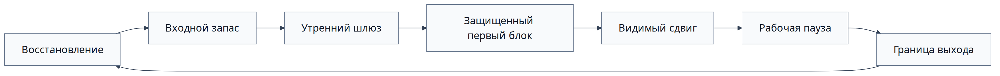{.diagram}


Граница схемы: это не расписание "правильного человека" и не новый список обязанностей. Узлы петли можно реализовать по-разному; важна функция - снижать цену входа и будущего восстановления.

Разберем ее.

### Восстановление

Восстановление возвращает систему к состоянию, где действие вообще доступно.

Это не награда после работы и не роскошь. Это условие повторяемости.

Если восстановление не происходит, человек может какое-то время держаться на тревоге, долге, обещаниях и внешнем давлении. Но цена входа будет расти.

В таком режиме сила тратится не на трудное действие, а на преодоление поврежденного состояния.

### Входной запас

После восстановления появляется запас, с которым можно войти в день.

Он не обязан быть большим. Часто достаточно, чтобы человек мог:

- встать без долгого внутреннего торга;
- не начать день с шумного канала;
- выбрать первый блок;
- выдержать первые минуты без немедленного облегчения.

Если входного запаса нет, утро начинает искать суррогаты: новости, переписки, подготовительные мелочи, кофе, быстрые удовольствия, бесконечное планирование.

### Утренний шлюз

Утренний шлюз переводит человека из бытового режима в рабочий.

Это может быть короткий ритуал, но его задача не в том, чтобы выполнить красивый список действий.

Его задача:

```text
сделать первый важный блок возможным
```

Если ритуал не приводит к блоку, он не шлюз, а отдельная активность.

### Защищенный первый блок

Первый блок дня часто несет большую цену.

Если он отдан чатам, новостям, мелочам или чужим ожиданиям, рабочий режим может так и не собраться.

Защищенный первый блок не обязательно должен быть длинным. Но он должен дать:

- вход в один выбранный контекст;
- один вопрос или кусок продвижения;
- минимум переключений до первого сдвига;
- контрольная точка на выходе.

### Видимый сдвиг

Ресурсный режим укрепляется, когда человек видит, что действие что-то изменило.

Не обязательно завершение. Достаточно среза:

- стал ясен следующий шаг;
- закрыта гипотеза;
- собраны факты;
- написан кусок текста;
- принято решение;
- уменьшилась неопределенность.

Без видимого сдвига ритуалы и дисциплина начинают ощущаться как пустой контроль.

### Рабочая пауза

Рабочая пауза нужна, чтобы снять часть нагрузки и вернуться в тот же режим.

Она отличается от полноценного отдыха.

Полноценный отдых может вывести человека в другой жизненный контекст. Это нужно и правильно. Но внутри рабочего дня такая смена режима может потребовать нового полного входа.

Рабочая пауза устроена иначе:

```text
восстановиться немного,
не потеряв рабочую орбиту
```

Например, отойти от экрана, пройтись, подышать, сменить позу, выпить воды, посмотреть вдаль. Конкретная форма индивидуальна. Важна функция: после паузы вернуться дешевле.

### Граница выхода

День должен уметь заканчиваться.

Если вечер постоянно превращается в компенсацию плохо собранного дня, восстановление срезается. Следующий день начинается дороже. Потом снова нужен вечерний нажим.

Граница выхода защищает не лень, а будущий вход.

Минимальный выход:

```text
что сегодня сдвинулось
что осталось открытым
где следующий вход
что нужно восстановить до завтра
```

## Петля ложной ресурсности

Теперь посмотрим на противоположную петлю.

Вопрос второй схемы:

```text
как недовосстановление маскируется под подготовку,
разгон и занятость,
но делает следующий день тяжелее?
```


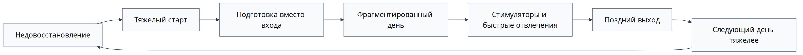{.diagram}


Начинается она с недовосстановления.

Человек просыпается уже с долгом. Тело не собрано. Внимание вязкое. Первый шаг кажется слишком дорогим.

Потом появляется тяжелый старт. Нужно бы войти в важный блок, но вход неприятен.

На месте входа появляется подготовка:

- еще немного почитать;
- еще раз распланировать;
- проверить сообщения;
- открыть несколько вкладок;
- навести порядок;
- "сначала разогнаться";
- найти правильное настроение.

Некоторая подготовка действительно нужна. Но подготовка становится проблемой, когда не имеет точки перехода в действие.

Дальше день фрагментируется. Мелкие задачи, входящие сообщения и короткие стимулы дают ощущение движения, но не собирают глубокий контекст.

Затем подключаются стимуляторы и быстрые отвлечения. Они могут дать краткий разгон или облегчение. Но если они ухудшают сон, внимание, границы и возвращение к задаче, они не восстанавливают ресурсность, а маскируют ее просадку.

Вечером человек пытается догнать день. Поздний выход срезает восстановление.

На следующий день старт еще тяжелее.

Это петля не "плохого характера", а плохой экономики состояния.

## Ритуал состояния и ритуал задачи

В главе 6 мы уже говорили о ритуалах входа и выхода.

Там речь шла о ритуале задачи:

```text
открыть рабочий журнал
восстановить цель и состояние
назвать туман
выбрать первый проверяемый шаг
оставить контрольную точку на выходе
```

В этой главе появляется другой тип: ритуал состояния.

Его задача:

```text
перевести человека из одного режима в другой
```

Например:

- из сна и бытового утра в рабочий день;
- из рассеянности в первый фокусный блок;
- из рабочего блока в рабочую паузу;
- из рабочего дня в восстановление.

Различение:

| Ритуал | Что переводит | Главный критерий |
| --- | --- | --- |
| Ритуал состояния | Человека между режимами. | После него легче войти в нужный режим. |
| Ритуал задачи | Рабочее состояние конкретной задачи. | После него легче продолжить конкретную задачу. |

Оба типа нужны.

Если есть ритуал состояния, но нет ритуала задачи, человек может быть бодрым, но не знать, куда приложить внимание.

Если есть ритуал задачи, но нет состояния, человек может понимать следующий шаг, но не иметь входного запаса.

## Утренний шлюз

Утренний ритуал - частный случай ритуала состояния.

Лучше называть его утренним шлюзом.

Слово "шлюз" здесь полезнее, чем "зарядка" или "мотивация", потому что оно подчеркивает переход:

```text
бытовой режим -> рабочий режим
```

Утренний шлюз должен решать несколько задач:

1. Завершить рассеянное начало дня.
2. Дать телу простой сигнал запуска.
3. Не открыть шум до первого важного блока.
4. Поднять карту дня на минимальном уровне.
5. Выбрать первый рабочий контекст.
6. Довести человека до действия.

Он не обязан быть длинным.

Более того, длинный ритуал может стать ловушкой.

Если человек час собирает себя, но затем не входит в важный блок, ритуал стал отдельным проектом.

Рабочий критерий:

```text
после утреннего шлюза первый важный блок начался дешевле,
чем без него
```

Не:

```text
я идеально выполнил список
```

Пример минимального утреннего шлюза:

```text
1. Телесный старт: вода, движение, свет, базовая гигиена.
2. Сборка внимания: короткое чтение или recall без открытия шумных каналов.
3. Выбор первого блока: один трек, один вопрос, один первый шаг.
4. Переход к задаче: открыть контейнер, прочитать контрольную точку, начать.
```

Конкретные пункты можно менять. Нельзя менять функцию:

```text
ритуал должен заканчиваться входом в действие
```

## Привычка фокуса

Привычка - это не магическое исчезновение усилия.

Привычка возникает, когда поведение многократно повторяется в похожем контексте и постепенно начинает запускаться легче по сигналу среды.

Для когнитивного инженерства это важно.

Если каждый день начинается по-разному, в разных каналах, с разной логикой, без стабильного первого шага, фокус каждый раз приходится собирать заново.

Если же есть устойчивый сигнал, действие и выход, система начинает узнавать маршрут.

Например:

```text
если начался первый рабочий слот,
то я открываю контейнер выбранного трека,
читаю последнюю контрольную точку,
выбираю один вопрос
и работаю до первого среза
```

Это не гарантирует идеального фокуса. Но снижает цену запуска.

Привычка фокуса строится из нескольких элементов.

| Элемент | Вопрос |
| --- | --- |
| Контекст | В какой ситуации привычка должна запускаться? |
| Сигнал запуска | Какой сигнал говорит: "начинаем"? |
| Первое действие | Что настолько мало и ясно, что его можно сделать даже без вдохновения? |
| Защита | Что не должно попасть в этот момент? |
| Срез | Как понять, что блок не был пустым? |
| Выход | Что оставить для следующего входа? |

Пример:

```text
Контекст: первый рабочий слот после утреннего шлюза.
Сигнал запуска: ноутбук открыт, календарь проверен, шумные каналы закрыты.
Первое действие: открыть заметку выбранного трека.
Защита: не открывать чат до первой контрольной точки.
Срез: закрыта одна гипотеза или выбран следующий шаг.
Выход: записать "остановился / дальше".
```

Здесь нет героизма. Есть повторяемый маршрут.

## Почему "21 день" - плохая опора

Популярная культура любит точные числа:

```text
привычка формируется за 21 день
```

Для серьезного учебника так писать нельзя.

Реальное формирование привычек зависит от поведения, контекста, сложности, повторяемости, пропусков, награды, среды и состояния человека. Простая привычка может автоматизироваться быстрее. Сложная рабочая практика - значительно дольше и не полностью.

Кроме того, привычка фокуса не похожа на привычку выпить стакан воды после завтрака.

Фокусный блок включает:

- восстановление состояния задачи;
- подавление альтернатив;
- удержание цели;
- работу с неопределенностью;
- срез продвижения;
- оставление контрольной точки.

Это составная практика. Она может стать более привычной, но не станет полностью автоматической.

Поэтому цель не:

```text
сделать фокус автоматическим навсегда
```

А:

```text
снизить цену повторяемого входа
```

## Дисциплина как возвращение

Дисциплину тоже часто понимают плохо.

Обычная суровая версия звучит так:

```text
дисциплина - это заставлять себя делать нужное,
несмотря ни на что
```

В ней есть часть правды: иногда действие действительно нужно делать без идеального настроения.

Но если остановиться только здесь, дисциплина превращается в культ нажима.

В когнитивном инженерстве дисциплина - это способность возвращаться к выбранному режиму.

Не идеально держать режим каждый день.

А именно возвращаться.

Потому что сбои будут:

- плохой сон;
- срочное событие;
- затянувшаяся встреча;
- тревожный сигнал;
- усталость;
- ошибка;
- слишком большая задача;
- непредвиденный внешний запрос;
- день, когда интерес ниже обычного.

Если дисциплина понимается как идеальность, любой сбой превращается в поражение.

Если дисциплина понимается как возвращение, сбой становится материалом настройки.

Формула:

```text
дисциплина = заметить отклонение
-> назвать уровень сбоя
-> выбрать ближайший возврат
-> изменить среду или следующий шаг
-> продолжить без самообвинения
```

Это не мягкость. Это более точная инженерная логика.

Самообвинение часто не возвращает режим. Оно добавляет угрозу. Угроза может временно мобилизовать, но повышает цену следующего входа.

Дисциплина как возвращение спрашивает:

```text
где ближайшая точка входа обратно в режим
```

## Прививка дисциплины

В старых заметках есть выражение "прививка дисциплины".

Его можно сохранить, если понимать правильно.

Прививка дисциплины - это не наказание объемом и не доказательство силы характера.

Это тренировка повторяемого возвращения к режиму.

Например, ориентиры вроде:

```text
6 часов продуктивного рабочего времени
2 часа чистого фокуса на обучение
```

нельзя превращать в универсальную норму. В другом календаре, другой роли, другом состоянии и другой нагрузке такие числа могут быть неподходящими.

Но в них есть полезная идея:

```text
режим должен иметь повторяемую практику,
а не существовать только в дни вдохновения
```

Дисциплинарная практика должна проверяться двумя вопросами.

Первый:

```text
она делает профессиональный режим более повторяемым?
```

Второй:

```text
она не ломает восстановление и следующий вход?
```

Если практика укрепляет режим, она полезна.

Если превращается в еще одну норму для самонаказания, она начинает работать против учебника.

## Ситуационный самоконтроль

Самоконтроль часто представляют как внутреннюю борьбу:

```text
я хочу отвлечься,
но силой запрещаю себе
```

Иногда такая борьба нужна. Но проектировать весь рабочий режим вокруг постоянной борьбы - плохая идея.

Надежнее снижать вероятность борьбы заранее.

Это называется ситуационным уровнем самоконтроля.

Примеры:

- не открывать шумные каналы до первого блока;
- убрать быстрые развлечения из рабочего окружения;
- подготовить контейнер задачи вечером;
- заранее выбрать первый рабочий трек;
- держать рабочую паузу без личного контента;
- сделать нужный первый шаг физически ближе;
- сделать отвлечение чуть менее доступным;
- договориться о канале настоящей срочности.

Такие решения не делают человека слабее. Они экономят силу.

Формула:

```text
хороший самоконтроль начинается до момента искушения
```

Если каждое утро приходится заново бороться с телефоном, новостями, чатами, хаосом вкладок и неопределенным первым шагом, система тратит силу до начала работы.

Когнитивное инженерство спрашивает:

```text
какую часть борьбы можно заменить устройством среды
```

## Ритуал или подготовительная прокрастинация

У ритуалов есть опасная сторона.

Они могут стать способом не начинать.

Человек говорит:

```text
сначала надо собраться
сначала надо привести систему в порядок
сначала надо прочитать
сначала надо настроиться
сначала надо выбрать идеальный план
```

Иногда это правда. Но часто это подготовительная прокрастинация.

Отличие простое:

| Ритуал | Подготовительная прокрастинация |
| --- | --- |
| Имеет точку перехода к действию. | Постоянно добавляет еще один подготовительный шаг. |
| Снижает цену входа. | Отодвигает вход. |
| Короткий и повторяемый. | Разрастается и требует идеальных условий. |
| После него начинается первый блок. | После него хочется еще подготовиться. |
| Проверяется сдвигом. | Проверяется ощущением "я почти готов". |

Правило:

```text
любой ритуал должен иметь стоп-точку
```

Например:

```text
после воды, короткого движения и открытия контейнера задачи
я выбираю первый шаг и начинаю 25-40 минут работы
```

Если после ритуала работа не начинается, нужно ремонтировать ритуал.

Не удлинять его.

## Рабочая пауза и отдых

Глава 20 уже развела рабочую паузу, личный отдых и прокрастинационное облегчение.

Здесь это различение возвращается как часть ресурсного режима.

Рабочая пауза нужна внутри рабочего дня.

Ее задача:

```text
снять часть нагрузки,
не открывая новый тяжелый контекст
```

Полноценный отдых нужен за границей работы.

Его задача:

```text
вывести систему из рабочего режима
и восстановить ее глубже
```

Проблема возникает, когда внутри рабочего блока человек открывает полноценный личный контекст: игры, новости, длинные переписки, хобби, спор, покупку, видео, социальную ленту.

Такой перерыв может быть приятным. Но он часто требует нового входа в работу.

В ресурсном режиме хорошая пауза помогает следующему шагу, а не увеличивает его цену.

Минимальный критерий:

```text
после рабочей паузы вернуться легче,
чем до нее
```

Если после паузы вход стал дороже, это был не тот тип паузы для текущего места дня.

## Карта ресурсного режима

Практический инструмент главы - карта ресурсного режима.

Она не должна быть большой.

Шаблон:

| Слой | Вопрос | Состояние сейчас | Малый ремонт |
| --- | --- | --- | --- |
| Сон и восстановление | Я выше ресурсного пола? | ... | ... |
| Входной запас | Есть ли сила на первый шаг? | ... | ... |
| Утренний шлюз | Как я перехожу в рабочий режим? | ... | ... |
| Первый блок | Что получит защищенный вход? | ... | ... |
| WIP | Что лишнее живет в голове? | ... | ... |
| Паузы | Возвращают ли паузы в работу? | ... | ... |
| Выход | Что защитит восстановление вечером? | ... | ... |

Заполнять ее каждый день не обязательно.

Она нужна, когда режим начал распадаться:

- трудно стартовать;
- ритуалы не помогают;
- работа дробится;
- паузы превращаются в уход;
- вечером непонятно, куда ушел день;
- следующий вход дорожает.

Цель карты - найти слой, где нужен ремонт.

Не всегда нужен новый ритуал.

Иногда нужен сон.

Иногда - убрать лишний WIP.

Иногда - сделать первый шаг яснее.

Иногда - разделить работу и отдых.

Иногда - признать, что нагрузки слишком много.

## Диагностика: где именно сбой

Полезная таблица:

| Сигнал | Возможный слой | Первый вопрос |
| --- | --- | --- |
| Трудно начать даже понятный шаг | Сила / входной запас | Есть ли восстановление и утренний шлюз? |
| Непонятно, что делать | Контекст задачи | Есть ли цель, туман, гипотеза и первый шаг? |
| Все время тянет переключаться | WIP / среда | Сколько активных контекстов живет в голове? |
| Ритуал растет, а работа не начинается | Подготовительная прокрастинация | Где стоп-точка ритуала? |
| Пауза уводит в другой мир | Граница работы и отдыха | Какой тип паузы нужен внутри рабочего блока? |
| Вечером приходится догонять день | Защита первого блока / WIP | Что съело первый вход? |
| После отдыха вход не возвращается | Глубже, чем ритуал | Не нужно ли менять нагрузку, условия или обращаться за помощью? |

Такая диагностика защищает от одной типичной ошибки:

```text
чинить все дисциплиной
```

Не все сбои являются сбоями дисциплины.

Если неясен первый шаг, нужна работа с контекстом.

Если много активного WIP, нужна разгрузка и контейнеры состояния.

Если нет восстановления, нужен режим восстановления.

Если ритуал стал прокрастинацией, нужна стоп-точка.

Если среда постоянно разрывает фокус, нужны договоренности.

Дисциплина важна, но она не должна быть универсальным пластырем.

## Минимальный протокол ресурсного входа

Соберем практику.

Минимальный протокол на начало дня или сложного блока:

```text
1. Проверить состояние: я выше ресурсного пола?
2. Убрать один источник шумного входа.
3. Выбрать один первый рабочий трек.
4. Открыть его контейнер состояния.
5. Прочитать последнюю контрольную точку.
6. Назвать один первый шаг.
7. Начать блок до первого среза.
8. На выходе записать контрольную точку.
```

Если на шаге 1 ответ "нет", не нужно притворяться, что проблема решается силой.

Тогда первый вопрос:

```text
что минимально вернет систему выше пола
или какую нагрузку нужно снять
```

Если на шаге 4 нет контейнера, первым блоком может быть не "решить задачу", а собрать контекст задачи.

Если на шаге 6 нет первого шага, значит проблема не в ресурсности, а в тумане задачи.

Протокол нужен не для того, чтобы всегда идти по нему идеально. Он нужен, чтобы видеть место разрыва.

## Когда ресурсность не чинится ритуалом

Есть состояния, где этот слой работы должен остановиться.

Если человек системно не восстанавливается, ритуалы могут стать еще одним источником давления.

Красные флаги:

- после нормального отдыха вход не становится легче;
- сон устойчиво нарушен;
- утро начинается с постоянного провала или тревоги;
- работа вызывает отвращение, а не только сопротивление;
- тело постоянно в напряжении или истощении;
- любые паузы превращаются в обрушение;
- человек держится только на обязательстве или страхе;
- даже малый понятный шаг кажется недоступным;
- нагрузка явно выше пропускной способности;
- среда не дает права на восстановление.

В таких случаях вопрос не:

```text
какой ритуал добавить
```

А:

```text
какую нагрузку, угрозу, состояние здоровья или среду нужно менять
```

Глава 22 не является медицинским или терапевтическим протоколом. Она дает модель рабочего режима.

Если режим не возвращается, дальше нужны главы 23-25: поломка мотивационного контура, выгорание, профессиональная скука и восстановление управляемости.

## Что это добавляет к учебнику

До этого места учебник показал:

- задача должна иметь внешний контекст;
- рабочий журнал и ритуалы защищают вход и выход;
- мотивация зависит от ценности, угрозы, управляемости, цены усилия и состояния;
- сон и восстановление поддерживают обучение и следующий вход;
- продуктивность в этой рамке сохраняет будущую доступность действия;
- фокус требует ограничения активного WIP и нормальных правил переключения.

Глава 22 добавляет условие исполнимости этих правил:

```text
человеку нужен ресурсный режим,
в котором правильные действия не требуют постоянного героизма
```

Ресурсность - это не настроение и не вечная бодрость. Это инженерно наблюдаемое состояние:

```text
вход дешевле
фокус держится дольше
промежуточные шаги переносимы
паузы возвращают
выход защищает восстановление
следующий день не начинается с долга
```

Сила - это входной запас, который помогает пройти начало.

Ритуал - это шлюз между режимами.

Привычка снижает цену повторяемого входа.

Дисциплина возвращает к режиму после сбоя.

После этой главы становится видно, почему следующая тема - поломка мотивационного контура. Если ресурсность системно исчезает, если ритуалы перестают помогать, если сила тратится только на выживание рабочего дня, нужно смотреть глубже: как ломается связь между ценностью, усилием, управляемостью, обратной связью, восстановлением и телесным бюджетом.

## Короткое резюме

- Ресурсность - это рабочий режим, в котором вход в действие имеет приемлемую цену.
- Сила помогает пройти старт, но не заменяет восстановление, внешний контекст и правила WIP.
- Сон, циркадное окно и накопленная усталость меняют цену входа, поэтому ритуал не должен маскировать плохое состояние.
- HRV и оценка готовности могут быть сигналами для проверки состояния, но не прямыми командами к рабочему решению.
- Ритуал полезен, если переводит систему в нужный режим и экономит больше внимания, чем стоит.
- Привычка снижает цену повторяемого входа, но не отменяет усилие навсегда.
- Если ресурсность не возвращается после нормального восстановления, проблема уже может быть в нагрузке, угрозе, состоянии здоровья или среде.

## Вопросы для самопроверки

1. Чем ресурсность отличается от хорошего настроения?
2. Почему ритуал может стать подготовительной прокрастинацией?
3. Что показывает, что привычка фокуса реально снижает цену входа?
4. Где в вашем рабочем режиме дисциплина является возвращением, а где - самонаказанием?
5. Как понять, что задача стоит в плохом окне состояния, а не просто "не хочется"?
6. Какую роль могут играть HRV и оценка готовности, если не отдавать метрике власть над днем?
7. Какие красные флаги говорят, что ритуал уже не является правильным уровнем вмешательства?

## Мини-практика

Разберите один повторяющийся вход в работу:

```text
сигнал, после которого должен начаться вход:
первое действие ритуала:
момент, где ритуал должен закончиться:
первый рабочий шаг:
что обычно уводит в ложную ресурсность:
какая контрольная точка подтверждает, что вход состоялся:
```

Если ритуал не заканчивается рабочим контактом, сократите его до минимального шлюза: один сигнал, одно действие подготовки, один первый шаг.

---

# Глава 23. Как ломается мотивационный контур

## После ресурсности

Предыдущая глава разобрала ресурсность.

Главный вывод был таким:

```text
ресурсность - это не настроение,
а рабочий режим,
в котором вход, удержание и возврат
имеют приемлемую цену
```

Если такой режим есть, правила продуктивности становятся выполнимыми. Можно ограничить WIP. Можно открыть рабочий контейнер. Можно войти в первый блок. Можно оставить контрольную точку. Можно не превращать каждую паузу в выпадение из дня.

Но есть состояния, где эта логика перестает работать.

Человек пытается восстановиться, но вход не становится легче. Настраивает ритуал, но ритуал превращается в еще одно требование. Пытается ограничить WIP, но любая задача ощущается как новая угроза. Делает результат, но не чувствует завершения. Отдыхает, но отдых не возвращает прежнюю доступность действия.

Тогда вопрос уже не в том:

```text
какой еще прием продуктивности добавить
```

Вопрос глубже:

```text
где ломается мотивационный контур
```

Здесь нужна именно такая карта перехода.

Она не диагностирует выгорание и не заменяет медицинскую или терапевтическую помощь. Она дает инженерную карту: какие связи в системе действия могут расходиться, почему человек может перестать входить в работу даже при высокой ценности задачи, и почему совет "надо сильнее мотивироваться" иногда ухудшает состояние.

## Нормальный мотивационный контур

Соберем сначала нормальную рабочую петлю.

В простом виде действие держится не на одном желании, а на нескольких связях:

Вопрос схемы:

```text
какие связи должны работать,
чтобы ценность превращалась в действие,
результат и новый доступный вход?
```


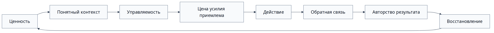{.diagram}


Эта схема не означает, что человек всегда проходит все шаги сознательно.

Она показывает, что делает действие устойчивым.

Есть ценность: понятно, зачем задача вообще важна.

Есть контекст: понятно, что сейчас известно, что туманно, где первый проверяемый шаг.

Есть управляемость: человек ожидает, что его действие может изменить исход хотя бы на небольшую величину.

Цена усилия приемлема: тело, внимание и состояние позволяют заплатить эту цену без разрушения следующего входа.

Есть действие: не бесконечное думание о задаче, а реальный контакт с материалом.

Есть обратная связь: после шага стало видно, что изменилось.

Есть авторство результата: человек может сказать "это сделал я", "я понял вот это", "я продвинул задачу вот сюда", а не только "день куда-то исчез".

Есть восстановление: система закрывает часть цены и возвращает возможность следующего входа.

Когда эти связи работают, сложная работа не становится легкой. Но она остается доступной.

## Поломка редко происходит в одной точке

Бытовой язык часто говорит:

```text
у меня пропала мотивация
```

Но это слишком грубо.

Мотивация редко исчезает как выключенный свет. Чаще расходятся связи внутри контура.

Задача может оставаться важной, но вызывать угрозу.

Следующий шаг может быть понятен, но цена входа слишком высока.

Усилие может быть вложено, но результат не виден.

Результат может быть объективно полезным, но не присваиваться человеком.

Отдых может быть, но не возвращать доступность действия.

Снаружи все это похоже на одну картинку:

```text
человек хуже работает
```

Внутри это разные механизмы.

| Что видно | Где может быть разрыв |
| --- | --- |
| "Не могу начать" | цена входа, угроза, состояние, туман задачи |
| "Не вижу смысла" | ценность перестала связываться с результатом |
| "Все равно ничего не изменится" | низкая управляемость |
| "Я устал от самой мысли" | цена усилия стала слишком высокой |
| "Я что-то делаю, но это не считается" | разрыв обратной связи и авторства |
| "После отдыха не лучше" | восстановление не закрывает долг |
| "Меня все раздражает" | контакт с работой стал сигналом угрозы |

Поэтому первый шаг в когнитивном инженерстве - не спорить с человеком о дисциплине, а найти место разрыва.

## Когда требования растут быстрее ресурсов

В рабочих исследованиях выгорания часто используют язык требований и ресурсов.

Требования - это не только количество задач.

К требованиям относятся:

- объем работы;
- срочность;
- неопределенность;
- эмоциональная нагрузка;
- ответственность;
- необходимость часто переключаться;
- риск ошибки;
- конфликтующие ожидания;
- необходимость быть доступным;
- сложность коммуникации;
- постоянная недосказанность.

Ресурсы - это тоже не только отдых.

К ресурсам относятся:

- управляемость;
- автономия;
- понятная постановка задачи;
- обратная связь;
- поддержка;
- время на восстановление;
- право на фокус;
- ясные критерии качества;
- признание результата;
- возможность влиять на способ работы;
- достаточный уровень навыка;
- предсказуемость среды.

Поломка начинается там, где требования устойчиво растут быстрее ресурсов.

Поначалу человек может компенсировать это силой, интересом, ответственностью или тревогой. Он берет больше, быстрее отвечает, дольше работает, держит несколько треков, срезает паузы, переносит восстановление "на потом".

Такой режим может дать результат на коротком отрезке.

Но если он становится нормой, система начинает покупать действие восстановительным долгом.

```text
требования растут
-> ресурсов и контроля не хватает
-> действие держится на нажиме
-> восстановление не закрывает цену
-> следующий вход дороже
-> требуется еще больше нажима
```

Это уже не высокая продуктивность. Это деградация контура.

## Предвыгорание: когда проблема выглядит как сила

Самая коварная зона - предвыгорание.

На этом этапе человек может не выглядеть сломанным. Наоборот, он может казаться очень вовлеченным.

Он много берет. Быстро отвечает. Соглашается на сложное. Долго держится. Исправляет чужие провалы. Спасает сроки. Продолжает работать вечером. Еще не просит помощи. Может даже чувствовать гордость за свою надежность.

Внутри это часто поддерживается смесью:

- интереса;
- идеализма;
- долга;
- страха подвести;
- желания доказать;
- привычки быть опорой;
- тревоги перед последствиями;
- запрета на остановку.

Проблема не в том, что эти мотивы "плохие".

Проблема в том, что они могут скрыть рост цены.

Если человек продолжает брать нагрузку, но восстановление уже не догоняет, его вовлеченность начинает работать как кредитная карта. Сегодня она покупает результат. Завтра приходит счет.

Поэтому предвыгорание нельзя романтизировать как "сильную мотивацию".

В учебнике это место важно особенно.

Мы уже говорили об опыте преодоления. Там трудность полезна, если она управляемая, дозированная, дает обратную связь и оставляет след роста.

Предвыгорание похоже на преодоление только снаружи.

Внутри различие такое:

| Управляемое преодоление | Предвыгорание |
| --- | --- |
| Трудность дозирована. | Нагрузка растет быстрее восстановления. |
| Есть обратная связь. | Результат сразу поглощается следующим требованием. |
| Есть след роста. | Есть долг и тревога. |
| У человека остается авторство. | Человек становится функцией ожиданий. |
| После усилия возможен следующий вход. | Следующий вход становится дороже. |

Полезная трудность строит способность.

Хроническая чрезмерность тратит способность.

## Эмоциональное истощение

Острая усталость после тяжелого дня - нормальна.

Она говорит:

```text
цена уже заплачена,
нужно восстановление
```

Если восстановление работает, следующий вход постепенно становится доступным.

Эмоциональное истощение - другое состояние.

Оно ближе к такой формуле:

```text
я не просто устал после нагрузки;
я больше не возвращаюсь к прежнему рабочему состоянию
```

Человек может поспать, отдохнуть, отвлечься, закрыть часть задач, но базовая доступность работы не возвращается. Первое включение все равно кажется чрезмерным. Маленькая просьба ощущается как атака. Письмо, встреча, задача или сообщение поднимают не рабочую готовность, а защитное напряжение.

Это не обязательно значит, что человек "не хочет".

Часто он как раз хочет вернуться к нормальному себе.

Но система оценивает действие иначе:

```text
цена высока
угроза рядом
управляемость низкая
восстановление сомнительно
результат не закроет долг
```

Если в этот момент добавить только мотивационный нажим, контур не чинится.

Нажим говорит:

```text
надо еще
```

А система и так живет в режиме "надо еще".

## Ментальная дистанция и цинизм

Следующая важная связка - дистанция.

Когда контакт с работой постоянно приносит цену, угроза и отсутствие авторства, система начинает защищаться снижением контакта.

Это может выглядеть неприятно:

- раздражение;
- холодность;
- циничные комментарии;
- обесценивание задач;
- желание не включаться;
- внутреннее "оставьте меня в покое";
- потеря теплого отношения к работе, команде или пользователям.

Легко сказать:

```text
человек стал хуже относиться к работе
```

Иногда это правда на уровне поведения. Но механистически полезнее спросить:

```text
от чего дистанция защищает
```

Если каждый контакт с работой означает новую срочность, новую вину, новый риск ошибки, новый невидимый результат и отсутствие восстановления, дистанция становится способом экономии.

Цинизм в такой рамке - не добродетель и не оправдание плохого поведения.

Но и не обязательно "плохой характер".

Это может быть защитная форма:

```text
если я перестану считать это важным,
мне будет менее больно вкладываться
```

Когнитивное инженерство не должно романтизировать цинизм. Но оно должно понимать его функцию.

Иначе вмешательство промахнется. Человеку будут говорить "верни вовлеченность", а он бессознательно защищает остатки ресурса от среды, где вовлеченность давно стала дорогой и небезопасной.

## Редукция профессиональной эффективности

Третий большой слой - снижение переживаемой эффективности.

Важно слово "переживаемой".

Человек может объективно делать полезные вещи, но перестать чувствовать, что они имеют вес.

Так происходит, когда:

- критерии результата размыты;
- задачи никогда не закрываются окончательно;
- после каждого результата сразу появляется новый долг;
- обратная связь приходит только в виде ошибок;
- вклад человека не виден в общей системе;
- все значимое считается "само собой";
- нет момента присвоения результата.

В главе 20 мы говорили об объяснимости времени. В главе 22 - о ресурсном режиме. Здесь добавляется еще одна связка:

```text
результат должен замыкаться в авторство
```

Авторство результата - это не самодовольство.

Это способность увидеть:

```text
что изменилось благодаря моему действию
```

Без этого усилие становится невидимой тратой.

Если человек не присваивает результат, мотивационный контур не получает обратного питания. Действие произошло, цена заплачена, но система не получила сигнала:

```text
усилие было не зря
```

Тогда следующий вход становится дороже даже при объективном продвижении.

Именно поэтому в восстановительных главах появится тема авторизации результата: короткой фиксации того, что сделано, зачем это имело смысл и как этот результат теперь можно использовать.

## Как выглядит поломка контура

Соберем динамику целиком.

Вопрос схемы:

```text
как рабочий контур начинает сам поддерживать просадку,
если цена растет, управляемость падает,
а результат не становится опорой?
```


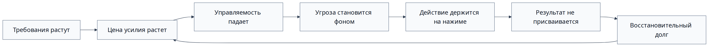{.diagram}


Это не единственный маршрут.

Граница схемы: она не ставит диагноз выгорания и не объясняет любую потерю мотивации одним маршрутом. Она показывает типовую петлю разрыва, после которой нужно проверять уровень помощи и условия среды.

Иногда первой ломается не нагрузка, а смысл. Иногда - управляемость. Иногда - обратная связь. Иногда - восстановление. Но если разрыв долго не чинится, петля начинает сама себя поддерживать.

Цена усилия растет.

Из-за высокой цены человек откладывает вход или входит через тревогу.

Из-за тревоги падает качество внимания.

Из-за падения качества появляется больше ошибок и незакрытых хвостов.

Из-за хвостов снижается управляемость.

Из-за низкой управляемости усилие кажется менее оправданным.

Из-за этого результат слабее присваивается.

Из-за отсутствия присвоения работа не возвращает энергию.

Из-за отсутствия восстановления следующий вход дороже.

Так система может стать самоподдерживающейся.

И в этой точке вопрос "как себя заставить" становится слишком узким.

## Почему мотивационный нажим может ухудшать состояние

Мотивационный нажим - это попытка добавить действие через давление.

Он может выглядеть по-разному:

- "соберись";
- "вспомни, зачем тебе это";
- "надо просто начать";
- "поставь цель";
- "пообещай кому-то";
- "добавь дедлайн";
- "сделай трекер";
- "включи соревнование";
- "повысь ставки".

Иногда это помогает.

Если человек в рабочем окне нагрузки, задача туманна, а первый шаг не выбран, то постановка, дедлайн, внешний контейнер и обратная связь могут действительно оживить контур.

Но если система уже перегружена, нажим добавляет не ресурс, а требование.

Он повышает угрозу.

Увеличивает цену ошибки.

Усиливает стыд за провал.

Делает отдых еще менее безопасным.

Сужает внимание.

И подтверждает внутреннюю модель:

```text
мое состояние не важно,
важно только еще раз поднажать
```

Поэтому перед мотивационным вмешательством нужна проверка.

| Вопрос | Если ответ плохой |
| --- | --- |
| Есть ли понятный первый шаг? | Сначала чинить контекст задачи. |
| Есть ли ощущение управляемости? | Сначала уменьшать шаг и возвращать контроль. |
| Цена усилия приемлема? | Сначала смотреть WIP, угрозу, состояние и восстановление. |
| Есть ли обратная связь? | Сначала сделать результат видимым. |
| Присваивается ли результат? | Сначала вернуть авторство результата. |
| Восстановление работает? | Сначала снижать нагрузку и проверять границы состояния. |

Если эти вопросы пропустить, мотивация легко превращается в новый слой самоизноса.

## Диагностика места разрыва

Для практики удобно держать короткую таблицу.

| Сигнал | Возможный разрыв | Первый инженерный вопрос |
| --- | --- | --- |
| После отдыха вход не дешевеет | восстановление -> цена усилия | Что мешает восстановлению закрыть долг? |
| Работа важна, но отталкивает | ценность -> угроза | Какая угроза захватила ценность? |
| "Все равно ничего не изменится" | управляемость -> действие | Какой минимальный шаг снова может изменить исход? |
| "Я делаю, но это не считается" | обратная связь -> авторство | Где результат должен стать видимым и признанным? |
| Растет цинизм | контакт -> защитная дистанция | От чего дистанция защищает систему? |
| Любой запрос раздражает | требование -> угроза | Не стала ли среда постоянным источником мобилизации? |
| Паузы превращаются в обрушение | рабочая пауза -> восстановление | Пауза восстанавливает или открывает новый долг? |
| Человек держится только на страхе | ценность -> нажим | Что поддерживает действие кроме угрозы? |

Эта таблица не ставит диагноз.

Она помогает не перепутать уровень вмешательства.

Если проблема в тумане задачи, нужен контекст.

Если проблема в WIP, нужен предел активных контекстов.

Если проблема в обратной связи, нужен видимый сдвиг и авторизация результата.

Если проблема в недовосстановлении, новый трекер может стать только еще одним требованием.

## Выгорание как профессиональная граница, а не универсальное слово

Здесь нужно быть точными.

В повседневной речи "выгорание" часто означает что угодно: усталость, скуку, раздражение, потерю интереса, тяжелую неделю, депрессию, ненависть к работе, перегруз или просто желание отпуска.

Для учебника это слишком расплывчато.

В ICD-11 выгорание описывается как профессиональный феномен, связанный с хроническим рабочим стрессом, который не был успешно преодолен. В описании выделяются три измерения:

- истощение или ощущение истощенности энергии;
- ментальная дистанция от работы, негативизм или цинизм по отношению к работе;
- снижение профессиональной эффективности.

Это не значит, что каждый человек с усталостью должен сам ставить себе выгорание.

Наоборот.

Эта рамка нужна как ограничение.

Если человек устал после проекта, это еще не обязательно выгорание. Если ему скучно, это еще не обязательно выгорание. Если он болеет, тревожится, переживает депрессию или хроническое нарушение сна, это может требовать совсем другого уровня помощи.

Для когнитивного инженерства важен не ярлык, а вопрос:

```text
какие связи рабочего мотивационного контура перестали работать
и не чинятся обычным восстановлением
```

## Два маршрута поломки

Глава 24 разберет это подробнее, но уже сейчас нужно обозначить два разных маршрута.

Первый маршрут - перегруз.

Слишком много требований, срочности, угрозы, ответственности, WIP и недостатка восстановления. Система слишком долго живет выше полезного окна нагрузки.

Второй маршрут - недогруз.

Слишком мало смысла, вызова, ответственности, авторства, роста и реальной связи между усилием и результатом. Система не получает достаточной включенности, но все равно остается привязанной к работе как к источнику времени, идентичности и обязательств.

Оба маршрута могут выглядеть как:

```text
нет мотивации
```

Но механизмы разные.

При перегрузе действие слишком дорого.

При недогрузе действие не собирает ценность, авторство и включенность.

Есть и третья граница, которую нельзя пропустить. Иногда "нет мотивации" означает не рабочее выгорание, не профессиональную скуку и не обычную прокрастинацию, а устойчивое снижение направленного действия: человек не просто избегает одной задачи, а теряет способность хотеть, начинать, выбирать, получать интерес или удерживать действие в разных областях жизни.

Такой сигнал нельзя чинить только ритуалом, WIP-лимитом или новым планом. Он может относиться к апатии, ангедонии, депрессивно похожим состояниям, нарушению сна, соматическому состоянию, лекарствам или другому уровню помощи. Для нашей модели это не повод ставить диагноз. Это повод остановиться и сменить уровень вопроса:

```text
это поломка рабочего мотивационного контура
или состояние, где нужна профессиональная оценка и помощь?
```

Если смешать эти случаи, вмешательство будет ошибочным.

Перегруженному человеку не нужен дополнительный вызов.

Хронически недогруженному человеку не всегда поможет только отдых.

Отсюда следующий шаг: развести выгорание и профессиональную скуку.

## Что можно сделать уже на уровне этой главы

Глава 23 не дает полный протокол восстановления. Но она дает первую карту проверки.

Перед тем как "поднимать мотивацию", полезно пройти пять вопросов.

### 1. Контур задачи

```text
есть ли понятный следующий шаг,
или человек каждый раз заново входит в туман
```

Если шага нет, мотивация будет тратиться на борьбу с неопределенностью.

### 2. Контур управляемости

```text
может ли малое действие реально изменить состояние задачи
```

Если человек не видит связи действия с исходом, усилие становится менее разумным.

### 3. Контур цены

```text
не стала ли цена входа выше ценности ближайшего результата
```

Если цена слишком высока, нужен не лозунг, а уменьшение шага, WIP, угрозы или нагрузки.

### 4. Контур обратной связи

```text
становится ли результат видимым
и возвращается ли он человеку как авторство
```

Если нет, действие перестает питать следующий цикл.

### 5. Контур восстановления

```text
возвращает ли отдых доступность следующего входа
```

Если нет, ритуалы и трекеры не должны быть первым ответом.

## Границы самостоятельной работы

Есть состояния, где учебник должен остановиться.

Если у человека устойчиво нарушены сон, аппетит, настроение, способность к повседневным действиям, если есть постоянная тревога, отчаяние, тяжелое истощение, потеря интереса ко всему, мысли о невозможности продолжать или любое состояние, где безопасность под вопросом, это не задача для протокола продуктивности.

Когнитивное инженерство может помочь проектировать рабочие условия, контексты, ритуалы, обратную связь и восстановление.

Но оно не заменяет медицину, психотерапию, кризисную поддержку и изменение объективно вредной среды.

Это ограничение не делает модель слабее.

Оно делает ее честнее.

## Что это добавляет к учебнику

До этого места учебник показывал, как собрать действие:

- вынести контекст из головы;
- восстановить вход в задачу;
- понять мотивацию как систему параметров;
- развести ценность, угрозу, управляемость и цену усилия;
- поддержать обучение через сон, паузы и повторное извлечение;
- проектировать продуктивность без самоизноса;
- ограничивать WIP и поддерживать ресурсность.

Глава 23 показывает обратную сторону:

```text
если эти элементы долго не поддерживают друг друга,
возникает не просто усталость,
а поломка мотивационного контура
```

Человек может продолжать хотеть результата, но терять доступность действия.

Может делать много, но терять авторство.

Может отдыхать, но не восстанавливаться.

Может выглядеть циничным, хотя система просто защищается от слишком дорогого контакта.

Может нуждаться не в новом нажиме, а в изменении нагрузки, управляемости, обратной связи, восстановления и среды.

Два особенно важных маршрута этой поломки - выгорание как верхний перекос перегруза и профессиональная скука как нижний перекос недогруза.

## Короткое резюме

- Мотивационный контур ломается не одной причиной, а рассогласованием нескольких связей.
- Человек может выглядеть продуктивным, пока система уже покупает результат восстановительным долгом.
- Рост требований при низкой управляемости делает усилие менее разумным для системы.
- Если обратная связь не возвращает авторство результата, действие перестает питать следующий цикл.
- Мотивационный нажим уместнее внутри рабочего окна нагрузки; при перегрузе он часто становится дополнительным требованием.

## Вопросы для самопроверки

1. Где именно может разорваться мотивационный контур?
2. Почему предвыгорание может выглядеть как сила и высокая вовлеченность?
3. Чем эмоциональное истощение отличается от обычной усталости после нагрузки?
4. Почему цинизм иногда является защитной дистанцией, а не только "плохим отношением"?
5. Когда попытка "поднять мотивацию" ухудшает состояние?

## Мини-практика

Выберите одну задачу или рабочий трек, где мотивация заметно просела, и заполните карту разрыва:

```text
ценность еще видна или уже размыта:
следующий шаг понятен или каждый вход начинается с тумана:
есть ли реальная управляемость:
цена входа:
какая обратная связь приходит:
можно ли присвоить результат:
восстановление возвращает следующий вход или нет:
первый уровень вмешательства:
```

Не начинайте с вопроса "как сильнее мотивироваться". Начните с того, какая связь в контуре больше всего повреждена.

---

# Глава 24. Выгорание и профессиональная скука

## Два разных ответа на одну фразу

Предыдущая глава разобрала, как ломается мотивационный контур.

Главный вывод был таким:

```text
мотивация проседает не в одном месте,
а через разрыв связей между ценностью,
управляемостью, ценой усилия,
обратной связью, авторством результата
и восстановлением
```

Теперь нужно сделать следующий шаг.

Одна и та же фраза:

```text
у меня нет сил и мотивации
```

может означать два разных маршрута.

Первый:

```text
действовать слишком дорого
```

Второй:

```text
действие не собирает смысл, вызов и авторство
```

В первом случае человек перегружен. Требований, срочности, риска, WIP и внутреннего нажима слишком много. Восстановление не успевает закрывать цену. Работа все чаще воспринимается как угроза.

Во втором случае человек недогружен или плохо включен. Работы может быть мало, или она может быть пустой, слишком простой, фрагментированной, лишенной вклада, автономии и роста. Система не собирает энергию в действие, потому что действие не выглядит достаточно значимым.

Снаружи оба состояния могут быть похожи:

- человек откладывает;
- избегает входа;
- устает;
- раздражается;
- теряет интерес;
- хуже видит результат;
- начинает говорить о работе холоднее.

Но инженерный ответ разный.

Перегруз не лечится новым вызовом.

Недогруз не лечится одним отдыхом.

## Окно полезной нагрузки

В главе 15 мы уже ввели окно полезной нагрузки.

Для сложной интеллектуальной работы вредны оба края:

```text
слишком мало включенности -> задача не собирает внимание
слишком много напряжения -> задача тонет в угрозе и суете
```

Это удобно связывать с законом Йеркса-Додсона, но с оговоркой.

Его не нужно понимать как точную универсальную кривую, по которой можно измерить любой рабочий день. Исторически это исследование было гораздо уже, а популярная "перевернутая U-кривая" часто используется слишком широко.

Для учебника важна не математическая претензия, а практическая эвристика:

```text
сложная работа требует подходящего окна активации
```

В этом окне есть:

- достаточно вызова, чтобы внимание включилось;
- достаточно безопасности, чтобы угроза не захватила контроль;
- достаточно управляемости, чтобы усилие казалось разумным;
- достаточно обратной связи, чтобы результат питал следующий цикл;
- достаточно восстановления, чтобы цена не превращалась в долг.

Выгорание - это верхний перекос.

Профессиональная скука - нижний перекос.

Но это не зеркальные медицинские диагнозы.

Выгорание имеет более сильную институциональную рамку: в ICD-11 оно описано как профессиональный феномен, связанный с хроническим рабочим стрессом, который не был успешно преодолен. Профессиональная скука здесь используется осторожнее: как рабочее название хронического недогруза, скуки и потери включенности. Ее лучше опирать не на популярное слово, а на исследования рабочей скуки, скуки, связанной с работой, характеристик работы и удовлетворения базовых потребностей.

## Матрица перегруза и недогруза

Начнем с общей карты.

| Зона | Требования | Ресурсы, смысл и включенность | Типичный сбой | Первый вопрос |
| --- | --- | --- | --- | --- |
| Полезный вызов | Умеренно высокие. | Достаточно контроля, восстановления, смысла и обратной связи. | Рост и вовлеченность. | Как сохранить окно нагрузки? |
| Маршрут выгорания | Слишком высокие. | Ресурсов, контроля и восстановления мало. | Истощение, дистанция, снижение эффективности. | Что снизить и где вернуть контроль? |
| Маршрут профессиональной скуки | Слишком низкие или пустые. | Смысла, вызова, авторства и роста мало. | Скука, вялость, потеря включенности. | Где вернуть вызов, вклад и рост? |
| Смешанная зона | Много занятости. | Мало смысла и авторства. | Занятая скука, цинизм, распад качества. | Что здесь нагрузка, а что пустое трение? |

Эта таблица нужна не для самодиагностики.

Она нужна, чтобы не ошибиться уровнем вмешательства.

Если человек выше окна нагрузки, новый вызов может добить систему.

Если человек ниже окна включенности, один отдых может ничего не изменить, потому что проблема не только в цене, но и в пустоте действия.

## Выгорание: верхний перекос

Маршрут выгорания начинается там, где нагрузка долго превышает способность системы восстанавливаться и сохранять управляемость.

Это не просто:

```text
много работы
```

Много работы само по себе не обязательно ведет к выгоранию. Сложный проект может быть тяжелым, но развивающим, если у человека есть автономия, команда, ясный критерий результата, восстановление, признание и право влиять на способ работы.

Опасная связка другая:

```text
много требований
мало контроля
мало восстановления
высокая цена ошибки
мало признанного результата
мало права остановиться
```

В такой связке рабочая система сначала мобилизуется. Человек собирается, ускоряется, берет больше, держит сроки, старается не подвести.

Потом тот же режим перестает помогать.

Срочность уже не собирает, а тревожит.

Ответственность уже не дает смысл, а давит.

Обратная связь приходит в основном через проблемы.

Отдых не возвращает прежнюю доступность.

Вход в работу начинает ощущаться не как начало действия, а как вход в угрозу.

Вопрос схемы:

```text
как верхний перекос нагрузки превращает рабочее усилие
в самоподдерживающуюся петлю истощения и дистанции?
```


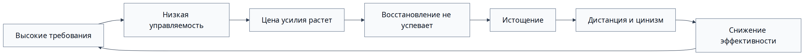{.diagram}


Граница схемы: это карта маршрута выгорания, а не инструмент самодиагностики. Выгорание имеет профессиональную и клиническую границу; по одной схеме нельзя отличить его от депрессии, нарушений сна, соматического состояния или обычной усталости после проекта.

Эта петля особенно опасна тем, что она может сама себя поддерживать.

Чем хуже эффективность, тем больше тревоги.

Чем больше тревоги, тем дороже вход.

Чем дороже вход, тем больше хвостов.

Чем больше хвостов, тем выше требования.

Чем выше требования, тем слабее восстановление.

В какой-то момент человек начинает жить не в работе, а в постоянном режиме компенсации.

## Три измерения выгорания

В классической рамке выгорание часто описывается через три измерения.

Первое - истощение.

Это не обычная усталость после рабочего блока, а состояние, где рабочая цена не закрывается восстановлением. Человек может отдохнуть формально, но следующий вход все равно начинается с долга.

Второе - ментальная дистанция, негативизм или цинизм по отношению к работе.

Выше уже было сказано: цинизм может быть защитной экономией. Когда контакт с работой слишком дорог, система снижает контакт. Это не оправдывает грубость, холодность или разрушительное поведение, но помогает понять функцию дистанции.

Третье - снижение профессиональной эффективности.

Его важно понимать аккуратно. Иногда человек действительно делает меньше и хуже. Но иногда он делает много, а результат перестает присваиваться. Он не чувствует, что его действие что-то изменило. Вклад растворяется в следующей срочности. Тогда профессиональная эффективность падает не только как внешний показатель, но и как внутреннее ощущение дееспособности.

## Профессиональная скука: нижний перекос

Теперь другой маршрут.

Профессиональную скуку не стоит подавать как такой же официальный термин, как выгорание. Это не диагноз. В учебнике это рабочая метка для нижнего перекоса: хронической рабочей скуки, недогруза, отсутствия вызова, смысла, автономии, обратной связи и ощущения вклада.

Главная ошибка - думать, что низкая нагрузка всегда восстанавливает.

Иногда да.

Если человек был перегружен, снижение нагрузки необходимо.

Но хронический недогруз - другое состояние.

В нем работа не требует настоящего усилия, не дает роста, не вызывает мастерства, не показывает вклад и не возвращает авторство. Время проходит, но человек не чувствует, что его способности участвуют в чем-то значимом.

Тогда возникает не отдых, а пустая включенность.

```text
я формально на работе,
но меня как будто не требуется
```

Это состояние тоже может истощать.

Не через избыток давления, а через дефицит осмысленного контакта.

Вопрос схемы:

```text
как нижний перекос превращает легкость не в восстановление,
а в невключенность, скуку и потерю авторства?
```


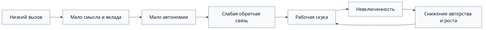{.diagram}


Граница схемы: профессиональная скука здесь используется как рабочая рамка хронического недогруза и рабочей скуки, а не как термин с той же институциональной силой, что выгорание.

## Почему скука не равна отдыху

Скуку легко обесценить.

Можно сказать:

```text
тебе же легко, чего ты устал
```

Но рабочая скука - не восстановление.

Восстановление выводит систему из нагрузки и возвращает доступность действия.

Рабочая скука часто оставляет человека привязанным к работе, но не включенным в нее.

Он не отдыхает, потому что должен быть доступен.

Он не развивается, потому что задача не требует реального мастерства.

Он не завершает, потому что результат не ощущается как вклад.

Он не выбирает, потому что автономии мало.

Он не может честно выйти из режима, потому что формально рабочее время продолжается.

Получается парадокс:

```text
нагрузки мало,
но свободы тоже мало
```

Это не ресурсное состояние.

Это состояние низкой включенности.

## Из чего собирается нижний перекос

Исследования рабочей скуки и скуки, связанной с работой, помогают описать этот перекос без бытового морализма.

Речь не только о монотонной конвейерной работе.

Скуку могут создавать:

- слишком простые задачи;
- отсутствие вызова;
- отсутствие разнообразия навыков;
- неясная связь работы с целым результатом;
- низкая значимость задачи;
- отсутствие автономии;
- слабая обратная связь;
- низкие возможности обучения;
- ожидание без права заняться полезным;
- формальная занятость без настоящего вклада;
- работа, где человек не может использовать свой уровень способности.

Здесь хорошо помогает модель характеристик работы: разнообразие навыков, целостность задачи, значимость задачи, автономия и обратная связь.

Если этих элементов мало, задача хуже собирает внутреннюю мотивацию. Человеку трудно почувствовать:

```text
я делаю осмысленную целую работу,
в которой могу влиять,
получать обратную связь
и развивать мастерство
```

Без этого действие не питает контур.

## Выгорание и профессиональная скука в одной таблице

| Слой | Выгорание | Профессиональная скука |
| --- | --- | --- |
| Главный перекос | Перегруз. | Недогруз. |
| Центральное переживание | "Слишком много, я не вывожу". | "Слишком пусто, я не включаюсь". |
| Цена действия | Слишком высокая. | Недостаточно связана с ценностью. |
| Угроза | Высокая: ошибка, срок, ожидания, последствия. | Фоновая: нереализованность, потеря времени, бессмысленность. |
| Управляемость | Падает под давлением. | Не развивается из-за отсутствия настоящего влияния. |
| Восстановление | Не закрывает долг. | Не возникает, потому что это не отдых, а пустой рабочий режим. |
| Обратная связь | Часто приходит как проблема или новое требование. | Слабая, редкая или незначимая. |
| Риск ошибочного вмешательства | Добавить мотивации, вызова и срочности. | Только отправить отдыхать или добавить объем без смысла. |
| Первый инженерный вопрос | Что снизить, где вернуть контроль и восстановление? | Где вернуть вызов, смысл, автономию и авторство? |

Эта таблица слишком чистая для реальной жизни.

Но она полезна как начало диагностики.

## Смешанные случаи

В реальной интеллектуальной работе часто встречаются гибриды.

Например:

```text
много встреч,
много сообщений,
много срочности,
но мало настоящего продвижения
```

Это не чистое выгорание и не чистая профессиональная скука.

Это занятая скука.

Человек устает от количества контактов, но не получает смысла от результата.

Другой вариант:

```text
много ответственности,
но мало автономии
```

Снаружи задача высокая. Внутри управляемость низкая. Человек отвечает за исход, но не может нормально влиять на условия.

Еще вариант:

```text
много задач,
но все они мелкие, реактивные и не собираются в мастерство
```

Здесь есть перегруз по WIP, но недогруз по смыслу и развитию.

Такие смешанные случаи особенно часты у разработчиков, лидов и работников знания. День может быть забит, а чувство профессионального роста и вклада падать.

Поэтому вопрос не только:

```text
много или мало работы
```

Вопрос точнее:

```text
какая работа,
с каким уровнем управляемости,
какой ценой,
с какой обратной связью,
каким смыслом
и каким восстановлением
```

## Как не ошибиться с первым вмешательством

Глава 25 даст более полный протокол восстановления управляемости.

Но уже здесь можно зафиксировать первую развилку.

| Если видно | Не спешить делать | Сначала проверить |
| --- | --- | --- |
| Перегруз, тревога, постоянная срочность | Добавлять челлендж и давление. | Что можно снять, отложить, ограничить, прояснить? |
| Истощение после отдыха не уходит | Давать новый протокол продуктивности. | Работает ли восстановление вообще? |
| Скука и пустота | Только отправлять отдыхать. | Есть ли вызов, вклад, автономия и обратная связь? |
| Мало задач | Считать, что все хорошо. | Не превращается ли рабочее время в пустое ожидание? |
| Много занятости без результата | Мерить только количество часов. | Что из занятости дает авторство и сдвиг? |
| Цинизм | Читать мораль. | От чего дистанция защищает систему? |

Верхний перекос часто требует снижения нагрузки, защиты восстановления, ограничения WIP, возвращения контроля и безопасности.

Нижний перекос часто требует не нагрузки ради нагрузки, а подходящего вызова: более цельной задачи, ясного вклада, автономии, обучения, обратной связи и возможности присвоить результат.

## Что это добавляет к учебнику

До этого места мы научились видеть поломку мотивационного контура.

Теперь мы различаем два направления этой поломки.

Маршрут выгорания:

```text
слишком высокая цена действия
при недостатке контроля, восстановления и признанного результата
```

Маршрут профессиональной скуки:

```text
слишком слабая включенность действия
в смысл, вызов, рост, автономию и авторство
```

Оба маршрута могут выглядеть как "нет мотивации".

Но это разные инженерные задачи.

При перегрузе первый инженерный вопрос обычно про возвращение безопасности, управляемости и восстановления.

При недогрузе первый инженерный вопрос обычно про возвращение подходящего вызова, смысла, обратной связи и живого участия способностей.

Практический вопрос после этого становится точнее: как восстанавливать управляемость, не путая отдых, новый вызов, снижение давления, авторизацию результата и первый маленький шаг.

## Короткое резюме

- Выгорание и профессиональная скука могут выглядеть как потеря мотивации, но требуют разных первых вмешательств.
- Маршрут выгорания связан с хроническим рабочим стрессом, высокой ценой действия, низким контролем, слабым восстановлением и потерей авторства результата.
- Маршрут профессиональной скуки связан с хроническим недогрузом, скукой, низким вызовом, слабым смыслом, автономией, обратной связью и ростом.
- Скука не равна отдыху, а недогруз не равен восстановлению.
- В реальной работе со знанием часто встречаются смешанные зоны: много занятости при малом смысле, много ответственности при малой автономии, много WIP при низком авторстве.

## Вопросы для самопроверки

1. Почему выгорание нельзя использовать как синоним любой усталости?
2. Почему профессиональную скуку не стоит подавать как симметричный выгоранию диагноз?
3. Какие признаки говорят о верхнем перекосе перегруза?
4. Какие признаки говорят о нижнем перекосе недогруза и низкой включенности?
5. Почему одно и то же вмешательство может помочь в одном маршруте и навредить в другом?

## Мини-практика

Для одного рабочего трека заполните простую матрицу:

```text
требования высокие / низкие:
управляемость высокая / низкая:
вызов есть / нет:
смысл и вклад видны / нет:
обратная связь есть / нет:
восстановление возвращает / не возвращает:
больше похоже на перегруз, недогруз или смешанный случай:
какой первый ход не стоит делать:
какой первый ход стоит проверить:
```

Особенно отметьте "первый ход не стоит делать". Эта строка защищает от типичной ошибки: давить на перегруз или отправлять отдыхать там, где не хватает вызова и авторства.

---

# Глава 25. Восстановление как возвращение управляемости

## После перегруза нельзя просто вернуться

Предыдущая глава развела два маршрута поломки мотивационного контура.

При маршруте выгорания действие становится слишком дорогим:

```text
много требований,
мало контроля,
мало восстановления,
высокая цена ошибки,
результат не успевает стать опорой
```

При маршруте профессиональной скуки действие становится слишком пустым:

```text
мало вызова,
мало смысла,
мало автономии,
слабая обратная связь,
способности не участвуют в живой работе
```

Теперь нужен следующий вопрос:

```text
как возвращаться?
```

Обычный ответ звучит так:

```text
надо отдохнуть
```

Иногда это правда. Если человек долго жил выше устойчивого окна нагрузки, без снижения давления и восстановления телесной базы ничего хорошего не получится.

Но для когнитивного инженерства этого ответа мало.

Человек может отдохнуть и вернуться в тот же хаос: те же WIP, те же срочности, та же низкая управляемость, та же невозможность присвоить результат. Тогда отдых был, а восстановление контура не произошло.

Другой человек может отдыхать от пустой работы, но возвращаться в ту же пустоту: мало смысла, мало вызова, мало обратной связи. Тогда проблема была не только в усталости. Отдых не вернул действие в ценность.

Поэтому восстановление здесь означает не просто паузу.

Восстановление — это возвращение условий, в которых действие снова может начаться, дать сигнал, быть скорректированным и завершиться присвоенным результатом.

Коротко:

```text
восстановление = возвращение управляемости
```

## Что значит вернуть управляемость

Управляемость мы уже вводили в главе 10.

Это не вера, что все получится.

И не ощущение, что мир под контролем.

Управляемость — это ожидаемая связь:

```text
действие -> сигнал -> корректировка -> сдвиг
```

Когда человек истощен, эта связь часто распадается.

Он может знать, что задача важна, но не чувствовать, что шаг изменит ситуацию. Может начать, но не получить ясный сигнал. Может сделать что-то, но результат сразу растворяется в следующей срочности. Может получить обратную связь только в форме новой проблемы.

Тогда система учится неприятной вещи:

```text
усилие есть,
а опоры нет
```

В этой рамке восстановление в первую очередь чинит именно это.

Не просто убрать усталость.

Не просто поднять настроение.

Не просто добавить мотивационный смысл.

А вернуть минимальную петлю:

```text
я делаю небольшой шаг
вижу, что изменилось
могу скорректироваться
могу присвоить результат
и следующий вход становится не дороже, а дешевле
```

## Четыре стороны восстановления

В исследованиях восстановления после работы полезно различать несколько типов восстановительного опыта.

Первый — психологическое отсоединение от работы.

Это состояние, где работа перестает продолжаться внутри головы. Человек не просто физически вышел из задачи, но перестал внутренне удерживать ее как угрозу, хвост или незакрытый долг.

Второй — расслабление.

Это снижение напряжения. Тело и внимание перестают жить в режиме постоянной готовности отвечать, проверять, бежать, держать удар.

Третий — mastery.

Это не рабочий героизм, а опыт посильного освоения. Человек делает что-то, где чувствует способность, рост, интерес, владение действием. Иногда это не связано с основной работой: музыка, спорт, ремесло, учебная практика, маленький домашний проект. Важно не название занятия, а то, возвращает ли оно чувство "я могу действовать и видеть сдвиг".

Четвертый — control.

Это возможность выбирать, как восстанавливаться, чем заниматься, как распоряжаться своим временем и вниманием. Если отдых навязан, фрагментирован, постоянно прерывается и не принадлежит человеку, он хуже возвращает управляемость.

Эти четыре стороны хорошо ложатся на модель учебника:

| Сторона восстановления | Что возвращает в нашей модели |
| --- | --- |
| Психологическое отсоединение | Снижает рабочую активацию и угрозу. |
| Расслабление | Снижает цену входа и телесное напряжение. |
| Опыт посильного освоения | Возвращает опыт способности и сдвига. |
| Право выбора | Возвращает право выбирать и влиять на условия. |

Здесь важно не сделать из восстановления новый список обязанностей.

Если человек говорит:

```text
я должен качественно отдохнуть,
правильно расслабиться,
эффективно восстановиться
```

то восстановление уже заражено тем же режимом нажима.

Восстановление не должно становиться еще одним проектом самоизноса.

## Петля восстановления управляемости

Для практики удобнее всего держать не список советов, а петлю.

Вопрос схемы:

```text
как возвращаться после просадки так,
чтобы отдых не стал паузой перед тем же хаосом,
а действие снова стало управляемым?
```


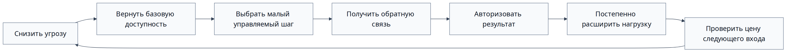{.diagram}


Граница схемы: это не протокол "быстро починить себя". Если у человека тяжелое истощение, отсутствие реальных рычагов, депрессия, апатия, нарушения сна или небезопасная среда, первым шагом может быть не малый рабочий вход, а изменение условий и профессиональная помощь.

Эта схема читается так.

Сначала нужно снизить угрозу.

Пока система живет в режиме "сейчас снова будет больно, стыдно, опасно, слишком дорого", она будет защищаться. Иногда через избегание. Иногда через раздражение. Иногда через холодность. Иногда через бесконечное планирование без входа.

Потом нужно вернуть базовую доступность.

Это слой сна, питания, пауз, предсказуемости, снижения лишнего WIP, телесной и когнитивной разгрузки. Не как культ здорового режима, а как условие, при котором действие вообще снова становится доступным.

У этого слоя есть временная сторона. Если человек пытается "восстановиться" только формальной паузой, но продолжает жить с накопленным недосыпом, плохим окном внимания и разрушенной границей вечера, следующий вход может оставаться дорогим. Тогда проблема не в том, что человек недостаточно хочет вернуться. Его система еще не получила условия, в которых внимание, торможение и гибкость снова доступны.

Потом нужен малый управляемый шаг.

Не "вернуться к полной мощности".

Не "догнать все, что накопилось".

Не "раз уж стало легче, сейчас все закрою".

А шаг, который можно начать, довести до конца и проверить.

Потом нужна обратная связь.

Человек должен увидеть, что именно изменилось. Не обязательно большой результат. Иногда достаточно:

```text
я открыл задачу
нашел главный туман
снял одно неизвестное
написал следующую контрольную точку
отправил один уточняющий вопрос
закрыл один хвост
```

Потом результат нужно авторизовать.

Это значит коротко назвать:

```text
что я сделал
что изменилось
на что теперь можно опереться
```

И только после этого нагрузку можно расширять.

Не потому, что человек "доказал, что снова пригоден".

А потому, что система получила несколько новых подтверждений:

```text
действие возможно
сигнал приходит
результат остается
следующий вход не уничтожает меня
```

## Почему малый шаг не мелочь

Малый шаг часто звучит слишком просто.

На фоне большой работы он кажется смешным:

```text
ну что изменит один маленький шаг
```

Но после перегруза или длительной неконтролируемости размер шага — это не вопрос амбиций.

Это вопрос восстановления связи между действием и исходом.

Если шаг слишком большой, система снова видит угрозу.

Если шаг слишком туманный, обратная связь не приходит.

Если шаг нельзя завершить, он добавляет новый хвост.

Если после шага результат не назван, усилие снова растворяется.

Хороший малый шаг обладает четырьмя свойствами:

| Свойство | Зачем нужно |
| --- | --- |
| Он начинается сейчас. | Снижает цену входа. |
| Он достаточно мал. | Не запускает прежний режим угрозы. |
| Он дает сигнал. | Возвращает обратную связь. |
| Он оставляет след. | Делает следующий вход дешевле. |

Такой шаг не решает всю проблему.

Он возвращает системе доказательство, что действие снова может что-то менять.

## Авторизация результата

После перегруза человек часто перестает присваивать результат.

Он может сделать полезное действие и тут же сказать:

```text
это мелочь
это случайно
надо было больше
все равно ничего не изменилось
```

Так результат исчезает.

Усилие было, а опоры не появилось.

Авторизация результата нужна, чтобы закрыть петлю.

Это не самопохвала.

И не мотивационная аффирмация.

Это короткое инженерное действие после работы:

```text
что я сделал
что изменилось
что теперь можно использовать дальше
```

Например:

```text
Я не "немного поковырял задачу".
Я нашел место, где ломается вход,
исключил две неверные гипотезы
и оставил следующий проверяемый шаг.
```

Или:

```text
Я не "просто отдохнул".
Я снизил рабочую активацию,
закрыл уведомления,
сохранил точку продолжения
и сделал следующий вход дешевле.
```

Так результат возвращается в контур.

Не как гордость ради гордости, а как факт:

```text
мое действие оставило след
```

## Разные первые ходы

После главы 24 мы не можем давать один универсальный протокол.

Сначала нужно понять, из какого перекоса человек возвращается.

| Если просадка похожа на | Первый ход | Нельзя начинать с |
| --- | --- | --- |
| Перегруз | Снизить давление, ограничить WIP, вернуть безопасность и восстановление. | Нового вызова и мотивационного нажима. |
| Недогруз | Вернуть осмысленный вызов, автономию, вклад и обратную связь. | Одного отдыха или пустого добавления задач. |
| Смешанная зона | Убрать пустую занятость и вернуть управляемый сдвиг. | Подсчета часов как главного критерия. |
| Позднее истощение | Остановить дальнейший износ и искать поддержку. | Самостоятельного героического протокола. |

При перегрузе первый ход обычно защитный.

Нужно снизить цену действия:

- убрать лишнюю срочность;
- ограничить WIP;
- договориться о приоритетах;
- снять часть неопределенности;
- уменьшить цену ошибки;
- вернуть сон и паузы;
- дать право на малый вход.

При недогрузе первый ход другой.

Нужно вернуть включенность:

- дать задаче смысл;
- сделать вклад видимым;
- добавить подходящий вызов;
- вернуть автономию;
- дать обратную связь;
- собрать более цельную задачу;
- дать возможность учиться и расти.

В смешанной зоне нужно особенно осторожно.

Там человек может быть занят весь день, но не получать ни восстановления, ни роста. Тогда решение не в том, чтобы просто "меньше работать" или "больше стараться". Нужно убрать пустое трение и вернуть работу, где есть управляемый сдвиг.

## Когда восстановление не является личной задачей

Есть важная граница.

Иногда человек не может восстановить управляемость только личными практиками.

Если нагрузка объективно слишком высока, полномочий нет, требования противоречат друг другу, обратная связь приходит только через наказание, а паузы постоянно прерываются, личный протокол будет слабым пластырем.

Восстановление управляемости иногда требует внешних изменений:

- пересмотра нагрузки;
- изменения приоритетов;
- права отказаться от части WIP;
- поддержки руководителя или команды;
- медицинской или психотерапевтической помощи;
- отпуска или больничного;
- выхода из токсичной среды;
- признания, что рычага внутри текущей рамки нет.

Это не поражение.

Это точность модели.

Когнитивное инженерство не должно делать человека виноватым за среду, где нет реального рычага.

## Минимальный протокол восстановления

Эта глава не заменяет помощь специалиста и не лечит выгорание.

Но как рабочая инженерная рамка она дает минимальный порядок.

1. Назвать маршрут просадки.

```text
перегруз,
недогруз,
смешанная зона
или позднее истощение
```

2. Снизить угрозу.

```text
что прямо сейчас делает вход опасным,
стыдным,
слишком дорогим
или безнадежным
```

3. Вернуть базовую доступность.

```text
сон,
паузы,
еда,
тишина,
ограничение WIP,
предсказуемый первый блок
```

4. Выбрать малый управляемый шаг.

```text
шаг, который можно начать,
завершить
и проверить
```

5. Получить сигнал.

```text
что изменилось,
что стало яснее,
что исключено,
какой следующий шаг появился
```

6. Авторизовать результат.

```text
что я сделал
что изменилось
на что теперь можно опереться
```

7. Расширять нагрузку только после проверки следующего входа.

Главный критерий:

```text
после шага следующий вход стал дешевле или дороже?
```

Если следующий вход устойчиво становится дешевле, восстановление, вероятно, идет в нужную сторону.

Если дороже, протокол сам стал новым источником давления.

## Что это добавляет к учебнику

До этого места мы уже знали, что мотивационный контур может ломаться.

Теперь мы знаем, как начинать его возвращать.

Не через абстрактную силу воли.

Не через героический рывок.

Не через отдых как универсальную кнопку.

А через восстановление управляемой петли:

```text
безопасность
-> доступность
-> малый шаг
-> обратная связь
-> авторизация результата
-> постепенное расширение
```

Это завершает часть о продуктивности и выгорании.

Следующая часть переведет модель к ИИ и лидерству. И здесь появится новый риск: внешний инструмент может вернуть управляемость, если помогает сделать первый шаг и получить обратную связь. Но он же может стать обходом мышления, если забирает у человека сам опыт действия.

## Короткое резюме

- Восстановление в этой модели - это возвращение управляемости, а не просто отдых.
- После перегруза первый ход обычно связан со снижением угрозы, цены, WIP и требований.
- Базовая доступность включает сон, снижение накопленного дефицита сна и подходящее окно состояния, а не только формальную паузу.
- После недогруза первый ход связан не с новым давлением, а с возвращением вызова, смысла, автономии, обратной связи и авторства.
- Малый шаг нужен, чтобы снова получить реальную связь действия с исходом.
- Авторизация результата превращает усилие в опору: человек видит, что сделал, что изменилось и на что теперь можно опереться.

## Вопросы для самопроверки

1. Чем восстановление отличается от отдыха?
2. Почему малый шаг не должен быть способом быстро вернуть прежний темп?
3. Что значит "авторизовать результат" без самопохвалы и риторики?
4. Какие разные первые ходы нужны при перегрузе и при недогрузе?
5. Почему формальная пауза может не вернуть управляемость, если не восстановлены сон и окно состояния?
6. Когда личный протокол восстановления должен уступить место изменению среды или профессиональной помощи?

## Мини-практика

Выберите одну зону, где нужно восстановить управляемость:

```text
маршрут просадки: перегруз / недогруз / смешанный случай / позднее истощение
что делает вход угрожающим или бесполезным:
что нужно снизить:
что нужно вернуть:
минимальный управляемый шаг:
какой сигнал покажет изменение:
как я авторизую результат:
по какому признаку пойму, что следующий вход стал дешевле:
где граница личного протокола:
```

Если в последней строке видно, что реального рычага нет, правильный вывод не "стараться сильнее", а менять рамку: нагрузку, полномочия, поддержку, расписание, среду или уровень помощи.

---

# Глава 26. ИИ как усилитель и как обход мышления

## Переход к новой части

Предыдущая часть учебника разобрала, как возвращать управляемость после перегруза, недогруза и поломки мотивационного контура.

Короткая формула была такой:

```text
безопасность
-> доступность
-> малый управляемый шаг
-> обратная связь
-> авторизация результата
```

Теперь появляется новый инструмент, который может вмешаться почти в каждый элемент этой петли.

ИИ может помочь сделать первый шаг, если задача слишком туманна. Он может предложить варианты, собрать черновик, объяснить фрагмент, найти ошибку, сжать текст, написать тест, подсветить риск. Для человека, который застрял перед дорогим входом, это может быть реальным снижением цены действия.

Но тот же инструмент может сделать противоположное. Он может дать готовый ответ до того, как человек понял задачу. Может заменить собственную гипотезу, проверку, извлечение из памяти, объяснение своими словами и авторизацию результата. Тогда человек получает текст, код или план, но не получает опыта действия.

Поэтому вопрос главы не такой:

```text
пользоваться ИИ или не пользоваться ИИ?
```

Он точнее:

```text
ИИ усиливает петлю мышления
или становится обходом мышления?
```

## ИИ не первый внешний инструмент мышления

Человек давно думает не только "в голове".

Он использует:

- записи;
- схемы;
- списки;
- калькуляторы;
- IDE;
- тесты;
- документацию;
- рабочие журналы;
- чек-листы;
- диаграммы;
- чужие вопросы;
- командные договоренности.

Все это внешние когнитивные опоры.

Они не являются слабостью мышления. Наоборот, сложная работа почти всегда требует распределить нагрузку между человеком, средой, инструментами и следами. Рабочий журнал из глав 4-6 уже был таким инструментом: он выносит состояние задачи наружу, чтобы человек не держал весь контекст в рабочей памяти.

ИИ тоже можно рассматривать как внешний когнитивный контур.

Но он отличается от обычной заметки или таблицы.

Заметка хранит след.

Таблица структурирует сравнение.

Калькулятор считает по заданной операции.

ИИ генерирует связный ответ. Он достраивает, переформулирует, предлагает, обобщает, имитирует объяснение, пишет код и держит диалог.

Именно поэтому он так полезен.

И именно поэтому он так легко создает иллюзию, что мышление уже произошло.

## Что значит "усилить мышление"

ИИ усиливает мышление, когда помогает человеку лучше пройти собственную петлю действия.

Например:

- уточнить постановку задачи;
- отделить известное от неизвестного;
- предложить несколько гипотез;
- найти недостающую проверку;
- сформулировать контрпример;
- развернуть черновик;
- сократить лишнее;
- объяснить непонятный термин;
- предложить тест;
- заметить риск;
- сравнить варианты;
- подготовить следующий шаг.

В этом режиме ИИ не забирает у человека цель, критерий и ответственность.

Он работает как усилитель:

```text
человек держит задачу
ИИ расширяет рабочее пространство
человек проверяет
человек принимает решение
человек оставляет след
```

Здесь сохраняются три вещи.

Первая - собственный контекст. Человек знает, зачем он спрашивает, что уже известно, где туман и какой ответ будет полезен.

Вторая - собственная проверка. Ответ ИИ не переносится в работу сразу. Он проходит через источник, тест, пример, контрпример, локальный контекст или объяснение своими словами.

Третья - собственная авторизация результата. Человек может сказать: что я принял, что отбросил, почему решил так и на что теперь можно опереться.

Если эти три вещи есть, ИИ часто действительно снижает цену входа и ускоряет продвижение.

## Что значит "обойти мышление"

ИИ становится обходом мышления, когда готовый ответ заменяет человеческую петлю.

Обход выглядит не драматично.

Обычно он выглядит удобно:

```text
мне трудно сформулировать задачу
-> я прошу ИИ "сделать"
-> получаю связный результат
-> результат кажется разумным
-> я переношу его дальше
```

Проблема не в том, что ответ обязательно плохой.

Он может быть хорошим.

Проблема в другом: человек не построил рабочую модель задачи. Он не проверил границы. Не понял, какие допущения были сделаны. Не получил опыта выбора. Не оставил след решения. Следующий вход в похожую задачу может стать не дешевле, а дороже, потому что внешне результат есть, а внутренней опоры нет.

Так появляется хрупкая продуктивность:

```text
результаты появляются быстрее,
но способность самостоятельно входить,
проверять
и решать
не растет
```

Для учебника это принципиально.

Когнитивное инженерство не против внешних инструментов. Оно против потери управляемости. Если инструмент помогает человеку видеть, действовать и учиться, он полезен. Если инструмент делает вид, что видение, действие и обучение уже произошли, он опасен.

## Главная схема

Вопрос схемы:

```text
когда ИИ возвращает задачу в человеческий контур мышления,
а когда дает результат без хозяина, проверки и следующего входа?
```


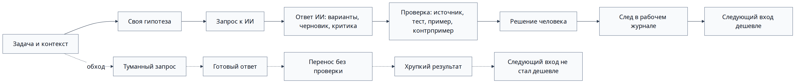{.diagram}


Эту схему нужно читать не как запрет на быстрые ответы.

Иногда быстрый ответ уместен. Например, когда человек уточняет синтаксис, просит вспомнить формат команды или проверяет знакомую мелочь.

Схема говорит о другом: на сложных задачах ответ ИИ должен возвращаться в человеческий контур. Иначе у задачи появляется результат без хозяина.

Граница схемы: она не говорит, что ИИ всегда развивает или всегда разрушает навык. Эффект зависит от задачи, цены ошибки, возможности проверки, уровня опыта и того, сохраняется ли у человека цель, критерий, решение и след.

## Почему гладкий ответ так убедителен

Автоматизация давно создает особый риск: человек начинает полагаться на систему сильнее, чем нужно.

С ИИ этот риск усиливается.

Причина не только в ошибках модели. Причина в том, как человек воспринимает уверенный ответ.

ИИ:

- пишет связно;
- держит тон уверенности;
- быстро заполняет пробелы;
- редко показывает собственную неопределенность так, как ее чувствовал бы человек;
- может объяснить неверную мысль правдоподобным языком;
- может не знать локального контекста, но отвечать так, будто знает.

Это создает опасное ощущение:

```text
раз ответ хорошо звучит,
значит, он хорошо обоснован
```

Так не работает.

Связность ответа - это свойство текста.

Обоснованность ответа - это свойство связи между текстом, источниками, задачей, проверкой и реальным миром.

Эти вещи нужно разводить.

## Уместная зависимость вместо веры и недоверия

Плохие режимы работы с ИИ часто выглядят противоположно, но устроены одинаково грубо.

Первый:

```text
ИИ умнее меня, пусть решает
```

Второй:

```text
ИИ всегда ошибается, значит, им нельзя пользоваться
```

Оба режима слабые.

Когнитивное инженерство требует не веры и не тотального недоверия, а уместной зависимости.

Уместная зависимость отвечает на вопросы:

- какая это задача;
- есть ли у меня способ проверить ответ;
- знаю ли я локальный контекст лучше ИИ;
- насколько велика цена ошибки;
- нужно ли мне сейчас решение, черновик, критика, список вариантов или обучение;
- что будет, если я приму ответ без проверки;
- что я потеряю как навык, если всегда буду отдавать эту часть работы наружу.

Иногда ИИ можно использовать почти как быстрый справочник.

Иногда - как чернового соавтора.

Иногда - как оппонента.

Иногда - как тренера, который задает вопросы, но не дает финальный ответ.

Иногда его лучше не использовать до первой самостоятельной попытки.

Один и тот же инструмент может быть полезным или вредным в зависимости от режима.

## Неровная граница применимости

Данные по ИИ в работе со знанием и разработке ПО не дают простой формулы. На момент проверки источников `2026-05-25` это быстро меняющаяся и неоднородная область: вывод зависит от задачи, метрики, уровня опыта, инструмента и способа проверки.

В некоторых задачах и метриках ИИ может ускорять работу. Особенно там, где есть:

- типовой шаблон;
- ясный критерий результата;
- много синтаксической или текстовой работы;
- низкая цена ошибки;
- быстрые тесты;
- понятная область;
- пользователь, который умеет проверять.

В других задачах ИИ может ухудшать результат или давать ложное чувство продвижения. Особенно там, где есть:

- скрытый локальный контекст;
- архитектурные ограничения;
- высокая цена ошибки;
- неполные требования;
- новые или редкие API;
- безопасность;
- ответственность перед людьми;
- задача вне знакомого паттерна;
- слабая возможность проверки.

Эту границу иногда называют неровной технологической границей.

Смысл простой: ИИ не одинаково помогает везде. Он не как ровная дорога, где любое применение дает одинаковый выигрыш. Он больше похож на ландшафт: рядом могут лежать задача, где ИИ заметно снижает цену работы в выбранной метрике, и задача, где он уверенно ведет в неверную сторону.

Поэтому важнейший навык - не "уметь промптить" вообще.

Важнейший навык:

```text
понимать, на какой стороне границы находится текущая задача
и какие проверки нужны перед переносом ответа в работу
```

## Скорость, качество и обучение - разные вопросы

Разговор об ИИ часто ломается из-за одного смешения.

Люди спрашивают:

```text
ИИ повышает продуктивность?
```

Но под этим вопросом прячутся разные вещи:

| Вопрос | Что измеряется | Почему это не то же самое |
| --- | --- | --- |
| Скорость | Быстрее ли человек завершил задачу. | Быстро завершенная задача может быть неверной, хрупкой или непонятной самому исполнителю. |
| Качество | Стал ли результат точнее, надежнее, полезнее. | Качественный результат может требовать больше времени на проверку и переработку. |
| Обучение | Выросла ли способность человека решать похожие задачи дальше. | Быстрый результат может не оставить навыка, если ИИ забрал постановку, извлечение из памяти, проверку и отладку. |
| Управляемость | Понимает ли человек, что принято, почему и как сопровождать результат. | Внешне готовый результат может скрывать потерю контроля над решением. |

Поэтому фраза "ИИ ускоряет разработчиков" слишком груба для учебника. Она может быть правдой для одной задачи, одной группы людей, одного поколения инструментов и одной метрики. Но она не доказывает, что человек лучше понимает систему, лучше проверяет результат, лучше учится или безопаснее принимает решения.

Свежие исследования по программированию показывают эту неоднородность. На момент проверки `2026-05-25` в одних экспериментах и полевых условиях виден выигрыш по времени или объему выполненной работы. В других контекстах эффект меньше, исчезает или зависит от опыта пользователя, типа задачи и способа измерения. Мета-аналитические и экспериментальные работы по обучению отдельно предупреждают: краткосрочная продуктивность не равна формированию навыка.

Для когнитивного инженерства из этого следует простой редакционный принцип:

```text
утверждение об ИИ всегда должно указывать
задачу,
метрику,
пользователя,
способ проверки
и дату проверки доказательной базы
```

Без этого разговор быстро превращается либо в рекламу, либо в страшилку.

## ИИ в работе разработчика

Разработка делает эту тему особенно наглядной.

ИИ может быть сильным помощником разработчика:

- объяснить незнакомый фрагмент кода;
- предложить гипотезы причины ошибки;
- сгенерировать тесты;
- написать типовой шаблон;
- показать альтернативную реализацию;
- подсветить пограничные случаи;
- составить план миграции;
- сравнить подходы;
- помочь войти в туманную задачу после прерывания.

Но в разработке особенно опасно принять видимость кода за понимание системы.

Код может компилироваться и все равно быть неправильным.

Он может проходить простой тест и ломать соседний сценарий.

Он может быть небезопасным.

Он может не соответствовать архитектурному направлению.

Он может использовать устаревший API.

Он может решать не ту задачу, потому что исходная постановка была неполной.

Поэтому для разработчика вопрос не такой:

```text
написал ли ИИ код?
```

А такой:

```text
восстановил ли человек модель системы,
понял ли изменение,
проверил ли его
и может ли сопровождать результат дальше?
```

## Два режима на одной задаче

Есть ошибка в сервисе. Логи непонятны, контекст утерян, задача неприятная.

Режим обхода:

```text
Вот ошибка. Почини.
```

ИИ предлагает патч. Разработчик переносит его, потому что патч выглядит правдоподобно.

Что потеряно:

- какая была гипотеза;
- какие факты поддерживают ее;
- какие альтернативы исключены;
- какой тест доказывает исправление;
- какие соседние эффекты возможны;
- почему это изменение соответствует системе.

Режим усиления:

```text
Вот симптом.
Вот факты из логов.
Вот что уже проверено.
Вот две гипотезы.
Помоги найти недостающую проверку,
предложи минимальный эксперимент
и укажи, где я могу ошибаться.
```

Здесь ИИ не решает вместо человека. Он помогает собрать следующий ход.

Разница не в длине промпта.

Разница в том, есть ли у человека собственная рабочая модель задачи.

## Как ИИ может снижать цену входа

После глав о прокрастинации, усилии и восстановлении важно увидеть честную пользу ИИ.

Иногда человек не начинает не потому, что не хочет. Он не начинает, потому что вход слишком дорогой:

- непонятно, с чего начать;
- слишком много контекста;
- страшно ошибиться;
- не видно первого проверяемого шага;
- задача расплылась;
- рабочая память перегружена;
- после прерывания не восстановлено состояние.

В таких случаях ИИ может быть хорошим входным усилителем.

Полезные запросы:

```text
разложи задачу на неизвестные места
```

```text
предложи три гипотезы и проверки для каждой
```

```text
найди самый маленький шаг, после которого появится новая информация
```

```text
проверь мой план на скрытые допущения
```

```text
сформулируй вопросы, которые я должен задать перед решением
```

```text
покажи, какие тесты нужны, чтобы не поверить красивому патчу
```

В таких режимах ИИ помогает не избежать мышления, а начать его.

## Как ИИ может разрушать обучение

Способность делать трудное растет через управляемую трудность.

Не через любой стресс.

Не через героический рывок.

А через цикл:

```text
попробовал
-> получил сигнал
-> понял ошибку
-> скорректировал
-> увидел сдвиг
-> присвоил результат
```

Если ИИ постоянно забирает самые важные элементы этого цикла, навык не растет.

Особенно опасно отдавать ИИ:

- постановку вопроса;
- первую гипотезу;
- извлечение из памяти;
- объяснение своими словами;
- выбор проверки;
- отладку;
- принятие решения;
- фиксацию результата.

Это не значит, что ИИ нельзя использовать при обучении.

Можно.

Но режим должен быть другим.

Для обучения полезнее просить:

```text
не решай, задай мне вопросы
```

```text
дай подсказку следующего уровня, но не ответ
```

```text
проверь мое объяснение и найди дыру
```

```text
составь контрпример к моему решению
```

```text
покажи, какой тест я забыл
```

```text
оцени мой план по критериям, но не переписывай его
```

Здесь ИИ становится тренажером, а не заменителем.

## Минимальный протокол работы с ИИ

Для главы 27 мы оставим подробные режимы. Здесь нужен базовый порядок.

### До обращения к ИИ

Зафиксировать минимум:

```text
цель
контекст
что уже известно
что неизвестно
моя гипотеза
какой ответ будет полезен
как я буду проверять результат
```

Если этого нет, высок риск получить гладкий ответ на плохо поставленную задачу.

### Во время работы с ИИ

Просить не только результат, но и структуру проверки:

```text
какие допущения ты сделал
```

```text
какие есть альтернативы
```

```text
что может быть неверно
```

```text
какой минимальный тест отличит варианты
```

```text
какие пограничные случаи стоит проверить
```

```text
что в моем плане слабое
```

### После ответа ИИ

Сделать обратный проход:

```text
что я принимаю
что отклоняю
что нужно проверить
какой тест или источник нужен
что я теперь понимаю лучше
какой следующий шаг
```

И оставить след в рабочем журнале.

Не весь диалог.

А решение:

```text
что спросил
что получил
что проверил
что принял
что осталось сомнительным
что делать дальше
```

Это возвращает результат в человеческую память и снижает цену следующего входа.

## Диагностика: усилитель или обход

| Вопрос | Если ответ "да" | Если ответ "нет" |
| --- | --- | --- |
| Я сформулировал задачу до запроса? | ИИ работает внутри моего контура. | ИИ, вероятно, будет формулировать задачу за меня. |
| У меня есть собственная гипотеза? | Ответ можно сравнить с моей моделью. | Я рискую принять первую связную модель. |
| Я знаю, как проверить ответ? | Можно использовать ИИ как ускоритель. | Нужно сначала построить критерий проверки. |
| Я могу объяснить результат своими словами? | Понимание частично собрано. | Вероятна иллюзия понимания. |
| Ответ оставляет след для следующего входа? | Работа укрепляет контур. | Результат может исчезнуть вместе с диалогом. |
| ИИ убирает лишнее или полезное трение? | Инструмент экономит ресурс. | Инструмент забирает тренировочный материал. |

Эта таблица нужна не для самообвинения.

Она нужна для настройки инструмента.

## Что делать, если ИИ уже стал обходом

Это будет случаться.

Иногда человек устал.

Иногда задача слишком срочная.

Иногда ответ настолько гладкий, что его легко принять.

Если это произошло, не нужно начинать с запрета на ИИ. Нужно вернуть контур.

Минимальный ремонт:

1. Остановить перенос результата.
2. Выписать, что именно принято от ИИ.
3. Назвать, какие допущения в ответе скрыты.
4. Найти одну проверку.
5. Объяснить результат своими словами.
6. Решить, что остается, что отклоняется, что нужно переписать.
7. Зафиксировать это в рабочем журнале.

Так ИИ снова становится материалом для мышления, а не его заменой.

## Границы главы

Это не каталог инструментов и не курс промпт-инжиниринга как отдельной профессии.

Инструменты будут меняться.

Модели будут становиться лучше.

Эмпирика по эффектам продуктивности будет уточняться.

Но базовый вопрос останется:

```text
где находится петля постановки, проверки, решения и авторства?
```

Если она остается у человека, ИИ может быть сильным усилителем.

Если она уходит в инструмент, человек может получить быстрый результат и одновременно потерять управляемость.

## Что это добавляет к учебнику

До этого места учебник работал с человеком, задачей, телом, состоянием, контекстом, мотивацией, восстановлением и внешним следом.

Теперь добавлен новый тип внешнего контура.

ИИ не отменяет предыдущие главы. Он делает их важнее.

Потому что без:

- контекста задачи;
- рабочего журнала;
- понимания цены усилия;
- различения управляемости и иллюзии контроля;
- полезной трудности;
- проверки уровней объяснения;
- авторизации результата

ИИ легко становится очень убедительным обходом мышления.

Дальше это различение нужно превратить в практику: как работать с ИИ так, чтобы не отдавать ему субъектность.

## Короткое резюме

- ИИ - это внешний когнитивный контур, а не просто справочник и не магический партнер.
- Он усиливает мышление, когда снижает цену входа, расширяет пространство вариантов, помогает увидеть ошибки и возвращает человека к проверяемому действию.
- Он становится обходом мышления, когда забирает постановку задачи, гипотезу, извлечение из памяти, проверку, решение и авторство результата.
- Главная цель - не вера в ИИ и не запрет на ИИ, а уместная зависимость от инструмента.
- Чем слабее проверка и выше цена ошибки, тем осторожнее нужно переносить результат ИИ в действие.
- Нельзя выводить обучение, понимание и сохранение навыка только из того, что задача выполнена быстрее.

## Вопросы для самопроверки

1. Как отличить усиление мышления от обхода мышления?
2. Почему гладкость ответа ИИ не является признаком понимания или истинности?
3. Какие части когнитивной петли можно выносить в ИИ без потери субъектности?
4. Где проходит граница уместной зависимости от ИИ?
5. Почему ИИ может одновременно снижать цену входа и разрушать обучение?
6. Почему скорость выполнения задачи не доказывает рост навыка?

## Мини-практика

Возьмите один недавний диалог с ИИ и разберите его по схеме:

```text
моя постановка до запроса:
моя гипотеза до ответа:
что ИИ сделал полезно:
что ИИ сформулировал вместо меня:
как я проверил ответ:
что я могу объяснить своими словами:
какой след остался для следующего входа:
что в следующий раз нужно оставить себе:
```

Цель практики - не обвинить себя за использование ИИ, а настроить границу: какую работу инструмент делает хорошо, а какую работу нельзя отдавать до первого человеческого контакта с задачей.

---

# Глава 27. Как работать с ИИ, не отдавая ему субъектность

## Зачем нужна отдельная глава

Предыдущая глава разобрала главную развилку:

```text
ИИ может усиливать мышление
или обходить мышление
```

Но сама по себе эта мысль еще не говорит, как работать.

В реальной задаче все происходит быстро. Человек устал, контекст распался, срок рядом, рабочая память забита, первый шаг неприятен. ИИ под рукой. Он отвечает связно, уверенно и почти мгновенно. Очень легко попросить:

```text
сделай
```

и получить результат раньше, чем появилась собственная постановка задачи.

Здесь нужна практика. Не для того, чтобы запрещать ИИ. И не для того, чтобы превратить работу с ним в сложный ритуал.

Нужен рабочий порядок, который удерживает простую вещь:

```text
ИИ может помогать,
но цель, критерий, проверка и решение должны оставаться у человека
```

## Что здесь называется субъектностью

Слово "субъектность" легко сделать слишком большим и туманным. Здесь оно используется в рабочем смысле.

Субъектность - это не гордость "я все сделал сам". И не отказ от внешних инструментов. Человек давно думает с записями, схемами, IDE, тестами, книгами, разговорами и рабочим журналом.

Субъектность в работе с ИИ означает, что человек удерживает пять функций:

```text
я задаю цель
я понимаю контекст
я выбираю критерий качества
я проверяю результат
я авторизую решение
```

Если эти функции остаются у человека, ИИ может быть сильным усилителем.

Если они незаметно переезжают в инструмент, человек получает готовый текст, код или план, но теряет управляемость. Он уже не до конца знает, почему задача была поставлена так, почему ответ считается хорошим, что проверено, что не проверено и на каком основании решение можно нести дальше.

Это и есть потеря субъектности в практическом смысле.

## Главная схема работы с ИИ

Рабочий контур выглядит так:

Вопрос схемы:

```text
какой порядок работы удерживает цель, критерий,
проверку и решение у человека,
оставляя ИИ внутри контура, а не вместо него?
```


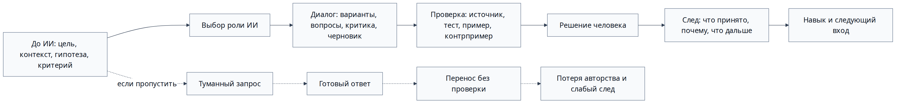{.diagram}


В этой схеме ИИ находится внутри человеческого контура. Он может расширять варианты, формулировать черновики, критиковать, задавать вопросы, предлагать тесты, объяснять термины, помогать с синтаксисом и подсвечивать риски.

Но он не должен незаметно становиться хозяином контура.

Граница схемы: это не универсальный список промптов. Это порядок распределения ответственности: ИИ может давать варианты и материал для проверки, но субъектность держится там, где человек формулирует, проверяет, выбирает и оставляет след.

Хозяин контура отвечает на вопросы:

- зачем это делается;
- что уже известно;
- что неизвестно;
- какой ответ будет полезен;
- как отличить хороший ответ от плохого;
- что принято;
- что отклонено;
- какой след остается для следующего входа.

## До ИИ: оставить минимальный собственный след

Главная ошибка начинается до запроса.

Человек еще не понял задачу, но уже просит ИИ дать решение. Тогда инструмент получает слишком много власти: он формулирует рамку, выбирает важные признаки, предлагает критерий и часто задает направление всей работы.

Перед ИИ нужен минимальный след.

Не большой документ. Не церемония. Иногда достаточно шести строк:

```text
цель:
контекст:
что уже известно:
что непонятно:
моя первая гипотеза:
как я проверю ответ:
```

Эти строки делают две вещи.

Во-первых, они выносят состояние задачи из головы. Это снижает туман.

Во-вторых, они не дают ИИ стать первым автором постановки. Даже если гипотеза слабая, она дает точку сравнения. Ответ ИИ уже не воспринимается как первая и единственная модель реальности. Его можно сопоставить со своей рабочей версией.

Минимальный след до запроса к ИИ особенно важен в сложных задачах:

- баги и архитектурные решения;
- тексты с позицией автора;
- обучение новой теме;
- анализ конфликта;
- планирование проекта;
- ревизия чужого решения;
- решение с высокой ценой ошибки.

Если задача совсем простая, этот след может быть короче. Например, когда нужно вспомнить формат команды или синтаксис функции. Но чем выше цена ошибки и чем больше тумана, тем опаснее начинать с пустого запроса.

## Выбрать роль ИИ

ИИ часто используют так, будто у него одна роль:

```text
дай ответ
```

Это слишком грубо.

В когнитивном инженерстве вопрос звучит иначе:

```text
какую функцию в моей петле действия сейчас должен выполнить ИИ?
```

Роли могут быть разными.

| Роль ИИ | Когда уместна | Главный риск | Проверочный вопрос |
| --- | --- | --- | --- |
| Справочник | Нужно быстро вспомнить формат, термин, API, пример. | Принять неточность или устаревший ответ. | Где источник, документация или локальная проверка? |
| Черновой соавтор | Нужно развернуть набросок, получить первый текст, типовой шаблон, варианты формулировок. | Принять гладкость за качество. | Что я изменил, выбросил или переписал? |
| Оппонент | Нужно найти слабые места плана, аргумента, архитектуры. | Поверить слабой критике, потому что она звучит строго. | Какие возражения проходят проверку? |
| Тренажер | Цель - учиться, а не просто закончить. | Получить готовый ответ вместо опыта действия. | Где моя попытка, извлечение из памяти или объяснение своими словами? |
| Проверочный напарник | Нужны тесты, пограничные случаи, скрытые допущения. | Ограничиться только проверками, которые предложил ИИ. | Какие проверки я добавил независимо? |
| Генератор альтернатив | Нужно расширить пространство вариантов. | Утонуть в вариантах и увеличить WIP. | По какому критерию я выбираю? |

Иногда лучший запрос к ИИ - не "сделай", а:

```text
будь оппонентом
```

или:

```text
не решай, задай мне вопросы
```

или:

```text
предложи проверки, а не финальный вывод
```

Это не тонкость промпта. Это выбор роли инструмента в когнитивной системе.

## Во время ИИ: просить материал для проверки

Слабый запрос просит только результат:

```text
напиши решение
```

Сильный запрос просит еще и проверочную структуру:

```text
какие допущения ты сделал
```

```text
какие есть альтернативные объяснения
```

```text
что в моем плане слабое
```

```text
какой минимальный тест отличит варианты
```

```text
какие пограничные случаи стоит проверить
```

```text
какие источники или локальные факты нужны перед решением
```

```text
что может быть правдоподобным, но неверным
```

Такой диалог не гарантирует истину. ИИ может ошибиться и в критике, и в тестах, и в допущениях.

Но он меняет режим работы. Ответ становится не финальным продуктом, а материалом для проверки.

Это принципиально.

Когда ИИ выдает только готовый результат, человеку остается решить: верить или не верить. Когда ИИ помогает собрать проверки, человек возвращается в позицию исследователя задачи.

## После ИИ: вернуть результат в человеческий контур

После ответа ИИ нужна обратная операция.

Не обязательно сохранять весь диалог. Часто это лишний шум.

Нужно сохранить решение:

```text
что я спросил
что получил
что проверил
что принимаю
что отклоняю
что остается сомнительным
какой следующий шаг
```

Это можно вставить в рабочий журнал задачи.

Главная функция такого следа - не отчетность. След защищает будущий вход.

Через день или неделю диалог с ИИ уже не будет жить в голове. Останется только смутное ощущение: "мы вроде что-то решили". Это плохое состояние. Оно делает следующий вход дорогим и хрупким.

Хороший след выглядит так:

```text
ИИ предложил три причины.
Принята причина B, потому что тест T воспроизвел симптом.
Причина A отклонена: лог L противоречит ей.
Причина C не проверена, оставить как риск.
Следующий шаг: написать regression test на сценарий S.
```

Такой след возвращает результат в человеческую память и в рабочую систему.

## Что нельзя отдавать ИИ слишком рано

Не всякую трудность нужно сохранять. Лишнее трение можно и нужно снимать.

Если человек тратит двадцать минут на поиск синтаксиса, который не является предметом обучения, ИИ может помочь. Если нужно быстро получить список вариантов формулировки, ИИ может помочь. Если нужно сжать уже понятный текст, ИИ может помочь.

Но есть трудности, которые строят навык.

Их нельзя отдавать слишком рано.

| Элемент трудности | Почему его нельзя отдавать сразу | Как ИИ может помочь без подмены |
| --- | --- | --- |
| Первая постановка вопроса | Человек теряет понимание, что именно ищет. | Попросить уточнить уже написанную постановку. |
| Извлечение из памяти | Без извлечения из памяти знание остается знакомым, но слабым. | Попросить проверить собственный ответ и найти дыру. |
| Первая гипотеза | Не появляется точка сравнения с ответом ИИ. | Попросить сравнить несколько своих гипотез. |
| Выбор проверки | Человек не учится отличать объяснение от доказательства. | Попросить варианты тестов и выбрать самому. |
| Объяснение своими словами | Возникает иллюзия понимания. | Попросить оценить свое объяснение. |
| Финальное решение | Теряется авторство и ответственность. | Попросить критический разбор перед решением. |

Это особенно важно при обучении.

Если цель - просто вспомнить команду, готовый ответ нормален.

Если цель - научиться думать в теме, готовый ответ может быть вреден именно потому, что он слишком удобен.

## Учебный режим: ИИ как тренажер

Когда человек учится, ИИ часто полезнее использовать не как решатель, а как тренажер.

Плохой учебный запрос:

```text
объясни тему так, чтобы я понял
```

Он не всегда плох сам по себе. Иногда хорошее объяснение нужно. Но если вся учеба строится только на получении объяснений, появляется знакомость без владения.

Сильнее работают другие запросы:

```text
задай мне 5 вопросов по теме, от простого к сложному
```

```text
я объясню своими словами, а ты найди пробел
```

```text
дай подсказку, но не ответ
```

```text
составь контрпример к моей идее
```

```text
проверь, где я перепрыгнул через шаг рассуждения
```

```text
дай задачу на перенос знания в новый контекст
```

Так ИИ не убирает полезную трудность. Он дозирует ее.

В идеале учебный режим выглядит так:

```text
моя попытка
-> подсказка
-> новая попытка
-> обратная связь
-> объяснение своими словами
-> перенос
```

Это ближе к опыту преодоления из главы 19, чем к потреблению готового текста.

## Производственный режим: ИИ как ускоритель проверяемой работы

В рабочей задаче цель другая. Нужно не только учиться, но и двигать результат.

Здесь ИИ может заметно ускорять отдельные операции:

- сделать черновик;
- предложить варианты;
- собрать таблицу сравнения;
- указать пограничные случаи;
- написать типовой шаблон;
- помочь с тестом;
- сформулировать риск;
- сжать длинный текст;
- найти нестыковку.

Но производственный режим не отменяет проверку.

Хорошее правило:

```text
чем выше цена ошибки,
тем меньше ИИ должен быть финальным ответчиком
и тем больше он должен быть источником вопросов,
вариантов и проверок
```

Для низкорисковой задачи ИИ может дать почти готовый черновик.

Для задачи с высокой ценой ошибки ИИ лучше использовать иначе:

```text
перечисли скрытые допущения
```

```text
назови условия, при которых этот план не сработает
```

```text
предложи независимую проверку
```

```text
какие данные нужны до решения
```

```text
составь список рисков для ревью
```

Там, где ответ нельзя проверить, надо быть особенно осторожным.

ИИ может звучать уверенно именно там, где человек пока не умеет оценить уверенность.

## Разработка: код не равен пониманию

В разработке соблазн особенно сильный: ИИ может сразу написать код.

Но код - не конец задачи.

Разработчик должен понимать:

- какую проблему решает изменение;
- какие ограничения системы учтены;
- какие сценарии покрыты;
- какие тесты доказывают исправление;
- какие соседние эффекты возможны;
- как сопровождать этот код дальше.

Если ИИ написал патч, а человек не может объяснить его, задача не завершена. Она стала внешне похожа на завершенную.

Хороший режим для bugfix:

```text
не пиши патч сразу.

Вот симптом.
Вот контекст.
Вот что изменилось недавно.
Вот моя гипотеза.
Вот что уже проверено.

Предложи:
1. скрытые допущения;
2. альтернативные гипотезы;
3. минимальный воспроизводимый тест;
4. пограничные случаи;
5. вопросы, которые надо закрыть перед патчем.
```

После этого можно просить патч. Но патч должен пройти через локальное понимание и тесты.

Для рефакторинга или архитектурного решения режим еще строже. ИИ может помочь увидеть варианты, но он обычно не знает всех локальных причин, почему система устроена именно так. В таких задачах особенно важно фиксировать:

```text
какую проблему решаем
какой вариант выбран
какие варианты отклонены
почему
какие риски остаются
как проверяем миграцию
```

## Как заметить, что ИИ уже забрал субъектность

Есть несколько признаков.

| Признак | Что происходит | Как вернуть контур |
| --- | --- | --- |
| Я не могу объяснить ответ без текста ИИ. | Возникла знакомость без понимания. | Пересказать своими словами, найти пробел, задать ИИ роль проверяющего. |
| Я не знаю, какие допущения были сделаны. | Инструмент задал рамку за меня. | Выписать допущения и проверить ключевые. |
| Я не знаю, как проверить результат. | Ответ принят до критерия. | Сначала построить тест, источник, пример или контрпример. |
| Я переношу текст или код без изменения. | Черновик стал решением без авторизации. | Остановиться и назвать, что именно принимается. |
| После диалога нет следа. | Следующий вход снова будет дорогим. | Записать решение в рабочий журнал. |
| Я избегаю первой попытки и сразу прошу ИИ. | Убрана полезная трудность. | Сделать маленькую собственную попытку перед запросом. |

Здесь не нужен стыд.

Инструмент так и устроен: он очень хорошо снимает неприятный первый шаг. Иногда это полезно. Иногда он снимает именно тот шаг, который должен был построить понимание.

Задача не в том, чтобы ни разу не ошибаться. Задача - вовремя возвращать контур.

## Минимальный рабочий протокол

Если нужен короткий порядок, он такой.

### 1. Перед запросом

```text
цель:
контекст:
что уже известно:
что непонятно:
моя гипотеза:
роль ИИ:
проверка:
```

Роль ИИ лучше писать явно:

```text
будь оппонентом
```

```text
дай подсказки, но не решение
```

```text
помоги найти проверки
```

```text
сделай черновик, который я буду редактировать
```

### 2. В диалоге

Просить:

```text
альтернативы
допущения
риски
контрпримеры
минимальные проверки
пограничные случаи
вопросы до решения
```

### 3. После ответа

Записать:

```text
принято:
отклонено:
нужно проверить:
проверено:
решение:
следующий шаг:
```

Это небольшой протокол. Но он резко меняет роль ИИ: из машины готового ответа в часть управляемой рабочей системы.

## Когда лучше не начинать с ИИ

Есть ситуации, где первый ход лучше сделать без ИИ.

Например:

- нужно проверить, что ты сам помнишь;
- нужно научиться решать тип задач;
- нужно сформулировать личную позицию;
- нужно почувствовать сопротивление и понять, где именно трудно;
- нужно принять ценностное решение;
- цена ошибки высока, а способ проверки пока не ясен;
- ты уже несколько раз обходил первую попытку через ИИ и навык не растет.

В таких случаях ИИ можно подключить позже:

```text
после первой попытки
после объяснения своими словами
после списка гипотез
после выбора критерия
после минимального теста
```

Это не аскеза.

Это защита тренировочной нагрузки.

## Когда ИИ особенно полезен

Есть и обратные ситуации, где ИИ лучше подключать рано.

Например:

- задача слишком туманна, и нужен первый разбор неизвестных мест;
- человек застрял в одной рамке и нужны альтернативы;
- после прерывания нужно восстановить контекст по рабочему журналу;
- нужно быстро проверить черновик на дыры;
- нужно сгенерировать тестовые случаи;
- нужно снизить цену входа, но не отдавать решение;
- нужно перевести большой материал в структуру для дальнейшего чтения;
- нужно получить вопросы для самопроверки.

Здесь ИИ помогает войти в действие. Он снижает цену первого шага, не отменяя сам шаг.

## Матрица режима: зачем сейчас ИИ

Перед запросом полезно назвать не только роль ИИ, но и режим задачи. Это защищает от одной частой ошибки: использовать один и тот же стиль работы для справочной мелочи, обучения, производственного решения и высокорискового вывода.

| Режим | Что можно отдавать ИИ раньше | Что нужно удержать у человека | Проверка |
| --- | --- | --- | --- |
| Справочный | Формат, синтаксис, пример, черновое объяснение. | Понимание, подходит ли ответ к текущей версии инструмента и локальному контексту. | Документация, быстрый запуск, локальная проверка. |
| Учебный | Вопросы, подсказки, контрпримеры, обратную связь. | Первую попытку, извлечение из памяти, объяснение своими словами, перенос на новую задачу. | Самостоятельное решение, пересказ, задача без ИИ. |
| Производственный | Черновик, варианты, пограничные случаи, тестовые идеи, ревью рисков. | Критерий качества, решение, сопровождение результата. | Тесты, ревью, локальные факты, рабочий журнал. |
| Высокорисковый | Список вопросов, альтернатив, скрытых допущений. | Финальный вывод, ответственность, проверку источников и границ. | Первичные источники, независимая проверка, консультация с ответственным экспертом. |

Один и тот же запрос может быть хорошим в справочном режиме и плохим в учебном. Например, "дай готовое решение" нормально, если нужно вспомнить забытый флаг команды и сразу проверить его локально. Но тот же запрос вреден, если человек учится диагностировать класс ошибок и еще не сделал собственной попытки.

В быстро меняющихся темах, включая сам ИИ, к проверке добавляется дата. Ответ может быть правдоподобным и устаревшим одновременно. Поэтому для исследований, новых инструментов, API, вопросов безопасности и заявлений поставщиков нужна не только связная сводка, но и первичный источник, дата публикации, версия инструмента и понимание, что именно измерялось.

## Границы

Работа с ИИ не переносит ответственность на ИИ.

Если результат идет в код, документ, решение, обучение, коммуникацию или управление людьми, человек должен понимать, что он принял и почему.

Эта глава не учит промпт-инженерингу как отдельной дисциплине. Промпты будут меняться. Модели будут меняться. Интерфейсы будут меняться.

Но базовая инженерная проверка останется:

```text
у кого цель?
у кого критерий?
где проверка?
кто принимает решение?
какой след останется?
что происходит с навыком?
```

Если эти вопросы остаются у человека, ИИ может быть сильным инструментом.

Если они уходят в инструмент, человек может получить быстрый результат и одновременно потерять то, ради чего вообще стоило работать: понимание, управляемость и способность действовать дальше.

## Переход к лидерству

Теперь можно расширить рамку.

То, что было разобрано на уровне одного человека и ИИ, похоже на лидерство.

Лидер тоже работает не с "мотивацией вообще", а с условиями действия:

- ясность задачи;
- автономия;
- управляемость;
- обратная связь;
- цена входа;
- WIP;
- безопасность ошибки;
- авторство результата.

Дальше когнитивное инженерство переходит из индивидуального контура в командную среду.

## Короткое резюме

- Субъектность в работе с ИИ - это удержание цели, критерия, проверки, решения и авторства.
- До ИИ нужен минимальный собственный след: контекст, неизвестное место, гипотеза и критерий полезного ответа.
- Во время работы с ИИ важна роль инструмента: справочник, оппонент, тренажер, черновик, проверочный напарник.
- После ответа нужен обратный ход: проверка, объяснение своими словами, решение и фиксация следа.
- Учебный, производственный и высокорисковый режимы требуют разных границ использования ИИ.
- Для быстро меняющихся тем нужно проверять не только содержание ответа, но и дату, версию инструмента, тип доказательства и первичный источник.

## Вопросы для самопроверки

1. Что значит "отдать ИИ субъектность" в практическом, а не философском смысле?
2. Какой минимальный след стоит оставить до запроса к ИИ?
3. Чем роль "оппонент" отличается от роли "черновик"?
4. Почему после ответа ИИ нужно делать обратный проход?
5. В каких задачах полезно подключать ИИ позже, а не в самом начале?
6. Чем отличаются справочный, учебный, производственный и высокорисковый режимы работы с ИИ?

## Мини-практика

Перед следующим запросом к ИИ заполните короткий пролог:

```text
цель:
контекст:
что я уже понимаю:
что мне неясно:
моя гипотеза:
какая роль нужна от ИИ:
как я проверю ответ:
что должно остаться в моем рабочем журнале:
```

После ответа добавьте второй слой:

```text
что принято:
что отклонено:
что требует проверки:
что я теперь могу объяснить сам:
какой следующий шаг делаю я, а не ИИ:
```

---

# Глава 28. Лидерство как дизайн среды действия

## Почему после ИИ мы переходим к лидерству

Предыдущие главы обсуждали ИИ как внешний инструмент мышления.

Главный вывод был такой: инструмент полезен, если он усиливает человеческую петлю действия, но не забирает цель, проверку, решение и авторство результата.

С лидерством происходит похожая вещь, только на уровне команды.

Лидер тоже может усиливать мышление и действие людей. Он может снижать туман, помогать увидеть цель, защищать фокус, настраивать обратную связь, делать риски видимыми, возвращать управляемость и создавать среду, где трудность становится обучающей.

Но лидер может сделать и противоположное. Он может забирать мышление у команды, раздавать готовые решения, держать контекст только у себя, превращать метрики в давление, а автономию - в фикцию. Тогда команда внешне работает, но не становится сильнее. Люди ждут указаний, скрывают проблемы, защищаются от ошибок, перегружаются или уходят в безразличие.

Поэтому лидерство в когнитивном инженерстве - это не вопрос харизмы.

И не вопрос того, насколько руководитель "умеет мотивировать".

Точнее так:

```text
какую среду действия создает лидер
и что эта среда делает с ясностью,
автономией,
управляемостью,
WIP,
обратной связью
и ценой усилия команды
```

## Лидер не управляет мозгами людей напрямую

Есть плохая, но очень живучая модель лидерства:

```text
руководитель должен заставить людей хотеть правильного
```

Иногда она звучит мягче:

```text
руководитель должен вдохновить
```

Иногда жестче:

```text
руководитель должен продавить результат
```

Обе версии слишком грубы.

Лидер не может напрямую включить человеку мотивацию, внимание, смысл или устойчивость. Он не сидит внутри чужой рабочей памяти и не управляет чужой ценой усилия.

Но лидер может проектировать условия, в которых людям легче или труднее действовать.

Он может менять:

- насколько ясна цель;
- видно ли, зачем задача нужна;
- есть ли у человека реальный рычаг влияния;
- понятен ли критерий качества;
- не разорван ли WIP;
- есть ли обратная связь;
- можно ли безопасно сказать о риске;
- признается ли вклад;
- не живет ли команда в хроническом перегрузе;
- есть ли ритм восстановления и обучения.

Это уже знакомые переменные. Мы вводили их раньше для одного человека. Теперь они становятся переменными командной среды.

## Главная схема

Лидерство как дизайн среды действия можно представить так:

Вопрос схемы:

```text
как лидер влияет не на "мотивационные кнопки" людей,
а на среду, где цель, автономия, WIP,
обратная связь и безопасность делают действие доступнее?
```


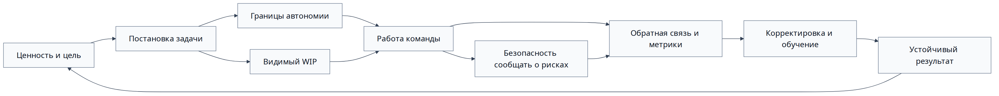{.diagram}


В этой схеме лидер не стоит над каждым действием.

Граница схемы: это не карта контроля над людьми. Она показывает, какие элементы среды лидер может сделать видимыми и управляемыми, чтобы команда сохраняла больше самостоятельности, а не меньше.

Он работает с контуром:

- переводит ценность в понятную цель;
- помогает превратить цель в задачу;
- задает границы автономии;
- делает WIP видимым;
- настраивает петли обратной связи;
- поддерживает безопасность раннего сообщения о проблемах;
- помогает команде корректировать способ действия;
- следит, чтобы результат превращался в обучение, а не только в закрытую карточку.

Команда не становится пассивным исполнителем. Наоборот, хорошая среда возвращает команде больше самостоятельности, потому что цель, границы и обратная связь становятся видимыми.

## Задача как мотивационный интерфейс

Постановка задачи - это не просто передача работы.

Это интерфейс между ценностью и действием.

Одна и та же работа может быть поставлена так, что человек видит смысл, границы и первый шаг. А может быть поставлена так, что у него появляется туман, тревога, сопротивление и желание отложить.

Слабая постановка:

```text
нужно срочно сделать интеграцию
```

В этой фразе может быть правда. Возможно, интеграция действительно срочная. Но для действия в ней слишком мало опор.

Человек не знает:

- зачем нужна интеграция;
- какой минимальный результат нужен первым;
- что точно не входит в объем;
- где можно принимать решения самостоятельно;
- по какому критерию проверят качество;
- какие риски важнее других;
- когда будет ближайшая обратная связь.

Сильная постановка выглядит иначе:

```text
цель:
интеграция нужна, чтобы закрыть конкретный пользовательский сценарий

первый результат:
минимальный end-to-end путь без полной автоматизации всех краев

границы:
не трогаем расширенные сценарии, если они не блокируют первый путь

автономия:
технический способ выбирает команда, но архитектурный риск поднимаем на контрольной точке

критерий:
сценарий S проходит, откат возможен, мониторинг видит ошибку

обратная связь:
через два дня сверяем риск, объем и первый тестовый результат
```

Такая задача не стала легкой. Но она стала рабочей.

В терминах предыдущих глав снизилась цена входа, выросла управляемость, появилась обратная связь и стало понятнее, где проявить профессиональное решение.

## Ясность не равна микроменеджменту

У руководителей часто есть страх: если я слишком подробно сформулирую задачу, я начну микроменеджить.

Это не одно и то же.

Ясность отвечает на вопросы:

```text
зачем
что считаем результатом
какие ограничения
где границы решения
какой риск важен
когда сверяемся
```

Микроменеджмент отвечает за человека:

```text
делай именно так
думай именно так
каждый шаг согласуй
не принимай решений без меня
```

Ясность увеличивает автономию, потому что человек понимает поле игры.

Микроменеджмент уменьшает автономию, потому что забирает способ действия.

Хорошая лидерская постановка дает рамку, но не забирает ремесло.

## Автономия не равна брошенности

Есть и обратная ошибка:

```text
я дал автономию, пусть сами разбираются
```

Иногда это не автономия, а брошенность.

Автономия работает, когда есть:

- понятная цель;
- доступный контекст;
- реальные права решения;
- критерий качества;
- возможность задать вопрос;
- обратная связь;
- ресурс на действие.

Если цели нет, человек не свободен. Он потерян.

Если права решения есть только на словах, человек быстро учится не рисковать.

Если обратная связь приходит только в конце, автономия превращается в лотерею: человек долго работает, а потом узнает, что шел не туда.

Поэтому автономия - это не отсутствие лидера.

Это правильно спроектированная дистанция между рамкой и способом действия.

```text
лидер держит цель, контекст и границы
команда держит способ, экспертизу и локальные решения
```

## Командный WIP - это лидерская проблема

Глава 21 ввела WIP на уровне внимания: если в голове одновременно слишком много незавершенных контекстов, человек теряет фокус и платит цену переключений.

У команды есть похожий WIP.

Он складывается из:

- активных задач;
- незавершенных решений;
- параллельных инициатив;
- ожиданий стейкхолдеров;
- срочных запросов;
- скрытых блокеров;
- незакрытых конфликтов;
- технических долгов, о которых все знают, но никто не держит явно.

Если этот WIP не виден, команда может выглядеть занятой и одновременно терять поток.

Лидер в таком случае не должен просто просить "быстрее".

Первый инженерный вопрос другой:

```text
что сейчас одновременно находится в работе
и что из этого нужно остановить, закрыть, отложить или вынести наружу
```

Командный WIP требует внешнего контура:

- доски;
- явных статусов;
- правил входа новой работы;
- ограничений на параллельность;
- формата срочности;
- контрольной точки для тяжелых задач;
- видимости блокеров.

Без этого сильные люди часто становятся буфером для всего хаоса. На них падает срочное, неясное, недодуманное и эмоционально тяжелое. Снаружи это может выглядеть как доверие к сильным. Внутри это часто путь к самоизносу.

## Каденции как петли обратной связи

Командные ритуалы легко испортить.

Ежедневная синхронизация, планирование, ревью, ретроспектива, индивидуальные встречи, встреча пополнения потока и синхронизация со стейкхолдерами - все это может быть полезным. Но само наличие встречи ничего не гарантирует.

Каденция полезна, если она замыкает петлю:

```text
увидеть состояние
-> обнаружить разрыв
-> принять решение
-> оставить след
-> проверить следующий сдвиг
```

Если встреча не меняет состояние работы, она становится шумом. Она занимает календарь, рвет фокус и создает иллюзию управляемости.

Простой тест:

```text
после этой встречи команде стало яснее,
что делать дальше,
что остановить,
что проверить,
кому помочь
или какой риск поднять?
```

Если нет, ритуал требует ремонта.

Каденции - это не календарная повинность. Это внешний контур команды.

## Безопасность сообщать о проблемах

Команда не может быть управляемой, если плохие новости приходят поздно.

А плохие новости приходят поздно, если говорить о них небезопасно.

Безопасность здесь не означает, что всем всегда приятно. И не означает, что требования отменены.

Она означает другое:

```text
можно сказать "я не понимаю"
можно сказать "мы не успеваем"
можно сказать "я ошибся"
можно сказать "это решение опасно"
можно сказать "мне нужна помощь"
можно не быть наказанным за сам факт раннего сообщения
```

Если за ранний риск человека стыдят, высмеивают или делают виноватым за саму проблему, система учится скрывать.

Тогда лидер теряет обратную связь.

А команда начинает жить в режиме:

```text
сначала терпим,
потом героически тушим,
потом делаем вид, что иначе было нельзя
```

В когнитивном инженерстве это плохая среда. Она повышает угрозу, ухудшает обучение и делает проблемы видимыми слишком поздно.

Безопасная среда не избавляет от ответственности. Наоборот, она делает ответственность возможной раньше.

## Обратная связь как сигнал, а не удар

Обратная связь нужна не для того, чтобы человек почувствовал себя хорошим или плохим.

Она нужна, чтобы действие могло корректироваться.

Хорошая обратная связь отвечает на вопросы:

- что произошло;
- с каким критерием это сравнивается;
- какое последствие это имело;
- что стоит сохранить;
- что стоит изменить;
- какой следующий шаг.

Плохая обратная связь бьет по идентичности:

```text
ты безответственный
ты невнимательный
ты не тянешь
```

Иногда за такими словами есть реальная проблема. Но формулировка не помогает человеку увидеть действие, критерий и следующий шаг. Она повышает угрозу и часто запускает защиту.

Для команды обратная связь должна быть частью нормального рабочего контура, а не редким событием наказания.

И еще важное: позитивная обратная связь тоже не должна быть пустой.

```text
молодец
```

приятно, но слабее, чем:

```text
ты рано поднял риск по интеграции,
и благодаря этому мы успели изменить план до того,
как потеряли неделю
```

Во втором случае человек получает не только признание, но и авторизацию полезного действия.

## Метрики как приборная панель

Метрики легко превратить в дубинку.

Тогда они начинают портить систему: люди оптимизируют показатель, прячут сложность, избегают важных, но плохо измеримых задач, спорят с цифрами или перестают им верить.

В инженерной модели метрики нужны иначе.

Они должны помогать принимать решения о системе:

- где копится WIP;
- где растет lead time;
- где качество падает;
- где работа возвращается;
- где команда перегружена;
- где слишком много срочного;
- где фокус разорван;
- где обещания регулярно не совпадают с возможностью.

Хорошая метрика не отвечает на все вопросы.

Она помогает задать следующий вопрос.

```text
что происходит с потоком
какая гипотеза объясняет сдвиг
что проверим
какое изменение внесем
как поймем, что стало лучше
```

Если метрика используется только для давления, команда будет защищаться от метрики.

Если метрика используется как приборная панель, команда получает еще один внешний контур управления.

## Лидерство и мотивационные области

В главе 8 мы вводили четыре области мотивации: достижение, принадлежность, влияние и безопасность.

Командная среда может поддерживать или разрушать каждую из них.

Достижение поддерживается, когда:

- есть понятная сложность;
- видно улучшение мастерства;
- результат признается;
- обратная связь приходит достаточно рано.

Принадлежность поддерживается, когда:

- человек чувствует связь с командой;
- его вклад видим;
- правила взаимодействия честны;
- конфликты не прячутся под ковром.

Влияние поддерживается, когда:

- у человека есть реальные решения;
- его экспертизу слышат;
- он может менять способ работы;
- предложения не исчезают в пустоте.

Безопасность поддерживается, когда:

- риски можно поднимать рано;
- ошибка разбирается как событие системы, а не как повод уничтожить человека;
- требования ясны;
- помощь доступна до катастрофы.

Это не значит, что лидер должен подбирать каждому человеку "мотивационную кнопку". Такой язык быстро становится манипулятивным.

Лучше думать так:

```text
какую среду мы создаем
и какие мотивы эта среда делает доступными
```

Мотивация сотрудников требует отдельного приближения. Здесь важно увидеть общий уровень: лидерство проектирует не только задачи, но и мотивационный ландшафт команды.

## Лидер как внешний контур команды

Лидер не должен быть единственным человеком, который все помнит и обо всем думает.

Если вся карта команды живет только в голове лидера, система хрупкая.

Но лидер часто отвечает за то, чтобы у команды был внешний контур:

- где лежит цель;
- где виден текущий WIP;
- где зафиксированы решения;
- где видно, что заблокировано;
- где хранятся договоренности;
- где видно, кто за что отвечает;
- где можно восстановить контекст после паузы;
- где команда видит не только задачи, но и смысл.

Это похоже на рабочий журнал из главы 5, но на уровне команды.

Хороший лидер не становится памятью вместо команды. Он помогает команде построить память, которой можно пользоваться.

## Диагностика среды действия

Когда команда буксует, полезно не сразу спрашивать:

```text
кто плохо работает?
```

Иногда нужно спросить:

```text
какой параметр среды разорван?
```

| Симптом | Возможный разрыв среды | Первый инженерный вопрос |
| --- | --- | --- |
| Команда делает много, но не туда. | Нет ясности цели и критерия ценности. | Что считается результатом и почему это важно? |
| Люди ждут указаний. | Автономия не задана или наказуема. | Где границы самостоятельного решения? |
| Все заняты, но поток стоит. | WIP скрыт, много переключений и блокеров. | Что сейчас в работе и что нужно остановить? |
| Ошибки всплывают поздно. | Небезопасно говорить о рисках рано. | Что будет с человеком, который принес плохую новость? |
| Мотивация падает. | Нет связи задачи с ценностью, ростом, принадлежностью или авторством. | Как задача связана с мотивами и развитием человека? |
| Команда устает быстрее, чем учится. | Слишком высокая цена усилия и слабое восстановление. | Какие требования нужно снизить, а какие ресурсы добавить? |

Эта таблица не отменяет личной ответственности. Люди действительно могут ошибаться, избегать, не тянуть задачу или работать ниже ожидаемого уровня.

Но лидерская работа начинается с проверки среды. Иначе можно давить на человека там, где сломана система действия.

## Антипаттерны лидерства

Несколько частых ловушек.

### Героический лидер

Лидер все помнит, все решает, всех спасает, сам закрывает разрывы.

Краткосрочно это работает. Долгосрочно команда не растет, контекст не распределяется, а лидер становится узким местом и кандидатом на выгорание.

### Диспетчер задач

Лидер принимает входящий поток и раздает людям задачи.

Проблема в том, что команда может получать работу без смысла, приоритета, границ и права влиять на способ решения.

### Псевдоавтономия

Команде говорят:

```text
вы самостоятельны
```

но наказывают за самостоятельные решения, меняют критерии задним числом или требуют согласовывать все важное.

Команда быстро учится не проявлять инициативу.

### Метрики вместо мышления

Цифры становятся заменой разговора о системе.

Люди начинают обслуживать показатель, а не ценность.

### Встречи вместо обратной связи

Календарь полон, но решения не фиксируются, риски не закрываются, WIP не уменьшается, следующий шаг не становится яснее.

### Мотивация вместо изменения условий

Человеку объясняют, почему задача важна, но не меняют туман, перегруз, отсутствие автономии или слабую обратную связь.

Это часто не мотивация, а попытка красивее упаковать плохую среду.

## Минимальный протокол лидерского действия

Если нужно быстро вернуть командной задаче управляемость, можно пройти такой порядок.

```text
1. Ценность:
   зачем эта работа нужна и кому она помогает?

2. Результат:
   что будет считаться первым рабочим исходом?

3. Границы:
   что не входит в объем и какие ограничения обязательны?

4. Автономия:
   какие решения команда принимает сама,
   а где нужна контрольная точка?

5. WIP:
   что уже в работе и что нужно остановить или отложить?

6. Риски:
   какие плохие новости мы хотим услышать раньше?

7. Обратная связь:
   когда и по каким сигналам сверяемся?

8. След:
   где фиксируем решение, критерий и следующий шаг?
```

Это не заменяет опыт руководителя. Но такой протокол возвращает лидерство из области впечатления в область проектирования среды.

## Границы главы

Эта глава не является курсом менеджмента.

Она не описывает HR-процессы, оценку результативности, найм, увольнение, компенсации или внутренние регламенты.

Она показывает только один слой:

```text
как лидерская среда меняет когнитивные и мотивационные условия действия команды
```

Иногда локальный лидер не может исправить систему. Если требования хронически выше ресурсов, если организационные решения противоречат целям, если у команды нет реальных полномочий, если люди уже находятся в тяжелом истощении, одной хорошей постановки задач недостаточно.

Это важно держать честно.

Лидерство как когнитивное инженерство не обещает всемогущества. Оно дает язык, чтобы видеть, что именно в среде помогает действовать, а что ломает действие.

## Переход к мотивации сотрудников

Теперь у нас есть рамка лидерской среды.

Следующий вопрос уже более точный:

```text
как видеть мотивацию конкретных людей
и не превращать эту работу в манипуляцию
```

Дальше мотивация сотрудников будет рассматриваться не как "продать задачу любой ценой", а как работа с ценностью, автономией, сложностью, обратной связью, принадлежностью, ростом и границами среды.

## Короткое резюме

- Лидерство в этой модели - это дизайн среды действия, а не прямое управление "мотивацией людей".
- Постановка задачи является когнитивным и мотивационным интерфейсом: она может снижать туман, угрозу и цену входа или усиливать их.
- Автономия в рабочих задачах обычно работает не сама по себе, а вместе с ясностью цели, границами, обратной связью и реальными полномочиями.
- Каденции, метрики, статусы и решения полезны только как петли обратной связи, а не как обслуживание управленческого шума.
- Лидерство имеет границы: локальный лидер не может одним хорошим протоколом компенсировать тяжелое истощение, отсутствие полномочий или организационный перегруз.

## Вопросы для самопроверки

1. Почему лидерство здесь описано как дизайн среды, а не как набор личных качеств?
2. Чем ясность отличается от микроменеджмента?
3. Почему автономия без границ может ухудшать управляемость?
4. Как понять, что каденция стала шумом, а не обратной связью?
5. Какие проблемы нельзя лечить хорошей постановкой задач?

## Мини-практика

Возьмите одну командную задачу и опишите ее как среду действия:

```text
ценность:
первый рабочий результат:
границы и не-цели:
решения, доступные команде:
где нужна контрольная точка:
активный WIP вокруг задачи:
главный риск:
как команда может безопасно сообщить плохую новость:
какая обратная связь покажет продвижение:
где останется след решения:
```

После этого выберите один ремонт среды: уточнить границу, снизить WIP, ввести контрольную точку, сделать риск говоримым или вернуть обратную связь по результату.

---

# Глава 29. Мотивация сотрудников

## После среды действия

Предыдущая глава говорила о лидерстве как о дизайне среды действия.

Лидер не управляет чужой мотивацией напрямую. Он не может залезть человеку в голову и включить смысл, интерес, устойчивость или желание сделать трудную задачу.

Но лидер может менять среду, в которой мотивация становится доступнее или недоступнее:

- ясность цели;
- границы автономии;
- WIP;
- обратную связь;
- безопасность сообщения о рисках;
- признание вклада;
- ритм восстановления;
- качество задач;
- возможность учиться на действии.

Теперь нужно приблизить масштаб.

Не команда вообще, а конкретный человек.

Не абстрактная "вовлеченность", а конкретная встреча человека с задачей:

```text
почему эта задача для него живая или мертвая
почему он входит в нее или избегает
почему он берет ответственность или ждет указаний
почему он растет на трудности или гаснет от нее
```

Здесь легко свернуть в плохой язык:

```text
как замотивировать сотрудника
```

или еще хуже:

```text
как найти его кнопку
```

В когнитивном инженерстве такой язык слишком грубый.

Мотивация сотрудника - это не кнопка. И не постоянное свойство человека. Это состояние, которое возникает на пересечении человека, задачи, среды, тела, опыта и обратной связи.

## Главная схема

Мотивацию сотрудника можно представить как петлю:

Вопрос схемы:

```text
как конкретный человек, задача, среда,
состояние и обратная связь вместе делают действие живым
или недоступным?
```


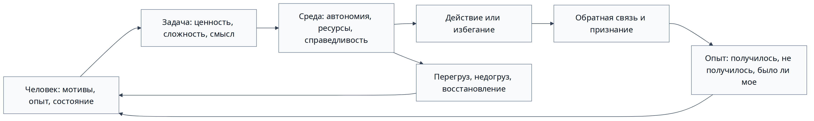{.diagram}


В этой схеме нет отдельной коробки "мотивация".

Потому что мотивация не лежит в одном месте.

Граница схемы: она не нужна для поиска "кнопки" сотрудника. Она нужна, чтобы строить проверяемые гипотезы о встрече человека с задачей и не превращать человека в тип или набор мотиваторов.

Она собирается из нескольких вопросов:

- что человеку сейчас ценно;
- видит ли он смысл задачи;
- есть ли у него автономия;
- чувствует ли он компетентность;
- есть ли связь с командой;
- может ли он влиять на способ действия;
- понятен ли критерий результата;
- не слишком ли высока цена входа;
- не накопился ли перегруз;
- получает ли человек обратную связь;
- становится ли опыт действия опытом роста или опытом бессилия.

Когда эти элементы складываются, человек чаще входит в действие.

Когда они расходятся, снаружи это часто называют "потерей мотивации".

Но внутри могут быть совсем разные поломки.

## Мотиватор - это гипотеза, а не ярлык

В управленческой практике часто говорят:

```text
у этого сотрудника главный мотиватор - деньги
у этого - интересные задачи
у этого - признание
у этого - влияние
```

Иногда это полезно как быстрый рабочий язык.

Но в учебнике нам нужно быть аккуратнее.

Если сказать "у него мотиватор - признание", легко начать видеть только одно. Человек перестает быть живой системой и превращается в тип. Дальше лидер начинает не наблюдать, а подтверждать уже выбранный ярлык.

Лучше говорить иначе:

```text
по текущим наблюдениям похоже,
что для него сейчас особенно важны признание и видимый вклад
```

или:

```text
похоже, он оживает там,
где есть техническая неопределенность
и возможность самому выбрать способ решения
```

или:

```text
похоже, сейчас ведущий фактор не рост,
а безопасность: человек боится ошибки,
оценки или потери контроля
```

Это не ярлыки. Это проверяемые гипотезы.

Их можно уточнять:

- по тому, какие задачи человек выбирает;
- где он говорит живее;
- где откладывает;
- где берет ответственность;
- где теряет энергию;
- на какую обратную связь реагирует;
- какие риски поднимает сам;
- где защищается;
- где просит автономии;
- где, наоборот, просит рамку.

Мотивация наблюдается не по одному разговору и не по одной анкете. Она видна в повторяющемся рисунке контакта с задачами.

## Четыре области как линзы наблюдения

В главе 8 мы ввели четыре области мотивации:

- достижение;
- принадлежность;
- влияние;
- безопасность.

В работе с сотрудниками их удобно использовать не как типологию людей, а как линзы.

Один человек может одновременно хотеть роста мастерства, принадлежности к сильной команде, влияния на технические решения и безопасности от хаотичных требований. В разные периоды одна область может становиться ведущей, но остальные не исчезают.

### Достижение

Достижение поддерживается, когда человек видит:

- сложность, которая развивает;
- понятный критерий качества;
- обратную связь по результату;
- рост мастерства;
- признание реального вклада.

Если у человека сильна область достижения, его может гасить не трудность, а бессмысленная простота. Он может скучать на задачах, где все заранее решено, где нет вызова, где нельзя стать сильнее.

Но достижение легко ломается, если сложность становится неуправляемой. Тогда задача уже не выглядит как вызов. Она выглядит как угроза провала.

### Принадлежность

Принадлежность поддерживается, когда человек чувствует:

- связь с командой;
- уважение к своему вкладу;
- честные правила взаимодействия;
- возможность быть услышанным;
- отсутствие социальной изоляции.

Если принадлежность разрушена, задача может оставаться интересной, но человек будет работать холоднее. Он перестает чувствовать, что его усилие встроено в общий смысл.

Принадлежность нельзя заменить корпоративной риторикой. Она проверяется тем, как команда реагирует на ошибки, вклад, помощь, несогласие и трудные разговоры.

### Влияние

Влияние поддерживается, когда у человека есть:

- реальные решения;
- область ответственности;
- право менять способ работы;
- доступ к обсуждению причин и последствий;
- ощущение, что его экспертиза что-то меняет.

Если человеку дают ответственность без рычагов, влияние превращается в фикцию. Если ему дают задачи без возможности влиять на способ решения, мотивация быстро сжимается до исполнения.

### Безопасность

Безопасность поддерживается, когда:

- критерии понятны;
- ошибка не уничтожает человека;
- можно рано сказать о риске;
- не меняют правила задним числом;
- нагрузка не является хронически разрушительной;
- есть предсказуемость и справедливость.

Безопасность не означает отсутствие требований. Она означает, что система не держит человека в постоянной угрозе.

Когда безопасность провалена, другие мотивы часто становятся недоступными. Человеку трудно думать о мастерстве, принадлежности или влиянии, если он занят защитой от наказания, хаоса или перегруза.

## Внутренняя и внешняя мотивация без лозунгов

Есть соблазн сказать:

```text
внутренняя мотивация хорошая,
внешняя мотивация плохая
```

Это слишком просто.

Внешние условия важны. Деньги, должность, признание, договоренности, ожидания, дедлайны, карьерные последствия - все это реально влияет на поведение.

Проблема не в том, что стимул внешний.

Проблема в том, как он действует.

Внешний стимул может поддерживать действие, если он:

- проясняет ценность;
- дает честную обратную связь;
- признает вклад;
- помогает человеку увидеть рост;
- делает правила справедливыми;
- не забирает автономию.

Но он может ломать мотивацию, если становится контролирующим:

- "делай, потому что иначе накажут";
- "тебе не нужно понимать, просто выполняй";
- "мы обещаем признание, но критерии меняются";
- "выбор формально есть, но решение уже принято";
- "твой вклад важен, но его никто не видит".

Внутренняя мотивация тоже не означает вечный энтузиазм.

Человек может быть внутренне мотивирован и при этом уставать, сомневаться, злиться, брать паузы, просить помощи. Внутренняя мотивация не отменяет тело и среду.

Лучше думать так:

```text
насколько человек переживает действие как свое,
осмысленное,
посильное,
связанное с ростом,
связанное с людьми,
и подтверждаемое обратной связью
```

## Гигиенический пол мотивации

В менеджерском языке часто используют различение гигиенических и мотивационных факторов.

Для нашего учебника это полезно, если не превращать его в догму.

Гигиенический уровень удобно понимать как пол: если он провален, мотивационная работа быстро становится фальшивой.

К нему относятся:

- справедливая оплата;
- предсказуемые правила;
- уважение;
- безопасность;
- допустимая нагрузка;
- нормальные инструменты;
- ясные ожидания;
- отсутствие хронического хаоса;
- базовое доверие;
- возможность восстановиться.

Если этот пол провален, рискованно начинать разговор с фразы:

```text
давай найдем тебе интересную задачу
```

Человек может думать не об интересе, а о несправедливости, усталости, риске, неопределенности или нарушенном доверии.

Но хороший гигиенический пол сам по себе не создает глубокой мотивации.

Справедливая оплата важна. Но она не обязательно делает задачу осмысленной.

Предсказуемые правила важны. Но они не обязательно дают рост мастерства.

Нормальная нагрузка важна. Но она не обязательно дает чувство вклада.

Поэтому у мотивационной работы два слоя:

```text
сначала не ломать пол
потом проектировать рост, смысл, автономию,
принадлежность, влияние и обратную связь
```

## Задача как мотивационный профиль

Одна и та же задача может быть поставлена так, что человек оживает, а может быть поставлена так, что он закрывается.

Важно не только содержание задачи, но и ее профиль.

Минимальный профиль можно собрать по семи вопросам:

| Вопрос | Что он проверяет |
| --- | --- |
| Зачем это нужно? | Ценность и значимость задачи. |
| Что будет результатом? | Критерий успеха и снижение тумана. |
| Где здесь рост? | Достижение, мастерство, полезная трудность. |
| Что человек решает сам? | Автономия и влияние. |
| С кем это связано? | Принадлежность, вклад в команду, связь с пользователями. |
| Когда будет обратная связь? | Замыкание петли действия и авторизация результата. |
| Какая цена входа? | Усилие, WIP, риск перегруза, состояние. |

Если задача важная, но в ней нет автономии, она может ощущаться как исполнение чужой воли.

Если есть автономия, но нет критерия результата, она может ощущаться как брошенность.

Если есть сложность, но нет обратной связи, труд может переживаться как расход в пустоту.

Если есть смысл, но цена входа слишком высока, человек может хотеть результата и все равно избегать действия.

Мотивационная постановка задачи не обязана быть длинной.

Но она должна дать человеку достаточно опор:

```text
зачем
что считается результатом
что можно решить самому
где нужна сверка
почему это посильная трудность
как будет виден вклад
когда вернется обратная связь
```

## Когда "продать задачу" - плохая формула

В рабочих материалах часто встречается идея: если сотрудник не хочет задачу, ее надо "продать" через его мотиваторы.

В этом есть рациональное зерно: задача должна быть связана с тем, что человеку действительно важно.

Но формула опасна, если ее понимать буквально.

Продавать можно честно, когда задача действительно содержит:

- ценность;
- развитие;
- влияние;
- связь с командой;
- полезную трудность;
- видимый вклад;
- справедливые условия.

Тогда лидер не манипулирует. Он помогает человеку увидеть реальную связь задачи с важной для него областью.

Но если задача плохо сформирована, если условия несправедливы, если WIP уже переполнен, если человек истощен, если автономия фиктивна, попытка "продать" становится красивой упаковкой плохой среды.

Тогда правильный вопрос другой:

```text
что в задаче или среде нужно изменить,
чтобы мотивационная связь стала честной?
```

Иногда задача правда нужна, но неприятна. Не вся работа может быть любимой.

Тогда честная постановка не притворяется:

```text
это будет интересно
```

если это не так.

Она говорит:

```text
это рутинная, но важная работа
вот почему она нужна
вот как мы ограничим объем
вот где будет поддержка
вот как мы признаем вклад
вот что после нее не должно стать постоянной нормой
```

Это не романтизация рутины. Это уважение к реальности.

## Наблюдение мотивации

Мотивацию нельзя надежно узнать одним вопросом:

```text
что тебя мотивирует?
```

Человек может не знать. Может отвечать социально ожидаемо. Может говорить про одно, а оживать в другом. Может описывать прошлую мотивацию, которая уже изменилась.

Поэтому наблюдение важнее анкеты.

Полезные сигналы:

- какие задачи человек берет быстрее;
- где просит больше автономии;
- где просит четкую рамку;
- о чем говорит с энергией;
- какую обратную связь запоминает;
- где раздражается;
- где уходит в формальность;
- в каких задачах растет качество;
- после каких задач восстанавливается, а после каких гаснет;
- где берет ответственность без просьбы;
- где избегает даже при высокой компетентности.

Эти сигналы не дают окончательного диагноза.

Они дают гипотезы для разговора.

```text
я заметил, что в задачах с технической неопределенностью
у тебя обычно больше энергии,
а в задачах с готовым решением ты быстрее гаснешь.
Похоже ли это на правду?
```

Это лучше, чем:

```text
тебе просто нужны сложные задачи
```

Первое открывает проверку.

Второе закрывает человека ярлыком.

## Разговор о мотивации

Разговор о мотивации должен начинаться с фактуры, а не с оценки личности.

Плохо:

```text
ты стал немотивированным
```

Лучше:

```text
я вижу, что последние две недели задачи чаще зависают,
а в обсуждениях стало меньше твоих предложений.
Хочу понять, что изменилось:
задачи, нагрузка, ясность, обратная связь, состояние?
```

Плохо:

```text
тебе надо проявлять больше инициативы
```

Лучше:

```text
я хочу понять, где тебе не хватает пространства для решения,
а где, наоборот, не хватает рамки или контекста
```

Плохо:

```text
эта задача важная, поэтому надо постараться
```

Лучше:

```text
задача важная вот по этой причине.
Давай проверим, что в ней понятно,
что ты можешь решать сам,
где есть риск,
и какая обратная связь нужна раньше всего
```

Разговор не должен превращаться в допрос:

```text
какой у тебя мотиватор?
почему ты не вовлечен?
что мне сделать, чтобы ты хотел?
```

Он должен быть совместной диагностикой:

```text
что мешает действию
что делает задачу живой
что делает ее чужой
что можно изменить в задаче
что можно изменить в среде
что зависит от тебя
что зависит от меня
что выше нас обоих
```

## Потеря мотивации: диагностическая таблица

Одна и та же внешняя картина может иметь разные причины.

| Внешний симптом | Возможная поломка | Что проверить | Первый ход |
| --- | --- | --- | --- |
| Не начинает задачу. | Туман, высокая цена входа, низкая управляемость, страх ошибки. | Понятны ли цель, первый шаг, критерий, права решения? | Сузить первый результат, вернуть рамку и ближайшую обратную связь. |
| Делает только минимум. | Нет авторства, смысла, роста или признания. | Видит ли человек вклад и связь с ценностью? | Показать значимость, дать область решения, вернуть обратную связь по вкладу. |
| Избегает ответственности. | Псевдоавтономия, наказание за инициативу, низкая безопасность. | Что происходило после прошлых решений и ошибок? | Уточнить границы автономии и безопасную контрольную точку. |
| Горит на новых задачах, гаснет на рутине. | Нужна сложность и рост, но рутина не авторизована. | Что в рутине обязательно, что можно автоматизировать, где виден вклад? | Ограничить объем рутины, связать ее с ценностью, добавить улучшение процесса. |
| Часто раздражается. | Дисбаланс усилия и вознаграждения, несправедливость, перегруз, конфликт ценностей. | Не расходится ли усилие с признанием, правилами и ресурсами? | Сначала признать фактуру и проверить справедливость системы. |
| Выглядит холодным и отстраненным. | Восстановительный долг, маршрут выгорания, потеря принадлежности, цинизм. | Есть ли истощение, дистанция, редукция эффективности? | Не давить мотивацией; снизить нагрузку, вернуть безопасность, искать поддержку. |
| Скучает и теряет качество. | Недогруз, маршрут профессиональной скуки, слишком низкая сложность. | Есть ли вызов, развитие, целостность задачи, обратная связь? | Добавить осмысленную сложность, пересборку работы, видимый результат. |

Эта таблица не отменяет личной ответственности.

Но она защищает от плохого вопроса:

```text
почему человек не хочет?
```

и переводит к лучшему:

```text
какой элемент мотивационного контура сейчас не работает?
```

## Индивидуальное и системное

Иногда мотивационная проблема действительно находится близко к индивидуальному уровню.

Например:

- человеку нужна более ясная обратная связь;
- задача плохо связана с его текущей зоной роста;
- он не видит, где может принимать решения;
- у него накопился неудачный опыт в этом типе задач;
- он не понимает, зачем работа нужна.

Тогда помогает индивидуальная работа:

- переупаковать задачу;
- уточнить автономию;
- дать меньший первый шаг;
- вернуть обратную связь;
- договориться о поддержке;
- подобрать полезную трудность.

Но иногда проблема системная.

Например:

- WIP команды хронически переполнен;
- срочные задачи постоянно ломают план;
- критерии успеха меняются задним числом;
- вклад не признается;
- нагрузка распределена несправедливо;
- у людей нет реальных полномочий;
- "важность" задач не подтверждается решениями сверху;
- команда не восстанавливается.

Тогда индивидуальный разговор может быть полезен, но он не решит источник.

Если среда продолжит выдавать те же сигналы, мотивация снова будет проседать.

Это одна из главных этических границ лидерства:

```text
не называть личной мотивационной проблемой то,
что является системной проблемой среды
```

## Что нельзя лечить мотивационным нажимом

Есть состояния, где дополнительная мотивация ухудшает дело.

### Перегруз

Если человек уже в хроническом перегрузе, новые слова о важности задачи могут поднять цену входа еще выше.

Тут сначала нужна не мотивация, а снижение требований, приоритизация, восстановление, малый шаг и безопасность.

### Недогруз и скука

Если человек гаснет от отсутствия вызова, новые призывы "быть ответственнее" могут только усилить отчуждение.

Тут нужна не лекция о важности, а возвращение смысла, сложности, обратной связи и возможности влиять на работу.

### Низкая управляемость

Если человек не верит, что его действие меняет исход, обещание награды не обязательно поможет.

Нужно вернуть рычаг:

```text
что именно ты можешь изменить
какой шаг даст сигнал
где твое решение реально влияет
```

### Потеря справедливости

Если человек считает обмен несправедливым, попытка "вдохновить" звучит как обход проблемы.

Сначала нужно разбирать фактуру: ожидания, вклад, признание, правила, нагрузку, компенсацию, карьерные договоренности.

### Тяжелое истощение или клинические состояния

Если речь идет о тяжелом истощении, апатии, депрессивном состоянии, серьезных проблемах со сном или здоровьем, лидер не должен превращаться в терапевта.

Он может поддержать, снизить рабочее давление, помочь с безопасной рамкой и направить к подходящим каналам помощи.

Но учебник не дает медицинского протокола.

## Минимальный протокол работы с мотивацией

Если у сотрудника просела мотивация или задача не запускается, можно пройти такой порядок.

```text
1. Фактура:
   что именно изменилось в поведении, сроках, качестве,
   инициативе, энергии или коммуникации?

2. Контекст:
   какие задачи, события, нагрузки или изменения среды
   совпали с просадкой?

3. Мотивационная область:
   где может быть разрыв:
   достижение, принадлежность, влияние, безопасность?

4. Задача:
   понятны ли ценность, результат, границы,
   автономия, сложность и обратная связь?

5. Управляемость:
   верит ли человек, что его действие реально меняет исход?

6. Цена:
   не слишком ли высока цена входа:
   WIP, усталость, риск, неопределенность, социальная угроза?

7. Гигиена:
   нет ли провала справедливости, нагрузки,
   предсказуемости, уважения или базовых условий?

8. Договоренность:
   что меняем:
   задачу, объем, автономию, поддержку, обратную связь,
   WIP, восстановление или ожидания?
```

Этот протокол не делает разговор механическим.

Он защищает от того, чтобы сразу прыгнуть к самому удобному объяснению:

```text
он не хочет
```

или:

```text
надо лучше мотивировать
```

## Как поддерживать мотивацию без манипуляции

Этичная мотивационная работа держится на нескольких правилах.

### Не скрывать цену

Если задача тяжелая, не нужно притворяться, что она легкая.

Честнее сказать:

```text
это сложная задача,
в ней есть риск,
поэтому мы заранее задаем контрольную точку,
ограничиваем первый результат
и фиксируем, где нужна помощь
```

### Не обещать смысл там, где его нет

Если задача рутинная, не надо искусственно продавать ее как вдохновляющую.

Лучше показать:

- почему она нужна;
- как ограничен ее объем;
- как будет признан вклад;
- что можно улучшить в процессе;
- как не сделать такую рутину постоянной ловушкой.

### Не использовать мотив человека против него

Если человеку важна принадлежность, нельзя постоянно нагружать его через "команда на тебя рассчитывает".

Если человеку важно достижение, нельзя бесконечно отдавать ему трудные задачи без восстановления.

Если человеку важно влияние, нельзя давать ему ответственность без полномочий.

Если человеку важна безопасность, нельзя использовать его осторожность как повод лишить сложных задач.

Мотиватор - это не рычаг эксплуатации. Это область, где человеку может быть важно и живо.

### Давать обратную связь по действию

Обратная связь должна говорить:

```text
что человек сделал
какой эффект это имело
почему это важно
что стоит сохранить
что стоит изменить
какой следующий шаг
```

Так человек получает не просто эмоцию, а карту роста.

### Делать рост видимым

Мотивация часто держится на доказательстве:

```text
мое усилие превращается во что-то
я становлюсь сильнее
команда это видит
следующий шаг доступен
```

Без такого следа даже полезная трудность может переживаться как бесконечный расход.

## Границы главы

Эта глава не учит манипулировать людьми.

Она не предлагает подбирать каждому сотруднику постоянный "тип мотивации".

Она не решает вопросы компенсации, найма, увольнения, оценки результативности или клинической помощи.

Ее задача уже:

```text
дать язык, на котором можно разбирать,
почему человек входит или не входит в действие,
что в задаче и среде поддерживает мотивацию,
а что ее ломает
```

Иногда правильное решение - изменить постановку задачи.

Иногда - дать человеку больше автономии.

Иногда - вернуть обратную связь.

Иногда - снизить WIP.

Иногда - признать, что проблема не в сотруднике, а в системе.

Иногда - честно сказать, что локальный лидер не может компенсировать организационное решение, хронический перегруз или состояние, требующее профессиональной помощи.

## Переход к командному фокусу и выгоранию

Здесь мотивация человека рассматривалась внутри задачи и среды.

Но часто мотивация падает сразу у нескольких людей.

Тогда вопрос уже не только в индивидуальных мотиваторах.

Возможно, команда живет в среде, где:

- слишком много параллельной работы;
- слишком много срочных прерываний;
- контекст постоянно рвется;
- сильные люди становятся буфером для хаоса;
- обратная связь приходит поздно;
- восстановление не встроено в режим;
- перегруз стал нормой.

Это отдельный командный уровень.

Дальше командный фокус, прерывания и выгорание будут рассматриваться не как личная слабость сотрудников, а как системный эффект среды работы.

## Короткое резюме

- Мотивация сотрудника - это не постоянная черта и не кнопка, а состояние внутри задачи, среды, отношений, опыта и телесного ресурса.
- Мотиваторы можно наблюдать только как гипотезы, а не как ярлыки человека.
- Внутренняя и внешняя мотивация не делятся на "хорошую" и "плохую": важно качество регуляции, автономия, компетентность, смысл и контроль.
- Потеря мотивации часто указывает не на плохого сотрудника, а на туман задачи, низкую управляемость, перегруз, недогруз, отсутствие обратной связи, конфликт ценностей или системную проблему.
- Этичная работа с мотивацией помогает человеку и задаче лучше совпасть; она не продает любую задачу любой ценой.

## Вопросы для самопроверки

1. Почему мотиватор нельзя превращать в ярлык сотрудника?
2. Чем гигиенический пол отличается от мотивационного ресурса?
3. Почему формула "продать задачу" опасна?
4. Как отличить потерю мотивации от перегруза, недогруза или слабой обратной связи?
5. Где заканчивается индивидуальный разговор и начинается системное изменение среды?

## Мини-практика

Разберите одну рабочую задачу не через вопрос "как замотивировать", а через профиль мотивации:

```text
для кого задача:
какая ценность может быть живой:
какая область мотивации затронута:
что угрожает автономии:
что угрожает компетентности:
что угрожает принадлежности или признанию:
какая цена усилия сейчас велика:
какой первый управляемый шаг доступен:
какая обратная связь покажет сдвиг:
что в среде нужно изменить:
```

Если в конце остается только "надо сильнее объяснить важность", значит диагностика еще не дошла до условий действия.

---

# Глава 30. Командный фокус, прерывания и выгорание

Предыдущая глава смотрела на мотивацию сотрудника внутри конкретной задачи и среды. Там было важно не превратить человека в набор "мотиваторов" и не пытаться продать ему любую задачу через его сильные стороны.

Но иногда мотивация проседает не у одного человека и не на одной задаче.

Сразу несколько людей начинают откладывать тяжелые треки. Задачи стареют. Встречи проходят, статусы обновляются, но реальный сдвиг становится тоньше. Входящие вопросы кажутся мелкими, но к концу дня никто не может объяснить, куда ушел фокус. Самые сильные участники команды постоянно оказываются в роли спасателей. После выходных команда не выглядит восстановленной. Признания результата вроде бы хватает, но у людей накапливается ощущение: "мы все время что-то тушим, а работа не становится управляемее".

В такой ситуации вопрос уже не в том, как мотивировать конкретного сотрудника.

Вопрос в том, какую среду работы создала команда.

Командный фокус - это не сумма личной дисциплины. Это свойство потока: сколько тяжелых контекстов команда держит активными, как она различает срочность, где хранит состояние задач, как возвращается после прерываний, как видит старение задач и как закрывает рабочую нагрузку восстановлением.

Если этот контур не спроектирован, люди будут платить за него своей рабочей памятью, телом, вниманием и мотивацией.

## Почему личного фокуса недостаточно

Человек может уметь входить в задачу. Он может вести рабочий журнал, оставлять контрольную точку, ограничивать личный WIP и честно защищать глубокие блоки.

Но личная система работает только до определенного предела.

Если любое сообщение может оказаться срочным, человек вынужден проверять входящее раньше, чем поймет, можно ли не проверять. Если у команды нет внешнего состояния тяжелых треков, люди держат контекст в головах. Если "в работе" означает "когда-нибудь вернусь", задачи стареют и создают фон тревоги. Если сильные участники постоянно подхватывают незапланированное, они становятся скрытым буфером хаоса.

В такой среде личный фокус быстро превращается в личную оборону.

Человек не только работает над задачей. Он еще постоянно оценивает:

- вдруг пришло срочное;
- вдруг кто-то заблокирован;
- вдруг я забыл старую задачу;
- вдруг мой трек стоит слишком долго;
- вдруг нужно ответить сразу;
- вдруг мое молчание выглядит как бездействие.

Это не глубокая работа. Это работа в режиме постоянной готовности к переключению.

Командное когнитивное инженерство начинается с признания простой вещи: если среда не различает режимы работы, внимание будет жить в самом дорогом режиме - в режиме проверки всего.

## Главная петля командного распада фокуса

Схема ниже показывает типичную петлю, в которой команда теряет фокус не потому, что люди "плохо концентрируются", а потому что сама среда производит слишком много активных контекстов и прерываний.

Вопрос схемы:

```text
как требования, WIP и неразличимая срочность
производят переключения, восстановительный долг
и риск верхнего или нижнего перекоса?
```


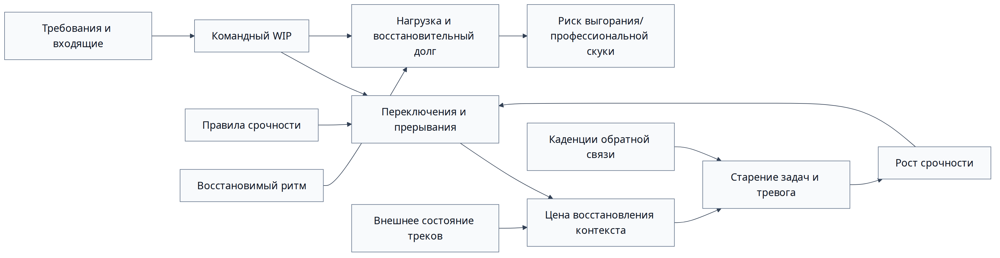{.diagram}


Читать эту схему нужно так.

Команда получает требования и входящие: задачи, баги, просьбы, инциденты, ревью, поддержку, уточнения, координацию, планирование. Часть этой работы становится активным WIP.

Если активного WIP слишком много, растет число переключений. Каждое переключение требует восстановить цель, правила задачи, текущие допущения, место остановки и следующий шаг. Когда таких восстановлений много, задачи начинают стареть. Старение задач повышает тревогу и ощущение срочности. Срочность приводит к новым переключениям.

Параллельно растет восстановительный долг: команда тратит больше, чем успевает восстанавливать. Дальше появляются риски верхнего перекоса, где слишком много требований и мало восстановления, или нижнего перекоса, где много занятости, но мало смысла, вызова и авторства.

У схемы есть и инженерные точки вмешательства:

- внешнее состояние тяжелых треков снижает цену восстановления контекста;
- правила срочности снижают ненужные прерывания;
- каденции обратной связи помогают видеть старение задач до кризиса;
- восстановимый ритм снижает восстановительный долг.

Эта схема не говорит: "нужно меньше работать". Она говорит: "нужно перестать проектировать работу так, будто внимание команды бесконечно".

Граница схемы: это не agile-инструкция и не диагностический тест на выгорание. Она показывает когнитивную цену потока и точки вмешательства; конкретные договоры зависят от роли команды, дежурств, зрелости продукта и организационных ограничений.

## Четыре вида командного WIP

Обычно WIP видят как количество задач в статусе "в работе".

Для когнитивного инженерства этого мало.

У команды есть минимум четыре разных WIP.

| Вид WIP | Что это | Чем опасен |
| --- | --- | --- |
| WIP на доске | Формально начатые задачи, карточки, тикеты, инициативы. | Может создавать иллюзию контроля: на доске видно не все, что держит внимание. |
| WIP в головах | Тяжелые контексты, которые люди пытаются удерживать активными. | Съедает рабочую память, память о целях и готовность входить глубоко. |
| Невидимый WIP | Поддержка, ревью, менторинг, ожидания, незакрытые решения, координация. | Не учитывается в планировании, но потребляет время, внимание и переключения. |
| WIP срочности | Постоянная готовность проверить входящее на предмет "а вдруг сейчас". | Держит систему в режиме тревожного мониторинга и дробит глубокую работу. |

Команда может выглядеть умеренно загруженной по доске и быть перегруженной по вниманию.

Например, у разработчика формально одна задача в работе. Но кроме нее есть ревью, помощь коллеге, ожидание решения от другой команды, незакрытый инцидентный хвост, несколько обсуждений в чатах и личная ответственность "если что, меня позовут". На доске это выглядит как один WIP. В голове - как шесть активных контекстов.

Поэтому вопрос "сколько задач в работе?" полезен, но недостаточен.

Нужны другие вопросы:

```text
сколько тяжелых контекстов сейчас требует удержания?
сколько задач не имеют внешнего состояния?
сколько ожиданий живет только в личной памяти?
сколько людей являются постоянными точками эскалации?
какие входящие заставляют всех проверять себя?
```

## "В работе" должно означать контакт

Статус "в работе" часто становится слишком широким.

Он может означать:

- человек действительно сегодня двигает задачу;
- задача начата, но человек переключился;
- задача ждет ответа;
- задача требует решения;
- задача взята заранее, чтобы показать намерение;
- задача большая и не разбита;
- задача стала фоном тревоги;
- задача уже потеряла актуальность, но ее никто не закрыл.

Для командного фокуса важно сузить смысл активного статуса.

Активная задача должна иметь ближайший кусок продвижения.

Не обязательно большой. Не обязательно финальный. Но содержательный:

```text
что изменится в состоянии задачи после ближайшего рабочего контакта?
```

Если ответа нет, задача, возможно, не готова к работе. Ей нужен не "исполнитель", а разборка: цель, контекст, решение, блокер, критерий, декомпозиция или честное ожидание.

Это меняет тон командного разговора.

Плохой вопрос:

```text
почему задача все еще в работе?
```

Лучший вопрос:

```text
какой следующий срез продвижения по этой задаче?
```

Если срез нельзя назвать, команда узнает что-то важное. Там не лень. Там туман, размер, блокер, перегруз, ожидание, конфликт приоритетов или потеря смысла.

## Старение задач без наказания

Стареющая задача - сильный сигнал, но плохой повод для автоматического обвинения.

Задача может стареть по разным причинам.

| Причина старения | Как выглядит | Первый инженерный вопрос |
| --- | --- | --- |
| Слишком большой кусок | Работа идет, но нет видимого завершения. | Какой минимальный срез можно сделать наблюдаемым? |
| Туман | Задача много обсуждается, но не начинается. | Что неизвестно и какая проверка это прояснит? |
| Нет владельца решения | Все ждут, но неясно кого. | Кто принимает следующее решение и на основании чего? |
| Скрытый блокер | Статус формально активный, фактически ожидание. | Чего именно не хватает для следующего шага? |
| Высокий личный WIP | Человек прыгает между задачами. | Что временно снять из активного внимания? |
| Прерывания | Глубокий вход постоянно рвется. | Какие входящие можно перевести в другой канал или окно? |
| Низкая управляемость | Человек не верит, что его шаг меняет исход. | Где реальный рычаг действия и обратная связь? |
| Потеря смысла | Работа идет формально, без энергии. | Как задача связана с ценностью, ростом или вкладом? |

Разбор стареющих задач должен быть не судом, а диагностикой потока.

Если команда наказывает за старение задач, люди учатся прятать реальное состояние. Они начинают держать задачи формально, обещать оптимистичнее, брать меньше риска в обсуждениях и позднее сообщать о проблемах.

Если команда разбирает старение задач как сигнал, появляется другая культура:

```text
стареющая задача - место, где поток просит внимания
```

Это не мягкость. Это точность.

## Прерывания: проблема не в самом факте

Команда не может жить без прерываний.

Есть инциденты. Есть помощь коллегам. Есть решения, которые нельзя ждать. Есть поддержка, безопасность, продакшен, клиенты, люди, сроки, зависимости.

Цель не в том, чтобы запретить прерывания.

Цель в том, чтобы перестать делать любое входящее похожим на срочное.

Прерывание дорого не только потому, что оно забирает минуты. Оно требует восстановить набор задачи: что я делал, какую гипотезу проверял, какой критерий держал, где остановился, что уже исключил, почему следующий шаг был именно таким.

Если прерывание короткое, но произошло в момент, когда человек держал сложную модель в голове, цена может быть большой. Если прерывание требует социальной реакции, оценки риска или решения под давлением, оно еще и меняет состояние тела: растет напряжение, внимание становится уже, сложнее вернуться к спокойному разбору.

В разработке эта цена часто плохо видна снаружи. Две задачи могут занимать одинаковый слот на доске, но одна требует локальной правки по знакомому шаблону, а другая - восстановления модели кода, зависимостей, причинно-следственных гипотез и уже исключенных путей. Поэтому командный WIP нельзя оценивать только количеством карточек, файлов или строк: нужен вопрос, сколько активных моделей люди вынуждены держать и насколько дорого будет восстановить каждую после разрыва.

Поэтому полезно различать:

| Событие | Что происходит | Что нужно |
| --- | --- | --- |
| Запланированное переключение | Человек выходит из одного трека и входит в другой после контрольной точки. | Нормальный выход, внешний след, следующий вход. |
| Мягкое прерывание | Входящее можно обработать позже, но оно просит внимания сейчас. | Асинхронный канал, ожидания по ответу, не ломать фокус. |
| Настоящая срочность | Есть цена ожидания и нужно быстрое действие. | Отдельный формат: влияние, срок, владелец, запрошенное действие. |
| Кризис | Нужна мобилизация команды. | Явный аварийный режим, роли, запись решений, выход из режима. |

Если все четыре события приходят одинаково, команда живет так, будто каждое сообщение может быть кризисом.

## Срочность должна иметь форму

Настоящая срочность должна быть видна до того, как человек разрушил фокус ради расшифровки сообщения.

Минимальный формат срочного сигнала:

| Поле | Зачем нужно |
| --- | --- |
| Серьезность | Насколько серьезен риск или ущерб. |
| Влияние | Что случится, если не переключиться сейчас. |
| Срок | До какого времени нужно действие или решение. |
| Владелец | Кто ведет ситуацию и собирает контекст. |
| Запрошенное действие | Что именно нужно от адресата. |
| Контекст | Где лежат факты, логи, задача, решение или обсуждение. |

Пример плохого срочного сообщения:

```text
посмотри, пожалуйста, тут проблема
```

Такое сообщение заставляет адресата самому определить все:

- срочно ли это;
- что случилось;
- кто владелец;
- чего от него хотят;
- можно ли ответить через час;
- где контекст.

Пример более здорового сообщения:

```text
[S2, нужен ответ до 15:00]
Падает сценарий X у части пользователей.
Влияние: блокирует релиз Y.
Владелец: назначенный владелец ситуации.
От тебя нужно: подтвердить, можем ли временно откатить флаг Z.
Контекст: ссылка на задачу и лог решения.
```

Такой формат не делает работу холодной. Он уважает внимание.

Человек может быстрее принять решение:

- переключиться сейчас;
- делегировать;
- ответить коротко;
- поставить в ближайшее окно;
- сказать, что нужен другой владелец;
- не разрушать текущий блок без необходимости.

## Внешнее состояние тяжелого трека

Тяжелый командный трек нельзя держать только в голове владельца.

Это риск сразу по нескольким причинам.

Во-первых, владелец становится единственной точкой хранения контекста. Если он заболел, ушел в отпуск, переключился на инцидент или перегорел, команда теряет состояние задачи.

Во-вторых, сам владелец вынужден постоянно поддерживать контекст внутренне. Даже когда он занимается другим, незакрытая модель задачи остается фоном.

В-третьих, помощь становится дорогой. Чтобы подключить другого человека, нужно заново рассказать историю.

Минимальная карточка состояния тяжелого трека может быть такой:

```text
Цель:
Зачем это важно:
Текущий срез:
Что уже известно:
Что решили:
Что исключили:
Что блокирует:
Следующий кусок продвижения:
Кто владелец:
Кому и когда нужен следующий сигнал:
Где лежат материалы:
Контрольная точка последнего контакта:
```

Это не отчетность ради отчетности.

Это рабочая память команды.

Хорошее внешнее состояние должно позволять человеку через несколько дней вернуться и понять:

```text
где мы были
почему остановились
что уже не надо повторять
какой следующий шаг имеет смысл
```

Если для возвращения нужен длинный созвон только с владельцем, внешнее состояние слабое.

## Буфер хаоса

Почти в каждой команде есть люди, которые хорошо справляются с неопределенностью.

Они быстро отвечают. Помогают. Помнят контекст. Подхватывают. Могут за вечер закрыть то, что стояло неделю. Их любят звать в сложные моменты.

Это сильная сторона команды.

Но она легко превращается в системный риск.

Если одни и те же люди постоянно становятся буфером для срочного, неясного и незакрытого, команда покупает стабильность за счет их восстановительного долга.

Снаружи это может выглядеть как надежность:

```text
если что, позовем его
```

Внутри это часто означает:

```text
его фокус всегда считается доступным для чужого хаоса
```

Буфер хаоса опасен тем, что долго выглядит полезным.

Человек может получать признание, ощущение влияния, статус и короткое подкрепление от спасения ситуаций. Но если это становится нормой, у него меньше глубокого времени, меньше восстановления, больше незавершенных контекстов и выше риск истощения или цинизма.

Командный вопрос здесь не:

```text
как сделать так, чтобы сильный человек выдерживал больше?
```

а:

```text
какой хаос мы регулярно отдаем одному и тому же человеку,
почему он возникает,
и как распределить или убрать его источник?
```

Практические ходы:

- ротация дежурства или роли поддержки;
- явный лимит на срочные переключения;
- разбор повторяющихся обращений;
- улучшение документации и внешнего состояния;
- выделение окон для помощи;
- восстановление после тяжелых дежурств;
- признание не только героического тушения, но и устранения причины пожаров.

## Снижение командного риска маршрута выгорания

Выгорание в учебнике уже было отделено от простой усталости. Здесь важно не повторять всю модель, а посмотреть на командные условия риска.

Верхний перекос появляется там, где команда долго живет в сочетании:

```text
высокие требования
низкая управляемость
постоянная срочность
мало восстановления
мало признанного результата
много незавершенности
```

В такой среде люди не обязательно сразу выглядят "выгоревшими".

Сначала они могут выглядеть даже сильнее:

- быстрее отвечают;
- берут больше;
- реже спорят с приоритетами;
- держат несколько треков;
- героически закрывают хвосты;
- становятся незаменимыми.

Но если эта продуктивность покупается будущей доступностью действия, команда накапливает долг.

Снижение командного риска выгорания - это не плакат про заботу о себе.

Это регулярная проверка:

| Командный параметр | Вопрос |
| --- | --- |
| Требования | Не живем ли мы в режиме постоянного превышения доступной мощности? |
| Управляемость | Есть ли у людей реальные рычаги решения, или только ответственность? |
| Ресурсы | Достаточно ли времени, информации, помощи, инструментов и полномочий? |
| Восстановление | Есть ли восстановление после тяжелых периодов, дежурств, инцидентов, релизов? |
| Обратная связь | Видит ли команда результат усилия или только новый список требований? |
| Авторство | Присваивает ли команда результат как свой вклад или только списывает его на случайность и долг? |
| Срочность | Отличаем ли мы настоящую срочность от тревожного шума? |

Если эти вопросы не задаются, команда может долго удерживать результат за счет скрытого истощения.

## Снижение командного риска маршрута профессиональной скуки

Нижний перекос менее очевиден.

Команда может быть занята, но гаснуть.

Люди ходят на встречи, двигают тикеты, отвечают в чатах, поддерживают процесс. Но работа не дает вызова, смысла, авторства или роста. Задачи мелкие, повторяющиеся, фрагментированные. Решения принимаются где-то еще. Обратная связь приходит только как "сделано/не сделано". Сильные люди перестают видеть, где они становятся лучше.

Это не отдых.

Это низкая включенность.

Командный маршрут профессиональной скуки не обязательно выглядит как пустота. Иногда он выглядит как занятость без живого контакта.

Проверочные вопросы:

- есть ли задачи, где люди могут расти;
- видит ли команда смысл своего результата;
- есть ли автономия в способе решения;
- получает ли команда обратную связь о влиянии работы;
- не застряли ли сильные люди в бесконечной поддержке без развития;
- есть ли возможность пересборки работы: менять способ, границы или содержание работы в разумных пределах;
- не стала ли "стабильность" способом убрать весь вызов.

Нижний перекос не стоит пытаться исправить только отдыхом.

Если человеку или команде скучно от низкого вызова и отсутствия авторства, дополнительный отдых может снизить усталость, но не вернет включенность. Нужны смысл, сложность, автономия, обратная связь и видимый вклад.

## Каденции как петли обратной связи

Командные встречи часто воспринимаются как календарная обязанность.

В когнитивном инженерстве каденция нужна только тогда, когда она меняет состояние работы.

Хорошая каденция отвечает хотя бы на один вопрос:

- что стало яснее;
- что перестало быть активным;
- где нужен следующий срез;
- какой блокер поднять;
- что стало срочным и почему;
- где накопился восстановительный долг;
- какой результат нужно авторизовать;
- что можно перестать держать в голове.

Если встреча не меняет внешнее состояние и не снижает цену будущего входа, она может быть шумом.

Разные каденции могут иметь разные функции.

| Каденция | Функция в командном контуре |
| --- | --- |
| Короткая ежедневная синхронизация | Не отчет о занятости, а проверка активного WIP, блокеров и следующего среза. |
| WIP-разбор | Ограничить начатое, увидеть старение задач, вернуть ясность активным задачам. |
| Планирование | Выбрать, что реально готово к работе, а что еще требует разборки. |
| Ретро | Найти системные источники трения, а не только собрать чувства. |
| Разбор инцидента | Снять повторяющуюся срочность через улучшение системы. |
| Разбор восстановления | Проверить, не покупается ли результат восстановительным долгом. |

Не каждой команде нужны все эти формы. Но устойчивой команде полезно понимать, какую петлю обратной связи закрывает ее ритм.

## Минимальные командные договоренности

Глава не предлагает универсальную методологию. Но можно выделить минимальный набор договоренностей, который поддерживает командный фокус.

### 1. У активной задачи есть следующий кусок продвижения

Для каждой задачи в работе команде полезно уметь назвать:

```text
что изменится после ближайшего рабочего контакта
```

Если назвать нельзя, задача требует разборки, а не героического удержания в WIP.

### 2. Тяжелый трек имеет внешнее состояние

Если задача требует нескольких дней, нескольких людей или возврата после паузы, ей обычно нужно внешнее состояние. Не обязательно большой документ. Но важно иметь место, где лежит текущее понимание.

### 3. Срочность приходит в особой форме

Лучше, когда срочное сообщение несет серьезность, влияние, срок, владельца, запрошенное действие и контекст.

Иначе команда учится проверять все.

### 4. Прерывание закрывается контрольной точкой

Если человека прервали, по возможности он оставляет короткий след:

```text
я был здесь
проверял это
следующий шаг такой
```

Если прерывание было слишком резким, после срочного события первым делом восстанавливается место разрыва.

### 5. Старение задач разбирается без наказания

Стареющая задача - повод спросить:

```text
что мешает следующему срезу?
```

А не:

```text
почему ты не справился?
```

### 6. У буфера срочности есть предел

Если в команде есть роль, которая принимает незапланированное, ей нужны:

- границы;
- ротация;
- поддержка;
- восстановление;
- право не держать все остальные треки активными.

### 7. Результат стоит делать видимым и присвоенным

Команде важно видеть не только новые требования, но и закрытые сдвиги:

```text
что изменилось
кто внес вклад
какой риск снят
что теперь легче
что можно больше не держать в голове
```

Без этого петля усилия и вознаграждения ломается. Команда устает не только от нагрузки, но и от того, что нагрузка не превращается в присвоенный результат.

## Диагностика командного фокуса

Если команда теряет фокус, полезно не начинать с общих призывов.

Ниже - рабочая таблица диагностики.

| Сигнал | Возможный механизм | Первый ход |
| --- | --- | --- |
| Задачи долго висят "в работе" | Нет следующего среза, задача слишком большая, скрытый блокер, низкий контакт внимания. | WIP-разбор: назвать следующий кусок или изменить статус задачи. |
| Много срочных сообщений | Срочность не имеет формы, ожидания ответа не проговорены. | Ввести формат серьезность / влияние / срок / владелец / действие. |
| Люди часто "не успели вернуться" | Нет контрольной точки и внешнего состояния. | Мини-шаблон выхода и карточка состояния тяжелого трека. |
| Сильные люди постоянно тушат пожары | Они стали буфером хаоса. | Ротация, разгрузка, анализ повторяющихся причин обращений. |
| Команда занята, но прогресс не чувствуется | Обратная связь не возвращает авторство результата. | Видимый срез результата и авторизация командного вклада. |
| Команда устает быстрее обычного | Высокие требования, прерывания, восстановительный долг. | Снизить активный WIP, восстановить окна фокуса, проверить нагрузку. |
| Люди гаснут без явного перегруза | Низкий вызов, смысл, автономия или обратная связь. | Вернуть осмысленный вызов, пересборку работы, рост и видимый вклад. |
| На встречах много статусов, мало решений | Каденция не меняет состояние работы. | Переписать функцию встречи: что должно стать яснее после нее. |

Эта таблица не заменяет разговоров с людьми. Она защищает от слишком быстрого вывода:

```text
люди потеряли мотивацию
```

Иногда люди потеряли не мотивацию, а управляемый поток.

## Пример: команда живет в режиме "почти срочно"

Представим команду, у которой есть продуктовый трек, технический долг, поддержка, ревью и периодические инциденты.

На бумаге все выглядит нормально:

- задачи есть на доске;
- ежедневные встречи проходят;
- люди отвечают в чатах;
- критичные проблемы закрываются;
- лид видит, что команда старается.

Но через месяц видно другое:

- продуктовый трек двигается рывками;
- технический долг почти не получает глубоких блоков;
- поддержка постоянно врывается в день;
- ревью копится к вечеру;
- решения принимаются в чатах и потом теряются;
- сильные люди знают слишком много контекстов;
- никто не может быстро восстановить, почему задача остановилась.

Если смотреть бытово, можно сказать:

```text
нам нужно лучше приоритизировать
```

Это может быть правдой, но слишком грубо.

Инженерный разбор точнее:

1. Команда не различает режимы: глубокая работа, поддержка, ревью, координация и инциденты смешаны в один день без границ.
2. Срочность не имеет формы, поэтому каждое входящее проверяется как потенциально важное.
3. Тяжелые треки держатся в памяти владельцев, а не во внешнем состоянии.
4. Старение задач воспринимается как неприятный статус, а не как диагностический сигнал.
5. Результат часто закрывается технически, но не авторизуется как командный сдвиг.
6. Восстановительный долг падает на самых сильных участников.

Первые изменения могут быть небольшими:

- выбрать один тяжелый трек как основной фокус недели;
- ограничить число активных задач без следующего среза;
- договориться о формате срочных сообщений;
- выделить роль поддержки на день или неделю;
- ввести короткое внешнее состояние для тяжелых треков;
- на еженедельном разборе смотреть на стареющие задачи без обвинения;
- после закрытия сложного куска фиксировать, какой риск снят и чей вклад это сделал.

Это не магия. Команда все равно будет сталкиваться с прерываниями.

Но теперь прерывания перестанут быть невидимой нормой, а станут управляемой частью системы.

## Роль лидера

Лидер здесь не главный диспетчер всех входящих.

Если лидер становится единственным фильтром срочности, команда получает новую точку перегруза. Лидер начинает держать слишком много контекстов, а команда теряет способность видеть поток самостоятельно.

Роль лидера другая:

- сделать WIP видимым;
- помочь команде договориться о формах срочности;
- защищать глубокие блоки там, где они нужны;
- не поощрять героическую компенсацию плохого процесса;
- замечать людей-буферы;
- задавать вопросы про восстановительный долг;
- переводить старение задач из обвинения в диагностику;
- следить, чтобы результат получал обратную связь и авторство;
- поднимать организационные ограничения выше, если локальная команда не может их решить.

Роль лидера не в том, чтобы думать за всех.

Его задача - проектировать контур, в котором команда может думать вместе.

## Границы главы

Это не инструкция по внедрению Scrum, Kanban, SRE, дежурства, управления инцидентами или конкретной системы планирования.

Она использует язык WIP, срочности, внешнего состояния и восстановления как когнитивно-инженерные элементы, а не как принадлежность к методологии.

Командная карта также не диагностирует выгорание. Если у человека тяжелое истощение, длительная апатия, серьезные нарушения сна, депрессивные симптомы, тревожное состояние или проблемы со здоровьем, команда не должна лечить это правилами WIP.

Командный дизайн может:

- снизить лишние требования;
- вернуть управляемость;
- улучшить восстановление;
- уменьшить шум;
- сделать вклад видимым;
- не превращать сильных людей в постоянные буферы.

Но он не заменяет медицинскую, психотерапевтическую, HR или организационную помощь там, где она нужна.

## Краткий итог главы

Командный фокус - это не требование к людям "быть собраннее".

Это дизайн среды, где:

- активный WIP ограничен;
- тяжелые треки имеют внешнее состояние;
- срочность узнаваема;
- прерывания получают контрольную точку;
- старение задач разбирается без наказания;
- сильные люди не становятся бесконечными буферами;
- результат получает обратную связь и авторство;
- восстановление встроено в рабочий ритм;
- перегруз и недогруз замечаются до того, как становятся привычной нормой.

Так команда сохраняет не только скорость.

Она сохраняет способность снова входить в сложные задачи.

## Переход к практикуму

Учебник прошел путь от индивидуального внешнего контура мышления к мотивации, нейрофизиологии, обучению, продуктивности, ИИ и лидерству.

Теперь можно собрать это в прикладной инструмент.

Дальше начинается практикум: как диагностировать задачу. Разбор будет идти не от абстрактной "проблемы продуктивности", а от конкретной ситуации:

```text
что здесь ценно
что угрожает
какая цена усилия
что управляемо
где внешний контур
какой первый срез
какая обратная связь нужна
и где граница личной, командной или организационной работы
```

## Короткое резюме

- Командный фокус - это свойство среды и правил потока, а не сумма личной дисциплины сотрудников.
- Формальный WIP на доске не равен реальному WIP внимания: поддержка, ожидания, ревью, менторинг и координация тоже занимают контекст.
- Прерывания вредны не самим фактом, а неразличимостью: когда каждое входящее может оказаться срочным, команда живет в постоянной проверке угрозы.
- Старение задачи нужно читать как диагностический сигнал, а не как повод для наказания.
- Снижение риска выгорания и профессиональной скуки начинается с дизайна требований, ресурсов, автономии, обратной связи, восстановления и видимого состояния работы.

## Вопросы для самопроверки

1. Чем командный фокус отличается от личного фокуса?
2. Почему WIP на доске может не совпадать с WIP в головах?
3. Какие параметры делают срочность узнаваемой?
4. Как старение задачи может помочь диагностировать систему, а не обвинять людей?
5. Почему лидер не должен становиться единственным фильтром всех прерываний?

## Мини-практика

Составьте карту командного WIP:

```text
активные продуктовые/инженерные треки:
невидимый WIP поддержки:
WIP ревью и согласований:
WIP срочности:
кто сейчас является буфером хаоса:
какие треки стареют:
где нет внешнего состояния:
какие входящие не имеют формы срочности:
где накапливается восстановительный долг:
```

Затем выберите один командный договор: формат срочности, контрольная точка перед переключением, разбор стареющих задач без наказания, внешнее состояние тяжелого трека или защита одного глубокого блока.

---

# Глава 31. Диагностика задачи

## После большой модели нужен короткий вход

К этому месту учебника уже введено много понятий.

Внешний контур мышления, рабочий журнал, ритуалы входа и выхода, мотивация, угроза, управляемость, цена усилия, усталость, прокрастинация, WIP, восстановление, ИИ и командная среда уже собраны в одну общую модель.

Это полезно, но само по себе еще не делает работу легче.

В реальной задаче человек редко сидит и думает:

```text
сейчас я проведу полный многоуровневый анализ мотивационного контура
```

Обычно ситуация проще и грубее:

```text
задача висит
я не могу войти
я хожу вокруг
я устал
я не понимаю, с чего начать
мне неприятно туда смотреть
команда ждет
```

В такой момент учебник должен дать не новую теорию, а инструмент.

Здесь начинается практикум когнитивного инженерства: предыдущие понятия собираются в одну рабочую карту диагностики задачи.

Диагностика задачи отвечает не на вопрос:

```text
что со мной не так?
```

Она отвечает на другой вопрос:

```text
какой параметр этой задачи сейчас делает действие недоступным
и какой первый ход может этот параметр изменить?
```

Это важный поворот.

Цель не в диагностике личности, а в диагностике конкретной ситуации действия.

## Почему нельзя сразу выбирать прием

Когда задача не двигается, хочется сразу найти прием.

Например:

- разбить задачу на части;
- поставить таймер;
- пообещать себе награду;
- отдохнуть;
- написать кому-то;
- попросить ИИ;
- поставить дедлайн;
- заставить себя начать;
- отменить задачу.

Все эти действия иногда могут быть хорошими.

Но они работают только тогда, когда попадают в реальное место сбоя.

Если проблема в тумане, отдых может вернуть силы, но не даст первого вопроса.

Если проблема в угрозе ошибки, таймер может только ускорить избегание.

Если проблема в низкой управляемости, новый дедлайн повысит давление, но не создаст рычаг.

Если проблема в высокой цене входа, общий совет "разбей задачу" может не помочь, пока не ясно, какая именно цена главная: когнитивная, социальная, физическая, идентичностная или восстановительная.

Если проблема в командном WIP, личная дисциплина одного человека не восстановит поток.

Поэтому когнитивное инженерство начинает практику с диагностики.

Не потому что диагностика важнее действия. А потому что без диагностики действие часто чинит не то.

## Что здесь называется задачей

Здесь задача - это не только пункт в списке дел.

Задача - это конкретная ситуация, где должно измениться внешнее или внутреннее состояние:

- разобраться в непонятной проблеме;
- написать текст;
- сделать ревью кода;
- спроектировать решение;
- подготовить разговор;
- закрыть долг;
- вернуть фокус в трек;
- восстановить рабочий ритм;
- вывести командную задачу из зависания.

У задачи есть не только название.

У нее есть:

- ценность;
- угроза;
- цена входа;
- неизвестность;
- доступные рычаги;
- ограничения;
- социальный контекст;
- способ получить обратную связь;
- место, где хранится текущее понимание;
- граница личного и системного влияния.

Если видеть только название, задача может выглядеть простой:

```text
сделать архитектурный разбор
```

Но для рабочей системы это может означать:

```text
поднять большой контекст,
не ошибиться публично,
разобраться в чужом решении,
сформулировать позицию,
не испортить отношения,
не упустить риск,
и сделать это между пятью прерываниями
```

Это уже не одна задача. Это целый узел напряжения.

Диагностика нужна, чтобы увидеть этот узел не как мутное "тяжело", а как набор рабочих параметров.

## Главная карта диагностики

Рабочий маршрут главы выглядит так:

Вопрос схемы: где именно задача теряет доступность - в ценности, угрозе, цене усилия, тумане, управляемости, внешнем контуре, первом срезе, обратной связи или границе вмешательства?


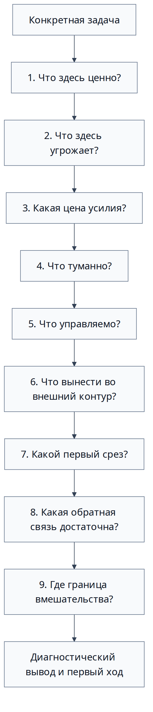{.diagram}


Эта схема не означает, что каждый раз нужно полчаса заполнять анкету.

Граница схемы: это инструмент первого практического разбора, а не бюрократическая форма и не клиническая диагностика состояния человека.

Она означает другое: если задача не двигается, не стоит сразу спорить с собой. Стоит пройтись по параметрам и найти, где действие теряет доступность.

Иногда достаточно двух вопросов.

Иногда нужен полный разбор.

Опытный человек со временем начинает видеть место сбоя быстрее. Но сначала лучше делать карту явно.

## 1. Что здесь ценно

Первый вопрос:

```text
зачем вообще входить в эту задачу?
```

Это не мотивационная подводка.

Ценность нужна, потому что без нее усилие теряет смысл. Если человек не понимает, что изменится благодаря задаче, система будет воспринимать действие как расход.

Ценность может быть разной:

| Область | Как звучит в задаче |
| --- | --- |
| Достижение | Закрыть сложную проблему, улучшить систему, научиться, довести до результата. |
| Принадлежность | Помочь людям, сохранить рабочий контакт, быть надежным участником команды. |
| Влияние | Изменить решение, убрать риск, защитить качество, повлиять на направление. |
| Безопасность | Снизить неопределенность, предотвратить ошибку, вернуть контроль, убрать угрозу. |

Полезно спрашивать:

```text
что станет лучше, если задача сдвинется?
какой риск уменьшится?
кто получит пользу?
какая способность у меня или у команды вырастет?
какой будущий вход станет дешевле?
```

Если ценность не находится, это тоже результат диагностики.

Возможно, задача действительно устарела. Возможно, ее смысл скрыт и требует разговора. Возможно, это чужое требование без понятной связи с результатом. Возможно, она нужна, но формулировка оторвана от реального изменения.

Тогда первый ход не "заставить себя", а вернуть смысл:

```text
уточнить цель,
найти критерий пользы,
связать задачу с более крупным результатом,
или честно поставить вопрос о необходимости задачи
```

## 2. Что здесь угрожает

Вторая часть:

```text
от чего меня защищает незапуск или откладывание?
```

Если задача ценная, это не значит, что она безопасная.

Одна и та же задача может одновременно тянуть к себе и отталкивать.

Например:

- ревью кода ценно, но угрожает конфликтом;
- публичный текст ценен, но угрожает критикой;
- архитектурное решение ценно, но угрожает ошибкой;
- разговор с сотрудником ценен, но угрожает напряжением;
- задача развития ценна, но угрожает встречей с собственной некомпетентностью.

Угроза не доказывает слабость.

Угроза показывает, что система пытается защититься.

Вопросы:

```text
какой плохой исход я ожидаю?
что я могу потерять?
какой образ себя здесь под угрозой?
чья реакция важна?
что будет, если я ошибусь?
какая часть задачи кажется социально опасной?
```

Если угроза реальна, ее нельзя просто отменить позитивной формулировкой.

Нужно спроектировать более безопасный вход:

| Угроза | Более точный первый ход |
| --- | --- |
| Ошибка | Сделать обратимую черновую проверку. |
| Критика | Показать малый фрагмент и запросить обратную связь по одному аспекту. |
| Конфликт | Разделить факты, намерение и просьбу. |
| Бессилие | Назвать реальный рычаг и границу влияния. |
| Перегруз | Ограничить рабочий блок и оставить контрольную точку. |
| Неопределенность | Сформулировать одну проверяемую гипотезу. |

Цель не в том, чтобы убрать страх.

Цель - сделать контакт с задачей достаточно безопасным, чтобы система не выбирала автоматический уход.

## 3. Какая цена усилия

Третий вопрос:

```text
сколько стоит вход в эту задачу сейчас?
```

Не вообще. Именно сейчас.

После сна, спокойного утра и понятного плана цена может быть умеренной. После дня с прерываниями, конфликтом и недосыпом та же задача может стать почти недоступной.

Цена усилия бывает разной:

| Вид цены | Как проявляется | Что может помочь |
| --- | --- | --- |
| Когнитивная | "не держу все в голове", "слишком много контекста". | Внешняя карта, схема, первый вопрос, рабочий журнал. |
| Социально-эмоциональная | "не хочу писать", "будет неприятно", "будет конфликт". | Черновик сообщения, безопасный формат, поддержка, явная рамка разговора. |
| Физическая | недосып, болезнь, боль, физическое истощение. | Реальное восстановление, снижение нагрузки, перенос тяжелого блока. |
| Идентичностная | "если не получится, значит я плохой специалист". | Режим обучения, черновой режим, малая обратная связь, отделение результата от самооценки. |
| Восстановительная | "я уже долго плачу за такие задачи и не восстанавливаюсь". | Изменение WIP, ритма, границ, поддержки, ожиданий. |

Фраза:

```text
у меня нет энергии
```

слишком грубая.

Иногда она означает усталость. Иногда - высокую цену входа. Иногда - угрозу. Иногда - низкую управляемость. Иногда - то, что задача требует слишком много контекста сразу.

Диагностический вопрос:

```text
какой тип цены сейчас закодирован как "не могу"?
```

Если цена когнитивная, нужен внешний контур.

Если цена социальная, нужен формат контакта.

Если цена физическая, нужен не героизм, а восстановление.

Если цена идентичностная, нужен черновой и обучающий режим.

Если цена восстановительная, нужен пересмотр системы нагрузки.

## 4. Что туманно

Туман - это не просто сложность.

Сложная задача может быть понятной:

```text
нужно написать тесты для трех сценариев
```

Туманная задача звучит иначе:

```text
надо разобраться, почему все как-то странно работает
```

Туман опасен тем, что может заставлять рабочую память держать слишком много возможных направлений. Человек не входит в действие, потому что не видит, какой вопрос проверять первым.

Туман полезно превращать в вопросы.

Не так:

```text
ничего не понятно
```

А так:

```text
где именно меняется состояние?
какие факты уже есть?
какая гипотеза первая?
что можно исключить за 20 минут?
какой результат проверки изменит мое понимание?
```

Полезная таблица:

| Мутная формулировка | Рабочий вопрос |
| --- | --- |
| Нужно разобраться в проблеме | Какой один сценарий воспроизводит проблему? |
| Нужно улучшить процесс | Какой сбой повторяется чаще всего? |
| Нужно понять архитектуру | Какой поток данных или решение сейчас блокирует действие? |
| Нужно написать текст | Какой тезис текст должен доказать читателю? |
| Нужно поговорить с человеком | Какое изменение после разговора будет считаться продвижением? |

Пока туман не превращен хотя бы в один вопрос, "работа над задачей" легко становится чтением, подготовкой и перемещением тревоги.

## 5. Что управляемо

Следующий вопрос:

```text
какое действие может реально изменить исход или мое понимание?
```

Управляемость - это не уверенность, что все получится.

Управляемость - это ожидаемая связь:

```text
действие -> сигнал -> корректировка -> сдвиг
```

Задача может быть трудной, но управлямой, если есть:

- первый рычаг;
- доступ к данным;
- право задать вопрос;
- возможность сделать обратимый эксперимент;
- критерий проверки;
- обратная связь, которую можно использовать;
- граница ответственности.

Задача может быть вроде бы несложной, но неуправляемой, если:

- результат зависит от чужого решения, но это не проговорено;
- человек отвечает за исход без полномочий;
- обратная связь приходит поздно или слишком общо;
- критерий успеха меняется;
- нельзя безопасно ошибиться;
- каждый шаг обесценивается новой срочностью.

Практические вопросы:

```text
какой рычаг у меня есть?
какой рычаг у команды есть?
что не находится в моей зоне влияния?
какой сигнал покажет, что шаг сработал или не сработал?
у кого нужно запросить полномочие, данные или решение?
```

Если управляемости нет, личное усилие легко превращается в расход в пустоту.

Тогда первый ход может быть не "делать", а:

```text
уточнить критерий
запросить решение
поставить границу ответственности
поднять блокер
изменить рамку задачи
```

Это тоже действие.

## 6. Что вынести во внешний контур

Если задача сложная, она не должна жить только в голове.

Диагностическая карта должна ответить:

```text
что именно нужно вынести наружу, чтобы следующий вход стал дешевле?
```

Минимальный внешний контур задачи:

```text
цель
текущий вопрос
факты
гипотезы
что уже проверено
что исключено
ограничения
следующий срез
точка продолжения
```

Это не бюрократия.

Это способ не платить каждый раз за повторное восстановление мысли.

Особенно важно выносить:

- факты, которые не надо перепроверять;
- решения, которые уже приняты;
- гипотезы, которые еще не проверены;
- исключенные пути;
- критерий продвижения;
- вопрос к другому человеку;
- контрольная точка перед паузой.

Если внешний контур отсутствует, задача быстро становится дороже при каждом возврате.

Человек может думать, что он "потерял мотивацию", хотя на самом деле он каждый раз заново поднимает холодный контекст.

## 7. Какой первый срез

Первый срез - это минимальное изменение состояния задачи, после которого задача стала понятнее, управляемее или ближе к результату.

Первый срез не обязан завершать задачу.

Он должен изменить состояние.

Плохие первые шаги:

```text
поработать над задачей
почитать материалы
подумать
посмотреть код
начать писать
```

Лучше:

```text
за 25 минут выписать факты и 3 вопроса
проверить один сценарий воспроизведения
прочитать только модуль, где меняется состояние
написать черновик первого тезиса
сформулировать один вопрос владельцу
сравнить два варианта решения по одному критерию
```

Первый срез должен иметь:

- ограничение по времени или объему;
- понятный объект работы;
- критерий, что изменится;
- место для записи результата;
- точку продолжения.

Если первый срез слишком большой, он снова становится всей задачей.

Если он слишком мелкий и не меняет состояния, он становится имитацией движения.

## 8. Какая обратная связь достаточна

Без обратной связи действие не обучает систему.

Человек сделал шаг, но не понял:

- стало ли понятнее;
- уменьшился ли риск;
- приблизился ли результат;
- нужно ли менять гипотезу;
- можно ли продолжать;
- стоит ли остановиться.

Тогда управляемость не растет.

Достаточная обратная связь не обязана быть приятной.

Она должна помогать корректировать действие.

Примеры:

| Задача | Достаточная обратная связь |
| --- | --- |
| Проверить гипотезу в коде | Сценарий воспроизводится или нет; видно место расхождения. |
| Написать текст | Тезис стал яснее; читатель понимает, что доказывается. |
| Сделать ревью | Найдены 2-3 вопроса или подтверждено, что риск не в этой области. |
| Подготовить разговор | Есть факты, намерение, просьба и граница. |
| Разобрать старение командной задачи | У задачи появился следующий срез, владелец, блокер или новый статус. |

Вопрос:

```text
после какого сигнала я смогу решить, что делать дальше?
```

Если такого сигнала нет, первый шаг нужно перепроектировать.

## 9. Где граница вмешательства

Это один из самых важных вопросов практикума.

Не всякая застрявшая задача является личной проблемой.

Иногда достаточно личного вмешательства:

- сделать карту контекста;
- снизить первый шаг;
- оставить контрольную точку;
- сформулировать вопрос;
- сменить режим работы;
- попросить обратную связь.

Иногда нужен командный уровень:

- ограничить WIP;
- уточнить приоритет;
- убрать повторяющиеся прерывания;
- договориться о формате срочности;
- сделать внешнее состояние трека;
- разобрать старение задачи без обвинения;
- распределить поддержку.

Иногда нужен организационный уровень:

- изменить ожидания;
- выровнять полномочия и ответственность;
- снять конфликт приоритетов;
- пересмотреть нагрузку;
- признать нехватку ресурсов;
- эскалировать решение;
- остановить работу, которая создает больше вреда, чем пользы.

Диагностический вопрос:

```text
я пытаюсь личным усилием решить личную, командную или организационную проблему?
```

Если это личная задача, микрошаг может быть хорош.

Если это командный WIP, микрошаг одного человека может только временно скрыть проблему.

Если это организационная противоречивость, личный героизм часто превращается в самоизнос.

Зрелая диагностика иногда заканчивается не действием внутри задачи, а изменением рамки:

```text
нужен владелец решения
нужен другой критерий
нужна разгрузка
нужно остановить параллельный трек
нужно явно принять риск
нужно сказать "это вне моей управляемости"
```

Это не уход от ответственности. Это точное признание уровня вмешательства.

## Быстрая диагностическая таблица

Когда времени мало, можно начать с таблицы сигналов.

| Сигнал | Возможное место поломки | Первый вопрос | Первый ход |
| --- | --- | --- | --- |
| Не начинаю, хотя задача важна | Угроза, цена входа, туман | От чего меня защищает незапуск? | Назвать угрозу и сделать безопасный первый контакт. |
| Читаю и уточняю без конца | Туман, нет проверяемой гипотезы | Какую одну гипотезу можно проверить? | Сформулировать проверку на 20-40 минут. |
| Делаю мелкое вместо главного | Высокая цена глубокого входа, WIP | Какой контекст я избегаю поднять? | Ограничить один глубокий блок и оставить контрольную точку. |
| Начинаю и бросаю | Шаг слишком большой, обратная связь неясна | Какой сигнал покажет продвижение? | Уменьшить срез и заранее определить сигнал. |
| Задача висит "в работе" | Старение задачи, блокер, нет следующего среза | Что мешает следующему срезу? | Назвать блокер, владельца, следующий кусок или изменить статус. |
| После отдыха не лучше | Медленная усталость, долг восстановления, системная нагрузка | Что не восстанавливается? | Проверить WIP, сон, нагрузку, границы и ожидания. |
| Шаг кажется бесполезным | Низкая управляемость | Как действие изменит исход или понимание? | Найти рычаг, данные, обратную связь или эскалировать отсутствие рычага. |
| Все зависит не от меня | Граница влияния | Что личное, что командное, что организационное? | Перенести вопрос на нужный уровень. |

Таблица не заменяет мышление.

Она защищает от автоматического вывода:

```text
я просто ленюсь
```

или:

```text
команда просто плохо фокусируется
```

В большинстве сложных ситуаций проблема точнее.

## Полный пример: туманная инженерная задача

Представим задачу:

```text
периодически объект остается в промежуточном состоянии,
нужно разобраться и предложить исправление
```

Человек третий день не входит в задачу. Он открывает код, читает соседние файлы, отвечает в чатах, смотрит старые обсуждения, но не получает сдвига.

Поверхностная формулировка:

```text
я прокрастинирую
```

Проведем диагностику.

### Задача

```text
Понять, почему объект остается в промежуточном состоянии,
и определить первый безопасный вариант исправления или дальнейшей проверки.
```

Уже видно, что задача не "починить все", а сначала понять место расхождения.

### Ценность

Что здесь ценно:

- снижается риск некорректного состояния данных;
- поддержка получит более понятный сценарий;
- команда перестанет возвращаться к одному и тому же инцидентному хвосту;
- появится знание о слабом месте процесса;
- будущие похожие задачи будут дешевле.

Ценность есть.

Задача не пустая.

### Угроза

Что угрожает:

- можно ошибиться и предложить неверное исправление;
- можно вскрыть, что предыдущие решения были неполными;
- придется задавать вопросы людям, которые уже заняты;
- есть риск потратить много времени и ничего не найти;
- задача может оказаться глубже, чем казалась.

Незапуск защищает от встречи с неопределенностью и возможной некомпетентностью.

Это не "лень". Это защитная политика.

### Цена усилия

Главная цена:

- когнитивная: большой контекст, несколько сценариев, неизвестный порядок операций;
- идентичностная: неприятно долго не понимать;
- восстановительная: задача возвращается после прерываний, каждый вход холодный.

Физическая цена сейчас не главная, но если человек уже недоспал и весь день был в срочностях, она усилит остальные.

### Туман

Мутная формулировка:

```text
непонятно, где ломается состояние
```

Рабочие вопросы:

1. Состояние меняется до внешнего вызова или после него?
2. Что происходит при тайм-ауте?
3. Есть ли обработчик ошибки, который переводит объект в безопасный статус?
4. Какие события уже есть в логах?
5. Можно ли воспроизвести один сценарий локально или на тестовой среде?

Первый вопрос:

```text
где именно меняется состояние относительно внешнего вызова?
```

### Управляемость

Что управляемо:

- можно открыть код перехода состояния;
- можно сравнить успешный сценарий и сценарий с тайм-аутом;
- можно выписать факты;
- можно задать один вопрос владельцу соседнего компонента;
- можно не обещать исправление до проверки гипотезы.

Что не управляемо прямо сейчас:

- поведение внешней системы;
- сроки ответа другого владельца;
- полное исправление без уточнения сценария.

Значит, первый шаг должен быть исследовательским, а не обещающим финальное исправление.

### Внешний контур

Нужно создать короткую карту:

```text
# Задача: объект остается в промежуточном состоянии

## Цель
Понять место расхождения и определить следующий безопасный ход.

## Факты
- Объект создается до внешнего вызова.
- В неуспешном сценарии виден тайм-аут.
- После тайм-аута объект иногда остается в промежуточном статусе.

## Вопрос
Где меняется состояние относительно внешнего вызова?

## Гипотеза
Состояние меняется до внешнего вызова, а обработка тайм-аута не закрывает переход.

## Проверка
Сравнить порядок операций в успешном сценарии и сценарии с тайм-аутом.

## Ограничения
Не менять обработку без понимания влияния на повторные вызовы.
```

Теперь задача перестала быть облаком.

Она стала внешним объектом.

### Первый срез

Первый срез:

```text
За 30 минут открыть код перехода состояния,
найти место изменения статуса,
сравнить успешный сценарий и сценарий с тайм-аутом,
записать, какая гипотеза выжила.
```

Это не вся задача.

Но после такого среза состояние задачи изменится.

### Достаточная обратная связь

После первого среза должно стать ясно одно из трех:

1. Состояние меняется до внешнего вызова, и гипотеза усилилась.
2. Состояние меняется после внешнего вызова, и нужно искать другой участок.
3. Из кода не видно, нужен лог или вопрос владельцу.

Все три исхода полезны.

Даже третий не является провалом, потому что он превращает туман в конкретный следующий запрос.

### Граница вмешательства

Личный уровень:

- собрать факты;
- проверить порядок операций;
- зафиксировать гипотезу;
- оставить контрольную точку.

Командный уровень:

- если задача стареет, вынести внешнее состояние на общее место;
- договориться, кто владеет решением;
- уточнить, кто отвечает за внешний компонент.

Организационный уровень:

- если проблема связана с отсутствием владения или конфликтом требований, это не решается одиночным глубоким блоком.

### Диагностический вывод

Задача не движется не потому, что "нет мотивации".

Основной сбой:

```text
туман + высокая когнитивная цена входа + слабый внешний контур
```

Первый ход:

```text
сделать один исследовательский срез и зафиксировать результат во внешней карте
```

После этого уже можно решать, нужно ли исправление, вопрос, эскалация или новая гипотеза.

## Пример: задача застряла у команды

Теперь короткий командный пример.

На доске есть задача:

```text
улучшить стабильность ночного процесса
```

Она висит "в работе" третью неделю.

Поверхностные объяснения:

```text
нет фокуса
не хватает ответственности
все заняты срочным
```

Диагностика:

| Параметр | Наблюдение |
| --- | --- |
| Ценность | Снизить ночные алерты и ручные вмешательства. |
| Угроза | Можно затронуть критичный процесс и получить новый инцидент. |
| Цена усилия | Высокий контекст, много владельцев, работа ночью или около дежурств. |
| Туман | Не ясно, какой именно класс сбоев самый частый. |
| Управляемость | Команда может собрать статистику по последним сбоям, но не может одна изменить соседний сервис. |
| Внешний контур | Состояние разбросано по чатам, алертам и памяти дежурных. |
| Первый срез | За неделю собрать 5 последних сбоев и классифицировать по причине. |
| Обратная связь | Появится топ-1 класс проблемы и владелец следующего решения. |
| Граница | Если топ-причина в соседнем сервисе, нужен межкомандный договор, а не локальный героизм. |

Диагностический вывод:

```text
задача стареет не из-за отсутствия ответственности,
а из-за тумана, распределенного контекста,
страха сломать критичный процесс
и неясной границы влияния команды
```

Первый ход:

```text
сделать внешнее состояние трека,
собрать последние случаи,
выбрать один класс проблемы,
назначить следующий срез,
и отдельно зафиксировать внешнюю зависимость
```

Это уже не призыв "сфокусироваться".

Это изменение командного контура задачи.

## Шаблон диагностики задачи

Этот шаблон можно вставлять в рабочий журнал.

```text
# Диагностика задачи

## Задача
<что должно измениться>

## 1. Ценность
Что станет лучше, если задача сдвинется?
Какой риск уменьшится?
Кому это важно?

## 2. Угроза
От чего меня или команду защищает незапуск?
Что может пойти плохо?
Какая социальная, профессиональная или идентичностная цена здесь есть?

## 3. Цена усилия
Какая цена главная: когнитивная, социальная, физическая, идентичностная, восстановительная?
Это усталость, высокая цена входа или системный перегруз?

## 4. Туман
Что именно непонятно?
Какие 1-3 вопроса можно проверить?
Какая гипотеза первая?

## 5. Управляемость
Какой рычаг у меня есть?
Какой рычаг у команды есть?
Что вне зоны влияния?

## 6. Внешний контур
Где лежит текущее состояние задачи?
Какие факты, гипотезы, решения и исключенные пути нужно записать?

## 7. Первый срез
Какой срез на 20-40 минут изменит состояние задачи?

## 8. Обратная связь
Какой сигнал покажет, что шаг сработал, не сработал или изменил понимание?

## 9. Граница вмешательства
Это личная, командная или организационная проблема?
Нужен микрошаг, разговор, эскалация, разгрузка, решение или отказ от неверной рамки?

## Диагностический вывод
Основное место поломки:
Первый ход:
Контрольная точка:
```

Не нужно каждый раз заполнять шаблон идеально.

Нужно, чтобы после него стало яснее:

```text
где застряло действие
и что делать первым
```

## Типовые ошибки диагностики

### Ошибка 1. Диагностировать человека вместо задачи

Плохой вопрос:

```text
почему я такой несобранный?
```

Рабочий вопрос:

```text
какой параметр задачи сейчас делает вход дорогим?
```

Человек может быть усталым, испуганным, перегруженным, раздраженным или растерянным. Это важно. Но практическая диагностика начинается с ситуации действия, а не с ярлыка личности.

### Ошибка 2. Остановиться на ценности

Иногда человек говорит:

```text
я понимаю, что задача важная
```

и делает вывод:

```text
значит, я должен просто сделать
```

Но ценность не отменяет угрозу, цену, туман и низкую управляемость.

Если задача важная и одновременно угрожающая, давление может усилить избегание.

### Ошибка 3. Принять усталость за отсутствие мотивации

Если после нескольких недель перегруза задача не идет, вопрос "почему я не хочу?" может быть неверным.

Лучше спросить:

```text
какая цена не восстановилась?
что происходит с WIP?
какой режим работы делает вход недоступным?
```

### Ошибка 4. Делать маленький шаг без обратной связи

Маленький шаг полезен не потому, что он маленький.

Он полезен, если дает контакт с задачей и обратную связь.

Если человек 20 минут перекладывал файлы, но не изменил понимание, это мог быть не первый срез, а обход.

### Ошибка 5. Личным усилием чинить системную проблему

Иногда задача не движется, потому что:

- слишком много активного WIP;
- нет владельца решения;
- конфликтуют приоритеты;
- ответственность не совпадает с полномочиями;
- обратная связь приходит только как новая срочность;
- команда живет в долге восстановления.

В такой ситуации личный микрошаг может быть полезен для ясности, но он не должен скрывать системную причину.

### Ошибка 6. Превратить диагностику в бесконечное размышление

Диагностика должна заканчиваться выводом.

Минимальный вывод:

```text
основное место поломки:
первый ход:
какой обратной связи жду:
где оставлю контрольную точку:
```

Если после диагностики нет первого хода, диагностика не завершена.

## Как понять, что диагностика хорошая

Хорошая диагностика помогает сделать хотя бы одну из этих вещей:

- уточняет ценность;
- может снизить угрозу входа;
- называет главную цену;
- превращает туман в вопрос;
- возвращает рычаг;
- создает внешний контур;
- выбирает первый срез;
- определяет обратную связь;
- переносит проблему на правильный уровень.

Плохая диагностика выглядит умной, но не меняет действия.

Она может много говорить о мотивации, дофамине, дисциплине, тревоге, прокрастинации и выгорании, но не отвечает:

```text
что именно я сделаю или изменю первым?
```

## Мини-словарь главы

| Понятие | Значение |
| --- | --- |
| Диагностика задачи | Внешний разбор конкретной ситуации действия, чтобы найти место сбоя и первый ход. |
| Место поломки действия | Параметр, из-за которого задача сейчас не движется: ценность, угроза, цена, туман, управляемость, обратная связь, WIP, граница. |
| Первый срез | Малый, проверяемый шаг, который меняет состояние задачи, но не обязан завершать ее. |
| Достаточная обратная связь | Сигнал, который позволяет корректировать следующий шаг. |
| Внешний контур | Записанное состояние задачи: цель, факты, вопросы, гипотезы, решения, ограничения, следующий шаг и контрольная точка. |
| Граница вмешательства | Различение личного, командного и организационного уровня проблемы. |
| Диагностический вывод | Короткая формулировка: где застряло действие, какой первый ход нужен и какая обратная связь ожидается. |

## Вопросы для самопроверки

1. Почему диагностика задачи не должна начинаться с вопроса "что со мной не так"?
2. Чем ценность отличается от желания входить в задачу?
3. Почему угроза не является доказательством слабости?
4. Какие виды цены усилия могут скрываться за фразой "нет энергии"?
5. Чем туман отличается от сложности?
6. Почему управляемость не равна высокой вероятности успеха?
7. Что делает первый срез полезным?
8. Чем обратная связь отличается от оценки?
9. Когда правильный вывод диагностики находится не на личном уровне?

## Мини-практика

Возьмите одну задачу, которая висит или вызывает сопротивление.

Заполните короткую форму:

| Вопрос | Ответ |
| --- | --- |
| Что должно измениться? |  |
| Что здесь ценно? |  |
| Что здесь угрожает? |  |
| Какая цена усилия главная? |  |
| Что туманно? |  |
| Что управляемо? |  |
| Что нужно вынести во внешний контур? |  |
| Какой первый срез на 20-40 минут? |  |
| Какая обратная связь будет достаточной? |  |
| Это личный, командный или организационный уровень? |  |
| Первый ход |  |
| Контрольная точка после первого хода |  |

Если вы не можете ответить на все вопросы, это нормально.

Найдите самый мутный пункт и начните с него.

Часто первый срез как раз и состоит в том, чтобы уточнить один недостающий параметр.

## Короткое резюме

1. Диагностика задачи нужна не для самокопания, а для выбора первого вмешательства.
2. Задача может не двигаться из-за разных параметров: ценности, угрозы, цены усилия, тумана, низкой управляемости, слабого внешнего контура, отсутствия обратной связи или системной границы.
3. Ценность не отменяет угрозу и цену.
4. "Нет энергии" нужно расшифровывать, а не оспаривать.
5. Туман полезно превращать в проверяемые вопросы.
6. Управляемость может расти через действие, обратную связь и корректировку.
7. Полезный первый срез меняет состояние задачи.
8. Обратная связь нужна не для оценки человека, а для следующей корректировки.
9. Не всякая застрявшая задача является личной проблемой.
10. Хорошая диагностика заканчивается выводом: где застряло действие, какой первый ход нужен и какая контрольная точка останется.

## Зачем нужен следующий слой

Диагностика дает инструмент для разбора отдельной задачи.

Но если каждый раз собирать его с нуля, он сам станет тяжелой задачей.

Поэтому следующий слой - личный когнитивный контур:

```text
как устроить рабочую систему так,
чтобы вход в задачи,
внешняя память,
первый срез,
обратная связь,
выход,
возвращение
и восстановление
были не случайными приемами,
а повторяемым способом работы
```

Такой контур помогает сделать диагностику не подвигом, а нормальной частью мышления.

---

# Глава 32. Проектирование личного когнитивного контура

## От разовой диагностики к рабочей системе

Диагностическая карта задачи уже собрана.

Она помогает войти в конкретную ситуацию:

```text
что здесь ценно
что угрожает
какая цена усилия
что туманно
что управляемо
какой первый срез
какая обратная связь нужна
где граница вмешательства
```

Это уже практический инструмент.

Но в реальной работе проблема редко состоит в том, что нужно один раз хорошо разобрать одну задачу.

Обычно задач несколько. Они стареют, прерываются, возвращаются, конкурируют за внимание, оставляют тревожный фон, требуют ответов от других людей, иногда зовут ИИ, иногда требуют восстановления, иногда оказываются не личной, а командной или организационной проблемой.

Если каждый вход каждый раз приходится собирать заново, человек платит слишком высокую цену.

Он открывает задачу и снова вспоминает:

```text
что я хотел сделать
где остановился
что уже проверял
почему пошел этим путем
какой вопрос был главным
какой ответ ИИ я тогда принял
что осталось рискованным
что делать первым
```

Часть энергии уходит не на задачу, а на восстановление самой возможности думать.

Поэтому после диагностики задачи нужен следующий слой: личный когнитивный контур.

## Что такое личный когнитивный контур

Личный когнитивный контур - это повторяемая организация работы, в которой человек не держит все важное только в голове.

Контур соединяет:

- карту треков;
- выбор активного WIP;
- правила входа;
- рабочий журнал;
- фокус-блок;
- инструменты и ИИ;
- контрольную точку;
- разбор системы;
- восстановление;
- следующий вход.

Это не приложение. Не набор шаблонов. Не тайм-менеджмент. Не ритуал "идеального утра".

Инструменты могут быть какими угодно: Obsidian, бумага, доска, календарь, трекер задач, обычный текстовый файл, ИИ-диалог, таблица. Важна не марка инструмента, а функция.

Контур должен отвечать на простые рабочие вопросы:

```text
какие треки сейчас существуют?
что сейчас активно?
где лежит состояние каждого важного трека?
как я вхожу в активный трек?
что должно измениться за рабочий блок?
как я использую инструменты и ИИ?
как я выхожу, чтобы следующий вход был дешевле?
как я замечаю, что система начала ломаться?
как я восстанавливаю доступность действия?
```

Если система не отвечает на эти вопросы, она может быть красивой, но она не является рабочим контуром.

## Главная схема контура

Базовый цикл выглядит так:

Вопрос схемы: как собрать повторяемый контур, который удерживает треки, может снижать цену входа, сохраняет ход мысли и не превращает ИИ или инструменты в замену субъектности?


{.diagram}


Эту схему не нужно понимать как длинный чеклист на каждый час.

Граница схемы: это не проект идеальной системы продуктивности. Важно, чтобы контур был достаточно маленьким, чтобы им реально пользоваться, и достаточно полным, чтобы следующий вход не начинался с нуля.

Это цикл сохранения управляемости.

Карта треков показывает, что существует. Выбор активного WIP говорит, что получает глубокий контакт сейчас. Вход поднимает внешнее состояние. Фокус-блок дает срез продвижения. Инструменты и ИИ помогают, но не забирают постановку и проверку. Журнал хранит ход мысли. Контрольная точка готовит будущий вход. Разбор системы помогает чинить правила. Восстановление может делать следующий вход возможным.

Если один элемент выпадает, контур может какое-то время работать, но цена растет.

Нет карты треков - важные задачи живут тревожным фоном.

Нет активного WIP - человек прыгает между тем, что громче.

Нет входа - каждый блок начинается с холодного разгона.

Нет среза - день занят, но состояние задачи не изменилось.

Нет контрольной точки - следующий вход снова дорогой.

Нет разбора системы - система незаметно стареет.

Нет восстановления - контур держится нажимом.

## Контур начинается не с инструментов

Самая частая ошибка - начинать с вопроса:

```text
где вести систему?
```

Это вторичный вопрос.

Сначала нужно понять:

```text
какие функции система должна выполнять?
```

Плохой путь:

```text
найти приложение
-> перенести туда все задачи
-> настроить красивые статусы
-> через неделю перестать открывать
```

Так происходит не потому, что приложение плохое. Часто оно просто не встроено в петлю действия.

Если человек не открывает систему на входе, она становится архивом.

Если не оставляет контрольную точку на выходе, система не защищает будущий вход.

Если разбор системы не приводит к ремонту правил, система становится отчетностью.

Если восстановление не встроено, система превращается в машину нажима.

Поэтому проектировать нужно не место хранения, а контур:

```text
вход
-> действие
-> след
-> выход
-> разбор системы
-> восстановление
-> следующий вход
```

## Карта треков: что живет в системе

Первый элемент - карта треков.

Трек - это не отдельный пункт списка дел. Это рабочий контекст, который может требовать внимания во времени.

Например:

- сложная инженерная задача;
- текст или исследовательская глава;
- регулярные ревью;
- координация с людьми;
- обучение;
- семейное или личное обязательство;
- восстановление после плотной недели;
- фоновый долг, который нельзя забыть;
- ожидающее решение от другого человека.

Если все это лежит в одном TODO-списке, система видит только действия.

Но человеку нужно видеть состояние треков.

Минимальная карта треков:

| Трек | Режим | Где состояние | Следующий срез | Следующий контакт | Риск старения |
| --- | --- | --- | --- | --- | --- |
| Архитектурный разбор | глубокий | Журнал задачи | Проверить гипотезу A | Сегодня 10:00 | Высокий: нет среза 3 дня |
| Ревью кода | оперативный | Очередь ревью | Закрыть 2 риска | После глубокого блока | Средний |
| Учебный текст | фоновый/глубокий | План главы | Собрать примеры | Среда утром | Низкий |
| Вопрос к человеку | ожидание | Заметка/чат | Дождаться ответа | Завтра | Средний |
| Восстановление | восстановление | Календарь/ритм | Вечер без рабочего хвоста | Сегодня вечером | Высокий, если сорвать |

Такая карта не нужна, чтобы любоваться порядком.

Она нужна, чтобы не держать все треки в голове как одинаково активные.

Важное различение:

```text
трек может быть важным,
но не быть активным прямо сейчас
```

Если у неактивного трека есть контейнер и следующий контакт, он перестает тревожно висеть в памяти.

Если контейнера нет, мозг вынужден напоминать о нем через беспокойство.

## Слои личного WIP

Полезно разделять пять слоев.

| Слой | Что это | Какой вопрос задавать |
| --- | --- | --- |
| Глубокий | Треки, требующие анализа, письма, проектирования, понимания. | Какой один глубокий срез сейчас главный? |
| Оперативный | Быстрые ответы, ревью, координация, мелкие решения. | Когда я этим занимаюсь, чтобы не съесть глубокий вход? |
| Ожидание | Ожидание ответа, события, решения, данных. | Где записан следующий контакт и условие возврата? |
| Фоновый | Важное, но не активное сейчас. | Оно хранится во внешнем контейнере или тревожит из головы? |
| Восстановление | Сон, паузы, вечер, движение, отключение, восстановление после нагрузки. | Что защищает будущую доступность действия? |

Слой восстановления важен.

Если восстановление не считается частью системы, оно часто проигрывает срочному и видимому. Тогда личный контур начинает жить в долг.

В краткосрочной перспективе человек может продолжать нажимать. В долгосрочной - следующий вход дорожает, WIP в голове растет, туман становится неприятнее, ИИ все чаще используется как обход, а разбор системы превращается в разговор о том, почему опять не получилось.

## Выбор активного WIP

Полезно, чтобы личная система каждый рабочий период отвечала:

```text
какой трек сейчас получает глубокий контакт?
```

Не "что вообще важно", а именно:

```text
что сейчас получит срез продвижения?
```

Срез продвижения - это изменение состояния трека.

Он не обязан закрывать всю задачу.

Примеры срезов:

| Трек | Срез продвижения |
| --- | --- |
| Исправление ошибки | Проверена одна гипотеза и записан результат. |
| Архитектура | Сравнены два варианта по одному критерию. |
| Текст | Сформулирован главный тезис раздела. |
| Разговор | Выписаны факты, намерение, просьба и граница. |
| Обучение | Извлечено из памяти и проверено одно понятие. |
| Восстановление | Вечер завершен без рабочего хвоста и нового открытого контура. |

Если день дает много активности, но ни одного среза по важным трекам, контур не работает.

Он может быть занятым. Но он не сохраняет управляемость.

## Правило входа

Вход в работу не должен начинаться с вопроса:

```text
есть ли у меня настроение?
```

Настроение может помочь. Но оно слишком ненадежно как точка запуска.

Лучше иметь короткое правило входа.

Минимальный вход:

```text
1. Открыть карту треков.
2. Выбрать один активный срез.
3. Открыть контейнер или журнал трека.
4. Прочитать последнюю контрольную точку.
5. Сформулировать первый проверяемый вопрос.
6. Начать блок.
```

Для тяжелой задачи вход может быть чуть полнее:

```text
Трек:
Почему он сейчас активен:
Последняя контрольная точка:
Ценность текущего среза:
Главная угроза:
Цена входа:
Первый вопрос:
Обратная связь:
Граница блока:
```

Это не стоит заполнять каждый раз как бюрократическую форму.

Полный вход нужен, когда задача не пускает, вызывает сопротивление, распалась после паузы или стала слишком туманной.

В обычный день достаточно короткого входа.

Хорошее правило:

```text
чем хуже состояние,
тем меньше стоит делать вход,
но тем важнее внешнее состояние
```

В плохой день система не должна требовать идеальной дисциплины. Она должна помогать сделать минимальный контакт.

## Фокус-блок: не время, а изменение состояния

Многие системы строятся вокруг времени:

```text
работать 25 минут
работать 2 часа
работать 6 часов в фокусе
```

Время полезно как ограничитель. Но оно не является главным результатом.

Главный вопрос:

```text
что изменилось в состоянии трека?
```

Фокус-блок должен иметь:

- один рабочий вопрос;
- ограничение по времени или объему;
- внешний журнал;
- критерий среза;
- место для результата;
- выход с контрольной точкой.

Например:

```text
За 40 минут проверить,
где меняется состояние объекта относительно внешнего вызова.

Результат блока:
одна схема порядка операций,
одна подтвержденная или отвергнутая гипотеза,
один следующий вопрос.
```

Это лучше, чем:

```text
поработать над задачей
```

Потому что после блока можно увидеть, изменилось ли состояние задачи.

## Рабочий журнал как память контура

Рабочий журнал в личном контуре выполняет не архивную, а операционную функцию.

Он хранит:

- зачем трек активен;
- что уже известно;
- что проверено;
- что исключено;
- какие решения приняты;
- какие допущения открыты;
- где использовался ИИ;
- что принято из ответа ИИ;
- что проверено;
- какой следующий срез;
- где точка продолжения.

Плохой журнал:

```text
Сегодня опять занимался задачей.
Много читал.
Надо продолжить.
```

Он почти не помогает будущему входу.

Хороший журнал:

```text
Проверил гипотезу A: не подтвердилась.
Причина: в сценарии тайм-аута состояние уже изменено до внешнего вызова.
Исключено: обработчик B не влияет на этот переход.
Осталось туманным: почему retry не возвращает безопасный статус.
Следующий срез: сравнить путь повторной попытки в успешном сценарии и сценарии тайм-аута.
Начать с файла X и лога Y.
```

Такой журнал может снижать цену будущего входа.

Главный тест журнала:

```text
будущий я сможет войти в задачу быстрее благодаря этой записи?
```

Если нет, это может быть ценная заметка, но контур не замкнулся.

## ИИ внутри контура

ИИ должен входить в личный контур как инструмент с ролью.

Не так:

```text
вот задача, реши
```

А так:

```text
контекст:
что известно, что проверено, где туман

моя гипотеза:
...

роль ИИ:
помоги найти скрытые допущения
или предложи проверки
или выступи оппонентом
или помоги переписать уже готовый черновик

проверка:
как я пойму, что ответ полезен
```

После ИИ нужен обратный ход в контур:

```text
что ИИ предложил
что я принял
что отверг
что требует проверки
какое решение мое
какой след остался
```

Если этого нет, ИИ может внешне ускорить работу, но внутренне ухудшить следующий вход.

Через день останется не понимание, а смутное:

```text
мы вроде что-то решили
```

Это опасное состояние. Оно похоже на завершение, но не дает управляемого продолжения.

Правило:

```text
ИИ может ускорять контур,
но не должен заменять цель, критерий, проверку, решение и след
```

## Правило выхода

Выход из задачи - это начало следующего входа.

Плохой выход:

```text
устал, закрываю
```

или:

```text
вроде понятно, потом продолжу
```

Такие выходы оставляют будущему человеку холодный контекст.

Хороший выход оставляет контрольную точку.

Минимальная контрольная точка:

```text
Что изменилось:
Что проверено:
Что исключено:
Что осталось туманным:
Следующий срез:
С чего начать:
Когда следующий контакт:
```

Для короткого блока можно использовать еще короче:

```text
сделал:
узнал:
дальше:
```

Главное - чтобы поле "дальше" было физическим или проверяемым.

Не:

```text
продолжить разбираться
```

А:

```text
открыть файл X,
проверить ветку Y,
сравнить два сценария,
написать вопрос владельцу Z
```

Если выход не оставляет следующего действия, система платит за это при следующем входе.

## Разбор системы: ремонт, а не суд над человеком

Разбор системы нужен, чтобы увидеть, работает ли контур.

Но разбор легко испортить.

Плохой разбор спрашивает:

```text
почему я опять не справился?
почему я такой недисциплинированный?
почему я не сделал все, что запланировал?
```

После такого разбора часто больше вины, но не больше управляемости.

Хороший разбор спрашивает:

```text
какой трек получил срез?
какой трек стареет?
где WIP стал слишком широким?
где не было контрольной точки?
где ИИ оставил непроверенный хвост?
где разбор показывает не личный сбой, а системную границу?
что нужно изменить в правилах входа, WIP, коммуникации или восстановлении?
```

Разбор нужен, чтобы ремонтировать контур.

Он может быть коротким.

Ежедневный разбор:

```text
1. Какой срез сегодня появился?
2. Где остался открытый WIP в голове?
3. Какая контрольная точка нужна перед завтра?
4. Что должно восстановить следующий вход?
```

Недельный разбор:

```text
1. Какие треки активны?
2. Какие треки стареют без контакта?
3. Где слишком много глубокого WIP?
4. Где оперативный слой съедает глубокий вход?
5. Где ИИ или инструменты создали непроверенные хвосты?
6. Где нагрузка превышает восстановление?
7. Какой один ремонт системы важнее всего?
```

Разбор системы не должен становиться большим отчетом.

Если его долго писать, он сам станет отдельным треком и начнет конкурировать с работой.

## Восстановление как часть контура

Личный контур не должен заканчиваться на контрольной точке.

После выхода нужен вопрос:

```text
что должно произойти,
чтобы следующий вход был возможен?
```

Иногда достаточно короткой паузы.

Иногда нужен вечер без рабочего хвоста.

Иногда нужно закрыть чат, выйти из операционного режима, поспать, пройтись, поесть, убрать открытые вкладки, перенести непосильный WIP или честно сказать, что еще один глубокий блок сегодня будет фикцией.

Восстановление не является наградой.

Оно является обслуживанием будущей доступности действия.

Если восстановление постоянно вытесняется, контур превращается в петлю самоизноса:

```text
много WIP
-> мало восстановления
-> дороже вход
-> больше избегания и срочности
-> еще больше нажима
-> еще меньше восстановления
```

Это не проблема "неправильного настроя". Это сбой режима.

Поэтому в карте треков восстановление стоит сделать видимым слоем.

Не обязательно в пафосном виде. Достаточно простого вопроса:

```text
что сегодня защищает завтрашний вход?
```

## Как понять, что контур работает

Контур работает не тогда, когда человек идеально следует системе.

Он работает, когда после обычных сбоев есть путь возврата.

Наблюдаемые признаки:

| Признак | Что он означает |
| --- | --- |
| Важные треки видны снаружи. | Они не живут только тревогой и памятью. |
| У активного трека есть следующий срез. | Фокус направлен на изменение состояния, а не на занятость. |
| Неактивные треки имеют следующий контакт. | Их не нужно постоянно удерживать в голове. |
| Вход начинается с внешнего состояния. | Рабочая память не платит каждый раз полную цену восстановления. |
| После блока есть контрольная точка. | Следующий вход подготовлен. |
| ИИ оставляет проверяемый след. | Инструмент усиливает контур, а не стирает авторство решения. |
| Разбор системы приводит к одному ремонту. | Система становится управляемее, а не просто оценивает человека. |
| Восстановление может снижать цену следующего входа. | Контур не живет на долге. |

Если признаки не выполняются, это не повод обвинять себя.

Это повод искать место поломки.

## Типичные поломки личного контура

| Сигнал | Что может быть сломано | Первый ремонт |
| --- | --- | --- |
| Важные задачи тревожат фоном | Нет карты треков или следующего контакта | Выписать треки, контейнеры и следующий контакт. |
| Каждый вход начинается с "что вообще было?" | Слабая контрольная точка | Усилить выход: факты, решение, следующее действие. |
| День занят, но нет сдвига | Нет срезов продвижения | Ввести правило одного среза для активного трека. |
| ИИ дает ответы, но навык не растет | ИИ стал первым автором | Вернуть собственный след до запроса к ИИ и проверку после ответа ИИ. |
| Разбор вызывает вину | Разбор стал судом | Переписать разбор как ремонт среды и правил. |
| После отдыха вход не дешевле | Восстановление не включено в контур | Проверить WIP, границы, сон, паузы и нагрузку. |
| Система работает только в хороший день | Контур слишком тяжелый | Сжать до минимального контура. |

Последняя строка особенно важна.

Система, которая работает только в хороший день, не является устойчивой.

Хорошему контуру нужна минимальная версия для плохого дня.

## Минимальный личный контур

Начинать лучше не с полной системы, а с минимального контура.

Он может выглядеть так:

```text
1. Одна карта треков.
2. Один активный глубокий срез на день или рабочий период.
3. Один рабочий журнал для активного трека.
4. Короткий вход.
5. Короткий выход с контрольной точкой.
6. Разбор системы 1-2 раза в неделю.
7. Явное правило для ИИ.
8. Защищенное восстановление.
```

Этого уже достаточно, чтобы изменить поведение системы.

Не потому что все стало идеально.

А потому что теперь есть внешний контур:

- видно, что активно;
- видно, что отложено;
- видно, где следующий срез;
- видно, что стареет;
- видно, где нет контрольной точки;
- видно, где ИИ оставил непроверенный хвост;
- видно, где восстановление исчезло;
- видно, где проблема вышла за личный уровень.

Такой контур можно расширять.

Но нельзя начинать с системы, которую нужно поддерживать как отдельную работу.

## Пример: неделя с несколькими треками

Представим человека, у которого есть:

- сложная инженерная задача;
- несколько ревью;
- текст или учебный материал;
- разговор, к которому нужно подготовиться;
- срочные входящие;
- необходимость не сорвать восстановление после плотной недели.

Без контура день может начаться так:

```text
открыть чат
ответить на срочное
увидеть ревью
перейти к ревью
вспомнить сложную задачу
открыть код
не понять, где остановился
попросить ИИ "помоги разобраться"
получить связный ответ
не успеть проверить
вечером почувствовать, что день был занят,
но главный трек не сдвинулся
```

С контуром день начинается иначе:

```text
Карта треков:
- глубокий: инженерная задача, срез "проверить гипотезу A";
- оперативный: два ревью после глубокого блока;
- ожидание: вопрос к соседнему владельцу, следующий контакт завтра;
- фоновый: текст, следующий контакт в среду;
- восстановление: вечер без рабочего хвоста.
```

Вход:

```text
Открыть журнал инженерной задачи.
Прочитать контрольную точку.
Первый вопрос: где меняется состояние относительно внешнего вызова?
Обратная связь: после блока должна быть схема порядка операций.
ИИ: не писать патч, а помочь найти недостающие проверки после моей первой схемы.
```

Блок:

```text
40 минут на один вопрос.
```

Выход:

```text
Сделал: собрал схему.
Узнал: состояние меняется до внешнего вызова.
Исключил: обработчик B не главный.
ИИ предложил две дополнительные проверки; принята одна, вторая требует данных.
Дальше: сравнить путь повторной попытки в успешном сценарии и сценарии тайм-аута.
Начать с файла X и лога Y.
```

После этого ревью уже не конкурируют с глубоким треком за ту же память. Глубокий трек получил срез и контрольную точку. Ревью можно делать в операционном слое. Текст остается в фоновом слое с назначенным контактом. Вечернее восстановление защищает следующий вход.

День не стал пустым от срочности. Но срочность перестала быть единственным диспетчером внимания.

## Когда личный контур не решает проблему

Личный контур имеет границы.

Он не чинит:

- хроническую организационную перегрузку;
- отсутствие полномочий при ответственности за результат;
- постоянные прерывания без права на фокус;
- токсичную среду;
- тяжелое истощение;
- депрессию, тревожное состояние, соматические причины усталости;
- задачи, где критерий успеха намеренно скрыт или постоянно меняется;
- конфликт приоритетов, который должен решаться выше личного уровня.

Хороший контур не должен заставлять человека героически компенсировать эти вещи.

Наоборот, он помогает сделать границу видимой:

```text
это не чинится личным ритуалом
здесь нужен разговор о WIP
здесь нужен владелец решения
здесь нужна разгрузка
здесь нужен внешний ресурс или помощь
здесь нужно остановить неверную рамку
```

Если система не показывает такие границы, она превращается в еще один механизм самообвинения.

## Практический шаблон

Минимальный шаблон личного контура:

```markdown
# Карта треков

| Трек | Режим | Где состояние | Следующий срез | Следующий контакт | Риск старения |
| --- | --- | --- | --- | --- | --- |
|  | глубокий / оперативный / ожидание / фоновый / восстановление |  |  |  |  |

## Активный WIP

Сегодня / сейчас активен:

Почему:

Первый срез:

Обратная связь:

Граница блока:

## Вход

Последняя контрольная точка:

Что туманно:

Что управляемо:

С чего начать:

## ИИ и инструменты

Нужен ли ИИ:

Роль ИИ:

Что проверять:

Что не отдавать ИИ:

## Выход

Сделал:

Узнал:

Проверил:

Исключил:

Осталось:

Дальше:

Следующий контакт:

## Разбор системы

Какой трек получил срез:

Где WIP в голове:

Где нет контрольной точки:

Где ИИ оставил хвост:

Что восстановит следующий вход:

Какой один ремонт контура нужен:
```

Этот шаблон не нужно использовать целиком каждый день.

Он нужен как запасная структура.

В обычный день можно брать только нужные поля.

В плохой день он помогает не собирать систему из памяти.

## Главный вывод

Личный когнитивный контур нужен не для того, чтобы стать идеально организованным человеком.

Он нужен для более простой вещи:

```text
сохранять состояние мысли,
защищать важные входы,
получать срезы продвижения,
оставлять будущему себе точки продолжения,
использовать ИИ без потери субъектности,
видеть границы личного влияния
и восстанавливать возможность действовать
```

Хороший контур не убирает трудность.

Он может делать трудность переносимой, видимой и управляемой.

После проектирования личного контура диагностика отдельной задачи перестает быть разовым усилием и встраивается в повторяемую систему. Дальше модель нужно проверить на практических кейсах: туманная инженерная задача, прокрастинация, перегруз треками, потеря мотивации, ИИ как обход мышления, командные прерывания и восстановление после перегруза.

## Короткое резюме

- Личный когнитивный контур - это повторяемая система входа, действия, выхода, следа, разбора системы и восстановления.
- Контур начинается не с приложения, а с карты треков и выбора активного WIP.
- Хороший вход поднимает внешнее состояние задачи, а не заставляет человека заново собирать все из памяти.
- Хороший выход оставляет контрольную точку, иначе следующий вход снова платит полную цену восстановления.
- ИИ и инструменты полезны только внутри человеческого контура: с ролью, проверкой, решением и следом.
- Разбор системы нужен для ремонта системы, а не для самообвинения.

## Вопросы для самопроверки

1. Чем личный когнитивный контур отличается от системы продуктивности?
2. Почему карта треков важнее списка задач?
3. Что должен делать вход в задачу?
4. Почему выход из блока является началом следующего входа?
5. Как понять, что разбор системы стал судом над человеком, а не ремонтом контура?

## Мини-практика

Соберите минимальный контур для одного тяжелого трека:

```text
трек:
почему он важен:
текущее состояние:
первый активный срез:
что вынесено во внешний журнал:
роль ИИ или инструментов:
что нельзя отдавать ИИ:
контрольная точка после блока:
сигнал, что следующий вход стал дешевле:
один вопрос для недельного разбора:
```

Не добавляйте вторую систему, пока этот минимальный контур не пережил хотя бы несколько реальных входов и один сбой.

---

# Глава 33. Практические кейсы

## Практика начинается там, где сигналы смешаны

Перед практическими кейсами уже есть две рабочие формы.

Первая - диагностика конкретной задачи:

```text
ценность
-> угроза
-> цена усилия
-> туман
-> управляемость
-> внешний контур
-> первый срез
-> обратная связь
-> граница вмешательства
```

Вторая - личный когнитивный контур:

```text
карта треков
-> активный WIP
-> вход
-> фокус-блок
-> инструменты и ИИ
-> рабочий журнал
-> контрольная точка
-> разбор системы
-> восстановление
```

На бумаге эти схемы выглядят аккуратно.

В жизни сигналы почти никогда не приходят в чистом виде.

Человек говорит:

```text
не могу войти в задачу
```

Но за этим может быть потерянный контекст, страх ошибки, слабая контрольная точка, слишком широкий WIP, недосып, конфликт приоритетов, низкая управляемость, усталость от прошлых попыток или привычный уход в более легкие задачи.

Команда говорит:

```text
у нас слишком много срочного
```

Но это может означать разные вещи:

- нет формата срочности;
- слишком много активного WIP;
- тяжелые треки живут в головах;
- каждый входящий сигнал выглядит как потенциальный пожар;
- нет видимого aging задач;
- сильные люди стали буфером хаоса;
- восстановление вытеснено рабочей срочностью.

Сотрудник говорит:

```text
мне стало неинтересно
```

И это тоже не объяснение. Это входной сигнал.

Причина может быть в задаче, среде, усталости, потере автономии, слабой обратной связи, низкой управляемости, недогрузе, перегрузе, конфликте ценностей или состоянии, которое уже выходит за рамки рабочей мотивации.

Поэтому практикум нужен не для того, чтобы дать еще семь советов.

Он нужен, чтобы показать, как модель работает на смешанных ситуациях.

## Единая схема разбора

Все кейсы разбираются по одной схеме.

Вопрос схемы: какой параметр смешанной ситуации делает действие недоступным и какой первый ход меняет именно этот параметр?


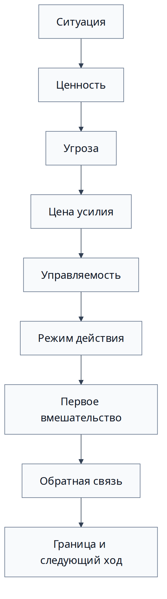{.diagram}


Схема нужна не для красоты.

Граница схемы: она не заменяет живой разбор случая и не гарантирует один правильный ответ. Ее задача - удержать маршрут от сигнала к проверяемому первому вмешательству.

Она защищает от слишком быстрого вывода.

Например:

```text
не начинаю -> поставь таймер
нет мотивации -> вдохнови
много срочного -> запрети прерывания
ИИ помог -> можно не разбираться
устал -> просто отдохни
```

Иногда эти ходы полезны. Но без диагностики они часто чинят не тот параметр.

Практический вопрос звучит иначе:

```text
что именно делает действие недоступным
и какой первый ход изменит этот параметр?
```

У первого хода есть три требования:

- он должен быть меньше всей задачи;
- он должен менять состояние ситуации, а не только создавать занятость;
- после него должна появиться обратная связь.

Если обратная связь не появилась, вмешательство не обучило систему. Человек мог потратить время, но управляемость не выросла.

## Карта кейсов

| Кейс | Главный сигнал | Возможное место сбоя | Первый ход | Обратная связь | Граница |
| --- | --- | --- | --- | --- | --- |
| Разработчик возвращается к сложной задаче после прерывания | "Не помню, где остановился" | Потеряно состояние цели, слабая контрольная точка, высокая когнитивная цена входа | Восстановить внешнее состояние задачи и выбрать один исследовательский срез | Есть гипотеза, исключенный путь или следующий вопрос | Если нет владельца, данных или доступа, нужен командный уровень |
| Прокрастинация из-за высокой цены входа | "Я все понимаю, но не начинаю" | Угроза, туман, идентичностная цена, краткое облегчение от ухода | Безопасный контакт с задачей и первый проверяемый вопрос | Задача стала конкретнее или выявлена настоящая угроза | Если цена связана с перегрузом или здоровьем, микрошаг не решает причину |
| Лид перегружен несколькими треками | "Весь день занят, но ничего не продвигается" | Слишком широкий WIP, невидимая работа, остаточное внимание | Карта треков, один глубокий срез, следующий контакт для остальных | Видно, что активно, что ждет и что стареет | Если поток требований бесконечен, нужна договоренность о WIP и приоритетах |
| Сотрудник потерял мотивацию | "Раньше включался, теперь гаснет" | Туман задачи, потеря автономии, слабая компетентность, мало обратной связи, перегруз или недогруз | Разговор о конкретной петле действия, а не мотивационная речь | Появился проверяемый фактор: задача, среда, нагрузка, обратная связь или восстановление | Не диагностировать человека; при тяжелом состоянии нужна помощь вне этой модели |
| ИИ используется как обход мышления | "ИИ быстро написал, но я не могу продолжить" | Нет собственного следа до запроса к ИИ, слабая проверка после ответа, потеря авторства, снята полезная трудность | Вернуть собственную постановку, роль ИИ, проверку и след решения | Есть принятое, отвергнутое, требующее проверки и мое решение | В высокорисковых задачах нужен более строгий уровень проверки |
| Команда живет в срочных переключениях | "Любое входящее может сорвать фокус" | Срочность не различима, WIP размытый, внешнее состояние тяжелых треков слабое | Формат срочности и внешнее состояние тяжелых треков | Меньше шума, понятнее владелец, влияние, срок и ожидаемое действие | Если организация требует постоянной реактивности, локальные правила ограничены |
| Восстановление после перегруза | "Отдохнул, но вход не стал дешевле" | Долг восстановления, страх возврата, высокий WIP, слабая безопасность, потеря управляемости | Сначала безопасность и малый управляемый шаг, затем разбор нагрузки | Вход стал дешевле или стала видна системная причина | Тяжелое истощение не чинится учебным протоколом |

Дальше каждый кейс разбирается подробнее.

Кейсы синтетические. Они собраны из типовых паттернов, а не из приватных рабочих историй.

## Кейс 1. Разработчик возвращается к сложной задаче после прерывания

### Ситуация

Разработчик исследовал сложную проблему.

Объект иногда остается в промежуточном состоянии. Нужно понять, где именно ломается переход, и предложить безопасный следующий ход.

В первый день он успел открыть несколько файлов, посмотреть логи, сформулировать две гипотезы. Потом его прервали: срочное ревью, встреча, короткая помощь соседней задаче. Через два дня он возвращается и видит только название задачи.

Внутреннее состояние:

```text
что я вообще понял?
какой файл был главным?
я вроде что-то исключил, но не помню что
надо снова открыть все
сейчас нет сил это поднимать
```

Поверхностный вывод:

```text
я потерял фокус
```

Точный разбор другой.

### Диагностика

| Параметр | Разбор |
| --- | --- |
| Ценность | Найти место расхождения, снизить риск повторной ошибки, оставить команде знание о слабом участке. |
| Угроза | Предложить неверное исправление, потратить время без результата, вскрыть собственное непонимание, снова уйти в туман. |
| Цена усилия | Главная цена когнитивная: нужно восстановить порядок операций, факты, гипотезы, исключенные пути и модель участка кода. Размер файла тут вторичен: маленькая правка может быть дорогой, если требует восстановить причинную схему. Есть идентичностная цена: неприятно возвращаться туда, где уже было непонятно. |
| Управляемость | Управляемо восстановить состояние задачи, открыть один участок кода, сравнить два сценария, записать результат. Не управляемо сразу гарантировать исправление. |
| Режим действия | Система выбирает избегание и подготовительное чтение: открыть много вкладок, перечитать обсуждения, но не сделать проверяемый срез. |

Главный сбой:

```text
потеряно состояние цели + слабая внешняя контрольная точка + высокая цена повторного входа
```

### Первое вмешательство

Не начинать с кода.

Сначала восстановить внешнее состояние задачи за 10-15 минут:

```text
# Возврат к задаче

Цель:
Понять, где объект остается в промежуточном состоянии.

Что уже известно:
- объект создается до внешнего вызова;
- в проблемном сценарии виден timeout;
- два обработчика могут влиять на финальный статус.

Что я, возможно, уже исключил:
- проверить по журналу или коммитам, был ли исключен обработчик B.

Текущая гипотеза:
переход в промежуточное состояние происходит до внешнего вызова,
а timeout-path не закрывает статус.

Первый срез:
за 30 минут сравнить порядок операций в успешном и timeout-сценарии.

Обратная связь:
после блока должно быть ясно,
где меняется состояние относительно внешнего вызова.
```

После этого можно открыть только нужный участок, а не всю задачу сразу.

Если прошлой контрольной точки нет, ее нельзя восстановить магически. Но можно создать новую прямо сейчас и начать снижать эту цену при следующем входе.

### Обратная связь

После первого среза возможны три хороших исхода:

| Исход | Что он дает |
| --- | --- |
| Гипотеза подтвердилась | Появился следующий проверяемый шаг: посмотреть обработку timeout. |
| Гипотеза не подтвердилась | Исключен путь, задача стала уже. |
| Данных не хватает | Сформулирован точный запрос: какой лог, сценарий или владелец нужен. |

Все три исхода лучше, чем "еще раз долго читал код".

### Границы

Если у разработчика нет доступа к нужным данным, нет владельца соседнего компонента или задача зависит от чужого решения, это уже не только личный фокус.

Тогда следующий ход:

```text
зафиксировать внешний блокер,
сформулировать вопрос,
передать состояние трека в командный контур
```

Личный фокус не должен компенсировать отсутствие владельца, данных или решения.

### Что проверяет кейс

Кейс проверяет главы 4-6, 21, 31 и 32.

Трудность возвращения после прерывания часто связана не с характером, а с тем, что состояние задачи не было сохранено как внешний объект. Хорошая контрольная точка не делает задачу простой. Она может делать возвращение дешевле.

## Кейс 2. Прокрастинация из-за высокой цены входа

### Ситуация

Человек должен подготовить важный текст: аналитическую записку, проектное предложение, учебный раздел или технический разбор.

Он понимает, что задача ценная. Срок не прямо сейчас, но уже близко. Несколько дней он открывает файл, перечитывает материалы, добавляет ссылки, меняет заголовки, отвечает на другие сообщения и закрывает файл.

Внутреннее объяснение:

```text
я ленюсь
у меня нет дисциплины
надо просто сесть и написать
```

Но если присмотреться, задача не похожа на простое действие.

Она требует:

- выбрать позицию;
- признать, что часть материала еще не ясна;
- сделать текст видимым для других;
- рискнуть качеством;
- столкнуться с критикой;
- отделить черновик от финального результата.

### Диагностика

| Параметр | Разбор |
| --- | --- |
| Ценность | Текст должен прояснить решение, передать знание, защитить позицию или помочь другим действовать точнее. |
| Угроза | Критика, ошибка, ощущение некомпетентности, слишком ранняя видимость сырой мысли. |
| Цена усилия | Когнитивная цена: нужно собрать тезис, структуру и доказательства. Идентичностная цена: "если выйдет плохо, это скажет что-то обо мне". |
| Управляемость | Управляемо написать черновой тезис, выбрать один вопрос, сделать плохой первый абзац, запросить обратную связь по одному аспекту. Не управляемо сразу написать сильный финальный текст. |
| Режим действия | Уход в подготовку: читать, собирать ссылки, улучшать структуру без контакта с главным тезисом. |

Главный сбой:

```text
высокая цена входа + угроза оценки + туман первого тезиса
```

Прокрастинация дает краткое облегчение:

```text
не написал -> не столкнулся с плохим черновиком -> стало легче сейчас
```

Но будущий вход дорожает:

```text
срок ближе
стыда больше
контекст мутнее
угроза выше
```

### Первое вмешательство

Не начинать с требования:

```text
написать нормальный текст
```

Первый ход лучше строить так, чтобы он снижал идентичностную цену и превращал туман в вопрос.

Пример входа:

```text
Режим: черновик без права быть хорошим.

За 20 минут:
1. написать главный вопрос текста;
2. написать 5 плохих тезисов;
3. выбрать один тезис, который стоит проверить;
4. оставить следующий срез.

Критерий:
после блока должно быть яснее,
какую мысль текст будет доказывать или опровергать.
```

Можно добавить защиту:

```text
этот черновик никому не показывается;
обратная связь будет запрошена позже только по структуре, не по стилю
```

Если угроза социальная, первую обратную связь лучше делать узкой:

```text
проверь, понятен ли главный вопрос
```

а не:

```text
оцени весь текст
```

### Обратная связь

После первого блока должны появиться признаки:

| Обратная связь | Что делать дальше |
| --- | --- |
| Главный тезис появился | Следующий срез - набросать аргументы и контраргументы. |
| Тезис не появился, но появился главный вопрос | Следующий срез - собрать 3 возможных ответа. |
| Стало ясно, что не хватает данных | Следующий срез - найти один источник или один пример. |
| Стало ясно, что страшна оценка | Следующий срез - определить безопасный формат обратной связи. |

Даже если текст не написан, задача уже перестала быть одной темной массой.

### Границы

Если человек не пишет не из-за тумана, а из-за сильного истощения, тревожного состояния, конфликта требований или реального отсутствия времени, двадцатиминутный черновик не решит причину.

Тогда первый ход должен быть другим:

```text
снизить WIP,
пересогласовать срок,
получить поддержку,
разделить задачу,
или признать, что сейчас нужен восстановительный шаг
```

### Что проверяет кейс

Кейс проверяет главы 9, 11, 18, 19 и 31.

Прокрастинация не объясняется одним словом. Иногда человек откладывает потому, что задача одновременно ценная и угрожающая, а первый вход слишком дорогой. Тогда вмешательство должно делать контакт безопаснее и уже, а не просто повышать давление.

## Кейс 3. Лид перегружен несколькими тяжелыми треками

### Ситуация

У лида одновременно идут:

- сложное техническое решение;
- несколько ревью;
- координация с соседними командами;
- помощь людям;
- регулярные встречи;
- срочные входящие;
- подготовка следующего квартала;
- собственная глубокая задача, которая постоянно откладывается.

День выглядит заполненным. Но вечером остается ощущение:

```text
я много реагировал,
но не продвинул главное
и теперь все важное висит в голове
```

Поверхностный вывод:

```text
нужно лучше планировать день
```

Иногда да. Но чаще проблема глубже: слишком много треков находятся в активном состоянии одновременно.

### Диагностика

| Параметр | Разбор |
| --- | --- |
| Ценность | Сохранить качество решений, поддержать людей, не потерять важные риски, двигать стратегический трек. |
| Угроза | Что-то упустить, подвести людей, пропустить риск, выглядеть недоступным, потерять контроль над ситуацией. |
| Цена усилия | Основная цена - переключение между контекстами. Дополнительно: социально-эмоциональная цена отказов и границ. |
| Управляемость | Управляемо вынести треки наружу, выбрать один активный глубокий срез, назначить следующий контакт для ожиданий, явно ограничить оперативный слот. Не управляемо одновременно глубоко держать все. |
| Режим действия | Реактивное сканирование: проверять входящие, закрывать быстрые хвосты, держать тревожный WIP в голове. |

Главный сбой:

```text
слишком широкий WIP внимания + невидимая работа + отсутствие внешней карты треков
```

### Первое вмешательство

Первый ход - не "стать дисциплинированнее", а вынести WIP наружу.

Минимальная карта:

| Трек | Режим | Где состояние | Следующий срез | Следующий контакт | Риск |
| --- | --- | --- | --- | --- | --- |
| Техническое решение | глубокий | Документ/журнал | Сравнить 2 варианта по риску | Сегодня 11:00 | Высокий |
| Ревью | оперативный | Очередь | Закрыть 2 критичных вопроса | После глубокого блока | Средний |
| Соседняя команда | ожидание | Заметка/чат | Дождаться ответа по критерию | Завтра | Средний |
| Поддержка человека | оперативный/развивающий | Заметка встречи | Сформулировать следующий шаг | Сегодня 16:00 | Высокий |
| Стратегический трек | фоновый/глубокий | План | Вернуться к разделу 2 | Среда | Низкий |
| Восстановление | восстановление | Календарь/граница дня | Не оставлять открытый хвост вечером | Сегодня | Высокий |

После карты выбрать один активный глубокий срез:

```text
Сегодня глубокий срез только один:
сравнить два варианта технического решения по риску отката.
```

Остальные треки не исчезают. Они получают контейнер и следующий контакт.

Это может снижать тревожную необходимость держать их активными в голове.

### Обратная связь

Через день или два смотреть не на количество закрытых мелких задач, а на состояние контура:

| Вопрос разбора | Хороший сигнал |
| --- | --- |
| Был ли один глубокий срез? | Да, состояние главного трека изменилось. |
| Стало ли меньше WIP в голове? | У треков есть контейнер и следующий контакт. |
| Перестали ли быстрые входящие съедать первый глубокий блок? | У оперативного слоя появилось свое окно. |
| Появились ли честные границы? | Видно, что требует решения, делегирования или остановки. |

### Границы

Если после карты видно, что активных тяжелых треков объективно больше, чем человек может вести, это не решается личным тайм-менеджментом.

Тогда следующий ход:

```text
пересогласовать приоритеты,
показать WIP,
снять часть ожиданий,
найти владельцев,
перенести или остановить трек,
обсудить недостающие ресурсы
```

Карта треков не должна стать инструментом героизма.

Ее зрелая функция - показать, что именно не помещается в управляемый контур.

### Что проверяет кейс

Кейс проверяет главы 21, 28, 30 и 32.

Лидерская перегрузка часто возникает не от отсутствия планирования, а от попытки одновременно удерживать слишком много активных контекстов. Когнитивное инженерство помогает переводить это из внутренней тревоги во внешний WIP, срезы и границы.

## Кейс 4. Сотрудник потерял мотивацию

### Ситуация

Сотрудник раньше включался в задачи, задавал вопросы, предлагал решения. Теперь он делает только минимум, реже проявляет инициативу, откладывает задачи, хуже реагирует на новые предложения.

Самый быстрый управленческий ярлык:

```text
потерял мотивацию
```

Но это не причина. Это наблюдение.

Если сразу пытаться "мотивировать", легко промахнуться:

- дать больше давления при перегрузе;
- дать вдохновляющую речь при низкой управляемости;
- дать новую сложную задачу человеку, который потерял безопасность;
- дать больше автономии там, где нет компетентности или ясности;
- дать похвалу там, где человеку нужна реальная обратная связь и полномочия.

### Диагностика

| Параметр | Разбор |
| --- | --- |
| Ценность | Что для человека в этой работе раньше было живым: мастерство, польза, влияние, принадлежность, стабильность, развитие? Что из этого исчезло или стало недоступным? |
| Угроза | Чем теперь опасна задача: провалом, критикой, бессилием, перегрузом, потерей статуса, бессмысленностью? |
| Цена усилия | Возможно, задача стала дороже: больше тумана, меньше поддержки, больше переключений, хуже восстановление, выше социальная цена. |
| Управляемость | Есть ли у человека рычаги, ясные критерии, право принимать решения, доступ к помощи и обратной связи? |
| Режим действия | Минимизация контакта: делать только безопасный минимум, не брать инициативу, не предлагать, не вкладываться в рост. |

Главный сбой может быть разным.

Примеры:

| Сигнал | Возможная причина |
| --- | --- |
| Человек молчит на обсуждениях | Низкая безопасность или ощущение, что мнение не влияет. |
| Делает только формально | Потеря авторства результата или слабая связь задачи со смыслом. |
| Не берет новые задачи | Перегруз, страх провала, низкая самоэффективность. |
| Быстро скучает | Недогруз, низкий вызов, мало обратной связи, нет роста. |
| Раздражается на задачи | Долг восстановления, несправедливость, дисбаланс усилия и вознаграждения. |

### Первое вмешательство

Первый ход - не мотивационная речь.

Нужен разговор о конкретной петле действия.

Пример рамки:

```text
Я вижу, что последние задачи идут тяжелее.
Хочу понять не "что с тобой не так",
а где в самой работе сейчас пропала управляемость.

Давай разберем одну конкретную задачу:
что в ней понятно,
что туманно,
где есть рычаг,
где нет обратной связи,
что мешает входу,
что делает ее ценной или неценной.
```

Задача разговора - найти один проверяемый фактор.

Например:

- задача слишком мутная;
- не хватает полномочий;
- обратная связь приходит слишком поздно;
- человек не видит смысла результата;
- задача ниже уровня и не дает роста;
- нагрузка слишком высокая;
- есть внешний конфликт приоритетов;
- восстановление уже сорвано.

Первый ремонт должен быть маленьким и честным:

```text
уточнить критерий успеха,
разделить задачу на управляемый срез,
добавить раннюю обратную связь,
дать право на решение,
снять лишний WIP,
поменять уровень сложности,
вернуть видимость результата
```

### Обратная связь

Через короткий цикл смотреть:

| Обратная связь | Что он означает |
| --- | --- |
| Человек начал задавать вопросы | Вернулась часть управляемости и контакта. |
| Появился срез продвижения | Задача стала доступнее. |
| Сохраняется избегание | Возможно, причина не в тумане, а в угрозе, перегрузе или низкой безопасности. |
| Человек ожил на другом типе задач | Исходная задача могла быть недогрузом, слабым смыслом или неподходящим уровнем вызова. |
| Ничего не меняется после ремонта среды | Нужно смотреть глубже: состояние, роль, конфликт, помощь вне этой модели. |

### Границы

Этот кейс не учит диагностировать человека.

Потеря мотивации может пересекаться с выгоранием, тревогой, депрессивным состоянием, личными обстоятельствами, соматическими причинами, конфликтом роли или несправедливостью среды.

Лидерская работа здесь ограничена:

```text
сделать задачу яснее,
дать управляемость,
наладить обратную связь,
согласовать нагрузку,
поддержать автономию и компетентность,
увидеть границу
```

Если проблема выходит за рабочую петлю действия, нельзя превращать учебную модель в самодельную диагностику.

### Что проверяет кейс

Кейс проверяет главы 8, 10, 23-25, 28 и 29.

Мотивация сотрудника - это не кнопка и не постоянная черта. Это состояние в конкретной среде задач, смысла, автономии, компетентности, принадлежности, обратной связи, нагрузки и восстановления.

## Кейс 5. Человек использует ИИ как обход мышления

### Ситуация

Человек берет сложную задачу и сразу пишет в ИИ:

```text
разберись и предложи решение
```

ИИ дает связный ответ. Ответ выглядит убедительно. Человек копирует структуру, немного правит и идет дальше.

Проблема проявляется позже:

```text
я не могу объяснить, почему выбран этот вариант
я не помню, какие допущения там были
я не знаю, что проверено, а что просто звучало разумно
я не могу продолжить без нового запроса к ИИ
```

Снаружи был выигрыш времени.

Внутри контур мог ослабнуть.

### Диагностика

| Параметр | Разбор |
| --- | --- |
| Ценность | Быстро получить варианты, снизить туман, увидеть слепые зоны, ускорить черновую работу. |
| Угроза | Столкнуться с непониманием, ошибиться самому, долго входить в сложный контекст, признать слабую гипотезу. |
| Цена усилия | Снята полезная трудность первого контакта: постановка задачи, свои гипотезы, критерий проверки. |
| Управляемость | Управляемо задать роль ИИ, сначала оставить собственный след, проверить ответ, записать решение. Не управляемо считать гладкость ответа доказательством. |
| Режим действия | Когнитивная выгрузка превращается в обход: ИИ становится первым автором цели, структуры и решения. |

Главный сбой:

```text
нет собственного следа до запроса к ИИ + нет проверки после ответа ИИ + потеря авторства решения
```

### Первое вмешательство

Вернуть ИИ внутрь человеческого контура.

Перед запросом:

```text
Моя постановка:
...

Что я уже понял:
...

Мои 2 гипотезы:
1.
2.

Критерий хорошего ответа:
...

Что нельзя отдавать ИИ:
финальное решение, оценку риска, проверку фактов.
```

Запрос к ИИ:

```text
Роль:
выступи оппонентом и найди слабые места в моих гипотезах.

Не пиши финальное решение.
Предложи проверки и вопросы, которые я мог пропустить.
```

После ответа:

```text
Что ИИ предложил:

Что я принимаю:

Что отвергаю:

Что требует проверки:

Какое решение остается моим:

Какой следующий срез:
```

Это медленнее, чем "сделай за меня".

Но быстрее, чем через день заново просить ИИ восстановить смысл решения, которое человек не присвоил.

### Обратная связь

Хорошие сигналы:

| Сигнал | Значение |
| --- | --- |
| Человек может объяснить решение без ИИ | Авторство не потеряно. |
| В журнале есть принятые и отвергнутые предложения | Ответ не проглочен целиком. |
| Есть список проверок | Гладкость текста не заменяет валидацию. |
| Следующий вход начинается с собственной контрольной точки | ИИ усилил контур, а не стер его. |

Плохой сигнал:

```text
каждый следующий шаг требует снова спросить ИИ,
потому что собственного состояния задачи нет
```

### Границы

Чем выше цена ошибки, тем жестче должен быть проверочный контур.

Для учебной задачи достаточно объяснить своими словами и проверить ключевые утверждения.

Для инженерного изменения нужны тесты, ревью, фактические проверки, контекст системы.

Для медицинских, юридических, финансовых, security или других высокорисковых решений нельзя полагаться на ИИ как на источник окончательного вывода.

### Что проверяет кейс

Кейс проверяет главы 19, 26, 27 и 32.

ИИ становится когнитивным усилителем, когда помогает человеку увидеть, проверить и оформить мысль. Он становится обходом, когда снимает именно ту трудность, через которую строятся понимание, навык и ответственность за решение.

## Кейс 6. Команда живет в постоянных срочных переключениях

### Ситуация

В команде постоянно что-то срочное:

- вопросы в чатах;
- внезапные просьбы;
- ревью "на минуту";
- уточнения от соседей;
- маленькие пожары;
- задачи, которые давно висят и вдруг становятся критичными.

Люди пытаются фокусироваться, но любое входящее может оказаться важным. Поэтому все регулярно проверяют каналы и держат часть внимания в режиме ожидания.

Поверхностный вывод:

```text
у нас никто не умеет концентрироваться
```

Более точный вопрос:

```text
почему среда может заставлять всех считать любое входящее потенциально срочным?
```

### Диагностика

| Параметр | Разбор |
| --- | --- |
| Ценность | Быстро реагировать на реальные риски, помогать друг другу, не упускать критичные проблемы. |
| Угроза | Пропустить пожар, задержать другого человека, выглядеть неотзывчивым, сломать процесс. |
| Цена усилия | Высокая цена переключений, остаточное внимание, постоянная готовность, слабое восстановление глубокого контекста. |
| Управляемость | Управляемо различать срочность, ввести формат входящего, держать внешнее состояние тяжелых треков, назначить окна реакции. Не управляемо полностью убрать все прерывания. |
| Режим действия | Команда живет в режиме реактивного сканирования: каждый немного сторожит все. |

Главный сбой:

```text
неразличимая срочность + размытый командный WIP + слабое внешнее состояние тяжелых треков
```

### Первое вмешательство

Не запрещать прерывания вообще.

Команде нужен формат срочности.

Минимальный шаблон входящего:

```text
Серьезность:
Влияние:
Срок:
Владелец:
Что нужно от адресата:
Контекст:
Что уже проверено:
Можно ли ответить позже:
```

Для тяжелых треков нужно внешнее состояние:

```text
Трек:
Цель:
Текущий статус:
Следующий срез:
Блокер:
Кто владеет решением:
Когда следующий контакт:
Что считается срочным прерыванием:
```

Это меняет среду.

Теперь входящее не просто шумит. Оно классифицируется.

### Обратная связь

Смотреть через 1-2 недели:

| Обратная связь | Хороший сигнал |
| --- | --- |
| Стало меньше "просто быстро посмотри" | Входящие чаще содержат влияние и ожидаемое действие. |
| Тяжелые задачи реже теряются после прерывания | У них есть внешнее состояние и контрольная точка. |
| Срочное стало заметнее, а шум тише | Реальные риски не маскируются общей тревогой. |
| Старение задач разбирается раньше | Задачи не становятся срочными только потому, что долго висели. |
| Люди меньше держат все в голове | Есть общий контейнер состояния треков. |

### Границы

Если организация реально требует постоянной реактивности от команды, локальный формат срочности поможет только частично.

Тогда нужно поднимать вопрос выше:

```text
какой уровень сервиса ожидается,
кто дежурит,
какой WIP допустим,
какие задачи останавливаются при срочности,
что считается критичным,
какие ресурсы нужны
```

Команда не должна изображать глубокий фокус в среде, которая фактически требует непрерывного дежурства от всех одновременно.

### Что проверяет кейс

Кейс проверяет главы 21, 28, 30 и 31.

Командный фокус - это свойство среды. Если срочность не имеет формы, люди вынуждены сами держать тревожный фильтр. Тогда личная дисциплина становится плохой заменой командному дизайну потока.

## Кейс 7. Человек восстанавливается после перегруза

### Ситуация

Человек несколько недель работал в режиме повышенной нагрузки.

Было много задач, коротких сроков, переключений, ответственности, недосыпа, слабого восстановления. Потом он берет паузу: выходные, отпуск, несколько спокойных дней.

После паузы он ожидает:

```text
теперь должно стать легче
```

Но вход в работу все равно тяжелый.

Тело сопротивляется, задачи неприятны, фокус не держится, любое обязательство кажется угрозой возврата в прежний режим.

Поверхностный вывод:

```text
я даже отдыхать не умею
```

или:

```text
надо быстрее возвращаться в форму
```

Оба вывода могут ухудшить ситуацию.

### Диагностика

| Параметр | Разбор |
| --- | --- |
| Ценность | Вернуть способность действовать без самоизноса, восстановить доверие к работе, снова получать управляемые срезы. |
| Угроза | Любой вход похож на начало прежнего перегруза. Система защищается от повторного расхода. |
| Цена усилия | Высокая восстановительная цена: усталость не полностью ушла, а рабочая среда может ассоциироваться с долгом и давлением. |
| Управляемость | Управляемо начать с малого безопасного контакта, снизить WIP, оставить контрольную точку, пересмотреть нагрузку. Не управляемо мгновенно вернуться к прежней мощности. |
| Режим действия | Защитное торможение, избегание, осторожность, низкая готовность платить цену усилия. |

Главный сбой:

```text
восстановление еще не вернуло безопасность и управляемость входа
```

Отдых мог снизить часть усталости, но не изменить рабочую рамку, WIP, страх возврата или отсутствие границ.

### Первое вмешательство

Не начинать с полного плана продуктивности.

Первый ход:

```text
1. Снизить WIP до минимального.
2. Выбрать один безопасный трек.
3. Сделать малый срез на 15-30 минут.
4. Остановиться до повторного самопродавливания.
5. Записать контрольную точку.
6. Проверить, стал ли следующий вход дешевле.
```

Пример:

```text
Сегодня не "вернуться в рабочий режим".

Сегодня:
- открыть карту треков;
- выбрать один трек с низкой угрозой;
- сделать один срез, который не требует публичной оценки;
- записать результат;
- закрыть рабочий контур без вечернего хвоста.
```

Если главная угроза - возврат в прежний хаос, нужно отдельно зафиксировать границы:

```text
какие задачи сейчас не активны
какие сроки пересогласованы
какой объем работы допустим
что будет считаться перегрузочным сигналом
к кому идти, если WIP снова растет
```

### Обратная связь

Через несколько дней смотреть:

| Обратная связь | Что он означает |
| --- | --- |
| Следующий вход стал чуть дешевле | Восстановление управляемости началось. |
| После малого среза возникает резкий откат | Срез все еще слишком большой или угроза прежнего режима слишком сильна. |
| Тело остается в сопротивлении | Нужны сон, снижение нагрузки, медицинская или психологическая помощь, если состояние тяжелое или длительное. |
| WIP снова разрастается | Проблема не в личном восстановлении, а в среде требований. |
| Появляется интерес к малым задачам | Можно осторожно расширять сложность и обратную связь. |

### Границы

Восстановление после перегруза - зона, где особенно опасны красивые протоколы продуктивности.

Если состояние тяжелое, длительное, сопровождается выраженной тревогой, депрессивными симптомами, соматическими проявлениями, нарушением сна или невозможностью выполнять базовые дела, учебная модель не является достаточной.

Тогда нужны:

- медицинская помощь;
- психотерапевтическая помощь;
- изменение условий работы;
- снижение нагрузки;
- пересборка ожиданий;
- поддержка среды.

Когнитивное инженерство может помочь увидеть границы. Оно не должно маскировать их.

### Что проверяет кейс

Кейс проверяет главы 23-25, 31 и 32.

Восстановление - это не возвращение к прежнему темпу любой ценой. Это возвращение безопасности, управляемости, малых срезов, обратной связи и доверия к следующему входу.

## Как читать эти кейсы

Эти кейсы не нужно запоминать как семь рецептов.

Их нужно читать как семь проверок одной модели.

| Если видишь сигнал | Не спеши думать | Сначала проверь |
| --- | --- | --- |
| Не могу начать | "ленюсь" | Угроза, цена входа, туман, управляемость. |
| Не помню задачу | "плохой фокус" | Состояние цели, контрольная точка, внешний контур. |
| Все срочно | "люди отвлекают" | Формат срочности, WIP, внешнее состояние, старение задач. |
| Нет мотивации | "не хочет" | Задача, автономия, компетентность, обратная связь, нагрузка. |
| ИИ помог | "можно быстрее" | Собственный след, проверка, авторство, сохранение навыка. |
| Отдых не помог | "надо собраться" | Долг восстановления, WIP, безопасность, состояние, границы. |

Когнитивное инженерство не обещает, что после правильной таблицы человек всегда начнет действовать.

Его обещание скромнее и полезнее:

```text
не перепутать сигнал с причиной,
не чинить личным нажимом системную проблему,
не лечить туман таймером,
не лечить перегруз вдохновением,
не лечить потерю авторства новым ИИ-ответом,
не лечить восстановление новым рывком
```

## Главный вывод

Практическая сила модели не в том, что она дает один правильный прием.

Сила в том, что она помогает задать правильный следующий вопрос:

```text
какой параметр сейчас делает действие недоступным?
```

После этого можно искать первый ход:

```text
снизить цену входа
вынести состояние наружу
сузить WIP
сделать безопасный контакт
вернуть обратную связь
задать роль ИИ
оставить контрольную точку
перенести вопрос на командный уровень
восстановить управляемость
признать границу
```

Кейсы показывают еще одну вещь: хорошая модель не только помогает действовать. Она помогает вовремя остановиться и не делать вид, что все проблемы являются задачами личной дисциплины.

Из этого следует отдельная тема: что модель когнитивного инженерства не объясняет, где она ограничена и когда нужно переходить к другим уровням помощи, исследования или решения.

## Короткое резюме

- Практический кейс нужен не для красивой истории, а для проверки модели на смешанных сигналах.
- Один и тот же сигнал может иметь разные причины: туман, угроза, усталость, низкая управляемость, WIP, слабая обратная связь или системная граница.
- Первый ход должен менять конкретный параметр ситуации и давать обратную связь.
- Если вмешательство не дает обратной связи, оно не обучает систему.
- Хорошая модель помогает не только действовать, но и вовремя остановиться, когда проблема находится не на личном уровне.

## Вопросы для самопроверки

1. Почему кейс нельзя читать как рецепт?
2. Что значит "найти параметр, делающий действие недоступным"?
3. Чем первый ход отличается от общего намерения?
4. Почему обратная связь обязательна в практическом кейсе?
5. Как понять, что ситуация требует командного, организационного или профессионального уровня помощи?

## Мини-практика

Возьмите одну ситуацию из своей работы и разберите ее по той же схеме:

```text
сигнал:
не спешить думать:
ценность:
угроза:
цена усилия:
управляемость:
внешнее состояние:
первый ход:
обратная связь:
граница:
что делать, если первый ход не сработал:
```

Затем проверьте: ваш первый ход действительно меняет параметр ситуации или просто звучит как правильный совет?

---

# Глава 34. Чего эта модель не объясняет

Практические кейсы могут создать опасное впечатление: если модель достаточно хороша, любую ситуацию можно разобрать по одной схеме и найти первый ход.

Иногда это правда.

Человек потерял контекст задачи - ему нужно внешнее состояние. Задача не начинается из-за тумана - ей нужен первый проверяемый срез. Команда живет в постоянных срочных переключениях - ей нужен формат срочности, WIP и общий контейнер состояния. ИИ стал обходом мышления - нужно вернуть собственный след до запроса к ИИ, проверку и авторство решения.

Но есть граница.

Когнитивное инженерство не является медициной, психотерапией, клинической диагностикой, организационной политикой или универсальной теорией человеческой жизни. Оно помогает проектировать условия действия, мышления, восстановления и обратной связи. Оно может показать, где действие стало недоступным. Оно может подсказать первый честный ход. Но оно не должно изображать, что все человеческие состояния являются задачами личной настройки.

Раздел о границах нужен не для того, чтобы ослабить учебник. Наоборот: без границ модель быстро превращается в новый язык самонажима.

## Что модель действительно умеет

Сначала нужно зафиксировать сильную область модели.

Когнитивное инженерство полезно там, где есть ситуация действия:

- человек должен войти в задачу;
- нужно удержать контекст;
- нужно снизить цену первого шага;
- нужно не потерять состояние задачи после прерывания;
- нужно понять, что делает действие угрожающим;
- нужно отличить ценность от желания;
- нужно ограничить WIP;
- нужно вернуть обратную связь;
- нужно встроить ИИ в человеческий контур;
- нужно спроектировать командную среду, где людям легче действовать ясно.

В таких ситуациях модель задает полезные вопросы:

```text
что здесь ценно?
что здесь угрожает?
какая цена усилия?
что туманно?
что управляемо?
что нужно вынести наружу?
какой первый срез даст обратную связь?
где граница личного уровня?
```

Это рабочие вопросы. Они не диагностируют человека. Они диагностируют доступность действия в конкретной ситуации.

Разница принципиальная.

Когда человек говорит:

```text
я не могу начать
```

модель может спросить:

```text
какую именно задачу?
что в ней непонятно?
чего ты опасаешься?
какой минимальный безопасный контакт возможен?
что покажет продвижение?
```

Но она не имеет права автоматически решить:

```text
значит, у тебя прокрастинация,
значит, нужно сделать ритуал,
значит, дело в дофамине,
значит, нужно просто снизить WIP
```

Один сигнал может жить на разных уровнях.

## Карта границ

Главная схема границ проста: сначала определить уровень вопроса, потом выбирать инструмент.

Вопрос схемы: остается ли вопрос на уровне задачи и среды действия или уже требует медицинского, психотерапевтического, организационного либо научного разбора?


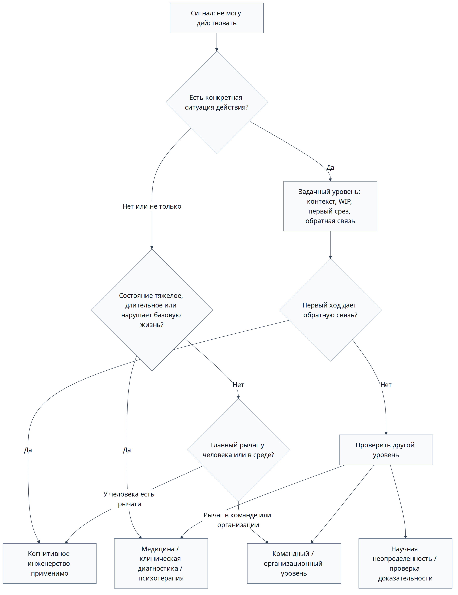{.diagram}


Эта схема не должна становиться жестким алгоритмом. Ее задача - замедлить слишком быстрый вывод.

Граница схемы: это защитная карта от самонажима, а не способ самостоятельно поставить диагноз или доказать, что помощь извне не нужна.

Если есть конкретная задача, понятный контекст и хоть какой-то рычаг действия, модель может работать. Если первый ход дает обратную связь, можно продолжать. Если обратная связь не появляется, состояние не меняется, задача не конкретизируется, а цена только растет, нужно проверить: возможно, вопрос находится не на уровне личной практики.

## Медицинская граница

Медицинская граница возникает не только тогда, когда "совсем плохо".

Она появляется всякий раз, когда состояние может быть связано со здоровьем, телом, лекарствами, сном, веществами, риском или клиническим состоянием.

Сигналы, при которых модель не должна оставаться единственным инструментом:

| Сигнал | Почему это граница |
| --- | --- |
| Состояние длится долго и не улучшается от разумного снижения нагрузки | Возможно, вопрос не в входе в задачу, а в здоровье, психическом состоянии или среде. |
| Нарушены сон, аппетит, базовая энергия, концентрация, память, телесное самочувствие | Это уже не только когнитивная организация работы. |
| Человек не справляется с базовыми делами | Нужна оценка нарушения повседневного функционирования, а не новый протокол продуктивности. |
| Есть панические состояния, сильная тревога, выраженная подавленность, резкая потеря интереса | Это может требовать профессиональной оценки и помощи. |
| Есть мысли о самоповреждении, вреде себе или другим | Нужна немедленная помощь через местные экстренные службы или кризисный канал. |
| Есть психотические переживания, потеря контакта с реальностью, резкие изменения поведения | Это медицинская и клиническая зона. |
| Есть вопросы лекарств, отмены лекарств, БАДов, веществ, гормонов | Это не решается учебником и рабочим журналом. |
| Есть желание "починить состояние" кофеином, практиками осознанности, БАДами или метриками | Это может быть полезным сигналом для разбора, но не заменяет оценку сна, нагрузки, здоровья и контекста. |

Когнитивное инженерство может помочь подготовиться к обращению за помощью:

- записать, когда началось состояние;
- описать, что изменилось;
- отделить рабочую нагрузку от сна, тела и эмоций;
- зафиксировать, что уже пробовали;
- показать, где состояние нарушает жизнь.

Но это подготовка материала, а не постановка диагноза.

## Психотерапевтическая граница

Психотерапия нужна не только тогда, когда человек "не справился". Часто она нужна там, где разумная организация задачи упирается в устойчивый паттерн переживания, отношений или поведения.

Например:

- человек понимает задачу, но каждый раз переживает оценку как угрозу;
- любая ошибка запускает стыд и самонаказание;
- конфликт воспринимается как опасность отвержения;
- отдых вызывает вину;
- просьба о помощи воспринимается как доказательство слабости;
- успех не присваивается, а сразу обесценивается;
- рабочая ситуация снова и снова воспроизводит старый сценарий беспомощности;
- человек видит паттерн, но не может изменить его одним планированием.

В таких случаях внешний контур все еще может помогать. Рабочий журнал может дать материал: что произошло, что человек почувствовал, как отреагировал, какой вывод сделал, где повторился сценарий.

Но журнал не заменяет терапевтический процесс.

Психотерапия работает не только с задачей. Она работает с тем, как человек воспринимает угрозу, себя, других людей, право на ошибку, близость, границы, контроль, стыд, страх, злость, утрату и повторяющиеся способы защиты.

Когнитивное инженерство может поддержать терапию структурой наблюдения. Но если оно начинает говорить:

```text
просто сделай маленький шаг
```

там, где человек снова и снова сталкивается с травматическим, тревожным или отношенческим паттерном, оно становится грубым инструментом.

## Клиническая диагностика - не диагностика задачи

В учебнике уже есть диагностика задачи. Она спрашивает:

```text
что делает конкретное действие недоступным?
```

Клиническая диагностика спрашивает другое:

```text
каково состояние человека,
соответствует ли оно диагностическим критериям,
как долго оно длится,
насколько нарушает жизнь,
что еще может его объяснять,
какие риски есть,
какие состояния могут сочетаться друг с другом?
```

Это разные виды диагностики.

Диагностика задачи может сказать:

```text
в этой задаче высокая угроза ошибки,
низкая управляемость и слабая обратная связь
```

Она не может сказать:

```text
у человека депрессия
у человека тревожное расстройство
у человека ADHD
у человека клиническое выгорание
```

Даже если бытовые признаки похожи.

Похожесть сигналов - одна из причин, почему граница важна. Потеря мотивации может быть скукой, перегрузом, низкой автономией, отсутствием обратной связи, конфликтом роли, недосыпом, депрессивным состоянием, побочным эффектом лекарства, соматической проблемой или нормальной реакцией на тяжелую жизненную ситуацию.

Один язык не должен захватывать все объяснение.

То же относится к биомаркерам. В исследованиях и клинической практике словарь биомаркеров полезен: можно различать маркер риска, диагностический маркер, мониторинговый маркер, прогностический маркер, предиктивный маркер и клиническую конечную точку. Но это не означает, что одиночный показатель сам по себе объясняет состояние человека или заменяет клиническую оценку. В психиатрии кандидатные биомаркеры могут помогать исследованию механизмов, стратификации, прогноза и будущих решений, но в учебнике они служат границей против бытовой самодиагностики, а не новым способом назвать свою проблему.

## Нейромедиаторы не являются бытовой диагностикой

Нейромедиаторы и гормоны уже введены как регуляторы режимов контуров. Это важный слой. Но именно поэтому с ним легко ошибиться.

Популярные формулы звучат просто:

```text
нет мотивации - мало дофамина
тревожно - высокий кортизол
грустно - мало серотонина
не хватает близости - нужен окситоцин
```

Эти формулы соблазнительны, потому что дают ощущение точности. Но точность здесь ложная.

Нейромедиаторы и гормоны:

- работают в контурах, а не в одиночку;
- зависят от зоны мозга, рецепторов, времени, контекста и истории обучения;
- могут иметь разные эффекты в разных системах;
- измеряются непрямо и с ограничениями;
- не дают простого ответа "что со мной";
- не превращаются автоматически в план "что делать".

Можно говорить:

```text
дофаминовые системы участвуют в обучении, значимости, усилии, выборе действия и ошибке предсказания
```

Нельзя превращать это в:

```text
сегодня у меня низкий дофамин, поэтому мне нужен такой-то прием
```

Можно говорить:

```text
стрессовые медиаторы влияют на префронтальный контроль, внимание и телесную цену действия
```

Нельзя делать вывод:

```text
если я устал и тревожен, значит причина в кортизоле
```

Можно осторожно обсуждать серотониновые модели настроения, аверсии, торможения и эмоционального контроля. Нельзя использовать "серотонин" как бытовой ярлык для сложного депрессивного состояния.

Нейрохимический язык полезен, когда он помогает понять режим системы. Он вреден, когда заменяет наблюдение за поведением, контекстом, средой, историей, телом и клиническими признаками.

То же относится к интероцепции и телесным сигналам. Здесь они помогают объяснить, почему задача может ощущаться дорогой до явного решения: тело, прогноз нагрузки, прошлый стресс и восстановительный долг входят в оценку действия. Но из этого нельзя делать вывод, что любое телесное ощущение сразу показывает причину проблемы. Напряжение, усталость, тяжесть, учащенное сердцебиение или "не могу собраться" могут относиться к нагрузке, тревоге, сну, соматике, лекарствам, среде, горю, конфликту, клиническому состоянию или обычной неопределенности задачи.

## Организационная граница

Часть проблем не живет внутри человека.

Если команда постоянно живет в режиме срочности, личный WIP-лимит поможет только частично. Если у человека нет полномочий, обратной связи и безопасного права сообщить о риске, нельзя называть его состояние "низкой мотивацией". Если требования хронически выше ресурсов, нельзя лечить это утренним ритуалом.

Организационные границы часто выглядят как личные проблемы:

| Как выглядит | Что может быть на самом деле |
| --- | --- |
| Человек "не фокусируется" | Среда требует непрерывной реактивности. |
| Сотрудник "потерял мотивацию" | Низкая автономия, слабая обратная связь, бессмысленный дизайн задачи, отсутствие роста. |
| Лид "не умеет отдыхать" | Роль устроена как постоянный прием незавершенного WIP. |
| Команда "не держит сроки" | Старение задач невидимо, WIP раздут, приоритеты конфликтуют. |
| Люди "избегают ответственности" | За раннее сообщение о проблемах их наказывают. |
| Все "устали" | Требования выше ресурсов, восстановление не встроено в систему. |

Личный контур может сделать такую проблему видимой:

```text
вот WIP
вот срочности
вот повторяющиеся прерывания
вот где нет владельца
вот где нет полномочий
вот где обратная связь не возвращается
вот где восстановление невозможно
```

Но после этого вопрос должен перейти на уровень команды, роли, менеджмента, ресурсов, ожиданий, HR-процесса или организационного решения.

Когнитивное инженерство не должно превращать человека в амортизатор плохой системы.

## Социальные и личные состояния не сводятся к практикам продуктивности

Есть состояния, которые нельзя честно описать как "сбой продуктивности".

Горе, одиночество, конфликт в семье, кризис смысла, болезнь близкого, тяжелая жизненная перемена, травматический опыт, дискриминация, небезопасность, бедность времени и ресурсов, страх потерять работу, конфликт ценностей - все это влияет на внимание, мотивацию, тело и способность действовать.

Модель может помочь не усугубить ситуацию:

- снизить лишний WIP;
- сохранить внешнее состояние;
- не требовать прежней производительности;
- оставить минимальные опоры;
- увидеть, где нужна поддержка;
- отличить задачу от жизненного состояния.

Но она не должна говорить:

```text
разбей это на маленькие шаги
```

как будто человеческая боль всегда является плохо сформулированной задачей.

Иногда правильный ход не в том, чтобы оптимизировать действие, а в том, чтобы признать тяжесть ситуации, снизить требования, попросить помощи, выйти из небезопасной среды, лечиться, горевать, восстанавливаться или дать жизни время.

## Научная граница

Есть еще одна граница: доказательность.

Учебник использует нейронауку, психологию, организационные исследования, исследования разработки ПО и работы по ИИ. Но не все источники дают одинаковую силу вывода.

Нужно различать:

| Тип утверждения | Как его читать |
| --- | --- |
| Хорошо установленная рабочая рамка | Можно использовать как основу, но без чрезмерных обещаний. |
| Полезная модель | Помогает думать, но не является полным описанием реальности. |
| Одно исследование | Дает сигнал, не закрывает вопрос. |
| Мета-анализ | Сильнее одиночной работы, но зависит от качества включенных исследований. |
| Доклиническая модель | Может дать механизм, но перенос на человека требует осторожности. |
| fMRI-находка | Не является прямым чтением мысли или диагноза. |
| Гормональный или физиологический маркер | Контекстен и редко говорит сам по себе. |
| Быстро меняющаяся эмпирика ИИ | Требует даты проверки и осторожных выводов. |
| Заявление поставщика | Не является научной опорой без независимой проверки. |

Полная методология чтения исследований требует отдельного разбора.

Здесь важно одно: если модель опирается на слабое или контекстное доказательство, практический вывод должен быть слабее. Нельзя брать яркую нейроисторию и строить на ней строгий совет.

## Практический протокол остановки

Когда ситуация кажется подходящей для когнитивного инженерства, полезно пройти короткий протокол.

### 1. Назвать сигнал

Не диагноз, а сигнал:

```text
не могу начать
быстро бросаю
нет мотивации
после отдыха не легче
все срочно
ИИ помогает, но я не понимаю результат
```

### 2. Найти конкретную ситуацию действия

Спросить:

```text
о какой задаче речь?
что должно произойти?
какой первый наблюдаемый срез возможен?
```

Если конкретной ситуации действия нет, а есть общее тяжелое состояние, уже нужна осторожность.

### 3. Проверить длительность, тяжесть и нарушение жизни

Спросить:

```text
как долго это длится?
становится ли хуже?
нарушены ли сон, тело, базовые дела, работа, отношения?
есть ли риск для безопасности?
есть ли резкое изменение состояния?
```

Если ответ тревожный, не усиливать личный протокол. Менять уровень.

### 4. Найти уровень рычага

| Уровень | Вопрос |
| --- | --- |
| Задача | Что туманно, угрожающе или дорого во входе? |
| Личный контур | Какой WIP, контрольная точка, ритуал, восстановление или ИИ-роль сломаны? |
| Команда | Как правила потока, срочности, обратная связь и владельцы влияют на ситуацию? |
| Организация | Какие требования, ресурсы, полномочия, безопасность и ожидания заданы средой? |
| Медицина | Нужна ли оценка здоровья, сна, риска, медикаментов или клинического состояния? |
| Психотерапия | Есть ли устойчивый эмоциональный, поведенческий или отношенческий паттерн? |
| Наука | Достаточно ли доказательств для практического вывода? |

### 5. Делать первый ход только там, где есть рычаг

Если рычаг на уровне задачи, можно сделать первый срез.

Если рычаг на уровне команды, нужен разговор, правило, владелец, WIP-решение или формат срочности.

Если рычаг на уровне организации, личная дисциплина может только временно компенсировать проблему.

Если рычаг на медицинском или терапевтическом уровне, самостоятельная модель должна стать вспомогательной записью наблюдений, а не заменой помощи.

### 6. Не превращать отсутствие результата в личную вину

Если человек применил разумный ход, но ситуация не меняется, это не всегда значит:

```text
я плохо старался
```

Возможно, выбран не тот уровень.

## Пример: после отдыха не стало легче

Допустим, человек после перегруза берет несколько спокойных дней. Он ожидает, что вернется в рабочий режим, но вход остается тяжелым. Задачи вызывают сопротивление. Тело напряжено. В голове появляется мысль:

```text
я даже восстановиться не могу
```

Когнитивное инженерство может сделать первый разбор:

| Вопрос | Возможный ответ |
| --- | --- |
| Есть ли конкретный активный трек? | Нет, все задачи шумят сразу. |
| Есть ли безопасный вход? | Нет, любой вход похож на возвращение в прежний перегруз. |
| Какой WIP можно заморозить? | Несколько треков можно перевести в ожидание. |
| Какой первый срез возможен? | 20 минут карты состояния без обязательства закрыть задачу. |
| Какая обратная связь нужна? | Стало ли понятнее, что активно, что отложено и где следующий контакт. |

Если после этого вход становится немного дешевле, модель работает.

Но возможен другой результат:

- состояние длится неделями;
- сон не восстанавливается;
- концентрация резко хуже обычного;
- тело постоянно в напряжении;
- базовые дела стали трудными;
- появляется отчаяние;
- любые рабочие мысли вызывают панику или оцепенение;
- человек не видит возможности жить в прежнем режиме.

Тогда это уже не только вопрос входа.

Правильный вывод:

```text
модель помогла увидеть границу;
теперь нужен другой уровень помощи и изменения условий
```

Это не провал модели. Это ее зрелое применение.

## Что модель может делать у границы

Даже когда когнитивное инженерство не является главным инструментом, оно может быть полезным вспомогательным слоем.

Оно может:

- помочь описать состояние без самообвинения;
- отделить рабочие факты от интерпретаций;
- показать врачу или терапевту динамику сна, нагрузки, настроения и функционирования;
- подготовить разговор с руководителем о WIP и ресурсах;
- зафиксировать, какие вмешательства уже пробовали;
- снизить хаос вокруг человека;
- защитить от дополнительных ненужных задач;
- оставить маленький безопасный контур жизни, пока идет помощь.

Но тон должен измениться.

Не:

```text
сейчас починим продуктивность
```

а:

```text
сейчас уменьшим хаос,
сохраним наблюдения
и поможем подключить правильный уровень поддержки
```

## Главный вывод

Когнитивное инженерство не объясняет всего человека.

Оно объясняет и проектирует часть человеческой работы:

```text
как входить в задачу,
как удерживать контекст,
как снижать цену действия,
как возвращать обратную связь,
как не отдавать мышление инструментам,
как строить среду,
где действие становится доступнее
```

Но человеческое состояние шире задачи.

Есть медицина. Есть психотерапия. Есть клиническая диагностика. Есть организационные условия. Есть социальные обстоятельства. Есть методологическая неопределенность. Есть горе, болезнь, конфликт, безопасность, смысл и жизнь, которая не обязана помещаться в схему продуктивности.

Зрелая модель не спорит с этим.

Она помогает задать честный вопрос:

```text
на каком уровне находится основной рычаг?
```

И если рычаг не на уровне личного действия, она не заставляет человека героически давить сильнее. Она показывает границу и помогает перейти к тому уровню, где помощь действительно возможна.

Та же дисциплина нужна и для источников, на которых стоит модель. Нельзя строить новый нейромиф на красивой фМРТ-картинке, одном медиаторе, животной модели, одиночном эксперименте или громком исследовании ИИ.

## Короткое резюме

- Когнитивное инженерство объясняет и проектирует доступность действия, но не объясняет всего человека.
- Сигнал "не могу действовать" может быть задачей входа, но может быть медицинским, психотерапевтическим, клиническим, организационным или социальным вопросом.
- Нейромедиаторы, гормоны, HRV, фМРТ и другие маркеры не являются бытовой диагностикой.
- Личная система не должна подменять изменение условий там, где главный рычаг находится в среде.
- Зрелая модель умеет не только предлагать действие, но и показывать границу своего применения.

## Вопросы для самопроверки

1. Что когнитивное инженерство действительно умеет объяснять?
2. Когда диагностика задачи должна остановиться?
3. Почему "нет мотивации" не является достаточным диагнозом?
4. Чем медицинская и психотерапевтическая границы отличаются от личного когнитивного процесса?
5. Почему признание границы модели не является ее провалом?

## Мини-практика

Возьмите одну трудную ситуацию и заполните карту уровня:

```text
сигнал:
что можно разобрать как задачу:
что похоже на состояние тела или здоровья:
что похоже на устойчивый эмоциональный или отношенческий паттерн:
что задано организационной средой:
что требует проверки доказательности:
какой личный шаг допустим:
какой внешний уровень помощи или решения нужен:
чего нельзя чинить личным нажимом:
```

Главный результат практики - не найти прием, а честно определить уровень основного рычага.

---

# Глава 35. Как читать исследования и не построить нейромиф

Границы модели когнитивного инженерства уже зафиксированы. Модель полезна, когда помогает выбрать уровень вопроса: задача, человек, команда, организация, медицина, психотерапия, научная неопределенность. Она становится опасной, когда начинает чинить личной практикой то, что находится на другом уровне.

Но есть еще одна граница.

Можно признать, что модель не всемогуща, и сказать:

```text
тогда будем опираться на исследования
```

Это правильное движение. Учебник не должен держаться на личных ощущениях, красивых метафорах и убедительных схемах. Но исследование тоже не превращается в практическое правило автоматически.

Научная статья может быть хорошей, но узкой. Обзор может быть полезным, но зависеть от качества включенных работ. Мета-анализ может выглядеть как сильное доказательство, но объединять неоднородные исследования. ФМРТ-картинка может быть настоящей, но не означать того психологического процесса, который в нее вложил популярный пересказ. Работа на животных может показывать важный механизм, но еще не говорить, что человеку нужно делать в понедельник утром. Свежий бенчмарк ИИ может быть честным и при этом устареть быстрее, чем его успеют переписать в корпоративную практику.

Разговор здесь не про недоверие к науке.

Она про дисциплину перевода:

```text
исследование -> утверждение -> ограничения -> мост -> практика
```

Когнитивное инженерство должно быть достаточно научным, чтобы не стать магией, и достаточно инженерным, чтобы не остаться списком цитат.

## Исследование отвечает на свой вопрос, а не на ваш целиком

Первое, что нужно спрашивать при чтении исследования:

```text
какой вопрос оно задавало?
```

Не:

```text
как мне теперь жить?
```

А:

```text
что именно авторы пытались узнать?
```

Например, исследование может спрашивать:

- как недосып влияет на устойчивое внимание в лабораторной задаче;
- связан ли высокий WIP с большим числом переключений у работников интеллектуального труда;
- меняется ли активность определенной сети мозга при задаче выбора усилия;
- ускоряет ли конкретная версия ИИ-инструмента выполнение конкретного набора задач;
- снижает ли конкретная техника прокрастинацию в выборке студентов;
- связан ли HRV с показателями исполнительных функций;
- изменяется ли уровень кортизола в заданной стрессовой процедуре.

Это разные вопросы. Они не дают один и тот же вид знания.

Исследование про лабораторную задачу не отвечает напрямую на вопрос о вашей рабочей неделе. Исследование на студентах не всегда переносится на разработчиков, лидов, родителей, людей в хроническом перегрузе или клиническую выборку. Исследование про среднее изменение в группе не говорит, что конкретный человек получит тот же эффект. Исследование про механизм не всегда дает доступный рычаг вмешательства.

Практический вывод:

```text
сначала восстанови вопрос исследования;
только потом решай, какой вывод оно может поддерживать
```

## Карта перехода от источника к практике

Перед тем как превращать источник в практическое правило, нужно пройти несколько ступеней.

Вопрос схемы: какой мост нужен, чтобы из конкретного источника сделать честный практический вывод, не потеряв вопрос исследования, дизайн, выборку, измерение, ограничения и силу доказательств?


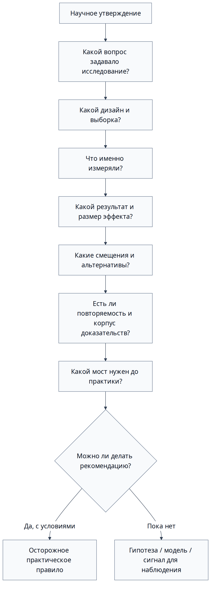{.diagram}


Эта схема не нужна для того, чтобы парализовать действие. Она нужна, чтобы не перепрыгивать.

Граница схемы: не каждое бытовое решение требует академического обзора; глубина проверки должна соответствовать риску, новизне утверждения и цене ошибки.

Плохой переход выглядит так:

```text
в исследовании нашли X
-> X звучит нейронаучно
-> значит, X объясняет мою проблему
-> значит, мне нужен прием против X
```

Хороший переход медленнее:

```text
в исследовании нашли X
-> X относится к такому-то уровню
-> X измеряли таким-то способом
-> в такой-то выборке
-> с такими-то ограничениями
-> практический вывод возможен только при таких условиях
```

В учебнике это особенно важно. Мы постоянно связываем психологию, нейронауку, биохимию, продуктивность, лидерство и ИИ. Чем богаче связка, тем легче сделать красивый, но неверный скачок.

## Корреляция не является причиной

Самая частая ошибка чтения:

```text
X связано с Y
```

превращается в:

```text
X вызывает Y
```

Например:

```text
люди с плохим сном чаще прокрастинируют
```

Из этого нельзя сразу сделать вывод:

```text
плохой сон вызывает прокрастинацию,
значит, достаточно наладить сон
```

Возможны разные объяснения:

| Возможность | Что это значит |
| --- | --- |
| Сон влияет на контроль | Недосып ухудшает внимание, рабочую память, торможение и готовность входить в трудные задачи. |
| Прокрастинация влияет на сон | Человек откладывает, тревожится, работает поздно, сбивает режим. |
| Третья переменная влияет на оба | Хронический стресс, рабочая среда, тревога или перегруз одновременно ухудшают сон и действие. |
| Связь зависит от группы | У студентов, сменных работников, родителей маленьких детей и инженеров на дежурствах причины могут отличаться. |
| Измерение грубое | Сон мог измеряться самоотчетом, а не объективным трекингом; прокрастинация - шкалой, а не поведением. |

Корреляция не бесполезна. Она может показать, куда смотреть. Она может поддержать гипотезу. Она может быть частью корпуса доказательств. Но сама по себе она еще не доказывает причинный механизм и не дает план вмешательства.

Практический вопрос:

```text
это исследование показывает связь,
причинное влияние
или только совместное изменение?
```

Если показывает связь, то в тексте нужно писать "связано с", "наблюдается вместе с", "ассоциировано с".

Не нужно писать:

```text
вызывает
лечит
чинит
доказывает
```

если дизайн этого не поддерживает.

## Причинность требует более сильного моста

Причинный вывод становится сильнее, когда есть:

- экспериментальное вмешательство;
- случайное распределение;
- контроль альтернативных объяснений;
- временной порядок: причина раньше следствия;
- повторяемость результата;
- правдоподобный механизм;
- зависимость от дозы или интенсивности;
- совпадение нескольких линий доказательств;
- эффект на значимый результат, а не только на промежуточный маркер.

Но даже эксперимент не является магией.

Если техника помогла группе студентов сдать задания вовремя, это еще не значит, что она поможет инженеру с большим количеством неопределенных задач, лидеру с командными прерываниями или человеку в состоянии сильного истощения.

Эксперимент отвечает:

```text
при этих условиях это вмешательство изменило этот результат в этой группе
```

Практика спрашивает:

```text
похожа ли моя ситуация на эти условия,
имеет ли тот же результат смысл,
какова цена ошибки,
что нужно изменить в среде,
и как я пойму, что вмешательство работает?
```

## ФМРТ не читает мысли

Нейровизуализация кажется особенно убедительной, потому что дает картинку. Видно, что "что-то активировалось". Мозг выглядит как доказательство.

Но фраза:

```text
при задаче активировалась область X
```

не равна фразе:

```text
человек испытывал процесс Y
```

Это ошибка обратного вывода: выводить психологический процесс только из активности области мозга.

Проблема в том, что одна область может участвовать во многих процессах. Одна и та же сеть может включаться в разные задачи. А один психологический процесс может быть распределен по нескольким областям и зависеть от задачи, инструкции, поведения, контекста и анализа данных.

Например, если в исследовании есть активность островковой коры, нельзя автоматически писать:

```text
человек чувствовал тревогу
```

Островок связан с интероцепцией, значимостью, вниманием к телесным сигналам, неприятными ощущениями, ошибками прогноза, переключением сетей и другими процессами. Чтобы сделать вывод, нужно смотреть дизайн, задачу, поведение, сравнение условий, анализ и связь с другими данными.

Даже когда современная работа аккуратно картирует аллостатическо-интероцептивную систему, это не превращает карту сети в бытовой прибор. Такая работа может показать, какие корковые и подкорковые области связаны с аллостазом и интероцепцией на уровне группы, метода и конкретного анализа. Она не говорит, что у конкретного человека "активировалась усталость", "телу нужен отдых" или "причина прокрастинации найдена". Между данными на уровне сетей и личным практическим выводом всегда нужен мост: поведение, задача, состояние, измерение, альтернативные объяснения и граница применимости.

То же касается популярной формулы:

```text
активировалась миндалина, значит, страх
```

Миндалина важна для обработки значимости и угрозы, но это не маленькая лампочка "страх включен". Защитное поведение, субъективное переживание страха, внимание к угрозе, обучение опасности и телесная мобилизация - не одно и то же.

Правильная позиция не в том, что фМРТ бесполезна.

Правильная позиция:

```text
нейровизуализация полезна,
когда она отвечает на точно поставленный вопрос
и согласована с поведением, задачей, статистикой и другими данными
```

Она становится нейромифом, когда картинка мозга заменяет объяснение.

## Нейромедиатор не является бытовым диагнозом

Глава 14 уже ввела дофамин, норадреналин, серотонин, ацетилхолин, ГАМК, глутамат, кортизол, окситоцин, опиоидные системы и другие регуляторы как часть режимов контуров. Это важный уровень. Но именно здесь особенно легко построить миф.

Миф выглядит так:

```text
нет мотивации - низкий дофамин
тревожно - высокий кортизол
грустно - мало серотонина
не хватает близости - нужен окситоцин
```

Такие формулы кажутся научными. На деле они часто стирают главное: контур, рецепторы, область мозга, время, задачу, контекст, историю обучения, состояние тела, социальную ситуацию и способ измерения.

Исследование может показывать:

- дофаминовые сигналы участвуют в ошибке предсказания;
- дофаминовые системы связаны с выбором с учетом усилия;
- норадреналин участвует в уровне возбуждения и управлении усилением сигнала;
- кортизол меняется в стрессовых процедурах;
- HRV связан с автономной регуляцией;
- окситоцин модулирует социальную значимость в некоторых контекстах.

Это не равно:

```text
я знаю свой дофамин
я знаю причину моего состояния
я знаю, какой прием мне нужен
```

Нейромедиаторный или гормональный язык полезен, если он помогает понять режим системы.

Он вреден, если становится ярлыком:

```text
у меня дофаминовая проблема
```

без поведения, контекста, сна, нагрузки, среды, истории и клинических границ.

## Маркер не всегда причина и не всегда рычаг

Маркер - это показатель. Он может быть полезным. Но нужно понять, что именно он показывает.

Например:

| Сигнал | Чем может быть | Чем не является автоматически |
| --- | --- | --- |
| HRV | Индикатор автономной регуляции, восстановления, нагрузки, стресса в контексте. | Прямая мера силы воли или готовности к трудной задаче. |
| Кортизол | Часть стрессовой регуляции, зависящая от времени суток, задачи, контекста, истории. | Универсальный показатель "мне плохо" или "я перегорел". |
| BOLD-сигнал | Непрямой нейровизуализационный сигнал, связанный с кровотоком и задачей. | Чтение мысли или точное измерение психологического процесса. |
| Сон по трекеру | Приближенная картина режима, движений, пульса, стадий по модели устройства. | Полная медицинская оценка сна. |
| Метрика продуктивности ИИ-инструмента | Конкретная метрика скорости, объема или качества в заданной среде. | Доказательство, что ИИ улучшает любую разработку. |

Хороший вопрос:

```text
маркер показывает причину,
риск,
состояние,
промежуточный процесс
или только косвенный сигнал?
```

Еще один вопрос:

```text
если маркер изменится,
изменится ли важный для человека результат?
```

Например, можно повысить метрику активности, но не улучшить понимание. Можно сократить время выполнения задачи, но увеличить число незамеченных ошибок. Можно улучшить субъективное чувство контроля на один день, но не изменить хронический WIP. Можно получить красивый график сна, но не решить причину ночного стресса.

Маркер полезен, когда помогает наблюдать систему. Он опасен, когда начинает подменять саму систему.

## Одиночная статья - это сигнал, а не закон

Одна статья может быть важной. Многие сильные линии знания начинались с одиночных работ. Но практический вывод редко должен опираться только на одну статью.

Нужно смотреть:

- размер выборки;
- кто участвовал;
- как набирали участников;
- был ли контроль;
- была ли рандомизация;
- было ли ослепление, если оно нужно;
- какой результат измеряли;
- была ли предварительная регистрация;
- сколько анализов проводили;
- насколько эффект велик;
- насколько широка неопределенность;
- были ли независимые повторы;
- нет ли конфликта интересов;
- не слишком ли вывод шире данных.

Особенно осторожно нужно читать яркие исследования с малой выборкой.

Малые выборки не просто "меньше". Они чаще дают нестабильные оценки, завышенные эффекты и больше случайных находок. В нейронауке это особенно важно, потому что измерения сложные, данные дорогие, анализ многослойный, а соблазн яркой интерпретации высок.

Если исследование маленькое и красивое, правильная реакция:

```text
интересный сигнал;
нужно посмотреть, повторяется ли он,
на каких выборках,
с каким размером эффекта
и с какими ограничениями
```

## p-значение не говорит "это правда"

Один из самых вредных способов читать статью:

```text
p < 0.05, значит работает
p > 0.05, значит не работает
```

Так читать нельзя.

p-значение не говорит, что гипотеза истинна. Оно не говорит, что эффект важен. Оно не говорит, что результат повторится. Оно не говорит, что вмешательство полезно в жизни.

Чтобы понять результат, нужно смотреть:

| Вопрос | Зачем |
| --- | --- |
| Какой размер эффекта? | Малый эффект может быть статистически значимым, но практически слабым. |
| Какова неопределенность? | Широкий интервал означает, что оценка хрупкая. |
| Насколько велика выборка? | Малые выборки чаще дают нестабильные выводы. |
| Сколько сравнений проводили? | Много анализов повышают шанс случайной находки. |
| Был ли анализ заранее запланирован? | Выводы, сделанные после просмотра данных, требуют осторожности. |
| Какой результат? | Значимый балл шкалы не всегда равен важному изменению жизни. |
| Какова цена вмешательства? | Малый эффект при высокой цене может быть плохой практикой. |

Для когнитивного инженерства главный вопрос:

```text
этот эффект достаточно велик, надежен и применим,
чтобы менять практику?
```

Иногда ответ будет "да". Например, практика извлечения и распределенная практика имеют достаточно сильную опору, чтобы учебник мог использовать их как важные принципы обучения.

Иногда ответ будет "возможно, но с условиями". Например, практики осознанности, кофеин как краткосрочная поддержка бодрости, HRV-биообратная связь, отдельные нейротренировочные практики или данные о продуктивности с ИИ могут быть полезны в конкретных условиях, но не должны становиться универсальной рекомендацией.

Иногда ответ будет "пока нет". Особенно если речь о БАДах, омега-3 как универсальном когнитивном усилителе, слишком широких обещаниях "улучшения мозга" или переносе свежего механистического результата в бытовой совет.

## Обзор и мета-анализ тоже нужно читать

Мета-анализ часто воспринимают как верхний этаж доказательности:

```text
это же мета-анализ, значит вопрос закрыт
```

Не обязательно.

Мета-анализ объединяет исследования. Если исследования хорошие, сопоставимые и отвечают на один вопрос, он может сильно повысить уверенность. Если исследования слабые, разные, с плохими измерениями, публикационным смещением и разными результатами, итоговая цифра может создать ложную точность.

При чтении обзора или мета-анализа нужно спросить:

| Вопрос | Что проверяет |
| --- | --- |
| Какой вопрос задан? | Не слишком ли широко объединены разные явления. |
| Как искали исследования? | Не пропущены ли неудобные или неопубликованные данные. |
| Какие критерии включения? | Не смешаны ли разные группы, вмешательства и результаты. |
| Как оценивали риск смещения? | Не считаются ли слабые исследования как надежные. |
| Есть ли неоднородность? | Не скрывает ли средний эффект разные эффекты в разных условиях. |
| Есть ли публикационное смещение? | Не видим ли мы только опубликованные положительные результаты. |
| Какой размер эффекта? | Насколько эффект велик, а не только значим. |
| Что с практической значимостью? | Дает ли эффект реальное изменение поведения, обучения, здоровья или работы. |

Пример: мета-анализ может показать, что определенная интервенция снижает прокрастинацию. Это полезно. Но дальше нужно смотреть, какие интервенции включены, как измеряли прокрастинацию, на каких выборках, насколько длителен эффект, есть ли последующее наблюдение, насколько результаты переносятся из академического контекста в работу разработчика или лида.

## Лестница доказательности: что можно сказать на каждом уровне

Полезно держать простую лестницу.

| Уровень доказательности | Что можно сказать | Чего нельзя делать |
| --- | --- | --- |
| Одиночное наблюдение | Есть интересный сигнал или кейс. | Строить правило для всех. |
| Корреляционное исследование | Переменные связаны в этой выборке и измерениях. | Делать причинный вывод без дополнительных оснований. |
| Лабораторный эксперимент | При этих условиях изменился конкретный результат. | Переносить без проверки на другие группы, сроки и реальные задачи. |
| Полевое исследование | Эффект наблюдался в более живой среде. | Игнорировать смешивающие факторы, особенности организации и контекст. |
| Животная модель | Возможен механизм, путь влияния или причинное вмешательство. | Давать прямую человеческую рекомендацию без трансляционного моста. |
| Нейровизуализация | Есть связь задачи/состояния с активностью, сетью или паттерном. | Читать психику по картинке мозга. |
| Систематический обзор | Есть карта найденной литературы по вопросу. | Верить выводу без проверки отбора, качества и ограничений. |
| Мета-анализ | Есть количественная сводка эффектов. | Игнорировать неоднородность, публикационное смещение и слабость включенных исследований. |
| Клиническая или практическая рекомендация | Есть мост от доказательств к действию с учетом пользы, вреда, контекста и качества данных. | Прятать условия применимости и цену ошибки. |

Эта лестница не должна становиться механическим рейтингом.

Для разных вопросов нужны разные дизайны. Если вопрос о прожитом опыте, качественное исследование может быть важнее рандомизированного контролируемого испытания. Если вопрос о причинном эффекте вмешательства, нужен другой дизайн. Если вопрос о механизме в клетках или животных, это не хуже и не лучше полевого исследования на людях: это другой уровень вопроса.

Главное - не путать уровни.

## Животные модели: важны, но требуют перевода

Многие знания о мотивации, стрессе, обучении, предсказании награды, избегании, привычках и контролируемости опираются на животные модели. Это не слабость науки. Часто именно такие модели позволяют увидеть механизмы, которые нельзя или нельзя этично изучать у людей напрямую.

Но перенос должен быть осторожным.

Например, если в животной модели стресс смещает поведение к привычному контролю, нельзя просто написать:

```text
стресс всегда переводит человека в привычки
```

У человека есть язык, социальный смысл, роль, культура, саморефлексия, рабочая среда, долгие проекты, страх оценки, отношения, деньги, семья, статус, личная история. Человеческие привычки трудно измерять так же чисто, как в лабораторной модели. Сама задача может быть другой.

Правильный перенос:

```text
животная модель показывает возможный механизм;
у человека нужно проверить,
как этот механизм проявляется в поведении,
какие условия его усиливают,
и что это значит для практики
```

То же относится к выученной беспомощности, управляемости, дофаминовым сигналам обучения, избеганию и конфликту угрозы и награды. Эти линии важны для учебника. Но они должны приходить в практику через человеческие данные, поведенческие наблюдения, ограничения и аккуратный язык.

## Рецензирование не является печатью истины

Рецензирование полезно. Оно отсекает часть слабых текстов, заставляет авторов уточнять метод, отвечает за минимальный уровень научной коммуникации.

Но рецензирование не делает вывод окончательным.

Рецензенты могут не увидеть ошибку. Журнальная статья может содержать слабую статистику, слишком широкий вывод, публикационное смещение, конфликт интересов или результат, который потом не повторится. Иногда сильная работа выходит как препринт до рецензирования. Иногда слабая работа проходит рецензирование, потому что выглядит убедительно.

Поэтому читать нужно не статусом публикации, а вопросами:

```text
что за дизайн?
что за данные?
каков результат?
каков размер эффекта?
каков риск смещения?
что говорят независимые источники?
```

Препринт - это не мусор. Это ранняя версия научного утверждения.

Заявление поставщика - это не исследовательское доказательство. Это утверждение заинтересованной стороны.

Эти три типа текста требуют разной осторожности.

| Тип текста | Как читать |
| --- | --- |
| Рецензированная статья | Как источник с фильтром, но не как финальную истину. |
| Препринт | Как быстрый сигнал: полезен, если метод прозрачен, но вывод нужно держать обновляемым. |
| Заявление поставщика | Как заявление заинтересованной стороны: искать независимую проверку, метрики, дизайн и конфликт интересов. |

## Быстро меняющаяся зона доказательности: ИИ

ИИ - отдельный случай, потому что данные устаревают быстро.

Исследование может быть честным и сильным, но говорить о:

- конкретной версии инструмента;
- конкретном типе задач;
- конкретной группе пользователей;
- конкретном уровне опыта;
- конкретной метрике продуктивности;
- конкретной организационной среде;
- конкретном времени развития технологий.

Если в одном исследовании ИИ ускорил выполнение лабораторной задачи, нельзя делать вывод:

```text
ИИ ускоряет разработчиков
```

Если в другом исследовании опытные разработчики замедлились на задачах из проектов с открытым исходным кодом с ранними инструментами, нельзя делать вывод:

```text
ИИ мешает разработчикам
```

Правильный вывод должен быть уже:

```text
в таком-то классе задач,
с такой-то версией инструмента,
у такой-то группы людей,
по такой-то метрике,
при таком-то режиме работы
наблюдался такой-то эффект
```

Для практики когнитивного инженерства это означает:

- использовать ИИ как внешний контур, но сохранять собственный след до запроса к ИИ;
- различать учебные, производственные и высокорисковые задачи;
- проверять качество результата, а не только скорость;
- смотреть на сохранение навыка;
- обновлять выводы по мере изменения инструментов;
- не переносить результаты демонстраций поставщиков в личную или командную политику без проверки.

В ИИ-литературе дата является частью утверждения.

Фраза:

```text
исследования показывают, что ИИ ускоряет разработку
```

слишком широкая.

Лучше:

```text
часть исследований 2023-2026 годов показывает выигрыши в отдельных задачах и средах,
часть показывает ограничения или ухудшение,
поэтому практическая политика должна зависеть от типа задачи,
с проверкой качества, роли ИИ и сохранения навыка
```

## Как читать популярный нейротекст

Популярный текст не обязан быть плохим.

Плохая популяризация делает сложное ложным.

Хорошая популяризация делает сложное доступным, но сохраняет структуру вывода.

Проверка популярного текста:

| Если текст пишет | Спросить |
| --- | --- |
| "Ученые доказали" | Что именно доказали, каким дизайном и с какими ограничениями? |
| "Мозг выбирает" | На каком уровне: поведение, модель, нейронный коррелят, вычислительный механизм? |
| "Дофамин отвечает за..." | Какой аспект: обучение, усилие, значимость, желание или выбор действия? |
| "Кортизол вызывает..." | В какой процедуре, в какое время, у какой группы, с каким результатом? |
| "ФМРТ показала..." | Что была за задача, сравнение условий, статистика и поведение? |
| "Мета-анализ подтвердил..." | Какие исследования включены, какая неоднородность, какой размер эффекта? |
| "ИИ повышает продуктивность" | Какая версия, какая задача, какая метрика, какой пользователь, какой контроль качества? |

Хорошая формулировка часто звучит менее эффектно, зато полезнее:

```text
есть данные, что...
в таких условиях...
вероятно связано с...
может участвовать в...
этот вывод ограничен...
пока неясно...
практически это означает не X, а вопрос Y
```

Да, такие фразы менее яркие. Зато они не воруют у читателя реальность.

## Пример 1. "Дофамин отвечает за мотивацию"

Возьмем утверждение:

```text
дофамин отвечает за мотивацию
```

Оно не полностью ложное. Именно поэтому опасное.

Дофаминовые системы действительно связаны с обучением, ошибкой предсказания награды, вложением усилия, значимостью, выбором действия и мотивационной активацией. Нейрохимический блок уже развернул это различение.

Но если из этого сделать:

```text
нет мотивации = мало дофамина
```

практический вывод потеряет почти все важное.

Нужно спросить:

| Вопрос | Почему важен |
| --- | --- |
| О каком исследовании речь? | Разные работы измеряют разные аспекты дофаминовых систем. |
| Люди или животные? | Перенос уровня механизма в человеческую жизнь требует моста. |
| Что было задачей? | Награда, усилие, обучение, избегание, неопределенность - разные вещи. |
| Было ли причинное вмешательство? | Коррелят не равен причине. |
| Какой результат? | Нейронный сигнал, выбор действия, самоотчет, клинический симптом - не одно и то же. |
| Что можно сделать на практике? | "Повысить дофамин" не является аккуратным инженерным вмешательством. |

Более точный вывод:

```text
дофаминовые системы участвуют в нескольких механизмах мотивационного выбора;
для практики чаще доступнее работать с задачей, обратной связью, ценностью,
угрозой, ценой усилия, сном, WIP и управляемостью,
чем пытаться бытово "управлять дофамином"
```

## Пример 2. "HRV показывает, готов ли я работать"

HRV может быть полезным индикатором автономной регуляции. Но если человек говорит:

```text
у меня низкий HRV, значит сегодня нельзя делать трудное
```

он сделал слишком быстрый вывод.

Нужно спросить:

- как измерено HRV;
- насколько стабилен прибор;
- какая индивидуальная база;
- каков сон, болезнь, алкоголь, нагрузка, стресс, время суток;
- о какой задаче речь;
- что говорит субъективное состояние;
- есть ли поведенческие данные;
- что будет ценой отказа от задачи;
- можно ли изменить формат входа вместо полного отказа.

Осторожный вывод:

```text
HRV может быть одним из сигналов состояния,
но не должен единолично управлять решением о сложной работе
```

Даже если обзор или мета-анализ показывает связь HRV с исполнительными функциями, это не превращает показатель в кнопку управления. Связь может быть небольшой, зависеть от протокола измерения, возраста, задачи, дыхания, состояния, выбора HRV-метрики и качества включенных исследований. HRV-биообратную связь тоже нельзя превращать в универсальную "прокачку исполнительных функций": это возможное вмешательство с условиями, а не доказательство, что любой человек станет лучше думать после любой дыхательной практики.

Когнитивное инженерство не запрещает метрики. Оно запрещает отдавать метрике больше власти, чем она заслуживает.

## Пример 3. "ИИ ускоряет программирование"

Утверждение:

```text
ИИ ускоряет программирование
```

слишком широкое.

Нужно уточнить:

| Вопрос | Что меняет |
| --- | --- |
| Какая версия инструмента? | Инструменты меняются быстро. |
| Какая задача? | Шаблонный код, отладка, архитектура, незнакомая кодовая база, тесты, ревью - разные режимы. |
| Какой пользователь? | Новичок, разработчик среднего уровня, синьор, эксперт домена получают разные эффекты. |
| Какая метрика? | Время, число PR, принятые строки, корректность, сопровождаемость, обучение, ошибки. |
| Как проверяли качество? | Быстрее не значит лучше. |
| Что с навыком? | Когнитивная разгрузка может помогать или убирать тренировочную нагрузку. |
| Какой контекст? | Лабораторная задача, задача в проекте с открытым исходным кодом, корпоративная среда, риск для промышленного контура. |

Практический вывод должен звучать так:

```text
ИИ может ускорять часть задач и ухудшать другие;
его нужно использовать через роль, собственный след, проверку и границу применимости,
а не как универсальный ускоритель
```

## Протокол чтения исследования

Для обычной работы не нужен полный методологический разбор каждой статьи. Но нужен короткий протокол, который не дает мозгу слишком быстро поверить красивому выводу.

```text
1. Выпиши утверждение одним предложением.
2. Определи вопрос исследования.
3. Определи дизайн.
4. Посмотри выборку.
5. Посмотри, что именно измеряли.
6. Найди результат.
7. Посмотри размер эффекта и неопределенность.
8. Найди ограничения.
9. Спроси, какие альтернативные объяснения остались.
10. Проверь, есть ли корпус доказательств.
11. Определи мост до практики.
12. Сформулируй вывод с условиями.
```

Для учебника это можно превратить в короткую форму:

| Поле | Вопрос |
| --- | --- |
| Утверждение | Что утверждается? |
| Уровень | На каком уровне: поведение, механизм, маркер, практика? |
| Дизайн | Как это изучали? |
| Выборка | На ком? |
| Результат | Что считали результатом? |
| Эффект | Насколько велик эффект? |
| Смещение | Где возможны смещения? |
| Корпус доказательств | Это одиночная работа или часть линии? |
| Мост | Что нужно, чтобы перенести это в практику? |
| Формулировка | Какая формулировка будет честной? |

## Как формулировать выводы без нейромифа

В учебнике и собственных заметках полезно держать словарь осторожности.

| Если данные показывают | Писать лучше так | Не писать так |
| --- | --- | --- |
| Корреляцию | "связано с", "ассоциировано с" | "вызывает" |
| Возможный механизм | "может участвовать", "похоже, является частью" | "это причина" |
| Нейронный коррелят | "в этой задаче наблюдалась активность..." | "мозг хотел..." |
| Животную модель | "в модели показан возможный механизм" | "людям нужно..." |
| Малый эксперимент | "полезный сигнал, требует проверки" | "доказано" |
| Мета-анализ с неоднородностью | "в среднем эффект есть, но условия важны" | "работает для всех" |
| Свежая работа про ИИ | "для этой версии инструмента и этих задач" | "ИИ теперь..." |
| Смешанные данные | "данные неоднородны" | "ученые спорят, значит можно выбрать что нравится" |

Осторожный язык не делает текст слабым. Он делает его пригодным для мышления.

Слабый текст обещает больше, чем знает.

Сильный текст показывает, где знание заканчивается и что с этим делать.

## Что делать, если доказательства слабые, но практика нужна

Иногда ждать идеальных данных невозможно. Человек все равно должен работать, учиться, спать, планировать, пользоваться ИИ, разговаривать с командой и восстанавливаться.

В таких случаях не нужно притворяться, что доказательная база сильнее, чем есть.

Нужно менять статус вывода:

| Статус | Как действовать |
| --- | --- |
| Сильная база | Использовать как принцип, но следить за условиями применимости. |
| Средняя или контекстная база | Пробовать как гипотезу с наблюдением результата. |
| Слабая база | Не строить на ней центральную систему; максимум - осторожный эксперимент с низкой ценой ошибки. |
| Быстро меняющаяся база | Помечать дату, версию, задачу и обновлять вывод. |
| Клиническая зона | Не превращать в самостоятельный протокол; подключать профессиональный уровень. |

Например, если данные по какой-то практике смешанные, но практика безопасна, дешева и помогает человеку наблюдать себя, ее можно использовать как личный эксперимент:

```text
попробую две недели,
заранее определю результат,
посмотрю, стало ли легче входить в задачу,
не буду делать из этого универсальный закон
```

Если практика дорогая, медицински рискованная, влияет на лекарства, сон, питание, психическое состояние или обещает сильный эффект без хороших данных, уровень осторожности должен быть другим.

## Нейромиф рождается из слишком короткого моста

Нейромиф редко начинается с полной лжи.

Чаще он начинается с настоящего фрагмента:

```text
дофамин связан с обучением и усилием
стресс влияет на префронтальный контроль
сон важен для консолидации
движение связано с когнитивной функцией
ИИ может ускорять часть задач
HRV отражает автономную регуляцию
```

Потом мост сокращается:

```text
дофамин = мотивация
стресс = кортизол
сон = запись знаний
движение = прокачка мозга
ИИ = универсальный ускоритель
HRV = готовность к работе
```

И практический вывод становится слишком уверенным.

Задача этого разбора - не запретить мосты. Без мостов наука не попадет в практику.

Задача - делать мосты видимыми:

```text
какой уровень?
какая доказательная база?
какое ограничение?
какая цена ошибки?
какой первый безопасный способ проверить?
```

## Главный вывод

Читать исследования для когнитивного инженерства - значит не искать готовые лозунги, а восстанавливать путь вывода.

Не:

```text
ученые доказали, значит делаем
```

А:

```text
исследование отвечает на такой-то вопрос,
таким-то способом,
в такой-то группе,
с таким-то эффектом,
с такими-то ограничениями;
для практики это означает осторожное правило,
гипотезу или необходимость дальнейшей проверки
```

Такой подход медленнее. Но он защищает от ложной точности.

Когнитивное инженерство не должно быть ни нейропопом, ни академической витриной. Его задача - строить практические контуры действия, которые честно знают, на какой доказательной базе стоят.

После доказательной дисциплины учебник можно использовать не как набор советов, а как систему маршрутов. Разработчику, лиду, человеку в перегрузе, человеку, который учится, и человеку, который работает с ИИ, нужны разные входы в один и тот же материал. Но каждый маршрут должен сохранять уровень вопроса, границы модели и честный мост от знания к действию.

## Короткое резюме

- Исследование не равно рекомендация.
- Корреляция не является причиной, механизм не является рычагом, маркер не является диагнозом.
- Одиночная статья редко достаточна для уверенного практического правила.
- Мета-анализ полезен, но его нужно читать через вопрос, качество включенных работ, неоднородность и публикационное смещение.
- Физиологическая метрика вроде HRV может помогать наблюдать состояние, но требует протокола, индивидуальной базы, контекста и поведенческого моста.
- В быстро меняющихся зонах, особенно ИИ, дата, версия инструмента, тип задачи и метрика являются частью вывода.
- Практический мост от доказательств к действию должен быть видимым и ограниченным.

## Вопросы для самопроверки

1. Какой вопрос исследования нужно восстановить перед практическим выводом?
2. Почему фраза "связано с" не дает права писать "вызывает"?
3. Что опасно в прямом выводе от фМРТ-картинки к человеческому состоянию?
4. Почему p-значение не говорит, что результат практически важен?
5. Почему HRV или показатель готовности нельзя читать как прямую готовность к работе?
6. Как формулировать практическое правило, если доказательства слабые, но действие нужно выбрать?

## Мини-практика

Возьмите одно научное или популярное утверждение и разберите его:

```text
утверждение:
какой источник:
какой дизайн:
какая выборка или область:
что измеряли:
какой эффект:
какие ограничения:
какой уровень вывода допустим:
чего нельзя утверждать:
какая безопасная практика или гипотеза возможна:
как проверить это на себе или в работе без универсального вывода:
```

Если после разбора вывод стал скромнее, это не слабость. Это и есть доказательная грамотность.

---

# Глава 36. Как пользоваться учебником

Этот учебник можно читать подряд. Так даже лучше, если вы входите в тему впервые.

Порядок глав построен не случайно. Сначала появляется узнаваемая проблема: человек теряет не только время, но и состояние мысли. Потом вводится внешний контур мышления. Затем - мотивация как система действия. После этого можно аккуратно добавить мозг, тело, биохимию, обучение, преодоление, продуктивность, выгорание, ИИ, лидерство, практикум, границы и доказательность.

Если начать с середины, легко исказить смысл.

Например, если открыть главу про дофамин до главы про уровни объяснения, можно снова получить "дофамин = мотивация". Если читать главу про продуктивность без глав про цену усилия и восстановление, можно принять устойчивый режим за более умный самоизнос. Если читать главу про ИИ без главы про опыт преодоления, можно решить, что главная задача - быстрее получить ответ, а не сохранить способность думать.

Но учебник нужен не только для первого чтения.

После первого прохода он должен работать как карта. Человек приходит не с абстрактным желанием "изучить когнитивное инженерство", а с конкретным сигналом:

```text
я не могу начать
я потерял контекст
я устал и не восстанавливаюсь
команда тонет в срочностях
ИИ стал думать вместо меня
сотрудник потерял мотивацию
я читаю исследование и не понимаю, насколько ему верить
```

В такие моменты учебник нужно открывать не как энциклопедию, а как навигационную систему.

Главная формула использования:

```text
сигнал -> уровень вопроса -> маршрут -> глава -> первый ход -> обратная связь -> граница
```

## Сначала уровень, потом глава

Самая частая ошибка - искать главу по слову.

Если нет сил, человек идет в главу про ресурсность. Если нет мотивации - в главу про мотивацию. Если тревожно - в главу про стресс. Если задача не начинается - в главу про прокрастинацию. Иногда это сработает. Но часто сигнал похож на одно, а причина живет на другом уровне.

Поэтому первый вопрос:

```text
какой уровень сейчас активен?
```

Не какой термин звучит знакомо, а где находится основной рычаг.

Вопрос схемы: с какого уровня начинать чтение, чтобы не чинить потерю контекста мотивационным нажимом, истощение продуктивностью или организационную проблему личным ритуалом?


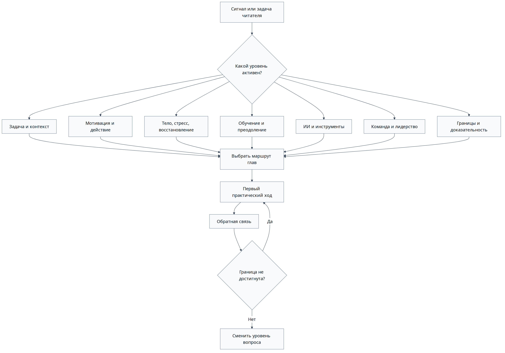{.diagram}


Эта схема нужна не для красивого финала. Она защищает от неправильного применения книги.

Граница схемы: маршрут не обязан быть окончательным. Если первый ход не дает обратную связь или сигнал выходит за выбранный уровень, стоит вернуться к выбору уровня, а не давить сильнее тем же приемом.

Если сигнал "не могу начать" связан с потерей контекста, нужен рабочий журнал. Если он связан с угрозой оценки, нужно разбирать угрозу и управляемость. Если он связан с истощением, нужен маршрут восстановления. Если он связан с организационной средой, личный ритуал входа поможет только частично. Если он связан с тяжелым состоянием, учебник должен помочь увидеть границу, а не дать еще один протокол продуктивности.

## Основной линейный маршрут

Если вы читаете учебник впервые, лучше идти по порядку.

Лестница такая:

Вопрос схемы: какую последовательность понятий лучше пройти в первый раз, чтобы поздние практические главы не висели в воздухе?


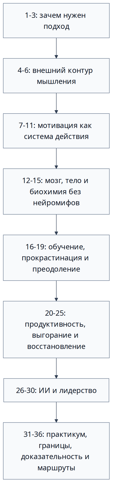{.diagram}


Первый проход не обязан быть глубоким. Его задача - собрать карту.

Граница схемы: линейный маршрут нужен для первого знакомства, а не для запрета возвращаться к нужной главе по задаче.

На первом чтении достаточно после каждой части ответить:

```text
какую проблему эта часть решает?
какое понятие она вводит?
какой тип ошибки предотвращает?
какой практический вопрос я теперь могу задать точнее?
```

Не нужно сразу превращать каждую главу в практику. Иначе учебник станет набором незавершенных экспериментов.

Лучший первый проход:

1. Прочитать часть.
2. Выписать 3-5 понятий.
3. Нарисовать или пересказать ключевую схему.
4. Найти один пример из своей жизни или работы.
5. Не менять систему сразу, если непонятно, какую обратную связь смотреть.

## Маршруты по задачам

После первого знакомства учебник можно использовать как справочник. Но справочник здесь не значит "таблица приемов".

Маршрут должен вести через понятия и границы.

| Задача читателя | Начать с | Затем читать | Обязательно проверить |
| --- | --- | --- | --- |
| Войти в туманную задачу | 1, 4-6 | 21, 31-33 | Цена входа, WIP, контрольная точка, обратная связь. |
| Разобрать мотивацию | 7-11 | 18-19, 23-25, 29 | Угроза, управляемость, состояние, границы. |
| Работать с ИИ | 26-27 | 5, 16, 19, 31, 35 | Собственный след до запроса к ИИ, проверка, сохранение навыка. |
| Восстановиться после перегруза | 11, 15, 23-25 | 31-34 | Медицинская, организационная граница и граница восстановления. |
| Учиться сложному | 16-19 | 17, 26-27, 35 | Извлечение из памяти, полезная трудность, перенос, ИИ-обход. |
| Вести команду | 28-30 | 7-11, 20-25, 31, 34 | WIP, автономия, обратная связь, выгорание и профессиональная скука. |
| Собрать личный контур | 4-6, 20-22 | 31-32, 34-35 | Не превратить систему в бюрократию или самоизнос. |

В этой таблице важно слово "проверить". Маршрут не считается примененным, если после чтения не появилась обратная связь.

Не:

```text
прочитал главу про прокрастинацию, значит понял проблему
```

А:

```text
прочитал главу,
сформулировал гипотезу,
сделал первый проверяемый ход,
посмотрел, изменилась ли доступность действия
```

## Маршрут разработчика: туманная задача и потеря контекста

Если вы разработчик, архитектор, исследователь или любой человек, который работает с длинными неопределенными задачами, главный вход - главы 1 и 4-6.

Типовой сигнал:

```text
я знаю, что задача важная,
но не могу в нее войти
и каждый раз заново вспоминаю, где остановился
```

Не начинайте с мотивации.

Сначала проверьте контекст:

- есть ли цель;
- что известно;
- что непонятно;
- какие гипотезы уже проверялись;
- где последний рабочий след;
- что является ближайшим проверяемым срезом;
- что нужно оставить будущему себе.

Главы маршрута:

| Главы | Что взять |
| --- | --- |
| 1 | Понять проблему потери состояния мысли. |
| 4 | Собрать состояние задачи как внешний объект. |
| 5 | Вести рабочий журнал как контур мышления. |
| 6 | Делать вход и выход через ритуал, а не через героическое вспоминание. |
| 21 | Ограничить WIP и цену переключений. |
| 26-27 | Подключать ИИ без потери постановки, проверки и собственного следа. |
| 31-33 | Диагностировать конкретный сбой и выбрать первый ход. |

Первый практический ход:

```text
создать запись состояния задачи на 20 минут:
цель, контекст, туман, гипотезы, проверенные тупики,
следующий срез, критерий обратной связи
```

Обратная связь:

```text
стало ли дешевле снова войти в задачу?
понятнее ли следующий контакт?
меньше ли повторного вспоминания?
```

Граница:

если проблема не в контексте, а в хронической перегрузке, страхе оценки, невозможности выделить время, конфликте приоритетов или отсутствии полномочий, маршрут разработчика нужно соединить с маршрутами мотивации, восстановления или лидерства.

## Маршрут тимлида: среда, а не мотивационный нажим

Для тимлида или инженерного руководителя учебник особенно важен тем, что запрещает сводить проблемы команды к "люди не хотят".

Типовые сигналы:

```text
команда не держит фокус
задачи стареют
люди не проявляют инициативу
все постоянно срочно
мотивация просела
```

Первый вопрос:

```text
какая среда действия построена?
```

Главы маршрута:

| Главы | Что взять |
| --- | --- |
| 7-11 | Мотивация как контекст: ценность, угроза, управляемость, цена усилия. |
| 20-21 | Продуктивность и WIP как свойства режима, а не количества нажима. |
| 23-25 | Выгорание, профессиональная скука, долг восстановления и границы восстановления. |
| 28 | Лидерство как дизайн среды действия. |
| 29 | Мотивация сотрудника без типологии и манипуляции. |
| 30 | Командный фокус, срочность, прерывания и долг восстановления. |
| 31, 34 | Диагностика задачи и границы личного/организационного уровня. |

Первый практический ход:

```text
выбрать один командный симптом
и разобрать его не как черту людей,
а как среду:
цель, автономия, WIP, срочность, обратная связь, ресурсы, безопасность сообщения о риске
```

Обратная связь:

```text
стало ли команде понятнее,
что активно,
что срочно,
что заблокировано,
кто принимает решение,
и какой следующий срез продвижения?
```

Граница:

лидерство как когнитивное инженерство не является способом выжать из людей больше. Если требования хронически выше ресурсов, если нет полномочий, если среда небезопасна, если есть дискриминация, травля или системная несправедливость, личная мотивация сотрудников не является главным уровнем решения.

## Маршрут перегруза: не чинить истощение продуктивностью

Если вы пришли к учебнику в состоянии перегруза, не начинайте с глав про продуктивность.

Типовой сигнал:

```text
я устал,
но если правильно настрою систему,
может быть, снова смогу работать нормально
```

Осторожно. Иногда система действительно поможет. Иногда это начало нового самоизноса.

Главы маршрута:

| Главы | Что взять |
| --- | --- |
| 11 | Цена усилия, усталость и ощущаемая энергия. |
| 15 | Стресс, аллостаз и окно полезной нагрузки. |
| 20 | Продуктивность без самоизноса. |
| 23 | Как ломается мотивационный контур. |
| 24 | Выгорание и профессиональная скука. |
| 25 | Восстановление как возвращение управляемости. |
| 34 | Границы модели: медицина, психотерапия, организация. |

Первый практический ход:

```text
не планировать рывок;
составить карту нагрузки:
что требует усилия,
что восстанавливает,
что висит в WIP,
где нет управляемости,
какой минимальный безопасный шаг возможен
```

Обратная связь:

```text
уменьшился ли хаос?
появился ли безопасный следующий шаг?
стало ли легче отличать активное от замороженного?
появилось ли восстановление после снижения нагрузки?
```

Граница:

если состояние тяжелое, длительное, нарушает сон, аппетит, базовые дела, концентрацию, телесное самочувствие или безопасность, учебник не должен становиться заменой помощи. В этом режиме он может помочь описать состояние и подготовить разговор с врачом, терапевтом, руководителем или близкими, но не должен изображать лечение.

## Маршрут обучения: понимание, трудность и ИИ

Если ваша задача - учиться сложному, главный риск не в том, что вы мало читаете. Главный риск - принять знакомость за понимание.

Типовые сигналы:

```text
я читаю, но не могу применить
я понимаю объяснение, пока смотрю на него
я избегаю сложных задач
ИИ быстро объясняет, но навык не растет
```

Главы маршрута:

| Главы | Что взять |
| --- | --- |
| 3 | Минимальная модель внимания, памяти, тела и среды. |
| 16 | Понимание: фрагмент, чанк, извлечение из памяти, перенос. |
| 17 | Сон, консолидация, интервальные возвраты. |
| 18 | Прокрастинация как конфликт систем. |
| 19 | Опыт преодоления и полезная трудность. |
| 26-27 | ИИ как репетитор, оппонент, ускоритель, но не обход. |
| 35 | Дисциплина доказательности для учебных техник и нейромифов. |

Первый практический ход:

```text
после чтения темы закрыть материал
и восстановить из памяти:
что было главным,
какой пример,
какой вопрос я теперь могу решить,
где осталось непонимание
```

Обратная связь:

```text
могу ли я применить понятие в новой задаче?
могу ли объяснить без текста?
где ломается извлечение из памяти?
какая трудность полезная, а какая перегружает?
```

Граница:

ИИ может помогать учиться, если он работает после вашей попытки. Если он снимает всю трудность до того, как вы построили внутренний след, он может дать скорость без компетентности.

## Маршрут работы с ИИ

В этом учебнике ИИ не враг и не спаситель. Он внешний когнитивный контур. Как любой внешний контур, он может усилить мышление или заменить его видимостью мышления.

Типовой сигнал:

```text
с ИИ я двигаюсь быстрее,
но хуже понимаю, что именно решил
```

Главы маршрута:

| Главы | Что взять |
| --- | --- |
| 5-6 | Рабочий журнал, вход, выход, контрольная точка. |
| 16 | Понимание и иллюзия компетентности. |
| 19 | Полезная трудность и опыт овладения. |
| 26 | ИИ как усилитель или обход. |
| 27 | Практический режим работы с ИИ. |
| 31-33 | Диагностика задачи и практические кейсы. |
| 35 | Доказательства по ИИ, заявления поставщиков, быстро меняющаяся литература. |

Первый практический ход:

```text
перед запросом к ИИ записать:
цель,
контекст,
свою гипотезу,
критерий хорошего ответа,
что нельзя отдавать ИИ,
как буду проверять
```

Обратная связь:

```text
после ответа я лучше понимаю задачу?
могу объяснить решение?
знаю, что проверил?
остался след для будущего входа?
навык вырос или только задача закрылась?
```

Граница:

в высокорисковых задачах, медицинских, юридических, финансовых, безопасностных, приватных или организационно чувствительных вопросах ИИ не должен быть последним уровнем проверки. Даже в обычной разработке ИИ-ответ без собственного следа и проверки может увеличить скорость ошибки.

## Маршрут личного когнитивного контура

Если вы хотите собрать личную систему работы, не начинайте с выбора приложения.

Личный контур - это не набор инструментов. Это повторяемая петля:

```text
вход -> срез -> действие -> след -> выход -> восстановление -> разбор системы
```

Главы маршрута:

| Главы | Что взять |
| --- | --- |
| 4-6 | Контекст задачи, рабочий журнал, ритуалы входа/выхода. |
| 20-22 | Продуктивность, WIP, ресурсность, ритуалы. |
| 31 | Диагностика задачи. |
| 32 | Проектирование личного когнитивного контура. |
| 34-35 | Границы модели и дисциплина доказательности. |

Первый практический ход:

```text
выбрать один тяжелый трек
и сделать для него минимальный контур:
карта состояния,
правило входа,
правило выхода,
формат контрольной точки,
разбор системы раз в неделю
```

Обратная связь:

```text
снизилась ли цена входа?
меньше ли повторного вспоминания?
виден ли сдвиг?
не стала ли система бюрократией?
есть ли восстановление?
```

Граница:

если личный контур начинает требовать больше энергии, чем возвращает, он стал частью проблемы. Его нужно упростить, а не героически обслуживать.

## Маршрут "нет мотивации"

Фраза:

```text
нет мотивации
```

слишком широкая. Она может означать:

- нет ценности;
- ценность есть, но действие недоступно;
- высокая угроза;
- низкая управляемость;
- слишком высокая цена усилия;
- нет обратной связи;
- недосып;
- перегруз;
- недогруз;
- конфликт роли;
- выгорание;
- депрессивное или тревожное состояние;
- организационную проблему;
- отсутствие безопасного первого шага.

Маршрут:

| Если похоже на | Читать |
| --- | --- |
| "не понимаю, что делать" | 4-6, 31 |
| "важно, но страшно" | 8-10, 18-19 |
| "хочу результат, но нет сил" | 11, 15, 20-25 |
| "не вижу смысла" | 7-8, 24, 29 |
| "команда/среда не дает действовать" | 28-30, 34 |
| "состояние тяжелое и долгое" | 34 |

Первый практический ход:

```text
не спрашивать "как мотивироваться";
спросить:
что ценно,
что угрожает,
какова цена,
что управляемо,
какая обратная связь покажет сдвиг
```

## Как возвращаться к учебнику как к справочнику

Для повторного использования можно держать короткий протокол:

```text
1. Назови сигнал.
2. Определи уровень вопроса.
3. Выбери маршрут.
4. Прочитай одну-две опорные главы.
5. Выпиши один практический ход.
6. Заранее определи обратную связь.
7. Проверь границу.
8. Оставь след в рабочем журнале.
```

Пример:

```text
Сигнал: не могу вернуться к задаче после двух дней паузы.
Уровень: задача и контекст.
Маршрут: главы 4-6, затем 31.
Первый ход: восстановить карту состояния задачи за 20 минут.
Обратная связь: появился ли следующий проверяемый шаг.
Граница: если сопротивление связано не с контекстом, а с перегрузом, перейти к главам 11, 23-25 и 34.
```

Так учебник становится не полкой знаний, а рабочей картой.

## Как не пользоваться учебником

Есть несколько плохих способов.

### 1. Искать быстрый прием

```text
у меня прокрастинация, где техника?
```

Прокрастинация может быть дорогим входом, угрозой, усталостью, привычным уходом, недогрузом, перегрузом или клинической границей. Если сразу взять технику, можно усилить не тот контур.

### 2. Начинать с биохимии

```text
какой гормон отвечает за это состояние?
```

Этот вопрос редко первый. Сначала нужно понять поведение, задачу, состояние, среду и уровень вмешательства.

### 3. Чинить себя вместо среды

```text
как мне стать дисциплинированнее в постоянной срочности?
```

Иногда ответ - не стать жестче, а изменить WIP, серьезность входящих сигналов, роли, ожидания и право на фокус.

### 4. Использовать границы как оправдание бездействия

Раздел о границах не говорит:

```text
все сложно, ничего не делай
```

Она говорит:

```text
выбери правильный уровень помощи и действия
```

### 5. Читать доказательность как запрет на практику

Раздел о доказательности не говорит:

```text
если доказательство не идеальное, нельзя действовать
```

Она говорит:

```text
подбери силу вывода к силе доказательства
```

## Что делать после первого полного прохода

Если вы действительно проходите учебник как учебный курс, после линейного чтения стоит сделать не конспект всего, а личную карту применения.

Минимальная форма:

| Вопрос | Ответ |
| --- | --- |
| Какие три сигнала я теперь вижу точнее? | Например: потеря контекста, дорогой вход, долг восстановления. |
| Какие главы стали для меня опорными? | Не больше 5-7 глав. |
| Какая одна практика уже просится в работу? | Рабочий журнал, WIP-лимит, собственный след до запроса к ИИ, карта восстановления. |
| Какая обратная связь покажет, что практика помогает? | Снижение цены входа, меньше повторного вспоминания, яснее следующий шаг. |
| Где моя граница? | Медицинская, терапевтическая, организационная, доказательная или приватная граница. |

Не нужно строить всю систему сразу.

Система растет лучше, если начинать с одного контура:

```text
один тяжелый трек
один рабочий журнал
один ритуал входа
одна контрольная точка
один недельный разбор
```

Если это работает, можно расширять.

Если не работает, нужно не давить сильнее, а диагностировать:

```text
не тот уровень?
слишком много WIP?
нет обратной связи?
слишком высокая цена?
состояние не позволяет?
среда ломает контур?
```

## Второй проход

После полного чтения книга начинает работать иначе.

Первый проход нужен, чтобы собрать общий язык: контекст, ценность, угрозу, цену усилия, управляемость, тело, среду, инструменты, обратную связь и границы. Второй проход нужен не для повторения всего подряд, а для уточнения своей рабочей системы.

На втором проходе стоит задавать уже не вопрос:

```text
что здесь написано?
```

А вопрос:

```text
где это меняет мой следующий ход?
```

Хороший второй проход выглядит как выбор нескольких живых мест, а не как попытка внедрить всю книгу:

- один повторяющийся сбой входа в задачу;
- один перегруженный трек;
- одна ситуация, где ИИ помогает слишком рано;
- одна командная петля прерываний;
- одна зона восстановления, которую человек постоянно откладывает;
- одна граница, где нужно перестать чинить себя инструментами и перейти к другому уровню помощи.

Для каждого такого места достаточно пройти короткую петлю:

```text
сигнал -> глава -> понятие -> первый ход -> обратная связь -> граница
```

Если после этого ситуация стала понятнее, контур работает. Если нет, это тоже результат: значит, выбран не тот уровень объяснения, не тот первый ход, не та граница или не та единица работы.

Так учебник превращается из текста в прибор для повторного наведения резкости.

## Главный вывод

Пользоваться учебником - значит не запоминать все ответы, а учиться задавать правильный следующий вопрос.

Когда задача туманна:

```text
что нужно вынести из головы?
```

Когда нет мотивации:

```text
что происходит с ценностью, угрозой, ценой усилия и управляемостью?
```

Когда нет сил:

```text
это усталость, перегруз, недогруз, долг восстановления, среда или граница помощи?
```

Когда ИИ помогает:

```text
он усиливает мою петлю мышления или обходит ее?
```

Когда команда не держит фокус:

```text
какая среда действия делает фокус невозможным?
```

Когда исследование звучит убедительно:

```text
какой мост от доказательства к практике?
```

В этом и состоит практическая суть когнитивного инженерства.

Не заставить себя всегда быть сильнее.

Не найти один гормон, одну технику, один инструмент или один режим.

А научиться видеть систему:

```text
контекст,
ценность,
угрозу,
усилие,
управляемость,
тело,
среду,
инструменты,
обратную связь
и границы
```

И проектировать следующий честный шаг там, где он действительно доступен.

## Короткое резюме

- Учебник можно читать линейно, но можно использовать как карту маршрутов.
- Маршрут выбирается по уровню вопроса: задача, мотивация, тело, обучение, продуктивность, ИИ, команда, граница или доказательность.
- Быстрый маршрут не отменяет базовые понятия: если понятие не введено, нужно вернуться к его главе.
- Любое применение должно заканчиваться проверкой обратной связи и границы.
- После первого полного чтения полезен второй проход по нескольким живым ситуациям, где понятия меняют следующий ход.

## Вопросы для самопроверки

1. Когда лучше читать учебник линейно, а когда маршрутом?
2. Почему нельзя начинать с практического приема, не определив уровень вопроса?
3. Какие главы нужны разработчику в туманной задаче?
4. Какие главы нужны человеку в перегрузе?
5. Что значит "проверка обратной связи и границы" после практического шага?

## Мини-практика

Выберите один живой сигнал и подберите маршрут:

```text
сигнал:
уровень вопроса:
первые 2-3 главы маршрута:
какое понятие нужно перечитать:
какой первый ход доступен:
какая обратная связь покажет сдвиг:
какая граница может быть активна:
когда вернуться к учебнику:
```

Эта практика превращает книгу из линейного текста в рабочую карту.

---

# Список литературы

## 1. Когнитивный контроль, память и внешняя когниция

Altmann, E. M., & Trafton, J. G. (2002). "Memory for Goals: An Activation-Based Model." _Cognitive Science_, 26(1), 39-83. https://doi.org/10.1016/S0364-0213(01)00058-1.

Baddeley, A. (2012). "Working Memory: Theories, Models, and Controversies." _Annual Review of Psychology_, 63, 1-29. https://doi.org/10.1146/annurev-psych-120710-100422.

Badre, D. (2025). "Cognitive Control." _Annual Review of Psychology_, 76, 167-195. https://doi.org/10.1146/annurev-psych-022024-103901.

Boldt, A., & Gilbert, S. J. (2019). "Confidence Guides Spontaneous Cognitive Offloading." _Cognitive Research: Principles and Implications_, 4, 45. https://doi.org/10.1186/s41235-019-0195-y.

Czerwinski, M., Horvitz, E., & Wilhite, S. (2004). "A Diary Study of Task Switching and Interruptions." _Proceedings of CHI 2004_, 175-182. https://doi.org/10.1145/985692.985715.

Diamond, A. (2013). "Executive Functions." _Annual Review of Psychology_, 64, 135-168. https://doi.org/10.1146/annurev-psych-113011-143750.

Gilbert, S. J. (2015a). "Strategic Offloading of Delayed Intentions into the External Environment." _Quarterly Journal of Experimental Psychology_, 68(5), 971-992. https://doi.org/10.1080/17470218.2014.972963.

Gilbert, S. J. (2015b). "Strategic Use of Reminders: Influence of Both Domain-General and Task-Specific Metacognitive Confidence, Independent of Objective Memory Ability." _Consciousness and Cognition_, 33, 245-260. https://doi.org/10.1016/j.concog.2015.01.006.

Gonzalez, V. M., & Mark, G. (2004). "'Constant, Constant, Multi-tasking Craziness': Managing Multiple Working Spheres." _Proceedings of CHI 2004_, 113-120. https://doi.org/10.1145/985692.985707.

Hutchins, E. (1995). _Cognition in the Wild_. Cambridge, MA: MIT Press. ISBN `9780262082310`; paperback ISBN `9780262581462`.

Kane, M. J., Brown, L. H., McVay, J. C., Silvia, P. J., Myin-Germeys, I., & Kwapil, T. R. (2007). "For Whom the Mind Wanders, and When: An Experience-Sampling Study of Working Memory and Executive Control in Daily Life." _Psychological Science_, 18(7), 614-621. https://doi.org/10.1111/j.1467-9280.2007.01948.x.

Kiesel, A., Steinhauser, M., Wendt, M., Falkenstein, M., Jost, K., Philipp, A. M., & Koch, I. (2010). "Control and Interference in Task Switching - A Review." _Psychological Bulletin_, 136(5), 849-874. https://doi.org/10.1037/a0019842.

Leroy, S. (2009). "Why Is It So Hard to Do My Work? The Challenge of Attention Residue When Switching Between Work Tasks." _Organizational Behavior and Human Decision Processes_, 109(2), 168-181. https://doi.org/10.1016/j.obhdp.2009.04.002.

Mark, G., Gudith, D., & Klocke, U. (2008). "The Cost of Interrupted Work: More Speed and Stress." _Proceedings of CHI 2008_, 107-110. https://doi.org/10.1145/1357054.1357072.

Monsell, S. (2003). "Task Switching." _Trends in Cognitive Sciences_, 7(3), 134-140. https://doi.org/10.1016/S1364-6613(03)00028-7.

Mooneyham, B. W., & Schooler, J. W. (2013). "The Costs and Benefits of Mind-Wandering: A Review." _Canadian Journal of Experimental Psychology_, 67(1), 11-18. https://doi.org/10.1037/a0031569.

Norman, D. A. (1991). "Cognitive Artifacts." In J. M. Carroll (Ed.), _Designing Interaction_, 17-38. Cambridge University Press.

Norman, D. A. (1993). _Things That Make Us Smart: Defending Human Attributes in the Age of the Machine_. Addison-Wesley. ISBN `9780201581294`.

Parnin, C., & DeLine, R. (2010). "Evaluating Cues for Resuming Interrupted Programming Tasks." _Proceedings of CHI 2010_, 93-102. https://doi.org/10.1145/1753326.1753342.

Parnin, C., & Rugaber, S. (2011). "Resumption Strategies for Interrupted Programming Tasks." _Software Quality Journal_, 19(1), 5-34. https://doi.org/10.1007/s11219-010-9104-9.

Risko, E. F., & Gilbert, S. J. (2016). "Cognitive Offloading." _Trends in Cognitive Sciences_, 20(9), 676-688. https://doi.org/10.1016/j.tics.2016.07.002.

Rubinstein, J. S., Meyer, D. E., & Evans, J. E. (2001). "Executive Control of Cognitive Processes in Task Switching." _Journal of Experimental Psychology: Human Perception and Performance_, 27(4), 763-797. https://doi.org/10.1037/0096-1523.27.4.763.

Sara, S. J., & Bouret, S. (2012). "Orienting and Reorienting: The Locus Coeruleus Mediates Cognition through Arousal." _Neuron_, 76(1), 130-141. https://doi.org/10.1016/j.neuron.2012.09.011.

Scaife, M., & Rogers, Y. (1996). "External Cognition: How Do Graphical Representations Work?" _International Journal of Human-Computer Studies_, 45(2), 185-213. https://doi.org/10.1006/ijhc.1996.0048.

Trafton, J. G., Altmann, E. M., Brock, D. P., & Mintz, F. E. (2003). "Preparing to Resume an Interrupted Task: Effects of Prospective Goal Encoding and Retrospective Rehearsal." _International Journal of Human-Computer Studies_, 58(5), 583-603. https://doi.org/10.1016/S1071-5819(03)00023-5.

Trafton, J. G., & Monk, C. A. (2008). "Task Interruptions." _Reviews of Human Factors and Ergonomics_, 3(1), 111-126. https://doi.org/10.1518/155723408X299852.

Unsworth, N., & Robison, M. K. (2017). "A Locus Coeruleus-Norepinephrine Account of Individual Differences in Working Memory Capacity and Attention Control." _Psychonomic Bulletin & Review_, 24, 1282-1311. https://doi.org/10.3758/s13423-016-1220-5.

## 2. Мотивация, потребности, самоэффективность и управляемость

Amat, J., Baratta, M. V., Paul, E., Bland, S. T., Watkins, L. R., & Maier, S. F. (2005). "Medial Prefrontal Cortex Determines How Stressor Controllability Affects Behavior and Dorsal Raphe Nucleus." _Nature Neuroscience_, 8, 365-371. https://doi.org/10.1038/nn1399.

Aupperle, R. L., Sullivan, S., Melrose, A. J., Paulus, M. P., & Stein, M. B. (2011). "A Reverse Translational Approach to Quantify Approach-Avoidance Conflict in Humans." _Behavioural Brain Research_, 225(2), 455-463. https://doi.org/10.1016/j.bbr.2011.08.003.

Bandura, A. (1977). "Self-Efficacy: Toward a Unifying Theory of Behavioral Change." _Psychological Review_, 84(2), 191-215. https://doi.org/10.1037/0033-295X.84.2.191.

Bandura, A. (1997). _Self-Efficacy: The Exercise of Control_. New York: W. H. Freeman. ISBN `9780716728504`.

Baratta, M. V., Amat, J., Watkins, L. R., Maier, S. F., & Seligman, M. E. P. (2023). "From Helplessness to Controllability: Toward a Neuroscience of Resilience." _Frontiers in Psychiatry_, 14, 1170417. https://doi.org/10.3389/fpsyt.2023.1170417.

Baumeister, R. F., & Leary, M. R. (1995). "The Need to Belong: Desire for Interpersonal Attachments as a Fundamental Human Motivation." _Psychological Bulletin_, 117(3), 497-529. https://doi.org/10.1037/0033-2909.117.3.497.

Deci, E. L., & Ryan, R. M. (2000). "The 'What' and 'Why' of Goal Pursuits: Human Needs and the Self-Determination of Behavior." _Psychological Inquiry_, 11(4), 227-268. https://doi.org/10.1207/S15327965PLI1104_01.

Elliot, A. J. (2006). "The Hierarchical Model of Approach-Avoidance Motivation." _Motivation and Emotion_, 30, 111-116. https://doi.org/10.1007/s11031-006-9028-7.

Elliot, A. J., & Covington, M. V. (2001). "Approach and Avoidance Motivation." _Educational Psychology Review_, 13, 73-92. https://doi.org/10.1023/A:1009009018235.

Elliot, A. J., & Thrash, T. M. (2002). "Approach-Avoidance Motivation in Personality: Approach and Avoidance Temperaments and Goals." _Journal of Personality and Social Psychology_, 82(5), 804-818. https://doi.org/10.1037/0022-3514.82.5.804.

Hagger, M. S., Cameron, L. D., Hamilton, K., Hankonen, N., & Lintunen, T. (Eds.). (2020). _The Handbook of Behavior Change_. Cambridge University Press. https://doi.org/10.1017/9781108677318.

Hertwig, R., & Grune-Yanoff, T. (2017). "Nudging and Boosting: Steering or Empowering Good Decisions." _Perspectives on Psychological Science_, 12(6), 973-986. https://doi.org/10.1177/1745691617702496.

Langer, E. J. (1975). "The Illusion of Control." _Journal of Personality and Social Psychology_, 32(2), 311-328. https://doi.org/10.1037/0022-3514.32.2.311.

Limbachia, C., Morrow, K., Khibovska, A., Meyer, C., Padmala, S., & Pessoa, L. (2021). "Controllability over Stressor Decreases Responses in Key Threat-Related Brain Areas." _Communications Biology_, 4, 130. https://doi.org/10.1038/s42003-020-01537-5.

Maier, S. F., & Seligman, M. E. P. (2016). "Learned Helplessness at Fifty: Insights from Neuroscience." _Psychological Review_, 123(4), 349-367. https://doi.org/10.1037/rev0000033.

McClelland, D. C. (1961). _The Achieving Society_. Princeton, NJ: D. Van Nostrand.

McClelland, D. C. (1987/1988). _Human Motivation_. Cambridge University Press. https://doi.org/10.1017/CBO9781139878289. ISBN `9780521369510`; online ISBN `9781139878289`. [original publication 1987; Cambridge University Press print publication 1988]

McNaughton, N., & Corr, P. J. (2004). "A Two-Dimensional Neuropsychology of Defense: Fear/Anxiety and Defensive Distance." _Neuroscience & Biobehavioral Reviews_, 28(3), 285-305. https://doi.org/10.1016/j.neubiorev.2004.03.005.

Michie, S., Richardson, M., Johnston, M., Abraham, C., Francis, J., Hardeman, W., Eccles, M. P., Cane, J., & Wood, C. E. (2013). "The Behavior Change Technique Taxonomy (v1) of 93 Hierarchically Clustered Techniques: Building an International Consensus for the Reporting of Behavior Change Interventions." _Annals of Behavioral Medicine_, 46(1), 81-95. https://doi.org/10.1007/s12160-013-9486-6.

Michie, S., van Stralen, M. M., & West, R. (2011). "The Behaviour Change Wheel: A New Method for Characterising and Designing Behaviour Change Interventions." _Implementation Science_, 6, 42. https://doi.org/10.1186/1748-5908-6-42.

Morris, L. S., Grehl, M. M., Rutter, S. B., Mehta, M., & Westwater, M. L. (2022). "On What Motivates Us: A Detailed Review of Intrinsic v. Extrinsic Motivation." _Psychological Medicine_, 52(10), 1801-1816. https://doi.org/10.1017/S0033291722001611.

Pfitzner-Eden, F. (2016). "Why Do I Feel More Confident? Bandura's Sources Predict Preservice Teachers' Latent Changes in Teacher Self-Efficacy." _Frontiers in Psychology_, 7, 1486. https://doi.org/10.3389/fpsyg.2016.01486.

Quirin, M., Malekzad, F., Paudel, D., Knoll, A. C., & Mirolli, M. (2023). "Dynamics of Personality: The Zurich Model of Motivation Revived, Extended, and Applied to Personality." _Journal of Personality_, 91(4), 928-946. https://doi.org/10.1111/jopy.12805.

Ryan, R. M. (Ed.). (2023). _The Oxford Handbook of Self-Determination Theory_. Oxford University Press. https://doi.org/10.1093/oxfordhb/9780197600047.001.0001.

Ryan, R. M., & Deci, E. L. (2000). "Self-Determination Theory and the Facilitation of Intrinsic Motivation, Social Development, and Well-Being." _American Psychologist_, 55(1), 68-78. https://doi.org/10.1037//0003-066X.55.1.68.

Ryan, R. M., & Deci, E. L. (2017). _Self-Determination Theory: Basic Psychological Needs in Motivation, Development, and Wellness_. New York: Guilford Press. Hardcover ISBN `9781462528769`; paperback ISBN `9781462538966`.

Ryan, R. M., & Deci, E. L. (2020). "Intrinsic and Extrinsic Motivation from a Self-Determination Theory Perspective: Definitions, Theory, Practices, and Future Directions." _Contemporary Educational Psychology_, 61, 101860. https://doi.org/10.1016/j.cedpsych.2020.101860.

Seligman, M. E. P., & Maier, S. F. (1967). "Failure to Escape Traumatic Shock." _Journal of Experimental Psychology_, 74(1), 1-9. https://doi.org/10.1037/h0024514.

Skinner, E. A. (1996). "A Guide to Constructs of Control." _Journal of Personality and Social Psychology_, 71(3), 549-570. https://doi.org/10.1037/0022-3514.71.3.549.

Tafet, G. E., & Ortiz Alonso, T. (2025). "From Learned Helplessness to Controllability: Insights and Perspectives from Neuroscience." _Frontiers in Psychiatry_, 16, 1600107. https://doi.org/10.3389/fpsyt.2025.1600107.

Нейросхемная работа Tsutsui-Kimura et al. (2025) по избеганию в конфликте угрозы и награды вынесена в раздел 3, чтобы не дублировать публикационную запись.

Usher, E. L., & Pajares, F. (2008). "Sources of Self-Efficacy in School: Critical Review of the Literature and Future Directions." _Review of Educational Research_, 78(4), 751-796. https://doi.org/10.3102/0034654308321456.

Vansteenkiste, M., Ryan, R. M., & Soenens, B. (2020). "Basic Psychological Need Theory: Advancements, Critical Themes, and Future Directions." _Motivation and Emotion_, 44, 1-31. https://doi.org/10.1007/s11031-019-09818-1.

## 3. Нейрофизиология действия, усилия, стресса и аллостаза

Раздел хранит нейросхемные, нейромодуляторные, аллостатические и интероцептивные источники. Тематические пересечения с разделами 1-2 считаются нормальными, если источник добавляет уровень механизма, а не повторяет уже внесенную публикацию о когнитивном контроле, мотивации или управляемости.

Alexander, G. E., DeLong, M. R., & Strick, P. L. (1986). "Parallel Organization of Functionally Segregated Circuits Linking Basal Ganglia and Cortex." _Annual Review of Neuroscience_, 9, 357-381. https://doi.org/10.1146/annurev.ne.09.030186.002041.

Arnsten, A. F. T. (2009). "Stress Signalling Pathways That Impair Prefrontal Cortex Structure and Function." _Nature Reviews Neuroscience_, 10(6), 410-422. https://doi.org/10.1038/nrn2648.

Aston-Jones, G., & Cohen, J. D. (2005). "An Integrative Theory of Locus Coeruleus-Norepinephrine Function: Adaptive Gain and Optimal Performance." _Annual Review of Neuroscience_, 28, 403-450. https://doi.org/10.1146/annurev.neuro.28.061604.135709.

Barrett, L. F. (2017). "The Theory of Constructed Emotion: An Active Inference Account of Interoception and Categorization." _Social Cognitive and Affective Neuroscience_, 12(1), 1-23. https://doi.org/10.1093/scan/nsw154.

Barrett, L. F., & Simmons, W. K. (2015). "Interoceptive Predictions in the Brain." _Nature Reviews Neuroscience_, 16(7), 419-429. https://doi.org/10.1038/nrn3950.

Ben-Zion, Z., & Levy, I. (2025). "Representation of Anticipated Rewards and Punishments in the Human Brain." _Annual Review of Psychology_, 76, 601-624. https://doi.org/10.1146/annurev-psych-022324-042614.

Berridge, K. C., & Kringelbach, M. L. (2015). "Pleasure Systems in the Brain." _Neuron_, 86(3), 646-664. https://doi.org/10.1016/j.neuron.2015.02.018.

Chong, T. T.-J., Apps, M., Giehl, K., Sillence, A., Grima, L. L., & Husain, M. (2017). "Neurocomputational Mechanisms Underlying Subjective Valuation of Effort Costs." _PLOS Biology_, 15(2), e1002598. https://doi.org/10.1371/journal.pbio.1002598.

Cisek, P., & Kalaska, J. F. (2010). "Neural Mechanisms for Interacting with a World Full of Action Choices." _Annual Review of Neuroscience_, 33, 269-298. https://doi.org/10.1146/annurev.neuro.051508.135409.

Cools, R., & Arnsten, A. F. T. (2022). "Neuromodulation of Prefrontal Cortex Cognitive Function in Primates: The Powerful Roles of Monoamines and Acetylcholine." _Neuropsychopharmacology_, 47, 309-328. https://doi.org/10.1038/s41386-021-01100-8.

Cools, R., & D'Esposito, M. (2011). "Inverted-U-Shaped Dopamine Actions on Human Working Memory and Cognitive Control." _Biological Psychiatry_, 69(12), e113-e125. https://doi.org/10.1016/j.biopsych.2011.03.028.

Craig, A. D. (Bud). (2009). "How Do You Feel - Now? The Anterior Insula and Human Awareness." _Nature Reviews Neuroscience_, 10, 59-70. https://doi.org/10.1038/nrn2555.

Crockett, M. J., Clark, L., & Robbins, T. W. (2009). "Reconciling the Role of Serotonin in Behavioral Inhibition and Aversion: Acute Tryptophan Depletion Abolishes Punishment-Induced Inhibition in Humans." _Journal of Neuroscience_, 29(38), 11993-11999. https://doi.org/10.1523/JNEUROSCI.2513-09.2009.

Daw, N. D., Niv, Y., & Dayan, P. (2005). "Uncertainty-Based Competition between Prefrontal and Dorsolateral Striatal Systems for Behavioral Control." _Nature Neuroscience_, 8(12), 1704-1711. https://doi.org/10.1038/nn1560.

Dayan, P., & Huys, Q. J. M. (2009). "Serotonin in Affective Control." _Annual Review of Neuroscience_, 32, 95-126. https://doi.org/10.1146/annurev.neuro.051508.135607.

Doya, K. (2002). "Metalearning and Neuromodulation." _Neural Networks_, 15(4-6), 495-506. https://doi.org/10.1016/S0893-6080(02)00044-8.

Frank, M. J. (2025). "Adaptive Cost-Benefit Control Fueled by Striatal Dopamine." _Annual Review of Neuroscience_, 48, 1-22. https://doi.org/10.1146/annurev-neuro-112723-025228.

Greenstreet, F., Martinez Vergara, H., Johansson, Y., Pati, S., Schwarz, L., Lenzi, S. C., Geerts, J. P., Wisdom, M., Gubanova, A., Rollik, L. B., Kaur, J., Moskovitz, T., Cohen, J., Thompson, E., Margrie, T. W., Clopath, C., & Stephenson-Jones, M. (2025). "Dopaminergic Action Prediction Errors Serve as a Value-Free Teaching Signal." _Nature_, 643, 1333-1342. https://doi.org/10.1038/s41586-025-09008-9. [animal/circuit-level evidence]

Haber, S. N., & Knutson, B. (2010). "The Reward Circuit: Linking Primate Anatomy and Human Imaging." _Neuropsychopharmacology_, 35, 4-26. https://doi.org/10.1038/npp.2009.129.

Hasselmo, M. E., & Sarter, M. (2011). "Modes and Models of Forebrain Cholinergic Neuromodulation of Cognition." _Neuropsychopharmacology_, 36(1), 52-73. https://doi.org/10.1038/npp.2010.104.

Hermans, E. J., Henckens, M. J. A. G., Joels, M., & Fernandez, G. (2014). "Dynamic Adaptation of Large-Scale Brain Networks in Response to Acute Stressors." _Trends in Neurosciences_, 37(6), 304-314. https://doi.org/10.1016/j.tins.2014.03.006.

Hogan, P. S., Chen, S. X., Teh, W. W., & Chib, V. S. (2020). "Neural Mechanisms Underlying the Effects of Physical Fatigue on Effort-Based Choice." _Nature Communications_, 11, 4026. https://doi.org/10.1038/s41467-020-17855-5.

Inzlicht, M., Shenhav, A., & Olivola, C. Y. (2018). "The Effort Paradox: Effort Is Both Costly and Valued." _Trends in Cognitive Sciences_, 22(4), 337-349. https://doi.org/10.1016/j.tics.2018.01.007.

Isaacson, J. S., & Scanziani, M. (2011). "How Inhibition Shapes Cortical Activity." _Neuron_, 72(2), 231-243. https://doi.org/10.1016/j.neuron.2011.09.027.

Joels, M., & Baram, T. Z. (2009). "The Neuro-Symphony of Stress." _Nature Reviews Neuroscience_, 10(6), 459-466. https://doi.org/10.1038/nrn2632.

Koolhaas, J. M., et al. (2011). "Stress Revisited: A Critical Evaluation of the Stress Concept." _Neuroscience & Biobehavioral Reviews_, 35(5), 1291-1301. https://doi.org/10.1016/j.neubiorev.2011.02.003.

Kurzban, R., Duckworth, A., Kable, J. W., & Myers, J. (2013). "An Opportunity Cost Model of Subjective Effort and Task Performance." _Behavioral and Brain Sciences_, 36(6), 661-679. https://doi.org/10.1017/S0140525X12003196.

Laborde, S., Mosley, E., & Thayer, J. F. (2017). "Heart Rate Variability and Cardiac Vagal Tone in Psychophysiological Research: Recommendations for Experiment Planning, Data Analysis, and Data Reporting." _Frontiers in Psychology_, 8, 213. https://doi.org/10.3389/fpsyg.2017.00213.

LeDoux, J. E., & Pine, D. S. (2016). "Using Neuroscience to Help Understand Fear and Anxiety: A Two-System Framework." _American Journal of Psychiatry_, 173(11), 1083-1093. https://doi.org/10.1176/appi.ajp.2016.16030353.

Lee, R. S., Sagiv, Y., Engelhard, B., Witten, I. B., & Daw, N. D. (2024). "A Feature-Specific Prediction Error Model Explains Dopaminergic Heterogeneity." _Nature Neuroscience_, 27, 1574-1586. https://doi.org/10.1038/s41593-024-01689-1.

LePine, J. A., Podsakoff, N. P., & LePine, M. A. (2005). "A Meta-Analytic Test of the Challenge Stressor-Hindrance Stressor Framework: An Explanation for Inconsistent Relationships Among Stressors and Performance." _Academy of Management Journal_, 48(5), 764-775. https://doi.org/10.5465/amj.2005.18803921.

Lupien, S. J., McEwen, B. S., Gunnar, M. R., & Heim, C. (2009). "Effects of Stress Throughout the Lifespan on the Brain, Behaviour and Cognition." _Nature Reviews Neuroscience_, 10(6), 434-445. https://doi.org/10.1038/nrn2639.

Magnon, V., Dutheil, F., & Vallet, G. T. (2022). "Does Heart Rate Variability Predict Better Executive Functioning? A Systematic Review and Meta-Analysis." _Cortex_, 155, 218-236. https://doi.org/10.1016/j.cortex.2022.07.008.

McEwen, B. S. (1998). "Protective and Damaging Effects of Stress Mediators." _New England Journal of Medicine_, 338(3), 171-179. https://doi.org/10.1056/NEJM199801153380307.

McEwen, B. S., & Wingfield, J. C. (2003). "The Concept of Allostasis in Biology and Biomedicine." _Hormones and Behavior_, 43(1), 2-15. https://doi.org/10.1016/S0018-506X(02)00024-7.

Meldrum, B. S. (2000). "Glutamate as a Neurotransmitter in the Brain: Review of Physiology and Pathology." _Journal of Nutrition_, 130(4), 1007S-1015S. https://doi.org/10.1093/jn/130.4.1007S.

Menon, V., & Uddin, L. Q. (2010). "Saliency, Switching, Attention and Control: A Network Model of Insula Function." _Brain Structure and Function_, 214, 655-667. https://doi.org/10.1007/s00429-010-0262-0.

Miller, E. K., & Cohen, J. D. (2001). "An Integrative Theory of Prefrontal Cortex Function." _Annual Review of Neuroscience_, 24, 167-202. https://doi.org/10.1146/annurev.neuro.24.1.167.

Mobbs, D., Petrovic, P., Marchant, J. L., Hassabis, D., Weiskopf, N., Seymour, B., Dolan, R. J., & Frith, C. D. (2007). "When Fear Is Near: Threat Imminence Elicits Prefrontal-Periaqueductal Gray Shifts in Humans." _Science_, 317(5841), 1079-1083. https://doi.org/10.1126/science.1144298.

Mohebi, A., Wei, W., Pelattini, L., Kim, C. K., & Berke, J. D. (2024). "Dopamine Transients Follow a Striatal Gradient of Reward Time Horizons." _Nature Neuroscience_, 27, 796-804. https://doi.org/10.1038/s41593-023-01566-3.

Muller, T., Klein-Flugge, M. C., Manohar, S. G., Husain, M., & Apps, M. A. J. (2021). "Neural and Computational Mechanisms of Momentary Fatigue and Persistence in Effort-Based Choice." _Nature Communications_, 12, 4593. https://doi.org/10.1038/s41467-021-24927-7.

Robbins, T. W., & Arnsten, A. F. T. (2009). "The Neuropsychopharmacology of Fronto-Executive Function: Monoaminergic Modulation." _Annual Review of Neuroscience_, 32, 267-287. https://doi.org/10.1146/annurev.neuro.051508.135535.

Salamone, J. D., & Correa, M. (2024). "The Neurobiology of Activational Aspects of Motivation: Exertion of Effort, Effort-Based Decision Making, and the Role of Dopamine." _Annual Review of Psychology_, 75, 1-32. https://doi.org/10.1146/annurev-psych-020223-012208.

Schacter, D. L., Addis, D. R., & Buckner, R. L. (2007). "Remembering the Past to Imagine the Future: The Prospective Brain." _Nature Reviews Neuroscience_, 8, 657-661. https://doi.org/10.1038/nrn2213.

Schultz, W., Dayan, P., & Montague, P. R. (1997). "A Neural Substrate of Prediction and Reward." _Science_, 275(5306), 1593-1599. https://doi.org/10.1126/science.275.5306.1593.

Schultheiss, O. C. (2013). "The Hormonal Correlates of Implicit Motives." _Social and Personality Psychology Compass_, 7(1), 52-65. https://doi.org/10.1111/spc3.12008.

Schultheiss, O. C., Wirth, M. M., & Stanton, S. J. (2004). "Effects of Affiliation and Power Motivation Arousal on Salivary Progesterone and Testosterone." _Hormones and Behavior_, 46(5), 592-599. https://doi.org/10.1016/j.yhbeh.2004.07.005.

Seth, A. K. (2013). "Interoceptive Inference, Emotion, and the Embodied Self." _Trends in Cognitive Sciences_, 17(11), 565-573. https://doi.org/10.1016/j.tics.2013.09.007.

Seth, A. K., & Friston, K. J. (2016). "Active Interoceptive Inference and the Emotional Brain." _Philosophical Transactions of the Royal Society B: Biological Sciences_, 371(1708), 20160007. https://doi.org/10.1098/rstb.2016.0007.

Shackman, A. J., Salomons, T. V., Slagter, H. A., Fox, A. S., Winter, J. J., & Davidson, R. J. (2011). "The Integration of Negative Affect, Pain and Cognitive Control in the Cingulate Cortex." _Nature Reviews Neuroscience_, 12, 154-167. https://doi.org/10.1038/nrn2994.

Shamay-Tsoory, S. G., & Abu-Akel, A. (2016). "The Social Salience Hypothesis of Oxytocin." _Biological Psychiatry_, 79(3), 194-202. https://doi.org/10.1016/j.biopsych.2015.07.020.

Shenhav, A., Botvinick, M. M., & Cohen, J. D. (2013). "The Expected Value of Control: An Integrative Theory of Anterior Cingulate Cortex Function." _Neuron_, 79(2), 217-240. https://doi.org/10.1016/j.neuron.2013.07.007.

Smith, R., Thayer, J. F., Khalsa, S. S., & Lane, R. D. (2017). "The Hierarchical Basis of Neurovisceral Integration." _Neuroscience & Biobehavioral Reviews_, 75, 274-296. https://doi.org/10.1016/j.neubiorev.2017.02.003.

Stanton, S. J., & Schultheiss, O. C. (2009). "The Hormonal Correlates of Implicit Power Motivation." _Journal of Research in Personality_, 43(6), 942-949. https://doi.org/10.1016/j.jrp.2009.04.001.

Task Force of the European Society of Cardiology and the North American Society of Pacing and Electrophysiology. (1996). "Heart Rate Variability: Standards of Measurement, Physiological Interpretation and Clinical Use." _Circulation_, 93(5), 1043-1065. https://doi.org/10.1161/01.CIR.93.5.1043.

Thayer, J. F., & Lane, R. D. (2000). "A Model of Neurovisceral Integration in Emotion Regulation and Dysregulation." _Journal of Affective Disorders_, 61(3), 201-216. https://doi.org/10.1016/S0165-0327(00)00338-4.

Tinello, D., Kliegel, M., & Zuber, S. (2022). "Does Heart Rate Variability Biofeedback Enhance Executive Functions Across the Lifespan? A Systematic Review." _Frontiers in Psychology_, 13, 862337. https://doi.org/10.3389/fpsyg.2022.862337.

Tovote, P., Fadok, J. P., & Luthi, A. (2015). "Neuronal Circuits for Fear and Anxiety." _Nature Reviews Neuroscience_, 16, 317-331. https://doi.org/10.1038/nrn3945.

Treadway, M. T., Buckholtz, J. W., Schwartzman, A. N., Lambert, W. E., & Zald, D. H. (2009). "Worth the 'EEfRT'? The Effort Expenditure for Rewards Task as an Objective Measure of Motivation and Anhedonia." _PLOS ONE_, 4(8), e6598. https://doi.org/10.1371/journal.pone.0006598.

Treadway, M. T., Bossaller, N. A., Shelton, R. C., & Zald, D. H. (2012). "Effort-Based Decision-Making in Major Depressive Disorder: A Translational Model of Motivational Anhedonia." _Journal of Abnormal Psychology_, 121(3), 553-558. https://doi.org/10.1037/a0028813.

Tsutsui-Kimura, I., Tian, Z. M., Amo, R., Zhuo, Y., Li, Y., Campbell, M. G., Uchida, N., & Watabe-Uchida, M. (2025). "Dopamine in the Tail of the Striatum Facilitates Avoidance in Threat-Reward Conflicts." _Nature Neuroscience_, 28, 1243-1257. https://doi.org/10.1038/s41593-025-01902-9. [animal/circuit-level evidence]

Wirth, M. M., & Schultheiss, O. C. (2006). "Effects of Affiliation Arousal (Hope of Closeness) and Affiliation Stress (Fear of Rejection) on Progesterone and Cortisol." _Hormones and Behavior_, 50(5), 786-795. https://doi.org/10.1016/j.yhbeh.2006.08.003.

Yerkes, R. M., & Dodson, J. D. (1908). "The Relation of Strength of Stimulus to Rapidity of Habit-Formation." _Journal of Comparative Neurology and Psychology_, 18(5), 459-482. https://doi.org/10.1002/cne.920180503.

Yin, H. H., & Knowlton, B. J. (2006). "The Role of the Basal Ganglia in Habit Formation." _Nature Reviews Neuroscience_, 7, 464-476. https://doi.org/10.1038/nrn1919.

Yu, A. J., & Dayan, P. (2005). "Uncertainty, Neuromodulation, and Attention." _Neuron_, 46(4), 681-692. https://doi.org/10.1016/j.neuron.2005.04.026.

Zhang, J., Chen, D., Deming, P., Srirangarajan, T., Theriault, J. E., Kragel, P. A., et al. (2025). "Cortical and Subcortical Mapping of the Human Allostatic-Interoceptive System." _Nature Neuroscience_. https://doi.org/10.1038/s41593-025-02087-x. [7T fMRI network-level evidence]

## 4. Обучение, прокрастинация, привычки и опыт преодоления

Раздел хранит источники, где основная роль - изменить обучение или политику действия: retrieval practice, spacing, полезная трудность, прокрастинация, implementation intentions, привычки, развитие саморегуляции и evidence-gates для вмешательств вроде физической активности, mindfulness, кофеина и omega-3. Источники сна, циркадности, восстановления после работы, выгорания и рабочей скуки находятся в разделе 5 и не дублируются здесь.

Adriaanse, M. A., Gollwitzer, P. M., De Ridder, D. T. D., de Wit, J. B. F., & Kroese, F. M. (2011). "Breaking Habits With Implementation Intentions: A Test of Underlying Processes." _Personality and Social Psychology Bulletin_, 37(4), 502-513. https://doi.org/10.1177/0146167211399102.

Ainslie, G. (1975). "Specious Reward: A Behavioral Theory of Impulsiveness and Impulse Control." _Psychological Bulletin_, 82(4), 463-496. https://doi.org/10.1037/h0076860.

Barnett, S. M., & Ceci, S. J. (2002). "When and Where Do We Apply What We Learn? A Taxonomy for Far Transfer." _Psychological Bulletin_, 128(4), 612-637. https://doi.org/10.1037/0033-2909.128.4.612.

Basso, J. C., & Suzuki, W. A. (2017). "The Effects of Acute Exercise on Mood, Cognition, Neurophysiology, and Neurochemical Pathways: A Review." _Brain Plasticity_, 2(2), 127-152. https://doi.org/10.3233/BPL-160040.

Best, J. R., & Miller, P. H. (2010). "A Developmental Perspective on Executive Function." _Child Development_, 81(6), 1641-1660. https://doi.org/10.1111/j.1467-8624.2010.01499.x.

Bjork, E. L., & Bjork, R. A. (2011). "Making Things Hard on Yourself, but in a Good Way: Creating Desirable Difficulties to Enhance Learning." In M. A. Gernsbacher, R. W. Pew, L. M. Hough, & J. R. Pomerantz (Eds.), _Psychology and the Real World: Essays Illustrating Fundamental Contributions to Society_ (pp. 56-64). New York, NY: Worth Publishers.

Bjork, R. A., & Bjork, E. L. (2020). "Desirable Difficulties in Theory and Practice." _Journal of Applied Research in Memory and Cognition_, 9(4), 475-479. https://doi.org/10.1016/j.jarmac.2020.09.003.

Blair, C., & Diamond, A. (2008). "Biological Processes in Prevention and Intervention: The Promotion of Self-Regulation as a Means of Preventing School Failure." _Development and Psychopathology_, 20(3), 899-911. https://doi.org/10.1017/S0954579408000436.

Blair, C., & Raver, C. C. (2015). "School Readiness and Self-Regulation: A Developmental Psychobiological Approach." _Annual Review of Psychology_, 66, 711-731. https://doi.org/10.1146/annurev-psych-010814-015221.

Bornstein, M. H., & Esposito, G. (2023). "Coregulation: A Multilevel Approach via Biology and Behavior." _Children_, 10(8), 1323. https://doi.org/10.3390/children10081323.

Brainard, J. S., Jimoh, O. F., Deane, K. H. O., Biswas, P., Donaldson, D., Maas, K., Abdelhamid, A. S., & Hooper, L. (2020). "Omega-3, Omega-6, and Polyunsaturated Fat for Cognition: Systematic Review and Meta-Analysis of Randomized Trials." _Journal of the American Medical Directors Association_, 21(10), 1439-1450.e21. https://doi.org/10.1016/j.jamda.2020.02.022. [mixed/weak for broad cognitive enhancement]

Chang, Y. K., Labban, J. D., Gapin, J. I., & Etnier, J. L. (2012). "The Effects of Acute Exercise on Cognitive Performance: A Meta-Analysis." _Brain Research_, 1453, 87-101. https://doi.org/10.1016/j.brainres.2012.02.068.

Carpenter, S. K., Cepeda, N. J., Rohrer, D., Kang, S. H. K., & Pashler, H. (2012). "Using Spacing to Enhance Diverse Forms of Learning: Review of Recent Research and Implications for Instruction." _Educational Psychology Review_, 24(3), 369-378. https://doi.org/10.1007/s10648-012-9205-z.

Cepeda, N. J., Pashler, H., Vul, E., Wixted, J. T., & Rohrer, D. (2006). "Distributed Practice in Verbal Recall Tasks: A Review and Quantitative Synthesis." _Psychological Bulletin_, 132(3), 354-380. https://doi.org/10.1037/0033-2909.132.3.354.

Cepeda, N. J., Vul, E., Rohrer, D., Wixted, J. T., & Pashler, H. (2008). "Spacing Effects in Learning: A Temporal Ridgeline of Optimal Retention." _Psychological Science_, 19(11), 1095-1102. https://doi.org/10.1111/j.1467-9280.2008.02209.x.

Chase, W. G., & Simon, H. A. (1973). "Perception in Chess." _Cognitive Psychology_, 4(1), 55-81. https://doi.org/10.1016/0010-0285(73)90004-2.

Chi, M. T. H., Bassok, M., Lewis, M. W., Reimann, P., & Glaser, R. (1989). "Self-Explanations: How Students Study and Use Examples in Learning to Solve Problems." _Cognitive Science_, 13(2), 145-182. https://doi.org/10.1207/s15516709cog1302_1.

Cowan, N. (2001). "The Magical Number 4 in Short-Term Memory: A Reconsideration of Mental Storage Capacity." _Behavioral and Brain Sciences_, 24(1), 87-114. https://doi.org/10.1017/S0140525X01003922.

de Bruin, A. B. H., Biwer, F., Hui, L., Onan, E., David, L., & Wiradhany, W. (2023). "Worth the Effort: the Start and Stick to Desirable Difficulties (S2D2) Framework." _Educational Psychology Review_, 35, 41. https://doi.org/10.1007/s10648-023-09766-w.

Duckworth, A. L., & Carlson, S. M. (2013). "Self-Regulation and School Success." In B. W. Sokol, F. M. E. Grouzet, & U. Muller (Eds.), _Self-Regulation and Autonomy: Social and Developmental Dimensions of Human Conduct_. Cambridge University Press.

Duckworth, A. L., Gendler, T. S., & Gross, J. J. (2016). "Situational Strategies for Self-Control." _Perspectives on Psychological Science_, 11(1), 35-55. https://doi.org/10.1177/1745691615623247.

Dunlosky, J., Rawson, K. A., Marsh, E. J., Nathan, M. J., & Willingham, D. T. (2013). "Improving Students' Learning With Effective Learning Techniques: Promising Directions From Cognitive and Educational Psychology." _Psychological Science in the Public Interest_, 14(1), 4-58. https://doi.org/10.1177/1529100612453266.

Egele, V. S., Klopp, E., & Stark, R. (2025). "An Empirical Ranking of the Importance of the Sources of Self-Efficacy for Physical Activity." _Health Psychology and Behavioral Medicine_, 13(1), 2567322. https://doi.org/10.1080/21642850.2025.2567322. [domain-specific]

Gardner, B., Lally, P., & Wardle, J. (2012). "Making Health Habitual: The Psychology of 'Habit-Formation' and General Practice." _British Journal of General Practice_, 62(605), 664-666. https://doi.org/10.3399/bjgp12X659466.

Gobet, F., Lane, P. C. R., Croker, S., Cheng, P. C.-H., Jones, G., Oliver, I., & Pine, J. M. (2001). "Chunking Mechanisms in Human Learning." _Trends in Cognitive Sciences_, 5(6), 236-243. https://doi.org/10.1016/S1364-6613(00)01662-4.

Gollwitzer, P. M. (1999). "Implementation Intentions: Strong Effects of Simple Plans." _American Psychologist_, 54(7), 493-503. https://doi.org/10.1037/0003-066X.54.7.493.

Gollwitzer, P. M., & Sheeran, P. (2006). "Implementation Intentions and Goal Achievement: A Meta-analysis of Effects and Processes." _Advances in Experimental Social Psychology_, 38, 69-119. https://doi.org/10.1016/S0065-2601(06)38002-1.

Goyal, M., Singh, S., Sibinga, E. M. S., Gould, N. F., Rowland-Seymour, A., Sharma, R., et al. (2014). "Meditation Programs for Psychological Stress and Well-being: A Systematic Review and Meta-analysis." _JAMA Internal Medicine_, 174(3), 357-368. https://doi.org/10.1001/jamainternmed.2013.13018. [context-dependent]

Gustavson, D. E., & Miyake, A. (2017). "Academic Procrastination and Goal Accomplishment: A Combined Experimental and Individual Differences Investigation." _Learning and Individual Differences_, 54, 160-172. https://doi.org/10.1016/j.lindif.2017.01.010.

Hillman, C. H., Erickson, K. I., & Kramer, A. F. (2008). "Be Smart, Exercise Your Heart: Exercise Effects on Brain and Cognition." _Nature Reviews Neuroscience_, 9(1), 58-65. https://doi.org/10.1038/nrn2298.

Kang, S. H. K. (2016). "Spaced Repetition Promotes Efficient and Effective Learning: Policy Implications for Instruction." _Policy Insights from the Behavioral and Brain Sciences_, 3(1), 12-19. https://doi.org/10.1177/2372732215624708.

Kapur, M. (2008). "Productive Failure." _Cognition and Instruction_, 26(3), 379-424. https://doi.org/10.1080/07370000802212669.

Kapur, M. (2016). "Examining Productive Failure, Productive Success, Unproductive Failure, and Unproductive Success in Learning." _Educational Psychologist_, 51(2), 289-299. https://doi.org/10.1080/00461520.2016.1155457.

Karpicke, J. D., & Blunt, J. R. (2011). "Retrieval Practice Produces More Learning than Elaborative Studying with Concept Mapping." _Science_, 331(6018), 772-775. https://doi.org/10.1126/science.1199327.

Krypotos, A.-M., Effting, M., Kindt, M., & Beckers, T. (2015). "Avoidance Learning: A Review of Theoretical Models and Recent Developments." _Frontiers in Behavioral Neuroscience_, 9, 189. https://doi.org/10.3389/fnbeh.2015.00189.

Lally, P., van Jaarsveld, C. H. M., Potts, H. W. W., & Wardle, J. (2010). "How Are Habits Formed: Modelling Habit Formation in the Real World." _European Journal of Social Psychology_, 40(6), 998-1009. https://doi.org/10.1002/ejsp.674.

Lao, S. A., Kissane, D., & Meadows, G. (2016). "Cognitive Effects of MBSR/MBCT: A Systematic Review of Neuropsychological Outcomes." _Consciousness and Cognition_, 45, 109-123. https://doi.org/10.1016/j.concog.2016.08.017. [mixed/context-dependent]

Ludyga, S., Gerber, M., Puhse, U., Looser, V. N., & Kamijo, K. (2020). "Systematic Review and Meta-Analysis Investigating Moderators of Long-Term Effects of Exercise on Cognition in Healthy Individuals." _Nature Human Behaviour_, 4, 603-612. https://doi.org/10.1038/s41562-020-0851-8.

Macnamara, B. N., & Burgoyne, A. P. (2023). "Do Growth Mindset Interventions Impact Students' Academic Achievement? A Systematic Review and Meta-Analysis With Recommendations for Best Practices." _Psychological Bulletin_, 149(3-4), 133-173. https://doi.org/10.1037/bul0000352.

McLellan, T. M., Caldwell, J. A., & Lieberman, H. R. (2016). "A Review of Caffeine's Effects on Cognitive, Physical and Occupational Performance." _Neuroscience & Biobehavioral Reviews_, 71, 294-312. https://doi.org/10.1016/j.neubiorev.2016.09.001. [context-dependent; clinical boundary for dosing]

Meichenbaum, D. H., & Deffenbacher, J. L. (1988). "Stress Inoculation Training." _The Counseling Psychologist_, 16(1), 69-90. https://doi.org/10.1177/0011000088161005.

Miller, G. A. (1956). "The Magical Number Seven, Plus or Minus Two: Some Limits on Our Capacity for Processing Information." _Psychological Review_, 63(2), 81-97. https://doi.org/10.1037/h0043158.

Nebe, S., Kretzschmar, A., Brandt, M. C., & Tobler, P. N. (2024). "Characterizing Human Habits in the Lab." _Collabra: Psychology_, 10(1), 92949. https://doi.org/10.1525/collabra.92949.

Obradovic, J., Sulik, M. J., Finch, J. E., & Tirado-Strayer, N. (2021). "Learning to Let Go: Parental Over-Engagement Predicts Poorer Self-Regulation in Kindergartners." _Journal of Family Psychology_, 35(8), 1160-1170. https://doi.org/10.1037/fam0000838.

Oppezzo, M., & Schwartz, D. L. (2014). "Give Your Ideas Some Legs: The Positive Effect of Walking on Creative Thinking." _Journal of Experimental Psychology: Learning, Memory, and Cognition_, 40(4), 1142-1152. https://doi.org/10.1037/a0036577.

Roediger, H. L., III, & Butler, A. C. (2011). "The Critical Role of Retrieval Practice in Long-Term Retention." _Trends in Cognitive Sciences_, 15(1), 20-27. https://doi.org/10.1016/j.tics.2010.09.003.

Roediger, H. L., III, & Karpicke, J. D. (2006). "Test-Enhanced Learning: Taking Memory Tests Improves Long-Term Retention." _Psychological Science_, 17(3), 249-255. https://doi.org/10.1111/j.1467-9280.2006.01693.x.

Rozental, A., et al. (2018). "Targeting Procrastination Using Psychological Treatments: A Systematic Review and Meta-Analysis." _Frontiers in Psychology_, 9, 1588. https://doi.org/10.3389/fpsyg.2018.01588.

Saunders, T., Driskell, J. E., Johnston, J. H., & Salas, E. (1996). "The Effect of Stress Inoculation Training on Anxiety and Performance." _Journal of Occupational Health Psychology_, 1(2), 170-186. https://doi.org/10.1037/1076-8998.1.2.170.

Sinha, T., & Kapur, M. (2021). "When Problem Solving Followed by Instruction Works: Evidence for Productive Failure." _Review of Educational Research_, 91(5), 761-798. https://doi.org/10.3102/00346543211019105.

Sirois, F. M. (2023). "Procrastination and Stress: A Conceptual Review of Why Context Matters." _International Journal of Environmental Research and Public Health_, 20(6), 5031. https://doi.org/10.3390/ijerph20065031.

Sirois, F. M., & Pychyl, T. A. (2013). "Procrastination and the Priority of Short-Term Mood Regulation: Consequences for Future Self." _Social and Personality Psychology Compass_, 7(2), 115-127. https://doi.org/10.1111/spc3.12011.

Sisk, V. F., Burgoyne, A. P., Sun, J., Butler, J. L., & Macnamara, B. N. (2018). "To What Extent and Under Which Circumstances Are Growth Mind-Sets Important to Academic Achievement? Two Meta-Analyses." _Psychological Science_, 29(4), 549-571. https://doi.org/10.1177/0956797617739704.

Smeets, T., Ashton, S. M., Roelands, S. J. A. A., & Quaedflieg, C. W. E. M. (2023). "Does Stress Consistently Favor Habits over Goal-Directed Behaviors? Data from Two Preregistered Exact Replication Studies." _Neurobiology of Stress_, 23, 100528. https://doi.org/10.1016/j.ynstr.2023.100528.

Soderstrom, N. C., & Bjork, R. A. (2015). "Learning Versus Performance: An Integrative Review." _Perspectives on Psychological Science_, 10(2), 176-199. https://doi.org/10.1177/1745691615569000.

Steel, P. (2007). "The Nature of Procrastination: A Meta-Analytic and Theoretical Review of Quintessential Self-Regulatory Failure." _Psychological Bulletin_, 133(1), 65-94. https://doi.org/10.1037/0033-2909.133.1.65.

Steel, P., & Konig, C. J. (2006). "Integrating Theories of Motivation." _Academy of Management Review_, 31(4), 889-913. https://doi.org/10.5465/amr.2006.22527462.

Sweller, J. (1988). "Cognitive Load During Problem Solving: Effects on Learning." _Cognitive Science_, 12(2), 257-285. https://doi.org/10.1207/s15516709cog1202_4.

Tice, D. M., & Baumeister, R. F. (1997). "Longitudinal Study of Procrastination, Performance, Stress, and Health: The Costs and Benefits of Dawdling." _Psychological Science_, 8(6), 454-458. https://doi.org/10.1111/j.1467-9280.1997.tb00460.x.

Van Dam, N. T., van Vugt, M. K., Vago, D. R., Schmalzl, L., Saron, C. D., Olendzki, A., et al. (2018). "Mind the Hype: A Critical Evaluation and Prescriptive Agenda for Research on Mindfulness and Meditation." _Perspectives on Psychological Science_, 13(1), 36-61. https://doi.org/10.1177/1745691617709589.

van Eerde, W., & Klingsieck, K. B. (2018). "Overcoming Procrastination? A Meta-Analysis of Intervention Studies." _Educational Research Review_, 25, 73-85. https://doi.org/10.1016/j.edurev.2018.09.002.

Wood, D., Bruner, J. S., & Ross, G. (1976). "The Role of Tutoring in Problem Solving." _Journal of Child Psychology and Psychiatry_, 17(2), 89-100. https://doi.org/10.1111/j.1469-7610.1976.tb00381.x.

Wood, W., & Neal, D. T. (2007). "A New Look at Habits and the Habit-Goal Interface." _Psychological Review_, 114(4), 843-863. https://doi.org/10.1037/0033-295X.114.4.843.

Wood, W., & Runger, D. (2016). "Psychology of Habit." _Annual Review of Psychology_, 67, 289-314. https://doi.org/10.1146/annurev-psych-122414-033417.

Zacks, S., & Hen, M. (2018). "Academic Interventions for Academic Procrastination: A Review of the Literature." _Journal of Prevention & Intervention in the Community_, 46(2), 117-130. https://doi.org/10.1080/10852352.2016.1198154.

Zhang, S., Liu, P., & Feng, T. (2019). "To Do It Now or Later: The Cognitive Mechanisms and Neural Substrates Underlying Procrastination." _Wiley Interdisciplinary Reviews: Cognitive Science_, 10(4), e1492. https://doi.org/10.1002/wcs.1492.

## 5. Продуктивность, восстановление, выгорание и профессиональная скука

Раздел хранит источники, где основная роль - рабочая нагрузка, восстановление, сон и циркадность как состояние будущего действия, выгорание, профессиональная скука и организационные модели требований/ресурсов. Пересечения с разделами 3-4 считаются нормальными, если запись здесь нужна для recovery/work-design/clinical-boundary слоя, а не для нейросхемного механизма или учебной интервенции.

Bakker, A. B., & Demerouti, E. (2007). "The Job Demands-Resources Model: State of the Art." _Journal of Managerial Psychology_, 22(3), 309-328. https://doi.org/10.1108/02683940710733115.

Bakker, A. B., & Demerouti, E. (2017). "Job Demands-Resources Theory: Taking Stock and Looking Forward." _Journal of Occupational Health Psychology_, 22(3), 273-285. https://doi.org/10.1037/ocp0000056.

Cajochen, C., & Schmidt, C. (2025). "The Circadian Brain and Cognition." _Annual Review of Psychology_, 76, 115-141. https://doi.org/10.1146/annurev-psych-022824-043825.

Cao, Y., Xie, T., & Ma, N. (2025). "The Impairments of Sleep Loss on Core Executive Functions: General and Task-Specific Effects." _Sleep Medicine Reviews_, 84, 102163. https://doi.org/10.1016/j.smrv.2025.102163.

Costello, H., Husain, M., & Roiser, J. P. (2024). "Apathy and Motivation: Biological Basis and Drug Treatment." _Annual Review of Pharmacology and Toxicology_, 64, 313-338. https://doi.org/10.1146/annurev-pharmtox-022423-014645. [clinical boundary]

Demerouti, E., Bakker, A. B., Nachreiner, F., & Schaufeli, W. B. (2001). "The Job Demands-Resources Model of Burnout." _Journal of Applied Psychology_, 86(3), 499-512. https://doi.org/10.1037/0021-9010.86.3.499.

Diekelmann, S., & Born, J. (2010). "The Memory Function of Sleep." _Nature Reviews Neuroscience_, 11(2), 114-126. https://doi.org/10.1038/nrn2762.

Fisher, C. D. (1993). "Boredom at Work: A Neglected Concept." _Human Relations_, 46(3), 395-417. https://doi.org/10.1177/001872679304600305.

Fritz, C., Ellis, A. M., Demsky, C. A., Lin, B. C., & Guros, F. (2013). "Embracing Work Breaks: Recovering From Work Stress." _Organizational Dynamics_, 42(4), 274-280. https://doi.org/10.1016/j.orgdyn.2013.07.005.

Geurts, S. A. E., & Sonnentag, S. (2006). "Recovery as an Explanatory Mechanism in the Relation Between Acute Stress Reactions and Chronic Health Impairment." _Scandinavian Journal of Work, Environment & Health_, 32(6), 482-492. https://doi.org/10.5271/sjweh.1053.

Guglielmi, D., Simbula, S., Mazzetti, G., Tabanelli, M. C., & Bonfiglioli, R. (2013). "When the Job Is Boring: The Role of Boredom in Organizational Contexts." _Work_, 45(3), 311-322. https://doi.org/10.3233/WOR-121528.

Hackman, J. R., & Oldham, G. R. (1976). "Motivation Through the Design of Work: Test of a Theory." _Organizational Behavior and Human Performance_, 16(2), 250-279. https://doi.org/10.1016/0030-5073(76)90016-7.

Hanoch, Y., & Vitouch, O. (2004). "When Less Is More: Information, Emotional Arousal and the Ecological Reframing of the Yerkes-Dodson Law." _Theory & Psychology_, 14(4), 427-452. https://doi.org/10.1177/0959354304044918.

Harju, L. K., Hakanen, J. J., & Schaufeli, W. B. (2014). "Job Boredom and Its Correlates in 87 Finnish Organizations." _Journal of Occupational and Environmental Medicine_, 56(9), 911-918. https://doi.org/10.1097/JOM.0000000000000248.

Harju, L. K., Hakanen, J. J., & Schaufeli, W. B. (2016). "Can Job Crafting Reduce Job Boredom and Increase Work Engagement? A Three-Year Cross-Lagged Panel Study." _Journal of Vocational Behavior_, 95-96, 11-20. https://doi.org/10.1016/j.jvb.2016.07.001.

Hobfoll, S. E. (1989). "Conservation of Resources: A New Attempt at Conceptualizing Stress." _American Psychologist_, 44(3), 513-524. https://doi.org/10.1037/0003-066X.44.3.513.

Hunter, E. M., & Wu, C. (2016). "Give Me a Better Break: Choosing Workday Break Activities to Maximize Resource Recovery." _Journal of Applied Psychology_, 101(2), 302-311. https://doi.org/10.1037/apl0000045.

Husain, M., & Roiser, J. P. (2018). "Neuroscience of Apathy and Anhedonia: A Transdiagnostic Approach." _Nature Reviews Neuroscience_, 19, 470-484. https://doi.org/10.1038/s41583-018-0029-9. [clinical boundary]

Karasek, R. A. (1979). "Job Demands, Job Decision Latitude, and Mental Strain: Implications for Job Redesign." _Administrative Science Quarterly_, 24(2), 285-308. https://doi.org/10.2307/2392498.

Killgore, W. D. S. (2010). "Effects of Sleep Deprivation on Cognition." _Progress in Brain Research_, 185, 105-129. https://doi.org/10.1016/B978-0-444-53702-7.00007-5.

Klinzing, J. G., Niethard, N., & Born, J. (2019). "Mechanisms of Systems Memory Consolidation During Sleep." _Nature Neuroscience_, 22(10), 1598-1610. https://doi.org/10.1038/s41593-019-0467-3.

Krause, A. J., Simon, E. B., Mander, B. A., Greer, S. M., Saletin, J. M., Goldstein-Piekarski, A. N., & Walker, M. P. (2017). "The Sleep-Deprived Human Brain." _Nature Reviews Neuroscience_, 18(7), 404-418. https://doi.org/10.1038/nrn.2017.55.

Lee, R. T., & Ashforth, B. E. (1996). "A Meta-Analytic Examination of the Correlates of the Three Dimensions of Job Burnout." _Journal of Applied Psychology_, 81(2), 123-133. https://doi.org/10.1037/0021-9010.81.2.123.

Lim, J., & Dinges, D. F. (2010). "A Meta-Analysis of the Impact of Short-Term Sleep Deprivation on Cognitive Variables." _Psychological Bulletin_, 136(3), 375-389. https://doi.org/10.1037/a0018883.

Loukidou, L., Loan-Clarke, J., & Daniels, K. (2009). "Boredom in the Workplace: More Than Monotonous Tasks." _International Journal of Management Reviews_, 11(4), 381-405. https://doi.org/10.1111/j.1468-2370.2009.00267.x.

Maslach, C., & Leiter, M. P. (2016). "Understanding the Burnout Experience: Recent Research and Its Implications for Psychiatry." _World Psychiatry_, 15(2), 103-111. https://doi.org/10.1002/wps.20311.

Maslach, C., Schaufeli, W. B., & Leiter, M. P. (2001). "Job Burnout." _Annual Review of Psychology_, 52, 397-422. https://doi.org/10.1146/annurev.psych.52.1.397.

Meijman, T. F., & Mulder, G. (1998). "Psychological Aspects of Workload." In P. J. D. Drenth, H. Thierry, & C. J. de Wolff (Eds.), _Handbook of Work and Organizational Psychology: Work Psychology_ (2nd ed., Vol. 2, pp. 5-33). Psychology Press.

Reijseger, G., Schaufeli, W. B., Peeters, M. C. W., Taris, T. W., van Beek, I., & Ouweneel, E. (2013). "Watching the Paint Dry at Work: Psychometric Examination of the Dutch Boredom Scale." _Anxiety, Stress & Coping_, 26(5), 508-525. https://doi.org/10.1080/10615806.2012.720676.

Rasch, B., & Born, J. (2013). "About Sleep's Role in Memory." _Physiological Reviews_, 93(2), 681-766. https://doi.org/10.1152/physrev.00032.2012.

Siegrist, J. (1996). "Adverse Health Effects of High-Effort/Low-Reward Conditions." _Journal of Occupational Health Psychology_, 1(1), 27-41. https://doi.org/10.1037/1076-8998.1.1.27.

Sonnentag, S., & Fritz, C. (2007). "The Recovery Experience Questionnaire: Development and Validation of a Measure for Assessing Recuperation and Unwinding From Work." _Journal of Occupational Health Psychology_, 12(3), 204-221. https://doi.org/10.1037/1076-8998.12.3.204.

Sonnentag, S., Cheng, B. H., & Parker, S. L. (2022). "Recovery From Work: Advancing the Field Toward the Future." _Annual Review of Organizational Psychology and Organizational Behavior_, 9, 33-60. https://doi.org/10.1146/annurev-orgpsych-012420-091355.

Sonnentag, S., Venz, L., & Casper, A. (2017). "Advances in Recovery Research: What Have We Learned? What Should Be Done Next?" _Journal of Occupational Health Psychology_, 22(3), 365-380. https://doi.org/10.1037/ocp0000079.

Teigen, K. H. (1994). "Yerkes-Dodson: A Law for All Seasons." _Theory & Psychology_, 4(4), 525-547. https://doi.org/10.1177/0959354394044004.

Tononi, G., & Cirelli, C. (2014). "Sleep and the Price of Plasticity: From Synaptic and Cellular Homeostasis to Memory Consolidation and Integration." _Neuron_, 81(1), 12-34. https://doi.org/10.1016/j.neuron.2013.12.025.

Trougakos, J. P., Beal, D. J., Green, S. G., & Weiss, H. M. (2008). "Making the Break Count: An Episodic Examination of Recovery Activities, Emotional Experiences, and Positive Affective Displays." _Academy of Management Journal_, 51(1), 131-146. https://doi.org/10.5465/amj.2008.30764063.

van Hooff, M. L. M., & van Hooft, E. A. J. (2014). "Boredom at Work: Proximal and Distal Consequences of Affective Work-Related Boredom." _Journal of Occupational Health Psychology_, 19(3), 348-359. https://doi.org/10.1037/a0036821.

van Hooff, M. L. M., & van Hooft, E. A. J. (2017). "Boredom at Work: Towards a Dynamic Spillover Model of Need Satisfaction, Work Motivation, and Work-Related Boredom." _European Journal of Work and Organizational Psychology_, 26(1), 133-148. https://doi.org/10.1080/1359432X.2016.1241769.

World Health Organization. (2019). "Burn-out an Occupational Phenomenon." https://www.who.int/standards/classifications/frequently-asked-questions/burn-out-an-occupational-phenomenon. [official classification FAQ; checked 2026-05-26; recheck before publication]

World Health Organization. (2019/2026). _ICD-11 for Mortality and Morbidity Statistics: QD85 Burn-out_. https://icd.who.int/browse/2026-01/mms/en#129180281. [official classification; ICD-11 MMS 2026-01 release checked 2026-05-26; recheck before publication]

Walker, M. P., & Stickgold, R. (2004). "Sleep-Dependent Learning and Memory Consolidation." _Neuron_, 44(1), 121-133. https://doi.org/10.1016/j.neuron.2004.08.031.

Wüst, L. N., Capdevila, N. C., Lane, L. T., Reichert, C. F., & Lasauskaite, R. (2024). "Impact of One Night of Sleep Restriction on Sleepiness and Cognitive Function: A Systematic Review and Meta-Analysis." _Sleep Medicine Reviews_, 76, 101940. https://doi.org/10.1016/j.smrv.2024.101940.

Xie, L., Kang, H., Xu, Q., Chen, M. J., Liao, Y., Thiyagarajan, M., O'Donnell, J., Christensen, D. J., Nicholson, C., Iliff, J. J., Takano, T., Deane, R., & Nedergaard, M. (2013). "Sleep Drives Metabolite Clearance from the Adult Brain." _Science_, 342(6156), 373-377. https://doi.org/10.1126/science.1241224. [animal/mechanistic evidence; use cautiously for human practical claims]

## 6. ИИ, автоматизация, доверие и software engineering

Bainbridge, L. (1983). "Ironies of Automation." _Automatica_, 19(6), 775-779. https://doi.org/10.1016/0005-1098(83)90046-8.

Becker, J., Rush, N., Barnes, E., & Rein, D. (2025). "Measuring the Impact of Early-2025 AI on Experienced Open-Source Developer Productivity." arXiv: `2507.09089`; arXiv DOI https://doi.org/10.48550/arXiv.2507.09089. [preprint/RCT; early-2025 tool snapshot; v2 checked 2026-05-26; recheck before publication]

Butler, J., Suh, J., Haniyur, S., & Hadley, C. (2025). "Dear Diary: A Randomized Controlled Trial of Generative AI Coding Tools in the Workplace." _IEEE/ACM 47th International Conference on Software Engineering: Software Engineering in Practice (ICSE-SEIP)_. https://www.microsoft.com/en-us/research/publication/dear-diary-a-randomized-controlled-trial-of-generative-ai-coding-tools-in-the-workplace/. [workplace mixed-methods/RCT; checked 2026-05-26; recheck before publication]

Cui, K. Z., Demirer, M., Jaffe, S., Musolff, L., Peng, S., & Salz, T. (2026). "The Effects of Generative AI on High-Skilled Work: Evidence from Three Field Experiments with Software Developers." _Management Science_, 0(0), Articles in Advance. Published online February 27, 2026. https://doi.org/10.1287/mnsc.2025.00535. [field experiments; metadata checked 2026-05-26; recheck before publication]

Dell'Acqua, F., McFowland III, E., Mollick, E. R., Lifshitz-Assaf, H., Kellogg, K. C., Rajendran, S., Krayer, L., Candelon, F., & Lakhani, K. R. (2026). "Navigating the Jagged Technological Frontier: Field Experimental Evidence of the Effects of Artificial Intelligence on Knowledge Worker Productivity and Quality." _Organization Science_, 37(2), 403-423. https://doi.org/10.1287/orsc.2025.21838. [journal version reconciled with HBS Working Paper 24-013; checked 2026-05-26; recheck before publication]

Fritz, T., Begel, A., Muller, S. C., Yigit-Elliott, S., & Züger, M. (2014). "Using Psycho-Physiological Measures to Assess Task Difficulty in Software Development." _Proceedings of ICSE 2014_, 402-413. https://doi.org/10.1145/2568225.2568266.

Goddard, K., Roudsari, A., & Wyatt, J. C. (2012). "Automation Bias: A Systematic Review of Frequency, Effect Mediators, and Mitigators." _Journal of the American Medical Informatics Association_, 19(1), 121-127. https://doi.org/10.1136/amiajnl-2011-000089.

Gonçales, L. J., Farias, K., & da Silva, B. C. (2021). "Measuring the Cognitive Load of Software Developers: An Extended Systematic Mapping Study." _Information and Software Technology_, 136, 106563. https://doi.org/10.1016/j.infsof.2021.106563.

Hoff, K. A., & Bashir, M. (2015). "Trust in Automation: Integrating Empirical Evidence on Factors That Influence Trust." _Human Factors_, 57(3), 407-434. https://doi.org/10.1177/0018720814547570.

Hou, X., Zhao, Y., Liu, Y., Yang, Z., Wang, K., Li, L., Luo, X., Lo, D., Grundy, J., & Wang, H. (2024). "Large Language Models for Software Engineering: A Systematic Literature Review." _ACM Transactions on Software Engineering and Methodology_, 33(8), 1-79. https://doi.org/10.1145/3695988. [published review reconciled with arXiv:2308.10620; checked 2026-05-26; recheck before publication]

Jose, B. J., Joseph, D. J., Mohan, V. M., Alexander, E. A., Varghese, S. K., & Roy, A. (2025). "Outsourcing Cognition: The Psychological Costs of AI-Era Convenience." _Frontiers in Psychology_, 16, 1645237. https://doi.org/10.3389/fpsyg.2025.1645237. [opinion/conceptual article; emerging; checked 2026-05-26; recheck before publication]

Klein, C. R., & Klein, R. (2025). "The Extended Hollowed Mind: Why Foundational Knowledge Is Indispensable in the Age of AI." _Frontiers in Artificial Intelligence_, 8, 1719019. https://doi.org/10.3389/frai.2025.1719019. [hypothesis/theory article; emerging; checked 2026-05-26; recheck before publication]

Lee, H.-P., Sarkar, A., Tankelevitch, L., Drosos, I., Rintel, S., Banks, R., & Wilson, N. (2025). "The Impact of Generative AI on Critical Thinking: Self-Reported Reductions in Cognitive Effort and Confidence Effects From a Survey of Knowledge Workers." In _Proceedings of CHI '25_, Article 1121, 1-22. https://doi.org/10.1145/3706598.3713778. [survey; emerging; checked 2026-05-26; recheck before publication]

Lee, J. D., & See, K. A. (2004). "Trust in Automation: Designing for Appropriate Reliance." _Human Factors_, 46(1), 50-80. https://doi.org/10.1518/hfes.46.1.50_30392.

Ma, Y., Huang, Y., & Leach, K. (2024). "Breaking the Flow: A Study of Interruptions During Software Engineering Activities." _Proceedings of ICSE 2024_, 1-12. https://doi.org/10.1145/3597503.3639079.

Maier, S., Gunzenhäuser, M., Schweisthal, J., Schneider, M., & Feuerriegel, S. (2026). "A Meta-Analysis of the Effect of Generative AI on Productivity and Learning in Programming." arXiv: `2605.04779`. https://arxiv.org/abs/2605.04779. [preprint; v1 submitted 2026-05-06; reports moderate productivity effect with substantial heterogeneity and no statistically significant learning effect; checked 2026-05-26; recheck before publication]

METR. (2026a, February 24). "We Are Changing our Developer Productivity Experiment Design." https://metr.org/blog/2026-02-24-uplift-update/. [technical update; late-2025 experiment signal marked unreliable because of selection and measurement issues; checked 2026-05-26; recheck before publication]

METR. (2026b, May 11). "Measuring the Self-Reported Impact of Early-2026 AI on Technical Worker Productivity." https://metr.org/blog/2026-05-11-ai-usage-survey/. [survey of 349 technical workers; self-reported value/speed uplift with explicit skepticism about magnitude; checked 2026-05-26; recheck before publication]

METR. (2026c, May 19). "Frontier Risk Report (February to March 2026)." https://metr.org/blog/2026-05-19-frontier-risk-report/. [risk report; includes cautious productivity/survey discussion and agent-permission observations; checked 2026-05-26; recheck before publication]

Parasuraman, R., & Manzey, D. H. (2010). "Complacency and Bias in Human Use of Automation: An Attentional Integration." _Human Factors_, 52(3), 381-410. https://doi.org/10.1177/0018720810376055.

Parasuraman, R., & Riley, V. (1997). "Humans and Automation: Use, Misuse, Disuse, Abuse." _Human Factors_, 39(2), 230-253. https://doi.org/10.1518/001872097778543886.

Peitek, N., Apel, S., Parnin, C., Brechmann, A., & Siegmund, J. (2021). "Program Comprehension and Code Complexity Metrics: An fMRI Study." _Proceedings of ICSE 2021_, 524-536. https://doi.org/10.1109/ICSE43902.2021.00056.

Peng, S., Kalliamvakou, E., Cihon, P., & Demirer, M. (2023). "The Impact of AI on Developer Productivity: Evidence from GitHub Copilot." arXiv: `2302.06590`; arXiv DOI https://doi.org/10.48550/arXiv.2302.06590. [preprint/RCT; limited coding task; checked 2026-05-26; recheck before publication]

Qian, C., & Wexler, J. (2024). "Take It, Leave It, or Fix It? Measuring Productivity and Trust in Human-AI Collaboration." In _Proceedings of the 29th International Conference on Intelligent User Interfaces (IUI '24)_, 370-384. https://doi.org/10.1145/3640543.3645198. [task-based human-AI collaboration study; checked 2026-05-26; recheck before publication]

Shakeri Hossein Abad, Z., Karras, O., Schneider, K., Barker, K., & Bauer, M. (2018). "Task Interruption in Software Development Projects: What Makes Some Interruptions More Disruptive Than Others?" _Proceedings of ESEM 2018_, 1-10. https://doi.org/10.1145/3210459.3210471.

Sharafi, Z., Soh, Z., & Guéhéneuc, Y.-G. (2015). "A Systematic Literature Review on the Usage of Eye-Tracking in Software Engineering." _Information and Software Technology_, 67, 79-107. https://doi.org/10.1016/j.infsof.2015.06.008.

Shen, J. H., & Tamkin, A. (2026). "How AI Impacts Skill Formation." arXiv: `2601.20245`; arXiv DOI https://doi.org/10.48550/arXiv.2601.20245. [preprint; v2 2026-02-01; emerging evidence on AI assistance, conceptual understanding and skill formation; checked 2026-05-26; recheck before publication]

Terragni, V., Vella, A., Roop, P. S., & Blincoe, K. (2025). "The Future of AI-Driven Software Engineering." _ACM Transactions on Software Engineering and Methodology_, 34(5), Article 120, 1-20. https://doi.org/10.1145/3715003. [roadmap/review; checked 2026-05-26; recheck before publication]

Tregubov, A., Boehm, B. W., Rodchenko, N., & Lane, J. A. (2017). "Impact of Task Switching and Work Interruptions on Software Development Processes." _Proceedings of ICSSP 2017_, 134-138. https://doi.org/10.1145/3084100.3084116.

## 7. Лидерство, командная среда и организационные границы

Раздел оставляет только источники, которые добавляют именно организационный, лидерский или командный слой. Базовые записи по JD-R, demand-control, effort-reward, recovery from work, burnout, job crafting, work breaks and ICD-11 burn-out находятся в разделе 5; повторно здесь не дублируются. Источники по task switching and interruption costs находятся в разделах 1 и 6.

Deci, E. L., Olafsen, A. H., & Ryan, R. M. (2017). "Self-Determination Theory in Work Organizations: The State of a Science." _Annual Review of Organizational Psychology and Organizational Behavior_, 4, 19-43. https://doi.org/10.1146/annurev-orgpsych-032516-113108.

Edmondson, A. (1999). "Psychological Safety and Learning Behavior in Work Teams." _Administrative Science Quarterly_, 44(2), 350-383. https://doi.org/10.2307/2666999.

Edmondson, A. C., & Lei, Z. (2014). "Psychological Safety: The History, Renaissance, and Future of an Interpersonal Construct." _Annual Review of Organizational Psychology and Organizational Behavior_, 1, 23-43. https://doi.org/10.1146/annurev-orgpsych-031413-091305.

Herzberg, F. (1968). "One More Time: How Do You Motivate Employees?" _Harvard Business Review_. HBR Classic reprint, January 2003. https://hbr.org/2003/01/one-more-time-how-do-you-motivate-employees.

Herzberg, F., Mausner, B., & Snyderman, B. B. (1959). _The Motivation to Work_. New York: John Wiley & Sons. LCCN `59014119`.

Parker, S. K. (2014). "Beyond Motivation: Job and Work Design for Development, Health, Ambidexterity, and More." _Annual Review of Psychology_, 65, 661-691. https://doi.org/10.1146/annurev-psych-010213-115208.

Van den Broeck, A., Howard, J. L., Van Vaerenbergh, Y., Leroy, H., & Gagne, M. (2021). "Beyond Intrinsic and Extrinsic Motivation: A Meta-Analysis on Self-Determination Theory's Multidimensional Conceptualization of Work Motivation." _Organizational Psychology Review_, 11(3), 240-273. https://doi.org/10.1177/20413866211006173.

## 8. Методология, доказательная дисциплина, клинические границы и нейромифы

Abi-Dargham, A., Moeller, S. J., Ali, F., DeLorenzo, C., Domschke, K., Horga, G., Jutla, A., Kotov, R., Paulus, M. P., Rubio, J. M., Sanacora, G., Veenstra-VanderWeele, J., & Krystal, J. H. (2023). "Candidate Biomarkers in Psychiatric Disorders: State of the Field." _World Psychiatry_, 22(2), 236-262. https://doi.org/10.1002/wps.21078. [clinical-methodological boundary]

American Psychiatric Association. (2022). _Diagnostic and Statistical Manual of Mental Disorders: DSM-5-TR_. American Psychiatric Association Publishing. https://www.psychiatry.org/psychiatrists/practice/dsm. [official reference page; DSM-5-TR page checked 2026-05-26; September 2025 criteria/text updates and 2026 proposed-change notice noted; recheck before publication]

APA Presidential Task Force on Evidence-Based Practice. (2006). "Evidence-Based Practice in Psychology." _American Psychologist_, 61(4), 271-285. https://doi.org/10.1037/0003-066X.61.4.271.

Button, K. S., Ioannidis, J. P. A., Mokrysz, C., Nosek, B. A., Flint, J., Robinson, E. S. J., & Munafo, M. R. (2013). "Power Failure: Why Small Sample Size Undermines the Reliability of Neuroscience." _Nature Reviews Neuroscience_, 14, 365-376. https://doi.org/10.1038/nrn3475.

Craver, C. F. (2007). _Explaining the Brain: Mechanisms and the Mosaic Unity of Neuroscience_. Oxford University Press. ISBN `9780199299317`.

FDA-NIH Biomarker Working Group. (2016; updated). _BEST (Biomarkers, EndpointS, and other Tools) Resource_. National Center for Biotechnology Information. https://www.ncbi.nlm.nih.gov/books/NBK326791/. [official living resource; main resource last update 2025-01-07 and glossary last revision 2025-01-16 checked 2026-05-26; recheck before publication]

Guyatt, G. H., Oxman, A. D., Vist, G. E., Kunz, R., Falck-Ytter, Y., Alonso-Coello, P., & Schunemann, H. J. (2008). "GRADE: An Emerging Consensus on Rating Quality of Evidence and Strength of Recommendations." _BMJ_, 336(7650), 924-926. https://doi.org/10.1136/bmj.39489.470347.AD.

Higgins, J. P. T., Altman, D. G., Gotzsche, P. C., Juni, P., Moher, D., Oxman, A. D., et al. (2011). "The Cochrane Collaboration's Tool for Assessing Risk of Bias in Randomised Trials." _BMJ_, 343, d5928. https://doi.org/10.1136/bmj.d5928.

Hooijmans, C. R., Rovers, M. M., de Vries, R. B. M., Leenaars, M., Ritskes-Hoitinga, M., & Langendam, M. W. (2014). "SYRCLE's Risk of Bias Tool for Animal Studies." _BMC Medical Research Methodology_, 14, 43. https://doi.org/10.1186/1471-2288-14-43.

Ioannidis, J. P. A. (2005). "Why Most Published Research Findings Are False." _PLoS Medicine_, 2(8), e124. https://doi.org/10.1371/journal.pmed.0020124.

Kendler, K. S. (2012). "Levels of Explanation in Psychiatric and Substance Use Disorders: Implications for the Development of an Etiologically Based Nosology." _Molecular Psychiatry_, 17(1), 11-21. https://doi.org/10.1038/mp.2011.70.

Krakauer, J. W., Ghazanfar, A. A., Gomez-Marin, A., MacIver, M. A., & Poeppel, D. (2017). "Neuroscience Needs Behavior: Correcting a Reductionist Bias." _Neuron_, 93(3), 480-490. https://doi.org/10.1016/j.neuron.2016.12.041.

Marr, D. (1982). _Vision: A Computational Investigation into the Human Representation and Processing of Visual Information_. W. H. Freeman. MIT Press edition: 2010. ISBN `9780262514620`.

Moncrieff, J., Cooper, R. E., Stockmann, T., Amendola, S., Hengartner, M. P., & Horowitz, M. A. (2023). "The Serotonin Theory of Depression: A Systematic Umbrella Review of the Evidence." _Molecular Psychiatry_, 28, 3243-3256. https://doi.org/10.1038/s41380-022-01661-0. [contentious zone; use only as boundary against simplistic chemical-imbalance claims]

Munafo, M. R., Nosek, B. A., Bishop, D. V. M., Button, K. S., Chambers, C. D., Percie du Sert, N., Simonsohn, U., Wagenmakers, E. J., Ware, J. J., & Ioannidis, J. P. A. (2017). "A Manifesto for Reproducible Science." _Nature Human Behaviour_, 1, 0021. https://doi.org/10.1038/s41562-016-0021.

National Institute of Mental Health. (2024a, December). "Depression." https://www.nimh.nih.gov/health/topics/depression. [official topic page; last reviewed December 2024; checked 2026-05-26; recheck before publication]

National Institute of Mental Health. (2024b, February). "Psychotherapies." https://www.nimh.nih.gov/health/topics/psychotherapies. [official topic page; last reviewed February 2024; checked 2026-05-26; recheck before publication]

Page, M. J., McKenzie, J. E., Bossuyt, P. M., Boutron, I., Hoffmann, T. C., Mulrow, C. D., et al. (2021). "The PRISMA 2020 Statement: An Updated Guideline for Reporting Systematic Reviews." _BMJ_, 372, n71. https://doi.org/10.1136/bmj.n71.

Percie du Sert, N., Hurst, V., Ahluwalia, A., et al. (2020). "The ARRIVE Guidelines 2.0: Updated Guidelines for Reporting Animal Research." _PLoS Biology_, 18(7), e3000410. https://doi.org/10.1371/journal.pbio.3000410.

Poldrack, R. A. (2006). "Can Cognitive Processes Be Inferred from Neuroimaging Data?" _Trends in Cognitive Sciences_, 10(2), 59-63. https://doi.org/10.1016/j.tics.2005.12.004.

Schulz, K. F., Altman, D. G., Moher, D., & CONSORT Group. (2010). "CONSORT 2010 Statement: Updated Guidelines for Reporting Parallel Group Randomised Trials." _BMJ_, 340, c332. https://doi.org/10.1136/bmj.c332.

Sterne, J. A. C., Sutton, A. J., Ioannidis, J. P. A., Terrin, N., Jones, D. R., Lau, J., et al. (2011). "Recommendations for Examining and Interpreting Funnel Plot Asymmetry in Meta-Analyses of Randomised Controlled Trials." _BMJ_, 343, d4002. https://doi.org/10.1136/bmj.d4002.

Tinbergen, N. (1963). "On Aims and Methods of Ethology." _Zeitschrift fur Tierpsychologie_, 20, 410-433. https://doi.org/10.1111/j.1439-0310.1963.tb01161.x.

van der Worp, H. B., Howells, D. W., Sena, E. S., et al. (2010). "Can Animal Models of Disease Reliably Inform Human Studies?" _PLoS Medicine_, 7(3), e1000245. https://doi.org/10.1371/journal.pmed.1000245.

von Elm, E., Altman, D. G., Egger, M., Pocock, S. J., Gotzsche, P. C., Vandenbroucke, J. P., & STROBE Initiative. (2007). "The Strengthening the Reporting of Observational Studies in Epidemiology (STROBE) Statement." _PLoS Medicine_, 4(10), e296. https://doi.org/10.1371/journal.pmed.0040296.

Wasserstein, R. L., & Lazar, N. A. (2016). "The ASA Statement on p-Values: Context, Process, and Purpose." _The American Statistician_, 70(2), 129-133. https://doi.org/10.1080/00031305.2016.1154108.

Wasserstein, R. L., Schirm, A. L., & Lazar, N. A. (2019). "Moving to a World Beyond p < 0.05." _The American Statistician_, 73(sup1), 1-19. https://doi.org/10.1080/00031305.2019.1583913.

World Health Organization. (2022). _Guidelines on Mental Health at Work_. https://www.who.int/publications/i/item/9789240053052. [official guideline; publication page checked 2026-05-26; recheck before publication]

World Health Organization. (2024, September 2). "Mental Health at Work." https://www.who.int/news-room/fact-sheets/detail/mental-health-at-work. [official fact sheet; checked 2026-05-26; recheck before publication]

## Примечание к источникам

Быстро меняющиеся источники по ИИ, software engineering, официальным классификациям и живым ресурсам требуют повторной проверки перед публичным выпуском. Внутренние авторские материалы в этот reader edition draft не включены как библиографический раздел: их нужно либо санитаризировать как авторские примеры, либо исключить из публичной версии.
